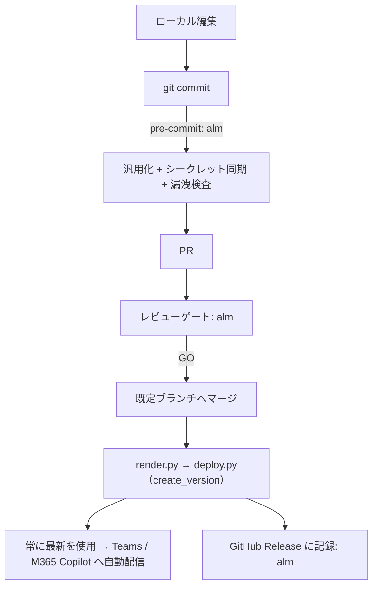

# Foundry エージェント × Agent 365 公開スキル

Microsoft Foundry 上のエージェントを**コードファースト**（SDK / REST のみ、ポータル自動操作なし）で
定義・デプロイし、**Agent 365 のエージェント ID ブループリント**と Teams アプリパッケージを通じて
Teams / Microsoft 365 Copilot に公開するまでを一貫して行う。

| 原則 | 内容 |
|---|---|
| SDK / REST のみ | すべて `azure-ai-projects` SDK と Agent 365 CLI（`a365`）で完結。ポータルのブラウザ自動操作は行わない |
| ルート選択 | **ライト実装（PoC）**と**本格実装（本番運用）**を最初に選ぶ。PoC に CI/CD 一式を強制しない |
| テンプレート駆動 | コミットするのは `${VAR}` 入りテンプレートだけ。実値は `.env` / CI のシークレットストアのみ |
| ALM は委譲 | 秘匿化・汎用化・pre-commit・CI/CD・レビューゲート・リリース記録は **`alm` スキル**が担当する |
| インスタンス化 | インストールごとに専用の Entra Agent ID を持たせるには Agent 365 ブループリント + `agenticUserTemplates` が必須 |
| 自動配信 | Foundry の「常に最新を使用」により、新バージョンは Teams / M365 Copilot へ自動配信される |

> 前提ツール: Python 3.10+、Azure CLI（`az`、ログイン済み）、Agent 365 CLI（`a365`）、Git。
> 本格実装の CI/CD ・秘匿化は **`alm` スキル** に従う → [`alm`](../alm/SKILL.md)。
> 参考: [アーキテクチャ（2 種類のブループリント）](references/architecture.md) /
> [ライト実装（PoC）クイックスタート](references/poc-quickstart.md) /
> [複数の名前付きエージェント（チーム）を構築する標準パターン](references/team-pattern.md) /
> [Agent 365 CLI 運用](references/a365-cli.md) /
> [異常系・トラブルシュート](references/troubleshooting.md)

## 実装ルートの選択（ライト / 本格）

`architecture` スキルの AskUserQuestion で選択済みならその結果に従う。未選択なら Step 0 で確認する。

| 観点 | ライト実装（PoC） | 本格実装（本番運用） |
|---|---|---|
| 目的 | まず Teams で動かして価値を検証する | 継続的に運用・改善する |
| 公開形態 | 共有エージェント（`agenticUserTemplates` なし） | インスタンス化（Agent 365 ブループリント + `agenticUserTemplates`） |
| リポジトリ | 任意（ローカルのみでも可） | **private リポジトリ必須**（GitHub / Azure DevOps Repos / その他 Git） |
| 秘匿値 | ローカル `.env` のみ（`SECRET_BACKEND=none`） | `.env` + CI のシークレットストア（`SECRET_BACKEND`） |
| デプロイ | ローカルから `deploy.py` を手動実行 | CI/CD（秘匿化ゲート + Agent Evals + 承認ゲート） |
| 実施する Step | 0 → 1 → 2 → 3 → 4 → 5 → 6 →（(b) を選んだ場合のみ 8 → 9 → 10） | Step 0 〜 12 のすべて（Step 6 では必ず (b) を選ぶ） |

> ライト実装は **Step 7（Agent 365 ブループリント）と Step 11（CI/CD）を省略**する最短ルート。
> 検証が済んだら**その 2 Step を後から追加するだけ**で本格実装へ昇格できる（作り直し不要）。
> 省略ルートの要約は [references/poc-quickstart.md](references/poc-quickstart.md)。
> **Step 6（公開範囲の確認）はライト実装・本格実装のどちらでも必ず実施する。**

> **複数の名前付きエージェント（例: 役割の異なる 3 体が 1 チームとして協働する「AI 社員」構成）**を
> 作りたい場合は、上記 Step 0〜12 をエージェントごとに横展開する。フォルダ構成・`.env` の分離・
> ブループリント共有・エージェント間連携の制約は
> [references/team-pattern.md](references/team-pattern.md) を参照。

## スキル同梱スクリプト（再利用）

すべて汎用化済み。値は引数または `.env`（[references/.env.example](references/.env.example)）から取得する。

| スクリプト | 用途 | Step |
|---|---|---|
| [scripts/discover_foundry_context.py](scripts/discover_foundry_context.py) | ARM REST（`auth_helper.py` のトークン）で Azure サブスクリプション・Foundry アカウント・プロジェクトを自動検出し `.env` に書き込む（ポータル手入力不要） | 3 |
| [scripts/create_blueprint.py](scripts/create_blueprint.py) | Foundry のマネージド ID ブループリントを作成／一覧／表示（REST 直呼び） | 4 |
| [scripts/create_instance.py](scripts/create_instance.py) | manifest / definition / blueprint の 3 モードでエージェントを作成 | 5 |
| [scripts/deploy.py](scripts/deploy.py) | レンダリング済み manifest から新しいバージョンを `create_version` | 5, 10 |
| [scripts/build_teams_package.py](scripts/build_teams_package.py) | Teams manifest + アイコン + agenticUser を ZIP 化 | 8 |
| [scripts/publish_teams_app.py](scripts/publish_teams_app.py) | Microsoft Graph（`appCatalogs/teamsApps`）でビルド済み ZIP を組織アプリカタログへ登録・更新（手動アップロード不要） | 9 |

ALM 共通スクリプト（`render.py` / `sanitize.py` / `check_secrets.py` / `review_sanitization.py` /
`gate_rules.py` / `review_report.py`）は **`alm` スキル**が提供する
→ [`alm/scripts`](../alm/SKILL.md#スキル同梱スクリプト)。

## 標準フォルダ構成（生成されるテーマ側）

```
<repo-root>/
├── .env                          # 実値（.gitignore 済み）
├── .env.example                  # プレースホルダーのみ（コミット対象）
├── .githooks/pre-commit          # 汎用化 → Secrets 同期 → 漏洩検査（本格実装）
├── <CI 定義>                     # 本格実装のみ。Git ホスティングに応じて選択（Step 0）
│   ├── .github/workflows/        #   GitHub  : review.yml / deploy.yml
│   └── .azuredevops/             #   Azure DevOps: azure-pipelines.yml / templates/
├── agents/<agent-name>/
│   ├── agent.template.yaml       # コミット対象（${VAR} 入り）
│   └── agent.yaml                # レンダリング結果（.gitignore 済み）
├── teams/
│   ├── manifest.template.json    # コミット対象
│   ├── agenticUser.template.json # コミット対象（インスタンス化時）
│   └── <agent-name>-teams-app.zip# ビルド結果（.gitignore 済み）
├── assets/agent-icon.png         # アイコン元画像（正方形・背景透過）
└── scripts/                      # 本スキルの scripts/ をコピー
```

> ライト実装では `.githooks/` と CI 定義を作らない（`.env` を `.gitignore` するだけでよい）。

## ワークフロー（正常系）

### Step 0: 実装レベルとリポジトリ形態を決める

1. **ライト実装（PoC）か本格実装か**を AskUserQuestion で確認する
   （`architecture` スキルで選択済みならその結果を使い、重複して聞かない）。
2. 本格実装なら **Git ホスティング**を確認し、CI とシークレット保管先を決める。
   エージェント定義は業務知識を含むため、**private リポジトリを前提**とする。

| Git ホスティング | CI | シークレット保管先 | `GIT_PROVIDER` | `SECRET_BACKEND` |
|---|---|---|---|---|
| GitHub（private） | GitHub Actions | GitHub Actions Secrets | `github` | `github` |
| Azure DevOps Repos（private） | Azure Pipelines | 変数グループ（Key Vault 連携可） | `azure-devops` | `azure-devops` |
| その他 Git（GitLab / Bitbucket / 自己ホスト） | 各 CI | Azure Key Vault | `other` | `keyvault` |
| ライト実装 | なし | ローカル `.env` のみ | （任意） | `none` |

3. 決めた値を `.env` の `IMPLEMENTATION_MODE` / `GIT_PROVIDER` / `SECRET_BACKEND` に設定する。
   → CI 定義の雛形と認証の差異は **`alm` スキル**の
   [CI / Git ホスティング別の構成](../alm/references/ci-providers.md)。

### Step 1: 公開形態を決める

1. **共有エージェント**（全ユーザーが同じ 1 体を使う）か、
   **インスタンス化エージェント**（インストールごとに専用の Entra Agent ID を持つ）かを確認する。
   **ライト実装では常に共有エージェント**とし、Step 7 を省略する。
2. インスタンス化する場合のみ Agent 365 ブループリント（Step 7）と `agenticUserTemplates` が必要になる。
   → 詳細は [references/architecture.md](references/architecture.md)。
3. エージェント名（kebab-case、Teams 表示名とは別）を決める。
   エージェント名を3件 AskUserQuestion にて提案する。ここでのエージェント名は独自性のあるものとし、**商標・著作権に触れる名称やキャラクターを使用してはならない**。

### Step 2: リポジトリを scaffold する

リポジトリの雛形（`.gitignore` / hook / CI 定義）は **`alm` スキル**が定義する
→ [リポジトリ scaffold](../alm/references/repo-scaffold.md)。

```powershell
# エージェント固有のスクリプトとテンプレート
Copy-Item .github/skills/agent365/scripts -Destination scripts -Recurse
# ALM 共通スクリプト（render / sanitize / check_secrets / レビューゲート）
Copy-Item .github/skills/alm/scripts/*.py -Destination scripts
Copy-Item .github/skills/agent365/references/templates/agent.template.yaml agents/<agent-name>/
Copy-Item .github/skills/agent365/references/templates/manifest.template.json teams/
Copy-Item .github/skills/agent365/references/templates/agenticUser.template.json teams/
Copy-Item .github/skills/agent365/references/.env.example .env.example
git config core.hooksPath .githooks   # 本格実装のみ
pip install -r requirements.txt   # azure-ai-projects / azure-identity / PyYAML / Pillow / requests
```

`.gitignore` には最低限 `.env` / `agents/**/agent.yaml` / `teams/*.zip` / `a365.generated.config.json`
/ `*token-cache*` を追加する（[完全版](../alm/references/repo-scaffold.md)）。
本格実装では Step 0 で選んだ Git ホスティングの CI 定義と `alm.config.json` も配置する
（[`alm`](../alm/SKILL.md)）。**ライト実装では `.githooks/` と CI 定義を作らない**。

### Step 3: Foundry プロジェクトと `.env` を用意する

```powershell
Copy-Item .env.example .env
python scripts/discover_foundry_context.py --write .env
```

1. `scripts/discover_foundry_context.py` が ARM REST（`auth_helper.py` の
   `get_token(scope="https://management.azure.com/.default")`）で Azure サブスクリプション・
   Foundry アカウント（Cognitive Services、`kind=AIServices`）・プロジェクトを自動検出し、
   `AZURE_SUBSCRIPTION_ID` / `AZURE_TENANT_ID` / `AZURE_RESOURCE_GROUP` / `AZURE_AI_ACCOUNT` /
   `AZURE_AI_PROJECT` / `FOUNDRY_PROJECT_ENDPOINT` を `.env` に書き込む。
   ポータルでの手入力は不要。
2. 候補が複数ある場合（サブスクリプション・Foundry アカウント・プロジェクトが複数見つかる場合）は、
   候補一覧を表示して停止する。`--subscription-id` / `--account` / `--project` で絞り込む。
3. `az login` 済みであることを確認する。`discover_foundry_context.py` は `auth_helper.py` の
   `DeviceCodeCredential`（`az login` とは別の認証フロー・初回のみデバイスコードサインインが必要）を
   使うが、Step 4 以降の `create_blueprint.py` / `create_instance.py` / `deploy.py` は
   `DefaultAzureCredential`（`az login` 済みの資格情報を利用）で Foundry を呼ぶため、
   結局どちらも必要になる。

> **`.env` は絶対にコミットしない**。
> 複数の名前付きエージェント（チーム）を作る場合の `.env` 分離・共有値のコピー方は
> [references/team-pattern.md](references/team-pattern.md) を参照。

### Step 4: Foundry のマネージド ID ブループリントを作成する

エージェントのマネージド ID の設計図。**`lifecycle=Manual` で作れば複数エージェントから共有できる**
（エージェントが暗黙に作る `Auto` は所有者専用で共有不可）。

```powershell
python scripts/create_blueprint.py --name <blueprint-name>          # lifecycle=Manual
python scripts/create_blueprint.py --list
python scripts/create_blueprint.py --name <blueprint-name> --show
```

出力された `blueprintId` / `principalId` / `clientId` を `.env` の
`BLUEPRINT_ID` / `BLUEPRINT_PRINCIPAL_ID` / `BLUEPRINT_CLIENT_ID` に設定する。

### Step 5: エージェントを定義してデプロイする

1. `agents/<agent-name>/agent.template.yaml` の `definition`（`model` / `instructions` / `tools`）を編集する。
   ARM リソース参照は必ず `${AZURE_SUBSCRIPTION_ID}` 等のプレースホルダーで書く。
2. レンダリングしてデプロイする。

```powershell
python scripts/render.py --agent <agent-name>
python scripts/create_instance.py --name <agent-name> --mode blueprint --blueprint-id <blueprint-name>
# 2 回目以降のバージョン更新
python scripts/deploy.py --agent <agent-name>
```

| モード | SDK API | 用途 |
|---|---|---|
| `manifest` | `agents.create_version_from_manifest` | 公開済みテンプレート ID + パラメーター値で作成 |
| `definition` | `agents.create_version` | テンプレート定義を複製して独立エージェント化 |
| `blueprint` | `agents.create_version(blueprint_reference=...)` | ブループリント共有（`lifecycle=Manual` 必須） |

作成後、`INSTANCE_IDENTITY_PRINCIPAL_ID` / `INSTANCE_IDENTITY_CLIENT_ID` / `AGENT_GUID` を `.env` へ反映する。

### Step 6: 公開範囲を確認する（テンプレート公開のみ / デジタル従業員として実配信）

Step 5 までで Foundry 上にエージェントは実際に動作する状態になるが、**Teams / Microsoft 365
管理センター（`https://admin.cloud.microsoft/?#/agents/all`）にはまだ表示されない**。
そこに「デジタル従業員」として一覧表示され、実際に Teams から使える状態にするには
Step 8〜10（Azure Bot Service → Teams パッケージ → Graph API 公開）が必要になる。
この先は **Azure Bot Service の課金**と**テナント全体への公開**を伴うため、
**不明瞭な場合は必ず AskUserQuestion で利用者に確認してから Step 7 以降に進む。**

> AskUserQuestion で提示する質問（複数の名前付きエージェントの場合は**エージェントごとに個別に確認する**）:

| 質問 | 選択肢 |
|---|---|
| Step 5 で作成したエージェントテンプレートを、実際に「デジタル従業員」として Teams / M365 管理センターにデプロイしますか？ | **(a) いいえ、テンプレート公開のみでよい**（ここで作業を終える。Step 8〜11 は実施しない）<br>**(b) はい、実配信する**（Step 7〜10 を続けて実施する） |

- **(a) を選んだ場合**: ここで作業を止める。`agents/<agent-name>/agent.template.yaml` がコミットされ、
  Foundry 上にエージェントバージョンが稼働している状態が最終成果物。
  `admin.cloud.microsoft/?#/agents/all` に表示されないのは想定どおりの挙動（Step 10 の
  Teams 公開を経て初めて表示される）。
- **(b) を選んだ場合**: Step 1 の判断（共有 / インスタンス化）に従って
  Step 7（インスタンス化する場合のみ）→ Step 8 → Step 9 → Step 10 と進める。

### Step 7: Agent 365 のエージェント ID ブループリントを作成する

インストールごとの専用 Entra Agent ID が必要な場合のみ実施する（Step 1 の判断）。
**ライト実装ではこの Step を飛ばす**（共有エージェントとして公開する）。
**Foundry のブループリントとは別物**なので混同しない。

```powershell
a365 setup blueprint -n <agent-name> --no-endpoint
```

- 生成された `a365.generated.config.json` の `agentBlueprintId` を `.env` の
  `A365_AGENT_BLUEPRINT_ID` に設定する（このファイル自体は `.gitignore` 済み）。
- 実行のたびに**クライアントシークレットが平文で標準出力される**。ログに残さない。
- 初回はディレクトリ伝播の遅延で失敗することがあるが、**同じコマンドを再実行すれば冪等に修復される**。
- Windows での認証（WAM）まわりのハマりどころは [references/a365-cli.md](references/a365-cli.md)。

### Step 8: Azure Bot Service と Teams チャネルを作成する

Bot の `msaAppId` には**エージェントのインスタンス ID の client id** を使う。

```powershell
az bot create --resource-group $env:AZURE_RESOURCE_GROUP --name $env:AZURE_BOT_NAME `
  --app-type SingleTenant --appid $env:INSTANCE_IDENTITY_CLIENT_ID --tenant-id $env:AZURE_TENANT_ID `
  --endpoint "$env:FOUNDRY_PROJECT_ENDPOINT/agents/$env:AGENT_NAME/endpoint/protocols/activityprotocol?api-version=2025-11-15-preview" `
  --sku S1
az bot msteams create --resource-group $env:AZURE_RESOURCE_GROUP --name $env:AZURE_BOT_NAME
```

### Step 9: Teams アプリパッケージをビルドする

```powershell
python scripts/build_teams_package.py
```

- `assets/agent-icon.png` から `color.png`（192x192）と `outline.png`（32x32・白シルエット）を自動生成する。
  元画像は**アルファチャンネル付きの正方形 PNG**にする（背景が不透明だと outline が塗り潰しになる）。
- `A365_AGENT_BLUEPRINT_ID` が設定されていれば `agenticUser.json` を同梱し、
  `manifestVersion: devPreview` のインスタンス化パッケージを生成する。
  未設定なら GA スキーマ（1.22）の**共有エージェント**パッケージに自動ダウングレードして警告を出す。
- **再アップロードのたびに `.env` の `TEAMS_APP_VERSION` を上げる**（同一バージョンはアップロード時に拒否される）。

### Step 10: Graph API で公開する（API/SDK のみ・手動アップロード不要）

```powershell
python scripts/publish_teams_app.py
# 管理者レビューを経て公開する場合（Teams 管理者ロールが無いユーザーはこちら）
python scripts/publish_teams_app.py --requires-review
```

1. Microsoft Graph の `POST /appCatalogs/teamsApps`（新規）または
   `POST /appCatalogs/teamsApps/{id}/appDefinitions`（既存アプリの新バージョン）を呼び、
   Teams / Microsoft 365 管理センターへの手動アップロードを不要にする。
   認証は `auth_helper.py` の `get_token(scope="https://graph.microsoft.com/.default")`
   （DeviceCodeCredential + 永続キャッシュ）を再利用する。
2. これらの Graph API は **Delegated 権限のみ対応**（Application 権限は不可）。
   テナントで `AppCatalog.ReadWrite.All` の同意が必要。`--requires-review` 無しで
   即時公開するには実行ユーザーが Teams 管理者ロールを持つ必要がある
   （無い場合は `--requires-review` で申請する）。
3. Teams でエージェントを開き、利用者ごとのセッション（インスタンス）が開始されることを確認する。

> **ライト実装はここで完了**。以降の Step 11 は本格実装のみ実施する。
> ライト実装のまま運用する場合も、`.env` をコミットしていないことを Step 12 で必ず確認する。

### Step 11: CI/CD と秘匿化ゲートを有効化する（本格実装のみ）

この Step は **`alm` スキル** が担当する → [`alm`](../alm/SKILL.md)。
エージェント側から渡す情報は次の 3 点だけ。

1. **`alm.config.json`**（[例](../alm/alm.config.example.json)）でエージェントのレイアウトを宣言する。

   | キー | 値 |
   |---|---|
   | `templates` | `agents/**/*.template.yaml`, `teams/*.template.json` |
   | `rendered` | `agents/**/agent.yaml` |
   | `artifacts` | `teams/*.zip` |
   | `forbidden_tracked` | `.env`, `a365.generated.config.json`, `auth-token.json` |
   | `non_secret_vars` | `AGENT_NAME`, `BLUEPRINT_ID` などの公開識別子 |

2. **デプロイ手順**: パイプラインの deploy ジョブを次の 2 ステップに差し替える。

   ```yaml
   - name: Render agent.yaml from the template and secrets
     run: python scripts/render.py --template agents/<name>/agent.template.yaml \
       --output agents/<name>/agent.yaml
   - name: Deploy a new agent version to Foundry
     id: deploy
     run: python scripts/deploy.py --manifest agents/<name>/agent.yaml
   ```

3. **Azure ロール**: OIDC のアプリ登録に Foundry プロジェクトへのロール
   （Azure AI Developer / Cognitive Services User 等）を付与する。

`deploy.py` は作成したバージョンを `GITHUB_OUTPUT` へ出力するので、
`alm` の release ジョブが `agent-v<version>` タグでリリースを作成・更新できる。



### Step 12: 検証する

```powershell
python scripts/review_sanitization.py       # Pass であること
python scripts/create_blueprint.py --list   # ブループリントの存在確認
git status --short                          # .env / agent.yaml / *.zip が未追跡であること
```

[検証チェックリスト](#検証チェックリスト) を上から確認する。

## 検証チェックリスト

### 共通（ライト実装も必須）

- [ ] Step 0 で**ライト実装 / 本格実装**を確定し、`.env` の `IMPLEMENTATION_MODE` に反映した
- [ ] Step 6 で**テンプレート公開のみ / デジタル従業員として実配信**を AskUserQuestion で確定した
      （不明瞭なまま Step 7 以降へ進んでいない）
- [ ] `.env` / `agents/**/agent.yaml` / `teams/*.zip` / `a365.generated.config.json` が追跡されていない
- [ ] `agent.template.yaml` / `*.template.json` に実 GUID・ARM パス・接続文字列が無い（`${VAR}` 化済み）
- [ ] `.env.example` にすべての変数がプレースホルダー付きで定義されている
- [ ] `AGENT_NAME` / `BLUEPRINT_ID` 等の公開識別子が `NON_SECRET_VARS` に入っている
- [ ] Foundry ブループリントと Agent 365 ブループリントを取り違えていない
- [ ] Teams 再アップロード前に `TEAMS_APP_VERSION` を上げた
- [ ] アイコン元画像がアルファチャンネル付きの正方形 PNG
- [ ] Teams / M365 Copilot での動作確認が済んでいる

### 本格実装のみ

- [ ] private リポジトリで運用している（GitHub / Azure DevOps Repos / その他 Git）
- [ ] `GIT_PROVIDER` / `SECRET_BACKEND` が Step 0 の選択と一致している
- [ ] インスタンス化する場合、manifest に `agenticUserTemplates` と `functionsAs: agenticUserOnly` がある
- [ ] `alm.config.json` にエージェントのレイアウト（templates / rendered / artifacts）を宣言した
- [ ] **`alm` スキル**の検証チェックリストを満たしている → [`alm`](../alm/SKILL.md#検証チェックリスト)

## 参考リンク

- [ALM（秘匿化・汎用化・CI/CD）共通スキル](../alm/SKILL.md)
- [ライト実装（PoC）クイックスタート](references/poc-quickstart.md)
- [アーキテクチャ（2 種類のブループリント・スキーマ選択）](references/architecture.md)
- [Agent 365 CLI 運用（Windows / WAM / 権限）](references/a365-cli.md)
- [異常系・トラブルシュート](references/troubleshooting.md)
- [環境変数サンプル](references/.env.example)
