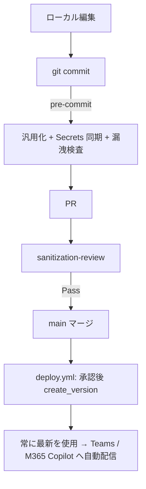

# Foundry エージェント × Agent 365 公開スキル

Microsoft Foundry 上のエージェントを**コードファースト**（SDK / REST のみ、ポータル自動操作なし）で
定義・デプロイし、**Agent 365 のエージェント ID ブループリント**と Teams アプリパッケージを通じて
Teams / Microsoft 365 Copilot に公開するまでを一貫して行う。

| 原則 | 内容 |
|---|---|
| SDK / REST のみ | すべて `azure-ai-projects` SDK と Agent 365 CLI（`a365`）で完結。ポータルのブラウザ自動操作は行わない |
| テンプレート駆動 | コミットするのは `${VAR}` 入りテンプレートだけ。実値は `.env` / GitHub Secrets のみ |
| 機械検証 | 秘匿化・汎用化は `review_sanitization.py` が CI で Pass/Fail 判定。人手のレビューに依存しない |
| インスタンス化 | インストールごとに専用の Entra Agent ID を持たせるには Agent 365 ブループリント + `agenticUserTemplates` が必須 |
| 自動配信 | Foundry の「常に最新を使用」により、新バージョンは Teams / M365 Copilot へ自動配信される |

> 前提ツール: Python 3.10+、Azure CLI（`az`、ログイン済み）、GitHub CLI（`gh`、認証済み）、
> Agent 365 CLI（`a365`）、Git。
> 参考: [アーキテクチャ（2 種類のブループリント）](references/architecture.md) /
> [Agent 365 CLI 運用](references/a365-cli.md) /
> [リポジトリ scaffold](references/repo-scaffold.md) /
> [異常系・トラブルシュート](references/troubleshooting.md)

## スキル同梱スクリプト（再利用）

すべて汎用化済み。値は引数または `.env`（[references/.env.example](references/.env.example)）から取得する。

| スクリプト | 用途 | Step |
|---|---|---|
| [scripts/render.py](scripts/render.py) | テンプレートの `${VAR}` を環境変数で解決して実ファイルを生成 | 4 |
| [scripts/create_blueprint.py](scripts/create_blueprint.py) | Foundry のマネージド ID ブループリントを作成／一覧／表示（REST 直呼び） | 3 |
| [scripts/create_instance.py](scripts/create_instance.py) | manifest / definition / blueprint の 3 モードでエージェントを作成 | 4 |
| [scripts/deploy.py](scripts/deploy.py) | レンダリング済み manifest から新バージョンを `create_version` | 4, 9 |
| [scripts/build_teams_package.py](scripts/build_teams_package.py) | Teams manifest + アイコン + agenticUser を ZIP 化 | 7 |
| [scripts/sanitize.py](scripts/sanitize.py) | 実値入り manifest を `${VAR}` 化し GitHub Secrets へ同期 | 9 |
| [scripts/check_secrets.py](scripts/check_secrets.py) | ステージ済み差分への実値混入を検査（pre-commit） | 9 |
| [scripts/review_sanitization.py](scripts/review_sanitization.py) | 秘匿化・汎用化の決定論レビューゲート（CI 必須チェック） | 9, 10 |

## 標準フォルダ構成（生成されるテーマ側）

```
<repo-root>/
├── .env                          # 実値（.gitignore 済み）
├── .env.example                  # プレースホルダーのみ（コミット対象）
├── .githooks/pre-commit          # 汎用化 → Secrets 同期 → 漏洩検査
├── .github/workflows/
│   ├── review.yml                # sanitization-review（必須チェック）
│   └── deploy.yml                # render → 承認 → create_version
├── agents/<agent-name>/
│   ├── agent.template.yaml       # コミット対象（${VAR} 入り）
│   └── agent.yaml                # レンダリング結果（.gitignore 済み）
├── teams/
│   ├── manifest.template.json    # コミット対象
│   ├── agenticUser.template.json # コミット対象
│   └── <agent-name>-teams-app.zip# ビルド結果（.gitignore 済み）
├── assets/agent-icon.png         # アイコン元画像（正方形・背景透過）
└── scripts/                      # 本スキルの scripts/ をコピー
```

## ワークフロー（正常系）

### Step 0: 公開形態を決める

1. **共有エージェント**（全ユーザーが同じ 1 体を使う）か、
   **インスタンス化エージェント**（インストールごとに専用の Entra Agent ID を持つ）かを確認する。
2. インスタンス化する場合のみ Agent 365 ブループリント（Step 5）と `agenticUserTemplates` が必要になる。
   → 詳細は [references/architecture.md](references/architecture.md)。
3. エージェント名（kebab-case、Teams 表示名とは別）を決める。
   **商標・著作権に触れる名称やキャラクターを流用しない**（後から改称すると識別子の総入れ替えになる）。

### Step 1: リポジトリを scaffold する

[references/repo-scaffold.md](references/repo-scaffold.md) の内容をそのまま配置する。

```powershell
# 本スキルの scripts/ とテンプレートをテーマリポジトリへコピー
Copy-Item .github/skills/agent365/scripts -Destination scripts -Recurse
Copy-Item .github/skills/agent365/references/templates/agent.template.yaml agents/<agent-name>/
Copy-Item .github/skills/agent365/references/templates/manifest.template.json teams/
Copy-Item .github/skills/agent365/references/templates/agenticUser.template.json teams/
Copy-Item .github/skills/agent365/references/.env.example .env.example
git config core.hooksPath .githooks
pip install -r requirements.txt   # azure-ai-projects / azure-identity / PyYAML / Pillow
```

`.gitignore` には最低限 `.env` / `agents/**/agent.yaml` / `teams/*.zip` / `a365.generated.config.json`
/ `*token-cache*` を追加する（[references/repo-scaffold.md](references/repo-scaffold.md) に完全版）。

### Step 2: Foundry プロジェクトと `.env` を用意する

1. Foundry プロジェクトのエンドポイント（`https://<account>.services.ai.azure.com/api/projects/<project>`）を
   プロジェクト概要から取得する。
2. `.env.example` を `.env` にコピーし、実値を設定する。**`.env` は絶対にコミットしない**。
3. `az login` 済みであることを確認する（`DefaultAzureCredential` が使用する）。

```powershell
Copy-Item .env.example .env
az account set --subscription $env:AZURE_SUBSCRIPTION_ID
```

### Step 3: Foundry のマネージド ID ブループリントを作成する

エージェントのマネージド ID の設計図。**`lifecycle=Manual` で作れば複数エージェントから共有できる**
（エージェントが暗黙に作る `Auto` は所有者専用で共有不可）。

```powershell
python scripts/create_blueprint.py --name <blueprint-name>          # lifecycle=Manual
python scripts/create_blueprint.py --list
python scripts/create_blueprint.py --name <blueprint-name> --show
```

出力された `blueprintId` / `principalId` / `clientId` を `.env` の
`BLUEPRINT_ID` / `BLUEPRINT_PRINCIPAL_ID` / `BLUEPRINT_CLIENT_ID` に設定する。

### Step 4: エージェントを定義してデプロイする

1. `agents/<agent-name>/agent.template.yaml` の `definition`（`model` / `instructions` / `tools`）を編集する。
   ARM リソース参照は必ず `${AZURE_SUBSCRIPTION_ID}` 等のプレースホルダーで書く。
2. レンダリングしてデプロイする。

```powershell
python scripts/render.py --agent <agent-name>
python scripts/create_instance.py --name <agent-name> --mode blueprint --blueprint-id <blueprint-name>
# 2 回目以降のバージョン更新
python scripts/deploy.py --agent <agent-name>
```

| モード | SDK API | 用途 |
|---|---|---|
| `manifest` | `agents.create_version_from_manifest` | 公開済みテンプレート ID + パラメーター値で作成 |
| `definition` | `agents.create_version` | テンプレート定義を複製して独立エージェント化 |
| `blueprint` | `agents.create_version(blueprint_reference=...)` | ブループリント共有（`lifecycle=Manual` 必須） |

作成後、`INSTANCE_IDENTITY_PRINCIPAL_ID` / `INSTANCE_IDENTITY_CLIENT_ID` / `AGENT_GUID` を `.env` へ反映する。

### Step 5: Agent 365 のエージェント ID ブループリントを作成する

インストールごとの専用 Entra Agent ID が必要な場合のみ実施する（Step 0 の判断）。
**Foundry のブループリントとは別物**なので混同しない。

```powershell
a365 setup blueprint -n <agent-name> --no-endpoint
```

- 生成された `a365.generated.config.json` の `agentBlueprintId` を `.env` の
  `A365_AGENT_BLUEPRINT_ID` に設定する（このファイル自体は `.gitignore` 済み）。
- 実行のたびに**クライアントシークレットが平文で標準出力される**。ログに残さない。
- 初回はディレクトリ伝播の遅延で失敗することがあるが、**同じコマンドを再実行すれば冪等に修復される**。
- Windows での認証（WAM）まわりのハマりどころは [references/a365-cli.md](references/a365-cli.md)。

### Step 6: Azure Bot Service と Teams チャネルを作成する

Bot の `msaAppId` には**エージェントのインスタンス ID の client id** を使う。

```powershell
az bot create --resource-group $env:AZURE_RESOURCE_GROUP --name $env:AZURE_BOT_NAME `
  --app-type SingleTenant --appid $env:INSTANCE_IDENTITY_CLIENT_ID --tenant-id $env:AZURE_TENANT_ID `
  --endpoint "$env:FOUNDRY_PROJECT_ENDPOINT/agents/$env:AGENT_NAME/endpoint/protocols/activityprotocol?api-version=2025-11-15-preview" `
  --sku S1
az bot msteams create --resource-group $env:AZURE_RESOURCE_GROUP --name $env:AZURE_BOT_NAME
```

### Step 7: Teams アプリパッケージをビルドする

```powershell
python scripts/build_teams_package.py
```

- `assets/agent-icon.png` から `color.png`（192x192）と `outline.png`（32x32・白シルエット）を自動生成する。
  元画像は**アルファチャンネル付きの正方形 PNG**にする（背景が不透明だと outline が塗り潰しになる）。
- `A365_AGENT_BLUEPRINT_ID` が設定されていれば `agenticUser.json` を同梱し、
  `manifestVersion: devPreview` のインスタンス化パッケージを生成する。
  未設定なら GA スキーマ（1.22）の**共有エージェント**パッケージに自動ダウングレードして警告を出す。
- **再アップロードのたびに `.env` の `TEAMS_APP_VERSION` を上げる**（同一バージョンはアップロード時に拒否される）。

### Step 8: アップロードして公開する

1. Microsoft 365 管理センター（Agent 365 の Agents 画面）または Teams 管理センター >
   アプリを管理 > アップロード で、生成された ZIP を登録する。
2. 組織向けのアクセス許可・公開範囲を設定する。
3. Teams でエージェントを開き、利用者ごとのセッション（インスタンス）が開始されることを確認する。

### Step 9: CI/CD と秘匿化ゲートを有効化する

1. **pre-commit**: `sanitize.py`（実値 → `${VAR}` 化 + GitHub Secrets 同期 + ステージ）→
   `check_secrets.py`（ステージ差分の漏洩検査）を実行する。
2. **`review.yml`**: PR と main で `review_sanitization.py` を実行し、必須ステータスチェックにする。
3. **`deploy.yml`**: main マージで `render.py` → OIDC ログイン（`azure/login@v2`）→ `deploy.py`。
   `environment: production` の承認ゲートを付ける。
4. GitHub Secrets には `.env` の秘匿値一式に加え、OIDC 用の `AZURE_CLIENT_ID` / `AZURE_TENANT_ID` を登録する。



### Step 10: 検証する

```powershell
python scripts/review_sanitization.py       # Pass であること
python scripts/create_blueprint.py --list   # ブループリントの存在確認
git status --short                          # .env / agent.yaml / *.zip が未追跡であること
```

[検証チェックリスト](#検証チェックリスト) を上から確認する。

## 検証チェックリスト

- [ ] `.env` / `agents/**/agent.yaml` / `teams/*.zip` / `a365.generated.config.json` が追跡されていない
- [ ] `agent.template.yaml` / `*.template.json` に実 GUID・ARM パス・接続文字列が無い（`${VAR}` 化済み）
- [ ] `.env.example` にすべての変数がプレースホルダー付きで定義されている
- [ ] `AGENT_NAME` / `BLUEPRINT_ID` 等の公開識別子が `NON_SECRET_VARS` に入っている
- [ ] Foundry ブループリントと Agent 365 ブループリントを取り違えていない
- [ ] インスタンス化する場合、manifest に `agenticUserTemplates` と `functionsAs: agenticUserOnly` がある
- [ ] Teams 再アップロード前に `TEAMS_APP_VERSION` を上げた
- [ ] アイコン元画像がアルファチャンネル付きの正方形 PNG
- [ ] `review_sanitization.py` が Pass、`deploy.yml` に承認ゲートがある
- [ ] Teams / M365 Copilot での動作確認が済んでいる

## 参考リンク

- [アーキテクチャ（2 種類のブループリント・スキーマ選択）](references/architecture.md)
- [Agent 365 CLI 運用（Windows / WAM / 権限）](references/a365-cli.md)
- [リポジトリ scaffold（.gitignore / hook / workflows）](references/repo-scaffold.md)
- [異常系・トラブルシュート](references/troubleshooting.md)
- [環境変数サンプル](references/.env.example)
