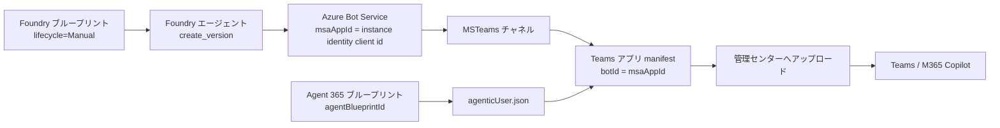

# アーキテクチャ — 2 種類のブループリントと公開経路

## 1. 「ブループリント」は 2 種類ある（最頻出の混同）

| | Foundry マネージド ID ブループリント | Agent 365 エージェント ID ブループリント |
|---|---|---|
| 何の設計図か | エージェントが Azure リソースへアクセスするための**マネージド ID** | インストールごとに払い出す**Entra Agent ID** |
| 識別子 | 名前（例: `your-agent`）。`.env` の `BLUEPRINT_ID` | GUID。`.env` の `A365_AGENT_BLUEPRINT_ID` |
| 作成方法 | `python scripts/create_blueprint.py --name <name>` | `a365 setup blueprint -n <name> --no-endpoint` |
| API | Foundry データプレーン REST `/managedAgentIdentityBlueprints`（`api-version=v1`） | Agent 365 CLI（Entra + Agent 365 サービス） |
| 参照先 | `agent.yaml` の `blueprint_reference` | `teams/agenticUser.template.json` の `agentIdentityBlueprintId` |
| 共有可否 | `lifecycle=Manual` なら複数エージェントで共有可。`Auto` は所有エージェント専用 | インストール単位でインスタンスを払い出す |

**両者は無関係**。Foundry 側のブループリントを作っても Agent 365 のインスタンス化は起きないし、
その逆も成立しない。名前が似ているだけなので、変数名でも常に区別する。

## 2. インスタンスが作られない典型原因

`copilotAgents.customEngineAgents[]` の `functionsAs` の既定値は `agentOnly`
（= 通常のエージェントとしてインストールされるだけ = 全員が同じ 1 体を共有）。
インストールごとに専用の Entra Agent ID を持たせるには、manifest に次の 2 つが**両方**必要。

```jsonc
"copilotAgents": {
  "customEngineAgents": [
    {
      "id": "${INSTANCE_IDENTITY_CLIENT_ID}",
      "type": "bot",
      "functionsAs": "agenticUserOnly",          // ← devPreview のみ
      "agenticUserTemplateId": "${AGENT_NAME}-agentic-user"
    }
  ]
},
"agenticUserTemplates": [                         // ← GA 1.25+ / devPreview
  { "id": "${AGENT_NAME}-agentic-user", "file": "agenticUser.json" }
]
```

## 3. manifest スキーマの選び方

| 目的 | `manifestVersion` | `$schema` | 備考 |
|---|---|---|---|
| インスタンス化エージェント | `devPreview` | `.../teams/vDevPreview/MicrosoftTeams.schema.json` | `functionsAs` / `agenticUserTemplateId` は **devPreview にしか無い**（GA 1.25〜1.29 には存在しない） |
| 共有エージェント | `1.22` | `.../teams/v1.22/MicrosoftTeams.schema.json` | `agenticUserTemplates` と agentic-user 系プロパティを削除する |

`scripts/build_teams_package.py` は `A365_AGENT_BLUEPRINT_ID` の有無でこの 2 つを自動で切り替える。

### agenticUser.json のスキーマ（検証済み）

`https://developer.microsoft.com/json-schemas/teams/vDevPreview/MicrosoftTeams.AgenticUser.schema.json`

- 必須: `id` / `schemaVersion`（`"0.1.0-preview"`）/ `agentIdentityBlueprintId`（GUID）
- 任意: `communicationProtocol`（`"activityProtocol"`）
- `additionalProperties: false`（余計なキーを足すと検証エラー）

## 4. 公開経路の全体像



Bot のエンドポイントは Foundry のエージェント エンドポイント。

```
{FOUNDRY_PROJECT_ENDPOINT}/agents/{AGENT_NAME}/endpoint/protocols/activityprotocol?api-version=2025-11-15-preview
```

## 5. バージョニングと配信

- `deploy.py`（= `agents.create_version`）で作った新バージョンは、
  エージェント エンドポイントの既定「**常に最新を使用**」により Teams / M365 Copilot へ自動配信される。
  ポータルでの有効化操作は不要。
- 一方 **Teams アプリ manifest の内容（名前・説明・アイコン・スコープ）を変えた場合は
  ZIP を再アップロードする必要がある**。この際 `version` を必ず上げる。
- 挙動・プロンプトだけの変更なら Foundry へのデプロイのみでよく、再アップロードは不要。

## 6. なぜポータル自動操作をしないか

- Foundry のエージェント操作は `azure-ai-projects` SDK で完結する。
- SDK の操作グループに無い API（ブループリント）も、認証済みクライアントの
  `AIProjectClient.send_request(HttpRequest(...))` で REST を直接叩ける。
- ブラウザ自動化は壊れやすく CI で再現できないため、最終手段としても採用しない。
