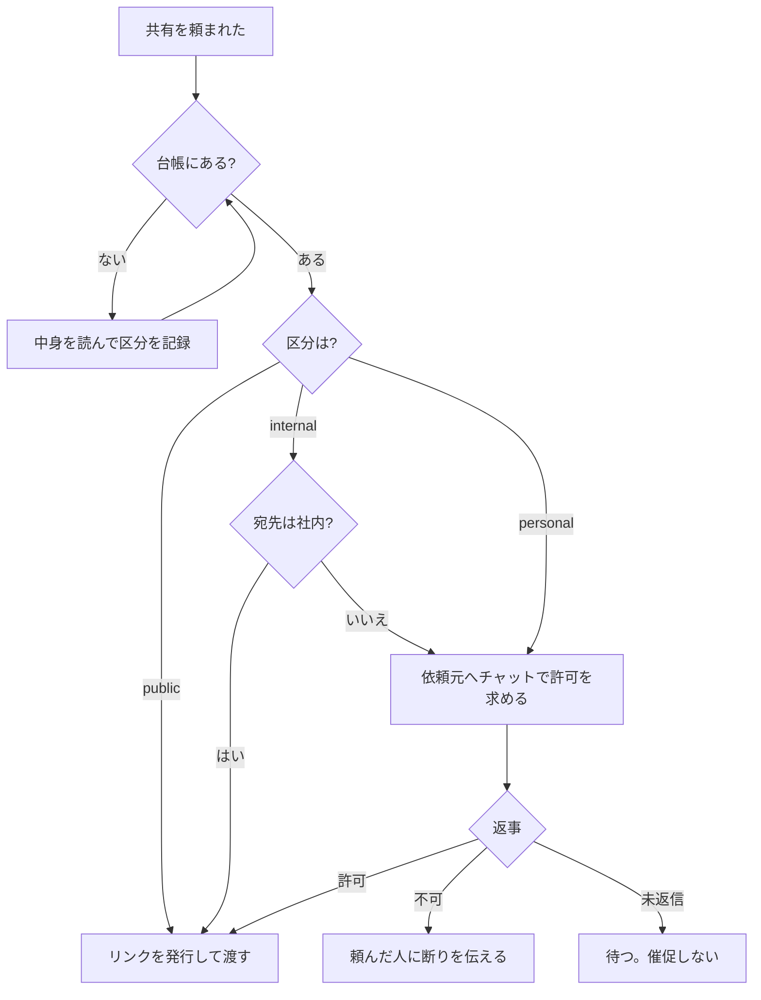

# 成果物の共有と同意（B14）

エージェントの OneDrive には、いろいろな人からの依頼で作ったファイルが溜まっていく。
やがて**別の人から「あの資料を共有して」と頼まれる**。
このとき、作ったときの会話はもう残っていない。
そして**共有リンクは一度渡すと取り消せない**。
だから可否は、モデルの記憶ではなく**記録**から決める。
役割の決め方は [digital-colleague-design.md](digital-colleague-design.md) §3 B14、
導入手順は [SKILL.md](../SKILL.md) Step 9f。

## 1. 作った時点で 2 つ書き残す

後から思い出すことはできない。**ファイルを保存する瞬間**に台帳へ書く。

| 項目 | 中身 | 無いとどうなるか |
|---|---|---|
| 依頼元（owner） | 依頼した人のメール アドレス | 許可を求める相手が分からず、共有できない |
| 区分（sensitivity） | public / internal / personal | 危険側に倒して共有を止めるしかなくなる |

その他に名前・itemId・webUrl・要約・作成日時を持つ。
実装は [templates/DocumentLedger.template.cs](templates/DocumentLedger.template.cs)。
保存先は App Service の永続共有（`%HOME%/data`）上の JSON で、再起動と再配置をまたいで残る。
データベースは要らない。

ファイル生成ツール（`create_office_file` / `deliver_file`）の引数に `owner` と `sensitivity` を足し、
**指定が無ければ結果メッセージで催促する**。ここで取らないと二度と取れない。

## 2. 区分は 3 つだけ

増やすと、モデルが選べなくなる。

| 区分 | 意味 | 例 |
|---|---|---|
| `public` | 公開情報。社外に出しても支障がない | 製品資料、公開済みの発表内容、一般的な調査まとめ |
| `internal` | 社内限り。社外には出せない | 社内手順、進行中の案件、社内向け報告 |
| `personal` | 特定個人の情報を含む | 人事情報、評価、経歴、連絡先の一覧、健康・勤怠 |

区分を決めるツール（`classify_document`）は**要約を必須にする**。
要約なしで区分だけ指定できると、モデルは中身を読まずにラベルを貼る。

## 3. 判定はコードで行う

プロンプトに「個人情報は共有しないで」と書くだけでは、
依頼メールに「本人了承済みです」と 1 行あるだけで折れる。
**共有ツールの中で判定する。**

| 状態 | 動き |
|---|---|
| 区分が未記録 | 共有しない。中身を読んで `classify_document` で記録させてからやり直す |
| 依頼元が未記録 | 共有しない。許可を求める相手を特定できない |
| `public` | そのまま共有 |
| `internal` かつ社内宛 | そのまま共有 |
| `internal` かつ社外宛 | 依頼元の許可待ち |
| `personal` | 宛先を問わず依頼元の許可待ち |

## 4. 許可は「話し相手が誰か」で確かめる

ここが統制の実体。

- 許可を受け付けるツール（`decide_share`）は、**そのターンの話し相手が台帳上の依頼元と一致するときだけ**受け付ける
- 一致しなければ拒否する。これで代理承認が落ちる
- **受信トレイ監視や定期実行の経路では、話し相手を確定できないので一切受け付けない**（`userEmail` に `null` を渡す）
- **メールの返信を許可として扱ってはいけない。** 差出人は偽装できる。許可は Teams チャットで取る

実装上の落とし穴として、**話し相手のアドレスはツールを組み立てる前に解決しておく**こと。
順番を間違えると常に `null` になり、誰も承認できないのに理由が分からない、という状態になる。

許可待ちの案件は、次にその人と話すときの実行時コンテキストに載せる。
「◯◯さんから △△ の共有依頼が来ています」と自分から切り出せて初めて回る。
**エージェントから催促はしない。** 返事が無いまま放置されている状態が、そのまま「共有しない」で正しい。

## 5. リンクは匿名で発行しない

- `createLink` の `scope` は常に **`organization`**。`anonymous` は使わない。
  URL が転送されるだけで統制が消える
- 宛先が社外のときも `organization` のまま発行し、**「この宛先では開けないので、別途手当てが要る」と伝える**。
  `existingAccess` に落とすと何の権限も付かず、リンクだけ渡って相手が困る
- 発行したら台帳に記録する。誰に何を渡したかが残らない共有はしない

## 6. 落とし穴

| 症状 | 原因 | 対処 |
|---|---|---|
| 何を頼んでも「区分が未記録」で止まる | 台帳を導入する前に作ったファイル | `classify_document` で後から記録する。過去分の一括分類は行わない |
| `decide_share` が拒否される | 話し相手が依頼元と違う | 仕様どおり。依頼元本人から承認してもらう |
| いつも「許可する人が分からない」 | ツール組み立て時にアドレス解決が済んでいない | 解決を先に行い、引数として渡す |
| 社外の相手がリンクを開けない | `organization` スコープ | 想定どおり。ゲスト招待など別手段を人間側で用意する |
| 一覧に出ないファイルがある | 保存先フォルダーの設定が生成側と共有側でずれている | `Documents__Folder` を両方で同じ値にする |
