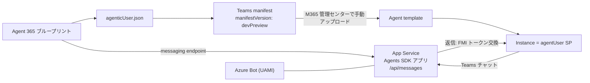

# 自己ホスト エージェント（agentUser チャットを動かす唯一の構成）

Agent 365 の agentUser（同僚アイデンティティ）が Teams で**実際に応答する**ための構成。
2026-08-04 に実機で疎通確認済み。

> Foundry ホストの `activityprotocol` エンドポイントでは**動かない**。
> Agent 365 が送るトークンは `aud` = ブループリント appId / `azp` =
> `5a807f24-c9de-44ee-a3a7-329e88a00ffc` で、Foundry 側はこれを
> 401 `Error parsing client JWT` で拒否し、受理 audience を変更する手段が無い。
> 自前ホストなら `TokenValidation:Audiences` にブループリント appId を足すだけで受理できる。

## 全体像



## 手順

### 1. Azure リソースを作る

```powershell
python scripts/provision_selfhost.py --write .env
```

作られるもの（すべて冪等）:

| リソース | 役割 | 備考 |
|---|---|---|
| ユーザー割り当てマネージド ID | Azure Bot の ID | `msaAppType=UserAssignedMSI` |
| Azure Bot + MsTeams チャネル | Teams チャネル登録 | `az bot create` は廃止 API 版のため `az rest --method PUT`（`api-version=2022-09-15`）を使う。`acceptedTerms=True` は **PUT でのみ**保持される |
| App Service プラン + Web アプリ | Agents SDK アプリの実行環境 | Linux / `DOTNETCORE:8.0`。**B1 以上 + Always On**（スクリプトが自動で有効化し、成功時に読み戻して検証する）。ファイル システム ログも同時に有効化される |

- **Free / Shared（F1・D1）は使えない。** Always On が無いため、リクエストが 20 分来ないと
  アプリがアンロードされ、**`BackgroundService` が丸ごと止まる**。受信トレイ監視（B6）も
  定期配信（B11）も在席同期（B12）も動かなくなる。

  さらに**利用者から最初に見える症状は「Teams で話しかけると 1 通目だけ無視される」**になる。
  アンロード後の 1 通目はコールド スタート（実測で 55〜80 秒）を待たされるが、
  **チャネルは Activity を再送しない**ので、その 1 通は捨てられる。2 通目は温まった後なので普通に返る。
  アプリのバグにしか見えないため、**チャットの不調を疑う前にまずプランと Always On を見る**。

  `provision_selfhost.py` は F1/D1 を指定するとエラーで止まり、成功時にも作成した
  プランと Always On を読み戻して検証する。**後からプランを下げた場合**は次で検出する。

  ```powershell
  python scripts/provision_selfhost.py --check
  ```

  既存環境を上げる場合:

  ```powershell
  az appservice plan update -g $env:AZURE_RESOURCE_GROUP -n <plan> --sku B1
  az webapp config set -g $env:AZURE_RESOURCE_GROUP -n $env:AGENT_WEBAPP_NAME --always-on true
  ```

- **B1 でもデプロイ・再起動の直後だけはコールド スタートの窓が残る**（約 1 分）。
  再デプロイ後は自分で 1 通投げて温めてから使う。Always On が消すのは「放置による」アンロードだけ。

- リージョンによっては VM クォータが 0 で作成に失敗する（eastus2 / japaneast / eastus で遭遇）。
  `--location westus2` などで回避する。
- 出力の `AGENT_MESSAGING_ENDPOINT`（`https://<app>.azurewebsites.net/api/messages`）を
  ブループリントに登録する（SKILL.md Step 6）。

### 2. Agents SDK アプリを実装する

.NET の場合の最小構成。

```
<agent-name>.csproj   PackageReference: Microsoft.Agents.Hosting.AspNetCore, Microsoft.Agents.Authentication.Msal
Program.cs            AddAgent<EchoAgent>() / AddAgentAspNetAuthentication(Configuration)
                      MapAgentRootEndpoint() / MapAgentApplicationEndpoints(requireAuth: !IsDevelopment())
EchoAgent.cs          AgentApplication 派生
appsettings.json      下記の agentic 設定
```

`[MessageRoute(isAgenticOnly: true)]` は**必須ではない**。ルート絞り込み用の属性であり、
トークン経路の判定とは無関係（判定は `activity.Recipient.Role`）。
素の `OnActivity(ActivityTypes.Message, ...)` でも agentic 応答できることを確認済み。

### 3. `appsettings.json` を agentic 対応にする

公式サンプル [`Agents-for-net/src/samples/AgenticAI`](https://github.com/microsoft/Agents-for-net/tree/main/src/samples/AgenticAI) 準拠。

```json
{
  "Connections": {
    "ServiceConnection": {
      "Settings": {
        "AuthType": "ClientSecret",
        "AuthorityEndpoint": "https://login.microsoftonline.com/${AZURE_TENANT_ID}",
        "ClientId": "${A365_AGENT_BLUEPRINT_ID}",
        "Scopes": [ "5a807f24-c9de-44ee-a3a7-329e88a00ffc/.default" ]
      }
    }
  },
  "ConnectionsMap": [ { "ServiceUrl": "*", "Connection": "ServiceConnection" } ],
  "TokenValidation": {
    "Enabled": true,
    "Audiences": [ "${A365_AGENT_BLUEPRINT_ID}", "${AZURE_BOT_MSA_APP_ID}" ],
    "TenantId": "${AZURE_TENANT_ID}"
  },
  "Logging": {
    "LogLevel": {
      "Default": "Information",
      "Microsoft.Agents.Authentication.Msal": "Warning",
      "System.Net.Http.HttpClient": "Warning"
    }
  }
}
```

| 設定 | 値 | 理由 |
|---|---|---|
| `AuthType` | **confidential client 必須**（`ClientSecret` / `certificate` / `FederatedCredentials`） | agentic トークン取得は `.WithFmiPath()` を使い、これは `IConfidentialClientApplication` にしか無い。`UserManagedIdentity` は `IManagedIdentityApplication` を返すため**原理的に動かない** |
| `ClientId` | **ブループリント appId** | Bot の `msaAppId` ではない |
| `Scopes` | `5a807f24-c9de-44ee-a3a7-329e88a00ffc/.default` | Messaging Bot API Application（固定値） |
| `TokenValidation:Audiences` | ブループリント appId ＋ Bot の `msaAppId` | 前者が Agent 365 の 401 を解消する要 |
| `Logging:LogLevel` | MSAL と `HttpClient` を `Warning` に落とす | 既定のままだと**トークン取得 1 回あたり数十行**が出て、自作の `ILogger` 出力がスクロールで流れて読めない。手順 6 の切り分け中だけ `Information` に戻す |

Bot の appId とブループリント appId を別コネクションに分けたい場合は
`ConnectionSettings.AlternateBlueprintConnectionName` で 2 コネクション構成にできる
（`activity.Recipient.Role` が agentic のときだけ切り替わる）。

### 4. クライアント シークレットを注入する

**`appsettings.json` にシークレットを書かない。** App Service のアプリ設定に入れる
（ASP.NET Core の構成階層は `__` 区切りで環境変数にマップされる）。

```powershell
# --append を必ず付ける（既存資格情報を消さないため）。標準出力に平文で出るので変数のまま渡す
$sec = az ad app credential reset --id $env:A365_AGENT_BLUEPRINT_ID --append `
         --display-name "$env:AGENT_NAME-agent" --years 1 --query password -o tsv
az webapp config appsettings set -g $env:AZURE_RESOURCE_GROUP -n $env:AGENT_WEBAPP_NAME `
  --settings "Connections__ServiceConnection__Settings__ClientSecret=$sec"
Remove-Variable sec
```

### 5. デプロイする

```powershell
Remove-Item .\publish -Recurse -Force -ErrorAction SilentlyContinue
dotnet publish -c Release -o .\publish
Add-Type -AssemblyName System.IO.Compression.FileSystem
[System.IO.Compression.ZipFile]::CreateFromDirectory("$PWD\publish", "$PWD\publish.zip")
az webapp deploy -g $env:AZURE_RESOURCE_GROUP -n $env:AGENT_WEBAPP_NAME `
  --src-path .\publish.zip --type zip --track-status false --timeout 600000
az webapp restart -g $env:AZURE_RESOURCE_GROUP -n $env:AGENT_WEBAPP_NAME
```

`--track-status false` は必須（付けないとハングする）。デプロイ後は必ず restart。
既存の `publish` フォルダに重ねて発行すると `MSB3021 ... Access denied` で失敗するのに
処理は先へ進み、**古い zip をデプロイしてしまう**。発行前の削除を省略しない。
`az webapp deploy` の 502 は Kudu の一過性エラーで、同じ zip のリトライで通る。
詳細は [agent-brain.md](agent-brain.md) §4。

### 6. インスタンス SP に同意を付与する（最後の関門）

Teams で無応答なら**ほぼここ**。インスタンスを作り直すたびに新しい SP ができるため、
**インスタンスごとに必要**。

```powershell
python scripts/grant_agent_instance_consent.py --instance-name "<インスタンス表示名>"
az webapp restart -g $env:AZURE_RESOURCE_GROUP -n $env:AGENT_WEBAPP_NAME
```

詳細と誤診しやすい `AADSTS82001` の扱いは [troubleshooting.md](troubleshooting.md) #19。

### 7. 疎通確認

```powershell
# 1. アプリが起動しているか
(Invoke-WebRequest -Uri "https://$env:AGENT_WEBAPP_NAME.azurewebsites.net/" -SkipHttpErrorCheck).StatusCode  # 200

# 2. ログを流しながら Teams でエージェントにメッセージを送る
az webapp log tail -g $env:AZURE_RESOURCE_GROUP -n $env:AGENT_WEBAPP_NAME
```

Teams に応答が返れば完了。ログの読み方:

| ログ | 意味 |
|---|---|
| `FMI Path: <guid>` を伴う `api://AzureAdTokenExchange/.default` が成功 | agentic トークン交換は正常。`<guid>` がインスタンス ID |
| `AADSTS82001 ... not permitted to request app-only tokens` | **無視してよい**（agentic アプリの仕様） |
| `AADSTS65001 ... has not consented` | 手順 6 が未実施 |
| `Only IConfidentialClientApplication ... is supported for Agentic.` | 手順 3 の `AuthType` が confidential client になっていない |

#### 起動時のログを取る

`BackgroundService` の登録内容など、**起動時に一度だけ出るログ**はこちらの手順でないと取れない。

1. **ログが有効か確かめる**。既定では無効で、`az webapp log tail` に何も出ない。

   ```powershell
   az webapp log config -g $env:AZURE_RESOURCE_GROUP -n $env:AGENT_WEBAPP_NAME `
     --application-logging filesystem --docker-container-logging filesystem --level information
   ```

2. **`log tail` を先に繋いでから restart する**。逆にすると起動ログは取り逃す。
   `az` はファイルにリダイレクトすると出力をバッファするので、別プロセスで走らせる。

   ```powershell
   $p = Start-Process cmd.exe -ArgumentList '/c',"az webapp log tail -g $env:AZURE_RESOURCE_GROUP -n $env:AGENT_WEBAPP_NAME > tail.txt 2>&1" -WindowStyle Hidden -PassThru
   Start-Sleep -Seconds 15
   az webapp restart -g $env:AZURE_RESOURCE_GROUP -n $env:AGENT_WEBAPP_NAME
   Start-Sleep -Seconds 150   # コンテナ起動は 1～2 分かかる
   Stop-Process -Id $p.Id -Force
   Select-String -Path tail.txt -Pattern 'Worker|Schedule|Mailbox'
   ```

`az webapp log download` は**アーカイブ済みのファイルしか返さない**（直近の起動は入らない）。
Kudu の VFS API で直接読むのも、SCM の基本認証が無効なテナントでは 401 になる（→ [troubleshooting.md](troubleshooting.md) #33）。
