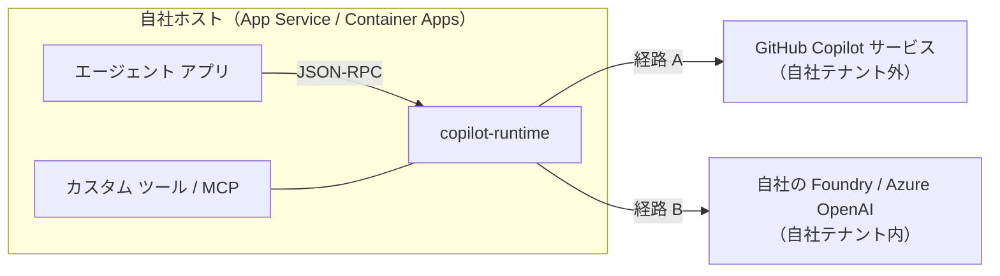

# ライセンスとデータ境界（費用分解・課金帰属）

Copilot SDK 採用の意思決定に必要な「どこにデータが出るか」「何にいくら払うか」をまとめる。
**単価・クレジット数は改定されるため、金額は必ず公式ページで再確認してから見積もりに使う。**

## 1. データ境界

SDK 本体はローカルのライブラリで、同梱の `copilot-runtime` を子プロセスとして起動する。
**データがどこへ出るかは、ランタイムが呼ぶモデルの経路だけで決まる。**



| 経路 | 外部へ出るもの | 典型的な判断 |
|---|---|---|
| A: GitHub Copilot 経由 | システム メッセージ、ユーザー入力、**ツール実行結果**（業務データを含む）、モデル出力 | 開発支援・社内向けの実験。業務データを読む場合は要承認 |
| B: BYOK | なし（自社リソースに閉じる） | 業務データを扱う常駐エージェントの既定 |

**見落としやすい点**: 経路 A では、ユーザーが入力した文字列だけでなく、
エージェントが検索・取得した業務データ（レコード、メール本文、ファイル内容）がすべてプロンプトに載って外部へ出る。
入力欄に機密を入れない運用ルールでは制御できない。

## 2. 費用の 3 層分解

| 層 | 経路 A | 経路 B（BYOK） |
|---|---|---|
| ① SDK / ランタイム | 無償（MIT） | 無償（MIT） |
| ② 推論 | Copilot シート + AI クレジット従量 | モデルのトークン従量課金（既存と同じ） |
| ③ ホスティング等 | App Service / ストレージ / 監視（**どちらも同額**） | 同左 |

つまり **SDK 採用による増減は ② だけ**。③ は現行構成のまま変わらない。

### 経路 A の課金モデル（AI クレジット）

| 項目 | 内容 |
|---|---|
| クレジット単価 | 1 AI クレジット = 概ね $0.01 |
| シート付与 | Business / Enterprise の各プランにシート単価に応じたクレジットが毎月付与される |
| プール | 付与分は**組織／企業単位でプール**される（1 ユーザーが使い切っても他ユーザー分を融通できる） |
| リセット | 毎月リセット。**繰り越しなし** |
| 超過 | 既定で従量課金が有効。上限を設けたい場合は予算を明示的に設定する |
| 対象外 | コード補完は AI クレジットを消費しない |
| BYOK 時 | **プレミアム リクエスト / AI クレジットを消費しない**（モデル費用は自社のプロバイダー請求） |

消費量はモデルごとの入力・出力トークン単価をクレジット換算した値になる。
フロンティア モデルの単価は Azure OpenAI の定価と概ね同水準のため、
**同じモデルを使う限り、経路 A と経路 B の推論単価は大きく変わらない**。差が出るのは次の 2 点。

- 経路 A は**シート費用が別途必要**（付与クレジットを使い切らないと割高になる）。
- 経路 B は**自社の割引・予約・クォータ**をそのまま適用できる。

### 見積もりの式

```
月額推論費 ≈ 月間ターン数 × 1 ターンあたりトークン数 × モデル単価
1 ターンあたりトークン数 = システム メッセージ + 会話履歴 + ツール結果 + 出力
```

**ツール結果が支配的**になるため、既存エージェントがあるなら実測値（使用量ログ）から出すこと。
ツール結果の切り詰め長（例: 8,000 文字）と会話履歴の保持件数が、そのままコストのつまみになる。

## 3. 無人常駐エージェントの課金帰属（経路 A の落とし穴）

Copilot の課金はシートに紐づくため、「人がいないエージェント」の帰属を先に決める必要がある。

| 方式 | 課金先 | 制約 |
|---|---|---|
| 個人のユーザー トークン | そのユーザーのシート | 全社分の消費が 1 人に集中する。退職・パスワード変更で停止する |
| GitHub App のインストール トークン | App をインストールした組織 | ① トークンは**環境変数**で渡す必要がある（SDK のトークン オプションに渡すと 403）② 有効期限が短く（約 1 時間）、更新にランタイムの再起動が要る ③ App のインストール範囲の設計が必要 |
| BYOK | Copilot 課金なし（自社モデル課金のみ） | GitHub 側の認証そのものが不要 |

この制約が、常駐エージェントで **BYOK を既定にする決定的な理由**になる。

## 4. BYOK + Managed Identity（キーレス）

SDK の FAQ には「BYOK はキー認証のみ」と読める記述があるが、
**公式のセットアップ ドキュメントには Managed Identity の手順がある**。実装は次の形になる。

| 設定項目 | 値 |
|---|---|
| プロバイダー種別 | `openai`（OpenAI 互換の v1 エンドポイントを使うため。Azure 専用種別ではない） |
| ベース URL | `{FOUNDRY_RESOURCE_URL}/openai/v1/`（環境変数にはリソース URL のみを入れ、パスはコードで付与する） |
| 認証 | 静的キーではなく**ベアラー トークン プロバイダー**を渡し、呼び出しの都度トークンを取得する |
| トークンのスコープ | Foundry / Azure OpenAI 用のリソース スコープ（`https://ai.azure.com/.default`） |
| ワイヤー API | `responses` |
| 資格情報 | `DefaultAzureCredential`。ホストでは `AZURE_TOKEN_CREDENTIALS=ManagedIdentityCredential`、ユーザー割り当て時は `AZURE_CLIENT_ID` |
| 権限 | マネージド ID に対象リソースの推論ロール（Cognitive Services OpenAI User 相当）を割り当てる |

キーを発行・保管しないため、既存のキーレス方針（共有キー禁止・シークレット持ち込み禁止）を崩さずに導入できる。

## 5. 判断のまとめ

1. 業務データを読むエージェント → **経路 B（BYOK + Managed Identity）**。
2. 開発支援・社内実験で、GitHub のモデル選択やルーティングに価値がある → 経路 A。ただしシート設計と課金帰属を先に決める。
3. どちらでも ③ ホスティング費用は変わらないため、比較は ② だけで行う。
