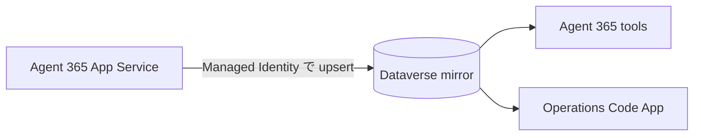

# Agent 365 サンプル実装事例

Agent 365 本体に、評価用 Code App、Dataverse、Power Automate を組み合わせた実装事例。
ここでは個別プロジェクトの完成形をコピーせず、再利用できる設計判断と境界だけを示す。
各技術の詳細はリンク先の専門スキルを正とする。

## 適用範囲

| 事例 | Agent 365 での用途 | 主な担当 |
|---|---|---|
| KPI から詳細一覧へ遷移 | 会話品質・利用実績の運用ダッシュボード | `code-apps` |
| 複数ターンを 1 会話として評価 | B15 利用実績、Agent Evals | `ai-teammate` + `code-apps` |
| Dataverse 列追加後の発行 | 評価・キュー・ミラー用スキーマの変更 | `dataverse` |
| 評価ジョブの非同期実行と孤児回収 | 長時間評価、B13 経過連絡 | Agent 365 の常駐 worker または `power-automate` |
| Power Automate から Azure OpenAI を呼ぶ | 常駐 worker を増やさない評価処理 | `power-automate` |
| 外部資産を Dataverse にミラー | Agent 365 が所有する設定・成果物メタデータの参照 | Agent 365 の常駐 worker + `code-apps` |

> これらは Agent 365 の必須構成ではない。会話品質を継続評価する、運用担当者向け画面を持つ、
> または Agent 365 の外にある資産を安全に参照する場合に採用する。

## 1. KPI から根拠となる一覧へ遷移する

評価ダッシュボードの KPI は数値を表示するだけで終わらせず、クリックすると同じ条件で絞り込んだ
一覧へ遷移させる。運用担当者が「なぜこの件数か」をその場で確認できることが目的。

```tsx
<Link to="/turns?view=needs-review">
  <KpiCard label="要確認" value={needsReviewCount} />
</Link>
```

一覧側は URL を状態の正とし、タブ変更時も URL を置き換える。

```tsx
const [searchParams, setSearchParams] = useSearchParams()
const requestedView = searchParams.get("view")
const view = VIEWS.some(item => item.key === requestedView) ? requestedView : "all"

function changeView(nextView: string) {
  setSearchParams(nextView === "all" ? {} : { view: nextView }, { replace: true })
}
```

- 不正な `view` は `all` にフォールバックする
- KPI、タブ件数、一覧フィルターは同じ判定関数を共有する
- 画面実装とデプロイ前検証は [`code-apps`](../../code-apps/SKILL.md) を正とする

## 2. 複数ターンを 1 会話として評価する

1 回の依頼が確認、承認、実行の数往復にまたがる場合、1 応答ずつの評価ではタスク達成度を誤判定する。
評価時だけ複数ターンを 1 会話に束ね、元の行は監査証跡として残す。

| 列 | 用途 |
|---|---|
| `<prefix>_mergedinto` | 統合先 ID。値がある元行は一覧と採点対象から除外 |
| `<prefix>_mergedfrom` | 統合元 ID の JSON 配列 |
| `<prefix>_turncount` | 統合した往復数 |
| `<prefix>_conversation` | 画面表示用の構造化 JSON |

審査モデルには読みやすい連結テキストを渡し、画面には構造化 JSON を保存する。

```python
judge_input = "\n\n".join(
    f"【{index} 回目】\n依頼: {turn['query']}\n応答: {turn['response']}"
    for index, turn in enumerate(turns, start=1)
)
conversation_json = json.dumps(turns, ensure_ascii=False)
```

- 通常の取得と評価パイプラインの両方で `mergedinto eq null` を適用する
- 元行は削除しない。統合解除と再評価を可能にする
- 統合候補の時間幅は固定値にせず設定値にする
- 詳細なテーブル設計と評価キューは
  [`ai-evaluation-master-pattern.md`](../../code-apps/references/ai-evaluation-master-pattern.md) を参照する

## 3. Dataverse の列追加後にメタデータを発行する

Metadata API で既存テーブルへ列を追加しても、Web API の `$metadata` は自動更新されない場合がある。
評価、ジョブ、ミラー用の列を追加したスクリプトは、最後に `PublishAllXml` を実行する。

```python
api_post("PublishAllXml", {})
```

発行後、新しい列だけを選択する最小クエリが HTTP 200 になることを確認する。

```text
GET <entity-set>?$select=<new-column>&$top=1
```

`0x80060888 Could not find a property named ...` が出た場合、列を作り直す前に発行状態を確認する。
作成・発行・再実行時の 429 対応は [`dataverse`](../../dataverse/SKILL.md) を正とする。

## 4. 非同期ジョブを消費し、孤児を回収する

Code App は長時間評価を直接実行せず、待機中のジョブ行を作るだけにする。消費者は次のどちらかを選ぶ。

| 消費者 | 適する条件 | 注意点 |
|---|---|---|
| Agent 365 App Service の `BackgroundService` | 既に B1 以上 + Always On で自己ホストしている | スケールアウト時の排他制御が必要 |
| Dataverse トリガーのクラウドフロー | 評価処理を Power Platform 内で完結したい | 接続、実行時間、同時実行数を管理する |

状態は最低でも `waiting`、`running`、`completed`、`failed` を持たせる。消費者は最古の
`waiting` を取得し、処理開始前に `running` へ更新する。

プロセス停止後に `running` のまま残った行は、`modifiedon` をハートビートとして回収する。

```text
status eq running
and modifiedon lt now() - STALE_JOB_THRESHOLD_MINUTES
```

- 長い処理は進捗更新時にジョブ行も更新する
- 期限を超えた `running` は `waiting` に戻す
- 結果テーブルの既存キーを先に読み、完了済みの評価は再実行しない
- `STALE_JOB_THRESHOLD_MINUTES` は最長の正常な無更新時間より長くする
- Agent 365 側の worker は Free / Shared プランへ置かない。Always On が無いと処理中にも停止する

B13 を使う場合、ジョブの `targetcount` / `donecount` を経過連絡の情報源にできる。ただし、
チャットへの進捗通知とジョブのハートビートは別責務として扱う。

## 5. Power Automate から Azure OpenAI を呼ぶ

Azure OpenAI でローカル認証を無効化している場合、API キーではなく Entra ID OAuth 2.0 の
カスタムコネクターを使う。評価ジョブをクラウドフローで消費する構成なら、Agent 365 の
App Service に評価専用 worker を追加せずに済む。

外せない実装条件:

- Microsoft Cognitive Services の委任スコープを使う
- リソース URI は `https://cognitiveservices.azure.com`
- コネクター作成後に、そのコネクター固有のリダイレクト URI を Entra アプリへ追加する
- `json_schema` と `strict: true` で評価結果を構造化する
- `choices[0].message.content` の JSON 文字列をフロー内で 1 回パースする
- 共有カウンターを更新する外側の `Apply to each` は逐次実行にする

コネクター作成、リダイレクト URI の特定、フロー定義の制約は
[`trigger-action-patterns.md`](../../power-automate/references/trigger-action-patterns.md) を正とする。

## 6. 外部資産を Dataverse にミラーする

Agent 365 の App Service が所有する設定ファイルや資産カタログを Code App に表示する場合、
ブラウザから App Service の内部 API を直接呼ばせない。所有者側が Dataverse へ同期し、
Code App とエージェントは Dataverse の権限で読む。



ミラーテーブルには元データの安定したキーと同期日時を持たせる。同期 1 回につき、全件 upsert の後に
元データから消えた行を削除する。

```text
source = load_external_assets()
for each item in source:
    upsert(item.stable_key, item, synced_on=now)
delete mirror rows whose stable_key is not in source
```

- 書き手は所有者サービス 1 つに限定する
- Code App に編集 UI を付けない。次回同期で上書きされるため
- ミラーテーブルだけに Create / Read / Write / Delete を付与し、System Administrator を使わない
- 同期周期は `SYNC_INTERVAL_SECONDS` などの設定値にする
- 同期失敗は本体の会話処理を止めず、警告を記録して次回周期で再試行する
- `synced_on` を画面に出し、古い表示と同期停止を区別できるようにする

Code App 側の実装は
[`data-source-patterns.md`](../../code-apps/references/data-source-patterns.md) の
「外部システムの資産を Dataverse にミラーして読む」を正とする。

## 採用時の確認

- [ ] KPI の件数と遷移先一覧が同じ条件を使っている
- [ ] 複数ターン統合後も元行が残り、通常取得と評価の両方から除外される
- [ ] Dataverse 列追加スクリプトが `PublishAllXml` と読み戻し検証を行う
- [ ] ジョブを積む側だけでなく、常時動く消費者がある
- [ ] `running` の孤児回収と完了済み評価のスキップがある
- [ ] Azure OpenAI の資格情報を Code App やフロー定義へ埋め込んでいない
- [ ] ミラーは単一の書き手を持ち、安定キー、削除同期、同期日時を実装している
