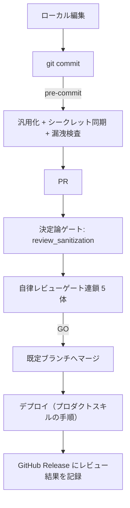

# ALM（秘匿化・汎用化・CI/CD）共通スキル

コードファースト資産を**安全に Git へ載せ、機械判定だけでデプロイまで到達させる**ための共通基盤。
**プロダクト非依存**であり、`agent365`（Foundry エージェント）、`code-apps`（Code Apps）など
どのスキルからも同じ仕組みで利用できる。デプロイの実処理だけを各プロダクトスキルへ委譲する。

| 原則 | 内容 |
|---|---|
| テンプレートのみコミット | 追跡するのは `${VAR}` 入りテンプレートだけ。実値は `.env` とシークレットストアにのみ存在する |
| 二重の防御 | ローカルは pre-commit（`sanitize.py` → `check_secrets.py`）、CI は決定論ゲート（`review_sanitization.py`） |
| 機械判定 | レビューは**ルールベース**。人手の承認（HITL）を前提にせず、判定を再現可能にする |
| ホスティング非依存 | Git ホスティングとシークレットストアは `GIT_PROVIDER` / `SECRET_BACKEND` で差し替える |
| 最小権限 | ワークフローは `permissions:` を明示。`contents: write` はリリースジョブだけに許可する |
| 記録はリリースに残す | デプロイ結果とレビュー結果は **GitHub Releases**（バージョンごと）に残す。Issue には残さない |
| 設定の外出し | パス・許可リスト等は `alm.config.json`。スクリプト本体はどのリポジトリでも無改変で使う |

> 前提ツール: Python 3.10+、Git、Azure CLI（`az`）。
> シークレットストアに応じて GitHub CLI（`gh`）または `az extension add --name azure-devops` を追加する。

## 各プロダクトスキルとの責務分担

| 担当 | 内容 | 参照先 |
|---|---|---|
| **`alm`（本スキル）** | 秘匿化・汎用化・pre-commit・レビューゲート・承認・リリース記録 | 本ファイル |
| `agent365` | Foundry エージェント定義、ブループリント、Teams パッケージ、公開 | [`agent365`](../agent365/SKILL.md) |
| `code-apps` | Code Apps の実装、`npm run deploy` などのデプロイ手順 | [`code-apps`](../code-apps/SKILL.md) |
| `standard` | ソリューション運用・環境戦略などの上位ルール | [`standard`](../standard/SKILL.md) |

プロダクトスキル側は「**何をデプロイするか**」だけを定義し、
「**どう秘匿化し、どう検証し、どう承認して記録するか**」は本スキルに従う。

## スキル同梱スクリプト

テーマリポジトリの `scripts/` へそのままコピーして使う（`alm_config.py` を必ず一緒に置く）。

| スクリプト | 用途 | 実行場所 |
|---|---|---|
| [scripts/alm_config.py](scripts/alm_config.py) | `alm.config.json` の読み込み（他スクリプトが import） | - |
| [scripts/sanitize.py](scripts/sanitize.py) | 実値入りファイルを `${VAR}` 化し、シークレットストアへ同期 | pre-commit |
| [scripts/check_secrets.py](scripts/check_secrets.py) | ステージ済み差分への実値混入を検査 | pre-commit |
| [scripts/render.py](scripts/render.py) | テンプレートの `${VAR}` を環境変数で解決 | ローカル / CI |
| [scripts/review_sanitization.py](scripts/review_sanitization.py) | 秘匿化・汎用化の決定論レビューゲート | CI（必須チェック） |
| [scripts/gate_rules.py](scripts/gate_rules.py) | 品質 / 汎用性 / セキュリティ / 可読性 / リリース判定のルールエンジン | CI（各ゲート） |
| [scripts/review_report.py](scripts/review_report.py) | 各ゲートの判定を 1 枚のレビュー結果表に統合 | CI（レポート） |

## Step 1: レイアウトを `alm.config.json` で宣言する

スクリプトは無改変で使い、**リポジトリごとの差分は設定ファイルだけ**にする。
未作成なら既定値（`**/*.template.*` をテンプレート、`.env` を追跡禁止）で動く。

```powershell
Copy-Item .github/skills/alm/scripts/*.py scripts/
Copy-Item .github/skills/alm/alm.config.example.json alm.config.json
```

| キー | 意味 | 例（agent365） | 例（code-apps） |
|---|---|---|---|
| `forbidden_tracked` | 追跡してはいけないファイル | `.env`, `a365.generated.config.json` | `.env`, `.power/` の生成物 |
| `templates` | `${VAR}` 入りテンプレート（コミット対象） | `agents/**/*.template.yaml` | `power.config.template.json` |
| `rendered` | レンダリング結果（追跡禁止） | `agents/**/agent.yaml` | `power.config.json` |
| `artifacts` | ビルド生成物（追跡禁止） | `teams/*.zip` | `dist/**` |
| `non_secret_vars` | 公開識別子（`${VAR}` 化しない） | `AGENT_NAME`, `BLUEPRINT_ID` | `APP_NAME` |
| `contents_write_jobs` | `contents: write` を許可するジョブ | `release` | `release` |

## Step 2: 秘匿値を `.env` に隔離する

1. `.env`（実値・`.gitignore`）と `.env.example`（プレースホルダーのみ・コミット対象）を作る。
   雛形は [references/.env.example](references/.env.example)。
2. テンプレートには実値を**一切書かない**。環境依存値はすべて `${VAR}` にする。
3. 公開識別子（アプリ名・エージェント名など）は `non_secret_vars` に入れる。
   これを入れないと、文章中の名称まで `${VAR}` に置換されてテンプレートが壊れる。

```powershell
python scripts/render.py --template agents/<name>/agent.template.yaml --output agents/<name>/agent.yaml
```

## Step 3: pre-commit ゲートを有効化する

```powershell
git config core.hooksPath .githooks
```

```sh
#!/bin/sh
set -e
# 1. 実値入りファイルを汎用化し、シークレットストアへ同期してテンプレートをステージ
python scripts/sanitize.py --env .env --set-secrets --stage
# 2. ステージ済み差分に実値が残っていないか検査（残っていればコミット中止）
python scripts/check_secrets.py --env .env
```

`.gitignore` を含む雛形一式は [references/repo-scaffold.md](references/repo-scaffold.md)。

## Step 4: シークレットストアを選ぶ

`SECRET_BACKEND` で送信先が切り替わる。**Git ホスティングとは独立**に選べる。

```powershell
python scripts/sanitize.py --env .env --set-secrets --secret-backend github --stage
python scripts/sanitize.py --env .env --set-secrets --secret-backend azure-devops --stage
python scripts/sanitize.py --env .env --set-secrets --secret-backend keyvault --stage
```

| Git ホスティング | CI 定義 | シークレット保管先 | `SECRET_BACKEND` |
|---|---|---|---|
| GitHub（private） | `.github/workflows/` | GitHub Actions Secrets | `github` |
| Azure DevOps Repos（private） | `.azuredevops/` | 変数グループ（Key Vault 連携可） | `azure-devops` |
| その他 Git | 各 CI の規約 | Azure Key Vault | `keyvault` |
| ローカルのみ（PoC） | なし | `.env` のみ | `none` |

Azure へのログインは**必ず OIDC / ワークロード ID フェデレーション**を使い、
クライアントシークレットを保管しない。設定手順は [references/ci-providers.md](references/ci-providers.md)。

## Step 5: レビューゲートを CI に組み込む

### 5.1 最小構成（決定論ゲートのみ）

PR で `review_sanitization.py` を実行し、**必須ステータスチェック**にする。
これだけで「実値混入」「テンプレート未汎用化」はマージできなくなる。

### 5.2 推奨構成（自律レビューゲート連鎖）

5 体のレビューエージェントを直列に並べ、**全ゲート PASS のときだけデプロイする**。
各エージェントは `gate_rules.py` のルールを評価するだけなので、判定は決定論的で人手承認が不要。

| ゲート | エージェント | 主なルール |
|---|---|---|
| 1. 品質 | `quality-inspector` | YAML の妥当性、テンプレートの構文、`.env.example` との整合、スクリプトの構文 |
| 2. 汎用性 | `generalization-auditor` | 実値混入なし、`${VAR}` がすべてシークレット経由、ワークフローに環境固有リテラルなし |
| 3. セキュリティ | `security-reviewer` | 最小権限、`pull_request_target` 禁止、Action 許可リスト、シークレット持ち出し検出 |
| 4. 可読性 | `readability-editor` | ジョブ/ステップ名、ヘッダーコメント、行長、TODO 残存 |
| 5. リリース判定 | `release-gatekeeper` | 上流 4 ゲートがすべて PASS か（GO / NO-GO） |

```powershell
python scripts/gate_rules.py --gate quality --out .gate/quality.json
python scripts/gate_rules.py --gate release --verdict-dir .gate
python scripts/review_report.py --verdict-dir .gate --out .gate/review-report.md
```

ワークフロー定義・ルール一覧・プロンプトの書き方は [references/review-gates.md](references/review-gates.md)。

## Step 6: デプロイを承認付きで実行する

1. 既定ブランチへのマージでデプロイジョブを起動する。
2. デプロイの実処理は**プロダクトスキル**が定義する（`agent365` なら `deploy.py`、
   `code-apps` なら `npm run deploy`）。ALM 側は認証・環境・順序だけを規定する。
3. 承認の扱いは 2 択にする。**両方を併用しない**。
   - **自律運用**: ゲート連鎖を審査とみなし、Environment の必須レビュアーを外す。
   - **有人運用**: Environment に必須レビュアーを設定し、ゲート連鎖は補助にする。

## Step 7: リリースとして記録する

デプロイ結果とレビュー結果は、**バージョンごとの GitHub Release** に残す。

- タグはデプロイしたバージョンに対応させる（例: `agent-v<version>`）。
- 本文は `review_report.py` が生成したレビュー結果表をそのまま使う。
- 同じバージョンを再デプロイしたときは新規作成せず `gh release edit` で上書きする。
- **Issue にメモを積む方式は採らない**（Issue は課題管理のための場所であり、
  デプロイ履歴を混ぜると課題一覧としての意味が失われる）。



## 検証チェックリスト

- [ ] `.env` と `rendered` / `artifacts` に該当するファイルが追跡されていない
- [ ] テンプレートに実 GUID・ARM パス・接続文字列・エンドポイントが無い
- [ ] `.env.example` にすべての変数がプレースホルダー付きで存在する
- [ ] 公開識別子が `non_secret_vars` に登録されている
- [ ] `git config core.hooksPath .githooks` が有効
- [ ] `python scripts/review_sanitization.py` が Pass し、必須チェックになっている
- [ ] ワークフローが `permissions:` を宣言し、`contents: write` がリリースジョブ限定
- [ ] 承認方式（自律 / 有人）が 1 つに決まっている
- [ ] デプロイのたびにリリースが作成／更新される

## 参考リンク

- [レビューゲートの構成（ワークフロー・ルール一覧・プロンプト）](references/review-gates.md)
- [CI / Git ホスティング別の構成（GitHub / Azure DevOps / その他）](references/ci-providers.md)
- [リポジトリ scaffold（.gitignore / hook / CI 定義）](references/repo-scaffold.md)
- [異常系・トラブルシュート](references/troubleshooting.md)
- [環境変数サンプル（ALM 部分）](references/.env.example)
