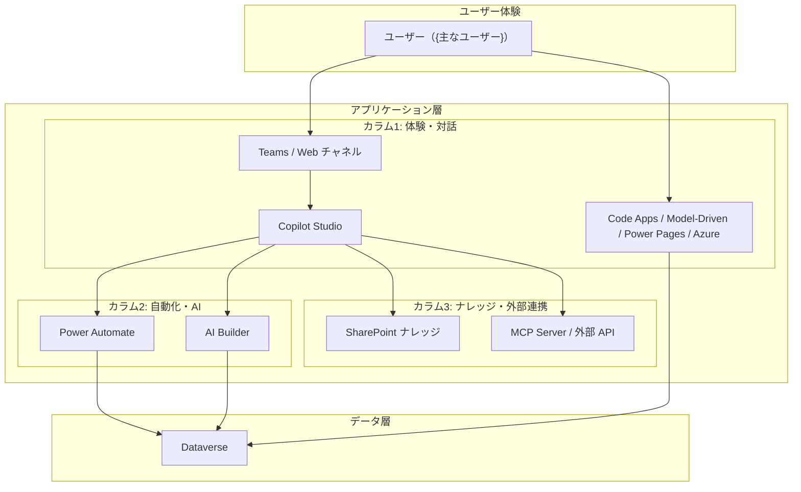

# アーキテクチャ設計 リファレンス

## 0. 複合パターン早見表

多くの要件は複数コンポーネントの組み合わせになる。以下のパターンで判断する:

| パターン                | 構成                                                     | 典型的なユースケース                  |
| ----------------------- | -------------------------------------------------------- | ------------------------------------- |
| **CRUD + 通知**         | Code Apps + Power Automate                               | インシデント管理、資産管理、申請管理  |
| **対話 + データ操作**   | Copilot Studio + Dataverse（ナレッジ）                   | ヘルプデスク、FAQ、データ照会         |
| **対話 + 外部連携**     | Copilot Studio + MCP Server / コネクタ                   | メール処理、ドキュメント分析          |
| **対話 + 定期実行**     | Copilot Studio + Power Automate（スケジュールトリガー）  | ニュース配信、定期レポート            |
| **対話 + イベント駆動** | Copilot Studio + Power Automate（メール/Teams トリガー） | メール自動応答、問い合わせ対応        |
| **AI 分析 + 対話**      | AI Builder + Copilot Studio                              | ドキュメント分類 + 対話で結果説明     |
| **外部ポータル + データ操作** | Power Pages + Dataverse + Power Automate            | 顧客向けポータル、パートナーサイト、公開フォーム |
| **フルスタック**        | Dataverse + Code Apps + Power Automate + Copilot Studio  | 業務アプリ + 自動化 + AI アシスタント |

## 1. 統合アーキテクチャパターン集

### パターン A: 業務アプリ（CRUD + 通知）

```
[Dataverse] ←→ [Code Apps]     ← ユーザーがデータ操作
      ↓ レコード変更
[Power Automate] → メール/Teams 通知
```

**使うスキル**: `code-apps` → `power-automate`

### パターン A2: 業務アプリ（Model-Driven + 通知）

```
[Dataverse] ←→ [Model-Driven Apps]  ← テーブル定義から自動生成 UI
      ↓ レコード変更
[Power Automate] → メール/Teams 通知
```

**使うスキル**: `model-driven-app` → `power-automate`

> **パターン A vs A2 の判断**: カスタム UI が不要で標準ビュー/フォームで十分なら A2（最速）。
> カンバン・ダッシュボード・カスタムビジュアルが必要なら A。

### パターン B: AI アシスタント（対話 + ナレッジ）

```
[Teams / Web] → [Copilot Studio]
                    ↓
              [Dataverse ナレッジ] + [SharePoint ナレッジ]
```

**使うスキル**: `copilot-studio`

### パターン C: イベント駆動 AI 処理（トリガー + エージェント）

```
[メール受信 / スケジュール]
      ↓
[Power Automate] → ExecuteCopilot
      ↓
[Copilot Studio] → ツール呼び出し（MCP / コネクタ）
      ↓
応答処理（メール返信 / Teams 投稿）
```

**使うスキル**: `copilot-studio`（[trigger.md](../../copilot-studio/references/trigger.md) を参照）

### パターン D: 定期レポート配信

```
[Power Automate: Recurrence トリガー]
      ↓
[Copilot Studio] → RSS/Web 検索 → レポート生成 → メール送信
```

**使うスキル**: `copilot-studio`（[market-research-report.md](../../copilot-studio/references/market-research-report.md) を参照）

### パターン E: フルスタック業務システム

```
[Dataverse]
    ↑↓
[Code Apps] ←→ ユーザー操作
    ↓ レコード変更
[Power Automate] → 通知 / 承認 / 外部連携
    ↓
[Copilot Studio] ← Teams から対話
    ↓
[AI Builder] ← エージェントのツールとして分析
```

**使うスキル**: 全フェーズスキルを順番に適用

---

## 2. 設計アウトプットテンプレート

このスキルで判断した結果は、**Mermaid による構成図（複数カラム形式の subgraph グループ化）を必ず含めて**、以下のテンプレートでユーザーに提示する:

```markdown
## アーキテクチャ設計書

### 1. 要件サマリー

- 管理対象: {何を管理するか}
- 主なユーザー: {誰が使うか}
- 主要操作: {何をするか}

### 2. アーキテクチャパターン

**パターン {A/B/C/D/E}**: {パターン名}

### 3. 構成図（Mermaid）



### 4. コンポーネント構成

| コンポーネント | 用途                 | 必要性  |
| -------------- | -------------------- | ------- |
| Dataverse      | {テーブル構成の概要} | ✅ 必須 |
| Code Apps      | {画面の概要}         | ✅ / ❌ |
| Model-Driven   | {アプリの概要}       | ✅ / ❌ |
| Power Pages    | {外部公開 UI の概要（ユーザー宣言時のみ）} | ✅ / ❌ |
| Azure          | {外部公開 Web/API の概要（既定）} | ✅ / ❌ |
| Power Automate | {フローの概要}       | ✅ / ❌ |
| Copilot Studio | {エージェントの概要} | ✅ / ❌ |
| AI Builder     | {プロンプトの概要}   | ✅ / ❌ |
| Teams / Web    | {利用チャネルの概要} | ✅ / ❌ |
| SharePoint     | {ナレッジソースの概要} | ✅ / ❌ |
| MCP / 外部 API | {外部連携の概要}     | ✅ / ❌ |

### 5. 判断根拠

- {なぜこのコンポーネントを選んだか}
- {なぜ代替案を選ばなかったか}

### 6. 構築フェーズ（設計承認後は並行トラックで実行）

Phase 1（設計）承認後は、Dataverse 構築と同時に Code Apps・Copilot Studio の開発も着手する。
VS Code では 3 トラックをサブエージェントに割り当てて並行実行する。

- **Track A: Dataverse（データ基盤オーナー）**
  1. Phase 2: Dataverse — {テーブル数}テーブル
  2. Phase 3: Security Role — （必要な場合）
  3. Phase 4: AI Builder — {プロンプト数}プロンプト（Power Automate から呼ぶ場合のみ）
  4. Phase 5: Power Automate — {フロー数}フロー（※ 不要なら省略）
- **Track B: Code Apps**（設計承認と同時に着手・※ 不要なら省略）
  - 先行（テーブル不要）: scaffold + npm install → `pac code init` → 初回 build & push
  - 同期後: `add-data-source`（★同期①: Phase 2 完了後）→ `add-flow`（★同期②: Phase 5 完了後）→ UI 実装 → 再デプロイ
  - 5'. Model-Driven Apps を採用する場合はテーブルから自動生成（※ Code Apps と排他）
- **Track C: Copilot Studio**（設計承認と同時に着手・※ 不要なら省略）
  - 先行（テーブル不要）: Bot 作成 → 生成オーケストレーション有効化 → Instructions 設定
  - 同期後: ナレッジ／MCP／ツール追加（★同期①/②: Phase 2・Phase 5 完了後）→ エージェント公開

同期点とサブエージェントのオーケストレーション詳細は
[開発フロー全体図（standard §8）](../../standard/references/power-platform-development-standard.md#8-開発フロー全体図) を参照。

この設計で進めてよいですか？
```

---

## 3. よくある判断ミスと対策

| ミス                                                             | 正しい判断                                                                 |
| ---------------------------------------------------------------- | -------------------------------------------------------------------------- |
| 通知だけなのに Copilot Studio を使う                             | Power Automate 単体で十分。LLM が不要なら使わない                          |
| 確定的な処理に Copilot Studio を使う                             | 条件分岐が固定なら Power Automate。LLM のハルシネーションリスクを避ける    |
| Power Automate で自然言語処理を頑張る                            | Copilot Studio に任せる。フローの条件分岐で自然言語を扱うのは脆い          |
| AI Builder で対話機能を作ろうとする                              | Copilot Studio を使う。AI Builder は単発の入力→出力処理向き                |
| Canvas Apps を候補に入れる                                       | 常に対象外。Code Apps に切り替える（パフォーマンス/カスタマイズ性/エンタープライズ運用で不利） |
| 標準 CRUD だけなのに Code Apps でフルスクラッチ                  | Model-Driven Apps なら自動生成で最速。カスタム UI 不要なら MDA を検討      |
| 全要件に Copilot Studio を使う                                   | 対話が不要な部分は Power Automate / Code Apps で。適材適所                 |
| Power Automate フロー内に AI Builder アクションを API でデプロイ | API では `InvalidOpenApiFlow` エラー。AI Builder ステップは UI で手動追加  |

---

## 4. 画面設計ブロックの組み合わせ（テンプレ化しない設計）

Code Apps を採用したら、**テーブルの数だけ同じ「一覧＋フォーム」CRUD 画面を機械的に量産しない。**
画面ごとに AskUserQuestion でデータの特性を確認し、該当するブロックを組み合わせて設計する。

### AskUserQuestion で確認する項目（テーブル単位）

| 確認項目 | 該当すると選ぶブロック |
|---|---|
| 順序を持つステータス／ステージがあるか？ | `KanbanBoard`（ドラッグでステータス変更） or `StagePath`（矢羽でクリック即変更） |
| 期間（開始/終了）を持つレコードか？ | `GanttChart`（dnd-kit、ドラッグリサイズ中心）。自由配置・ズームが必要なら **ReactFlow** カスタムノード |
| 他レコードとの関係性・依存・フローを見せたいか？ | **ReactFlow**（ノード＋エッジ） |
| 地域・位置情報を持つか？ | 地図（`JapanMap` 等） |
| 階層構造（親子）か？ | `TreeStructure` |
| 集計・比率を見せたいだけか？ | `ChartDashboard`（Recharts: 棒・円・折れ線） |
| 上記のいずれにも該当しないか？ | `ListTable` / `InlineEditTable`（この場合のみ従来通りの CRUD テーブル） |

### ReactFlow を第一候補とする方針

**可視化ニーズが少しでもあれば、ReactFlow（`@xyflow/react`）を必ず一度は候補として提示する。**
単純な集計（件数・合計・比率）だけなら Recharts で十分だが、**関係性・時間軸への自由配置・ドラッグ/ズーム操作**
を伴う場合は ReactFlow を優先する。1 画面につき最低 1 つは可視化ブロック（チャート／地図／ReactFlow のいずれか）
を含めることを検討し、単なる一覧＋フォームのテンプレートで終わらせない。

具体的な実装パターン（ガントチャートのカスタムノード・関係図・組織図・カテゴリ色のハッシュ関数）は
[code-apps: ReactFlow 可視化パターン](../../code-apps/references/reactflow-patterns.md) を参照。

### 画面を組み立てる手順

1. テーブルごとに上表の AskUserQuestion を実施し、該当するブロックを列挙する
2. 同一画面内で複数ブロックがある場合は Tabs やグリッドで組み合わせる（例: 「一覧／カンバン／ガント」を Tabs で切替）
3. 組み上がったブロック構成を [設計アウトプットテンプレート](#2-設計アウトプットテンプレート) の「4. コンポーネント構成」に反映してユーザーへ提示し、承認を得る

---
