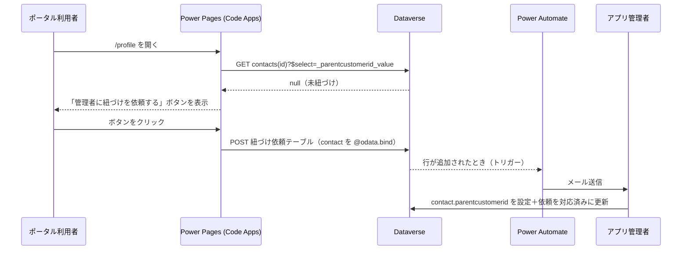

# 紐づけ依頼フロー（未紐づけユーザー → 管理者へメール）

[SKILL.md](../SKILL.md) Step 4-F の詳細設計。

Account アクセスでは `contact.parentcustomerid` が未設定だと、
権限が正しくてもレコードが 1 件も見えない（かつ作成もできない）。
利用者が自分で企業を選べる設計は権限昇格になるため、
**依頼レコードを作らせて管理者に通知する**方式にする。

## 1. 全体像



## 2. 依頼テーブルの列設計

テーブル論理名: `{prefix}_accountlinkrequest`（`.env` の `ACCOUNT_LINK_REQUEST_TABLE`）

| 列（論理名） | 型 | 用途 |
|---|---|---|
| `{prefix}_name` | テキスト（主キー列） | 件名。`{氏名} の紐づけ依頼` を自動生成 |
| `{prefix}_contactid` | 参照（`contact`） | 依頼者。Contact スコープの絞り込みに使う |
| `{prefix}_requestedcompany` | テキスト | 利用者が申告する会社名（**参考情報。自動紐づけには使わない**） |
| `{prefix}_status` | 選択肢 | `100000000` 未対応 / `100000001` 対応済み / `100000002` 却下 |
| `{prefix}_note` | 複数行テキスト | 管理者メモ |

`{prefix}_contactid` を作ると contact との 1:N リレーションができるので、
そのスキーマ名を `.env` の `ACCOUNT_LINK_REQUEST_RELATIONSHIP` に設定する。

> `{prefix}_requestedcompany` は**自己申告**であり、これを根拠に自動で紐づけてはいけない。
> 管理者が正規の名簿と突き合わせて判断する。

## 3. 権限

```powershell
python .github/skills/power-pages/scripts/setup_account_link_request.py
```

| テーブル | スコープ | 読み取り | 書き込み | 作成 | 削除 | 追加 | 追加先 |
|---|---|---|---|---|---|---|---|
| `{prefix}_accountlinkrequest` | Contact（`756150001`） | ✅ | ❌ | ✅ | ❌ | ✅ | ✅ |
| `contact` | Self（`756150004`） | ✅ | ✅ | ❌ | ❌ | ✅ | ✅ |

書き込み・削除を付けない理由は、依頼者が申告内容やステータスを後から改ざんできないようにするため。
スクリプトの `assert_no_write_delete()` が誤設定を実行前に止める。

> **★ 追加（Append）と 追加先（AppendTo）は両テーブルに必要**。
> `{prefix}_contactid@odata.bind` 付き POST は、contact 側・依頼テーブル側のどちらかが欠けると
> 403 になる（実機で 4 通りの組み合わせを検証済み）。詳細は
> [access-scope-design.md](access-scope-design.md) の真理値表を参照。

## 4. Power Automate フロー

```powershell
python .github/skills/power-pages/scripts/deploy_flow_account_link_request.py
```

接続参照の作成からフローの作成・有効化・Webhook 登録までをこのスクリプトが行う（べき等）。
事前に Dataverse と Office 365 Outlook の接続を
[make.powerautomate.com/connections](https://make.powerautomate.com/connections) で作っておくこと（API では作れない）。

| 要素 | 設定 |
|---|---|
| トリガー | Dataverse「行が追加、変更、または削除されたとき」（変更の種類: 追加）|
| テーブル | `{prefix}_accountlinkrequest` |
| スコープ | 組織 |
| アクション 1 | Dataverse「ID で行を取得する」で `contact` の氏名・メールを取得 |
| アクション 2 | Office 365 Outlook「メールの送信 (V2)」|
| 宛先 | `.env` の `ACCOUNT_LINK_ADMIN_RECIPIENT`（配布リスト推奨）|
| 件名 | `[Power Pages] 取引先企業の紐づけ依頼: {氏名}` |
| 本文 | 依頼者名・メール・申告会社名・依頼日時と、自己申告である旨の警告 |

接続は接続参照（connection reference）で構成し、環境間で使い回せるようにする。

### ★ API デプロイで踏む落とし穴（実機検証済み）

| 項目 | 正しい値 | 間違えたときの症状 |
|---|---|---|
| `connectionReferences` のキー | コネクタ名（`shared_commondataserviceforapps`）| 接続参照の論理名をキーにすると有効化時に 400<br>`Name {prefix}_connref_... did not match validation regex ^[a-zA-Z0-9\-\.]{1,96}$` |
| 接続参照の渡し方 | `runtimeSource: "embedded"` + `connection.connectionReferenceLogicalName` | 接続 ID 直埋めだと `AzureResourceManagerRequestFailed` |
| `host.connectionName` | コネクタ名 | 同上 |
| `subscriptionRequest/entityname` | テーブルの**論理名**（`{prefix}_accountlinkrequest`）| エンティティセット名（複数形）だと<br>`InvalidOpenApiFlow` / `GetMetadataForGetEntityCUDTrigger` が `EntityNotFound` |
| `GetItem` の `entityName` | **エンティティセット名**（`contacts`）| 論理名だと実行時に見つからない |
| 有効化後の `/start` | Flow API に POST する | `statecode=1` だけだと webhook が登録されず発火しない |

### HTTP トリガーのフローにしない理由

「HTTP 要求の受信時」トリガーは URL を知っていれば**誰でも匿名で叩ける**。
URL がクライアントバンドルに含まれる Code Apps では実質公開されるため、
なりすまし通知やメール爆撃の踏み台になる。
Dataverse の行追加トリガーなら、レコード作成自体が Power Pages の認証と
テーブル権限で守られるため、認証済み利用者以外は起点を作れない。

## 5. クライアントからの登録

```ts
const body = {
  [`${prefix}_name`]: `${fullName} の紐づけ依頼`,
  [`${prefix}_requestedcompany`]: requestedCompany,
  [`${prefix}_status`]: 100000000,
};
bindLookup(body, `${prefix}_contactid`, "contacts", contactId);

await fetch(`/_api/${prefix}_accountlinkrequests`, {
  method: "POST",
  headers: {
    "Content-Type": "application/json",
    "__RequestVerificationToken": await getRequestVerificationToken(),
  },
  body: JSON.stringify(body),
});
```

- 複数形のエンティティセット名（`...requests`）を使う。単数形は 404。
- POST には `__RequestVerificationToken` ヘッダーが必須。
- 二重送信を防ぐため、送信後はボタンを無効化し「依頼済み」表示に切り替える
  （未対応の依頼が既にあるかは `$filter` で確認できる）。

## 6. 参考

- [Power Automate で Dataverse トリガーを使う | Microsoft Learn](https://learn.microsoft.com/ja-jp/power-automate/dataverse/overview)
