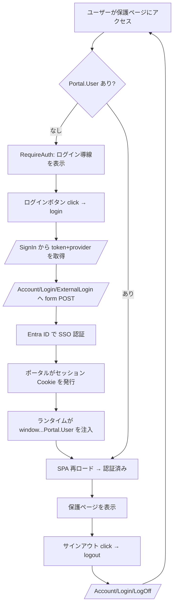

# 認証実装リファレンス（Power Pages）

Power Pages Code Site（SPA）における認証一式の実装サンプル。
**SSO（シングルサインオン）・サインアウト・ログインボタン・認証ガード・UI フロー** を 1 ファイルにまとめて収録する。
`geeksupport`（動作実績のある参考サイト）の実装に基づく。

> **位置づけ**: SKILL.md「SSO + プロフィール編集」の詳細版。
> Dataverse の読み書きクライアントは [Dataverse クライアント実装リファレンス](dataverse-client.md) を参照。

---

## 0.1 microsoft/power-platform-skills との対応（認証・認可）

| 項目 | 対応スキル | このリファレンスで扱う範囲 |
|---|---|---|
| ログイン/ログアウト導線 | `setup-auth` | `useAuth`、`ExternalLogin` POST、keepalive、認証ガード UI |
| Web ロール準備 | `create-webroles` | 実行前提としてロール構成を確認（未作成だと認可検証が成立しない） |
| サーバー側強制力 | `setup-auth` + `create-webroles` + テーブル権限 | クライアント側 role check は UX 制御のみ、実際のアクセス制御はサーバー側 |

> 要点: 認証スキルだけでは CRUD は成立しない。`create-webroles` とテーブル権限設定を組み合わせてはじめて一般ユーザーの認可が成立する。

---

## 0. 認証モデル（Code Apps との最大の違い）

| 項目 | Power Pages | Code Apps |
|------|-------------|-----------|
| 認証の場所 | **サーバー側（セッション Cookie）** | クライアント + コネクタ |
| トークン管理 | なし（Cookie をブラウザが自動送信） | SDK が内部管理 |
| ログイン | サーバーへ form POST → Entra ID へリダイレクト | コネクタのサインイン |
| ユーザー情報 | `window.Microsoft.Dynamic365.Portal.User`（ランタイム注入） | `getContext().user` |
| ユーザー実体 | **contact**（ポータルユーザー） | **systemuser**（Dataverse ユーザー） |

> **重要（教訓）**: 認証判定で `/_api/contacts` をクエリしてはいけない。
> contact の Table Permission が無いと 403 になる。認証はサーバー側セッション Cookie で完結しており、
> クライアントはポータルが注入する `window.Microsoft.Dynamic365.Portal.User` を**信頼するだけ**でよい。

---

## 1. 認証フック（`src/hooks/use-auth.ts`）

SSO ログイン・サインアウト・認証状態判定をすべて担う中核。コピーしてそのまま使える完全実装。

```typescript
// src/hooks/use-auth.ts
import { useState, useEffect, useCallback, useRef } from "react";

export interface AuthUser {
  contactId: string;
  fullName: string;
  email: string;
  firstName: string;
  lastName: string;
  phone: string;
}

/**
 * Power Pages 認証フック
 *
 * 認証判定: ポータルが注入する window.Microsoft.Dynamic365.Portal.User を信頼する。
 * /_api/contacts をクエリしてはいけない（Table Permission がなくても認証は有効）。
 * 認証はサーバー側セッション Cookie で完結している。
 */
export function useAuth() {
  const [state, setState] = useState<{
    isAuthenticated: boolean;
    user: AuthUser | null;
    loading: boolean;
  }>({ isAuthenticated: false, user: null, loading: true });

  // ── 認証状態の判定（API 呼び出しなし）──
  useEffect(() => {
    const portalUser = (window as any)["Microsoft"]?.Dynamic365?.Portal?.User;
    const contactId = portalUser?.contactId || portalUser?.id || "";

    if (contactId) {
      setState({
        isAuthenticated: true,
        user: {
          contactId,
          fullName: portalUser?.fullName || portalUser?.fullname || "",
          email: portalUser?.emailAddress || portalUser?.emailaddress1 || "",
          firstName: portalUser?.firstName || portalUser?.firstname || "",
          lastName: portalUser?.lastName || portalUser?.lastname || "",
          phone: portalUser?.telephone1 || "",
        },
        loading: false,
      });
    } else {
      setState({ isAuthenticated: false, user: null, loading: false });
    }
  }, []);

  // ── Session keepalive（SPA セッション維持）──
  // Ref: microsoft/power-platform-skills setup-auth Session KeepAlive pattern
  const keepAliveRef = useRef<ReturnType<typeof setInterval> | null>(null);
  useEffect(() => {
    if (!state.isAuthenticated) return;
    const INTERVAL_MS = 10 * 60 * 1000; // 10 minutes
    keepAliveRef.current = setInterval(() => {
      fetch("/_layout/tokenhtml", { credentials: "same-origin" }).catch(() => {});
    }, INTERVAL_MS);
    return () => {
      if (keepAliveRef.current) clearInterval(keepAliveRef.current);
    };
  }, [state.isAuthenticated]);

  // ── ① シングルサインオン（SSO ログイン）──
  // /_layout/tokenhtml から anti-forgery token を取得し、
  // Portal.tenant から provider identifier を解決して直接 Entra ID に POST。
  // Ref: microsoft/power-platform-skills setup-auth resolveProviderIdentifier()
  const login = useCallback(async () => {
    if (window.location.hash) {
      sessionStorage.setItem("pp_return_hash", window.location.hash);
    }

    // Resolve provider from Portal.tenant at runtime
    const tenantId = (window as any)["Microsoft"]?.Dynamic365?.Portal?.tenant;

    if (tenantId) {
      try {
        // Lightweight endpoint — no full HTML page parse needed
        const tokenRes = await fetch("/_layout/tokenhtml", { credentials: "same-origin" });
        const tokenHtml = await tokenRes.text();
        const tokenMatch = tokenHtml.match(/value="([^"]+)"/);

        if (tokenMatch) {
          const form = document.createElement("form");
          form.method = "POST";
          form.action = "/Account/Login/ExternalLogin";
          form.style.display = "none";
          const fields: Record<string, string> = {
            provider: `https://login.windows.net/${tenantId}/`,
            returnUrl: "/",
            __RequestVerificationToken: tokenMatch[1],
          };
          for (const [name, value] of Object.entries(fields)) {
            const input = document.createElement("input");
            input.type = "hidden";
            input.name = name;
            input.value = value;
            form.appendChild(input);
          }
          document.body.appendChild(form);
          form.submit();
          return;
        }
      } catch { /* fallback below */ }
    }
    // フォールバック: 標準サインインページへ
    window.location.href = "/SignIn?returnUrl=/";
  }, []);

  // ── ② サインアウト ──
  const logout = useCallback(() => {
    sessionStorage.removeItem("pp_return_hash");
    window.location.href = "/Account/Login/LogOff?returnUrl=%2F";
  }, []);

  return { ...state, login, logout };
}
```

### SSO の実装パターン

| パターン | 挙動 | 用途 |
|------|------|------|
| **`/_layout/tokenhtml` + `Portal.tenant` → form POST**（推奨） | anti-forgery token を軽量エンドポイントから取得、provider を runtime 解決 | 推奨（microsoft/power-platform-skills 準拠） |
| **`/SignIn` HTML パース → form POST** | `/SignIn` ページ HTML をフェッチして token + provider を抽出 | レガシー（重い HTML をパースする） |
| 単純リダイレクト `/SignIn?returnUrl=/` | 標準サインインページを経由 | 複数 IdP があるとき／フォールバック |

> `provider` 値はサイトの ID プロバイダー設定（AuthenticationType）と一致している必要がある。
> 上記実装は `/SignIn` の HTML から `provider` を動的に抽出するため、値のハードコードが不要。

---

## 2. ③ ログイン / サインアウトボタン（ヘッダー UI）

ヘッダーで認証状態に応じてボタンを出し分ける。`useAuth` の `login` / `logout` を呼ぶだけ。

```tsx
// src/components/site-header.tsx
import { useAuth } from "@/hooks/use-auth";
import { Button } from "@/components/ui/button";
import { LogIn, LogOut } from "lucide-react";

export function SiteHeader() {
  const { isAuthenticated, user, login, logout } = useAuth();

  return (
    <header /* ... */>
      <div className="flex items-center gap-2">
        {isAuthenticated ? (
          <>
            {/* ログイン中: ユーザー名 + サインアウトボタン */}
            <span className="hidden sm:inline text-sm text-muted-foreground">
              {user?.fullName}
            </span>
            <Button variant="ghost" size="sm" onClick={logout} className="gap-1.5">
              <LogOut className="h-3.5 w-3.5" />
              <span className="hidden sm:inline">ログアウト</span>
            </Button>
          </>
        ) : (
          // 未認証: ログインボタン
          <Button variant="outline" size="sm" onClick={login} className="gap-1.5 font-medium">
            <LogIn className="h-3.5 w-3.5" />
            <span className="hidden sm:inline">ログイン</span>
          </Button>
        )}
      </div>
    </header>
  );
}
```

---

## 3. 認証ガード（ルート保護の UI フロー）

未認証ユーザーにログイン導線を出す `RequireAuth` コンポーネント。

```tsx
// src/components/require-auth.tsx
import { useAuth } from "@/hooks/use-auth";
import { Button } from "@/components/ui/button";
import { LogIn } from "lucide-react";

export function RequireAuth({ children }: { children: React.ReactNode }) {
  const { isAuthenticated, loading, login } = useAuth();

  // ローディング中はスピナー
  if (loading) {
    return (
      <div className="flex items-center justify-center min-h-[400px]">
        <div className="h-8 w-8 animate-spin rounded-full border-4 border-primary border-t-transparent" />
      </div>
    );
  }

  // 未認証ならログイン導線を表示
  if (!isAuthenticated) {
    return (
      <div className="flex flex-col items-center justify-center min-h-[400px] gap-4">
        <div className="text-center space-y-2">
          <h2 className="text-2xl font-bold">ログインが必要です</h2>
          <p className="text-muted-foreground">
            この機能を利用するにはログインしてください。
          </p>
        </div>
        <Button size="lg" onClick={login}>
          <LogIn className="h-4 w-4" />
          ログイン
        </Button>
      </div>
    );
  }

  // 認証済みなら子要素を表示
  return <>{children}</>;
}
```

---

## 4. ルーティングへの組み込み（UI フロー全体）

`RequireAuth` で保護ルートを包む。公開ページ（ホーム）はガード無し。

```tsx
// src/App.tsx
import { HashRouter, Routes, Route } from "react-router-dom";
import { RequireAuth } from "@/components/require-auth";
import { SiteHeader } from "@/components/site-header";

export default function App() {
  return (
    <HashRouter> {/* ★ Power Pages では Hash ルーティング必須 */}
      <SiteHeader />
      <main>
        <Routes>
          {/* 公開ページ */}
          <Route path="/" element={<HomePage />} />

          {/* 保護ページ: RequireAuth で包む */}
          <Route
            path="/incidents"
            element={
              <RequireAuth>
                <IncidentListPage />
              </RequireAuth>
            }
          />
          <Route
            path="/incidents/new"
            element={
              <RequireAuth>
                <IncidentNewPage />
              </RequireAuth>
            }
          />
        </Routes>
      </main>
    </HashRouter>
  );
}
```

---

## 5. 認証 UI フロー図



---

## 6. プロフィール編集の例（認証ユーザーで contact を読み書き）

ログインユーザーの contact レコードを `apiGet` / `apiPatch` で読み書きする。
`ApiAuthError` をハンドリングして再ログインを促す。

```tsx
// src/pages/profile.tsx
import { useState, useEffect } from "react";
import { useAuth } from "@/hooks/use-auth";
import { apiGet, apiPatch, ApiAuthError } from "@/lib/api";

interface ContactProfile {
  firstname: string;
  lastname: string;
  emailaddress1: string;
  telephone1: string;
}

export default function ProfilePage() {
  const { user } = useAuth();
  const [profile, setProfile] = useState<ContactProfile>({
    firstname: "", lastname: "", emailaddress1: "", telephone1: "",
  });
  const [message, setMessage] = useState<{ type: "success" | "error"; text: string } | null>(null);

  useEffect(() => {
    if (!user?.contactId) return;
    const path = `contacts(${user.contactId})?$select=firstname,lastname,emailaddress1,telephone1`;
    apiGet<ContactProfile>(path)
      .then((data) =>
        setProfile({
          firstname: data.firstname || "",
          lastname: data.lastname || "",
          emailaddress1: data.emailaddress1 || "",
          telephone1: data.telephone1 || "",
        }),
      )
      .catch((e) => {
        if (e instanceof ApiAuthError) {
          setMessage({ type: "error", text: `認証エラー (${e.status})。再ログインしてください。` });
        } else {
          setMessage({ type: "error", text: `取得失敗: ${e instanceof Error ? e.message : String(e)}` });
        }
      });
  }, [user?.contactId]);

  async function handleSave(e: React.FormEvent) {
    e.preventDefault();
    try {
      await apiPatch(`contacts(${user!.contactId})`, {
        firstname: profile.firstname,
        lastname: profile.lastname,
        telephone1: profile.telephone1,
      });
      setMessage({ type: "success", text: "プロフィールを更新しました" });
    } catch (e) {
      if (e instanceof ApiAuthError) {
        setMessage({ type: "error", text: `認証エラー (${e.status})。` });
      } else {
        setMessage({ type: "error", text: `更新失敗: ${e instanceof Error ? e.message : String(e)}` });
      }
    }
  }
  // ... フォーム UI は省略
}
```

---

## 7. 認証まわりの検証済み教訓

| 問題 | 原因 | 解決 |
|------|------|------|
| 認証済みなのに 403 | `/_api/contacts` を認証判定に使用 | `Portal.User` を信頼し、API を呼ばない |
| SPA fetch で 500 | `credentials` / リダイレクト処理の誤り | `credentials: "same-origin"` + `handleResponse` で吸収 |
| ログインボタンが 2 つ表示 | ビルトイン + カスタム OIDC 共存 | 一方のプロバイダーを無効化 |
| "Sign in failed" | トラッキング防止が nonce Cookie をブロック | `Nonce=false` またはビルトインプロバイダー使用 |
| ExternalLogin で 401 | form の `provider` 値が AuthenticationType と不一致 | `/SignIn` HTML から動的抽出する |
| 管理者 OK / 一般ユーザー 403 | 管理者はテーブル権限をバイパス | Web ロール紐付け → 一般ユーザーで再検証 |

> **検証は必ず管理者と一般ユーザーの両方で行う**。管理者はテーブル権限をバイパスするため、
> 管理者で動いても一般ユーザーで 403 になるのは頻出パターン。

---

## 8. サーバー側の認証設定（Power Pages 管理）

クライアントコードだけでは認証は完成しない。サーバー側で IdP とサイト設定を構成する必要がある。

### 8.1 Identity Provider 設定（手動・必須）

> **重要**: IdP は API からは設定できない。Power Pages 管理センターで手動構成する。

```
1. https://make.powerpages.microsoft.com/ にアクセス
2. 対象サイトを選択
3. Security → Identity Providers
4. Microsoft Entra ID を有効化（デフォルト設定で B2C/Entra ID が自動構成される）
```

### 8.2 必須サイト設定（YAML で管理）

> **重要**: `pac pages upload-code-site` は毎回 YAML の値で Dataverse を上書きする。
> 設定変更は YAML ファイルと Dataverse の両方を更新する。

| Site Setting | 値 | 目的 |
|---|---|---|
| `Authentication/Registration/ProfileRedirectEnabled` | `false` | ログイン後のプロフィールリダイレクト無効化 |
| `Authentication/Registration/AzureADLoginEnabled` | `false` | ビルトインプロバイダー無効化（カスタム使用時） |
| `Authentication/Registration/LocalLoginEnabled` | `false` | ローカルログイン無効化 |
| `Authentication/Registration/OpenRegistrationEnabled` | `false` | オープン登録無効化 |
| `Authentication/Registration/LoginButtonAuthenticationType` | authority URL | 自動リダイレクト（ログインページをスキップ） |
| `Authentication/OpenIdConnect/{name}/Nonce` | `false` | トラッキング防止対策 |

```yaml
# .powerpages-site/site-settings/Authentication-Registration-LoginButtonAuthenticationType.sitesetting.yml
id: {guid}
name: Authentication/Registration/LoginButtonAuthenticationType
value: "https://login.microsoftonline.com/{tenant-id}/"
```

### 8.3 LoginButtonAuthenticationType（自動リダイレクト）

| 項目 | 説明 |
|------|------|
| 目的 | ログインページを表示せず直接 IdP にリダイレクト |
| 値 | プロバイダーの Authority URL（末尾 `/` 必須） |
| 例 | `https://login.microsoftonline.com/{tenant-id}/` |
| 前提 | 有効な IdP が 1 つだけ（`AzureADLoginEnabled=false` で重複排除） |

> Authority URL は `https://login.microsoftonline.com/{tenant-id}/`（末尾 `/` 必須）。
> `https://sts.windows.net/{tenant-id}/` ではない。間違えると自動 SSO が効かない。

### 8.4 ビルトイン vs カスタム OpenIdConnect

| 項目 | ビルトイン (AzureAD) | カスタム OpenIdConnect |
|------|------|------|
| response_type | `code id_token` | `id_token` |
| トラッキング防止耐性 | **強い** | **弱い**（nonce Cookie ブロックで失敗） |
| 設定方法 | 管理センターで有効化 | site settings で手動設定 |
| Nonce 設定 | 不要 | `false` 推奨 |
| 推奨度 | ✅ **推奨** | ⚠️ トラブルが多い |

> 特別な理由がない限りビルトイン Azure AD プロバイダーを使う。
> カスタム OpenIdConnect は `response_type=id_token` のためトラッキング防止で callback が失敗しやすい。

### 8.5 サイト可視性

| Visibility | 動作 |
|---|---|
| `private` | 全ページ認証必須。開発中はこちら推奨。SPA ロード時点で認証済み |
| `public` | 認証なしでアクセス可。公開前に Table Permission を確認 |

### 8.6 トラッキング防止（Tracking Prevention）

| ブラウザ | 影響 |
|---|---|
| Edge (Strict) | 3rd party cookie ブロック → nonce 検証失敗 → "Sign in failed" |
| Safari (ITP) | 同上 |
| Chrome (3PC Phase-out) | 将来的に影響 |

**対策**:
1. `Authentication/OpenIdConnect/{name}/Nonce` = `false`
2. ビルトインプロバイダー（`response_type=code id_token`）を使用
3. `LoginButtonAuthenticationType` で platform 内部のリダイレクト機構を使用

> Dataverse 側のテーブル権限・Web ロール（3 レイヤー）の設定は
> [Enhanced Data Model テーブル権限](enhanced-data-model-permissions.md) を参照。
