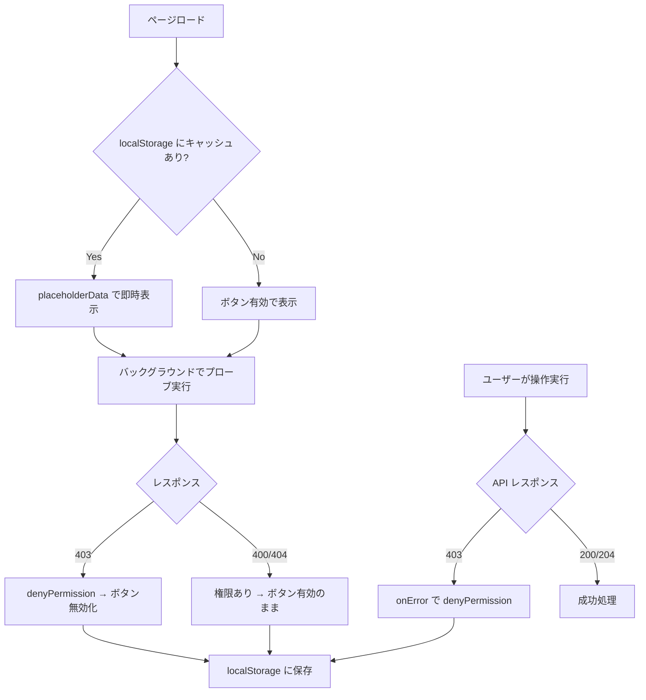

# Power Pages 権限プローブ & UI パターン — 追加教訓 20 項目

> **対象**: Power Pages SPA における書き込み権限のリアルタイム検出とUIへの反映パターン。
> `web-api-implementation.md` の教訓 1〜15 を前提とする。

---

## 権限プローブの基本原理

Power Pages Web API にはメタデータや権限クエリ API が存在しない。
テーブル権限の有無を検出するには「実際に失敗するリクエストを送る」しかない。

### ゼロ GUID プローブパターン

```typescript
const ZERO_GUID = "00000000-0000-0000-0000-000000000000";

// DELETE / PATCH to non-existent record
const res = await fetch(`/_api/geek_incidents(${ZERO_GUID})`, {
  method: "DELETE",
  credentials: "same-origin",
  headers: { "__RequestVerificationToken": token, ... },
});

// 判定ロジック:
// 403 → テーブル権限なし（ボタン無効化）
// 400 / 404 → 権限あり（レコードが存在しないだけ）
const hasPermission = res.status !== 403;
```

---

## 教訓一覧（#16〜#35）

### CSRF トークン

#### 16. SPA では `/_layout/tokenhtml` から CSRF トークンを取得する

Liquid タグ `` はコードサイトの JS 内では使えない。
`/_layout/tokenhtml` エンドポイントが唯一の動的取得手段:

```typescript
const res = await fetch("/_layout/tokenhtml", { credentials: "same-origin" });
const html = await res.text();
const token = html.match(/value="([^"]+)"/)?.[1] ?? "";
```

**注意**: 認証済みユーザーのみアクセス可能。匿名アクセスはログインにリダイレクトされる。

---

### プローブ実装の地雷

#### 17. POST に空ボディ `{}` を送るとレコードが作成される

```typescript
// ❌ 実レコードが作成されてしまう
await fetch("/_api/geek_incidents", { method: "POST", body: "{}" });

// ✅ プローブには DELETE / PATCH + ゼロ GUID のみ使用
await fetch(`/_api/geek_incidents(${ZERO_GUID})`, { method: "DELETE" });
```

**教訓**: テーブルに必須フィールドがない場合、空 POST で空レコードが大量生成される。

#### 18. PATCH に無効なナビゲーションプロパティを送ると 500 が返る（400 ではない）

```typescript
// ❌ 500 Internal Server Error が返る
await fetch(`/_api/geek_incidents(${ZERO_GUID})`, {
  method: "PATCH",
  body: JSON.stringify({ "_invalid@odata.bind": "/nonexistent(xxx)" }),
});

// ✅ 実在するスカラーフィールドを使う
await fetch(`/_api/geek_incidents(${ZERO_GUID})`, {
  method: "PATCH",
  body: JSON.stringify({ geek_name: "_" }),  // 400 = 権限あり
});
```

**教訓**: Power Pages のエラーコードは OData 仕様通りとは限らない。

#### 19. `$top=0` は Power Pages Web API でサポートされていない

```typescript
// ❌ 400 Bad Request が返る
await fetch("/_api/geek_incidents?$top=0&$select=geek_incidentid");

// ✅ 読み取り権限はデータ取得クエリのエラーハンドリングで判定
const { data, isError } = useQuery({ queryFn: () => apiGet("geek_incidents?$top=1") });
// isError && error.message.includes("403") → 読み取り権限なし
```

---

### ブラウザの制約

#### 20. ブラウザの DevTools は 4xx/5xx を必ず赤色で表示する — JS では抑制不可能

`fetch()` でも `XMLHttpRequest` でも `Worker` 内でも、HTTP エラーレスポンスはブラウザコンソールに赤色で表示される。これは仕様であり回避策はない。

**設計判断**: プローブによるコンソールノイズを許容するか、プローブしないかの二択。

#### 21. プローブは該当ページでのみ実行する — グローバルレイアウトに置かない

```typescript
// ❌ ホームページアクセスだけで 6+ リクエストがエラー表示
function Layout() {
  useTablePermissions("geek_incidents");      // PATCH + DELETE = 2 req
  useTablePermissions("geek_categories");     // PATCH + DELETE = 2 req
  useTablePermissions("geek_locations");      // PATCH + DELETE = 2 req
  // ...
}

// ✅ 各ページが自分の必要なテーブルだけチェック
function IncidentsPage() {
  const { data: perms } = useTablePermissions("geek_incidents");
  // ...
}
```

---

### 権限 UI パターン

#### 22. `disabled` 判定は `=== false` で行う（falsy 判定しない）

```typescript
// ❌ undefined（ロード中）も disabled になってしまう
<Button disabled={!perms?.delete}>削除</Button>

// ✅ 明示的に false の場合のみ無効化（undefined = まだ不明 = 有効のまま）
<Button disabled={perms?.delete === false}>削除</Button>
```

#### 23. localStorage + `placeholderData` で即時 UI 反映

```typescript
export function useTablePermissions(entitySet: string) {
  return useQuery<TablePermissions>({
    queryKey: ["tablePermissions", entitySet],
    queryFn: () => checkPermissions(entitySet),
    staleTime: 10 * 60 * 1000,          // 10分キャッシュ
    placeholderData: () => readCache(entitySet),  // localStorage から即時表示
  });
}
```

**効果**: 2回目以降の訪問ではプローブ完了を待たずにボタンが正しい状態で表示される。

#### 24. mutation の `onError` でリアクティブに権限キャッシュを更新

```typescript
export function useDeleteIncident() {
  return useMutation({
    mutationFn: (id: string) => deleteIncident(id),
    onError: (e) => {
      if (e instanceof Error && e.message.startsWith("API 403:")) {
        denyPermission("geek_incidents", "delete");
      }
    },
  });
}
```

**二重ガード**: プローブが何らかの理由で正確でなくても、実操作で 403 が来ればボタンを無効化できる。

#### 25. `denyPermission()` でグローバルキャッシュを更新する設計

```typescript
export function denyPermission(entitySet: string, op: "create" | "update" | "delete") {
  const cached = readCache(entitySet) ?? { create: true, update: true, delete: true };
  cached[op] = false;
  writeCache(entitySet, cached);
  console.info(`[権限キャッシュ] ${entitySet}: ${op}=✗ (403検出により無効化)`);
}
```

---

### デプロイパイプライン

#### 26. `PowerPageComponentDeletePlugin` エラーは無害 — アップロードは成功する

```
XRM Network error: An error occurred in the PowerPageComponentDeletePlugin.
XRM Network error: More than one concurrent Delete requests detected for an Entity...
```

これはサーバー側の並行削除競合であり、最終的にアップロードは成功する。リトライ不要。

#### 27. デプロイ後はサイトリスタート + 60 秒待機が必須

```python
# post_upload_fix.py の最終ステップ
requests.post(f"https://api.powerplatform.com/.../restart?api-version=2022-03-01-preview", ...)
print("All done. Wait 60s then refresh.")
```

CDN / サーバー側キャッシュのパージに 60〜90 秒かかる。

#### 28. `portal/dist/assets/` の古いバンドルを必ず削除してからコピー

```powershell
Remove-Item -Recurse -Force portal/dist/assets/* -ErrorAction SilentlyContinue
Copy-Item -Recurse -Force dist-pages/* portal/dist/
```

古いファイルが残ると `post_upload_fix.py` が誤ったアセットファイル名を検出する。

#### 29. Power Pages 用は専用ブランチで作業する

`main` ブランチに Code Apps 用の Geek Sales がある場合、Power Pages は `feat/power-pages-*` ブランチで開発・デプロイする。誤って main にデプロイすると Code Apps が壊れる。

---

### UI レイアウト

#### 30. カンバンボード列は `flex` + `overflow-x-auto` — `grid` は使わない

```tsx
// ❌ 画面幅不足で列が重なる
<div className="grid grid-cols-5 gap-3">
  <div className="min-w-[240px]">...</div>  {/* overflow → overlap */}
</div>

// ✅ 横スクロール可能なフレックスレイアウト
<div className="overflow-x-auto">
  <div className="flex gap-3 min-w-max">
    <div className="w-[260px] shrink-0">...</div>
  </div>
</div>
```

#### 31. Power Pages SPA は `HashRouter` を使用する

Power Pages はすべてのパスを同じページテンプレートに返す。ブラウザ側のルーティングに `#/` を使うことで、サーバー側のルーティング衝突を回避:

```typescript
import { createHashRouter } from "react-router-dom";

const router = createHashRouter([
  { path: "/", element: <Layout />, children: [...] },
]);
```

**注意**: `createBrowserRouter` を使うと、`/incidents` などのパスが Power Pages のサーバーでルーティングされてしまう。

---

### OData クエリパターン

#### 32. エンティティセット名は複数形（テーブル論理名 + `s`）

| テーブル論理名 | エンティティセット名 |
|---|---|
| `geek_incident` | `geek_incidents` |
| `geek_incidentcategory` | `geek_incidentcategories` |
| `geek_location` | `geek_locations` |

#### 33. ルックアップ値の読み書き形式が異なる

```typescript
// GET レスポンス: _fieldname_value 形式
const categoryId = incident._geek_incidentcategoryid_value;

// POST/PATCH リクエスト: @odata.bind 形式
const body = {
  "geek_IncidentCategoryId@odata.bind": `/geek_incidentcategories(${categoryId})`,
};
```

#### 34. Power Pages では `$expand` が制限される

Dataverse 直接アクセスと異なり、Power Pages の `/_api/` では `$expand` がサポートされないか制限がある場合がある。ルックアップ値は `_xxx_value` で取得し、クライアント側で JOIN する:

```typescript
const incidents = await apiGet("geek_incidents?$select=...,_geek_categoryid_value");
const categories = await apiGet("geek_incidentcategories?$select=...");

// クライアント側で Map を作成してJOIN
const catMap = new Map(categories.map(c => [c.id, c.name]));
```

---

### 認証検出

#### 35. `res.redirected` + URL チェックで認証切れを検出

```typescript
async function handleResponse<T>(res: Response): Promise<T> {
  // Power Pages はログインページにリダイレクトする（302 → /Account/Login）
  if (res.redirected && res.url.includes("/Account/Login")) {
    throw new ApiAuthError(302);
  }
  // ...
}
```

`redirect: 'manual'` は使わない（教訓 #1 参照）。ブラウザにリダイレクトを追跡させ、最終 URL を確認する。

---

## 推奨アーキテクチャ: 権限チェックフロー


