# Phase 0: 環境準備

## 📋 概要

このPhaseでは、Power Apps Code Apps開発に必要なすべてのツールと環境をセットアップします。

**主な実施内容:**
- 開発ツールのインストール
- Power Platform CLIのセットアップ
- VS Code拡張機能のインストール
- Power Platform環境の確認

---

## 🎯 Phase 0の目標

```mermaid
graph LR
    A[開発ツール準備] --> B[Power Platform環境確認]
    B --> C[VS Code + 拡張機能設定]
    C --> D[環境準備完了]
```



**完了条件:**
- ✅ 必要な開発ツールがインストールされている
- ✅ Power Platform CLIが正常に動作する
- ✅ Power Platform環境にアクセスできる
- ✅ VS Code拡張機能がインストールされている

---

## 📝 セットアップ手順

### 🚀 クイックスタート（Windows）

**wingetを使った一括インストール:**
```powershell
# Visual Studio Code
winget install Microsoft.VisualStudioCode

# Node.js (LTS版)
winget install OpenJS.NodeJS.LTS

# Git for Windows
winget install Git.Git

# Power Platform CLI
winget install Microsoft.PowerPlatformCLI
```

> **💡 ヒント**: VS Code起動後、拡張機能マーケットプレイスで「Power Platform Tools」をインストールしてください。

---

### Step 1: Node.jsのインストール

**推奨バージョン:** Node.js 18.x以上（LTS版）

**インストール方法:**

**Windows (winget):**
```powershell
winget install OpenJS.NodeJS.LTS
```

**macOS (Homebrew):**
```bash
brew install node@18
```

**手動インストール:**
1. [Node.js公式サイト](https://nodejs.org/) にアクセス
2. LTS版をダウンロード
3. インストーラーを実行

**確認方法:**
```bash
node --version
# v18.x.x または v20.x.x

npm --version
# 9.x.x以上
```

---

### Step 2: Power Platform CLIのインストール

**インストール方法:**

**Windows:**
```powershell
# PowerShellを管理者として実行
# .NET 6.0 Runtime が必要
winget install Microsoft.PowerPlatformCLI
```

または

```powershell
# NuGet経由でインストール
dotnet tool install --global Microsoft.PowerApps.CLI.Tool
```

**macOS:**
```bash
# Homebrewでインストール
brew tap microsoft/powerplatform-cli
brew install pac
```

**確認方法:**
```bash
pac --version
# Power Platform CLI version 1.x.x
```

---

### Step 3: Power Platform環境の準備

#### 3-1. Power Platform環境へのアクセス確認

1. [Power Apps](https://make.powerapps.com) にアクセス
2. Microsoft アカウントでサインイン
3. 開発用環境を確認

**必要な権限:**
- 環境作成者（Environment Maker）または
- システムカスタマイザー（System Customizer）

#### 3-2. 開発用環境の作成（必要な場合）

1. Power Platform管理センター（https://admin.powerplatform.microsoft.com）にアクセス
2. 「環境」→「+新規」
3. 環境設定:
   - **名前**: Development Environment
   - **種類**: 試用版または開発者
   - **地域**: 日本
   - **Dataverseの追加**: はい

---

### Step 4: VS Codeのインストールと設定

#### 4-1. VS Codeのインストール

**Windows (winget):**
```powershell
winget install Microsoft.VisualStudioCode
```

**macOS (Homebrew):**
```bash
brew install --cask visual-studio-code
```

**手動インストール:**
1. [Visual Studio Code](https://code.visualstudio.com/) をダウンロード
2. インストーラーを実行

#### 4-2. 必須拡張機能のインストール

**Power Platform関連:**
- **Power Platform Tools** (microsoft-IsvExpTools.powerplatform-vscode)

**開発効率化:**
- **ES7+ React/Redux/React-Native snippets** (dsznajder.es7-react-js-snippets)
- **Tailwind CSS IntelliSense** (bradlc.vscode-tailwindcss)
- **Prettier - Code formatter** (esbenp.prettier-vscode)
- **ESLint** (dbaeumer.vscode-eslint)

**インストール方法（コマンドパレット使用）:**
1. VS Codeを開く
2. `Ctrl+Shift+P` (Mac: `Cmd+Shift+P`)
3. "Extensions: Install Extensions"を選択
4. 拡張機能名で検索してインストール

**または、コマンドラインから:**
```bash
code --install-extension microsoft-IsvExpTools.powerplatform-vscode
code --install-extension dsznajder.es7-react-js-snippets
code --install-extension bradlc.vscode-tailwindcss
code --install-extension esbenp.prettier-vscode
code --install-extension dbaeumer.vscode-eslint
```

---

### Step 5: Power Platform CLI認証

#### 5-1. 認証プロファイルの作成

```bash
# 新しい認証プロファイルを作成
pac auth create
```

**実行内容:**
- ブラウザが開く
- Microsoft アカウントでサインイン
- Power Platform環境へのアクセスを許可

#### 5-2. 認証の確認

```bash
# 現在の認証プロファイルを確認
pac auth list

# 出力例:
# Auth Profiles:
# * Universal auth profile (Active)
#   - Cloud: Public
#   - Url: https://your-org.crm7.dynamics.com
```

#### 5-3. 環境の選択

```bash
# 使用する環境を選択
pac env select --environment https://your-org.crm7.dynamics.com

# または環境一覧から選択
pac env list
pac env select --index 1
```

---

### Step 6: Git設定（オプション）

バージョン管理を使用する場合、Gitの設定を行います。

**Gitのインストール:**

**Windows (winget):**
```powershell
winget install Git.Git
```

**macOS (Homebrew):**
```bash
brew install git
```

**手動インストール:**
- [Git公式サイト](https://git-scm.com/) からダウンロードしてインストール

**基本設定:**
```bash
git config --global user.name "Your Name"
git config --global user.email "your.email@example.com"
```

**VS Code統合:**
VS CodeにはGitが統合されているため、追加設定は不要です。

---

## ✅ Phase 0 完了チェックリスト

### 開発ツール
- [ ] Node.js 18.x以上がインストールされている
- [ ] npm が正常に動作する
- [ ] Power Platform CLIがインストールされている
- [ ] `pac --version` でバージョンが表示される

### Power Platform
- [ ] Power Platform環境にアクセスできる
- [ ] `pac auth create` で認証が完了している
- [ ] `pac auth list` で認証プロファイルが表示される
- [ ] 開発用環境が準備されている

### VS Code
- [ ] VS Codeがインストールされている
- [ ] Power Platform Tools拡張機能がインストールされている
- [ ] その他の開発効率化拡張機能がインストールされている

### 権限確認
- [ ] Power Platform環境の作成権限がある
- [ ] アプリの作成権限がある
- [ ] Dataverseへのアクセス権限がある
- [ ] Code Apps が有効化されている環境を使用している
- [ ] Power Apps Premium ライセンスが利用可能

---

## 💡 AI活用のヒント

Phase 0完了後のAI支援例:
- *"開発環境をセットアップしました。Power Platform環境に接続できていますか？"*
- *"環境準備が完了しました。MVPの開発を開始しますか？"*
- *"必要な拡張機能がすべてインストールされているか確認してください"*

---

## 🔧 トラブルシューティング

### Power Platform CLI が認識されない

**Windows:**
```powershell
# 環境変数PATHにPACのパスが含まれているか確認
$env:PATH -split ';' | Select-String "PowerPlatform"

# PACを再インストール
winget uninstall Microsoft.PowerPlatformCLI
winget install Microsoft.PowerPlatformCLI
```

**macOS:**
```bash
# PATHの確認
echo $PATH | grep pac

# Homebrewで再インストール
brew uninstall pac
brew install pac
```

### 認証エラーが発生する

```bash
# 既存の認証をクリア
pac auth clear

# 新規認証を作成
pac auth create --cloud Public
```

### 環境が表示されない

- Power Platform管理センターで環境の状態を確認
- 適切な権限が付与されているか確認
- 環境のURLが正しいか確認

---

## 📚 参考リンク

- [Power Platform CLI公式ドキュメント](https://learn.microsoft.com/ja-jp/power-platform/developer/cli/introduction)
- [Power Apps Code Apps公式ドキュメント](https://learn.microsoft.com/ja-jp/power-apps/developer/code-apps/)
- [Node.js公式サイト](https://nodejs.org/)
- [Visual Studio Code公式サイト](https://code.visualstudio.com/)

---

## 🔄 次のステップ

Phase 0が完了したら、次は **Phase 1: プロジェクト環境構築・PowerProvider・SDK初期化** に進みます。

👉 **[Phase 1 リファレンス](./PHASE1_PROJECT_SETUP.md)** に進む

