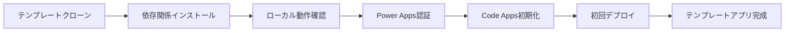

# Phase 1: テンプレートベース開発環境セットアップ

## 📋 概要

このPhaseでは、CodeAppsStarterテンプレートを使用したプロジェクトのセットアップと、Power Apps環境への初回デプロイまでを実施します。

**主な実施内容:**
- CodeAppsStarterテンプレートのクローンとセットアップ
- Power Apps Code Apps初期化
- 依存関係のインストール
- ローカル動作確認
- Power Apps環境への初回デプロイ (`pac code push`)

---

## 🚀 クイックリファレンス

**実施するStep（概要）:**
1. **テンプレートクローン** - CodeAppsStarterリポジトリの複製
2. **依存関係インストール** - `npm install`
3. **ローカル動作確認** - `npm run dev` でテンプレート機能確認
4. **Power Apps認証** - `pac auth create` で環境認証
5. **Code Apps初期化** - `pac code init` でアプリ作成
6. **Power Apps デプロイ** - `pac code push` で初回デプロイ

**統合コマンド（セットアップ）:**
```bash
# テンプレートセットアップとデプロイ（プロジェクト名を指定）
git clone https://github.com/geekfujiwara/CodeAppsStarter.git && mv CodeAppsStarter [プロジェクト名] && cd [プロジェクト名] && npm install && pac auth create && pac code init --displayName "[アプリ表示名]" && npm run build && pac code push
```

**例：**
```bash
# 具体例
git clone https://github.com/geekfujiwara/CodeAppsStarter.git && mv CodeAppsStarter TaskManager && cd TaskManager && npm install && pac auth create && pac code init --displayName "タスクマネージャー" && npm run build && pac code push
```

**Phase 1 完了条件:**
- ✅ テンプレートが正常に動作する
- ✅ Power Platform認証が完了している
- ✅ `pac code push` が正常完了する
- ✅ Power Apps環境でアプリが表示される
- ✅ テンプレートの機能がPower Apps環境で動作する

> **📘 詳細な実装手順**: 以下のステップバイステップガイドを参照してください。

---

## 🎯 Phase 1の目標



**完了条件:**
- ✅ テンプレートがローカルで動作する
- ✅ Power Platform認証が完了している
- ✅ Power Apps環境でテンプレートアプリが動作する
- ✅ 次フェーズでの改修準備が完了している

---

## 📝 Step詳細

### **Step 1: テンプレートのセットアップ**

#### 1-1. プロジェクトディレクトリ準備

```bash
# 作業ディレクトリの作成と移動
mkdir C:\CodeApps -Force
cd C:\CodeApps
```

#### 1-2. テンプレートのクローンとフォルダ名変更

```bash
# CodeAppsStarterテンプレートをクローン
git clone https://github.com/geekfujiwara/CodeAppsStarter.git

# プロジェクト名を決定（例：MyApp、CustomerPortal、TaskManager等）
# フォルダ名を任意のプロジェクト名に変更
mv CodeAppsStarter [プロジェクト名]
cd [プロジェクト名]
```

**例：**
```bash
# 具体例
git clone https://github.com/geekfujiwara/CodeAppsStarter.git
mv CodeAppsStarter MyCustomerPortal
cd MyCustomerPortal
```

**プロジェクト名の決定ガイドライン:**
- 英数字、ハイフン、アンダースコアのみ使用
- 日本語文字は使用しない（フォルダ名として）
- わかりやすいプロジェクト名を選択

**推奨例:**
- `TaskManager` - タスク管理アプリ
- `CustomerPortal` - 顧客ポータル
- `InventorySystem` - 在庫管理システム
- `SalesTracker` - 売上追跡システム

**取得されるテンプレート内容:**
- Vite + React + TypeScript の基盤設定済み
- Power Apps SDK統合済み
- shadcn/ui コンポーネント設定済み
- Tailwind CSS設定済み
- サンプル実装（ダッシュボード、フォーム、ギャラリーなど）

#### 1-3. 依存関係のインストール

```bash
# 依存関係をインストール
npm install
```

**インストールされる主要パッケージ:**
- `@microsoft/power-apps` - Power Apps SDK
- `@tanstack/react-query` - データフェッチライブラリ
- `@radix-ui/*` - shadcn/ui基盤コンポーネント
- `tailwindcss` - CSSフレームワーク

---

### **Step 2: ローカル動作確認**

#### 2-1. 開発サーバーの起動

```bash
# ローカル開発サーバーを起動
npm run dev
```

**実行内容:**
- Vite開発サーバーが起動（通常 http://localhost:5173）
- ブラウザが自動的に開く
- テンプレートアプリの動作確認

#### 2-2. テンプレート機能の確認

**確認すべき機能:**
1. **ダッシュボード** - Learn API を使用した統計表示
2. **ギャラリー** - 検索・フィルター機能付きアイテム一覧
3. **フォーム** - モーダル形式での入力フォーム
4. **プロジェクト管理** - カンバンボード、ガントチャートなどの実装例
5. **テーマ切り替え** - ダークモード対応
6. **レスポンシブ** - モバイル・タブレット対応確認

**注意事項:**
- この段階では外部API（Learn API）を使用しているため、インターネット接続が必要
- すべての機能が正常に動作することを確認してください

---

### **Step 3: Power Platform認証**

#### 3-1. Power Platform CLI認証

```bash
# Power Platform環境への認証
pac auth create
```

**実行内容:**
- ブラウザが開き、Microsoft アカウントでサインイン
- Power Platform環境へのアクセス権限を付与
- 認証プロファイルが作成される

#### 3-2. 対象環境の選択

```bash
# 利用可能な環境を確認
pac env list

# 対象環境を選択
pac env select --environment <環境のURL>
```

**環境URLの確認方法:**
1. [Power Apps](https://make.powerapps.com) にアクセス
2. 右上の環境選択から対象環境を選択
3. 設定アイコン → 開発者リソース → インスタンスURLをコピー

**例:**
```bash
pac env select --environment https://your-org.crm7.dynamics.com
```

---

### **Step 4: Code Apps初期化**

#### 4-1. Power Apps Code Apps初期化

```bash
# Code Appsアプリケーションを初期化
pac code init --displayName "[アプリの表示名]"
```

**例：**
```bash
# プロジェクトに合わせた表示名を設定
pac code init --displayName "カスタマーポータル"
pac code init --displayName "タスクマネージャー"
pac code init --displayName "在庫管理システム"
```

**実行内容:**
- `.pac` フォルダが作成される
- Power Apps Code Appsの設定ファイルが生成される
- アプリが Power Apps環境に登録される

**オプション設定（推奨）:**
```bash
# ロゴ付きで初期化（assetsフォルダにロゴがある場合）
pac code init --displayName "CodeAppsStarterテンプレート" --logo "./public/vite.svg"
```

#### 4-2. 初期化確認

```bash
# Code Appsの状態確認
pac code list
```

**期待される出力:**
- 作成されたアプリの情報が表示される
- 環境内でのアプリIDが確認できる

---

### **Step 5: Power Apps環境への初回デプロイ**

#### 5-1. 本番ビルドの実行

```bash
# 本番用ビルドを実行
npm run build
```

**実行内容:**
- TypeScriptコンパイル
- アセット最適化
- `dist/` フォルダに本番用ファイルを生成

#### 5-2. デプロイの実行

```bash
# Power Apps環境へデプロイ
pac code push
```

**デプロイプロセス:**
1. `dist/` フォルダの内容をPower Apps環境にアップロード
2. アプリをPower Apps環境に登録・更新
3. ユーザーがアクセス可能な状態にする

#### 5-3. デプロイ確認

**Power Apps環境での確認:**
1. [Power Apps](https://make.powerapps.com) にアクセス
2. 「アプリ」セクションで作成したアプリを確認
3. アプリを開いてテンプレート機能が動作することを確認

**確認すべき項目:**
- ✅ アプリが正常に起動する
- ✅ ダッシュボードが表示される
- ✅ ナビゲーションが機能する
- ✅ Learn API からのデータが取得・表示される
- ✅ フォーム機能が動作する
- ✅ テーマ切り替えが機能する

---

### **Step 6: テンプレートアプリの動作確認**

#### 6-1. 基本機能テスト

**ダッシュボード:**
- 統計カードの表示確認
- Learn API データの取得確認

**ギャラリー機能:**
- 検索機能の動作確認
- フィルター機能の動作確認
- ページネーションの確認

**プロジェクト管理:**
- カンバンボードの操作確認
- ガントチャートの動作確認
- タスク優先順位管理の確認

#### 6-2. レスポンシブ対応確認

**確認デバイス:**
- デスクトップ表示
- タブレット表示
- モバイル表示

**確認項目:**
- サイドバーナビゲーションの折りたたみ
- レイアウトの適切な調整
- タッチ操作の動作

---

### **Step 7: テスト実行**

#### 7-1. 開発サーバー起動

```bash
npm run dev
```

**期待される動作:**
1. Power Apps SDK サーバーが起動（別ウィンドウまたはバックグラウンド）
2. Vite開発サーバーが起動（http://localhost:3000）
3. ブラウザが自動的に開く（または手動でアクセス）

#### 7-2. 動作確認

**ローカル環境:**
- ブラウザで http://localhost:3000 にアクセス
- デフォルトのReactアプリが表示される
- コンソールエラーがないことを確認

**Power Apps環境:**
1. [Power Apps](https://make.powerapps.com) にアクセス
2. アプリ一覧から作成したアプリを選択
3. アプリが正常に表示されることを確認

#### 7-3. トラブルシューティング

**エラー: "Cannot find module '@microsoft/power-apps'"**
```bash
# 解決策: SDKを再インストール
npm install --save "@microsoft/power-apps"
```

**エラー: "Port 3000 is already in use"**
```bash
# 解決策: 既存プロセスを終了してから再起動
# Windowsの場合
netstat -ano | findstr :3000
taskkill /PID <プロセスID> /F

# または別のポートを使用（非推奨）
# vite.config.ts で server.port を変更
```

**エラー: "PowerProvider initialization failed"**
- Power Platform認証が期限切れの可能性
```bash
# 解決策: 再認証
pac auth create
pac env select --environment <環境のURL>
```

---

## ✅ Phase 1 完了チェックリスト

### 開発環境
- [ ] Viteプロジェクトが作成されている
- [ ] `npm install` が正常に完了している
- [ ] `@types/node` がインストールされている

## ✅ Phase 1 完了チェックリスト

### テンプレート環境
- [ ] CodeAppsStarterテンプレートがクローンされている
- [ ] `npm install` が正常に完了している
- [ ] `npm run dev` でローカルサーバーが起動する
- [ ] テンプレートの全機能がローカルで動作する

### Power Platform設定
- [ ] `pac auth create` で認証が完了している
- [ ] `pac env select` で環境が選択されている
- [ ] `pac code init` でアプリが作成されている
- [ ] アプリがPower Apps環境に登録されている

### デプロイ確認
- [ ] `npm run build` が正常に完了する
- [ ] `pac code push` が正常に完了する
- [ ] Power Apps環境でアプリが起動する
- [ ] テンプレートの機能がPower Apps環境で動作する

### 機能動作確認
- [ ] ダッシュボードが正常に表示される
- [ ] ギャラリー・フィルター機能が動作する
- [ ] フォーム機能が動作する
- [ ] プロジェクト管理ツール（カンバン等）が動作する
- [ ] テーマ切り替えが機能する
- [ ] レスポンシブデザインが適切に動作する

---

## 🔧 トラブルシューティング

### テンプレートクローン時のエラー

**エラー: "Repository not found"**
```bash
# 解決策: URLを確認してクローン
git clone https://github.com/geekfujiwara/CodeAppsStarter.git
```

### デプロイ時のエラー

**エラー: "Build failed"**
```bash
# 解決策: 依存関係を再インストール
npm ci
npm run build
```

**エラー: "pac code push failed"**
```bash
# 解決策: 認証を確認し、再度実行
pac auth list
pac env select --environment <環境のURL>
pac code push
```

---

## 📚 関連リファレンス

### テンプレート情報
- [CodeAppsStarter リポジトリ](https://github.com/geekfujiwara/CodeAppsStarter)
- [テンプレート内の使い方ガイド](https://github.com/geekfujiwara/CodeAppsStarter#テンプレートの使い方)

### 公式ドキュメント
- [Power Apps Code Apps 公式ドキュメント](https://learn.microsoft.com/ja-jp/power-apps/developer/code-apps/)
- [PAC CLI リファレンス](https://learn.microsoft.com/ja-jp/power-platform/developer/cli/reference/code)

### 内部リファレンス
- **[docs/README.md](./docs/README.md)** - ドキュメント一覧とナビゲーション
- **[docs/INDEX.md](./docs/INDEX.md)** - 開発フェーズ別ガイド

---

## 🔄 次のステップ

Phase 1が完了したら、次は **Phase 2: UI基盤・デザインシステム・MVP構築** に進みます。

**重要な変更点:**
- Phase 1でテンプレートアプリが完成した状態になります
- Phase 2では、このテンプレートを元に具体的な要件に合わせてアプリを改修していきます
- これまでのスクラッチ開発からテンプレートベースの改修型開発に移行します

👉 **[Phase 2 リファレンス](./PHASE2_UI_DESIGN_SYSTEM.md)** に進む
