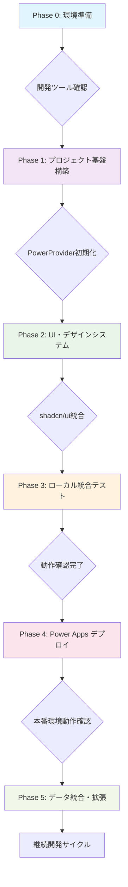

# Phase 2: UI・デザインシステム統合

## 📋 概要

このPhaseでは、**CodeAppsStarterテンプレート**のデザインシステムを参照・活用し、プロジェクト要件に合わせてカスタマイズを実施します。

**基本方針: テンプレート参照型開発**
- 実装コードはテンプレートを参照
- ブランドカスタマイズのみ本開発標準で実施
- コード重複を避け、メンテナンスコストを削減
- テンプレート品質を活用した高速開発

---

## 🎯 実施内容

### 1. テンプレートデザインシステムの確認
CodeAppsStarterテンプレートのデザイン基盤を理解し、プロジェクト要件とのマッピングを行います。

**参照先:**
- 📖 **[CodeAppsStarter README.md](https://github.com/geekfujiwara/CodeAppsStarter/blob/main/README.md)** - デザインシステム概要
- 📖 **[shadcn/ui + Tailwind CSS設定](https://github.com/geekfujiwara/CodeAppsStarter/blob/main/tailwind.config.js)** - テーマ設定
- 📖 **[グローバルCSS](https://github.com/geekfujiwara/CodeAppsStarter/blob/main/src/app/globals.css)** - CSS変数・ベーススタイル

### 2. ブランド要素のカスタマイズ
プロジェクト固有のブランド要素を適用します。

**カスタマイズガイド:**
- **[ロゴ実装マスターガイド](./docs/LOGO_MASTER_GUIDE.md)** - ロゴ変更・SVGアイコン作成
- **[テーマカスタマイズガイド](./docs/THEME_CUSTOMIZATION_GUIDE.md)** - 色・フォント・テーマ変更

### 3. UIコンポーネントの活用
テンプレートのUIコンポーネントを参照して機能実装を行います。

**参照先:**
- 📖 **[UIコンポーネント集](https://github.com/geekfujiwara/CodeAppsStarter/tree/main/src/components/ui)** - shadcn/ui実装例
- 📖 **[ページコンポーネント](https://github.com/geekfujiwara/CodeAppsStarter/tree/main/src/app)** - レイアウト・ページ実装例
- **[shadcn/ui拡張ガイド](./docs/SHADCN_UI_EXTENSION_GUIDE.md)** - カスタムコンポーネント作成

### 4. レスポンシブデザインの確認
テンプレートのレスポンシブ設計を確認し、必要に応じてカスタマイズします。

**参照先:**
- 📖 **[レスポンシブレイアウト](https://github.com/geekfujiwara/CodeAppsStarter/blob/main/src/components/layout/)** - レイアウト実装例
- 📖 **[Tailwind CSS設定](https://github.com/geekfujiwara/CodeAppsStarter/blob/main/tailwind.config.js)** - ブレイクポイント設定
- ✅ **テンプレート品質維持**: 既存のデザインシステムを最大活用
- ✅ **リファレンス主導**: テンプレートの実装を参照してプロジェクト適用
- ✅ **shadcn/ui活用**: テンプレートのUIコンポーネントを基盤使用
- ⚠️ **PowerProvider.tsxは変更しない**
- ⚠️ **Power Apps接続部分は変更しない**

**統合コマンド（すべてのチェック）:**
```bash
# ビルド・リント確認
npm run build && npm run lint
```

**Phase 2 完了条件:**
- ✅ テンプレートの機能・デザインを理解し要件マッピングが完了
---

## ✅ 成果物・完了基準

### 必須成果物
1. **ブランド適用完了**
   - ロゴ・アプリ名の変更
   - プロジェクト固有色の適用

2. **テンプレート機能の確認**
   - UIコンポーネントの動作確認
   - レスポンシブデザインの確認

3. **カスタマイズ実装**
   - プロジェクト要件に合わせたUI調整
   - 必要に応じた新機能追加

### 完了基準
- [ ] テンプレートデザインシステムの理解完了
- [ ] ブランド要素（ロゴ、色、名前）の適用完了
- [ ] UIコンポーネントの要件適合確認完了
- [ ] レスポンシブデザインの動作確認完了
- [ ] TypeScript・ESLintエラーゼロ
- [ ] 本番環境での表示確認完了

---

## 📖 関連ドキュメント

- **[PHASE1: プロジェクトセットアップ](./PHASE1_PROJECT_SETUP.md)** - 前Phase
- **[PHASE3: ローカルテスト](./PHASE3_LOCAL_TESTING.md)** - 次Phase
- **[ロゴ実装マスターガイド](./docs/LOGO_MASTER_GUIDE.md)** - ロゴカスタマイズ詳細
- **[テーマカスタマイズガイド](./docs/THEME_CUSTOMIZATION_GUIDE.md)** - テーマ変更詳細
- **[shadcn/ui拡張ガイド](./docs/SHADCN_UI_EXTENSION_GUIDE.md)** - UI拡張詳細

---

## 🔧 トラブルシューティング

問題が発生した場合は、以下を参照してください：

1. **テンプレート参照**
   - 📖 **[CodeAppsStarter Issues](https://github.com/geekfujiwara/CodeAppsStarter/issues)** - 既知の問題・解決策

2. **技術ドキュメント**
   - **[Next.js公式ドキュメント](https://nextjs.org/docs)**
   - **[shadcn/ui公式ドキュメント](https://ui.shadcn.com/)**
   - **[Tailwind CSS公式ドキュメント](https://tailwindcss.com/docs)**

3. **開発標準内ガイド**
   - **[docs/INDEX.md](./docs/INDEX.md)** - 技術ガイド一覧
   - **[PHASE3: ローカルテスト](./PHASE3_LOCAL_TESTING.md)** - デバッグ手順
📁 CodeAppsStarter/tailwind.config.js     # テーマ設定
📁 CodeAppsStarter/src/index.css          # CSS変数・ベーススタイル

# 実装例
📁 CodeAppsStarter/src/components/        # カスタムコンポーネント実装
📁 CodeAppsStarter/src/pages/             # ページ実装例
```

#### 1-3. 要件とテンプレートのマッピング

**変更が必要な項目を特定:**
- [ ] **アプリ名**: 現在「Code Apps Starter」→ プロジェクト名に変更
- [ ] **ロゴ**: Viteロゴ → プロジェクト専用ロゴに変更  
- [ ] **ナビゲーション**: テンプレートのメニュー構成 → 要件に合わせて調整
- [ ] **機能**: Learn API機能 → プロジェクト要件の機能に置換・拡張
- [ ] **UI要素**: テンプレートの色・文言 → ブランド要素に変更

#### 1-3. 改修計画の作成

- 📖 **[Form](https://github.com/geekfujiwara/CodeAppsStarter/blob/main/src/components/ui/form.tsx)** - フォーム管理

**ページコンポーネント:**
- 📖 **[Dashboard](https://github.com/geekfujiwara/CodeAppsStarter/blob/main/src/pages/Dashboard.tsx)** - ダッシュボード実装例
- 📖 **[Gallery](https://github.com/geekfujiwara/CodeAppsStarter/blob/main/src/pages/Gallery.tsx)** - ギャラリー実装例
- 📖 **[Forms](https://github.com/geekfujiwara/CodeAppsStarter/blob/main/src/pages/Forms.tsx)** - フォーム実装例
- 📖 **[Projects](https://github.com/geekfujiwara/CodeAppsStarter/blob/main/src/pages/Projects.tsx)** - プロジェクト管理実装例

**レイアウトコンポーネント:**
- 📖 **[AppSidebar](https://github.com/geekfujiwara/CodeAppsStarter/blob/main/src/components/AppSidebar.tsx)** - サイドバー実装
- 📖 **[AppHeader](https://github.com/geekfujiwara/CodeAppsStarter/blob/main/src/components/AppHeader.tsx)** - ヘッダー実装
- 📖 **[ThemeToggle](https://github.com/geekfujiwara/CodeAppsStarter/blob/main/src/components/ThemeToggle.tsx)** - テーマ切替

**テーマシステム:**
- 📖 **[Tailwind Config](https://github.com/geekfujiwara/CodeAppsStarter/blob/main/tailwind.config.js)** - テーマ設定
- 📖 **[CSS Variables](https://github.com/geekfujiwara/CodeAppsStarter/blob/main/src/index.css)** - CSS変数定義
- 📖 **[Utils](https://github.com/geekfujiwara/CodeAppsStarter/blob/main/src/lib/utils.ts)** - ユーティリティ関数

#### 2-2. カスタマイズ手順

**ステップ1: テンプレートコードを参照してプロジェクトにコピー**
```bash
# テンプレートの実装を参照して新しいコンポーネントを作成
# 例: CustomerCardコンポーネントをCardコンポーネントを参照して作成
cp CodeAppsStarter/src/components/ui/card.tsx src/components/CustomerCard.tsx
```

**ステップ2: ブランド要素のカスタマイズ**
```bash
# アプリ名変更
package.jsonの"name"を変更
index.htmlの<title>を変更

# ロゴ変更
ロゴファイルをpublic/assets/に配置
pac code update --logo "./public/assets/logo.svg"
```

> **📘 詳細なロゴ実装ガイド**  
> ロゴのデザイン仕様、実装パターン、トラブルシューティングは [LOGO_MASTER_GUIDE.md](./docs/LOGO_MASTER_GUIDE.md) を参照してください。

---

### **Step 3: テンプレート機能の改修**

#### 3-1. 不要な機能の削除・無効化

**例：Learn APIを使用した機能を無効化**
```typescript
// テンプレートのLearn API機能を一時的に無効化またはプレースホルダーに変更
// src/services/learnApi.ts を確認・修正
```

#### 3-2. ナビゲーション構成の変更

**サイドバーメニューのカスタマイズ:**
```typescript
// src/components/Sidebar.tsx
// メニュー項目を要件に合わせて変更
const menuItems = [
  { name: 'ダッシュボード', href: '/', icon: Home },
  { name: '顧客管理', href: '/customers', icon: Users },
  { name: '注文履歴', href: '/orders', icon: ShoppingCart },
  // テンプレートのメニューから要件に合わせて変更
];
```

#### 3-3. 既存ページの内容変更

**ダッシュボードページの改修例:**
```typescript
// src/pages/Dashboard.tsx
// Learn API統計 → プロジェクト固有の統計に変更
const dashboardStats = [
  { title: '総顧客数', value: '1,234', change: '+12%' },
  { title: '今月の注文', value: '567', change: '+8%' },
  // テンプレートの統計からプロジェクトに合わせて変更
];
```

---

### **Step 4: 新機能の追加実装**

#### 4-1. 新しいページコンポーネント作成

**例：顧客管理ページの追加**
```typescript
// src/pages/Customers.tsx
import { Card, CardContent, CardHeader, CardTitle } from '@/components/ui/card';
import { Button } from '@/components/ui/button';

export const CustomersPage = () => {
  return (
    <div className="p-6 space-y-6">
      <div className="flex justify-between items-center">
        <h1 className="text-3xl font-bold">顧客管理</h1>
        <Button>新規顧客追加</Button>
      </div>
      {/* テンプレートのデザインシステムを活用した新機能 */}
    </div>
  );
};
```

#### 4-2. ルーティングの追加

```typescript
// src/App.tsx またはルーター設定ファイル
import { CustomersPage } from './pages/Customers';

// ルート設定に新しいページを追加
```

#### 4-3. データフェッチの実装

**テンプレートのReact Query パターンを活用:**
```typescript
// src/hooks/useCustomers.ts
import { useQuery } from '@tanstack/react-query';

export const useCustomers = () => {
  return useQuery({
    queryKey: ['customers'],
    queryFn: async () => {
      // プロジェクト固有のAPI呼び出し
      // またはMicrosoft Graph API、Dataverse等
    },
  });
};
```

---

### **Step 5: UIコンポーネントのカスタマイズ**

#### 5-1. カラーテーマの調整

**テンプレートのTailwind設定をカスタマイズ:**
```javascript
// tailwind.config.js
module.exports = {
  theme: {
    extend: {
      colors: {
        // プロジェクト固有のブランドカラーを追加
        brand: {
          50: '#f0f9ff',
          500: '#0ea5e9',
          600: '#0284c7',
        }
      },
    },
  },
};
```

#### 5-2. 既存コンポーネントのスタイル調整

**例：カードコンポーネントのカスタマイズ**
```typescript
// src/components/CustomCard.tsx
import { Card } from '@/components/ui/card';
import { cn } from '@/lib/utils';

export const CustomCard = ({ className, ...props }) => {
  return (
    <Card 
      className={cn(
        // テンプレートのベーススタイルに追加スタイルを適用
        "border-brand-200 hover:border-brand-300 transition-colors",
        className
      )} 
      {...props} 
    />
  );
};
```

---

### **Step 6: 統合テスト・動作確認**

#### 6-1. 改修内容の動作確認

```bash
# ローカル環境で動作確認
npm run dev
```

**確認項目:**
- [ ] 新しいブランド要素が適用されている
- [ ] 改修した機能が正常に動作する
- [ ] 追加した新機能が動作する
- [ ] テンプレートの既存機能が引き続き動作する
- [ ] レスポンシブデザインが維持されている
- [ ] ダークモード切り替えが機能する

#### 6-2. エラーハンドリングの確認

**各機能でのエラー処理:**
- API接続失敗時の表示
- 入力バリデーション
- 権限エラーの処理

---

### **Step 7: エラーチェック・最終確認**

#### 7-1. ビルドテスト

```bash
# TypeScript型チェック
npx tsc --noEmit

# ESLintチェック
npm run lint

# 本番ビルドテスト
npm run build
```

#### 7-2. 機能テスト

**テンプレートの基本機能:**
- [ ] サイドバーナビゲーションが動作する
- [ ] ダークモード切り替えが機能する
- [ ] レスポンシブデザインが正常に動作する

**改修・追加した機能:**
- [ ] 新しいページが正常に表示される
- [ ] カスタマイズしたコンポーネントが動作する
- [ ] ブランド要素が適切に表示される

#### 7-3. Power Apps連携確認

```bash
# Power Apps環境との接続テスト
pac code run
# ブラウザで http://localhost:3000 にアクセス
```

**PowerProvider接続確認:**
- [ ] PowerProviderが正常に初期化される
- [ ] Power Apps SDKエラーが発生しない
- [ ] ブラウザコンソールにエラーがない

---

```css
@tailwind base;
@tailwind components;
@tailwind utilities;

:root {
  /* 基本カラー */
  --background: 0 0% 100%;
  --foreground: 222.2 84% 4.9%;
  --card: 0 0% 100%;
  --card-foreground: 222.2 84% 4.9%;
  --popover: 0 0% 100%;
  --popover-foreground: 222.2 84% 4.9%;
  --primary: 222.2 47.4% 11.2%;
  --primary-foreground: 210 40% 98%;
  --secondary: 210 40% 96.1%;
  --secondary-foreground: 222.2 47.4% 11.2%;
  --muted: 210 40% 96.1%;
  --muted-foreground: 215.4 16.3% 46.9%;
  --accent: 210 40% 96.1%;
  --accent-foreground: 222.2 47.4% 11.2%;
  --destructive: 0 84.2% 60.2%;
  --destructive-foreground: 210 40% 98%;
  --border: 214.3 31.8% 91.4%;
  --input: 214.3 31.8% 91.4%;
  --ring: 222.2 47.4% 11.2%;
  --radius: 0.5rem;
}

.dark {
  --background: 222.2 84% 4.9%;
  --foreground: 210 40% 98%;
  --card: 222.2 84% 4.9%;
  --card-foreground: 210 40% 98%;
  --popover: 222.2 84% 4.9%;
  --popover-foreground: 210 40% 98%;
  --primary: 210 40% 98%;
  --primary-foreground: 222.2 47.4% 11.2%;
  --secondary: 217.2 32.6% 17.5%;
  --secondary-foreground: 210 40% 98%;
  --muted: 217.2 32.6% 17.5%;
  --muted-foreground: 215 20.2% 65.1%;
  --accent: 217.2 32.6% 17.5%;
  --accent-foreground: 210 40% 98%;
  --destructive: 0 62.8% 30.6%;
  --destructive-foreground: 210 40% 98%;
  --border: 217.2 32.6% 17.5%;
  --input: 217.2 32.6% 17.5%;
  --ring: 212.7 26.8% 83.9%;
}
```

#### 3-2. セマンティックカラーの定義

**用途別のカラー設定:**

| 用途 | カラー | Tailwind クラス |
|------|--------|-----------------|
| 成功・完了 | Green | `text-green-600` `bg-green-50` `dark:bg-green-950/20` |
| 進行中 | Blue | `text-blue-600` `bg-blue-50` `dark:bg-blue-950/20` |
| 警告 | Yellow | `text-yellow-600` `bg-yellow-50` `dark:bg-yellow-950/20` |
| エラー・遅延 | Red | `text-red-600` `bg-red-50` `dark:bg-red-950/20` |
| 進捗率 | Purple | `text-purple-600` `bg-purple-50` `dark:bg-purple-950/20` |
| 情報 | Muted | `text-muted-foreground` `bg-muted` |

**ダークモード対応の例:**
```tsx
// ライト・ダーク両対応のバッジ
<div className="bg-green-50 dark:bg-green-950/20">
  <span className="text-green-600 dark:text-green-400">完了</span>
</div>
```

#### 3-3. タイポグラフィシステム

**見出しスタイル:**
```tsx
// ページタイトル (h1)
<h1 className="text-3xl font-bold text-foreground">
  ページタイトル
</h1>

// セクションタイトル (h2)
<h2 className="text-2xl font-semibold text-foreground">
  セクションタイトル
</h2>

// カードタイトル (h3)
<h3 className="text-lg font-semibold text-foreground">
  カードタイトル
</h3>

// サイドメニューセクションヘッダー
<h3 className="text-xs font-semibold text-muted-foreground uppercase tracking-wider px-2">
  セクション名
</h3>
```

**本文スタイル:**
```tsx
// 通常テキスト
<p className="text-base text-foreground">通常の本文</p>

// 小さいテキスト（補足情報）
<p className="text-sm text-muted-foreground">補足情報</p>

// 極小テキスト（ラベル）
<p className="text-xs text-muted-foreground">ラベル</p>
```

#### 3-4. スペーシングシステム

**一貫したスペーシング:**
- `space-y-2`: 要素間の小さい間隔（8px）
- `space-y-4`: 要素間の中間隔（16px）
- `space-y-6`: 要素間の大きい間隔（24px）
- `gap-4`: グリッドアイテム間の間隔（16px）
- `p-4`: パディング（16px）
- `p-6`: 大きめのパディング（24px）

**Power Platform公式カラー:**

| カラー変数 | HEX | 用途 |
|-----------|-----|------|
| `--power-blue` | #4072B3 | プライマリーカラー、メインアクション |
| `--power-blue-light` | #6088C6 | ホバー状態、セカンダリー要素 |
| `--power-blue-lighter` | #AEC4E5 | 背景、淡いアクセント |
| `--power-red` | #EB8686 | エラー、警告、削除アクション |
| `--power-gray` | #C0C0C0 | 無効状態、ボーダー |

**使用例:**
```typescript
// TailwindCSSクラスで使用
<button className="bg-primary text-primary-foreground">
  送信
</button>

// CSS変数として直接使用
<div style={{ backgroundColor: 'var(--power-blue)' }}>
  Power Apps
</div>
```

---

### **Step 4: レイアウトコンポーネント実装**

このステップでは、CommonHeader、SideMenu、MainLayoutの3つのレイアウトコンポーネントを実装します。

#### 4-1. 基本レイアウト構造

**推奨レイアウト構成:**
```
┌─────────────────────────────────────────────────────┐
│ CommonHeader (固定ヘッダー - 64px)                   │
├──────────┬──────────────────────────────────────────┤
│          │                                          │
│ SideMenu │ Main Content Area                        │
│ (256px)  │ (動的コンテンツ)                          │
│          │                                          │
│          │                                          │
└──────────┴──────────────────────────────────────────┘
```

**重要な寸法:**

| 要素 | 高さ/幅 | クラス |
|------|---------|--------|
| ヘッダー | 64px (h-16) | `h-16` |
| サイドメニュー | 256px | `w-64` |
| メインコンテンツの高さ | calc(100vh - 4rem) | `h-[calc(100vh-4rem)]` |
| メインコンテンツのトップ余白 | 64px (pt-16) | `pt-16` |

#### 4-2. CommonHeader コンポーネント

**ファイルパス:** `src/components/Layout/CommonHeader.tsx`

```tsx
import { useState } from 'react';
import { Button } from '@/components/ui/button';
import { Avatar, AvatarFallback, AvatarImage } from '@/components/ui/avatar';
import { Menu } from 'lucide-react';
import { ThemeToggle } from '@/components/ThemeToggle';

interface CommonHeaderProps {
  onMenuToggle: () => void;
  title?: string;
  subtitle?: string;
}

export const CommonHeader: React.FC<CommonHeaderProps> = ({
  onMenuToggle,
  title = "アプリ名",
  subtitle = "説明"
}) => {
  return (
    <header className="sticky top-0 z-50 w-full border-b border-border bg-card/95 backdrop-blur-md supports-[backdrop-filter]:bg-card/80 shadow-sm">
      <div className="flex h-16 items-center justify-between px-4 md:px-6">
        {/* 左側: メニューボタン + タイトル */}
        <div className="flex items-center space-x-4">
          <Button 
            variant="ghost" 
            size="icon"
            onClick={onMenuToggle}
          >
            <Menu className="h-5 w-5" />
          </Button>
          <div className="flex flex-col">
            <span className="font-semibold text-foreground">{title}</span>
            <span className="text-xs text-muted-foreground">{subtitle}</span>
          </div>
        </div>

        {/* 右側: テーマトグル + プロフィール */}
        <div className="flex items-center space-x-2">
          <ThemeToggle />
          <Avatar className="h-8 w-8">
            <AvatarImage src="/assets/avatar.png" />
            <AvatarFallback>U</AvatarFallback>
          </Avatar>
        </div>
      </div>
    </header>
  );
};
```

**特徴:**
- **固定位置**: `sticky top-0 z-50`
- **半透明背景**: `bg-card/95 backdrop-blur-md`
- **ガラスモーフィズム効果**: `backdrop-blur-md`
- **影**: `shadow-sm`

#### 4-3. SideMenu コンポーネント

**ファイルパス:** `src/components/Layout/SideMenu.tsx`

```tsx
import { useState } from 'react';
import { Button } from '@/components/ui/button';
import { cn } from '@/lib/utils';
import { Home, Users, Settings, FileText } from 'lucide-react';

interface SideMenuProps {
  isOpen: boolean;
  onClose?: () => void;
}

export const SideMenu: React.FC<SideMenuProps> = ({ isOpen, onClose }) => {
  return (
    <aside className={cn(
      "fixed left-0 top-16 h-[calc(100vh-4rem)] bg-card border-r border-border transition-all duration-300 z-40",
      isOpen ? "w-64" : "w-0"
    )}>
      <div className={cn("h-full flex flex-col overflow-y-auto", !isOpen && "hidden")}>
        <div className="flex-1">
          <div className="p-4 space-y-6">
            {/* ホームセクション */}
            <div className="space-y-2">
              <h3 className="text-xs font-semibold text-muted-foreground uppercase tracking-wider px-2">
                ホーム
              </h3>
              <Button variant="ghost" className="w-full justify-start">
                <Home className="h-4 w-4 mr-2" />
                ダッシュボード
              </Button>
            </div>

            {/* プロジェクトセクション */}
            <div className="space-y-2">
              <h3 className="text-xs font-semibold text-muted-foreground uppercase tracking-wider px-2">
                プロジェクト
              </h3>
              <Button variant="ghost" className="w-full justify-start">
                <FileText className="h-4 w-4 mr-2" />
                タスク一覧
              </Button>
              <Button variant="ghost" className="w-full justify-start">
                <Users className="h-4 w-4 mr-2" />
                メンバー
              </Button>
            </div>

            {/* その他セクション */}
            <div className="space-y-2">
              <h3 className="text-xs font-semibold text-muted-foreground uppercase tracking-wider px-2">
                その他
              </h3>
              <Button variant="ghost" className="w-full justify-start">
                <Settings className="h-4 w-4 mr-2" />
                設定
              </Button>
            </div>
          </div>
        </div>

        {/* フッター */}
        <div className="border-t border-border p-4">
          <div className="text-xs text-muted-foreground">
            <div className="font-semibold">アプリ名</div>
            <div>v1.0.0</div>
          </div>
        </div>
      </div>
    </aside>
  );
};
```

**特徴:**
- **固定位置**: `fixed left-0 top-16`
- **アニメーション**: `transition-all duration-300`
- **開閉制御**: `w-64` / `w-0`
- **セクション分け**: ホーム、プロジェクト、その他

#### 4-4. MainLayout 統合コンポーネント

**ファイルパス:** `src/components/Layout/MainLayout.tsx`

```tsx
import { useState } from 'react';
import { CommonHeader } from './CommonHeader';
import { SideMenu } from './SideMenu';
import { cn } from '@/lib/utils';

interface MainLayoutProps {
  children: React.ReactNode;
}

export const MainLayout: React.FC<MainLayoutProps> = ({ children }) => {
  const [sidebarOpen, setSidebarOpen] = useState(true);

  return (
    <div className="min-h-screen bg-background">
      {/* ヘッダー */}
      <CommonHeader 
        onMenuToggle={() => setSidebarOpen(!sidebarOpen)}
        title="アプリ名"
        subtitle="サブタイトル"
      />

      {/* サイドメニュー */}
      <SideMenu 
        isOpen={sidebarOpen}
        onClose={() => setSidebarOpen(false)}
      />

      {/* メインコンテンツ */}
      <main className={cn(
        "transition-all duration-300 pt-16",
        sidebarOpen ? "ml-64" : "ml-0"
      )}>
        <div className="h-[calc(100vh-4rem)] overflow-y-auto">
          <div className="container mx-auto p-6">
            {children}
          </div>
        </div>
      </main>
    </div>
  );
};
```

---

### **Step 5: ダークモード・ライトモード対応**

このステップでは、ThemeContext、ThemeProvider、ThemeToggleコンポーネントを実装してテーマ切り替え機能を追加します。

#### 5-1. ThemeContext の作成

**ファイルパス:** `src/contexts/ThemeContext.tsx`

```tsx
import React, { createContext, useContext, useEffect, useState } from 'react';

type Theme = 'dark' | 'light' | 'system';

type ThemeProviderProps = {
  children: React.ReactNode;
  defaultTheme?: Theme;
  storageKey?: string;
};

type ThemeProviderState = {
  theme: Theme;
  setTheme: (theme: Theme) => void;
};

const initialState: ThemeProviderState = {
  theme: 'system',
  setTheme: () => null,
};

const ThemeProviderContext = createContext<ThemeProviderState>(initialState);

export function ThemeProvider({
  children,
  defaultTheme = 'system',
  storageKey = 'code-app-ui-theme',
  ...props
}: ThemeProviderProps) {
  const [theme, setTheme] = useState<Theme>(
    () => (localStorage.getItem(storageKey) as Theme) || defaultTheme
  );

  useEffect(() => {
    const root = window.document.documentElement;
    root.classList.remove('light', 'dark');

    if (theme === 'system') {
      const systemTheme = window.matchMedia('(prefers-color-scheme: dark)').matches
        ? 'dark'
        : 'light';
      root.classList.add(systemTheme);
      return;
    }

    root.classList.add(theme);
  }, [theme]);

  const value = {
    theme,
    setTheme: (theme: Theme) => {
      localStorage.setItem(storageKey, theme);
      setTheme(theme);
    },
  };

  return (
    <ThemeProviderContext.Provider {...props} value={value}>
      {children}
    </ThemeProviderContext.Provider>
  );
}

export const useTheme = () => {
  const context = useContext(ThemeProviderContext);

  if (context === undefined)
    throw new Error('useTheme must be used within a ThemeProvider');

  return context;
};
```

#### 5-2. ThemeToggle コンポーネント

**ファイルパス:** `src/components/ThemeToggle.tsx`

```tsx
import { Moon, Sun } from "lucide-react";
import { Button } from "@/components/ui/button";
import {
  DropdownMenu,
  DropdownMenuContent,
  DropdownMenuItem,
  DropdownMenuTrigger,
} from "@/components/ui/dropdown-menu";
import { useTheme } from "@/contexts/ThemeContext";

export function ThemeToggle() {
  const { setTheme } = useTheme();

  return (
    <DropdownMenu>
      <DropdownMenuTrigger asChild>
        <Button variant="ghost" size="icon">
          <Sun className="h-[1.2rem] w-[1.2rem] rotate-0 scale-100 transition-all dark:-rotate-90 dark:scale-0" />
          <Moon className="absolute h-[1.2rem] w-[1.2rem] rotate-90 scale-0 transition-all dark:rotate-0 dark:scale-100" />
          <span className="sr-only">テーマ切り替え</span>
        </Button>
      </DropdownMenuTrigger>
      <DropdownMenuContent align="end">
        <DropdownMenuItem onClick={() => setTheme("light")}>
          ライト
        </DropdownMenuItem>
        <DropdownMenuItem onClick={() => setTheme("dark")}>
          ダーク
        </DropdownMenuItem>
        <DropdownMenuItem onClick={() => setTheme("system")}>
          システム設定
        </DropdownMenuItem>
      </DropdownMenuContent>
    </DropdownMenu>
  );
}
```

#### 5-3. App.tsx での統合

**ファイルパス:** `src/App.tsx`

```tsx
import { ThemeProvider } from "@/contexts/ThemeContext";
import { Toaster } from "@/components/ui/toaster";
import { MainLayout } from "@/components/Layout/MainLayout";
import "./globals.css";

const App = () => (
  <ThemeProvider defaultTheme="system" storageKey="code-app-ui-theme">
    <MainLayout>
      {/* アプリのコンテンツ */}
      <div className="space-y-6">
        <h1 className="text-3xl font-bold">ダッシュボード</h1>
        <p className="text-muted-foreground">
          Code Apps へようこそ
        </p>
      </div>
    </MainLayout>
    <Toaster />
  </ThemeProvider>
);

export default App;
```

#### 5-4. テーマ対応のベストプラクティス

**ダークモード対応のコンポーネント例:**
```tsx
// 成功バッジ（ライト・ダーク対応）
<div className="bg-green-50 dark:bg-green-950/20">
  <span className="text-green-600 dark:text-green-400">完了</span>
</div>

// 警告カード（ライト・ダーク対応）
<Card className="border-yellow-200 dark:border-yellow-900">
  <CardContent className="bg-yellow-50 dark:bg-yellow-950/20">
    <p className="text-yellow-800 dark:text-yellow-200">警告メッセージ</p>
  </CardContent>
</Card>

// プログレスバー（ライト・ダーク対応）
<div className="w-full h-2 bg-muted rounded-full overflow-hidden">
  <div className="h-full bg-purple-600 dark:bg-purple-400 transition-all" style={{ width: '60%' }} />
</div>
```

---

### **Step 6: MVP機能実装**

#### 6-1. ダッシュボードページの実装例

**ファイルパス:** `src/pages/Dashboard.tsx`

```tsx
import { Card, CardContent, CardHeader, CardTitle } from '@/components/ui/card';
import { Users, CheckCircle, Clock, TrendingUp } from 'lucide-react';

export const Dashboard = () => {
  return (
    <div className="space-y-6">
      {/* ウェルカムメッセージ */}
      <div>
        <h1 className="text-3xl font-bold text-foreground">
          ダッシュボード
        </h1>
        <p className="text-muted-foreground mt-2">
          プロジェクトの概要と進捗状況
        </p>
      </div>

      {/* 統計カードグリッド */}
      <div className="grid grid-cols-1 md:grid-cols-2 lg:grid-cols-4 gap-4">
        {/* 総ユーザー数 */}
        <Card>
          <CardContent className="pt-6">
            <div className="flex items-center justify-between">
              <div>
                <p className="text-sm text-muted-foreground">総ユーザー</p>
                <p className="text-3xl font-bold">1,234</p>
              </div>
              <Users className="h-10 w-10 text-muted-foreground" />
            </div>
          </CardContent>
        </Card>

        {/* 完了タスク */}
        <Card>
          <CardContent className="pt-6">
            <div className="flex items-center justify-between">
              <div>
                <p className="text-sm text-muted-foreground">完了タスク</p>
                <p className="text-3xl font-bold text-green-600">89</p>
              </div>
              <CheckCircle className="h-10 w-10 text-green-600" />
            </div>
          </CardContent>
        </Card>

        {/* 進行中タスク */}
        <Card>
          <CardContent className="pt-6">
            <div className="flex items-center justify-between">
              <div>
                <p className="text-sm text-muted-foreground">進行中</p>
                <p className="text-3xl font-bold text-blue-600">45</p>
              </div>
              <Clock className="h-10 w-10 text-blue-600" />
            </div>
          </CardContent>
        </Card>

        {/* 進捗率 */}
        <Card>
          <CardContent className="pt-6">
            <div className="flex items-center justify-between">
              <div>
                <p className="text-sm text-muted-foreground">進捗率</p>
                <p className="text-3xl font-bold text-purple-600">78%</p>
              </div>
              <TrendingUp className="h-10 w-10 text-purple-600" />
            </div>
          </CardContent>
        </Card>
      </div>

      {/* プロジェクトリスト */}
      <Card>
        <CardHeader>
          <CardTitle>最近のプロジェクト</CardTitle>
        </CardHeader>
        <CardContent>
          <div className="space-y-4">
            {[1, 2, 3].map((i) => (
              <div key={i} className="p-3 rounded-lg hover:bg-muted/50 transition-colors cursor-pointer">
                <h3 className="font-semibold">プロジェクト {i}</h3>
                <p className="text-sm text-muted-foreground">説明テキスト...</p>
              </div>
            ))}
          </div>
        </CardContent>
      </Card>
    </div>
  );
};
```

---

### **Step 7: エラーチェック**
      </main>
    </div>
  );
}
```

---

### **Step 5: App.tsx 最終統合**

#### 5-1. App.tsxを編集

**ファイルパス:** `src/App.tsx`

```typescript
import MainLayout from './components/Layout/MainLayout';
import { Button } from './components/ui/button';
import './globals.css';

export default function App() {
  return (
    <MainLayout>
      <div className="space-y-6">
        {/* ヘッダーセクション */}
        <div>
          <h2 className="text-3xl font-bold tracking-tight">
            Welcome to Power Apps
          </h2>
          <p className="text-muted-foreground mt-2">
            統合デザインシステムを使用したモダンなアプリケーション
          </p>
        </div>

        {/* アクションボタン */}
        <div className="flex gap-3">
          <Button>プライマリーアクション</Button>
          <Button variant="outline">セカンダリーアクション</Button>
          <Button variant="ghost">その他</Button>
        </div>

        {/* カードコンテンツ */}
        <div className="grid gap-4 md:grid-cols-2 lg:grid-cols-3">
          <div className="rounded-lg border p-4">
            <h3 className="font-semibold mb-2">機能 1</h3>
            <p className="text-sm text-muted-foreground">
              説明文がここに入ります
            </p>
          </div>
          <div className="rounded-lg border p-4">
            <h3 className="font-semibold mb-2">機能 2</h3>
            <p className="text-sm text-muted-foreground">
              説明文がここに入ります
            </p>
          </div>
          <div className="rounded-lg border p-4">
            <h3 className="font-semibold mb-2">機能 3</h3>
            <p className="text-sm text-muted-foreground">
              説明文がここに入ります
            </p>
          </div>
        </div>
      </div>
    </MainLayout>
  );
}
```

#### 5-2. globals.cssのインポート確認

**main.tsxでのインポート:**
```typescript
import './globals.css'  // グローバルスタイル
```

または

**App.tsxでのインポート:**
```typescript
import './globals.css'  // App.tsxでインポートする場合
```

---

### **Step 7: エラーチェック**

**必須チェック項目:**

```bash
# TypeScript型チェック
npm run build

# ESLint チェック
npm run lint

# ローカル起動確認
npm run dev
```

**チェックポイント:**
- ✅ TypeScript エラーが0件
- ✅ ESLint 警告・エラーが0件
- ✅ ビルドが成功する
- ✅ ローカルで正しく表示される
- ✅ ダークモード切り替えが機能する

---

## ✅ Phase 2 完了チェックリスト

### 要件分析・計画
- [ ] テンプレート機能の理解が完了している
- [ ] 要件との比較分析が完了している
- [ ] 改修計画が明確になっている

### ブランド適用
- [ ] プロジェクト名がpackage.json、index.htmlに設定されている
- [ ] ロゴファイルが `public/assets/` に配置されている
- [ ] `pac code update --logo` でロゴが登録されている
- [ ] テンプレート内のロゴ参照が更新されている

### 機能改修
- [ ] 不要なテンプレート機能が削除・無効化されている
- [ ] ナビゲーション構成が要件に合わせて変更されている
- [ ] 既存ページの内容が要件に合わせて改修されている
- [ ] テンプレートの基本機能が引き続き動作する

### 新機能追加
- [ ] 必要な新しいページコンポーネントが作成されている
- [ ] ルーティングが適切に設定されている
- [ ] データフェッチパターンがテンプレートの方式を活用している
- [ ] 新機能がテンプレートのデザインシステムに適合している

### UIカスタマイズ
- [ ] プロジェクト固有のカラーテーマが設定されている
- [ ] 既存コンポーネントが適切にカスタマイズされている
- [ ] ブランド要素が一貫して適用されている
- [ ] レスポンシブデザインが維持されている

### 動作確認
- [ ] 改修した機能が正常に動作する
- [ ] 追加した新機能が正常に動作する
- [ ] テンプレートの既存機能が引き続き動作する
- [ ] ダークモード切り替えが機能する
- [ ] レスポンシブデザインが適切に動作する

### 技術確認
- [ ] `npx tsc --noEmit` でTypeScriptエラーが0件
- [ ] `npm run lint` でESLintエラーが0件  
- [ ] `npm run build` が成功する
- [ ] `pac code run` でPowerProvider接続が正常
- [ ] ブラウザコンソールにエラーがない

### 品質確認
- [ ] 新旧機能が統一されたデザインで実装されている
- [ ] エラーハンドリングが適切に実装されている
- [ ] パフォーマンスに問題がない
- [ ] ユーザビリティが向上している

---

## 📚 関連リファレンス

### ロゴ実装
- **[LOGO_MASTER_GUIDE.md](./docs/LOGO_MASTER_GUIDE.md)** - ロゴの詳細実装
- **[LOGO_DISPLAY_FIX.md](./docs/LOGO_DISPLAY_FIX.md)** - トラブルシューティング

### 外部ドキュメント
- [shadcn/ui 公式ドキュメント](https://ui.shadcn.com/)
- [TailwindCSS 公式ドキュメント](https://tailwindcss.com/)
- [Lucide Icons](https://lucide.dev/)

---

## 🔄 次のステップ

Phase 2が完了したら、次は **Phase 3: Power Apps環境からローカル実行** に進みます。

👉 **[Phase 3 リファレンス](./PHASE3_LOCAL_TESTING.md)** に進む

---

## 💡 ベストプラクティス

### 1. デザインの一貫性
- **カラー**: セマンティックカラーを統一して使用
- **タイポグラフィ**: 見出しレベルを適切に使用
- **スペーシング**: `space-y-*` や `gap-*` を一貫して使用
- **コンポーネント**: shadcn/uiコンポーネントを優先使用

### 2. ダークモード対応
- すべての新規コンポーネントで `dark:` プレフィックスを使用
- カラーは必ずライト・ダークの両方を定義
- テストはライトモード・ダークモードの両方で実施

### 3. レスポンシブデザイン
- モバイルファーストで設計
- ブレークポイント: `md:` (768px), `lg:` (1024px), `xl:` (1280px)
- グリッドレイアウトで柔軟な配置

### 4. パフォーマンス
- 画像は最適化されたサイズを使用
- 不要なコンポーネントの再レンダリングを避ける
- ローディング状態を適切に表示

### 5. アクセシビリティ
- 適切な `aria-label` を設定
- キーボードナビゲーションをサポート
- 色だけに頼らない情報伝達

---

## 🎨 デザインシステムのカスタマイズ

プロジェクト固有のデザイン要件がある場合は、本ドキュメントのデザインシステムをベースにカスタマイズしてください。

**カスタマイズ可能な要素:**
- プライマリカラー
- フォントファミリー
- ボーダー半径
- シャドウ深度
- アニメーション速度

**カスタマイズ手順:**
1. `globals.css` の CSS変数を編集
2. `tailwind.config.js` でTailwind設定を拡張
3. コンポーネントで新しい値を使用
4. ライト・ダークモード両方で動作確認

---

🎉 **Phase 2完了おめでとうございます！**

モダンで美しく、実用的なデザインシステムが構築されました。次は Phase 3 でローカル環境でのテストとデバッグに進みましょう！

---

## � 補足: DESIGN_GUIDEの重要トピック

Phase 2の実装を完了したら、以下のDESIGN_GUIDEのトピックも参照してください:

### 🎯 UI インタラクション設計

**モーダル優先設計:**
- ❌ `window.alert()`, `window.confirm()`, `window.prompt()` は使用禁止
- ✅ shadcn/ui Dialog コンポーネントを必須使用
- 詳細: [DESIGN_GUIDE.md - UI インタラクション設計](./docs/DESIGN_GUIDE.md#-ui-インタラクション設計)

### 📊 統計カード・データ表示

**実装パターン:**
- 統計カード (KPI表示)
- データテーブル
- リストアイテム
- チャートコンテナ

詳細: [DESIGN_GUIDE.md - コンポーネント](./docs/DESIGN_GUIDE.md#コンポーネント)

### 📁 CSVインポート要件

Ganttプロジェクトで確立されたCSVインポート機能を実装する場合:
- テンプレート構造
- バリデーションルール
- インポートフロー
- 運用上の注意

詳細: [DESIGN_GUIDE.md - CSVインポート要件](./docs/DESIGN_GUIDE.md#csvインポート要件)

### 🎨 アニメーション・トランジション

- フェードイン・スライドイン効果
- スムーズなトランジション
- ローディングインジケーター

詳細: [DESIGN_GUIDE.md - アニメーション](./docs/DESIGN_GUIDE.md#アニメーション)

---

**次のステップ:** Phase 3でローカル環境でのテストとDataverse統合を進めましょう！
        bold: '700',
        extrabold: '800',
      },
    },
  },
}
```

### スペーシング・グリッドシステム

**一貫したスペーシング:**
```css
/* カスタムスペーシングクラス */
.space-xs { @apply p-2; }      /* 8px */
.space-sm { @apply p-3; }      /* 12px */
.space-md { @apply p-4; }      /* 16px */
.space-lg { @apply p-6; }      /* 24px */
.space-xl { @apply p-8; }      /* 32px */
.space-2xl { @apply p-12; }    /* 48px */

/* マージンヘルパー */
.margin-xs { @apply m-2; }
.margin-sm { @apply m-3; }
.margin-md { @apply m-4; }
.margin-lg { @apply m-6; }
.margin-xl { @apply m-8; }

/* フレックス・グリッドヘルパー */
.flex-center { @apply flex items-center justify-center; }
.flex-between { @apply flex items-center justify-between; }
.flex-start { @apply flex items-center justify-start; }
.grid-responsive { @apply grid grid-cols-1 md:grid-cols-2 lg:grid-cols-3 xl:grid-cols-4 gap-6; }
```

### シャドウ・エレベーションシステム

**階層表現のためのシャドウ:**
```javascript
// tailwind.config.js
module.exports = {
  theme: {
    extend: {
      boxShadow: {
        'soft': '0 2px 4px rgba(0, 0, 0, 0.05)',
        'medium': '0 4px 6px rgba(0, 0, 0, 0.07)',
        'large': '0 10px 15px rgba(0, 0, 0, 0.1)',
        'xl': '0 20px 25px rgba(0, 0, 0, 0.15)',
        'inner-soft': 'inset 0 2px 4px rgba(0, 0, 0, 0.06)',
        'glow': '0 0 20px rgba(59, 130, 246, 0.15)',
        'glow-green': '0 0 20px rgba(34, 197, 94, 0.15)',
        'glow-red': '0 0 20px rgba(239, 68, 68, 0.15)',
      },
    },
  },
}
```

## 🎨 美しいデザインテンプレート

### カードコンポーネントテンプレート

**基本カード:**
```tsx
// components/ui/Card.tsx
import { cn } from "@/lib/utils";

interface CardProps {
  children: React.ReactNode;
  className?: string;
  variant?: 'default' | 'elevated' | 'outlined' | 'filled';
  padding?: 'none' | 'sm' | 'md' | 'lg';
}

export const Card: React.FC<CardProps> = ({
  children,
  className,
  variant = 'default',
  padding = 'md'
}) => {
  return (
    <div className={cn(
      // 基本スタイル
      "bg-card text-card-foreground rounded-lg border transition-all duration-200",
      
      // バリアント
      {
        'border-border shadow-soft hover:shadow-medium': variant === 'default',
        'border-border shadow-large hover:shadow-xl': variant === 'elevated',
        'border-2 border-primary/20 shadow-none': variant === 'outlined',
        'bg-primary/5 border-primary/20': variant === 'filled',
      },
      
      // パディング
      {
        'p-0': padding === 'none',
        'p-3': padding === 'sm',
        'p-6': padding === 'md',
        'p-8': padding === 'lg',
      },
      
      className
    )}>
      {children}
    </div>
  );
};
```

**統計カードテンプレート:**
```tsx
// components/ui/StatCard.tsx
import { LucideIcon } from 'lucide-react';
import { Card } from '@/components/ui/Card';

interface StatCardProps {
  title: string;
  value: string | number;
  change?: string;
  changeType?: 'positive' | 'negative' | 'neutral';
  icon: LucideIcon;
  description?: string;
}

export const StatCard: React.FC<StatCardProps> = ({
  title,
  value,
  change,
  changeType = 'neutral',
  icon: Icon,
  description
}) => {
  return (
    <Card variant="elevated" className="hover:scale-105 transition-transform">
      <div className="flex items-start justify-between">
        <div className="space-y-2">
          <p className="text-sm font-medium text-muted-foreground">{title}</p>
          <p className="text-3xl font-bold text-foreground">{value}</p>
          {change && (
            <div className={cn(
              "text-sm font-medium flex items-center space-x-1",
              {
                'text-success-600': changeType === 'positive',
                'text-error-600': changeType === 'negative',
                'text-muted-foreground': changeType === 'neutral',
              }
            )}>
              <span>{change}</span>
            </div>
          )}
          {description && (
            <p className="text-xs text-muted-foreground">{description}</p>
          )}
        </div>
        <div className="p-3 bg-primary/10 rounded-lg">
          <Icon className="h-6 w-6 text-primary" />
        </div>
      </div>
    </Card>
  );
};
```

### データ表示テンプレート

**美しいテーブルテンプレート:**
```tsx
// components/ui/DataTable.tsx
import {
  Table,
  TableBody,
  TableCell,
  TableHead,
  TableHeader,
  TableRow,
} from "@/components/ui/table";
import { Card } from "@/components/ui/Card";
import { Button } from "@/components/ui/button";
import { Badge } from "@/components/ui/badge";
import { Input } from "@/components/ui/input";
import { Search, Filter, MoreHorizontal } from "lucide-react";
import {
  DropdownMenu,
  DropdownMenuContent,
  DropdownMenuItem,
  DropdownMenuTrigger,
} from "@/components/ui/dropdown-menu";

interface Column {
  key: string;
  label: string;
  sortable?: boolean;
  render?: (value: any, row: any) => React.ReactNode;
}

interface DataTableProps {
  data: any[];
  columns: Column[];
  searchable?: boolean;
  searchPlaceholder?: string;
  actions?: (row: any) => React.ReactNode;
  onRowClick?: (row: any) => void;
}

export const DataTable: React.FC<DataTableProps> = ({
  data,
  columns,
  searchable = true,
  searchPlaceholder = "検索...",
  actions,
  onRowClick
}) => {
  const [search, setSearch] = React.useState("");
  
  const filteredData = React.useMemo(() => {
    if (!search) return data;
    return data.filter(row => 
      Object.values(row).some(value => 
        String(value).toLowerCase().includes(search.toLowerCase())
      )
    );
  }, [data, search]);

  return (
    <Card className="w-full">
      {/* ヘッダー */}
      {searchable && (
        <div className="p-6 border-b border-border">
          <div className="flex items-center space-x-4">
            <div className="relative flex-1">
              <Search className="absolute left-3 top-3 h-4 w-4 text-muted-foreground" />
              <Input
                placeholder={searchPlaceholder}
                value={search}
                onChange={(e) => setSearch(e.target.value)}
                className="pl-10 bg-background"
              />
            </div>
            <Button variant="outline" className="space-x-2">
              <Filter className="h-4 w-4" />
              <span>フィルター</span>
            </Button>
          </div>
        </div>
      )}

      {/* テーブル */}
      <div className="overflow-x-auto">
        <Table>
          <TableHeader>
            <TableRow className="bg-muted/50">
              {columns.map((column) => (
                <TableHead key={column.key} className="font-semibold">
                  {column.label}
                </TableHead>
              ))}
              {actions && <TableHead className="w-12"></TableHead>}
            </TableRow>
          </TableHeader>
          <TableBody>
            {filteredData.map((row, index) => (
              <TableRow 
                key={index}
                className={`hover:bg-muted/50 transition-colors ${
                  onRowClick ? 'cursor-pointer' : ''
                }`}
                onClick={() => onRowClick?.(row)}
              >
                {columns.map((column) => (
                  <TableCell key={column.key}>
                    {column.render ? 
                      column.render(row[column.key], row) : 
                      row[column.key]
                    }
                  </TableCell>
                ))}
                {actions && (
                  <TableCell>
                    <DropdownMenu>
                      <DropdownMenuTrigger asChild>
                        <Button variant="ghost" size="icon">
                          <MoreHorizontal className="h-4 w-4" />
                        </Button>
                      </DropdownMenuTrigger>
                      <DropdownMenuContent align="end">
                        {actions(row)}
                      </DropdownMenuContent>
                    </DropdownMenu>
                  </TableCell>
                )}
              </TableRow>
            ))}
          </TableBody>
        </Table>
      </div>

      {/* フッター */}
      {filteredData.length === 0 && (
        <div className="p-12 text-center">
          <p className="text-muted-foreground">データがありません</p>
        </div>
      )}
    </Card>
  );
};
```

**リストアイテムテンプレート:**
```tsx
// components/ui/ListItem.tsx
import { Card } from "@/components/ui/Card";
import { Avatar, AvatarFallback, AvatarImage } from "@/components/ui/avatar";
import { Badge } from "@/components/ui/badge";
import { Button } from "@/components/ui/button";
import { ChevronRight } from "lucide-react";

interface ListItemProps {
  avatar?: string;
  fallback?: string;
  title: string;
  subtitle?: string;
  description?: string;
  status?: {
    text: string;
    variant?: 'default' | 'secondary' | 'destructive' | 'outline';
  };
  actions?: React.ReactNode;
  onClick?: () => void;
}

export const ListItem: React.FC<ListItemProps> = ({
  avatar,
  fallback,
  title,
  subtitle,
  description,
  status,
  actions,
  onClick
}) => {
  return (
    <Card 
      className={`hover:shadow-medium transition-all ${onClick ? 'cursor-pointer' : ''}`}
      onClick={onClick}
    >
      <div className="flex items-center space-x-4">
        {/* アバター */}
        {(avatar || fallback) && (
          <Avatar className="h-12 w-12">
            <AvatarImage src={avatar} alt={title} />
            <AvatarFallback className="bg-primary/10 text-primary font-medium">
              {fallback}
            </AvatarFallback>
          </Avatar>
        )}

        {/* コンテンツ */}
        <div className="flex-1 space-y-1">
          <div className="flex items-center justify-between">
            <h3 className="font-semibold text-foreground">{title}</h3>
            {status && (
              <Badge variant={status.variant || 'default'}>
                {status.text}
              </Badge>
            )}
          </div>
          {subtitle && (
            <p className="text-sm text-primary font-medium">{subtitle}</p>
          )}
          {description && (
            <p className="text-sm text-muted-foreground">{description}</p>
          )}
        </div>

        {/* アクション */}
        <div className="flex items-center space-x-2">
          {actions}
          {onClick && (
            <ChevronRight className="h-5 w-5 text-muted-foreground" />
          )}
        </div>
      </div>
    </Card>
  );
};
```

### ダッシュボード・レイアウトテンプレート

**統計カード（KPI表示）:**
```tsx
// components/ui/StatsCard.tsx
import { Card } from "@/components/ui/Card";
import { Badge } from "@/components/ui/badge";
import { TrendingUp, TrendingDown, Minus } from "lucide-react";

interface StatsCardProps {
  title: string;
  value: string | number;
  change?: {
    value: number;
    type: 'increase' | 'decrease' | 'neutral';
    period?: string;
  };
  description?: string;
  icon?: React.ReactNode;
}

export const StatsCard: React.FC<StatsCardProps> = ({
  title,
  value,
  change,
  description,
  icon
}) => {
  const getTrendIcon = () => {
    if (!change) return null;
    switch (change.type) {
      case 'increase':
        return <TrendingUp className="h-4 w-4 text-green-500" />;
      case 'decrease':
        return <TrendingDown className="h-4 w-4 text-red-500" />;
      default:
        return <Minus className="h-4 w-4 text-muted-foreground" />;
    }
  };

  const getChangeColor = () => {
    if (!change) return '';
    switch (change.type) {
      case 'increase':
        return 'text-green-600 bg-green-50 dark:bg-green-900/20';
      case 'decrease':
        return 'text-red-600 bg-red-50 dark:bg-red-900/20';
      default:
        return 'text-muted-foreground bg-muted';
    }
  };

  return (
    <Card>
      <div className="flex items-center justify-between">
        <div>
          <p className="text-sm font-medium text-muted-foreground">{title}</p>
          <div className="flex items-baseline space-x-2">
            <h3 className="text-2xl font-bold text-foreground">{value}</h3>
            {change && (
              <div className={`flex items-center space-x-1 px-2 py-1 rounded-full text-xs font-medium ${getChangeColor()}`}>
                {getTrendIcon()}
                <span>{change.value > 0 ? '+' : ''}{change.value}%</span>
              </div>
            )}
          </div>
          {description && (
            <p className="text-sm text-muted-foreground mt-1">{description}</p>
          )}
          {change?.period && (
            <p className="text-xs text-muted-foreground mt-1">{change.period}</p>
          )}
        </div>
        {icon && (
          <div className="flex-shrink-0 p-3 bg-primary/10 rounded-lg">
            {icon}
          </div>
        )}
      </div>
    </Card>
  );
};
```

**グリッドレイアウト:**
```tsx
// components/layout/DashboardGrid.tsx
import { DollarSign, Users, TrendingUp, Activity } from "lucide-react";

export const DashboardGrid: React.FC<{ children: React.ReactNode }> = ({ children }) => {
  return (
    <div className="grid grid-cols-1 md:grid-cols-2 lg:grid-cols-3 xl:grid-cols-4 gap-6">
      {children}
    </div>
  );
};

// 使用例
<DashboardGrid>
  <StatsCard
    title="総売上"
    value="¥1,234,567"
    change={{ value: 12.5, type: 'increase', period: '前月比' }}
    icon={<DollarSign className="h-6 w-6 text-primary" />}
  />
  <StatsCard
    title="新規顧客"
    value="156"
    change={{ value: -2.1, type: 'decrease', period: '前週比' }}
    icon={<Users className="h-6 w-6 text-primary" />}
  />
</DashboardGrid>
```

**チャート・グラフエリア:**
```tsx
// components/ui/ChartContainer.tsx
import { Card } from "@/components/ui/Card";

interface ChartContainerProps {
  title: string;
  subtitle?: string;
  children: React.ReactNode;
  actions?: React.ReactNode;
}

export const ChartContainer: React.FC<ChartContainerProps> = ({
  title,
  subtitle,
  children,
  actions
}) => {
  return (
    <Card className="col-span-full lg:col-span-2">
      <div className="flex items-center justify-between mb-6">
        <div>
          <h3 className="text-lg font-semibold text-foreground">{title}</h3>
          {subtitle && (
            <p className="text-sm text-muted-foreground">{subtitle}</p>
          )}
        </div>
        {actions && <div className="flex space-x-2">{actions}</div>}
      </div>
      <div className="h-64 md:h-80">
        {children}
      </div>
    </Card>
  );
};
```

### ヘッダー・レイアウトテンプレート

**アプリケーションヘッダー（プロフィール・ハンバーガーメニュー付き）:**
```tsx
// components/layout/AppHeader.tsx
import { useState } from 'react';
import { Button } from '@/components/ui/button';
import { Avatar, AvatarFallback, AvatarImage } from '@/components/ui/avatar';
import {
  DropdownMenu,
  DropdownMenuContent,
  DropdownMenuItem,
  DropdownMenuLabel,
  DropdownMenuSeparator,
  DropdownMenuTrigger,
} from '@/components/ui/dropdown-menu';
import { Badge } from '@/components/ui/badge';
import { useCurrentUser } from '@/hooks/useCurrentUser';
import { useTheme } from '@/hooks/useTheme';
import { 
  Menu, 
  Settings, 
  LogOut, 
  Sun, 
  Moon, 
  Monitor,
  User,
  Bell,
  Search
} from 'lucide-react';
import { Input } from '@/components/ui/input';

interface AppHeaderProps {
  onMenuToggle: () => void;
  title: string;
  showSearch?: boolean;
  notifications?: number;
}

export const AppHeader: React.FC<AppHeaderProps> = ({
  onMenuToggle,
  title,
  showSearch = true,
  notifications = 0
}) => {
  const { data: user } = useCurrentUser();
  const { theme, setTheme } = useTheme();
  const [searchQuery, setSearchQuery] = useState('');

  const getThemeIcon = () => {
    switch (theme) {
      case 'light': return <Sun className="h-4 w-4" />;
      case 'dark': return <Moon className="h-4 w-4" />;
      default: return <Monitor className="h-4 w-4" />;
    }
  };

  const getUserInitials = () => {
    if (!user?.displayName) return 'U';
    const names = user.displayName.split(' ');
    return names.length >= 2 
      ? `${names[0][0]}${names[names.length - 1][0]}`
      : names[0][0];
  };

  return (
    <header className="sticky top-0 z-50 w-full border-b border-border bg-background/95 backdrop-blur supports-[backdrop-filter]:bg-background/60">
      <div className="flex h-16 items-center px-4 gap-4">
        {/* ハンバーガーメニュー */}
        <Button
          variant="ghost"
          size="icon"
          onClick={onMenuToggle}
          className="md:hidden"
        >
          <Menu className="h-5 w-5" />
        </Button>

        {/* アプリタイトル */}
        <div className="flex items-center space-x-2">
          <h1 className="text-lg font-semibold text-foreground">{title}</h1>
        </div>

        {/* 検索バー（中央） */}
        {showSearch && (
          <div className="flex-1 max-w-sm mx-4">
            <div className="relative">
              <Search className="absolute left-3 top-3 h-4 w-4 text-muted-foreground" />
              <Input
                placeholder="検索..."
                value={searchQuery}
                onChange={(e) => setSearchQuery(e.target.value)}
                className="pl-10 bg-muted/50"
              />
            </div>
          </div>
        )}

        {/* 右側メニュー */}
        <div className="flex items-center space-x-2 ml-auto">
          {/* 通知ベル */}
          <Button variant="ghost" size="icon" className="relative">
            <Bell className="h-5 w-5" />
            {notifications > 0 && (
              <Badge 
                variant="destructive" 
                className="absolute -top-1 -right-1 h-5 w-5 flex items-center justify-center text-xs p-0"
              >
                {notifications > 9 ? '9+' : notifications}
              </Badge>
            )}
          </Button>

          {/* テーマ切り替え */}
          <DropdownMenu>
            <DropdownMenuTrigger asChild>
              <Button variant="ghost" size="icon">
                {getThemeIcon()}
              </Button>
            </DropdownMenuTrigger>
            <DropdownMenuContent align="end">
              <DropdownMenuItem onClick={() => setTheme('light')}>
                <Sun className="mr-2 h-4 w-4" />
                ライト
              </DropdownMenuItem>
              <DropdownMenuItem onClick={() => setTheme('dark')}>
                <Moon className="mr-2 h-4 w-4" />
                ダーク
              </DropdownMenuItem>
              <DropdownMenuItem onClick={() => setTheme('system')}>
                <Monitor className="mr-2 h-4 w-4" />
                システム
              </DropdownMenuItem>
            </DropdownMenuContent>
          </DropdownMenu>

          {/* ユーザープロフィール */}
          <DropdownMenu>
            <DropdownMenuTrigger asChild>
              <Button variant="ghost" className="relative h-8 w-8 rounded-full">
                <Avatar className="h-8 w-8">
                  <AvatarImage src={user?.photoUrl} alt={user?.displayName} />
                  <AvatarFallback className="bg-primary/10 text-primary font-medium">
                    {getUserInitials()}
                  </AvatarFallback>
                </Avatar>
              </Button>
            </DropdownMenuTrigger>
            <DropdownMenuContent className="w-56" align="end" forceMount>
              <DropdownMenuLabel className="font-normal">
                <div className="flex flex-col space-y-1">
                  <p className="text-sm font-medium leading-none">
                    {user?.displayName || 'ゲストユーザー'}
                  </p>
                  <p className="text-xs leading-none text-muted-foreground">
                    {user?.mail || 'guest@example.com'}
                  </p>
                  {user?.jobTitle && (
                    <p className="text-xs leading-none text-muted-foreground">
                      {user.jobTitle}
                    </p>
                  )}
                </div>
              </DropdownMenuLabel>
              <DropdownMenuSeparator />
              <DropdownMenuItem>
                <User className="mr-2 h-4 w-4" />
                プロフィール
              </DropdownMenuItem>
              <DropdownMenuItem>
                <Settings className="mr-2 h-4 w-4" />
                設定
              </DropdownMenuItem>
              <DropdownMenuSeparator />
              <DropdownMenuItem className="text-red-600">
                <LogOut className="mr-2 h-4 w-4" />
                ログアウト
              </DropdownMenuItem>
            </DropdownMenuContent>
          </DropdownMenu>
        </div>
      </div>
    </header>
  );
};
```

**アプリケーションレイアウト:**
```tsx
// components/layout/AppLayout.tsx
import { useState } from 'react';
import { AppHeader } from './AppHeader';
import { AppSidebar } from './AppSidebar';
import { cn } from '@/lib/utils';

interface AppLayoutProps {
  children: React.ReactNode;
  title: string;
  sidebarItems: SidebarItem[];
}

export const AppLayout: React.FC<AppLayoutProps> = ({
  children,
  title,
  sidebarItems
}) => {
  const [sidebarOpen, setSidebarOpen] = useState(false);
  const [sidebarCollapsed, setSidebarCollapsed] = useState(false);

  return (
    <div className="min-h-screen bg-background">
      {/* ヘッダー */}
      <AppHeader
        title={title}
        onMenuToggle={() => setSidebarOpen(!sidebarOpen)}
      />

      <div className="flex h-[calc(100vh-4rem)]">
        {/* サイドバー（デスクトップ） */}
        <aside className={cn(
          "hidden md:flex flex-col border-r border-border bg-card transition-all duration-300",
          sidebarCollapsed ? "w-16" : "w-64"
        )}>
          <AppSidebar
            items={sidebarItems}
            collapsed={sidebarCollapsed}
            onToggleCollapse={() => setSidebarCollapsed(!sidebarCollapsed)}
          />
        </aside>

        {/* モバイルサイドバーオーバーレイ */}
        {sidebarOpen && (
          <div className="fixed inset-0 z-50 md:hidden">
            <div 
              className="absolute inset-0 bg-black/20 backdrop-blur-sm"
              onClick={() => setSidebarOpen(false)}
            />
            <aside className="absolute left-0 top-0 h-full w-64 border-r border-border bg-card">
              <AppSidebar
                items={sidebarItems}
                onItemSelect={() => setSidebarOpen(false)}
              />
            </aside>
          </div>
        )}

        {/* メインコンテンツ */}
        <main className="flex-1 overflow-auto">
          <div className="container mx-auto p-6">
            {children}
          </div>
        </main>
      </div>
    </div>
  );
};
```

**レスポンシブサイドバー:**
```tsx
// components/layout/AppSidebar.tsx
import { useState } from 'react';
import { Button } from '@/components/ui/button';
import { ScrollArea } from '@/components/ui/scroll-area';
import { Badge } from '@/components/ui/badge';
import { cn } from '@/lib/utils';
import { ChevronLeft, ChevronRight } from 'lucide-react';

export interface SidebarItem {
  id: string;
  label: string;
  icon: React.ReactNode;
  href?: string;
  badge?: string;
  children?: SidebarItem[];
}

interface AppSidebarProps {
  items: SidebarItem[];
  collapsed?: boolean;
  activeItem?: string;
  onItemSelect?: (id: string) => void;
  onToggleCollapse?: () => void;
}

export const AppSidebar: React.FC<AppSidebarProps> = ({
  items,
  collapsed = false,
  activeItem,
  onItemSelect,
  onToggleCollapse
}) => {
  const [expandedItems, setExpandedItems] = useState<string[]>([]);

  const toggleExpanded = (itemId: string) => {
    setExpandedItems(prev =>
      prev.includes(itemId)
        ? prev.filter(id => id !== itemId)
        : [...prev, itemId]
    );
  };

  const handleItemClick = (item: SidebarItem) => {
    if (item.children) {
      toggleExpanded(item.id);
    } else {
      onItemSelect?.(item.id);
    }
  };

  return (
    <div className="flex flex-col h-full">
      {/* サイドバーヘッダー */}
      <div className="flex items-center justify-between p-4 border-b border-border">
        {!collapsed && (
          <h2 className="text-lg font-semibold text-foreground">メニュー</h2>
        )}
        {onToggleCollapse && (
          <Button
            variant="ghost"
            size="icon"
            onClick={onToggleCollapse}
            className="h-8 w-8"
          >
            {collapsed ? (
              <ChevronRight className="h-4 w-4" />
            ) : (
              <ChevronLeft className="h-4 w-4" />
            )}
          </Button>
        )}
      </div>

      {/* ナビゲーションメニュー */}
      <ScrollArea className="flex-1">
        <nav className="space-y-2 p-4">
          {items.map((item) => (
            <SidebarMenuItem
              key={item.id}
              item={item}
              collapsed={collapsed}
              isActive={activeItem === item.id}
              isExpanded={expandedItems.includes(item.id)}
              onSelect={() => handleItemClick(item)}
            />
          ))}
        </nav>
      </ScrollArea>
    </div>
  );
};

const SidebarMenuItem: React.FC<{
  item: SidebarItem;
  collapsed: boolean;
  isActive: boolean;
  isExpanded: boolean;
  onSelect: () => void;
}> = ({ item, collapsed, isActive, isExpanded, onSelect }) => {
  return (
    <div>
      <Button
        variant={isActive ? "default" : "ghost"}
        className={cn(
          "w-full justify-start space-x-3 h-10",
          collapsed && "px-3 justify-center"
        )}
        onClick={onSelect}
      >
        <span className="flex-shrink-0">{item.icon}</span>
        {!collapsed && (
          <>
            <span className="truncate flex-1 text-left">{item.label}</span>
            {item.badge && (
              <Badge variant="secondary" className="text-xs">
                {item.badge}
              </Badge>
            )}
          </>
        )}
      </Button>

      {/* サブメニュー */}
      {!collapsed && item.children && isExpanded && (
        <div className="ml-6 mt-2 space-y-1">
          {item.children.map((child) => (
            <Button
              key={child.id}
              variant="ghost"
              className="w-full justify-start text-sm h-8"
              onClick={() => onSelect()}
            >
              <span className="flex-shrink-0 mr-3">{child.icon}</span>
              <span className="truncate">{child.label}</span>
            </Button>
          ))}
        </div>
      )}
    </div>
  );
};
```

**レイアウト使用例（メインページ）:**
```tsx
// src/pages/Index.tsx - レイアウト統合例
import { AppLayout } from '@/components/layout/AppLayout';
import { DashboardGrid } from '@/components/layout/DashboardGrid';
import { StatsCard } from '@/components/ui/StatsCard';
import { useCurrentUser } from '@/hooks/useCurrentUser';
import { 
  Home, 
  Users, 
  Settings, 
  FileText, 
  BarChart,
  DollarSign,
  TrendingUp 
} from 'lucide-react';

const sidebarItems = [
  {
    id: 'dashboard',
    label: 'ダッシュボード',
    icon: <Home className="h-4 w-4" />,
  },
  {
    id: 'users',
    label: 'ユーザー管理',
    icon: <Users className="h-4 w-4" />,
    badge: '12',
  },
  {
    id: 'reports',
    label: 'レポート',
    icon: <BarChart className="h-4 w-4" />,
    children: [
      {
        id: 'sales-report',
        label: '売上レポート',
        icon: <DollarSign className="h-4 w-4" />,
      },
      {
        id: 'analytics',
        label: 'アナリティクス',
        icon: <TrendingUp className="h-4 w-4" />,
      }
    ]
  },
  {
    id: 'documents',
    label: 'ドキュメント',
    icon: <FileText className="h-4 w-4" />,
  },
  {
    id: 'settings',
    label: '設定',
    icon: <Settings className="h-4 w-4" />,
  },
];

export default function Index() {
  const { data: user, isLoading } = useCurrentUser();

  if (isLoading) {
    return <div className="flex items-center justify-center min-h-screen">読み込み中...</div>;
  }

  return (
    <AppLayout title="Power Apps Code Apps" sidebarItems={sidebarItems}>
      {/* ウェルカムメッセージ */}
      <div className="mb-8">
        <h1 className="text-3xl font-bold text-foreground mb-2">
          おかえりなさい、{user?.displayName || 'ゲスト'}さん
        </h1>
        <p className="text-muted-foreground">
          今日も一日よろしくお願いします。
        </p>
      </div>

      {/* KPIダッシュボード */}
      <DashboardGrid>
        <StatsCard
          title="総売上"
          value="¥1,234,567"
          change={{ value: 12.5, type: 'increase', period: '前月比' }}
          icon={<DollarSign className="h-6 w-6 text-primary" />}
        />
        <StatsCard
          title="新規顧客"
          value="156"
          change={{ value: -2.1, type: 'decrease', period: '前週比' }}
          icon={<Users className="h-6 w-6 text-primary" />}
        />
        <StatsCard
          title="完了タスク"
          value="89%"
          change={{ value: 5.3, type: 'increase', period: '今月' }}
          icon={<TrendingUp className="h-6 w-6 text-primary" />}
        />
        <StatsCard
          title="アクティブユーザー"
          value="1,423"
          description="オンライン: 234"
          icon={<BarChart className="h-6 w-6 text-primary" />}
        />
      </DashboardGrid>

      {/* その他のコンテンツ */}
      <div className="mt-8 grid grid-cols-1 lg:grid-cols-2 gap-6">
        {/* 追加のダッシュボードコンテンツ */}
      </div>
    </AppLayout>
  );
}
```

**App.tsx での統合:**
```tsx
// src/App.tsx - レイアウト統合版
import { Toaster } from "@/components/ui/toaster";
import { Toaster as Sonner } from "@/components/ui/sonner";
import { TooltipProvider } from "@/components/ui/tooltip";
import { QueryClient, QueryClientProvider } from "@tanstack/react-query";
import { ThemeProvider } from "@/components/theme/ThemeContext";
import Index from "./pages/Index";

const queryClient = new QueryClient();

const App = () => (
  <QueryClientProvider client={queryClient}>
    <ThemeProvider>
      <TooltipProvider>
        <Toaster />
        <Sonner />
        <Index />
      </TooltipProvider>
    </ThemeProvider>
  </QueryClientProvider>
);

export default App;
```

### ナビゲーションテンプレート

**美しいサイドバーナビゲーション:**
```tsx
// components/layout/Sidebar.tsx
import { cn } from "@/lib/utils";
import { Button } from "@/components/ui/button";
import { ScrollArea } from "@/components/ui/scroll-area";
import { LucideIcon } from "lucide-react";

interface SidebarItem {
  id: string;
  label: string;
  icon: LucideIcon;
  href?: string;
  badge?: string;
  children?: SidebarItem[];
}

interface SidebarProps {
  items: SidebarItem[];
  activeItem: string;
  onItemSelect: (id: string) => void;
  collapsed?: boolean;
}

export const Sidebar: React.FC<SidebarProps> = ({
  items,
  activeItem,
  onItemSelect,
  collapsed = false
}) => {
  return (
    <div className={cn(
      "bg-card border-r border-border transition-all duration-300",
      collapsed ? "w-16" : "w-64"
    )}>
      <ScrollArea className="h-full">
        <nav className="space-y-2 p-4">
          {items.map((item) => (
            <SidebarItem
              key={item.id}
              item={item}
              isActive={activeItem === item.id}
              onSelect={onItemSelect}
              collapsed={collapsed}
            />
          ))}
        </nav>
      </ScrollArea>
    </div>
  );
};

const SidebarItem: React.FC<{
  item: SidebarItem;
  isActive: boolean;
  onSelect: (id: string) => void;
  collapsed: boolean;
}> = ({ item, isActive, onSelect, collapsed }) => {
  const Icon = item.icon;
  
  return (
    <Button
      variant={isActive ? "default" : "ghost"}
      className={cn(
        "w-full justify-start space-x-3",
        collapsed && "px-3"
      )}
      onClick={() => onSelect(item.id)}
    >
      <Icon className="h-4 w-4 flex-shrink-0" />
      {!collapsed && (
        <>
          <span className="truncate">{item.label}</span>
          {item.badge && (
            <span className="ml-auto bg-primary/20 text-primary text-xs px-2 py-1 rounded-full">
              {item.badge}
            </span>
          )}
        </>
      )}
    </Button>
  );
};
```

### フォームテンプレート

**美しいフォームレイアウト:**
```tsx
// components/ui/FormTemplate.tsx
import { Card } from "@/components/ui/Card";
import { Button } from "@/components/ui/button";
import { Input } from "@/components/ui/input";
import { Label } from "@/components/ui/label";
import { Textarea } from "@/components/ui/textarea";

interface FormFieldProps {
  label: string;
  error?: string;
  required?: boolean;
  children: React.ReactNode;
}

export const FormField: React.FC<FormFieldProps> = ({
  label,
  error,
  required,
  children
}) => {
  return (
    <div className="space-y-2">
      <Label className="text-sm font-medium text-foreground">
        {label}
        {required && <span className="text-error-500 ml-1">*</span>}
      </Label>
      {children}
      {error && (
        <p className="text-sm text-error-500">{error}</p>
      )}
    </div>
  );
};

export const FormTemplate: React.FC<{
  title: string;
  description?: string;
  children: React.ReactNode;
  actions: React.ReactNode;
}> = ({ title, description, children, actions }) => {
  return (
    <Card variant="elevated" padding="lg" className="max-w-2xl mx-auto">
      <div className="space-y-6">
        {/* ヘッダー */}
        <div className="space-y-2">
          <h2 className="text-2xl font-bold text-foreground">{title}</h2>
          {description && (
            <p className="text-muted-foreground">{description}</p>
          )}
        </div>
        
        {/* フォームフィールド */}
        <div className="space-y-6">
          {children}
        </div>
        
        {/* アクション */}
        <div className="flex justify-end space-x-3 pt-4 border-t border-border">
          {actions}
        </div>
      </div>
    </Card>
  );
};
```

## 🎨 UI インタラクション設計

### モーダル優先設計ガイドライン

**🚨 重要方針: ポップアップ禁止、モーダル必須使用**

Code Apps では、ユーザー体験の一貫性、アクセシビリティ、デザインの統一性を確保するため、**すべてのポップアップ系UIを禁止**し、TailwindCSS + shadcn/ui ベースの美しいモーダルコンポーネントを必須使用します。

**❌ 絶対に使用禁止:**
- `window.alert()`
- `window.confirm()`
- `window.prompt()`
- ブラウザネイティブダイアログ
- サードパーティポップアップライブラリ

**✅ 必須使用:**
- shadcn/ui Dialog コンポーネント
- TailwindCSS による美しいスタイリング
- アクセシブルなモーダル実装
- 一貫したデザインシステム

#### モーダル実装例

**基本的なモーダル実装:**
```typescript
// components/ui/modal.tsx (shadcn/ui ベース)
import {
  Dialog,
  DialogContent,
  DialogDescription,
  DialogFooter,
  DialogHeader,
  DialogTitle,
  DialogTrigger,
} from "@/components/ui/dialog";
import { Button } from "@/components/ui/button";

interface ModalProps {
  isOpen: boolean;
  onClose: () => void;
  title: string;
  children: React.ReactNode;
  actions?: React.ReactNode;
}

export const Modal: React.FC<ModalProps> = ({
  isOpen,
  onClose,
  title,
  children,
  actions
}) => {
  return (
    <Dialog open={isOpen} onOpenChange={onClose}>
      <DialogContent className="sm:max-w-md">
        <DialogHeader>
          <DialogTitle>{title}</DialogTitle>
        </DialogHeader>
        <div className="py-4">
          {children}
        </div>
        {actions && (
          <DialogFooter>
            {actions}
          </DialogFooter>
        )}
      </DialogContent>
    </Dialog>
  );
};
```

**確認モーダルの実装例:**
```typescript
// components/ConfirmationModal.tsx
import { Modal } from "@/components/ui/modal";
import { Button } from "@/components/ui/button";

interface ConfirmationModalProps {
  isOpen: boolean;
  onClose: () => void;
  onConfirm: () => void;
  title: string;
  message: string;
  confirmText?: string;
  cancelText?: string;
}

export const ConfirmationModal: React.FC<ConfirmationModalProps> = ({
  isOpen,
  onClose,
  onConfirm,
  title,
  message,
  confirmText = "確認",
  cancelText = "キャンセル"
}) => {
  const handleConfirm = () => {
    onConfirm();
    onClose();
  };

  return (
    <Modal
      isOpen={isOpen}
      onClose={onClose}
      title={title}
      actions={
        <>
          <Button variant="outline" onClick={onClose}>
            {cancelText}
          </Button>
          <Button onClick={handleConfirm}>
            {confirmText}
          </Button>
        </>
      }
    >
      <p className="text-sm text-muted-foreground">{message}</p>
    </Modal>
  );
};
```

**美しいフォームモーダルテンプレート:**
```typescript
// components/FormModal.tsx
import {
  Dialog,
  DialogContent,
  DialogDescription,
  DialogFooter,
  DialogHeader,
  DialogTitle,
} from "@/components/ui/dialog";
import { Button } from "@/components/ui/button";
import { Input } from "@/components/ui/input";
import { Label } from "@/components/ui/label";
import { Badge } from "@/components/ui/badge";
import { useForm } from "react-hook-form";
import { User, Mail, Phone } from "lucide-react";

interface FormModalProps {
  isOpen: boolean;
  onClose: () => void;
  onSubmit: (data: any) => void;
  title: string;
  description?: string;
}

export const FormModal: React.FC<FormModalProps> = ({
  isOpen,
  onClose,
  onSubmit,
  title,
  description
}) => {
  const { register, handleSubmit, reset, formState: { errors } } = useForm();

  const handleFormSubmit = (data: any) => {
    onSubmit(data);
    reset();
    onClose();
  };

  return (
    <Dialog open={isOpen} onOpenChange={onClose}>
      <DialogContent className="sm:max-w-md bg-card border-border shadow-xl">
        <DialogHeader className="space-y-3">
          <DialogTitle className="text-xl font-semibold text-foreground flex items-center space-x-2">
            <User className="h-5 w-5 text-primary" />
            <span>{title}</span>
          </DialogTitle>
          {description && (
            <DialogDescription className="text-muted-foreground">
              {description}
            </DialogDescription>
          )}
        </DialogHeader>
        
        <form onSubmit={handleSubmit(handleFormSubmit)} className="space-y-6">
          {/* 名前フィールド */}
          <div className="space-y-2">
            <Label htmlFor="name" className="text-sm font-medium text-foreground">
              名前 <Badge variant="destructive" className="ml-1 text-xs">必須</Badge>
            </Label>
            <div className="relative">
              <User className="absolute left-3 top-3 h-4 w-4 text-muted-foreground" />
              <Input
                id="name"
                {...register("name", { required: "名前は必須です" })}
                placeholder="田中太郎"
                className="pl-10 bg-background border-input focus:border-primary focus:ring-2 focus:ring-primary/20"
              />
            </div>
            {errors.name && (
              <p className="text-sm text-error-500">{errors.name.message}</p>
            )}
          </div>

          {/* メールフィールド */}
          <div className="space-y-2">
            <Label htmlFor="email" className="text-sm font-medium text-foreground">
              メールアドレス <Badge variant="destructive" className="ml-1 text-xs">必須</Badge>
            </Label>
            <div className="relative">
              <Mail className="absolute left-3 top-3 h-4 w-4 text-muted-foreground" />
              <Input
                id="email"
                type="email"
                {...register("email", { 
                  required: "メールアドレスは必須です",
                  pattern: {
                    value: /^[A-Z0-9._%+-]+@[A-Z0-9.-]+\.[A-Z]{2,}$/i,
                    message: "有効なメールアドレスを入力してください"
                  }
                })}
                placeholder="tanaka@example.com"
                className="pl-10 bg-background border-input focus:border-primary focus:ring-2 focus:ring-primary/20"
              />
            </div>
            {errors.email && (
              <p className="text-sm text-error-500">{errors.email.message}</p>
            )}
          </div>

          {/* 電話番号フィールド */}
          <div className="space-y-2">
            <Label htmlFor="phone" className="text-sm font-medium text-foreground">
              電話番号 <Badge variant="secondary" className="ml-1 text-xs">任意</Badge>
            </Label>
            <div className="relative">
              <Phone className="absolute left-3 top-3 h-4 w-4 text-muted-foreground" />
              <Input
                id="phone"
                {...register("phone")}
                placeholder="03-1234-5678"
                className="pl-10 bg-background border-input focus:border-primary focus:ring-2 focus:ring-primary/20"
              />
            </div>
          </div>
        </form>

        <DialogFooter className="space-x-2 pt-4">
          <Button 
            variant="outline" 
            onClick={onClose}
            className="border-border hover:bg-secondary"
          >
            キャンセル
          </Button>
          <Button 
            type="submit" 
            onClick={handleSubmit(handleFormSubmit)}
            className="bg-primary hover:bg-primary/90 text-primary-foreground shadow-md hover:shadow-lg transition-all"
          >
            保存
          </Button>
        </DialogFooter>
      </DialogContent>
    </Dialog>
  );
};
```

**高度な確認モーダルテンプレート:**
```typescript
// components/AdvancedConfirmModal.tsx
import {
  Dialog,
  DialogContent,
  DialogDescription,
  DialogFooter,
  DialogHeader,
  DialogTitle,
} from "@/components/ui/dialog";
import { Button } from "@/components/ui/button";
import { Badge } from "@/components/ui/badge";
import { AlertTriangle, Trash2, CheckCircle, XCircle } from "lucide-react";

interface ConfirmModalProps {
  isOpen: boolean;
  onClose: () => void;
  onConfirm: () => void;
  title: string;
  message: string;
  type?: 'danger' | 'warning' | 'info' | 'success';
  confirmText?: string;
  cancelText?: string;
}

export const AdvancedConfirmModal: React.FC<ConfirmModalProps> = ({
  isOpen,
  onClose,
  onConfirm,
  title,
  message,
  type = 'info',
  confirmText = '確認',
  cancelText = 'キャンセル'
}) => {
  const iconMap = {
    danger: Trash2,
    warning: AlertTriangle,
    info: CheckCircle,
    success: CheckCircle,
  };

  const colorMap = {
    danger: 'text-error-500',
    warning: 'text-warning-500',
    info: 'text-primary',
    success: 'text-success-500',
  };

  const bgColorMap = {
    danger: 'bg-error-50 dark:bg-error-950',
    warning: 'bg-warning-50 dark:bg-warning-950',
    info: 'bg-primary/10',
    success: 'bg-success-50 dark:bg-success-950',
  };

  const Icon = iconMap[type];

  const handleConfirm = () => {
    onConfirm();
    onClose();
  };

  return (
    <Dialog open={isOpen} onOpenChange={onClose}>
      <DialogContent className="sm:max-w-md bg-card border-border shadow-xl">
        <DialogHeader className="space-y-4">
          <div className={`mx-auto w-12 h-12 rounded-full ${bgColorMap[type]} flex items-center justify-center`}>
            <Icon className={`h-6 w-6 ${colorMap[type]}`} />
          </div>
          <DialogTitle className="text-center text-lg font-semibold text-foreground">
            {title}
          </DialogTitle>
          <DialogDescription className="text-center text-muted-foreground">
            {message}
          </DialogDescription>
        </DialogHeader>

        <DialogFooter className="space-x-2 pt-4">
          <Button 
            variant="outline" 
            onClick={onClose}
            className="flex-1 border-border hover:bg-secondary"
          >
            {cancelText}
          </Button>
          <Button 
            variant={type === 'danger' ? 'destructive' : 'default'}
            onClick={handleConfirm}
            className="flex-1 shadow-md hover:shadow-lg transition-all"
          >
            {confirmText}
          </Button>
        </DialogFooter>
      </DialogContent>
    </Dialog>
  );
};
```

### モーダル使用ガイドライン

**推奨される使用場面:**
- ✅ 確認ダイアログ（削除確認、保存確認など）
- ✅ フォーム入力（新規作成、編集など）
- ✅ 詳細情報表示
- ✅ 設定画面
- ✅ 画像・ファイルプレビュー

**避けるべき使用:**
- ❌ ブラウザの `window.alert()`
- ❌ ブラウザの `window.confirm()`
- ❌ ブラウザの `window.prompt()`
- ❌ 新しいウィンドウ/タブでの表示

## 🌓 ダークモード・ライトモード対応

### テーマ切り替えシステム

Code Apps では、ユーザビリティ向上のためダークモード・ライトモードの切り替えを標準実装します。

#### テーマプロバイダー実装

**ThemeContext の作成:**
```typescript
// contexts/ThemeContext.tsx
import React, { createContext, useContext, useEffect, useState } from 'react';

type Theme = 'dark' | 'light' | 'system';

type ThemeProviderProps = {
  children: React.ReactNode;
  defaultTheme?: Theme;
  storageKey?: string;
};

type ThemeProviderState = {
  theme: Theme;
  setTheme: (theme: Theme) => void;
};

const initialState: ThemeProviderState = {
  theme: 'system',
  setTheme: () => null,
};

const ThemeProviderContext = createContext<ThemeProviderState>(initialState);

export function ThemeProvider({
  children,
  defaultTheme = 'system',
  storageKey = 'code-app-ui-theme',
  ...props
}: ThemeProviderProps) {
  const [theme, setTheme] = useState<Theme>(
    () => (localStorage.getItem(storageKey) as Theme) || defaultTheme
  );

  useEffect(() => {
    const root = window.document.documentElement;

    root.classList.remove('light', 'dark');

    if (theme === 'system') {
      const systemTheme = window.matchMedia('(prefers-color-scheme: dark)')
        .matches
        ? 'dark'
        : 'light';

      root.classList.add(systemTheme);
      return;
    }

    root.classList.add(theme);
  }, [theme]);

  const value = {
    theme,
    setTheme: (theme: Theme) => {
      localStorage.setItem(storageKey, theme);
      setTheme(theme);
    },
  };

  return (
    <ThemeProviderContext.Provider {...props} value={value}>
      {children}
    </ThemeProviderContext.Provider>
  );
}

export const useTheme = () => {
  const context = useContext(ThemeProviderContext);

  if (context === undefined)
    throw new Error('useTheme must be used within a ThemeProvider');

  return context;
};
```

**テーマ切り替えコンポーネント:**
```typescript
// components/ThemeToggle.tsx
import { Moon, Sun } from "lucide-react";
import { Button } from "@/components/ui/button";
import {
  DropdownMenu,
  DropdownMenuContent,
  DropdownMenuItem,
  DropdownMenuTrigger,
} from "@/components/ui/dropdown-menu";
import { useTheme } from "@/contexts/ThemeContext";

export function ThemeToggle() {
  const { setTheme } = useTheme();

  return (
    <DropdownMenu>
      <DropdownMenuTrigger asChild>
        <Button variant="outline" size="icon">
          <Sun className="h-[1.2rem] w-[1.2rem] rotate-0 scale-100 transition-all dark:-rotate-90 dark:scale-0" />
          <Moon className="absolute h-[1.2rem] w-[1.2rem] rotate-90 scale-0 transition-all dark:rotate-0 dark:scale-100" />
          <span className="sr-only">テーマを切り替える</span>
        </Button>
      </DropdownMenuTrigger>
      <DropdownMenuContent align="end">
        <DropdownMenuItem onClick={() => setTheme("light")}>
          ライトモード
        </DropdownMenuItem>
        <DropdownMenuItem onClick={() => setTheme("dark")}>
          ダークモード
        </DropdownMenuItem>
        <DropdownMenuItem onClick={() => setTheme("system")}>
          システム設定に従う
        </DropdownMenuItem>
      </DropdownMenuContent>
    </DropdownMenu>
  );
}
```

**App.tsx での統合:**
```typescript
// App.tsx
import { ThemeProvider } from "@/contexts/ThemeContext";
import { Toaster } from "@/components/ui/toaster";
import { Toaster as Sonner } from "@/components/ui/sonner";
import { TooltipProvider } from "@/components/ui/tooltip";
import { QueryClient, QueryClientProvider } from "@tanstack/react-query";
import Index from "./pages/Index";

const queryClient = new QueryClient();

const App = () => (
  <ThemeProvider defaultTheme="system" storageKey="code-app-ui-theme">
    <QueryClientProvider client={queryClient}>
      <TooltipProvider>
        <div className="min-h-screen bg-background text-foreground">
          <Toaster />
          <Sonner />
          <Index />
        </div>
      </TooltipProvider>
    </QueryClientProvider>
  </ThemeProvider>
);

export default App;
```

### CSS 変数によるテーマ定義

**globals.css でのテーマ設定:**
```css
/* globals.css */
@tailwind base;
@tailwind components;
@tailwind utilities;

@layer base {
  :root {
    --background: 0 0% 100%;
    --foreground: 222.2 84% 4.9%;
    --card: 0 0% 100%;
    --card-foreground: 222.2 84% 4.9%;
    --popover: 0 0% 100%;
    --popover-foreground: 222.2 84% 4.9%;
    --primary: 221.2 83.2% 53.3%;
    --primary-foreground: 210 40% 98%;
    --secondary: 210 40% 96%;
    --secondary-foreground: 222.2 84% 4.9%;
    --muted: 210 40% 96%;
    --muted-foreground: 215.4 16.3% 46.9%;
    --accent: 210 40% 96%;
    --accent-foreground: 222.2 84% 4.9%;
    --destructive: 0 84.2% 60.2%;
    --destructive-foreground: 210 40% 98%;
    --border: 214.3 31.8% 91.4%;
    --input: 214.3 31.8% 91.4%;
    --ring: 221.2 83.2% 53.3%;
    --radius: 0.5rem;
  }

  .dark {
    --background: 222.2 84% 4.9%;
    --foreground: 210 40% 98%;
    --card: 222.2 84% 4.9%;
    --card-foreground: 210 40% 98%;
    --popover: 222.2 84% 4.9%;
    --popover-foreground: 210 40% 98%;
    --primary: 217.2 91.2% 59.8%;
    --primary-foreground: 222.2 84% 4.9%;
    --secondary: 217.2 32.6% 17.5%;
    --secondary-foreground: 210 40% 98%;
    --muted: 217.2 32.6% 17.5%;
    --muted-foreground: 215 20.2% 65.1%;
    --accent: 217.2 32.6% 17.5%;
    --accent-foreground: 210 40% 98%;
    --destructive: 0 62.8% 30.6%;
    --destructive-foreground: 210 40% 98%;
    --border: 217.2 32.6% 17.5%;
    --input: 217.2 32.6% 17.5%;
    --ring: 224.3 76.3% 94.1%;
  }
}

@layer base {
  * {
    @apply border-border;
  }
  body {
    @apply bg-background text-foreground;
  }
}
```

**Tailwind Config でのテーマ設定:**
```javascript
// tailwind.config.js
module.exports = {
  darkMode: ["class"],
  content: [
    './pages/**/*.{ts,tsx}',
    './components/**/*.{ts,tsx}',
    './app/**/*.{ts,tsx}',
    './src/**/*.{ts,tsx}',
  ],
  theme: {
    extend: {
      colors: {
        border: "hsl(var(--border))",
        input: "hsl(var(--input))",
        ring: "hsl(var(--ring))",
        background: "hsl(var(--background))",
        foreground: "hsl(var(--foreground))",
        primary: {
          DEFAULT: "hsl(var(--primary))",
          foreground: "hsl(var(--primary-foreground))",
        },
        secondary: {
          DEFAULT: "hsl(var(--secondary))",
          foreground: "hsl(var(--secondary-foreground))",
        },
        destructive: {
          DEFAULT: "hsl(var(--destructive))",
          foreground: "hsl(var(--destructive-foreground))",
        },
        muted: {
          DEFAULT: "hsl(var(--muted))",
          foreground: "hsl(var(--muted-foreground))",
        },
        accent: {
          DEFAULT: "hsl(var(--accent))",
          foreground: "hsl(var(--accent-foreground))",
        },
        popover: {
          DEFAULT: "hsl(var(--popover))",
          foreground: "hsl(var(--popover-foreground))",
        },
        card: {
          DEFAULT: "hsl(var(--card))",
          foreground: "hsl(var(--card-foreground))",
        },
      },
    },
  },
  plugins: [require("tailwindcss-animate")],
}
```

### テーマ対応ガイドライン

**必須実装項目:**
- [ ] ThemeProvider をアプリのルートに配置
- [ ] テーマ切り替えボタンをヘッダーに配置
- [ ] ダークモード・ライトモード・システム設定の3つのオプション
- [ ] ローカルストレージにユーザー設定を保存
- [ ] CSS変数ベースのテーマシステム

**推奨設定:**
- デフォルト: システム設定に従う
- 切り替え: ドロップダウンメニュー形式
- アイコン: Sun (ライト) / Moon (ダーク)
- アニメーション: smooth transition

## 🎨 モダンデザインテンプレート

### デザインシステム概要

最新のUXトレンドを取り入れた、Power Apps Code Apps専用のモダンデザインテンプレートです。ダークモード・ライトモード対応、モーダルベースのインタラクション、レスポンシブデザイン、アクセシビリティを統合しています。

### デザイン原則
1. **シンプリシティ**: 直感的で理解しやすいインターフェース
2. **一貫性**: 統一されたデザイン言語とテーマシステム
3. **アクセシビリティ**: WCAG 2.1 AA準拠、ダークモード対応
4. **モーダル中心設計**: ポップアップ不使用、モーダルベースのインタラクション
5. **テーマ適応性**: ライト・ダーク・システム設定対応
6. **レスポンシブ**: あらゆるデバイスで最適化
7. **パフォーマンス**: 高速読み込みとスムーズな操作

### レイアウトテンプレート

#### 1. メインレイアウトコンポーネント

```tsx
// src/components/layout/MainLayout.tsx
import React, { useState } from 'react';
import { 
  FluentProvider, 
  webLightTheme,
  makeStyles,
  tokens
} from '@fluentui/react-components';
import { Sidebar } from './Sidebar';
import { Header } from './Header';
import { Navigation24Regular } from '@fluentui/react-icons';

const useStyles = makeStyles({
  root: {
    display: 'grid',
    gridTemplateColumns: 'auto 1fr',
    gridTemplateRows: '60px 1fr',
    gridTemplateAreas: `
      "sidebar header"
      "sidebar main"
    `,
    minHeight: '100vh',
    fontFamily: tokens.fontFamilyBase,
    backgroundColor: tokens.colorNeutralBackground1,
  },
  sidebarCollapsed: {
    gridTemplateColumns: '60px 1fr',
  },
  header: {
    gridArea: 'header',
    backgroundColor: tokens.colorNeutralBackground2,
    borderBottom: `1px solid ${tokens.colorNeutralStroke2}`,
    display: 'flex',
    alignItems: 'center',
    justifyContent: 'space-between',
    padding: '0 24px',
    zIndex: 1000,
  },
  sidebar: {
    gridArea: 'sidebar',
    backgroundColor: tokens.colorNeutralBackground2,
    borderRight: `1px solid ${tokens.colorNeutralStroke2}`,
    transition: 'width 0.3s ease',
    zIndex: 999,
  },
  main: {
    gridArea: 'main',
    padding: '24px',
    overflow: 'auto',
    backgroundColor: tokens.colorNeutralBackground1,
  },
  hamburger: {
    display: 'none',
    '@media (max-width: 768px)': {
      display: 'block',
    },
  },
  mobileOverlay: {
    position: 'fixed',
    top: 0,
    left: 0,
    right: 0,
    bottom: 0,
    backgroundColor: 'rgba(0, 0, 0, 0.5)',
    zIndex: 998,
    display: 'none',
    '@media (max-width: 768px)': {
      display: 'block',
    },
  },
});

interface MainLayoutProps {
  children: React.ReactNode;
}

export const MainLayout: React.FC<MainLayoutProps> = ({ children }) => {
  const styles = useStyles();
  const [isSidebarOpen, setIsSidebarOpen] = useState(true);
  const [isMobile, setIsMobile] = useState(false);

  React.useEffect(() => {
    const checkMobile = () => {
      setIsMobile(window.innerWidth <= 768);
    };
    
    checkMobile();
    window.addEventListener('resize', checkMobile);
    return () => window.removeEventListener('resize', checkMobile);
  }, []);

  const toggleSidebar = () => {
    setIsSidebarOpen(!isSidebarOpen);
  };

  return (
    <FluentProvider theme={webLightTheme}>
      <div className={`${styles.root} ${!isSidebarOpen ? styles.sidebarCollapsed : ''}`}>
        {/* ヘッダー */}
        <header className={styles.header}>
          <Header 
            onToggleSidebar={toggleSidebar}
            isSidebarOpen={isSidebarOpen}
          />
        </header>

        {/* サイドバー */}
        <aside className={styles.sidebar}>
          <Sidebar 
            isOpen={isSidebarOpen}
            onClose={() => isMobile && setIsSidebarOpen(false)}
          />
        </aside>

        {/* メインコンテンツ */}
        <main className={styles.main}>
          {children}
        </main>

        {/* モバイル用オーバーレイ */}
        {isMobile && isSidebarOpen && (
          <div 
            className={styles.mobileOverlay}
            onClick={() => setIsSidebarOpen(false)}
          />
        )}
      </div>
    </FluentProvider>
  );
};
```

#### 2. ヘッダーコンポーネント (テーマ切り替え統合)

```tsx
// src/components/layout/Header.tsx
import React from 'react';
import { Button } from '@/components/ui/button';
import { Avatar, AvatarFallback, AvatarImage } from '@/components/ui/avatar';
import { ThemeToggle } from '@/components/ThemeToggle';
import { 
  Navigation24Regular,
  Person24Regular,
  Settings24Regular,
  SignOut24Regular
} from '@fluentui/react-icons';

interface HeaderProps {
  onToggleSidebar: () => void;
  isSidebarOpen: boolean;
}

export const Header: React.FC<HeaderProps> = ({
  onToggleSidebar,
  isSidebarOpen
}) => {
  return (
    <header className="flex items-center justify-between w-full h-16 px-6 bg-card border-b border-border">
      <div className="flex items-center space-x-4">
        <Button
          variant="ghost"
          size="icon"
          onClick={onToggleSidebar}
          className="md:hidden"
        >
          <Navigation24Regular />
        </Button>
        <h1 className="text-xl font-semibold text-foreground">
          Code Apps アプリケーション
        </h1>
      </div>

      <div className="flex items-center space-x-4">
        {/* テーマ切り替えボタン */}
        <ThemeToggle />
        
        {/* ユーザーアバター */}
        <Avatar className="h-8 w-8">
          <AvatarImage src="/placeholder-avatar.jpg" alt="User" />
          <AvatarFallback>U</AvatarFallback>
        </Avatar>
      </div>
    </header>
  );
};
    alignItems: 'center',
    gap: '16px',
  },
  rightSection: {
    display: 'flex',
    alignItems: 'center',
    gap: '12px',
  },
  logo: {
    fontSize: tokens.fontSizeBase500,
    fontWeight: tokens.fontWeightSemibold,
    color: tokens.colorBrandForeground1,
  },
  userMenu: {
    padding: '8px 0',
  },
  menuItem: {
    width: '100%',
    justifyContent: 'flex-start',
    gap: '8px',
  },
});

interface HeaderProps {
  onToggleSidebar: () => void;
  isSidebarOpen: boolean;
}

export const Header: React.FC<HeaderProps> = ({ onToggleSidebar, isSidebarOpen }) => {
  const styles = useStyles();

  return (
    <div className={styles.header}>
      <div className={styles.leftSection}>
        <Button 
          appearance="subtle" 
          icon={<Navigation24Regular />}
          onClick={onToggleSidebar}
          aria-label={isSidebarOpen ? "サイドバーを閉じる" : "サイドバーを開く"}
        />
        <Text className={styles.logo}>Power Apps Code Apps</Text>
      </div>

      <div className={styles.rightSection}>
        <Popover>
          <PopoverTrigger disableButtonEnhancement>
            <Button 
              appearance="subtle"
              icon={<Avatar name="User" size={32} />}
              aria-label="ユーザーメニュー"
            />
          </PopoverTrigger>
          <PopoverSurface>
            <div className={styles.userMenu}>
              <Button 
                className={styles.menuItem}
                appearance="subtle"
                icon={<Person24Regular />}
              >
                プロフィール
              </Button>
              <Button 
                className={styles.menuItem}
                appearance="subtle"
                icon={<Settings24Regular />}
              >
                設定
              </Button>
              <Button 
                className={styles.menuItem}
                appearance="subtle"
                icon={<SignOut24Regular />}
              >
                サインアウト
              </Button>
            </div>
          </PopoverSurface>
        </Popover>
      </div>
    </div>
  );
};
```

#### 3. サイドバーナビゲーションコンポーネント

```tsx
// src/components/layout/Sidebar.tsx
import React from 'react';
import {
  Button,
  Text,
  makeStyles,
  tokens
} from '@fluentui/react-components';
import {
  Home24Regular,
  Home24Filled,
  DataTrending24Regular,
  DataTrending24Filled,
  People24Regular,
  People24Filled,
  Settings24Regular,
  Settings24Filled,
  bundleIcon
} from '@fluentui/react-icons';

const HomeIcon = bundleIcon(Home24Filled, Home24Regular);
const AnalyticsIcon = bundleIcon(DataTrending24Filled, DataTrending24Regular);
const UsersIcon = bundleIcon(People24Filled, People24Regular);
const SettingsIcon = bundleIcon(Settings24Filled, Settings24Regular);

const useStyles = makeStyles({
  sidebar: {
    width: '280px',
    height: '100vh',
    padding: '16px 0',
    display: 'flex',
    flexDirection: 'column',
    transition: 'width 0.3s ease',
  },
  sidebarCollapsed: {
    width: '60px',
  },
  nav: {
    display: 'flex',
    flexDirection: 'column',
    gap: '4px',
    padding: '0 8px',
  },
  navItem: {
    width: '100%',
    justifyContent: 'flex-start',
    gap: '12px',
    padding: '12px 16px',
    borderRadius: tokens.borderRadiusMedium,
    '&:hover': {
      backgroundColor: tokens.colorNeutralBackground1Hover,
    },
  },
  navItemActive: {
    backgroundColor: tokens.colorBrandBackground2,
    color: tokens.colorBrandForeground2,
    '&:hover': {
      backgroundColor: tokens.colorBrandBackground2Hover,
    },
  },
  navItemText: {
    fontSize: tokens.fontSizeBase300,
    fontWeight: tokens.fontWeightMedium,
  },
  footer: {
    marginTop: 'auto',
    padding: '16px',
    borderTop: `1px solid ${tokens.colorNeutralStroke2}`,
  },
});

interface SidebarProps {
  isOpen: boolean;
  onClose?: () => void;
}

interface NavItem {
  id: string;
  label: string;
  icon: React.ComponentType;
  href?: string;
  active?: boolean;
}

const navigationItems: NavItem[] = [
  { id: 'home', label: 'ホーム', icon: HomeIcon, href: '/', active: true },
  { id: 'analytics', label: 'アナリティクス', icon: AnalyticsIcon, href: '/analytics' },
  { id: 'users', label: 'ユーザー', icon: UsersIcon, href: '/users' },
  { id: 'settings', label: '設定', icon: SettingsIcon, href: '/settings' },
];

export const Sidebar: React.FC<SidebarProps> = ({ isOpen, onClose }) => {
  const styles = useStyles();

  return (
    <div className={`${styles.sidebar} ${!isOpen ? styles.sidebarCollapsed : ''}`}>
      <nav className={styles.nav}>
        {navigationItems.map((item) => (
          <Button
            key={item.id}
            className={`${styles.navItem} ${item.active ? styles.navItemActive : ''}`}
            appearance="subtle"
            icon={<item.icon />}
            onClick={onClose}
          >
            {isOpen && (
              <Text className={styles.navItemText}>
                {item.label}
              </Text>
            )}
          </Button>
        ))}
      </nav>
      
      {isOpen && (
        <div className={styles.footer}>
          <Text size={200}>
            © 2025 Power Apps Code Apps
          </Text>
        </div>
      )}
    </div>
  );
};
```

### デザイントークン定義

#### カラーパレット

```scss
// src/styles/design-tokens.scss
:root {
  /* Primary Colors */
  --color-primary-50: #e6f3ff;
  --color-primary-100: #b3daff;
  --color-primary-500: #0078d4;
  --color-primary-600: #106ebe;
  --color-primary-900: #003a5c;

  /* Neutral Colors */
  --color-neutral-50: #fafafa;
  --color-neutral-100: #f5f5f5;
  --color-neutral-200: #eeeeee;
  --color-neutral-500: #737373;
  --color-neutral-900: #171717;

  /* Semantic Colors */
  --color-success: #107c10;
  --color-warning: #ff8c00;
  --color-error: #d13438;
  --color-info: #0078d4;

  /* Spacing Scale */
  --spacing-xs: 4px;
  --spacing-sm: 8px;
  --spacing-md: 16px;
  --spacing-lg: 24px;
  --spacing-xl: 32px;
  --spacing-2xl: 48px;

  /* Typography Scale */
  --font-size-xs: 12px;
  --font-size-sm: 14px;
  --font-size-md: 16px;
  --font-size-lg: 18px;
  --font-size-xl: 20px;
  --font-size-2xl: 24px;
  --font-size-3xl: 32px;

  /* Border Radius */
  --radius-sm: 4px;
  --radius-md: 8px;
  --radius-lg: 12px;
  --radius-full: 9999px;

  /* Shadows */
  --shadow-sm: 0 1px 2px 0 rgba(0, 0, 0, 0.05);
  --shadow-md: 0 4px 6px -1px rgba(0, 0, 0, 0.1);
  --shadow-lg: 0 10px 15px -3px rgba(0, 0, 0, 0.1);
  --shadow-xl: 0 20px 25px -5px rgba(0, 0, 0, 0.1);
}
```

### レスポンシブデザインガイドライン

#### ブレークポイント定義

```typescript
// src/utils/breakpoints.ts
export const breakpoints = {
  xs: '0px',      // Extra small devices
  sm: '576px',    // Small devices (landscape phones)
  md: '768px',    // Medium devices (tablets)
  lg: '992px',    // Large devices (desktops)
  xl: '1200px',   // Extra large devices (large desktops)
  xxl: '1400px'   // Extra extra large devices
} as const;

export const mediaQueries = {
  xs: `(min-width: ${breakpoints.xs})`,
  sm: `(min-width: ${breakpoints.sm})`,
  md: `(min-width: ${breakpoints.md})`,
  lg: `(min-width: ${breakpoints.lg})`,
  xl: `(min-width: ${breakpoints.xl})`,
  xxl: `(min-width: ${breakpoints.xxl})`,
} as const;
```

#### レスポンシブユーティリティ

```tsx
// src/hooks/useResponsive.ts
import { useState, useEffect } from 'react';
import { breakpoints } from '../utils/breakpoints';

export const useResponsive = () => {
  const [screenSize, setScreenSize] = useState<keyof typeof breakpoints>('lg');

  useEffect(() => {
    const getScreenSize = (): keyof typeof breakpoints => {
      const width = window.innerWidth;
      if (width < 576) return 'xs';
      if (width < 768) return 'sm';
      if (width < 992) return 'md';
      if (width < 1200) return 'lg';
      if (width < 1400) return 'xl';
      return 'xxl';
    };

    const handleResize = () => {
      setScreenSize(getScreenSize());
    };

    handleResize();
    window.addEventListener('resize', handleResize);
    return () => window.removeEventListener('resize', handleResize);
  }, []);

  return {
    screenSize,
    isMobile: screenSize === 'xs' || screenSize === 'sm',
    isTablet: screenSize === 'md',
    isDesktop: screenSize === 'lg' || screenSize === 'xl' || screenSize === 'xxl',
  };
};
```

### アクセシビリティガイドライン

#### 1. キーボードナビゲーション

```tsx
// src/components/common/AccessibleButton.tsx
import React from 'react';
import { Button, ButtonProps } from '@fluentui/react-components';

interface AccessibleButtonProps extends ButtonProps {
  ariaLabel?: string;
  ariaDescription?: string;
}

export const AccessibleButton: React.FC<AccessibleButtonProps> = ({
  ariaLabel,
  ariaDescription,
  children,
  ...props
}) => {
  return (
    <Button
      aria-label={ariaLabel}
      aria-describedby={ariaDescription}
      {...props}
    >
      {children}
    </Button>
  );
};
```

#### 2. スクリーンリーダー対応

```tsx
// src/components/common/SkipLink.tsx
import React from 'react';
import { makeStyles } from '@fluentui/react-components';

const useStyles = makeStyles({
  skipLink: {
    position: 'absolute',
    top: '-40px',
    left: '6px',
    backgroundColor: '#000',
    color: '#fff',
    padding: '8px',
    zIndex: 9999,
    textDecoration: 'none',
    '&:focus': {
      top: '6px',
    },
  },
});

export const SkipLink: React.FC = () => {
  const styles = useStyles();

  return (
    <a href="#main-content" className={styles.skipLink}>
      メインコンテンツへスキップ
    </a>
  );
};
```

---

# 🧩 コンポーネントライブラリ・アーキテクチャパターン

## 再利用可能コンポーネント設計

### 1. 基本コンポーネント構造

#### ベースコンポーネントテンプレート
```typescript
// src/components/base/BaseComponent.tsx
import React from 'react';
import { makeStyles, mergeClasses } from '@fluentui/react-components';

interface BaseComponentProps {
  className?: string;
  children?: React.ReactNode;
  'data-testid'?: string;
}

const useStyles = makeStyles({
  root: {
    // ベーススタイル
  }
});

export const BaseComponent: React.FC<BaseComponentProps> = ({
  className,
  children,
  'data-testid': testId,
  ...props
}) => {
  const styles = useStyles();
  
  return (
    <div 
      className={mergeClasses(styles.root, className)}
      data-testid={testId}
      {...props}
    >
      {children}
    </div>
  );
};
```

### 2. カードコンポーネント

```tsx
// src/components/common/Card.tsx
import React from 'react';
import { 
  Card as FluentCard,
  CardHeader,
  CardPreview,
  Text,
  Button,
  makeStyles,
  tokens
} from '@fluentui/react-components';
import { MoreHorizontal24Regular } from '@fluentui/react-icons';

const useStyles = makeStyles({
  card: {
    width: '100%',
    maxWidth: '400px',
    boxShadow: tokens.shadow8,
    borderRadius: tokens.borderRadiusLarge,
    '&:hover': {
      boxShadow: tokens.shadow16,
      transform: 'translateY(-2px)',
      transition: 'all 0.2s ease-in-out',
    },
  },
  header: {
    padding: '16px',
  },
  content: {
    padding: '0 16px 16px 16px',
  },
  footer: {
    padding: '16px',
    borderTop: `1px solid ${tokens.colorNeutralStroke2}`,
    display: 'flex',
    justifyContent: 'space-between',
    alignItems: 'center',
  },
});

interface CardProps {
  title: string;
  description?: string;
  image?: string;
  actions?: React.ReactNode;
  onClick?: () => void;
  className?: string;
}

export const Card: React.FC<CardProps> = ({
  title,
  description,
  image,
  actions,
  onClick,
  className
}) => {
  const styles = useStyles();

  return (
    <FluentCard 
      className={mergeClasses(styles.card, className)}
      onClick={onClick}
      role={onClick ? "button" : undefined}
      tabIndex={onClick ? 0 : undefined}
    >
      {image && (
        <CardPreview>
          
        </CardPreview>
      )}
      
      <CardHeader 
        className={styles.header}
        header={<Text weight="semibold" size={300}>{title}</Text>}
        action={
          <Button
            appearance="transparent" 
            icon={<MoreHorizontal24Regular />}
            aria-label="その他のオプション"
          />
        }
      />
      
      {description && (
        <div className={styles.content}>
          <Text size={200}>{description}</Text>
        </div>
      )}
      
      {actions && (
        <div className={styles.footer}>
          {actions}
        </div>
      )}
    </FluentCard>
  );
};
```

### 3. データテーブルコンポーネント

```tsx
// src/components/common/DataTable.tsx
import React, { useState, useMemo } from 'react';
import {
  Table,
  TableHeader,
  TableHeaderCell,
  TableBody,
  TableRow,
  TableCell,
  Button,
  Input,
  makeStyles,
  tokens
} from '@fluentui/react-components';
import { ArrowSort24Regular, Search24Regular } from '@fluentui/react-icons';

const useStyles = makeStyles({
  container: {
    width: '100%',
    backgroundColor: tokens.colorNeutralBackground1,
    borderRadius: tokens.borderRadiusMedium,
    padding: '16px',
  },
  toolbar: {
    display: 'flex',
    justifyContent: 'space-between',
    alignItems: 'center',
    marginBottom: '16px',
  },
  searchBox: {
    minWidth: '300px',
  },
  table: {
    width: '100%',
  },
  sortableHeader: {
    cursor: 'pointer',
    display: 'flex',
    alignItems: 'center',
    gap: '8px',
    '&:hover': {
      backgroundColor: tokens.colorNeutralBackground1Hover,
    },
  },
});

interface Column<T> {
  key: keyof T;
  title: string;
  sortable?: boolean;
  render?: (value: T[keyof T], item: T) => React.ReactNode;
}

interface DataTableProps<T> {
  data: T[];
  columns: Column<T>[];
  searchable?: boolean;
  onRowClick?: (item: T) => void;
  className?: string;
}

export function DataTable<T extends Record<string, any>>({
  data,
  columns,
  searchable = true,
  onRowClick,
  className
}: DataTableProps<T>) {
  const styles = useStyles();
  const [searchTerm, setSearchTerm] = useState('');
  const [sortColumn, setSortColumn] = useState<keyof T | null>(null);
  const [sortDirection, setSortDirection] = useState<'asc' | 'desc'>('asc');

  const filteredData = useMemo(() => {
    let filtered = data;

    // 検索フィルタリング
    if (searchTerm) {
      filtered = filtered.filter(item =>
        Object.values(item).some(value =>
          String(value).toLowerCase().includes(searchTerm.toLowerCase())
        )
      );
    }

    // ソート
    if (sortColumn) {
      filtered.sort((a, b) => {
        const aValue = a[sortColumn];
        const bValue = b[sortColumn];
        
        if (aValue < bValue) return sortDirection === 'asc' ? -1 : 1;
        if (aValue > bValue) return sortDirection === 'asc' ? 1 : -1;
        return 0;
      });
    }

    return filtered;
  }, [data, searchTerm, sortColumn, sortDirection]);

  const handleSort = (column: keyof T) => {
    if (sortColumn === column) {
      setSortDirection(sortDirection === 'asc' ? 'desc' : 'asc');
    } else {
      setSortColumn(column);
      setSortDirection('asc');
    }
  };

  return (
    <div className={mergeClasses(styles.container, className)}>
      {searchable && (
        <div className={styles.toolbar}>
          <Input
            className={styles.searchBox}
            placeholder="検索..."
            value={searchTerm}
            onChange={(_, data) => setSearchTerm(data.value)}
            contentBefore={<Search24Regular />}
          />
        </div>
      )}

      <Table className={styles.table}>
        <TableHeader>
          <TableRow>
            {columns.map((column) => (
              <TableHeaderCell key={String(column.key)}>
                {column.sortable ? (
                  <div 
                    className={styles.sortableHeader}
                    onClick={() => handleSort(column.key)}
                  >
                    {column.title}
                    <ArrowSort24Regular />
                  </div>
                ) : (
                  column.title
                )}
              </TableHeaderCell>
            ))}
          </TableRow>
        </TableHeader>
        <TableBody>
          {filteredData.map((item, index) => (
            <TableRow 
              key={index}
              onClick={() => onRowClick?.(item)}
              style={{ cursor: onRowClick ? 'pointer' : 'default' }}
            >
              {columns.map((column) => (
                <TableCell key={String(column.key)}>
                  {column.render 
                    ? column.render(item[column.key], item)
                    : String(item[column.key])
                  }
                </TableCell>
              ))}
            </TableRow>
          ))}
        </TableBody>
      </Table>
    </div>
  );
}
```

### 4. フォームコンポーネント

```tsx
// src/components/common/Form.tsx
import React from 'react';
import { useForm, Controller, FieldValues, Path } from 'react-hook-form';
import {
  Input,
  Textarea,
  Dropdown,
  Button,
  Text,
  makeStyles,
  tokens
} from '@fluentui/react-components';

const useStyles = makeStyles({
  form: {
    display: 'flex',
    flexDirection: 'column',
    gap: '16px',
    padding: '24px',
    backgroundColor: tokens.colorNeutralBackground1,
    borderRadius: tokens.borderRadiusMedium,
  },
  field: {
    display: 'flex',
    flexDirection: 'column',
    gap: '8px',
  },
  label: {
    fontWeight: tokens.fontWeightMedium,
  },
  error: {
    color: tokens.colorPaletteRedForeground1,
    fontSize: tokens.fontSizeBase200,
  },
  actions: {
    display: 'flex',
    gap: '12px',
    justifyContent: 'flex-end',
    marginTop: '16px',
  },
});

interface FormField {
  name: string;
  label: string;
  type: 'text' | 'email' | 'textarea' | 'dropdown';
  required?: boolean;
  options?: Array<{ key: string; text: string }>;
  validation?: any;
}

interface FormProps<T extends FieldValues> {
  fields: FormField[];
  onSubmit: (data: T) => void;
  defaultValues?: Partial<T>;
  submitText?: string;
  cancelText?: string;
  onCancel?: () => void;
}

export function Form<T extends FieldValues>({
  fields,
  onSubmit,
  defaultValues,
  submitText = '保存',
  cancelText = 'キャンセル',
  onCancel
}: FormProps<T>) {
  const styles = useStyles();
  const {
    control,
    handleSubmit,
    formState: { errors, isSubmitting }
  } = useForm<T>({
    defaultValues: defaultValues as any
  });

  const renderField = (field: FormField) => {
    const fieldName = field.name as Path<T>;
    
    return (
      <div key={field.name} className={styles.field}>
        <Text className={styles.label}>
          {field.label}
          {field.required && ' *'}
        </Text>
        
        <Controller
          name={fieldName}
          control={control}
          rules={{
            required: field.required ? `${field.label}は必須です` : false,
            ...field.validation
          }}
          render={({ field: { onChange, value, onBlur } }) => {
            switch (field.type) {
              case 'textarea':
                return (
                  <Textarea
                    value={value || ''}
                    onChange={(_, data) => onChange(data.value)}
                    onBlur={onBlur}
                    placeholder={`${field.label}を入力`}
                  />
                );
              
              case 'dropdown':
                return (
                  <Dropdown
                    value={value || ''}
                    onOptionSelect={(_, data) => onChange(data.optionValue)}
                    placeholder={`${field.label}を選択`}
                  >
                    {field.options?.map(option => (
                      <option key={option.key} value={option.key}>
                        {option.text}
                      </option>
                    ))}
                  </Dropdown>
                );
              
              default:
                return (
                  <Input
                    type={field.type}
                    value={value || ''}
                    onChange={(_, data) => onChange(data.value)}
                    onBlur={onBlur}
                    placeholder={`${field.label}を入力`}
                  />
                );
            }
          }}
        />
        
        {errors[fieldName] && (
          <Text className={styles.error}>
            {errors[fieldName]?.message as string}
          </Text>
        )}
      </div>
    );
  };

  return (
    <form className={styles.form} onSubmit={handleSubmit(onSubmit)}>
      {fields.map(renderField)}
      
      <div className={styles.actions}>
        {onCancel && (
          <Button 
            appearance="secondary"
            onClick={onCancel}
          >
            {cancelText}
          </Button>
        )}
        <Button 
          appearance="primary"
          type="submit"
          disabled={isSubmitting}
        >
          {isSubmitting ? '保存中...' : submitText}
        </Button>
      </div>
    </form>
  );
}
```

### 5. アーキテクチャパターン実装例

#### カスタムフック for Power Apps
```typescript
// src/hooks/usePowerAppsData.ts
import { useState, useEffect } from 'react';
import { DataService } from '../services/DataService';

export function usePowerAppsData<T>(
  fetchFunction: () => Promise<T[]>,
  dependencies: any[] = []
) {
  const [data, setData] = useState<T[]>([]);
  const [loading, setLoading] = useState(true);
  const [error, setError] = useState<Error | null>(null);

  useEffect(() => {
    const fetchData = async () => {
      try {
        setLoading(true);
        setError(null);
        const result = await fetchFunction();
        setData(result);
      } catch (err) {
        setError(err as Error);
      } finally {
        setLoading(false);
      }
    };

    fetchData();
  }, dependencies);

  const refresh = () => {
    fetchData();
  };

  return { data, loading, error, refresh };
}
```

### アニメーション・インタラクションテンプレート

**スムーズなトランジション設定:**
```tsx
// tailwind.config.js の animation 拡張
module.exports = {
  theme: {
    extend: {
      animation: {
        'fade-in': 'fadeIn 0.3s ease-in-out',
        'slide-in': 'slideIn 0.3s ease-out',
        'scale-in': 'scaleIn 0.2s ease-out',
        'bounce-gentle': 'bounceGentle 0.6s ease-out',
      },
      keyframes: {
        fadeIn: {
          '0%': { opacity: '0' },
          '100%': { opacity: '1' },
        },
        slideIn: {
          '0%': { transform: 'translateY(-10px)', opacity: '0' },
          '100%': { transform: 'translateY(0)', opacity: '1' },
        },
        scaleIn: {
          '0%': { transform: 'scale(0.95)', opacity: '0' },
          '100%': { transform: 'scale(1)', opacity: '1' },
        },
        bounceGentle: {
          '0%, 20%, 50%, 80%, 100%': { transform: 'translateY(0)' },
          '40%': { transform: 'translateY(-4px)' },
          '60%': { transform: 'translateY(-2px)' },
        },
      },
    },
  },
};
```

**インタラクティブボタンテンプレート:**
```tsx
// components/ui/InteractiveButton.tsx
import { Button } from "@/components/ui/button";
import { cn } from "@/lib/utils";
import { Loader2 } from "lucide-react";

interface InteractiveButtonProps {
  children: React.ReactNode;
  variant?: 'default' | 'destructive' | 'outline' | 'secondary' | 'ghost' | 'link';
  size?: 'default' | 'sm' | 'lg' | 'icon';
  loading?: boolean;
  success?: boolean;
  error?: boolean;
  onClick?: () => void;
  className?: string;
}

export const InteractiveButton: React.FC<InteractiveButtonProps> = ({
  children,
  loading = false,
  success = false,
  error = false,
  className,
  ...props
}) => {
  return (
    <Button
      className={cn(
        "transition-all duration-300",
        "hover:scale-105 active:scale-95",
        "focus:ring-2 focus:ring-primary focus:ring-offset-2",
        success && "bg-green-500 hover:bg-green-600 text-white",
        error && "bg-red-500 hover:bg-red-600 text-white",
        loading && "opacity-70 cursor-not-allowed",
        className
      )}
      disabled={loading}
      {...props}
    >
      {loading && <Loader2 className="mr-2 h-4 w-4 animate-spin" />}
      {children}
    </Button>
  );
};
```

**ホバーカードテンプレート:**
```tsx
// components/ui/HoverCard.tsx
import { Card } from "@/components/ui/Card";
import { cn } from "@/lib/utils";

interface HoverCardProps {
  children: React.ReactNode;
  className?: string;
  elevated?: boolean;
  interactive?: boolean;
}

export const HoverCard: React.FC<HoverCardProps> = ({
  children,
  className,
  elevated = false,
  interactive = true
}) => {
  return (
    <Card
      className={cn(
        "transition-all duration-300 ease-out",
        interactive && [
          "hover:shadow-large hover:scale-[1.02]",
          "hover:border-primary/20",
          "cursor-pointer",
        ],
        elevated && "shadow-medium",
        className
      )}
    >
      {children}
    </Card>
  );
};
```

**ローディング状態テンプレート:**
```tsx
// components/ui/LoadingStates.tsx
import { Skeleton } from "@/components/ui/skeleton";
import { Card } from "@/components/ui/Card";

export const TableSkeleton: React.FC = () => (
  <Card>
    <div className="space-y-4">
      <Skeleton className="h-8 w-full" />
      {Array.from({ length: 5 }).map((_, i) => (
        <div key={i} className="flex space-x-4">
          <Skeleton className="h-12 w-12 rounded-full" />
          <div className="space-y-2 flex-1">
            <Skeleton className="h-4 w-[250px]" />
            <Skeleton className="h-4 w-[200px]" />
          </div>
        </div>
      ))}
    </div>
  </Card>
);

export const CardSkeleton: React.FC = () => (
  <Card>
    <Skeleton className="h-48 w-full mb-4" />
    <Skeleton className="h-4 w-[250px] mb-2" />
    <Skeleton className="h-4 w-[200px]" />
  </Card>
);
```

### Office 365 レイアウト統合 ベストプラクティス

**認証・レイアウト統合指針:**
1. **Office 365 Users コネクター**: ログイン時の自動ユーザー情報取得
2. **レスポンシブヘッダー**: プロフィール表示、通知、テーマ切り替え
3. **ハンバーガーメニュー**: モバイル対応サイドバー
4. **ユーザー写真取得**: フォールバック対応
5. **エラーハンドリング**: コネクター失敗時の適切な処理

**コネクター設定（Power Apps 側）:**
```json
// Power Apps での Office 365 Users コネクター設定
{
  "connectors": [
    {
      "name": "Office 365 Users",
      "id": "shared_office365users",
      "permissions": [
        "User.Read",
        "User.ReadBasic.All"
      ]
    }
  ]
}
```

**拡張ユーザーフック（写真取得対応）:**
```tsx
// src/hooks/useCurrentUser.ts - 拡張版
import { useQuery, useQueries } from '@tanstack/react-query';
import { UserService } from '@/services/UserService';

export const useCurrentUserWithPhoto = () => {
  const [userQuery, photoQuery] = useQueries({
    queries: [
      {
        queryKey: ['currentUser'],
        queryFn: () => UserService.getCurrentUser(),
        staleTime: 5 * 60 * 1000,
      },
      {
        queryKey: ['userPhoto'],
        queryFn: () => UserService.getUserPhoto(),
        staleTime: 30 * 60 * 1000, // 写真は30分キャッシュ
        enabled: false, // ユーザー情報取得後に実行
      }
    ]
  });

  // ユーザー情報取得完了後、写真を取得
  React.useEffect(() => {
    if (userQuery.data && !photoQuery.data && !photoQuery.isFetching) {
      photoQuery.refetch();
    }
  }, [userQuery.data]);

  return {
    user: userQuery.data,
    photo: photoQuery.data,
    isLoading: userQuery.isLoading,
    error: userQuery.error || photoQuery.error,
  };
};
```

**エラーバウンダリー:**
```tsx
// src/components/ErrorBoundary.tsx
import { Component, ReactNode } from 'react';
import { Card } from '@/components/ui/Card';
import { Button } from '@/components/ui/button';
import { AlertTriangle, RefreshCw } from 'lucide-react';

interface ErrorBoundaryState {
  hasError: boolean;
  error?: Error;
}

export class ErrorBoundary extends Component<
  { children: ReactNode },
  ErrorBoundaryState
> {
  constructor(props: { children: ReactNode }) {
    super(props);
    this.state = { hasError: false };
  }

  static getDerivedStateFromError(error: Error): ErrorBoundaryState {
    return { hasError: true, error };
  }

  componentDidCatch(error: Error, errorInfo: any) {
    console.error('Office 365 コネクター エラー:', error, errorInfo);
  }

  render() {
    if (this.state.hasError) {
      return (
        <div className="min-h-screen bg-background flex items-center justify-center p-4">
          <Card className="max-w-md w-full text-center p-6">
            <AlertTriangle className="h-12 w-12 text-yellow-500 mx-auto mb-4" />
            <h2 className="text-xl font-semibold mb-2">接続エラーが発生しました</h2>
            <p className="text-muted-foreground mb-4">
              Office 365 への接続に問題が発生しています。
            </p>
            <Button 
              onClick={() => window.location.reload()}
              className="space-x-2"
            >
              <RefreshCw className="h-4 w-4" />
              <span>再試行</span>
            </Button>
          </Card>
        </div>
      );
    }

    return this.props.children;
  }
}
```

**アプリ構成例:**
```tsx
// src/main.tsx
import { createRoot } from 'react-dom/client';
import App from './App.tsx';
import './index.css';
import { StrictMode } from 'react';
import PowerProvider from './PowerProvider.tsx';
import { ErrorBoundary } from './components/ErrorBoundary.tsx';

createRoot(document.getElementById("root")!).render(
  <StrictMode>
    <ErrorBoundary>
      <PowerProvider>
        <App />
      </PowerProvider>
    </ErrorBoundary>
  </StrictMode>
);
```

### Code Apps 設計システム ベストプラクティス

**Power Apps Code Apps 統合指針:**
1. **Office 365 統合**: ユーザー情報自動取得、写真表示、認証不要
2. **shadcn/ui + TailwindCSS**: 一貫したデザインシステム
3. **レスポンシブレイアウト**: ヘッダー・サイドバー・メインコンテナ構成
4. **ダークモード対応**: システム・ライト・ダーク自動切り替え
5. **モーダル中心設計**: ブラウザポップアップ禁止

**推奨コンポーネント構成例:**
```tsx
// components/index.ts - 美しい設計システムエクスポート
export { Card, CardHeader, CardContent, CardFooter } from './ui/Card';
export { Button, InteractiveButton } from './ui/button';
export { Input, Label, Textarea } from './ui/form';
export { Dialog, DialogContent, DialogHeader } from './ui/dialog';
export { DataTable, ListItem } from './ui/DataTable';
export { StatsCard, ChartContainer } from './ui/StatsCard';
export { Sidebar, DashboardGrid } from './layout';
export { ThemeProvider, useTheme } from './theme/ThemeContext';
export { Modal, FormModal, ConfirmModal } from './ui/modal';
export { HoverCard, LoadingStates } from './ui/InteractiveComponents';
```

**スタイリング命名規則:**
- **色**: `text-foreground`, `bg-background`, `border-border`
- **サイズ**: `text-sm/base/lg`, `p-4`, `space-x-2`
- **状態**: `hover:`, `focus:`, `active:`, `disabled:`
- **レスポンシブ**: `md:`, `lg:`, `xl:`
- **ダークモード**: `dark:bg-gray-800`, `dark:text-white`

**コンポーネント設計原則:**
```tsx
// 正しいコンポーネント設計例
export const BeautifulComponent: React.FC<Props> = ({
  variant = 'default',
  size = 'medium',
  children,
  className,
  ...props
}) => {
  return (
    <div
      className={cn(
        // ベーススタイル
        "rounded-lg border transition-all duration-300",
        // バリアント
        variant === 'primary' && "bg-primary text-primary-foreground",
        variant === 'secondary' && "bg-secondary text-secondary-foreground",
        // サイズ
        size === 'small' && "p-2 text-sm",
        size === 'medium' && "p-4 text-base",
        size === 'large' && "p-6 text-lg",
        // インタラクション
        "hover:shadow-medium focus:outline-none focus:ring-2 focus:ring-primary",
        // ダークモード
        "dark:border-gray-700 dark:bg-gray-800",
        // カスタムクラス
        className
      )}
      {...props}
    >
      {children}
    </div>
  );
};
```

#### コンテキストプロバイダー
```typescript
// src/context/AppContext.tsx
import React, { createContext, useContext, useReducer } from 'react';

interface AppState {
  user: User | null;
  theme: 'light' | 'dark';
  notifications: Notification[];
}

interface AppContextType {
  state: AppState;
  dispatch: React.Dispatch<AppAction>;
}

const AppContext = createContext<AppContextType | null>(null);

export const useAppContext = () => {
  const context = useContext(AppContext);
  if (!context) {
    throw new Error('useAppContext must be used within AppProvider');
  }
  return context;
};

export const AppProvider: React.FC<{ children: React.ReactNode }> = ({ children }) => {
  const [state, dispatch] = useReducer(appReducer, initialState);

  return (
    <AppContext.Provider value={{ state, dispatch }}>
      {children}
    </AppContext.Provider>
  );
};
```

---

## 🚀 **統合開発手順 - 最新版**

> **最終更新**: 2025年1月17日
> **対象**: Power Apps Code Apps 開発標準 v2.0

### **📋 開発フロー概要**



### **🎯 統一コマンド体系**

#### **必須エラーチェックコマンド (全Phase共通)**
```bash
# 統合エラーチェック - 必須実行
npm run build && npm run lint && npx tsc --noEmit
```

#### **Phase別統合コマンド**
```bash
# Phase 1: プロジェクト基盤
npm create vite@latest AppName -- --template react-ts
npm install && npm i --save-dev @types/node
pac code init --displayName "App Name"
npm install --save "@microsoft/power-apps"

# Phase 2: UI統合  
npx shadcn@latest init
npx shadcn@latest add button card input select table

# Phase 3: 統合テスト
npm run build && npm run dev

# Phase 4: デプロイ
npm run build && pac code push

# Phase 5: データ統合
# → Dataverse: customizations.xml取得 → スキーマ抽出 → 型定義作成
# → Office 365: useConnector('office365users')
# → SQL Server: useConnector('sql')
```

#### **1. PowerProvider実装パターン (統一版)**
```typescript
// 最終確定版 - 変更禁止
import { initialize } from "@microsoft/power-apps/app";
import { useEffect, type ReactNode } from "react";

interface PowerProviderProps {
    children: ReactNode;
}

export default function PowerProvider({ children }: PowerProviderProps) {
    useEffect(() => {
        const initApp = async () => {
            try {
                await initialize();
                console.log('✅ Power Platform SDK initialized');
            } catch (error) {
                console.error('❌ SDK initialization failed:', error);
            }
        };
        
        initApp();
    }, []);

    return <>{children}</>;
}
```

#### **2. vite.config.ts 設定 (統一版)**
```typescript
// 最終確定版 - Microsoft公式準拠
import { defineConfig } from 'vite'
import react from '@vitejs/plugin-react'
import * as path from 'path'

export default defineConfig({
  base: "./",  // Power Apps デプロイ必須
  server: {
    host: "::",
    port: 3000,  // Power SDK固定ポート
  },
  plugins: [react()],
  resolve: {
    alias: {
      "@": path.resolve(__dirname, "./src"),
    },
  },
});
```

#### **3. package.json Scripts (統一版)**
```json
{
  "scripts": {
    "dev": "start pac code run && vite",
    "build": "tsc -b && vite build", 
    "lint": "eslint .",
    "preview": "vite preview"
  }
}
```

### **🔧 データ統合パターン (Phase 5)**

#### **Dataverse統合手順**
```bash
# 1. スキーマ確認 (必須)
# Power Apps ポータル → ソリューション → エクスポート → customizations.xml

# 2. PowerShell スキーマ抽出（ワークスペースルートに配置）
.\Extract-DataverseChoices.ps1 -XmlPath ".\customizations.xml" -EntityName "your_table"

# 3. TypeScript型定義作成
# → src/types/dataverse.ts にインターフェース定義
# → Choice値マッピング作成

# 4. useConnector実装
const dataverseConnector = useConnector('dataverse');
```

#### **Office 365統合手順**
```typescript
// 統一パターン
import { useConnector } from '@microsoft/power-apps';

export const useOffice365Users = () => {
  const connector = useConnector('office365users');
  
  const getUsers = async () => {
    try {
      return await connector.getUserProfiles();
    } catch (error) {
      console.error('Office 365 connection error:', error);
      throw error;
    }
  };
  
  return { getUsers };
};
```

### **📊 品質保証チェックリスト - 統合版**

#### **Phase 1完了チェック**
- [ ] TypeScript エラー: 0件
- [ ] ESLint エラー: 0件
- [ ] ビルドエラー: 0件
- [ ] PowerProvider正常動作
- [ ] `pac code init`成功

#### **Phase 2完了チェック**
- [ ] shadcn/ui統合完了
- [ ] TailwindCSS動作確認
- [ ] レスポンシブデザイン確認
- [ ] ローカル実行成功

#### **Phase 3完了チェック**
- [ ] Power Apps環境統合成功
- [ ] SDK初期化確認
- [ ] ブラウザコンソールエラー0件
- [ ] 全機能動作確認

#### **Phase 4完了チェック**  
- [ ] 本番ビルド成功
- [ ] Power Apps デプロイ成功
- [ ] 本番環境動作確認
- [ ] エンドユーザーテスト完了

#### **Phase 5完了チェック**
- [ ] データソース接続成功
- [ ] CRUD操作動作確認
- [ ] 型安全性確保
- [ ] エラーハンドリング実装

### **🚨 よくある問題と解決法**

#### **"PowerDataRuntime is not initialized" エラー**
```
エラー例:
Error fetching SystemUsers: PowerDataRuntimeError: An unknown error occurred: 
PowerDataRuntime is not initialized. Please call initializeRuntime() first.
```

**原因:**
- Power Apps SDK の初期化前に Dataverse テーブルにアクセスした
- `usePowerPlatform().isInitialized` の確認を怠った

**解決手順:**
```typescript
// ✅ 正しいパターン
import { usePowerPlatform } from '@microsoft/power-apps';

export function DataversePage() {
  const { isInitialized } = usePowerPlatform();
  const [data, setData] = useState([]);

  useEffect(() => {
    if (!isInitialized) {
      console.log('SDK初期化中...');
      return; // 初期化完了まで待機
    }

    // SDK初期化後にデータ取得
    const loadData = async () => {
      const result = await YourService.getAll();
      if (result.isSuccess) {
        setData(result.value);
      }
    };
    loadData();
  }, [isInitialized]); // 依存配列に含める

  // SDK初期化中は Loading 表示
  if (!isInitialized) {
    return <div>Power Apps SDK 初期化中...</div>;
  }

  return <div>{/* データ表示 */}</div>;
}
```

**チェックリスト:**
- [ ] `usePowerPlatform()` で初期化状態を取得
- [ ] `isInitialized === false` の間は Loading 表示
- [ ] `useEffect` の依存配列に `isInitialized` を含める
- [ ] Dataverse サービスの呼び出しは初期化後のみ

#### **"fetching your app"で停止**
```bash
# 解決手順
1. npm run build # ビルド確認
2. PowerProvider.tsx の構文エラーチェック
3. vite.config.ts の base: "./" 設定確認
4. pac code run の再起動
```

#### **Dataverse接続エラー**
```bash
# 解決手順  
1. SDK初期化確認（usePowerPlatform().isInitialized）
2. customizations.xml からスキーマ確認
3. Choice値の数値マッピング修正
4. 必須フィールドの設定確認
5. dataSourceName の値を確認（dataSourcesInfo.ts と一致するか）
```

#### **TypeScript型エラー**
```bash
# 解決手順
1. npx tsc --noEmit で詳細確認
2. @types/node インストール確認
3. tsconfig.json設定確認
4. import文の構文確認
```

### **🎯 AI提案メッセージ - 統合版**

```typescript
// 開発状態管理インターフェース
interface DevelopmentProgress {
  currentPhase: 0 | 1 | 2 | 3 | 4 | 5;
  completedSteps: string[];
  nextRecommendedAction: string;
  estimatedTimeRemaining: string;
  skillLevel: 'beginner' | 'intermediate' | 'advanced';
}

// AI提案例
const aiSuggestions = {
  phase0: "環境準備が完了しました。Phase 1のプロジェクト作成を開始しますか？",
---

## 🎯 まとめ

このPhase 2では、CodeAppsStarterテンプレートの豊富なデザインシステムを参照・活用して効率的なプロジェクトカスタマイズを実現します。

### **完了確認チェックリスト**
- [ ] テンプレート参照による実装パターン理解
- [ ] プロジェクト要件に応じたブランド適用
- [ ] アイコンSVGの適切な実装
- [ ] テンプレート品質の維持
- [ ] レスポンシブ・ダークモード対応の継承

### **次のステップ**
**Phase 3: ローカルテスト** へ進み、カスタマイズしたテンプレートの動作確認を実施します。

### **関連ドキュメント**
- **[ロゴマスターガイド](./docs/LOGO_MASTER_GUIDE.md)** - ロゴ実装の詳細
- **[CodeAppsStarterテンプレート](https://github.com/geekfujiwara/CodeAppsStarter)** - 参照元テンプレート


