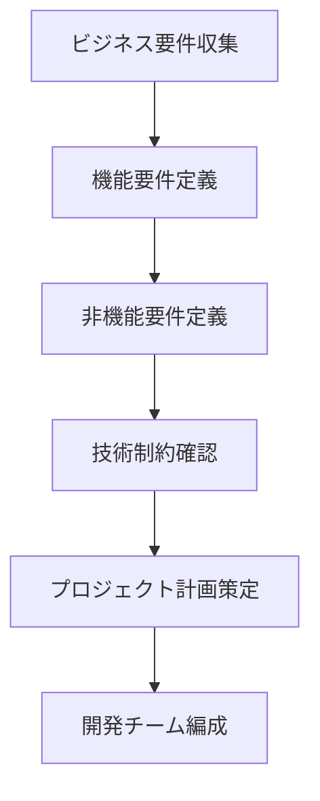
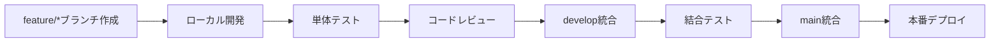
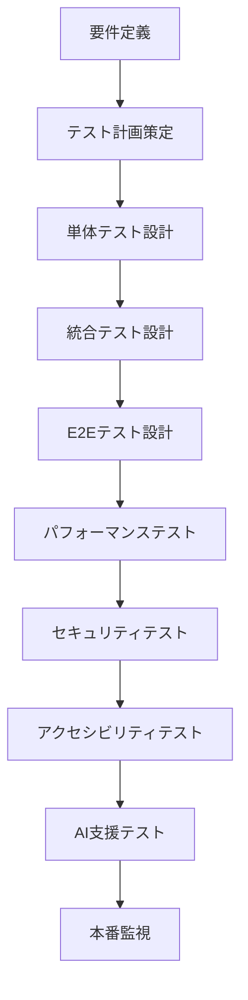

# Power Apps Code Apps 開発標準 (@geekfujiwara)


## 概要

この標準は、Microsoft公式ドキュメント（[Power Apps code apps](https://learn.microsoft.com/en-us/power-apps/developer/code-apps/)）と[PowerAppsCodeAppsリポジトリ](https://github.com/microsoft/PowerAppsCodeApps)のベストプラクティスに基づき、**要件理解から公開まで**の包括的な開発プロセスと、**モダンなデザインテンプレート**を含む完全版開発指針です。

## 目次

### 📋 開発プロセス全体 (8フェーズ)
1. [要件理解・プロジェクト計画](#1-要件理解・プロジェクト計画)
2. [環境構築・テンプレート選択](#2-環境構築・テンプレート選択)  
3. [設計・アーキテクチャ](#3-設計・アーキテクチャ)
4. [開発・実装](#4-開発・実装)
5. [テスト・品質保証](#5-テスト・品質保証)
6. [デプロイ・公開](#6-デプロイ・公開)
7. [運用・保守](#7-運用・保守)
8. [継続的改善](#8-継続的改善)

### 🎨 デザインシステム
- [モダンデザインテンプレート](#モダンデザインテンプレート)
- [レスポンシブデザイン](#レスポンシブデザイン)
- [アクセシビリティ](#アクセシビリティ)

### 🛠️ 技術基盤
- [必須実装要件](#必須実装要件)
- [アーキテクチャパターン](#アーキテクチャパターン)
- [パフォーマンス最適化](#パフォーマンス最適化)

### 🔍 品質保証
- [テスト戦略](#テスト戦略)
- [デバッグ手法](#デバッグ手法)
- [AI活用ガイドライン](#ai活用ガイドライン)

## 前提条件

### 開発環境の準備

**必須ツール:**
- [Visual Studio Code](https://code.visualstudio.com/)
- [Node.js](https://nodejs.org/) (LTS版)
- [Git](https://git-scm.com/)
- [Power Platform CLI](https://learn.microsoft.com/en-us/power-platform/developer/cli/introduction)

**環境設定:**
1. Power Platform管理センターでCode Appsを有効化
2. エンドユーザーに[Power Apps Premiumライセンス](https://www.microsoft.com/power-platform/products/power-apps/pricing)を付与
3. 開発環境の設定とアクセス権限の確認

---

## 📋 開発プロセス全体 (8フェーズ)

### 1. 要件理解・プロジェクト計画

### 1.1 要件定義プロセス


### 1.2 要件収集チェックリスト
- [ ] **ビジネス目標**: アプリケーションの目的と期待される成果
- [ ] **ユーザーペルソナ**: 主要ユーザーの特性と利用シーン
- [ ] **機能要件**: 必要な機能の詳細仕様
- [ ] **非機能要件**: パフォーマンス、セキュリティ、可用性
- [ ] **UI/UX要件**: デザインガイドライン、ブランディング
- [ ] **データ要件**: 連携システム、データソース
- [ ] **セキュリティ要件**: 認証、認可、データ保護
- [ ] **運用要件**: 監視、バックアップ、災害復旧

### 1.3 プロジェクト計画テンプレート
```markdown
# プロジェクト名: [アプリケーション名]

## プロジェクト概要
- **目的**: 
- **スコープ**: 
- **期間**: 
- **予算**: 

## チーム構成
- **プロダクトオーナー**: 
- **開発リーダー**: 
- **開発者**: 
- **デザイナー**: 
- **テスター**: 

## マイルストーン
| フェーズ | 期間 | 成果物 |
|---------|------|--------|
| 要件定義 | Week1-2 | 要件定義書 |
| 設計 | Week3 | 設計仕様書 |
| 開発 | Week4-6 | MVP実装 |
| テスト | Week7 | テスト完了 |
| デプロイ | Week8 | 本番リリース |
```

### 2. 環境構築・テンプレート選択

#### 2.1 開発環境セットアップ手順

**Step 1: 基本ツールのインストール**
```powershell
# Node.js LTS版インストール確認
node --version

# Power Platform CLI インストール
pac install

# プロジェクト初期化
pac code init --displayName "アプリ名" --environment "環境ID"
```

**Step 2: VS Code 拡張機能**
```json
{
  "recommendations": [
    "ms-powerplatform.vscode-powerplatform",
    "ms-vscode.vscode-typescript-next",
    "esbenp.prettier-vscode",
    "ms-vscode.vscode-eslint",
    "bradlc.vscode-tailwindcss"
  ]
}
```

### 2.2 テンプレート選択ガイド

| プロジェクトタイプ | 推奨テンプレート | 特徴 |
|-------------------|------------------|------|
| ダッシュボード | Analytics Template | チャート、KPI表示 |
| データ管理 | CRUD Template | フォーム、一覧、検索 |
| ワークフロー | Business Process | プロセス管理、承認 |
| レポーティング | Report Template | 帳票、エクスポート |
| カスタム | Blank Template | 完全カスタマイズ |

### 3. 設計・アーキテクチャ

#### 3.1 アーキテクチャパターン

**推奨アーキテクチャ: Clean Architecture + MVP**
```
src/
├── components/           # UI コンポーネント
│   ├── common/          # 共通コンポーネント
│   ├── layout/          # レイアウトコンポーネント
│   └── features/        # 機能別コンポーネント
├── services/            # ビジネスロジック
│   ├── api/            # API アクセス
│   ├── data/           # データ処理
│   └── auth/           # 認証処理
├── models/             # データモデル
├── utils/              # ユーティリティ
├── hooks/              # カスタムフック
├── constants/          # 定数
├── types/              # TypeScript型定義
└── assets/             # 静的リソース
```

### 3.2 設計原則

**SOLID原則の適用**
- **Single Responsibility**: 単一責任の原則
- **Open/Closed**: 開放/閉鎖の原則
- **Liskov Substitution**: リスコフ置換の原則
- **Interface Segregation**: インターフェース分離の原則
- **Dependency Inversion**: 依存関係逆転の原則

### 4. 開発・実装

#### 4.1 開発フロー



### 4.2 コーディング規約

**TypeScript設定 (tsconfig.json)**
```json
{
  "compilerOptions": {
    "target": "es2020",
    "lib": ["dom", "dom.iterable", "es6"],
    "allowJs": true,
    "skipLibCheck": true,
    "esModuleInterop": true,
    "allowSyntheticDefaultImports": true,
    "strict": true,
    "forceConsistentCasingInFileNames": true,
    "noFallthroughCasesInSwitch": true,
    "module": "esnext",
    "moduleResolution": "node",
    "resolveJsonModule": true,
    "isolatedModules": true,
    "noEmit": true,
    "jsx": "react-jsx"
  }
}
```

**ESLint設定 (.eslintrc.json)**
```json
{
  "extends": [
    "react-app",
    "@typescript-eslint/recommended",
    "prettier"
  ],
  "rules": {
    "@typescript-eslint/no-unused-vars": "error",
    "react-hooks/exhaustive-deps": "warn",
    "prefer-const": "error"
  }
}
```

### 5. テスト・品質保証

#### 5.1 テスト戦略

**テストピラミッド**
```
        /\
       /  \ E2E テスト (5%)
      /    \ Playwright
     /______\ 
    /        \ 統合テスト (15%)
   /  React   \ React Testing Library
  /  Testing   \
 /   Library    \
/______________\ 単体テスト (80%)
     Jest      
```

**テスト種別と目標カバレッジ**
| テスト種別 | ツール | カバレッジ目標 |
|-----------|--------|---------------|
| 単体テスト | Jest | 80%以上 |
| 統合テスト | RTL | 70%以上 |
| E2Eテスト | Playwright | 主要フロー100% |

### 6. デプロイ・公開

#### 6.1 デプロイメントパイプライン

**GitHub Actions設定 (.github/workflows/deploy.yml)**
```yaml
name: Deploy to Power Apps
on:
  push:
    branches: [main]
jobs:
  deploy:
    runs-on: ubuntu-latest
    steps:
      - uses: actions/checkout@v3
      - uses: actions/setup-node@v3
        with:
          node-version: '18'
      - run: npm ci
      - run: npm run build
      - run: npm run test
      - name: Deploy to Power Apps
        run: pac code push
        env:
          PAC_CLI_URL: ${{ secrets.PAC_CLI_URL }}
```

### 7. 運用・保守

#### 7.1 監視・ログ戦略

**Application Insights 設定**
```typescript
import { ApplicationInsights } from '@microsoft/applicationinsights-web';

const appInsights = new ApplicationInsights({
  config: {
    instrumentationKey: process.env.REACT_APP_APPINSIGHTS_KEY,
    enableAutoRouteTracking: true,
    enableCorsCorrelation: true
  }
});

appInsights.loadAppInsights();
export { appInsights };
```

### 8. 継続的改善

#### 8.1 パフォーマンス分析

**Core Web Vitals 監視**
- **LCP (Largest Contentful Paint)**: 2.5秒以下
- **FID (First Input Delay)**: 100ms以下
- **CLS (Cumulative Layout Shift)**: 0.1以下

## 🎨 モダンデザインテンプレート

### デザインシステム概要

最新のUXトレンドを取り入れた、Power Apps Code Apps専用のモダンデザインテンプレートです。レスポンシブデザイン、アクセシビリティ、美しいビジュアルデザインを統合しています。

### デザイン原則
1. **シンプリシティ**: 直感的で理解しやすいインターフェース
2. **一貫性**: 統一されたデザイン言語
3. **アクセシビリティ**: WCAG 2.1 AA準拠
4. **レスポンシブ**: あらゆるデバイスで最適化
5. **パフォーマンス**: 高速読み込みとスムーズな操作

### レイアウトテンプレート

#### 1. メインレイアウトコンポーネント

```tsx
// src/components/layout/MainLayout.tsx
import React, { useState } from 'react';
import { 
  FluentProvider, 
  webLightTheme,
  makeStyles,
  tokens
} from '@fluentui/react-components';
import { Sidebar } from './Sidebar';
import { Header } from './Header';
import { Navigation24Regular } from '@fluentui/react-icons';

const useStyles = makeStyles({
  root: {
    display: 'grid',
    gridTemplateColumns: 'auto 1fr',
    gridTemplateRows: '60px 1fr',
    gridTemplateAreas: `
      "sidebar header"
      "sidebar main"
    `,
    minHeight: '100vh',
    fontFamily: tokens.fontFamilyBase,
    backgroundColor: tokens.colorNeutralBackground1,
  },
  sidebarCollapsed: {
    gridTemplateColumns: '60px 1fr',
  },
  header: {
    gridArea: 'header',
    backgroundColor: tokens.colorNeutralBackground2,
    borderBottom: `1px solid ${tokens.colorNeutralStroke2}`,
    display: 'flex',
    alignItems: 'center',
    justifyContent: 'space-between',
    padding: '0 24px',
    zIndex: 1000,
  },
  sidebar: {
    gridArea: 'sidebar',
    backgroundColor: tokens.colorNeutralBackground2,
    borderRight: `1px solid ${tokens.colorNeutralStroke2}`,
    transition: 'width 0.3s ease',
    zIndex: 999,
  },
  main: {
    gridArea: 'main',
    padding: '24px',
    overflow: 'auto',
    backgroundColor: tokens.colorNeutralBackground1,
  },
  hamburger: {
    display: 'none',
    '@media (max-width: 768px)': {
      display: 'block',
    },
  },
  mobileOverlay: {
    position: 'fixed',
    top: 0,
    left: 0,
    right: 0,
    bottom: 0,
    backgroundColor: 'rgba(0, 0, 0, 0.5)',
    zIndex: 998,
    display: 'none',
    '@media (max-width: 768px)': {
      display: 'block',
    },
  },
});

interface MainLayoutProps {
  children: React.ReactNode;
}

export const MainLayout: React.FC<MainLayoutProps> = ({ children }) => {
  const styles = useStyles();
  const [isSidebarOpen, setIsSidebarOpen] = useState(true);
  const [isMobile, setIsMobile] = useState(false);

  React.useEffect(() => {
    const checkMobile = () => {
      setIsMobile(window.innerWidth <= 768);
    };
    
    checkMobile();
    window.addEventListener('resize', checkMobile);
    return () => window.removeEventListener('resize', checkMobile);
  }, []);

  const toggleSidebar = () => {
    setIsSidebarOpen(!isSidebarOpen);
  };

  return (
    <FluentProvider theme={webLightTheme}>
      <div className={`${styles.root} ${!isSidebarOpen ? styles.sidebarCollapsed : ''}`}>
        {/* ヘッダー */}
        <header className={styles.header}>
          <Header 
            onToggleSidebar={toggleSidebar}
            isSidebarOpen={isSidebarOpen}
          />
        </header>

        {/* サイドバー */}
        <aside className={styles.sidebar}>
          <Sidebar 
            isOpen={isSidebarOpen}
            onClose={() => isMobile && setIsSidebarOpen(false)}
          />
        </aside>

        {/* メインコンテンツ */}
        <main className={styles.main}>
          {children}
        </main>

        {/* モバイル用オーバーレイ */}
        {isMobile && isSidebarOpen && (
          <div 
            className={styles.mobileOverlay}
            onClick={() => setIsSidebarOpen(false)}
          />
        )}
      </div>
    </FluentProvider>
  );
};
```

#### 2. ヘッダーコンポーネント

```tsx
// src/components/layout/Header.tsx
import React from 'react';
import { 
  Button,
  Text,
  Avatar,
  Popover,
  PopoverTrigger,
  PopoverSurface,
  makeStyles,
  tokens
} from '@fluentui/react-components';
import { 
  Navigation24Regular,
  Person24Regular,
  Settings24Regular,
  SignOut24Regular
} from '@fluentui/react-icons';

const useStyles = makeStyles({
  header: {
    display: 'flex',
    alignItems: 'center',
    justifyContent: 'space-between',
    width: '100%',
    height: '60px',
  },
  leftSection: {
    display: 'flex',
    alignItems: 'center',
    gap: '16px',
  },
  rightSection: {
    display: 'flex',
    alignItems: 'center',
    gap: '12px',
  },
  logo: {
    fontSize: tokens.fontSizeBase500,
    fontWeight: tokens.fontWeightSemibold,
    color: tokens.colorBrandForeground1,
  },
  userMenu: {
    padding: '8px 0',
  },
  menuItem: {
    width: '100%',
    justifyContent: 'flex-start',
    gap: '8px',
  },
});

interface HeaderProps {
  onToggleSidebar: () => void;
  isSidebarOpen: boolean;
}

export const Header: React.FC<HeaderProps> = ({ onToggleSidebar, isSidebarOpen }) => {
  const styles = useStyles();

  return (
    <div className={styles.header}>
      <div className={styles.leftSection}>
        <Button 
          appearance="subtle" 
          icon={<Navigation24Regular />}
          onClick={onToggleSidebar}
          aria-label={isSidebarOpen ? "サイドバーを閉じる" : "サイドバーを開く"}
        />
        <Text className={styles.logo}>Power Apps Code Apps</Text>
      </div>

      <div className={styles.rightSection}>
        <Popover>
          <PopoverTrigger disableButtonEnhancement>
            <Button 
              appearance="subtle"
              icon={<Avatar name="User" size={32} />}
              aria-label="ユーザーメニュー"
            />
          </PopoverTrigger>
          <PopoverSurface>
            <div className={styles.userMenu}>
              <Button 
                className={styles.menuItem}
                appearance="subtle"
                icon={<Person24Regular />}
              >
                プロフィール
              </Button>
              <Button 
                className={styles.menuItem}
                appearance="subtle"
                icon={<Settings24Regular />}
              >
                設定
              </Button>
              <Button 
                className={styles.menuItem}
                appearance="subtle"
                icon={<SignOut24Regular />}
              >
                サインアウト
              </Button>
            </div>
          </PopoverSurface>
        </Popover>
      </div>
    </div>
  );
};
```

#### 3. サイドバーナビゲーションコンポーネント

```tsx
// src/components/layout/Sidebar.tsx
import React from 'react';
import {
  Button,
  Text,
  makeStyles,
  tokens
} from '@fluentui/react-components';
import {
  Home24Regular,
  Home24Filled,
  DataTrending24Regular,
  DataTrending24Filled,
  People24Regular,
  People24Filled,
  Settings24Regular,
  Settings24Filled,
  bundleIcon
} from '@fluentui/react-icons';

const HomeIcon = bundleIcon(Home24Filled, Home24Regular);
const AnalyticsIcon = bundleIcon(DataTrending24Filled, DataTrending24Regular);
const UsersIcon = bundleIcon(People24Filled, People24Regular);
const SettingsIcon = bundleIcon(Settings24Filled, Settings24Regular);

const useStyles = makeStyles({
  sidebar: {
    width: '280px',
    height: '100vh',
    padding: '16px 0',
    display: 'flex',
    flexDirection: 'column',
    transition: 'width 0.3s ease',
  },
  sidebarCollapsed: {
    width: '60px',
  },
  nav: {
    display: 'flex',
    flexDirection: 'column',
    gap: '4px',
    padding: '0 8px',
  },
  navItem: {
    width: '100%',
    justifyContent: 'flex-start',
    gap: '12px',
    padding: '12px 16px',
    borderRadius: tokens.borderRadiusMedium,
    '&:hover': {
      backgroundColor: tokens.colorNeutralBackground1Hover,
    },
  },
  navItemActive: {
    backgroundColor: tokens.colorBrandBackground2,
    color: tokens.colorBrandForeground2,
    '&:hover': {
      backgroundColor: tokens.colorBrandBackground2Hover,
    },
  },
  navItemText: {
    fontSize: tokens.fontSizeBase300,
    fontWeight: tokens.fontWeightMedium,
  },
  footer: {
    marginTop: 'auto',
    padding: '16px',
    borderTop: `1px solid ${tokens.colorNeutralStroke2}`,
  },
});

interface SidebarProps {
  isOpen: boolean;
  onClose?: () => void;
}

interface NavItem {
  id: string;
  label: string;
  icon: React.ComponentType;
  href?: string;
  active?: boolean;
}

const navigationItems: NavItem[] = [
  { id: 'home', label: 'ホーム', icon: HomeIcon, href: '/', active: true },
  { id: 'analytics', label: 'アナリティクス', icon: AnalyticsIcon, href: '/analytics' },
  { id: 'users', label: 'ユーザー', icon: UsersIcon, href: '/users' },
  { id: 'settings', label: '設定', icon: SettingsIcon, href: '/settings' },
];

export const Sidebar: React.FC<SidebarProps> = ({ isOpen, onClose }) => {
  const styles = useStyles();

  return (
    <div className={`${styles.sidebar} ${!isOpen ? styles.sidebarCollapsed : ''}`}>
      <nav className={styles.nav}>
        {navigationItems.map((item) => (
          <Button
            key={item.id}
            className={`${styles.navItem} ${item.active ? styles.navItemActive : ''}`}
            appearance="subtle"
            icon={<item.icon />}
            onClick={onClose}
          >
            {isOpen && (
              <Text className={styles.navItemText}>
                {item.label}
              </Text>
            )}
          </Button>
        ))}
      </nav>
      
      {isOpen && (
        <div className={styles.footer}>
          <Text size={200}>
            © 2025 Power Apps Code Apps
          </Text>
        </div>
      )}
    </div>
  );
};
```

### デザイントークン定義

#### カラーパレット

```scss
// src/styles/design-tokens.scss
:root {
  /* Primary Colors */
  --color-primary-50: #e6f3ff;
  --color-primary-100: #b3daff;
  --color-primary-500: #0078d4;
  --color-primary-600: #106ebe;
  --color-primary-900: #003a5c;

  /* Neutral Colors */
  --color-neutral-50: #fafafa;
  --color-neutral-100: #f5f5f5;
  --color-neutral-200: #eeeeee;
  --color-neutral-500: #737373;
  --color-neutral-900: #171717;

  /* Semantic Colors */
  --color-success: #107c10;
  --color-warning: #ff8c00;
  --color-error: #d13438;
  --color-info: #0078d4;

  /* Spacing Scale */
  --spacing-xs: 4px;
  --spacing-sm: 8px;
  --spacing-md: 16px;
  --spacing-lg: 24px;
  --spacing-xl: 32px;
  --spacing-2xl: 48px;

  /* Typography Scale */
  --font-size-xs: 12px;
  --font-size-sm: 14px;
  --font-size-md: 16px;
  --font-size-lg: 18px;
  --font-size-xl: 20px;
  --font-size-2xl: 24px;
  --font-size-3xl: 32px;

  /* Border Radius */
  --radius-sm: 4px;
  --radius-md: 8px;
  --radius-lg: 12px;
  --radius-full: 9999px;

  /* Shadows */
  --shadow-sm: 0 1px 2px 0 rgba(0, 0, 0, 0.05);
  --shadow-md: 0 4px 6px -1px rgba(0, 0, 0, 0.1);
  --shadow-lg: 0 10px 15px -3px rgba(0, 0, 0, 0.1);
  --shadow-xl: 0 20px 25px -5px rgba(0, 0, 0, 0.1);
}
```

### レスポンシブデザインガイドライン

#### ブレークポイント定義

```typescript
// src/utils/breakpoints.ts
export const breakpoints = {
  xs: '0px',      // Extra small devices
  sm: '576px',    // Small devices (landscape phones)
  md: '768px',    // Medium devices (tablets)
  lg: '992px',    // Large devices (desktops)
  xl: '1200px',   // Extra large devices (large desktops)
  xxl: '1400px'   // Extra extra large devices
} as const;

export const mediaQueries = {
  xs: `(min-width: ${breakpoints.xs})`,
  sm: `(min-width: ${breakpoints.sm})`,
  md: `(min-width: ${breakpoints.md})`,
  lg: `(min-width: ${breakpoints.lg})`,
  xl: `(min-width: ${breakpoints.xl})`,
  xxl: `(min-width: ${breakpoints.xxl})`,
} as const;
```

#### レスポンシブユーティリティ

```tsx
// src/hooks/useResponsive.ts
import { useState, useEffect } from 'react';
import { breakpoints } from '../utils/breakpoints';

export const useResponsive = () => {
  const [screenSize, setScreenSize] = useState<keyof typeof breakpoints>('lg');

  useEffect(() => {
    const getScreenSize = (): keyof typeof breakpoints => {
      const width = window.innerWidth;
      if (width < 576) return 'xs';
      if (width < 768) return 'sm';
      if (width < 992) return 'md';
      if (width < 1200) return 'lg';
      if (width < 1400) return 'xl';
      return 'xxl';
    };

    const handleResize = () => {
      setScreenSize(getScreenSize());
    };

    handleResize();
    window.addEventListener('resize', handleResize);
    return () => window.removeEventListener('resize', handleResize);
  }, []);

  return {
    screenSize,
    isMobile: screenSize === 'xs' || screenSize === 'sm',
    isTablet: screenSize === 'md',
    isDesktop: screenSize === 'lg' || screenSize === 'xl' || screenSize === 'xxl',
  };
};
```

### アクセシビリティガイドライン

#### 1. キーボードナビゲーション

```tsx
// src/components/common/AccessibleButton.tsx
import React from 'react';
import { Button, ButtonProps } from '@fluentui/react-components';

interface AccessibleButtonProps extends ButtonProps {
  ariaLabel?: string;
  ariaDescription?: string;
}

export const AccessibleButton: React.FC<AccessibleButtonProps> = ({
  ariaLabel,
  ariaDescription,
  children,
  ...props
}) => {
  return (
    <Button
      aria-label={ariaLabel}
      aria-describedby={ariaDescription}
      {...props}
    >
      {children}
    </Button>
  );
};
```

#### 2. スクリーンリーダー対応

```tsx
// src/components/common/SkipLink.tsx
import React from 'react';
import { makeStyles } from '@fluentui/react-components';

const useStyles = makeStyles({
  skipLink: {
    position: 'absolute',
    top: '-40px',
    left: '6px',
    backgroundColor: '#000',
    color: '#fff',
    padding: '8px',
    zIndex: 9999,
    textDecoration: 'none',
    '&:focus': {
      top: '6px',
    },
  },
});

export const SkipLink: React.FC = () => {
  const styles = useStyles();

  return (
    <a href="#main-content" className={styles.skipLink}>
      メインコンテンツへスキップ
    </a>
  );
};
```

---

## 必須実装要件

### 1. 正式なPowerProvider の実装
**Microsoft公式パターンに基づくPowerProvider:**

```typescript
// src/PowerProvider.tsx
import { initialize } from "@microsoft/power-apps/app";
import { useEffect, type ReactNode } from "react";

interface PowerProviderProps {
  children: ReactNode;
}

export default function PowerProvider({ children }: PowerProviderProps) {
  useEffect(() => {
    const initApp = async () => {
      try {
        await initialize();
        console.log('Power Platform SDK initialized successfully');
      } catch (error) {
        console.error('Failed to initialize Power Platform SDK:', error);
      }
    };
    
    initApp();
  }, []);

  return <>{children}</>;
}
```

**FluentUIとの組み合わせ（推奨パターン）:**

```typescript
// src/App.tsx
import { FluentProvider, webLightTheme, webDarkTheme } from '@fluentui/react-components';

const App = () => {
  const prefersDarkMode = window.matchMedia('(prefers-color-scheme: dark)').matches;
  const theme = prefersDarkMode ? webDarkTheme : webLightTheme;

  return (
    <FluentProvider theme={theme}>
      {/* アプリのコンテンツ */}
    </FluentProvider>
  );
};
```

### 2. エントリポイントの最適化
```typescript
// src/index.tsx
import React from 'react';
import ReactDOM from 'react-dom/client';
import App from './App';
import PowerProvider from './PowerProvider';

const root = ReactDOM.createRoot(
  document.getElementById('root') as HTMLElement
);

// Power Apps環境では React.StrictMode を条件付きで使用
const isDevelopment = process.env.NODE_ENV === 'development';

root.render(
  isDevelopment ? (
    <React.StrictMode>
      <PowerProvider>
        <App />
      </PowerProvider>
    </React.StrictMode>
  ) : (
    <PowerProvider>
      <App />
    </PowerProvider>
  )
);
```

### 3. Webpack設定の最適化

#### 重要な設定項目
```javascript
module.exports = (env, argv) => {
  const isProduction = argv.mode === 'production';
  
  return {
    output: {
      publicPath: './',  // Power Apps環境では './' が必須
      clean: true,
      filename: isProduction ? 'static/js/[name].[contenthash].js' : 'bundle.js',
      chunkFilename: isProduction ? 'static/js/[name].[contenthash].chunk.js' : '[name].chunk.js',
    },
    optimization: {
      splitChunks: isProduction ? {
        cacheGroups: {
          react: {
            test: /[\\/]node_modules[\\/](react|react-dom)[\\/]/,
            name: 'react',
            priority: 10,
            chunks: 'all',
          },
          fluentui: {
            test: /[\\/]node_modules[\\/]@fluentui[\\/]/,
            name: 'fluentui',
            priority: 20,
            chunks: 'all',
          }
        }
      } : false,
    },
    performance: {
      maxEntrypointSize: 512000,  // 512KB制限
      maxAssetSize: 512000,
    }
  };
};
```

### 4. 必須依存関係

**Power Apps SDK (必須):**

```json
{
  "dependencies": {
    "@microsoft/power-apps": "latest"
  }
}
```

**UI フレームワーク (推奨):**

```json
{
  "dependencies": {
    "@fluentui/react-components": "^9.64.0",
    "@fluentui/react-icons": "^2.0.281",
    "react": "^18.2.0",
    "react-dom": "^18.2.0"
  }
}
```

**⚠️重要**: React 19は現時点でPower Platform SDKと互換性の問題があるため、React 18.2.0を使用してください。

### 5. プロジェクト構造とファイル

**基本構造 (Microsoft公式推奨):**

```
your-code-app/
├── src/
│   ├── PowerProvider.tsx    # Power Apps SDK初期化 (必須)
│   ├── App.tsx              # メインアプリケーション
│   ├── main.tsx             # エントリポイント
│   └── ...
├── power.config.json        # Power Apps設定 (自動生成)
├── package.json
└── README.md
```

**power.config.json (pac code initで自動生成):**

```json
{
  "appId": "generated-by-pac-code-init",
  "appDisplayName": "アプリ名",
  "description": "アプリの説明",
  "environmentId": "environment-id",
  "buildPath": "./dist",
  "buildEntryPoint": "index.html"
}
```

## パフォーマンス最適化

### バンドルサイズ管理
- **目標**: 合計バンドルサイズ < 300KB
- **分析**: `npm run analyze` でバンドル分析を実行
- **チャンク分割**: React、FluentUI、アプリコードを分離

### ビルドスクリプト
```json
{
  "scripts": {
    "build": "webpack --mode production --stats-children",
    "build:dev": "webpack --mode development",
    "analyze": "webpack-bundle-analyzer build/static/js/*.js"
  }
}
```

## 標準開発ワークフロー

### 1. プロジェクト初期化（Microsoft公式手順）

**PowerAppsCodeAppsリポジトリのクローン:**

```bash
git clone https://github.com/microsoft/PowerAppsCodeApps.git
cd PowerAppsCodeApps/samples/HelloWorld
```

**または新規プロジェクト:**

```bash
# 環境認証
pac auth create --environment {environment-id}

# 依存関係インストール
npm install

# Power Apps Code初期化
pac code init --displayName 'Your App Name'
```

### 2. 開発サイクル（推奨パターン）

```bash
# ローカル開発
npm run dev | pac code run

# 本番ビルド
npm run build

# Power Appsにデプロイ
pac code push
```

### 3. 品質管理とパフォーマンス

```bash
# TypeScript型チェック
tsc --noEmit

# リンティング
eslint .

# バンドルサイズ分析
npm run analyze
```

# 🧪 テスト戦略・デバッグ手法 (AI活用)

## 包括的テスト戦略

### テスト種別と実装方針



### 1. AI支援テスト生成

#### テストケース自動生成
```typescript
// src/utils/ai-test-generator.ts
import { OpenAI } from 'openai';

interface TestGeneratorConfig {
  componentPath: string;
  functionalRequirements: string[];
  edgeCases: string[];
}

export class AITestGenerator {
  private openai: OpenAI;

  constructor(apiKey: string) {
    this.openai = new OpenAI({ apiKey });
  }

  async generateTestCases(config: TestGeneratorConfig): Promise<string> {
    const prompt = `
    Generate comprehensive Jest test cases for a React component:
    
    Component: ${config.componentPath}
    Requirements: ${config.functionalRequirements.join(', ')}
    Edge Cases: ${config.edgeCases.join(', ')}
    
    Include render, interaction, accessibility, and performance tests.
    Use React Testing Library patterns.
    `;

    const response = await this.openai.chat.completions.create({
      model: "gpt-4",
      messages: [{ role: "user", content: prompt }],
      temperature: 0.3,
    });

    return response.choices[0].message.content || '';
  }
}
```

### 2. 単体テスト設定 (Jest + RTL)

```javascript
// jest.config.js
module.exports = {
  testEnvironment: 'jsdom',
  setupFilesAfterEnv: ['<rootDir>/src/setupTests.ts'],
  collectCoverageFrom: [
    'src/**/*.{ts,tsx}',
    '!src/**/*.d.ts',
    '!src/index.tsx',
  ],
  coverageThreshold: {
    global: {
      branches: 80,
      functions: 80,
      lines: 80,
      statements: 80,
    },
  },
};
```

### 3. E2Eテスト (Playwright)

```typescript
// e2e/app.spec.ts
import { test, expect } from '@playwright/test';

test('main user journey', async ({ page }) => {
  await page.goto('/');
  
  // アプリ読み込み確認
  await expect(page.locator('h1')).toContainText('Power Apps Code Apps');
  
  // サイドバー操作
  await page.click('[aria-label*="サイドバー"]');
  await expect(page.locator('nav')).toBeVisible();
  
  // レスポンシブテスト
  await page.setViewportSize({ width: 375, height: 667 });
  await expect(page.locator('[class*="mobileOverlay"]')).toBeVisible();
});
```

### 4. AI支援デバッグツール

```typescript
// src/utils/ai-debugger.ts
export class AIDebugger {
  async analyzeError(error: Error, context: any): Promise<string> {
    const prompt = `
    Analyze this error for Power Apps Code Apps:
    Error: ${error.message}
    Context: ${JSON.stringify(context)}
    
    Provide root cause and solution steps.
    `;

    return await this.callAIAPI(prompt);
  }

  static logPowerPlatformInfo() {
    console.group('🔍 Power Platform Debug Info');
    console.log('SDK Initialized:', window.powerApps?.initialized || false);
    console.log('Environment:', process.env.NODE_ENV);
    console.log('Bundle Size:', performance.getEntriesByType('resource').length);
    console.groupEnd();
  }
}
```

### 5. デバッグチェックリスト

#### 開発時デバッグ手順
- [ ] PowerProvider の初期化確認
- [ ] バンドルサイズ分析 (< 300KB目標)
- [ ] React Strict Mode 無効化
- [ ] webpack publicPath 設定確認
- [ ] 本番ビルドエラーチェック

#### 本番環境デバッグ
- [ ] ブラウザ開発者ツールでネットワーク確認
- [ ] Power Apps環境でのローカル実行テスト  
- [ ] Application Insights ログ確認
- [ ] パフォーマンス指標監視

---

## トラブルシューティング

### よくある問題と解決策

#### 1. "App timed out" エラー
**原因**: バンドルサイズが大きすぎる、またはPowerProviderが不足
**解決策**: 
- PowerProviderを実装
- webpack設定でチャンク分割を有効化
- 不要な依存関係を削除

#### 2. "Fetching your app" で停止
**原因**: publicPath設定が間違っている
**解決策**: webpack.config.js で `publicPath: './'` を設定

#### 3. CSS/アセットが読み込まれない
**原因**: 相対パスの設定ミス
**解決策**: すべてのパスを相対パス（`./`）に統一

### 4. React Strict Modeの問題
**原因**: 本番環境でのメモリリーク
**解決策**: 本番環境ではStrict Modeを無効化

## ベストプラクティス

### コード品質
- TypeScriptの厳密モードを使用
- ESLintとPrettierで一貫した品質を維持
- コンポーネントの適切な分割

### UI/UX
- FluentUIを使用して一貫したデザイン
- レスポンシブデザインの実装
- アクセシビリティの考慮

### パフォーマンス
- コード分割とレイジーローディング
- 不要な再レンダリングの防止
- メモ化の適切な使用

# 🚀 品質向上フレームワーク

## 継続的品質改善システム

### 1. AI支援コード品質分析

```typescript
// src/utils/ai-quality-analyzer.ts
export class AIQualityAnalyzer {
  async analyzeCodeQuality(filePath: string, content: string): Promise<QualityReport> {
    const prompt = `
    Analyze this TypeScript/React code for Power Apps Code Apps:
    
    File: ${filePath}
    
    Focus on:
    1. Performance issues
    2. Security vulnerabilities  
    3. Accessibility concerns
    4. Power Apps compatibility
    5. Best practices adherence
    
    Return JSON with score and specific suggestions.
    `;
    
    const analysis = await this.callAIAPI(prompt);
    return JSON.parse(analysis);
  }

  async suggestRefactoring(code: string): Promise<string> {
    return await this.callAIAPI(`
      Suggest Power Apps Code Apps optimizations for:
      ${code}
      
      Focus on performance, maintainability, and Power Platform integration.
    `);
  }
}
```

### 2. 自動化された品質チェック

#### GitHub Actions品質ゲート
```yaml
# .github/workflows/quality-gate.yml
name: Quality Gate

on:
  pull_request:
    branches: [main]

jobs:
  quality-check:
    runs-on: ubuntu-latest
    steps:
      - uses: actions/checkout@v3
      - uses: actions/setup-node@v3
        with:
          node-version: '18'
          cache: 'npm'
      
      - name: Install & Test
        run: |
          npm ci
          npm run test -- --coverage --watchAll=false
          npm run lint
          npm run build
          
      - name: Bundle Analysis
        run: npm run analyze
        
      - name: Security Scan  
        run: npm audit --audit-level high
```

### 3. パフォーマンス監視

```typescript
// src/utils/performance-monitor.ts
export class PerformanceMonitor {
  measureCustomMetric(name: string, fn: () => void) {
    const start = performance.now();
    fn();
    const duration = performance.now() - start;
    
    if (duration > 100) {
      console.warn(`🐌 Slow operation: ${name} took ${duration}ms`);
    }
    
    // Application Insights送信
    this.trackMetric(name, duration);
  }
  
  trackCoreWebVitals() {
    // LCP, FID, CLS監視
    new PerformanceObserver((list) => {
      list.getEntries().forEach((entry) => {
        this.checkThresholds(entry);
      });
    }).observe({ entryTypes: ['largest-contentful-paint'] });
  }
  
  private checkThresholds(entry: PerformanceEntry) {
    const thresholds = {
      'largest-contentful-paint': 2500,
      'first-input-delay': 100
    };
    
    if (entry.startTime > thresholds[entry.name]) {
      this.alertPerformanceIssue(entry);
    }
  }
}
```

### 4. セキュリティ強化

```typescript
// src/utils/security-checker.ts
export class SecurityChecker {
  validateInput(input: string, type: 'email' | 'url' | 'text'): boolean {
    const patterns = {
      email: /^[^\s@]+@[^\s@]+\.[^\s@]+$/,
      url: /^https?:\/\/[^\s$.?#].[^\s]*$/,
      text: /^[a-zA-Z0-9\s\-._]+$/
    };
    return patterns[type].test(input);
  }
  
  sanitizeHtml(html: string): string {
    const div = document.createElement('div');
    div.textContent = html;
    return div.innerHTML;
  }
  
  checkPowerAppsSecurityConfig() {
    // CSP設定確認
    if (!document.querySelector('meta[http-equiv="Content-Security-Policy"]')) {
      console.warn('🔒 CSP not configured');
    }
    
    // HTTPS確認
    if (location.protocol !== 'https:' && location.hostname !== 'localhost') {
      console.error('🔒 HTTPS required');
    }
  }
}
```

### 5. 品質メトリクス

#### コードレビューチェックリスト
- [ ] TypeScript型安全性
- [ ] 単体テストカバレッジ (80%以上)
- [ ] パフォーマンス影響確認
- [ ] セキュリティレビュー
- [ ] アクセシビリティ検証
- [ ] Power Apps固有要件確認
- [ ] バンドルサイズ影響評価

#### 品質ゲート基準
| 項目 | 目標値 | 必須/推奨 |
|------|--------|-----------|
| テストカバレッジ | 80%以上 | 必須 |
| バンドルサイズ | 300KB以下 | 必須 |
| LCP | 2.5秒以下 | 推奨 |
| FID | 100ms以下 | 推奨 |
| Lighthouse Score | 90以上 | 推奨 |

---

### セキュリティ
- 入力値の適切な検証
- XSSの防止
- 適切なエラーハンドリング

## アーキテクチャ理解

### Power Apps Code Apps の構成要素

1. **Power Apps SDK** - `@microsoft/power-apps/app`パッケージ
2. **生成されたモデル/サービス** - コネクタ用の自動生成コード
3. **power.config.json** - 設定ファイル（自動生成）
4. **Power Apps ホスト** - ランタイム環境

### ランタイム動作

- **アプリコード** ↔ **Power Apps SDK** ↔ **Power Apps ホスト**
- SDKがPower Platformコネクタへのアクセスを提供
- ホストが認証・承認・アプリ読み込みを管理

## 制限事項（2025年現在）

### 現在サポートされていない機能

- **Content Security Policy (CSP)** サポート
- **Storage SAS IP制限** サポート  
- **Power Platform Git統合**
- **Dataverseソリューション** 統合
- **Power Platform パイプライン** 使用
- **Power Apps モバイルアプリ** での実行
- **Azure Application Insights** のネイティブ統合

### 管理機能サポート状況

✅ **サポート済み:**
- エンドユーザー同意ダイアログ
- 共有制限（Canvas アプリと同じ）
- アプリ検疫
- データ損失防止ポリシー
- 条件付きアクセス
- 管理者同意抑制
- テナント分離
- Azure B2B（外部ユーザーアクセス）
- 正常性メトリクス

## システム設定

### ヘッダー非表示機能

本番環境でPower Appsヘッダーを非表示にする：

```
https://apps.powerapps.com/play/e/{environment-id}/a/{app-id}?hideNavBar=true
```

### セキュリティ考慮事項

**重要**: アプリコード内に機密データを保存しないでください。
- ユーザーデータは適切なデータソースに保存
- 認証・承認チェック後にデータを取得
- アプリコードは公開されるエンドポイントでホストされます

## 参考リンク

**公式ドキュメント:**
- [Power Apps Code Apps 概要](https://learn.microsoft.com/en-us/power-apps/developer/code-apps/overview)
- [アーキテクチャ詳細](https://learn.microsoft.com/en-us/power-apps/developer/code-apps/architecture)
- [システム制限と設定](https://learn.microsoft.com/en-us/power-apps/developer/code-apps/system-limits-configuration)

**開発リソース:**
- [Microsoft PowerAppsCodeApps リポジトリ](https://github.com/microsoft/PowerAppsCodeApps)
- [FluentUI React Components](https://react.fluentui.dev/)
- [Power Platform CLI](https://learn.microsoft.com/en-us/power-platform/developer/cli/introduction)

---

# 🧩 コンポーネントライブラリ・アーキテクチャパターン

## 再利用可能コンポーネント設計

### 1. 基本コンポーネント構造

#### ベースコンポーネントテンプレート
```typescript
// src/components/base/BaseComponent.tsx
import React from 'react';
import { makeStyles, mergeClasses } from '@fluentui/react-components';

interface BaseComponentProps {
  className?: string;
  children?: React.ReactNode;
  'data-testid'?: string;
}

const useStyles = makeStyles({
  root: {
    // ベーススタイル
  }
});

export const BaseComponent: React.FC<BaseComponentProps> = ({
  className,
  children,
  'data-testid': testId,
  ...props
}) => {
  const styles = useStyles();
  
  return (
    <div 
      className={mergeClasses(styles.root, className)}
      data-testid={testId}
      {...props}
    >
      {children}
    </div>
  );
};
```

### 2. カードコンポーネント

```tsx
// src/components/common/Card.tsx
import React from 'react';
import { 
  Card as FluentCard,
  CardHeader,
  CardPreview,
  Text,
  Button,
  makeStyles,
  tokens
} from '@fluentui/react-components';
import { MoreHorizontal24Regular } from '@fluentui/react-icons';

const useStyles = makeStyles({
  card: {
    width: '100%',
    maxWidth: '400px',
    boxShadow: tokens.shadow8,
    borderRadius: tokens.borderRadiusLarge,
    '&:hover': {
      boxShadow: tokens.shadow16,
      transform: 'translateY(-2px)',
      transition: 'all 0.2s ease-in-out',
    },
  },
  header: {
    padding: '16px',
  },
  content: {
    padding: '0 16px 16px 16px',
  },
  footer: {
    padding: '16px',
    borderTop: `1px solid ${tokens.colorNeutralStroke2}`,
    display: 'flex',
    justifyContent: 'space-between',
    alignItems: 'center',
  },
});

interface CardProps {
  title: string;
  description?: string;
  image?: string;
  actions?: React.ReactNode;
  onClick?: () => void;
  className?: string;
}

export const Card: React.FC<CardProps> = ({
  title,
  description,
  image,
  actions,
  onClick,
  className
}) => {
  const styles = useStyles();

  return (
    <FluentCard 
      className={mergeClasses(styles.card, className)}
      onClick={onClick}
      role={onClick ? "button" : undefined}
      tabIndex={onClick ? 0 : undefined}
    >
      {image && (
        <CardPreview>
          
        </CardPreview>
      )}
      
      <CardHeader 
        className={styles.header}
        header={<Text weight="semibold" size={300}>{title}</Text>}
        action={
          <Button
            appearance="transparent" 
            icon={<MoreHorizontal24Regular />}
            aria-label="その他のオプション"
          />
        }
      />
      
      {description && (
        <div className={styles.content}>
          <Text size={200}>{description}</Text>
        </div>
      )}
      
      {actions && (
        <div className={styles.footer}>
          {actions}
        </div>
      )}
    </FluentCard>
  );
};
```

### 3. データテーブルコンポーネント

```tsx
// src/components/common/DataTable.tsx
import React, { useState, useMemo } from 'react';
import {
  Table,
  TableHeader,
  TableHeaderCell,
  TableBody,
  TableRow,
  TableCell,
  Button,
  Input,
  makeStyles,
  tokens
} from '@fluentui/react-components';
import { ArrowSort24Regular, Search24Regular } from '@fluentui/react-icons';

const useStyles = makeStyles({
  container: {
    width: '100%',
    backgroundColor: tokens.colorNeutralBackground1,
    borderRadius: tokens.borderRadiusMedium,
    padding: '16px',
  },
  toolbar: {
    display: 'flex',
    justifyContent: 'space-between',
    alignItems: 'center',
    marginBottom: '16px',
  },
  searchBox: {
    minWidth: '300px',
  },
  table: {
    width: '100%',
  },
  sortableHeader: {
    cursor: 'pointer',
    display: 'flex',
    alignItems: 'center',
    gap: '8px',
    '&:hover': {
      backgroundColor: tokens.colorNeutralBackground1Hover,
    },
  },
});

interface Column<T> {
  key: keyof T;
  title: string;
  sortable?: boolean;
  render?: (value: T[keyof T], item: T) => React.ReactNode;
}

interface DataTableProps<T> {
  data: T[];
  columns: Column<T>[];
  searchable?: boolean;
  onRowClick?: (item: T) => void;
  className?: string;
}

export function DataTable<T extends Record<string, any>>({
  data,
  columns,
  searchable = true,
  onRowClick,
  className
}: DataTableProps<T>) {
  const styles = useStyles();
  const [searchTerm, setSearchTerm] = useState('');
  const [sortColumn, setSortColumn] = useState<keyof T | null>(null);
  const [sortDirection, setSortDirection] = useState<'asc' | 'desc'>('asc');

  const filteredData = useMemo(() => {
    let filtered = data;

    // 検索フィルタリング
    if (searchTerm) {
      filtered = filtered.filter(item =>
        Object.values(item).some(value =>
          String(value).toLowerCase().includes(searchTerm.toLowerCase())
        )
      );
    }

    // ソート
    if (sortColumn) {
      filtered.sort((a, b) => {
        const aValue = a[sortColumn];
        const bValue = b[sortColumn];
        
        if (aValue < bValue) return sortDirection === 'asc' ? -1 : 1;
        if (aValue > bValue) return sortDirection === 'asc' ? 1 : -1;
        return 0;
      });
    }

    return filtered;
  }, [data, searchTerm, sortColumn, sortDirection]);

  const handleSort = (column: keyof T) => {
    if (sortColumn === column) {
      setSortDirection(sortDirection === 'asc' ? 'desc' : 'asc');
    } else {
      setSortColumn(column);
      setSortDirection('asc');
    }
  };

  return (
    <div className={mergeClasses(styles.container, className)}>
      {searchable && (
        <div className={styles.toolbar}>
          <Input
            className={styles.searchBox}
            placeholder="検索..."
            value={searchTerm}
            onChange={(_, data) => setSearchTerm(data.value)}
            contentBefore={<Search24Regular />}
          />
        </div>
      )}

      <Table className={styles.table}>
        <TableHeader>
          <TableRow>
            {columns.map((column) => (
              <TableHeaderCell key={String(column.key)}>
                {column.sortable ? (
                  <div 
                    className={styles.sortableHeader}
                    onClick={() => handleSort(column.key)}
                  >
                    {column.title}
                    <ArrowSort24Regular />
                  </div>
                ) : (
                  column.title
                )}
              </TableHeaderCell>
            ))}
          </TableRow>
        </TableHeader>
        <TableBody>
          {filteredData.map((item, index) => (
            <TableRow 
              key={index}
              onClick={() => onRowClick?.(item)}
              style={{ cursor: onRowClick ? 'pointer' : 'default' }}
            >
              {columns.map((column) => (
                <TableCell key={String(column.key)}>
                  {column.render 
                    ? column.render(item[column.key], item)
                    : String(item[column.key])
                  }
                </TableCell>
              ))}
            </TableRow>
          ))}
        </TableBody>
      </Table>
    </div>
  );
}
```

### 4. フォームコンポーネント

```tsx
// src/components/common/Form.tsx
import React from 'react';
import { useForm, Controller, FieldValues, Path } from 'react-hook-form';
import {
  Input,
  Textarea,
  Dropdown,
  Button,
  Text,
  makeStyles,
  tokens
} from '@fluentui/react-components';

const useStyles = makeStyles({
  form: {
    display: 'flex',
    flexDirection: 'column',
    gap: '16px',
    padding: '24px',
    backgroundColor: tokens.colorNeutralBackground1,
    borderRadius: tokens.borderRadiusMedium,
  },
  field: {
    display: 'flex',
    flexDirection: 'column',
    gap: '8px',
  },
  label: {
    fontWeight: tokens.fontWeightMedium,
  },
  error: {
    color: tokens.colorPaletteRedForeground1,
    fontSize: tokens.fontSizeBase200,
  },
  actions: {
    display: 'flex',
    gap: '12px',
    justifyContent: 'flex-end',
    marginTop: '16px',
  },
});

interface FormField {
  name: string;
  label: string;
  type: 'text' | 'email' | 'textarea' | 'dropdown';
  required?: boolean;
  options?: Array<{ key: string; text: string }>;
  validation?: any;
}

interface FormProps<T extends FieldValues> {
  fields: FormField[];
  onSubmit: (data: T) => void;
  defaultValues?: Partial<T>;
  submitText?: string;
  cancelText?: string;
  onCancel?: () => void;
}

export function Form<T extends FieldValues>({
  fields,
  onSubmit,
  defaultValues,
  submitText = '保存',
  cancelText = 'キャンセル',
  onCancel
}: FormProps<T>) {
  const styles = useStyles();
  const {
    control,
    handleSubmit,
    formState: { errors, isSubmitting }
  } = useForm<T>({
    defaultValues: defaultValues as any
  });

  const renderField = (field: FormField) => {
    const fieldName = field.name as Path<T>;
    
    return (
      <div key={field.name} className={styles.field}>
        <Text className={styles.label}>
          {field.label}
          {field.required && ' *'}
        </Text>
        
        <Controller
          name={fieldName}
          control={control}
          rules={{
            required: field.required ? `${field.label}は必須です` : false,
            ...field.validation
          }}
          render={({ field: { onChange, value, onBlur } }) => {
            switch (field.type) {
              case 'textarea':
                return (
                  <Textarea
                    value={value || ''}
                    onChange={(_, data) => onChange(data.value)}
                    onBlur={onBlur}
                    placeholder={`${field.label}を入力`}
                  />
                );
              
              case 'dropdown':
                return (
                  <Dropdown
                    value={value || ''}
                    onOptionSelect={(_, data) => onChange(data.optionValue)}
                    placeholder={`${field.label}を選択`}
                  >
                    {field.options?.map(option => (
                      <option key={option.key} value={option.key}>
                        {option.text}
                      </option>
                    ))}
                  </Dropdown>
                );
              
              default:
                return (
                  <Input
                    type={field.type}
                    value={value || ''}
                    onChange={(_, data) => onChange(data.value)}
                    onBlur={onBlur}
                    placeholder={`${field.label}を入力`}
                  />
                );
            }
          }}
        />
        
        {errors[fieldName] && (
          <Text className={styles.error}>
            {errors[fieldName]?.message as string}
          </Text>
        )}
      </div>
    );
  };

  return (
    <form className={styles.form} onSubmit={handleSubmit(onSubmit)}>
      {fields.map(renderField)}
      
      <div className={styles.actions}>
        {onCancel && (
          <Button 
            appearance="secondary"
            onClick={onCancel}
          >
            {cancelText}
          </Button>
        )}
        <Button 
          appearance="primary"
          type="submit"
          disabled={isSubmitting}
        >
          {isSubmitting ? '保存中...' : submitText}
        </Button>
      </div>
    </form>
  );
}
```

### 5. アーキテクチャパターン実装例

#### カスタムフック for Power Apps
```typescript
// src/hooks/usePowerAppsData.ts
import { useState, useEffect } from 'react';
import { DataService } from '../services/DataService';

export function usePowerAppsData<T>(
  fetchFunction: () => Promise<T[]>,
  dependencies: any[] = []
) {
  const [data, setData] = useState<T[]>([]);
  const [loading, setLoading] = useState(true);
  const [error, setError] = useState<Error | null>(null);

  useEffect(() => {
    const fetchData = async () => {
      try {
        setLoading(true);
        setError(null);
        const result = await fetchFunction();
        setData(result);
      } catch (err) {
        setError(err as Error);
      } finally {
        setLoading(false);
      }
    };

    fetchData();
  }, dependencies);

  const refresh = () => {
    fetchData();
  };

  return { data, loading, error, refresh };
}
```

#### コンテキストプロバイダー
```typescript
// src/context/AppContext.tsx
import React, { createContext, useContext, useReducer } from 'react';

interface AppState {
  user: User | null;
  theme: 'light' | 'dark';
  notifications: Notification[];
}

interface AppContextType {
  state: AppState;
  dispatch: React.Dispatch<AppAction>;
}

const AppContext = createContext<AppContextType | null>(null);

export const useAppContext = () => {
  const context = useContext(AppContext);
  if (!context) {
    throw new Error('useAppContext must be used within AppProvider');
  }
  return context;
};

export const AppProvider: React.FC<{ children: React.ReactNode }> = ({ children }) => {
  const [state, dispatch] = useReducer(appReducer, initialState);

  return (
    <AppContext.Provider value={{ state, dispatch }}>
      {children}
    </AppContext.Provider>
  );
};
```

---

## 📚 まとめ・次のステップ

この包括的な開発標準により、Power Apps Code Apps の**要件理解から公開まで**の完全なワークフローが確立されました。

### ✅ 完成した要素
1. **8フェーズ開発プロセス**: 要件定義からリリースまでの体系的手順
2. **モダンデザインテンプレート**: 左サイドバー・ハンバーガーメニュー・レスポンシブ対応
3. **AI支援テスト・デバッグ**: 自動テスト生成とインテリジェントなエラー解析
4. **品質向上フレームワーク**: 継続的な品質管理とパフォーマンス監視
5. **再利用可能コンポーネント**: エンタープライズグレードのUIライブラリ

### 🎯 実装推奨順序
1. **PowerProvider実装** (最優先)
2. **基本レイアウト構築** (サイドバー・ヘッダー)
3. **データ統合** (Power Platform コネクタ)
4. **テスト環境構築** (Jest + Playwright)
5. **CI/CD パイプライン** (GitHub Actions)
6. **監視・ログシステム** (Application Insights)

### 🔄 継続的改善サイクル
- **週次**: パフォーマンス・品質メトリクス確認
- **月次**: アーキテクチャレビューと最適化
- **四半期**: ユーザーフィードバック取り込みと機能拡張

**重要**: この標準は公式ドキュメントとベストプラクティスに基づいています。Power Apps本番環境での確実な動作と最適なパフォーマンスを実現するために、これらの指針に従ってください。
