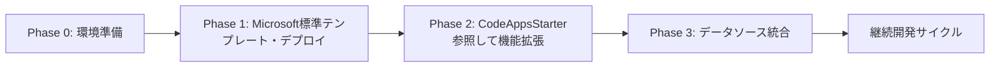
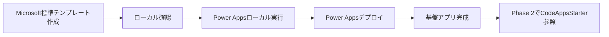
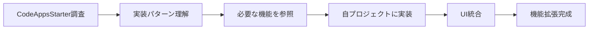
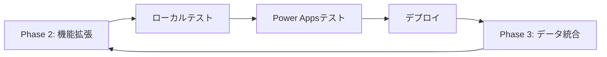

# Power Apps Code Apps 開発標準

## 概要

**Power Apps Code Apps** は、React、Vue などのポピュラーなフレームワークを使用してカスタムWebアプリを構築し、UI とロジックの完全な制御を保ちながら Power Platform で実行できる開発プラットフォームです。Microsoft Entra 認証、1,500+ コネクター、管理プラットフォームポリシー準拠により、安全で迅速なイノベーションを実現します。

- この標準は、**Power Apps Code Apps** のための開発指針です。
- Microsoft 公式ドキュメント（[Power Apps code apps](https://learn.microsoft.com/en-us/power-apps/developer/code-apps/)）と[PowerAppsCodeAppsリポジトリ](https://github.com/microsoft/PowerAppsCodeApps)、と**Geekの経験**に基づき、**要件理解から公開まで**の開発プロセスと、**CodeAppsStarterテンプレート活用型デザインシステム**を統合した実践的な開発ガイドラインです。

> **この標準は Power Apps Code Apps 専用です。PCF コンポーネント開発ではありません。**

---

## 📚 ドキュメント構成

このリポジトリは、開発標準とPhase別リファレンスで構成されています:

### 📖 **README.md（開発標準・このファイル）**
- ✅ 開発プロセス全体のフロー（Phase 0-5）
- ✅ Power Apps SDK の基本原則
- ✅ データソース接続の標準手順
- ✅ プロジェクト構造とアーキテクチャ
- ✅ 品質管理とテスト戦略

### 📘 **Phase別リファレンス（ルートディレクトリ）**
- ✅ **[PHASE0_ENVIRONMENT_SETUP.md](./PHASE0_ENVIRONMENT_SETUP.md)** - 環境セットアップ
- ✅ **[PHASE1_テンプレートセットアップ・ローカル実行・デプロイ](https://github.com/geekfujiwara/CodeAppsStarter)**
- ✅ **[PHASE2_FEATURE_ENHANCEMENT.md](./PHASE2_FEATURE_ENHANCEMENT.md)** - 機能拡張
- ✅ **[PHASE3_DATA_INTEGRATION.md](./PHASE3_DATA_INTEGRATION.md)** - データソース統合詳細

**推奨される使い方:**

- GitHub Copilot にこのリポジトリのURLを渡してアイデアを伝えてエージェントに作ってもらいましょう。

---

## 📝 **重要なお知らせとライセンス**

### **📈 定期更新について**
この開発標準は **Geek** が Power Apps Code Apps の技術進歩と実践経験に基づき**定期的に更新**しています。最新のMicrosoft公式仕様やベストプラクティスを反映し、より実用的で効率的な開発手順の提供を心がけています。

### **⚖️ MITライセンス - 自由利用可能**
この開発標準は **MITライセンス** のもとで公開されており、以下が自由に行えます：

✅ **商用利用** - 企業プロジェクトでの利用

✅ **転用・改変** - 組織のニーズに合わせた修正・拡張
  
✅ **再配布** - チーム内外での共有・配布

✅ **私用** - 個人的な学習・開発での利用

**⚠️ 重要**: サポートや保証は提供されません。利用は**自己責任**でお願いいたします。

### **🐛 問題報告・修正依頼**
開発標準に問題や改善点を発見された場合は、GitHub の **Issues** からお気軽にご報告ください：

**🔗 Issues URL**: [https://github.com/geekfujiwara/CodeAppsDevelopmentStandard/issues](https://github.com/geekfujiwara/CodeAppsDevelopmentStandard/issues)

- 技術的な問題や誤記の報告
- 新しい機能や手順の提案
- 実践での改善アイデアの共有

### **💬 感想・コメント歓迎**
この開発標準を使用されたご感想やコメントは、**GeekfujiwaraのX** まで、ぜひお聞かせください！

**🔗 X (Twitter)**: [@geekfujiwara](https://twitter.com/geekfujiwara)

- 開発標準を使用した感想
- 実際のプロジェクトでの活用事例
- 改善提案や質問
- Power Apps Code Apps に関する情報交換

**📢 皆様からのフィードバックが、この開発標準をより良いものにしていきます！**

## 🎯 **この開発標準で実現できること**

**この Power Apps Code Apps 開発標準により以下が実現されます:**

✅ **統一された開発フロー** - Phase 0〜3の体系的アプローチによる効率的な開発進行

✅ **矛盾のない技術スタック** - Microsoft 公式パターン準拠による安定した基盤

✅ **実践的なトラブルシューティング** - よくある問題の解決法による開発時間短縮

✅ **包括的品質保証** - 各Phase完了時の厳密チェックによる高品質アプリ

✅ **効率的なAIガイダンス** - 開発状況に応じた適切な提案による学習効果

✅ **安全なデータ統合** - スキーマ確認からリアルデータ移行まで安心の手順

**結果**: 確実で効率的な Power Apps Code Apps 開発サイクルが確立されます。

---

## 🎯 **開発フローの概要**

この開発標準では、Phase 0からPhase 3までの体系的なアプローチで、確実かつ効率的なPower Apps Code Apps開発を実現します。

> **⚠️ 重要なお知らせ: SDK更新に伴う開発プロセスの見直し**
>
> **aka.ms/CodeApps リポジトリでMicrosoft公式SDKが更新されたため、開発プロセスを見直しました。**
>
> **新しい開発プロセス:**
> 1. **Phase 1**: まず**Microsoft標準のStarterテンプレート**をデプロイ（SDK互換性確保）
> 2. **Phase 2**: **CodeAppsStarterテンプレートを参照**して必要な機能を追加
> 3. **Phase 3**: Dataverseやコネクターに接続（最後のステップ）
>
> この新しいプロセスにより、SDK初期化エラーを回避し、最新SDKとの互換性を保証します。

### **📋 開発フロー全体像**



**各Phaseの目的:**
- **Phase 0**: 開発環境の準備とPower Platform認証
- **Phase 1**: **Microsoft標準テンプレート**のセットアップ + デプロイ（SDK互換性確保）
- **Phase 2**: **CodeAppsStarterを参照**して必要な機能を段階的に追加
- **Phase 3**: Dataverseやコネクター接続（最後のステップ）

### **⚠️ 重要な開発方針**

#### **🚨 Phase順守の原則 - 必ずPhase 1完了後にPhase 2へ**

> **📍 どんなに優れたアイディアがあっても、必ずPhase 1（Microsoft標準テンプレートデプロイ）を完了してからPhase 2（機能拡張）に進んでください。**

**この原則を守る理由:**

1. **✅ SDK互換性の確保** - 最新のMicrosoft SDKとの互換性を保証
2. **✅ SDK初期化エラー回避** - 動作確認済みの基盤から開発開始
3. **✅ 環境の健全性検証** - Power Platform環境との統合が問題なく動作
4. **✅ ビルド・デプロイプロセスの確認** - 本番環境へのデプロイフローが確立
5. **✅ 段階的な開発** - 問題の切り分けが容易になり、トラブルシューティングが効率的
6. **✅ リスク低減** - カスタム機能追加前の安定した状態を確保

**🔄 正しい開発フロー:**

```
💡 アイディア発生
  ↓
⚠️ Phase 1を優先
  ↓
✅ Phase 1: Microsoft標準テンプレートデプロイ完了
  ↓
✅ Phase 2: CodeAppsStarterを参照してアイディアを実装
  ↓
✅ Phase 3: Dataverseやコネクター接続
```

**❌ 誤った開発フロー（避けるべき）:**

```
💡 アイディア発生
  ↓
❌ Phase 1をスキップしていきなり機能開発
  ↓
❌ CodeAppsStarterをクローンして改変からスタート
  ↓
💥 SDK初期化エラー・原因切り分けが困難
```

#### **機能開発時の必須ルール**

> **📌 Phase 2で新しい機能を開発する際は、[CodeAppsStarter テンプレート](https://github.com/geekfujiwara/CodeAppsStarter) を**参照**してデザインサンプルとUIコンポーネントを活用してください。**
>
> **重要**: CodeAppsStarterは**参照用**です。全体をクローンするのではなく、必要な機能のみを自分のプロジェクトに追加してください。

**理由:**
- ✅ **SDK互換性維持** - Microsoft標準基盤の上に機能追加
- ✅ **一貫したUI/UX** - 高品質なデザインパターンを活用
- ✅ **開発効率の向上** - ゼロから作成せず既存パターンを参照
- ✅ **メンテナンス性** - 標準化されたコードベース
- ✅ **品質保証** - 検証済みの実装パターン

**具体的な実践方法（Phase 2での作業）:**
1. **Phase 1完了確認** → Microsoft標準テンプレートが正常にデプロイされていることを確認
2. **機能要件の確認** → 実装したい機能を明確化
3. **CodeAppsStarter調査** → [GitHub上の実装](https://github.com/geekfujiwara/CodeAppsStarter/tree/main/src)で類似機能を探す
4. **必要な機能のみコピー** → 必要な部分だけを自分のプロジェクトに追加
5. **段階的に実装** → 一度に全てではなく、機能ごとに段階的に追加

**参照先:**
- 📖 **[CodeAppsStarter Repository](https://github.com/geekfujiwara/CodeAppsStarter)** - リポジトリ全体
- 📖 **[CodeAppsStarter - src/app/](https://github.com/geekfujiwara/CodeAppsStarter/tree/main/src/app)** - ページ実装例
- 📖 **[CodeAppsStarter - src/components/](https://github.com/geekfujiwara/CodeAppsStarter/tree/main/src/components)** - コンポーネント実装例
- 📖 **[Phase 2 リファレンス](./PHASE2_FEATURE_ENHANCEMENT.md)** - 詳細な実装ガイド

---

### **Phase 0: 環境準備**


> **📘 必ず以下のリファレンスを確認して実行してください**:
>
> [Phase 0 リファレンス](./PHASE0_ENVIRONMENT_SETUP.md)

**Phase 0の概要:**
- Node.js・@microsoft/power-apps-cli のインストール
- VS Code拡張機能の設定
- Power Platform環境の選択と認証

**完了条件:**
- ✅ 開発ツールが正常にインストールされている
- ✅ Power Platform環境にアクセスできる
- ✅ VS Code拡張機能が設定されている

**次へ**: Phase 0 → Phase 1

---

### **Phase 1: Microsoftスタンダードテンプレート・デプロイ**



> **⚠️ 重要: SDK互換性のための新しい開発プロセス**
>
> **aka.ms/CodeApps にてMicrosoft公式SDKが更新されたため、開発プロセスを見直しました。**
>
> **新しいプロセス:**
> 1. **Phase 1**: まず**Microsoft標準のStarterテンプレート**をデプロイ（SDK互換性確保）
> 2. **Phase 2**: CodeAppsStarterテンプレートを**参照**して機能追加開発
> 3. **Phase 3**: Dataverseやコネクターに接続（最後のステップ）
>
> **このプロセスを守る理由:**
> - ✅ 最新SDKとの互換性が保証される
> - ✅ SDK初期化エラーを回避できる
> - ✅ 動作確認済みの基盤から開発を開始できる
> - ✅ 問題発生時の切り分けが容易

**Phase 1の概要:**
- Microsoft公式のStarterテンプレートを使用してプロジェクト作成
- npm run devでローカル動作確認
- Power Apps環境でのローカル実行（npx @microsoft/power-apps-cli init + npm run dev）
- Power Apps環境へのテンプレートデプロイ（npm run build + npx @microsoft/power-apps-cli push）
- **重要**: この段階ではMicrosoft標準テンプレートをそのままデプロイ

> **🚨 Phase 1は標準テンプレートのままデプロイ**
>
> **Phase 1では、Microsoft標準のStarterテンプレートを改変せずにデプロイしてください。**
> 機能追加はPhase 2で、CodeAppsStarterテンプレートを参照しながら実施します。
> これにより、SDK初期化エラーを回避し、最新のSDKとの互換性を保証します。

**統合コマンド:**
```bash
# 1. Microsoft標準テンプレートでプロジェクト作成
# プロジェクト用フォルダを作成してVS Codeで開く
mkdir [プロジェクト名]
cd [プロジェクト名]
code .

# VS Codeでフォルダを開いた後、ターミナルで実行
# Microsoft標準のStarterテンプレートを使用
npm create vite@latest . -- --template react-ts
npm install
npm run dev

# Power Apps SDKをインストール（最新版を推奨）
npm install @microsoft/power-apps@latest

# 2. Power Apps環境でのローカル実行
npx @microsoft/power-apps-cli init --environmentId [environmentid] --displayName "[アプリ表示名]"
npm run dev

# 3. Power Apps環境へのデプロイ
npm run build
npx @microsoft/power-apps-cli push
```

**例：**
```bash
# 具体例: TaskManagerプロジェクトの作成
# プロジェクトフォルダを作成してVS Codeで開く
mkdir TaskManager
cd TaskManager
code .

# VS Codeでフォルダを開いた後、ターミナルで実行
# Vite + React + TypeScriptテンプレートを使用
npm create vite@latest . -- --template react-ts
npm install
npm run dev

# Power Apps SDKをインストール（最新版を推奨）
npm install @microsoft/power-apps@latest

# Power Appsローカル実行
npx @microsoft/power-apps-cli init --environmentId 12345678-1234-1234-1234-123456789abc --displayName "Task Manager"
npm run dev

# デプロイ
npm run build
npx @microsoft/power-apps-cli push
```

> **📌 CodeAppsStarterテンプレートの活用について**
>
> Phase 1ではMicrosoft標準テンプレートを使用しますが、Phase 2では以下のように**CodeAppsStarterテンプレートを参照**します:
>
> 1. **[CodeAppsStarter Repository](https://github.com/geekfujiwara/CodeAppsStarter)** でデザインサンプルとUIパターンを確認
> 2. `src/app/` のページ実装例を参照
> 3. `src/components/` のコンポーネント実装例を参照
> 4. 必要な機能のコードをPhase 2で自分のプロジェクトに追加
>
> **参照の利点:**
> - ✅ SDK互換性を維持しながら高品質なUIパターンを活用
> - ✅ 実装済みパターンの再利用で開発効率向上
> - ✅ ベストプラクティスに沿った実装
> - ✅ SDK初期化エラーのリスク回避

**完了条件:**
- ✅ Microsoft標準テンプレートがローカルで正常に起動する
- ✅ Power Apps SDKが正常にインストールされている
- ✅ Power Apps環境でローカル実行が成功する
- ✅ Power Apps環境へのデプロイが完了する
- ✅ テンプレートが本番環境で動作する
- ✅ SDK初期化エラーが発生していない（重要）
- ✅ **テンプレートに機能追加していない（重要）**

> **✅ Phase 1完了チェック**
>
> Phase 2に進む前に、以下を確認してください:
> - [ ] Microsoft標準テンプレートを改変せずにデプロイした
> - [ ] Power Apps環境でテンプレートが正常に表示される
> - [ ] SDK初期化エラーが発生していない
> - [ ] ビルド・デプロイプロセスが確立している
> - [ ] カスタム機能は一切追加していない
>
> **これでPhase 2でCodeAppsStarterを参照した機能開発の準備が整いました！**

**次へ**: Phase 1 → Phase 2

---

### **Phase 2: CodeAppsStarter参照型の機能拡張**



> **📘 必ず以下のリファレンスを確認して実行してください**:
>
> - **[Phase 2 リファレンス](./PHASE2_FEATURE_ENHANCEMENT.md)** - 機能拡張・デザインシステム詳細

> **✅ Phase 2開始の前提条件**
>
> **Phase 2はPhase 1（Microsoft標準テンプレートデプロイ）完了後にのみ開始してください。**
>
> このPhaseでは、Phase 1でデプロイした動作確認済みのMicrosoft標準テンプレートを基盤として、
> **CodeAppsStarterテンプレートを参照**しながら、アイディアやカスタム機能を安全に追加していきます。

> **🔍 Phase 2開始前の必須調査**
>
> **新機能を実装する前に、必ずCodeAppsStarterテンプレートで類似機能や再利用可能なパターンを調査してください。**
>
> **重要: CodeAppsStarterは参照用です。クローンせず、必要な機能のみを自分のプロジェクトに追加してください。**
>
> **具体的な調査項目:**
> - **ページレイアウト** - 類似画面構成があるか?
> - **UIコンポーネント** - 必要なコンポーネントが既にあるか?
> - **データ表示パターン** - テーブル・カード・リスト表示の実装例
> - **フォームパターン** - 入力フォーム・バリデーションの実装例
> - **状態管理** - React hooksの使用パターン
>
> **📖 調査先:**
> - [CodeAppsStarter Repository](https://github.com/geekfujiwara/CodeAppsStarter) - リポジトリ全体
> - [src/app/page.tsx](https://github.com/geekfujiwara/CodeAppsStarter/blob/main/src/app/page.tsx) - ホームページ実装
> - [src/components/ui/](https://github.com/geekfujiwara/CodeAppsStarter/tree/main/src/components/ui) - UIコンポーネント
> - [src/components/layout/](https://github.com/geekfujiwara/CodeAppsStarter/tree/main/src/components/layout) - レイアウトコンポーネント

> **📘 必ず以下のリファレンスを確認して実装してください**:
> 
> - **[Phase 2 リファレンス](./PHASE2_FEATURE_ENHANCEMENT.md)** - テンプレートデザインシステム参照方法
> - **[ロゴ実装マスターガイド](./docs/LOGO_MASTER_GUIDE.md)** - ロゴ・アイコンカスタマイズ
> - **[テーマカスタマイズガイド](./docs/THEME_CUSTOMIZATION_GUIDE.md)** - 色・テーマ変更
> - **[shadcn/ui拡張ガイド](./docs/SHADCN_UI_EXTENSION_GUIDE.md)** - UIコンポーネント活用

**Phase 2の概要:**
- CodeAppsStarterテンプレートを**参照**してデザインシステムを理解
- 必要な機能・コンポーネントのみを自分のプロジェクトに追加
- Microsoft標準テンプレート基盤の上に、段階的に機能を追加
- SDK互換性を維持しながらプロジェクト要件に合わせた拡張

**CodeAppsStarter参照型開発:**
1. **テンプレート調査** - CodeAppsStarterで実装したい機能を探す
2. **コード理解** - 実装パターンとコンポーネント使用方法を理解
3. **必要な機能のみ追加** - 自分のプロジェクトに必要な部分だけをコピー・実装
4. **段階的な追加** - 一度に全てではなく、機能ごとに段階的に追加
5. **動作確認** - 各機能追加後に必ず動作確認

**完了条件:**
- ✅ CodeAppsStarterを参照して必要な機能を理解した
- ✅ 必要な機能のみを自分のプロジェクトに追加した
- ✅ Microsoft標準テンプレート基盤を維持している
- ✅ SDK互換性を保ちながら機能拡張できている
- ✅ ローカル環境で新機能が正常に動作する
- ✅ SDK初期化エラーが発生していない

**統合コマンド:**
```bash
# 機能拡張後のローカル確認
npm run dev

# Power Apps環境でのローカル実行
npx @microsoft/power-apps-cli init --environmentId [environmentid] --displayName "[アプリ表示名]"
npm run dev

# デプロイ
npm run build
npx @microsoft/power-apps-cli push
```

**次へ**: Phase 2 → Phase 3

---

### **Phase 3: データソース統合**

### **Phase 3: データソース統合**


> **📘 必ず以下のリファレンスを確認して実行してください**:
>
> - **⭐ [Dataverse接続 完全ガイド](./docs/DATAVERSE_CONNECTION_GUIDE.md)** - Dataverse接続の統合最終版ガイド（最初に読むべき）
> - **[Phase 3 リファレンス](./PHASE3_DATA_INTEGRATION.md)** - データソース統合の詳細手順
>
> 以下は必要に応じて参照してください
> 
> **Dataverse実装リファレンス:**
> - **[Dataverse統合ベストプラクティス](./docs/DATAVERSE_INTEGRATION_BEST_PRACTICES.md)** - ベストプラクティス詳細
> - **[Lookupフィールド実装ガイド](./docs/LOOKUP_FIELD_GUIDE.md)** - Lookup完全実装
> - **[Dataverseスキーマリファレンス](./docs/DATAVERSE_SCHEMA_REFERENCE.md)** - スキーマ定義とChoice値
> - **[スキーマ取得方法](./docs/HOW_TO_GET_DATAVERSE_SCHEMA.md)** - 5つの取得方法
> - **[Dataverseトラブルシューティング](./docs/DATAVERSE_TROUBLESHOOTING.md)** - よくある問題と解決法

**Phase 3の概要:**
- 実際のビジネスデータソース接続の設定（Dataverse、SharePoint、SQL等）
- Power Apps SDKの初期化完了後のコネクタ接続
- カスタムフックによるデータアクセスロジックの実装
- CRUD操作の実装とUI統合
- エラーハンドリングとデータ検証

**重要: SDK初期化のタイミング**
> ⚠️ **Power Apps SDKの初期化が完了してから**データソースに接続する必要があります。  
> 詳細は [Phase 3 リファレンス](./PHASE3_DATA_INTEGRATION.md#重要-sdk初期化とコネクタ接続のタイミング) を参照してください。

**実施するStep:**
1. **データソース選択** - プロジェクト要件に合わせたデータソース決定
2. **データソース接続準備** - Power Appsポータルで接続作成
3. **スキーマ確認** - データ構造の把握と型定義
4. **接続追加コマンド** - `npx @microsoft/power-apps-cli add-data-source`
5. **カスタムフック作成** - データアクセスロジックの実装
6. **UI統合** - Phase 2で実装した機能へのデータ統合
7. **テスト・デプロイ** - データ連携の動作確認と本番反映

**完了条件:**
- ✅ データソースが正しく接続されている
- ✅ CRUD操作が正常に動作する
- ✅ UIとデータが適切に統合されている
- ✅ エラーハンドリングが実装されている
- ✅ 本番環境でデータ連携が動作する

**統合コマンド:**
```bash
# データソース接続追加
npx @microsoft/power-apps-cli add-data-source

# ローカルテスト
npm run dev

# デプロイ
npm run build
npx @microsoft/power-apps-cli push
```

**次へ**: Phase 3 → SDK互換性確認 → 継続開発サイクル

---

## 🛠️ SDK互換性とトラブルシューティング

### **SDK初期化エラーへの対処**

aka.ms/CodeApps リポジトリでSDKが更新されたことにより、従来の開発方法では初期化エラーが発生する可能性があります。

**よくあるエラー:**
```
PowerDataRuntimeError: An unknown error occurred: 
PowerDataRuntime is not initialized. Please call initializeRuntime() first.
```

**原因:**
- 古いSDKバージョンを使用している
- カスタムコードがSDK初期化前に実行されている
- CodeAppsStarterを直接クローンして使用している（SDK互換性の問題）

**解決方法:**

#### **1. Microsoft標準テンプレートから開始する**
```bash
# ❌ 間違い: CodeAppsStarterを直接クローン
git clone https://github.com/geekfujiwara/CodeAppsStarter .

# ✅ 正しい: Microsoft標準テンプレートから開始
npm create vite@latest . -- --template react-ts
npm install
npm install @microsoft/power-apps
```

#### **2. SDKバージョンを最新に更新する**
```bash
# 現在のSDKバージョン確認
npm list @microsoft/power-apps

# 最新版に更新
npm install @microsoft/power-apps@latest

# package-lock.jsonも更新
npm install
```

#### **3. SDK初期化を確認する**
```typescript
// src/main.tsx または App.tsx
import { usePowerPlatform } from '@microsoft/power-apps';

export function App() {
  const { isInitialized } = usePowerPlatform();

  // SDK初期化が完了するまで待機
  if (!isInitialized) {
    return (
      <div className="flex items-center justify-center h-screen">
        <div className="text-center">
          <div className="animate-spin rounded-full h-12 w-12 border-b-2 border-primary mx-auto"></div>
          <p className="mt-4">Power Apps SDK 初期化中...</p>
        </div>
      </div>
    );
  }

  // 初期化完了後にコンテンツを表示
  return <YourApp />;
}
```

#### **4. 段階的な機能追加**

```bash
# Phase 1: Microsoft標準テンプレートをデプロイ
npm run build
npx @microsoft/power-apps-cli push
# → 動作確認

# Phase 2: CodeAppsStarterから必要な機能のみ追加
# 例: shadcn/ui コンポーネントを追加
npx shadcn-ui@latest init
npx shadcn-ui@latest add button
# → 動作確認

# Phase 3: Dataverse接続
npx @microsoft/power-apps-cli add-data-source -a dataverse -t accounts
# → 動作確認
```

### **Phase 1で確認すべき項目**

**デプロイ前:**
- [ ] `npm run dev` でローカル起動成功
- [ ] コンソールエラーなし
- [ ] `@microsoft/power-apps` が最新版

**デプロイ後:**
- [ ] Power Apps環境でアプリが起動する
- [ ] SDK初期化エラーが発生しない
- [ ] 認証が正常に動作する

**エラーが発生する場合:**
1. 全てのカスタムコードを削除
2. Microsoft標準テンプレートの状態に戻す
3. 再度デプロイして動作確認
4. 動作したら、Phase 2で段階的に機能追加

### **CodeAppsStarterの正しい活用方法**

**❌ 避けるべき方法:**
```bash
# CodeAppsStarterを全体クローンして開発
git clone https://github.com/geekfujiwara/CodeAppsStarter .
npm install
# → SDK互換性の問題が発生する可能性
```

**✅ 推奨される方法:**
```bash
# 1. Microsoft標準テンプレートから開始
npm create vite@latest . -- --template react-ts
npm install
npm install @microsoft/power-apps

# 2. 必要に応じてshadcn/uiを追加
npx shadcn-ui@latest init

# 3. CodeAppsStarterを参照して必要な機能のみコピー
# 例: Button コンポーネントが必要な場合
npx shadcn-ui@latest add button

# 4. CodeAppsStarterのページ実装を参照してコピー
# https://github.com/geekfujiwara/CodeAppsStarter/blob/main/src/app/page.tsx
# 必要な部分だけを自分のプロジェクトに追加
```

---

## 🔄 継続開発サイクル

Phase 3完了後は、以下のサイクルで継続的な機能拡張・改善を行います：



**継続開発の流れ:**
1. **Phase 2**: 新機能の実装・既存機能の改善
2. **ローカルテスト**: `npm run dev` で動作確認
3. **Power Appsテスト**: `npx @microsoft/power-apps-cli init` + `npm run dev` で認証環境テスト
4. **デプロイ**: `npm run build` + `npx @microsoft/power-apps-cli push` で本番反映
5. **Phase 3**: 必要に応じてデータソース追加・変更
6. Phase 2に戻り、次の機能開発へ

---

## 📚 Phase別リファレンスドキュメント

**実施するStep:**
1. **データソース選択** - プロジェクト要件に合わせたデータソース決定
2. **データソース接続準備** - Power Appsポータルで接続作成
3. **スキーマ確認** - データ構造の把握と型定義
4. **接続追加コマンド** - `npx @microsoft/power-apps-cli add-data-source`
5. **カスタムフック作成** - データアクセスロジックの実装
6. **UI統合** - Phase 2で実装した機能へのデータ統合
7. **テスト・デプロイ** - データ連携の動作確認と本番反映

**完了条件:**
- ✅ データソースが正常に接続されている
- ✅ カスタムフックが実装されている
- ✅ `isInitialized` チェックが実装されている
- ✅ CRUD操作が正常に動作する

**基本パターン（概要）:**
```typescript
// ✅ 正しい実装: SDK初期化完了後にデータアクセス
const { isInitialized } = usePowerPlatform();
useEffect(() => {
  if (isInitialized) {
    loadData(); // SDK初期化完了後に実行
  }
}, [isInitialized]);
```

### 継続開発サイクル 

**継続開発サイクル**では以下の点を行います:

- 実装済み機能のリストアップ
- 改善点の提案
- 拡張機能の提案

各観点は **ImprovementProposal.MD** としてドキュメント化し、段階的に対応します。 

以上


