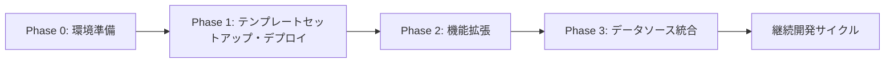
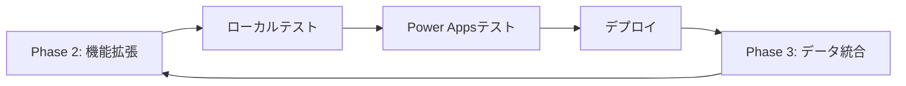

# Power Apps Code Apps 開発標準

## 概要

**Power Apps Code Apps** は、React、Vue などのポピュラーなフレームワークを使用してカスタムWebアプリを構築し、UI とロジックの完全な制御を保ちながら Power Platform で実行できる開発プラットフォームです。Microsoft Entra 認証、1,500+ コネクター、管理プラットフォームポリシー準拠により、安全で迅速なイノベーションを実現します。

- この標準は、**Power Apps Code Apps** のための開発指針です。
- Microsoft 公式ドキュメント（[Power Apps code apps](https://learn.microsoft.com/en-us/power-apps/developer/code-apps/)）と[PowerAppsCodeAppsリポジトリ](https://github.com/microsoft/PowerAppsCodeApps)、と**Geekの経験**に基づき、**要件理解から公開まで**の開発プロセスと、**CodeAppsStarterテンプレート活用型デザインシステム**を統合した実践的な開発ガイドラインです。

> **この標準は Power Apps Code Apps 専用です。PCF コンポーネント開発ではありません。**

---

## 📚 ドキュメント構成

このリポジトリは、開発標準とPhase別リファレンスで構成されています:

### 📖 **README.md（開発標準・このファイル）**
- ✅ 開発プロセス全体のフロー（Phase 0-5）
- ✅ Power Apps SDK の基本原則
- ✅ データソース接続の標準手順
- ✅ プロジェクト構造とアーキテクチャ
- ✅ 品質管理とテスト戦略

### 📘 **Phase別リファレンス（ルートディレクトリ）**
- ✅ **[PHASE0_ENVIRONMENT_SETUP.md](./PHASE0_ENVIRONMENT_SETUP.md)** - 環境セットアップ詳細
- ✅ **[PHASE1_PROJECT_SETUP.md](./PHASE1_PROJECT_SETUP.md)** - テンプレートセットアップ・ローカル実行・デプロイ詳細
- ✅ **[PHASE2_FEATURE_ENHANCEMENT.md](./PHASE2_FEATURE_ENHANCEMENT.md)** - 機能拡張詳細（デザインシステム参照）
- ✅ **[PHASE3_DATA_INTEGRATION.md](./PHASE3_DATA_INTEGRATION.md)** - データソース統合詳細

**推奨される使い方:**
1. **開発開始前** → このREADME.mdで全体像を把握
2. **実装時** → 各Phase別リファレンスで詳細を確認
3. **問題発生時** → 該当Phaseのトラブルシューティングセクションを参照

---

## 📝 **重要なお知らせとライセンス**

### **📈 定期更新について**
この開発標準は **Geek** が Power Apps Code Apps の技術進歩と実践経験に基づき**定期的に更新**しています。最新のMicrosoft公式仕様やベストプラクティスを反映し、より実用的で効率的な開発手順の提供を心がけています。

### **⚖️ MITライセンス - 自由利用可能**
この開発標準は **MITライセンス** のもとで公開されており、以下が自由に行えます：

✅ **商用利用** - 企業プロジェクトでの利用

✅ **転用・改変** - 組織のニーズに合わせた修正・拡張
  
✅ **再配布** - チーム内外での共有・配布

✅ **私用** - 個人的な学習・開発での利用

**⚠️ 重要**: サポートや保証は提供されません。利用は**自己責任**でお願いいたします。

### **🐛 問題報告・修正依頼**
開発標準に問題や改善点を発見された場合は、GitHub の **Issues** からお気軽にご報告ください：

**🔗 Issues URL**: [https://github.com/geekfujiwara/CodeAppsDevelopmentStandard/issues](https://github.com/geekfujiwara/CodeAppsDevelopmentStandard/issues)

- 技術的な問題や誤記の報告
- 新しい機能や手順の提案
- 実践での改善アイデアの共有

### **💬 感想・コメント歓迎**
この開発標準を使用されたご感想やコメントは、**GeekfujiwaraのX (旧Twitter)** まで、ぜひお聞かせください！

**🔗 X (Twitter)**: [@geekfujiwara](https://twitter.com/geekfujiwara)

- 開発標準を使用した感想
- 実際のプロジェクトでの活用事例
- 改善提案や質問
- Power Apps Code Apps に関する情報交換

**📢 皆様からのフィードバックが、この開発標準をより良いものにしていきます！**

## 🎯 **この開発標準で実現できること**

**この Power Apps Code Apps 開発標準により以下が実現されます:**

✅ **統一された開発フロー** - Phase 0〜5の体系的アプローチによる効率的な開発進行

✅ **矛盾のない技術スタック** - Microsoft公式パターン準拠による安定した基盤

✅ **実践的なトラブルシューティング** - よくある問題の解決法による開発時間短縮

✅ **包括的品質保証** - 各Phase完了時の厳密チェックによる高品質アプリ

✅ **効率的なAIガイダンス** - 開発状況に応じた適切な提案による学習効果

✅ **安全なデータ統合** - スキーマ確認からリアルデータ移行まで安心の手順

**結果**: 確実で効率的な Power Apps Code Apps 開発サイクルが確立されます。

---

## 🎯 **開発フローの概要**

この開発標準では、Phase 0からPhase 5までの体系的なアプローチで、確実かつ効率的なPower Apps Code Apps開発を実現します。

### **📋 開発フロー全体像**



**各Phaseの目的:**
- **Phase 0**: 開発環境の準備とPower Platform認証
- **Phase 1**: テンプレートセットアップ + ローカル確認 + Power Appsローカル実行 + Power Appsデプロイ
- **Phase 2**: テンプレートデザインシステムを活用した機能拡張
- **Phase 3**: データソース統合と本格的なビジネスロジック実装

### **⚠️ 重要な開発方針**

**機能開発時の必須ルール:**

> **📌 新しい機能を開発する際は、必ず [CodeAppsStarter テンプレート](https://github.com/geekfujiwara/CodeAppsStarter) のデザインサンプルとUIコンポーネントを再利用してください。**

**理由:**
- ✅ **一貫したUI/UX** - テンプレート品質を維持
- ✅ **開発効率の向上** - ゼロから作成せず既存パターンを活用
- ✅ **メンテナンス性** - 標準化されたコードベース
- ✅ **品質保証** - テンプレートで検証済みの実装パターン

**具体的な実践方法:**
1. **機能要件の確認** → まずテンプレートに類似機能があるか確認
2. **テンプレート参照** → [GitHub上の実装](https://github.com/geekfujiwara/CodeAppsStarter/tree/main/src)を確認
3. **パターン活用** → テンプレートの実装方法を参考に開発
4. **コンポーネント再利用** → `src/components/ui/` のshadcn/uiコンポーネントを活用

**参照先:**
- 📖 **[CodeAppsStarter - src/app/](https://github.com/geekfujiwara/CodeAppsStarter/tree/main/src/app)** - ページ実装例
- 📖 **[CodeAppsStarter - src/components/](https://github.com/geekfujiwara/CodeAppsStarter/tree/main/src/components)** - コンポーネント実装例
- 📖 **[Phase 2 リファレンス](./PHASE2_FEATURE_ENHANCEMENT.md)** - 詳細な実装ガイド

---

### **Phase 0: 環境準備**


> **📘 必ず以下のリファレンスを確認して実行してください**:
>
> [Phase 0 リファレンス](./PHASE0_ENVIRONMENT_SETUP.md)

**Phase 0の概要:**
- Node.js・Power Platform CLIのインストール
- VS Code拡張機能の設定
- Power Platform環境の選択と認証

**完了条件:**
- ✅ 開発ツールが正常にインストールされている
- ✅ Power Platform環境にアクセスできる
- ✅ VS Code拡張機能が設定されている

**次へ**: Phase 0 → Phase 1

---

### **Phase 1: テンプレートセットアップ・ローカル実行・デプロイ**


> **📘 必ず以下のリファレンスを確認して実行してください**:
>
> - **[Phase 1 リファレンス](./PHASE1_PROJECT_SETUP.md)** - セットアップ・ローカル実行・デプロイ詳細

**Phase 1の概要:**
- CodeAppsStarterテンプレートのセットアップ
- npm run devでローカル動作確認
- Power Apps環境でのローカル実行（pac code init + npm run dev）
- Power Apps環境へのテンプレートデプロイ（npm run build + pac code push）

**統合コマンド:**
```bash
# 1. テンプレートセットアップとローカル動作確認
# プロジェクト用フォルダを作成してVS Codeで開く
mkdir [プロジェクト名]
cd [プロジェクト名]
code .

# VS Codeでフォルダを開いた後、ターミナルで実行
git clone https://github.com/geekfujiwara/CodeAppsStarter .
npm install
npm run dev

# 2. Power Apps環境でのローカル実行
pac code init --environment [environmentid] --displayName "[アプリ表示名]"
npm run dev

# 3. Power Apps環境へのデプロイ
npm run build
pac code push
```

**例：**
```bash
# 具体例: TaskManagerプロジェクトの作成
# プロジェクトフォルダを作成してVS Codeで開く
mkdir TaskManager
cd TaskManager
code .

# VS Codeでフォルダを開いた後、ターミナルで実行
git clone https://github.com/geekfujiwara/CodeAppsStarter .
npm install
npm run dev

# Power Appsローカル実行
pac code init --environment 12345678-1234-1234-1234-123456789abc --displayName "Task Manager"
npm run dev

# デプロイ
npm run build
pac code push
```

**完了条件:**
- ✅ テンプレートがローカルで正常に起動する
- ✅ Power Apps環境でローカル実行が成功する
- ✅ Power Apps環境へのデプロイが完了する
- ✅ テンプレートが本番環境で動作する

**次へ**: Phase 1 → Phase 2

---

### **Phase 2: テンプレートデザインシステムを活用した機能拡張**


> **📘 必ず以下のリファレンスを確認して実装してください**:
> 
> - **[Phase 2 リファレンス](./PHASE2_FEATURE_ENHANCEMENT.md)** - テンプレートデザインシステム参照方法
> - **[ロゴ実装マスターガイド](./docs/LOGO_MASTER_GUIDE.md)** - ロゴ・アイコンカスタマイズ
> - **[テーマカスタマイズガイド](./docs/THEME_CUSTOMIZATION_GUIDE.md)** - 色・テーマ変更
> - **[shadcn/ui拡張ガイド](./docs/SHADCN_UI_EXTENSION_GUIDE.md)** - UIコンポーネント活用

**Phase 2の概要:**
- テンプレートのデザインシステム（shadcn/ui + Tailwind CSS）を参照
- 既存のUIコンポーネントを活用した機能実装
- テンプレート品質を維持しながらプロジェクト要件に合わせた拡張
- コード重複を避けた効率的な開発

**テンプレートデザインシステム参照開発:**
1. **テンプレート参照** - CodeAppsStarterのUI実装例を確認  
2. **デザインパターン活用** - 既存コンポーネントを参照して実装
3. **機能実装** - テンプレートのデザイン品質を維持して機能追加
4. **ローカル確認** - `npm run dev` で動作確認

**完了条件:**
- ✅ テンプレートデザインシステムを参照して機能実装完了
- ✅ 新機能がテンプレートのUI品質を維持している
- ✅ ローカル環境で新機能が正常に動作する

**統合コマンド:**
```bash
# 機能拡張後のローカル確認
npm run dev

# Power Apps環境でのローカル実行
pac code init --environment [environmentid] --displayName "[アプリ表示名]"
npm run dev

# デプロイ
npm run build
pac code push
```

**次へ**: Phase 2 → Phase 3

---

### **Phase 3: データソース統合**

### **Phase 3: データソース統合**


> **📘 必ず以下のリファレンスを確認して実行してください**:
>
> [Phase 3 リファレンス](./PHASE3_DATA_INTEGRATION.md)
>
> 以下は必要に応じて参照してください
> 
> **Dataverse実装リファレンス:**
> - **[Lookupフィールド実装ガイド](./docs/LOOKUP_FIELD_GUIDE.md)** - Lookup完全実装
> - **[Dataverseスキーマリファレンス](./docs/DATAVERSE_SCHEMA_REFERENCE.md)** - スキーマ定義とChoice値
> - **[スキーマ取得方法](./docs/HOW_TO_GET_DATAVERSE_SCHEMA.md)** - 5つの取得方法
> - **[Dataverseトラブルシューティング](./docs/DATAVERSE_TROUBLESHOOTING.md)** - よくある問題と解決法

**Phase 3の概要:**
- 実際のビジネスデータソース接続の設定（Dataverse、SharePoint、SQL等）
- Power Apps SDKの初期化完了後のコネクタ接続
- カスタムフックによるデータアクセスロジックの実装
- CRUD操作の実装とUI統合
- エラーハンドリングとデータ検証

**重要: SDK初期化のタイミング**
> ⚠️ **Power Apps SDKの初期化が完了してから**データソースに接続する必要があります。  
> 詳細は [Phase 3 リファレンス](./PHASE3_DATA_INTEGRATION.md#重要-sdk初期化とコネクタ接続のタイミング) を参照してください。

**実施するStep:**
1. **データソース選択** - プロジェクト要件に合わせたデータソース決定
2. **データソース接続準備** - Power Appsポータルで接続作成
3. **スキーマ確認** - データ構造の把握と型定義
4. **接続追加コマンド** - `pac code add-data-source`
5. **カスタムフック作成** - データアクセスロジックの実装
6. **UI統合** - Phase 2で実装した機能へのデータ統合
7. **テスト・デプロイ** - データ連携の動作確認と本番反映

**完了条件:**
- ✅ データソースが正しく接続されている
- ✅ CRUD操作が正常に動作する
- ✅ UIとデータが適切に統合されている
- ✅ エラーハンドリングが実装されている
- ✅ 本番環境でデータ連携が動作する

**統合コマンド:**
```bash
# データソース接続追加
pac code add-data-source

# ローカルテスト
npm run dev

# デプロイ
npm run build
pac code push
```

**次へ**: Phase 3 → 継続開発サイクル

---

## 🔄 継続開発サイクル

Phase 3完了後は、以下のサイクルで継続的な機能拡張・改善を行います：



**継続開発の流れ:**
1. **Phase 2**: 新機能の実装・既存機能の改善
2. **ローカルテスト**: `npm run dev` で動作確認
3. **Power Appsテスト**: `pac code init` + `npm run dev` で認証環境テスト
4. **デプロイ**: `npm run build` + `pac code push` で本番反映
5. **Phase 3**: 必要に応じてデータソース追加・変更
6. Phase 2に戻り、次の機能開発へ

---

## 📚 Phase別リファレンスドキュメント

**実施するStep:**
1. **データソース選択** - プロジェクト要件に合わせたデータソース決定
2. **データソース接続準備** - Power Appsポータルで接続作成
3. **スキーマ確認** - データ構造の把握と型定義
4. **接続追加コマンド** - `pac code add-data-source`
5. **カスタムフック作成** - データアクセスロジックの実装
6. **UI統合** - Phase 2で実装した機能へのデータ統合
7. **テスト・デプロイ** - データ連携の動作確認と本番反映

**完了条件:**
- ✅ データソースが正常に接続されている
- ✅ カスタムフックが実装されている
- ✅ `isInitialized` チェックが実装されている
- ✅ CRUD操作が正常に動作する

**基本パターン（概要）:**
```typescript
// ✅ 正しい実装: SDK初期化完了後にデータアクセス
const { isInitialized } = usePowerPlatform();
useEffect(() => {
  if (isInitialized) {
    loadData(); // SDK初期化完了後に実行
  }
}, [isInitialized]);
```

### 継続開発サイクル 

**継続開発サイクル**では以下の点を行います:

- 実装済み機能のリストアップ
- 改善点の提案
- 拡張機能の提案

各観点は **ImprovementProposal.MD** としてドキュメント化し、段階的に対応します。 

以上


