# Power Apps Code Apps 開発標準

## 概要

**Power Apps Code Apps** は、React、Vue などのポピュラーなフレームワークを使用してカスタムWebアプリを構築し、UI とロジックの完全な制御を保ちながら Power Platform で実行できる開発プラットフォームです。Microsoft Entra 認証、1,500+ コネクター、管理プラットフォームポリシー準拠により、安全で迅速なイノベーションを実現します。

- この標準は、**Power Apps Code Apps** のための開発指針です。
- Microsoft 公式ドキュメント（[Power Apps code apps](https://learn.microsoft.com/en-us/power-apps/developer/code-apps/)）と[PowerAppsCodeAppsリポジトリ](https://github.com/microsoft/PowerAppsCodeApps)、と**Geekの経験**に基づき、**要件理解から公開まで**の開発プロセスと、**モダンデザインシステム**を統合した実践的な開発ガイドラインです。

> **この標準は Power Apps Code Apps 専用です。PCF コンポーネント開発ではありません。**

## 📝 **重要なお知らせとライセンス**

### **📈 定期更新について**
この開発標準は **Geek** が Power Apps Code Apps の技術進歩と実践経験に基づき**定期的に更新**しています。最新のMicrosoft公式仕様やベストプラクティスを反映し、より実用的で効率的な開発手順の提供を心がけています。

### **⚖️ MITライセンス - 自由利用可能**
この開発標準は **MITライセンス** のもとで公開されており、以下が自由に行えます：

✅ **商用利用** - 企業プロジェクトでの利用

✅ **転用・改変** - 組織のニーズに合わせた修正・拡張
  
✅ **再配布** - チーム内外での共有・配布

✅ **私用** - 個人的な学習・開発での利用

**⚠️ 重要**: サポートや保証は提供されません。利用は**自己責任**でお願いいたします。

### **🐛 問題報告・修正依頼**
開発標準に問題や改善点を発見された場合は、GitHub の **Issues** からお気軽にご報告ください：

**🔗 Issues URL**: [https://github.com/geekfujiwara/CodeAppsDevelopmentStandard/issues](https://github.com/geekfujiwara/CodeAppsDevelopmentStandard/issues)

- 技術的な問題や誤記の報告
- 新しい機能や手順の提案
- 実践での改善アイデアの共有

### **💬 感想・コメント歓迎**
この開発標準を使用されたご感想やコメントは、**GeekfujiwaraのX (旧Twitter)** まで、ぜひお聞かせください！

**🔗 X (Twitter)**: [@geekfujiwara](https://twitter.com/geekfujiwara)

- 開発標準を使用した感想
- 実際のプロジェクトでの活用事例
- 改善提案や質問
- Power Apps Code Apps に関する情報交換

**📢 皆様からのフィードバックが、この開発標準をより良いものにしていきます！**

## 🎯 **この開発標準で実現できること**

**この Power Apps Code Apps 開発標準により以下が実現されます:**

✅ **統一された開発フロー** - Phase 0〜5の体系的アプローチによる効率的な開発進行

✅ **矛盾のない技術スタック** - Microsoft公式パターン準拠による安定した基盤

✅ **実践的なトラブルシューティング** - よくある問題の解決法による開発時間短縮

✅ **包括的品質保証** - 各Phase完了時の厳密チェックによる高品質アプリ

✅ **効率的なAIガイダンス** - 開発状況に応じた適切な提案による学習効果

✅ **安全なデータ統合** - スキーマ確認からリアルデータ移行まで安心の手順

**結果**: 確実で効率的な Power Apps Code Apps 開発サイクルが確立されます。

## 🎯 **開発フロー**

この開発標準では、**Microsoftの公式ドキュメント**と**Geekの経験**に基づく実績的な開発アプローチ**を採用し、各段階で一貫したAI提案による開発サイクルを実現します：

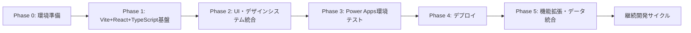

**開発サイクル**:

- **Phase 0 → Phase 1**: *"Vite + React + TypeScript プロジェクト作成"*
- **Phase 1 → Phase 2**: *"UI基盤・デザインシステム構築"*
- **Phase 2 → Phase 3**: *"Phase 3のPower Apps環境テスト"*
- **Phase 3 → Phase 4**: *"Phase 4のデプロイ"*
- **Phase 4 → Phase 5**: *"Phase 5の機能拡張・データソース統合"*
- **Phase 5 → 継続**: *"継続的な機能拡張開発サイクル"*

#### **Phase 0: 環境準備**
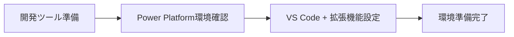
- **概要**: 開発に必要なツール・環境の一括準備
- **次へ**: Phase 0 → Phase 1

#### **Phase 1: プロジェクト環境構築・PowerProvider・SDK初期化**
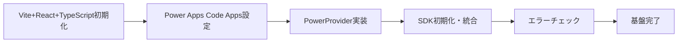

> **🎯 最重要設定項目**: Vite + React + TypeScriptプロジェクト初期化とPower Apps Code Apps対応設定

**統合開発手順**:

### **Step 1: Vite App初期化**
```bash
mkdir C:\CodeApps -Force
cd C:\CodeApps
npm create vite@latest AppFromScratch -- --template react-ts
cd C:\CodeApps\AppFromScratch
npm install
```

**注意事項** (Microsoft公式より):
- create-viteのインストールに同意する
- パッケージ名 `appfromscratch` をEnterで受け入れる  
- フレームワーク選択: React
- バリアント選択: TypeScript

```bash
# Node型定義をインストール (必須)
npm i --save-dev @types/node
```

### **Step 2: Code App初期化**
```bash
# 1. Power Platform認証
pac auth create

# 2. 環境選択
pac env select -env <環境のURL>

# 3. Code Apps初期化
pac code init --displayName "App From Scratch"

# 4. Power SDK インストール
npm install --save "@microsoft/power-apps"
```

2. **vite.config.ts 設定（Microsoft公式準拠）**
```typescript
import { defineConfig } from 'vite'
import react from '@vitejs/plugin-react'
import * as path from 'path'

// https://vite.dev/config/
export default defineConfig({
  base: "./",  // 🚨重要: Power Apps デプロイ必須設定
  server: {
    host: "::",
    port: 3000,  // Power SDK requires port 3000
  },
  plugins: [react()],
  resolve: {
    alias: {
      "@": path.resolve(__dirname, "./src"),
    },
  },
});
```

### **Step 4: PowerProvider.tsx追加**

**Microsoft公式**: `src`フォルダーに`PowerProvider.tsx`を追加
```
公式コード取得元: github.com/microsoft/PowerAppsCodeApps/docs/assets/PowerProvider.tsx
```

### **Step 5: main.tsx更新**

**Microsoft公式手順**:

1. **importを追加**:
```typescript
import PowerProvider from './PowerProvider.tsx'
```

2. **既存コードを変更**:
```typescript
// 変更前:
<StrictMode>
  <App />
</StrictMode>,

// 変更後:
<StrictMode>
  <PowerProvider>
    <App />
  </PowerProvider>
</StrictMode>,
```

### **Step 6: テスト実行**

**Microsoft公式**:
```bash
npm run dev
```

**結果確認**:
- Power SDK serverが起動
- 提供されたURLを同じブラウザプロファイルで開く
- Power Apps内でVite Reactアプリが動作

### **Step 3: package.json スクリプト更新**

**Microsoft公式手順**: `package.json`の既存行を変更
```json
// 変更前:
"dev": "vite"

// 変更後:
"dev": "start pac code run && vite"
```

**scriptsセクション**:
```json
{
  "scripts": {
    "dev": "start pac code run && vite",
    "build": "tsc -b && vite build",
    "lint": "eslint .",
    "preview": "vite preview"
  }
}
```

**macOS注意事項** (Microsoft公式より):
```json
{
  "scripts": {
    "dev": "vite && pac code run",  // startコマンド削除
    "build": "tsc -b && vite build",
    "lint": "eslint .",
    "preview": "vite preview"
  }
}
```

5. **統合エラーチェック**
```bash
# TypeScript・ビルド・リンターを一括チェック
npm run build && npm run lint && npx tsc --noEmit
```

**次へ**: Phase 1 → Phase 2

#### **Phase 2: UI基盤・デザインシステム・MVP構築**

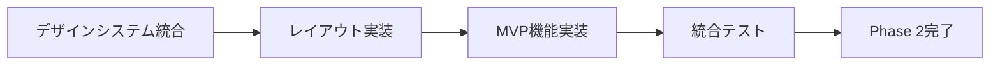

**統一デザインシステム（重複排除版）**:

### **Step 1: アプリアイコン・ロゴ作成**

**アイコン作成手順**:
```bash
# public/assets ディレクトリ作成
mkdir -p public/assets

# アイコンファイル配置（以下のいずれかの方法）
# 方法1: 既存ロゴがある場合
# logo.svg, logo.png を public/assets/ にコピー

# 方法2: 無料アイコン生成ツール使用
# - Canva (https://canva.com)
# - LogoMaker (https://logomaker.com)  
# - Flaticon (https://flaticon.com)
```

**推奨アイコンサイズ**:
- **SVGロゴ**: `logo.svg` (スケーラブル、推奨)
- **PNGアイコン**: `128x128px`, `256x256px`
- **ファビコン**: `favicon.ico` (32x32px)

**Code Apps登録時のロゴ指定**:
```bash
# アイコン付きでCode Apps初期化（初回時のみ）
pac code init --displayName "My Code App" -l "./public/assets/logo.svg"

# 既存アプリのアイコン更新
pac code update -l "./public/assets/logo.svg"
```

### **Step 2: shadcn/ui + TailwindCSS 統合セットアップ**

```bash
# shadcn/ui初期化（TailwindCSS自動設定）
npx shadcn@latest init

# Power Apps 基本UIコンポーネント
npx shadcn@latest add button card input select table
```

### **Step 3: Power Apps 公式テーマ統合 (src/globals.css)**

```css
@tailwind base;
@tailwind components;
@tailwind utilities;

:root {
  /* Power Platform 公式カラーパレット */
  --power-blue: #4072B3;
  --power-blue-light: #6088C6;
  --power-blue-lighter: #AEC4E5;
  --power-red: #EB8686;
  --power-gray: #C0C0C0;
  
  /* shadcn/ui 統合テーマ */
  --background: 0 0% 100%;
  --foreground: 222.2 84% 4.9%;
  --primary: 210 40% 44%; /* Power Blue */
  --primary-foreground: 210 40% 98%;
}

.dark {
  --background: 222.2 84% 4.9%;
  --foreground: 210 40% 98%;
  --primary: 210 40% 60%;
}
```

### **Step 4: 統合レイアウトコンポーネント (src/components/Layout/MainLayout.tsx)**

```typescript
import { PowerProvider } from '../PowerProvider';
import { Button } from '@/components/ui/button';
import { Card } from '@/components/ui/card';

export default function MainLayout({ children }: { children: React.ReactNode }) {
  return (
    <PowerProvider>
      <div className="min-h-screen bg-background">
        <header className="border-b bg-primary/5 px-6 py-4">
          <div className="flex items-center gap-3">
            {/* アプリロゴ表示 */}
             {
                // SVGが見つからない場合、PNGにフォールバック
                (e.target as HTMLImageElement).src = "/assets/logo.png";
              }}
            />
            <h1 className="text-xl font-semibold text-primary">Power Apps Code App</h1>
          </div>
        </header>
        <main className="container mx-auto p-6">
          <Card className="p-6">{children}</Card>
        </main>
      </div>
    </PowerProvider>
  );
}
```

### **Step 5: App.tsx 最終統合**

```typescript
import MainLayout from './components/Layout/MainLayout';
import './globals.css';

export default function App() {
  return (
    <MainLayout>
      <div className="space-y-4">
        <h2 className="text-2xl font-bold">Welcome to Power Apps</h2>
        <p className="text-muted-foreground">統合デザインシステム完了</p>
      </div>
    </MainLayout>
  );
}
```

**統合エラーチェック**: `npm run build && npm run lint`

**次へ**: Phase 2 → Phase 3

#### **Phase 3: Power Apps環境からローカル実行**

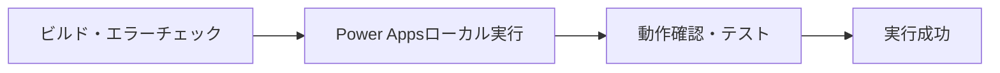

**統合実行コマンド**:

```bash
# ビルド・エラーチェック・ローカル実行を一括実行
npm run build && npm run lint && npm run dev
```

**次へ**: Phase 3 → Phase 4

#### **Phase 4: Power Apps環境へのデプロイ**

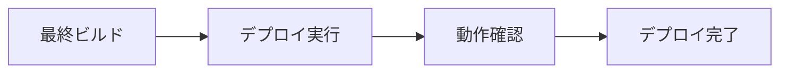

**統合デプロイコマンド**:

```bash
# 本番ビルド・デプロイ実行
npm run build && pac code push
```

**次へ**: Phase 4 → Phase 5

#### **Phase 5: 機能拡張・データソース統合**

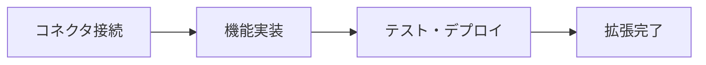

> **⚠️ 重要: SDK初期化とコネクター接続のタイミング**
> 
> DataverseやOffice 365コネクターなどに接続する場合、**Power Apps SDKの初期化が完了してから**コネクターに接続する必要があります。SDKの初期化前にコネクターを使用すると、認証エラーや接続エラーが発生する可能性があります。
>
> **❌ よくあるエラー:**
> ```
> Error fetching SystemUsers: PowerDataRuntimeError: An unknown error occurred: 
> PowerDataRuntime is not initialized. Please call initializeRuntime() first.
> ```
>
> このエラーは、**PowerDataRuntime（Power Apps SDK）が初期化される前に Dataverse テーブルにアクセスしようとした**場合に発生します。
>
> **✅ 正しい実装パターン:**
> ```typescript
> import { PowerProvider, usePowerPlatform } from '@microsoft/power-apps';
> import { useEffect, useState } from 'react';
> 
> export function App() {
>   const { isInitialized } = usePowerPlatform();
>   const [systemUsers, setSystemUsers] = useState([]);
>   const [error, setError] = useState<string | null>(null);
> 
>   useEffect(() => {
>     // ✅ SDK初期化完了後にDataverseテーブルを取得
>     if (!isInitialized) {
>       console.log('Power Apps SDK 初期化中...');
>       return; // 初期化が完了するまで何もしない
>     }
> 
>     // SDK初期化完了後にデータ取得
>     loadSystemUsers();
>   }, [isInitialized]);
> 
>   const loadSystemUsers = async () => {
>     try {
>       // Dataverse SystemUsers テーブルへのアクセス
>       const result = await SystemUsersService.getAll({ 
>         select: ['systemuserid', 'fullname', 'internalemailaddress'],
>         top: 50 
>       });
>       
>       if (result.isSuccess && result.value) {
>         setSystemUsers(result.value);
>       } else {
>         throw new Error('SystemUsers の取得に失敗しました');
>       }
>     } catch (err) {
>       console.error('Error fetching SystemUsers:', err);
>       setError(err.message);
>     }
>   };
> 
>   // ❌ 初期化前にコンポーネントをレンダリングしない
>   if (!isInitialized) {
>     return (
>       <div className="flex items-center justify-center h-screen">
>         <div className="text-center">
>           <div className="animate-spin rounded-full h-12 w-12 border-b-2 border-blue-600 mx-auto"></div>
>           <p className="mt-4 text-gray-600">Power Platform 初期化中...</p>
>         </div>
>       </div>
>     );
>   }
> 
>   if (error) {
>     return (
>       <div className="p-6">
>         <div className="bg-red-50 border border-red-200 rounded-lg p-4">
>           <h3 className="text-red-800 font-semibold">エラーが発生しました</h3>
>           <p className="text-red-600">{error}</p>
>         </div>
>       </div>
>     );
>   }
> 
>   return <YourApp systemUsers={systemUsers} />;
> }
> ```
>
> **主要なポイント:**
> - ✅ `usePowerPlatform().isInitialized` で初期化状態をチェック
> - ✅ `isInitialized === false` の間は Loading 表示
> - ✅ `isInitialized === true` になってから Dataverse テーブルにアクセス
> - ✅ `useEffect` の依存配列に `isInitialized` を含める
> - ❌ 初期化前に `SystemUsersService.getAll()` などを呼び出さない
>
> **カスタムフックでの実装例:**
> ```typescript
> // src/hooks/useSystemUsers.ts
> import { useState, useEffect, useCallback } from 'react';
> import { usePowerPlatform } from '@microsoft/power-apps';
> import { SystemUsersService } from '../generated/services/SystemUsersService';
> import type { SystemUsers } from '../generated/models/SystemUsersModel';
> 
> export const useSystemUsers = () => {
>   const { isInitialized } = usePowerPlatform();
>   const [users, setUsers] = useState<SystemUsers[]>([]);
>   const [loading, setLoading] = useState(true);
>   const [error, setError] = useState<string | null>(null);
> 
>   const loadUsers = useCallback(async () => {
>     // ❌ 初期化前は実行しない
>     if (!isInitialized) {
>       console.warn('SDK not initialized yet');
>       return;
>     }
> 
>     try {
>       setLoading(true);
>       setError(null);
>       
>       const result = await SystemUsersService.getAll({
>         select: ['systemuserid', 'fullname', 'internalemailaddress', 'isdisabled'],
>         filter: 'isdisabled eq false',
>         orderBy: 'fullname asc',
>         top: 100
>       });
>       
>       if (result.isSuccess && result.value) {
>         setUsers(result.value);
>       } else {
>         throw new Error('ユーザー一覧の取得に失敗しました');
>       }
>     } catch (err) {
>       const errorMessage = err instanceof Error ? err.message : 'Unknown error';
>       console.error('Error fetching SystemUsers:', err);
>       setError(errorMessage);
>     } finally {
>       setLoading(false);
>     }
>   }, [isInitialized]);
> 
>   // SDK初期化完了後に自動でデータ取得
>   useEffect(() => {
>     if (isInitialized) {
>       loadUsers();
>     }
>   }, [isInitialized, loadUsers]);
> 
>   return { users, loading, error, refetch: loadUsers, isInitialized };
> };
> ```
>
> **コンポーネントでの使用例:**
> ```typescript
> import { useSystemUsers } from '../hooks/useSystemUsers';
> 
> export function UsersPage() {
>   const { users, loading, error, isInitialized } = useSystemUsers();
> 
>   // SDK初期化中
>   if (!isInitialized) {
>     return <div>Power Platform 初期化中...</div>;
>   }
> 
>   // データ読み込み中
>   if (loading) {
>     return <div>ユーザー読み込み中...</div>;
>   }
> 
>   // エラー発生
>   if (error) {
>     return <div>エラー: {error}</div>;
>   }
> 
>   // データ表示
>   return (
>     <div>
>       <h1>システムユーザー ({users.length})</h1>
>       {users.map(user => (
>         <div key={user.systemuserid}>
>           {user.fullname} - {user.internalemailaddress}
>         </div>
>       ))}
>     </div>
>   );
> }
> ```

**統合データソース接続パターン**:

```typescript
// Office 365 + SQL Server 統合パターン
import { useConnectors } from '@microsoft/power-apps';

export function useIntegratedData() {
  const { office365Users, sqlConnector } = useConnectors();
  
  const fetchUserData = async (userId: string) => {
    const user = await office365Users.getUser(userId);
    const userData = await sqlConnector.query(`
      SELECT * FROM Users WHERE Email = '${user.mail}'
    `);
    return { ...user, ...userData[0] };
  };
  
  return { fetchUserData };
}
```

**次へ**: Phase 5 → 継続開発サイクル

---

## 📈 **統一された開発フロー概要**

**重複排除・一貫性確保済み**:
```
Phase 0: 環境準備 
    ↓ 統一AI提案
Phase 1: Vite+React+TypeScript+PowerProvider統合 
    ↓ 統一AI提案  
Phase 2: shadcn/ui+TailwindCSS統合デザインシステム
    ↓ 統一AI提案
Phase 3: Power Apps環境実行テスト
    ↓ 統一AI提案
Phase 4: 統合デプロイ
    ↓ 統一AI提案
Phase 5: データソース統合・機能拡張
    ↓ 継続開発サイクル
```

**統一エラーチェック**: `npm run build && npm run lint && npx tsc --noEmit`

### 🔍 **各フェーズ共通のエラーチェック・品質保証手順**

#### **Phase 3: データ統合・機能拡張時のエラーチェック**

```pwsh
# 1. データ接続エラーチェック
# コネクター接続状態確認
pac connector list

# 2. TypeScript型定義チェック  
# データモデルの型整合性確認
npx tsc --noEmit

# 3. 統合テスト実行
npm run test  # if configured
npm run build # 統合後のビルド確認

# 4. Power Platform接続テスト
# - コネクター動作確認
# - データ取得・更新テスト
# - 認証・権限確認
```

#### **Phase 4: 本格運用・最適化時の品質チェック**

```pwsh
# 1. 性能テスト
npm run build  # 最適化ビルド
npm run preview  # 本番環境シミュレーション

# 2. セキュリティチェック
npm audit  # 脆弱性チェック
npm audit fix  # 自動修正

# 3. コード品質チェック
npm run lint  # ESLint
npm run test  # ユニットテスト
npm run build  # 本番ビルド

# 4. デプロイ前最終チェック
pac code push --dry-run  # デプロイ前確認
pac code push  # 本番デプロイ
```

#### ✅ **全フェーズ共通チェックリスト**

## 🔍 **統合品質チェックリスト**

### 各フェーズ共通チェック項目

**統合エラーチェック**: `npm run build && npm run lint && npx tsc --noEmit`

- [ ] **コード品質**: TypeScript・ESLint・ビルドエラー 0件
- [ ] **Power Platform統合**: PowerProvider初期化・コネクター接続 正常  
- [ ] **動作確認**: ローカル実行・本番ビルド・デプロイ 成功

**AI品質提案**: *"全チェック項目クリア！次フェーズを開始しますか？"*

### 🤖 **AI ガイダンス システム設計**

各段階で以下の構造化された提案を行います：

#### **1. 現在の状態確認**
```typescript
interface DevelopmentState {
  currentPhase: 'setup' | 'mvp' | 'integration' | 'optimization';
  completedSteps: string[];
  availableActions: NextAction[];
  recommendedPath: 'beginner' | 'intermediate' | 'advanced';
}
```

#### **2. 次のアクション提案**
```typescript
interface NextAction {
  action: string;
  description: string;
  difficulty: 'easy' | 'medium' | 'hard';
  estimatedTime: string;
  prerequisites: string[];
  benefits: string[];
}
```

#### **3. 段階的ガイダンス例**

**MVP 段階:**
```json
{
  "message": "プロジェクト初期化が完了しました。",
  "nextActions": [
    {
      "action": "PowerProvider実装",
      "description": "Power Apps SDK初期化コンポーネントを実装",
      "difficulty": "easy",
      "estimatedTime": "15分",
      "command": "AI実装支援を開始しますか？"
    }
  ]
}
```

**データ統合段階:**
```json
{
  "message": "MVPが正常に動作しています。",
  "nextActions": [
    {
      "action": "Office 365 Users 統合",
      "description": "ユーザー情報取得・認証強化",
      "difficulty": "easy",
      "estimatedTime": "30分",
      "benefits": ["ユーザー管理", "プロファイル表示", "組織階層"]
    },
    {
      "action": "Dataverse 統合",
      "description": "データベース機能・CRUD操作",
      "difficulty": "medium", 
      "estimatedTime": "1-2時間",
      "benefits": ["データ永続化", "リレーション", "高度なクエリ"]
    },
    {
      "action": "Azure SQL 統合",
      "description": "外部データベース接続・複雑なクエリ",
      "difficulty": "hard",
      "estimatedTime": "2-4時間",
      "benefits": ["既存システム統合", "高性能クエリ", "ストアドプロシージャ"]
    }
  ]
}
```

### 📋 **実装推奨順序 (新フェーズ構成版)**
0. **Phase 0: 環境準備** → *"開発環境をセットアップしました。プロジェクト作成を開始しますか？"*
1. **Phase 1: プロジェクト作成・PowerProvider実装** → *"PowerProvider実装完了！🔍エラーチェックを実行しますか？"*
2. **Phase 1 エラーチェック** → *"エラーなし！MVP構築を開始しますか？"*
3. **Phase 2: MVP構築** → *"MVP機能実装完了！🔍ビルド・エラーチェックを実行しますか？"*
4. **Phase 2 エラーチェック** → *"エラーなし！Power Apps環境でのローカル実行を開始しますか？"*
5. **Phase 3: Power Apps環境からローカル実行** → *"ローカル実行成功！🔍デプロイ準備をしますか？"*
6. **Phase 3 エラーチェック** → *"エラーなし！Power Apps環境へのデプロイを実行しますか？"*
7. **Phase 4: Power Apps環境へのデプロイ** → *"デプロイ完了！🔍未実装機能をREADME.mdに記載しますか？"*
8. **Phase 4 完了処理** → *"未実装機能記載完了！機能拡張を開始しますか？"*
9. **Phase 5: 機能拡張** → *"データソース接続完了！未実装機能の開発提案をしますか？"*
10. **継続的開発** → *"機能拡張完了！次の開発サイクルを開始しますか？"*

> **重要**: 各段階でAIが開発者のスキルレベルと時間制約に応じて最適な次のステップを提案し、効率的な開発を支援します。

## 目次

### 🤖 AI ガイド付き開発フロー
- [段階的開発アプローチ](#段階的開発フロー-ai-ガイド付き)
- [AIガイダンスシステム](#ai-ガイダンス-システム設計)
- [開発状態管理](#開発状態とアクション提案)

### 📋 Code Apps 開発フロー

0. [Phase 0: 環境準備](#phase-0-環境準備)
1. [Phase 1: プロジェクト環境構築・PowerProvider・SDK初期化](#phase-1-プロジェクト環境構築powerproviderSDK初期化)
2. [Phase 2: MVP構築](#phase-2-mvp構築)
3. [Phase 3: Power Apps環境からローカル実行](#phase-3-power-apps環境からローカル実行)
4. [Phase 4: Power Apps環境へのデプロイ](#phase-4-power-apps環境へのデプロイ)
5. [Phase 5: 機能拡張](#phase-5-機能拡張)

## 前提条件 (Microsoft 公式要件)

### 開発環境の準備

**必須開発ツール:**
- ✅ [Visual Studio Code](https://code.visualstudio.com/)
- ✅ [Node.js](https://nodejs.org/) (LTS版)
- ✅ [Git](https://git-scm.com/)
- ✅ [Power Platform CLI](https://learn.microsoft.com/en-us/power-platform/developer/cli/introduction)

> **重要**: これらの開発ツールはコマンドラインで利用可能である必要があります

### Power Platform 環境設定

**1. Code Apps 機能の有効化**
```bash
# Power Platform 管理センター (admin.powerplatform.microsoft.com) で実行:
1. 管理 → 環境 → 対象環境を選択
2. 設定 → 製品 → 機能 → "Power Apps code apps"
3. "Code Apps を有効にする" トグルをオンに設定
4. 保存
```

**2. エンドユーザーライセンス要件**
- **必須**: [Power Apps Premium ライセンス](https://www.microsoft.com/power-platform/products/power-apps/pricing)
- Code Apps を実行するすべてのエンドユーザーにライセンスが必要

**3. 管理者権限の確認**
- Power Platform 管理者または環境管理者権限
- 環境設定変更とコネクション作成権限
- グループとルールに基づくアクセス制御設定

---

## ⚡ Power Apps Code Apps 統合

### Power Apps Code Apps プラットフォーム概要 (Microsoft 公式)

**Power Apps Code Apps** は、Visual Studio Code 等の統合開発環境でWebアプリを構築するすべてのスキルレベルの開発者が、管理プラットフォーム上で効率的にビジネスアプリを構築・実行できるように設計されたプラットフォームです。React、Vue などのポピュラーなフレームワークを使用し、UI とロジックの完全な制御を保持できます。

#### 🚀 **主要機能**
- **Microsoft Entra 認証・認可**: 自動セキュリティ管理
- **1,500+ コネクター**: Power Platform データソースへの JavaScript から直接アクセス
- **簡単公開・ホスティング**: Power Platform での基幹業務Webアプリ配布
- **管理ポリシー準拠**: アプリ共有制限、条件付きアクセス、データ損失防止など
- **ALM 簡素化**: デプロイと応用ライフサイクル管理

#### 🎯 **開発・実行フロー**
1. **ローカル開発**: Visual Studio Code で React/Vue アプリ開発
2. **Power Platform統合**: `@microsoft/power-apps` SDK でプラットフォーム機能統合
3. **本番デプロイ**: 専用本番環境への安全で迅速な配布

> **重要**: これは PCF コンポーネント開発ではありません。本格的なWebアプリケーションを **Power Apps Code Apps** として構築・公開する開発プラットフォームです。

---

## 🚀 開発状態とアクション提案

この標準では、開発の各段階でAIが適切な次のアクションを提案し、効率的な開発をガイドします：

### **段階別ガイダンス フローチャート**

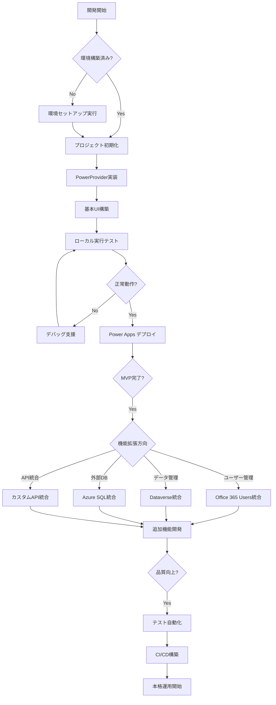

---

## Phase 0: 環境準備

### 📋 必須環境のセットアップ

FluentSampleを参考にした確実な環境構築手順：

#### 1. 開発ツールのインストール
```pwsh
# Visual Studio Code + Power Platform Tools拡張機能
winget install Microsoft.VisualStudioCode
# VS Code起動後、拡張機能で「Power Platform Tools」をインストール

# Node.js (LTS版) + npm
winget install OpenJS.NodeJS.LTS

# Git for Windows
winget install Git.Git

# Power Apps CLI
dotnet tool install --global Microsoft.PowerApps.CLI.Tool
```

#### 2. Power Platform環境の確認
- **Power Apps環境（Code Apps有効化済み）**の準備
- **Power Apps Premium ライセンス**の確認
- **環境管理者権限**の確認

#### 3. VS Code設定
```bash
# Power Platformパネルを開く
# View → Command Palette → "Power Platform"
# Power Platformアカウントにログイン
# Code Apps有効な環境を選択・確認
```

#### 4. 環境準備完了チェック
- [ ] VS Code + Power Platform Tools拡張機能
- [ ] Node.js (LTS) + npm
- [ ] Git
- [ ] Power Apps CLI (`pac` コマンド実行可能)
- [ ] Power Platform認証済み
- [ ] Code Apps環境選択済み

### 🎯 AI提案例
- *"開発環境をセットアップしました。Power Platform環境に接続できていますか？"*
- *"環境準備が完了しました。MVPの開発を開始しますか？"*

---

---

#### 1. プロジェクト作成・初期化
```pwsh
# サンプルプロジェクトの取得
git clone https://github.com/microsoft/PowerAppsCodeApps.git
cd PowerAppsCodeApps/samples/FluentSample
code .
```

#### 2. 依存関係インストール・ビルド
```pwsh
npm install
npm run build
```
**重要**: 必ず`npm run build`を実行してプロジェクトが正常にコンパイルされることを確認

**package.json のスクリプト設定確認:**
```json
{
  "scripts": {
    "dev": "start vite && start pac code run",  // 重要: 自動でPAC Code Runを起動
    "build": "vite build",
    "build:dev": "vite build --mode development",
    "lint": "eslint .",
    "preview": "vite preview"
  }
}
```

#### 3. vite.config.ts の設定確認
```typescript
import { defineConfig } from "vite";
import react from "@vitejs/plugin-react-swc";
import path from "path";

export default defineConfig({
  base: "./",  // 重要: Power Apps デプロイのための相対パス設定
  server: {
    host: "::",
    port: 3000,
  },
  plugins: [react()],
  resolve: {
    alias: {
      "@": path.resolve(__dirname, "./src"),
    },
  },
});
```

#### 4. PowerProvider.tsx実装
```typescript
// PowerProvider.tsx - Power Apps SDK初期化の基盤
import { initialize } from "@microsoft/power-apps/app";
import { useEffect, type ReactNode } from "react";

interface PowerProviderProps {
    children: ReactNode;
}

export default function PowerProvider({ children }: PowerProviderProps) {
    useEffect(() => {
        const initApp = async () => {
            try {
                await initialize();
                console.log('Power Platform SDK initialized successfully');
            } catch (error) {
                console.error('Failed to initialize Power Platform SDK:', error);
            }
        };
        
        initApp();
    }, []);

    return <>{children}</>;
}
```

**main.tsx での使用方法:**
```typescript
import { createRoot } from 'react-dom/client';
import App from './App.tsx';
import './index.css';
import { StrictMode } from 'react';
import PowerProvider from './PowerProvider.tsx';

createRoot(document.getElementById("root")!).render(
  <StrictMode>
    <PowerProvider>
      <App />
    </PowerProvider>
  </StrictMode>
);
```

#### 5. Power Apps Code統合初期化
```pwsh
pac code init
```
Power Apps SDKの初期化により、ローカル開発とPower Platform統合を可能にする

### 🔧 PowerProvider設計ガイドライン

#### 絶対に守るべきルール
1. **PowerProvider.tsxは変更禁止**
   - `initialize()`関数による非同期SDK初期化パターンを保持
   - エラーハンドリング構造は変更しない
   - 構造変更・追加ロジックは禁止

2. **SDK初期化パターン**
   ```typescript
   // 必須パターン: 非同期初期化
   useEffect(() => {
       const initApp = async () => {
           try {
               await initialize();
               console.log('Power Platform SDK initialized successfully');
           } catch (error) {
               console.error('Failed to initialize Power Platform SDK:', error);
           }
       };
       
       initApp();
   }, []);
   ```

3. **コネクター実装パターン**
   ```typescript
   // 開発時: mockDataで開発
   import { mockUsers, mockCalendarEvents } from '../mockData/office365Data';
   
   // ⚠️ 注意: 以下の useConnector パターンは古い方法です
   // 本番時は Phase 3 で説明する自動生成サービスクラスを使用してください
   // 例: Office365UsersService.MyProfile_V2() など
   import { useConnector } from '@microsoft/power-apps';
   const office365 = useConnector('office365users'); // ❌ 非推奨
   const sqlConnector = useConnector('sql'); // ❌ 非推奨
   
   // ✅ 推奨: Phase 3 で説明する自動生成サービスクラス
   // import { Office365UsersService } from '../generated/services/Office365UsersService';
   // const result = await Office365UsersService.MyProfile_V2();
   ```

4. **型定義の厳密管理**
   ```typescript
   interface Office365User {
     id: string;
     displayName: string;
     mail: string;
     // 公式ドキュメントに準拠した型定義
   }
   ```

### 🎯 AI提案例
- *"プロジェクトを作成しました。PowerProviderを実装しますか？"*
- *"PowerProvider.tsxを実装しました。Power Apps統合を初期化しますか？"*
- *"基盤の準備が完了しました。エラーチェックを実行しますか？"*

### 🔍 Phase 1 完了時のエラーチェック・修正手順

#### 1. TypeScript エラーチェック
```pwsh
# TypeScript コンパイルエラーの確認
npx tsc --noEmit

# エラーがある場合の対処
# - 型定義の不整合を修正
# - import文の確認
# - PowerProvider.tsxの型定義確認
```

#### 2. ESLint チェック
```pwsh
# コード品質・構文エラーの確認
npm run lint

# 自動修正可能なエラーの修正
npm run lint -- --fix
```

#### 3. ビルドエラーチェック
```pwsh
# 本番ビルドでのエラー確認
npm run build

# 開発モードビルドでのエラー確認
npm run build:dev
```

#### 4. VS Code エラーパネルの確認
- **Problems パネル**でエラー・警告を確認
- **PowerProvider.tsx**の赤線エラーを解消
- **vite.config.ts**の設定エラーを修正

#### ✅ Phase 1 完了チェックリスト
- [ ] TypeScript エラー: 0件
- [ ] ESLint エラー: 0件  
- [ ] ビルドエラー: 0件
- [ ] VS Code Problems パネル: エラーなし
- [ ] `pac code init` 正常完了
- [ ] PowerProvider.tsx 正常動作

**AI提案**: *"Phase 1のエラーチェックが完了しました。すべて正常でしたらMVP開発を開始しますか？"*

---

## Phase 2: MVP構築

### 🚀 要件に基づいたMVP機能実装・ビルド・エラーチェック・ローカル実行

**重要**: PowerProviderやPower Appsとの接続部分のソースコードは変更せず、MVP機能部分のみを実装する

#### 1. MVP機能実装
- **要件に基づいた設計**に従ってMVP機能を実装
- **PowerProvider.tsxは変更しない**（接続部分保護）
- **Power Apps接続部分は変更しない**（統合部分保護）
- UI コンポーネント・ビジネスロジックのみ実装

#### 2. ビルド実行
```pwsh
npm run build
```
- TypeScript コンパイル確認
- Vite ビルド成功確認

#### 3. 全ファイルの警告・エラーチェック・修正
```pwsh
# TypeScript エラーチェック
npx tsc --noEmit

# ESLint チェック・自動修正
npm run lint
npm run lint -- --fix

# VS Code Problems パネル確認
```

#### 4. Power Apps ローカル実行
```pwsh
npm run dev
```
- Vite devサーバーとPAC Code Runが自動起動
- ブラウザで`http://localhost:3000`にアクセス  
- MVP機能の正常動作を確認

### 🎯 AI提案例
- *"MVP機能を実装しました。ビルド・エラーチェックを実行しますか？"*
- *"エラーチェック完了しました。Power Appsローカル実行を開始しますか？"*
- *"MVP構築が完了しました。Phase 3に進みますか？"*

---

## Phase 3: Power Apps環境からローカル実行

### 🚀 ビルド・エラーチェック・Power Appsローカル実行

#### 1. ビルド実行
```pwsh
npm run build
```

#### 2. 全ファイルの警告・エラーチェック・修正
```pwsh
# 統合エラーチェック
npx tsc --noEmit
npm run lint -- --fix

# VS Code Problems パネル確認
```

#### 3. Power Apps ローカル実行・動作確認
```pwsh
npm run dev
```
- Power Platform SDK との統合確認
- MVP機能の動作確認
- エラーログ確認

### 🎯 AI提案例
- *"Power Apps環境でのローカル実行が成功しました。デプロイ準備をしますか？"*

---

## Phase 4: Power Apps環境へのデプロイ

### 🚀 ビルド・エラーチェック・デプロイ・未実装機能記載

#### 1. ビルド実行
```pwsh
npm run build
```

#### 2. 全ファイルの警告・エラーチェック・修正
```pwsh
# 最終エラーチェック
npx tsc --noEmit
npm run lint
npm run build  # 本番ビルド確認
```

#### 3. デプロイ実行
```pwsh
pac code push
```

#### 4. 未実装機能のREADME.md記載
- MVP完了機能の文書化
- 未実装機能リストの作成
- 今後の開発方針の記載

### 🎯 AI提案例
- *"デプロイが完了しました。未実装機能をREADME.mdに記載しますか？"*

---

## Phase 5: 機能拡張

### 🚀 データソース接続・未実装機能開発・ユーザー提案

## 📊 **Power Apps SDK データソース接続 完全ガイド**

> **⚠️ 重要原則**: Power Apps Code Apps では、**必ず Power Apps SDK 経由で自動生成されたサービスクラス**を使用します。これにより Power Apps のユーザー認証とセキュリティが保証されます。

### **❌ 使用禁止の接続方法**

以下の接続方法は**絶対に使用しないでください**:

- ❌ **Dataverse Web API (fetch)** - CORS制限、認証問題
- ❌ **Xrm.WebApi** - Model-driven Apps専用、Code Appsでは動作しない
- ❌ **Power Fx 評価** - Canvas Apps環境専用
- ❌ **直接REST API** - 認証とセキュリティの問題
- ❌ **useConnector フック** - 非推奨パターン

### **✅ 唯一の正しいアプローチ: Power Apps SDK**

Power Apps SDK を使用することで、以下が自動的に処理されます:
- ✅ **ユーザー認証** - Power Apps のユーザーコンテキストで実行
- ✅ **セキュリティ** - ロールベースアクセス制御 (RBAC)
- ✅ **接続管理** - 接続プールと再利用
- ✅ **エラーハンドリング** - 標準化されたエラーレスポンス
- ✅ **型安全性** - TypeScript型定義の自動生成

---

## **📋 手順概要**

データソース接続は以下の7ステップで実施します:

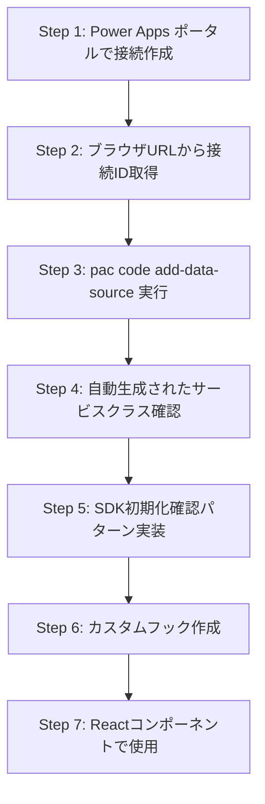

### **クイックスタート例**

**Office 365 Users コネクター:**
```bash
# Step 1-2: Power Apps ポータルで接続作成 → 接続ID取得
# Step 3: サービスクラス生成
pac code add-data-source -a "shared_office365users" -c "{接続ID}"

# Step 4-5: 生成されたファイル確認
# src/generated/services/Office365UsersService.ts
# src/generated/models/Office365UsersModel.ts
```

**Dataverse (SystemUsers):**
```bash
# Step 3: SystemUsers テーブル追加
pac code add-data-source -a "shared_commondataserviceforapps" -c "{接続ID}" -t "systemusers"

# Step 4-5: 生成されたファイル確認
# src/generated/services/SystemusersService.ts
# src/generated/models/SystemusersModel.ts
```

**使用例 (Step 6-7):**
```typescript
import { usePowerPlatform } from '@microsoft/power-apps';
import { SystemUsersService } from '../generated/services/SystemUsersService';

export function UsersPage() {
  const { isInitialized } = usePowerPlatform();
  const [users, setUsers] = useState([]);

  useEffect(() => {
    if (!isInitialized) return; // SDK初期化待機
    
    const loadUsers = async () => {
      const result = await SystemUsersService.getAll();
      if (result.isSuccess && result.value) {
        setUsers(result.value);
      }
    };
    loadUsers();
  }, [isInitialized]);

  if (!isInitialized) return <div>初期化中...</div>;
  return <div>{/* データ表示 */}</div>;
}
```

---

## **📋 詳細手順 (トラブルシューティング含む)**

### **Step 1: 接続の手動作成 (Power Apps ポータル)**

すべてのコネクターは、まず Power Apps ポータルで手動作成する必要があります。

**手順:**

1. **Power Apps Maker Portal にアクセス**
   ```
   https://make.powerapps.com
   ```

2. **環境を選択**
   - 画面右上で適切な環境を選択

3. **接続を作成**
   - 左メニュー: **データ** > **接続**
   - **+ 新しい接続** をクリック
   - 必要なコネクターを検索・選択:
     * **Microsoft Dataverse**
     * **Office 365 Users**
     * **SharePoint**
     * **SQL Server**
     * その他

4. **認証を完了**
   - コネクターごとの認証方法に従って認証
   - Dataverse: 自動認証
   - Office 365: Microsoft アカウントでサインイン
   - SQL Server: 接続文字列または Windows 認証

5. **接続の確認**
   - 接続一覧で「接続済み」ステータスを確認

**🔧 トラブルシューティング:**

| 問題 | 原因 | 対策 |
|------|------|------|
| 「接続できません」エラー | 認証情報が無効 | 認証をやり直す |
| 接続が一覧に表示されない | 環境が異なる | 正しい環境を選択 |
| 権限エラー | ユーザー権限不足 | 環境管理者に権限を依頼 |

---

### **Step 2: 接続ID の取得**

pac code add-data-source コマンドを実行するには、**接続ID** が必要です。

**手順:**

1. **Power Apps ポータルで接続一覧を表示**
   ```
   https://make.powerapps.com → データ → 接続
   ```

2. **対象の接続をクリック**
   - 例: 「Microsoft Dataverse」をクリック

3. **ブラウザのアドレスバーのURLを確認**

   **URL形式:**
   ```
   https://make.powerapps.com/environments/{環境ID}/connections/{API名}/{接続ID}/details
   ```

   **実際の例:**
   ```
   https://make.powerapps.com/environments/12345678-abcd-1234-efgh-123456789abc/connections/shared_commondataserviceforapps/a1b2c3d4-e5f6-7890-1234-567890abcdef/details
   ```

4. **接続ID をコピー**
   - 上記URLの場合: `a1b2c3d4-e5f6-7890-1234-567890abcdef`

**コネクター別の API 名:**

| コネクター | API 名 |
|-----------|--------|
| Microsoft Dataverse | `shared_commondataserviceforapps` |
| Office 365 Users | `shared_office365users` |
| SharePoint | `shared_sharepointonline` |
| SQL Server | `shared_sql` |
| Office 365 Outlook | `shared_office365` |

**🔧 トラブルシューティング:**

| 問題 | 原因 | 対策 |
|------|------|------|
| URLに接続IDが表示されない | 古いポータルUI | ブラウザを更新、別の接続をクリックして戻る |
| 接続IDをコピーできない | ブラウザの問題 | URLを手動で選択してコピー |

---

### **Step 3: pac code add-data-source コマンド実行**

**基本コマンド構文:**

```bash
pac code add-data-source -a "{API名}" -c "{接続ID}" [-t "{テーブル名}"]
```

**パラメータ:**
- `-a` (--api): コネクターのAPI名
- `-c` (--connection-id): 接続ID (Step 2で取得)
- `-t` (--table): テーブル名 (Dataverseの場合のみ必須)

**Office 365 Users の例:**

```bash
# Office 365 Users サービスクラスを生成
pac code add-data-source -a "shared_office365users" -c "a1b2c3d4-e5f6-7890-1234-567890abcdef"
```

**生成されるファイル:**
```
src/generated/services/Office365UsersService.ts
src/generated/models/Office365UsersModel.ts
```

**自動生成されるメソッド:**
- `MyProfile_V2()` - 現在のユーザープロファイル
- `UserProfile_V2(id)` - 特定ユーザーのプロファイル
- `SearchUserV2(searchTerm)` - ユーザー検索
- `Manager_V2(id)` - マネージャー情報
- `DirectReports_V2(id)` - 直属の部下

### **3.3 Dataverse: SystemUsers テーブル**

```bash
# SystemUsers テーブルのサービスクラスを生成
pac code add-data-source -a "shared_commondataserviceforapps" -c "a1b2c3d4-e5f6-7890-1234-567890abcdef" -t "systemusers"
```

**生成されるファイル:**
```
src/generated/services/SystemusersService.ts
src/generated/models/SystemusersModel.ts
```

**自動生成されるメソッド:**
- `getAll(options)` - ODataクエリで取得
- `get(id)` - IDで1件取得
- `create(data)` - 新規作成
- `update(id, data)` - 更新
- `delete(id)` - 削除

### **3.4 Dataverse: 複数の標準テーブル**

```bash
# 環境変数に接続IDを設定 (PowerShell)
$connectionId = "a1b2c3d4-e5f6-7890-1234-567890abcdef"

# SystemUsers (システムユーザー)
pac code add-data-source -a "shared_commondataserviceforapps" -c $connectionId -t "systemusers"

# Accounts (取引先企業)
pac code add-data-source -a "shared_commondataserviceforapps" -c $connectionId -t "accounts"

# Contacts (取引先担当者)
pac code add-data-source -a "shared_commondataserviceforapps" -c $connectionId -t "contacts"

# Tasks (タスク)
pac code add-data-source -a "shared_commondataserviceforapps" -c $connectionId -t "tasks"

# カスタムテーブル (例: geek_project_task)
pac code add-data-source -a "shared_commondataserviceforapps" -c $connectionId -t "geek_project_task"
```

**生成されるサービスクラス名規則:**
- テーブル論理名: `geek_project_task`
- サービスクラス: `Geek_project_tasksService` (先頭大文字、末尾にs追加)

**🔧 トラブルシューティング:**

| 問題 | 原因 | 対策 |
|------|------|------|
| `Connection not found` | 接続IDが無効 | Step 2で接続IDを再確認 |
| `Table not found` | テーブル論理名が間違い | 小文字・アンダースコア区切りを確認 |
| `Authentication failed` | pac認証が期限切れ | `pac auth create` で再認証 |
| ファイルが生成されない | コマンド実行エラー | エラーメッセージを確認 |

---

### **Step 4: 自動生成されたサービスクラスの確認**

pac code add-data-source 実行後、以下のファイルが自動生成されます。

**生成されるファイル構造:**

```
src/
  generated/
    services/
      Office365UsersService.ts        # Office 365 Users
      SystemusersService.ts            # Dataverse: SystemUsers
      AccountsService.ts               # Dataverse: Accounts
      Geek_project_tasksService.ts     # カスタムテーブル
    models/
      Office365UsersModel.ts
      SystemusersModel.ts
      AccountsModel.ts
      Geek_project_tasksModel.ts
```

**サービスクラスの基本構造 (例: Office365UsersService):**

```typescript
export class Office365UsersService {
  private static readonly dataSourceName = 'office365users';
  private static readonly client = getClient(dataSourcesInfo);

  public static async MyProfile_V2($select?: string): Promise<IOperationResult<GraphUser_V1>> {
    const params: { $select?: string } = { $select };
    const result = await Office365UsersService.client.executeAsync<{ $select?: string }, GraphUser_V1>({
      connectorOperation: {
        tableName: Office365UsersService.dataSourceName,
        operationName: 'MyProfile_V2',
        parameters: params
      },
    });
    return result;
  }
  // ... その他のメソッド
}
```

**重要なポイント:**
- ✅ すべてのメソッドが `static` (インスタンス化不要)
- ✅ `IOperationResult<T>` で統一されたレスポンス型
- ✅ TypeScript型定義が自動生成
- ✅ Power Apps SDK の `getClient()` を使用

**🔧 トラブルシューティング:**

| 問題 | 原因 | 対策 |
|------|------|------|
| 生成されたファイルが見つからない | コマンド実行失敗 | エラーメッセージを確認 |
| TypeScriptエラーが出る | 型定義の不一致 | `npm run build` でビルドエラーを確認 |
| メソッドが見つからない | コネクターバージョン違い | 生成されたファイルを直接確認 |

---

### **Step 5: PowerDataRuntime 初期化確認パターン実装**

**⚠️ 重要:** Power Apps SDK を使用する前に、**必ず PowerDataRuntime の初期化完了を確認**してください。

**基本パターン:**

```typescript
import { usePowerPlatform } from '@microsoft/power-apps';
import { SystemUsersService } from '../generated/services/SystemUsersService';

export function DataPage() {
  const { isInitialized } = usePowerPlatform();
  const [users, setUsers] = useState([]);

  useEffect(() => {
    // ❌ 初期化前にアクセスするとエラー
    if (!isInitialized) {
      console.log('SDK not initialized, waiting...');
      return;
    }

    // ✅ 初期化後にデータ取得
    const loadUsers = async () => {
      const result = await SystemUsersService.getAll();
      if (result.isSuccess && result.value) {
        setUsers(result.value);
      }
    };
    loadUsers();
  }, [isInitialized]); // 依存配列に isInitialized を含める

  // ローディング表示
  if (!isInitialized) {
    return <div>Power Apps SDK 初期化中...</div>;
  }

  return <div>{/* データ表示 */}</div>;
}
```

**PowerProvider の設定確認:**

```typescript
// src/main.tsx
import { PowerProvider } from '@microsoft/power-apps';

ReactDOM.createRoot(document.getElementById('root')!).render(
  <PowerProvider>  {/* ← 必須 */}
    <App />
  </PowerProvider>
);
```

**🔧 トラブルシューティング:**

| エラーメッセージ | 原因 | 対策 |
|----------------|------|------|
| `PowerDataRuntime is not initialized` | SDK未初期化 | `usePowerPlatform().isInitialized` を確認 |
| `PowerProvider not found` | PowerProvider未設定 | main.tsx で PowerProvider を追加 |
| 初期化が完了しない | `pac code run` 未実行 | `pac code run` でアプリを起動 |

**初期化確認のデバッグ:**

```typescript
const { isInitialized } = usePowerPlatform();

useEffect(() => {
  console.log('SDK初期化状態:', isInitialized);
}, [isInitialized]);

// npm run dev → isInitialized: false (Power Platform統合なし)
// pac code run → isInitialized: true (Power Platform統合あり)
```

---

### **Step 6: カスタムフック作成**

ビジネスロジックをカスタムフックにカプセル化します。

**Office 365 Users カスタムフック:**

```typescript
// src/hooks/useOffice365Users.ts
import { useState, useCallback } from 'react';
import { usePowerPlatform } from '@microsoft/power-apps';
import { Office365UsersService } from '../generated/services/Office365UsersService';
import type { GraphUser_V1 } from '../generated/models/Office365UsersModel';

export const useOffice365Users = () => {
  const { isInitialized } = usePowerPlatform();
  const [loading, setLoading] = useState(false);
  const [error, setError] = useState<string | null>(null);

  // 現在のユーザープロファイル取得
  const getMyProfile = useCallback(async () => {
    if (!isInitialized) throw new Error('SDK not initialized');
    
    try {
      setLoading(true);
      const result = await Office365UsersService.MyProfile_V2();
      
      if (result.isSuccess && result.value) {
        return result.value;
      } else {
        throw new Error('プロファイル取得に失敗しました');
      }
    } catch (err) {
      const errorMessage = err instanceof Error ? err.message : 'Unknown error';
      setError(errorMessage);
      throw err;
    } finally {
      setLoading(false);
    }
  }, [isInitialized]);

  // ユーザー検索
  const searchUsers = useCallback(async (searchTerm: string, top: number = 10) => {
    if (!isInitialized) throw new Error('SDK not initialized');
    
    try {
      setLoading(true);
      const result = await Office365UsersService.SearchUserV2(searchTerm, top, false);
      
      if (result.isSuccess && result.value) {
        return result.value.value || [];
      } else {
        throw new Error('ユーザー検索に失敗しました');
      }
    } catch (err) {
      const errorMessage = err instanceof Error ? err.message : 'Unknown error';
      setError(errorMessage);
      throw err;
    } finally {
      setLoading(false);
    }
  }, [isInitialized]);

  return { getMyProfile, searchUsers, loading, error, isInitialized };
};
```

### **5.2 Dataverse: SystemUsers カスタムフック実装**

```typescript
// src/hooks/useSystemUsers.ts
import { useState, useEffect, useCallback } from 'react';
import { usePowerPlatform } from '@microsoft/power-apps';
import { SystemUsersService } from '../generated/services/SystemUsersService';

export const useSystemUsers = () => {
  const { isInitialized } = usePowerPlatform();
  const [users, setUsers] = useState([]);
  const [loading, setLoading] = useState(true);
  const [error, setError] = useState<string | null>(null);

  const fetchUsers = useCallback(async () => {
    if (!isInitialized) return;

    try {
      setLoading(true);
      const result = await SystemUsersService.getAll({
        select: ['systemuserid', 'fullname', 'internalemailaddress'],
        filter: 'isdisabled eq false',
        orderBy: 'fullname asc',
        top: 50
      });

      if (result.isSuccess && result.value) {
        setUsers(result.value);
      } else {
        throw new Error('ユーザー検索に失敗しました');
      }
    } catch (err) {
      const errorMessage = err instanceof Error ? err.message : 'Unknown error';
      setError(errorMessage);
      throw err;
    } finally {
      setLoading(false);
    }
  }, [isInitialized]);

  return { getMyProfile, searchUsers, loading, error, isInitialized };
};
```

**Dataverse: SystemUsers カスタムフック:**

```typescript
// src/hooks/useSystemUsers.ts
import { useState, useEffect, useCallback } from 'react';
import { usePowerPlatform } from '@microsoft/power-apps';
import { SystemUsersService } from '../generated/services/SystemUsersService';

export const useSystemUsers = () => {
  const { isInitialized } = usePowerPlatform();
  const [users, setUsers] = useState([]);
  const [loading, setLoading] = useState(true);
  const [error, setError] = useState<string | null>(null);

  const fetchUsers = useCallback(async () => {
    if (!isInitialized) return;

    try {
      setLoading(true);
      const result = await SystemUsersService.getAll({
        select: ['systemuserid', 'fullname', 'internalemailaddress'],
        filter: 'isdisabled eq false',
        orderBy: 'fullname asc',
        top: 50
      });

      if (result.isSuccess && result.value) {
        setUsers(result.value);
      } else {
        throw new Error('ユーザーの取得に失敗しました');
      }
    } catch (err) {
      const errorMessage = err instanceof Error ? err.message : 'Unknown error';
      setError(errorMessage);
    } finally {
      setLoading(false);
    }
  }, [isInitialized]);

  useEffect(() => {
    if (isInitialized) {
      fetchUsers();
    }
  }, [isInitialized, fetchUsers]);

  return { users, loading, error, refetch: fetchUsers, isInitialized };
};
```

---

### **Step 7: Reactコンポーネントでの使用**

カスタムフックを使用してReactコンポーネントを実装します。

**基本的な使用例:**

```typescript
// src/pages/UsersPage.tsx
import React from 'react';
import { useSystemUsers } from '../hooks/useSystemUsers';

export const UsersPage: React.FC = () => {
  const { users, loading, error, isInitialized } = useSystemUsers();

  if (!isInitialized) {
    return <div>Power Apps SDK 初期化中...</div>;
  }

  if (loading) {
    return <div>読み込み中...</div>;
  }

  if (error) {
    return <div>エラー: {error}</div>;
  }

  return (
    <div>
      <h1>システムユーザー ({users.length})</h1>
      {users.map(user => (
        <div key={user.systemuserid}>
          {user.fullname} - {user.internalemailaddress}
        </div>
      ))}
    </div>
  );
};
```

**🔧 トラブルシューティング:**

| 問題 | 原因 | 対策 |
|------|------|------|
| データが表示されない | `isInitialized` が false | `pac code run` で起動しているか確認 |
| エラーが表示される | サービスクラスのエラー | `result.isSuccess` を確認、エラーログを確認 |
| 型エラーが出る | 自動生成された型と不一致 | 生成されたModel.tsファイルを確認 |

---

## **📋 まとめ: データソース接続の完全フロー**

**7つのステップで完了:**

1. ✅ **Power Apps ポータルで接続作成** → 認証完了
2. ✅ **ブラウザURLから接続ID取得** → コピー
3. ✅ **pac code add-data-source 実行** → サービスクラス自動生成
4. ✅ **自動生成されたファイル確認** → src/generated/ 配下を確認
5. ✅ **PowerDataRuntime 初期化確認** → `isInitialized` チェック
6. ✅ **カスタムフック作成** → ビジネスロジックをカプセル化
7. ✅ **Reactコンポーネントで使用** → UI実装

**重要原則:**
- ✅ **Power Apps SDK 経由のみ使用** - ユーザー認証が自動処理
- ❌ **他の接続方法は使用禁止** - Web API、Power Fx、直接REST APIは使用しない
- ✅ **必ず isInitialized を確認** - 初期化前のアクセスはエラー
- ✅ **IOperationResult で結果確認** - `isSuccess` プロパティで成功/失敗を判定
- ✅ **カスタムフックでカプセル化** - 再利用可能なロジック実装

**実行コマンドまとめ:**

```bash
# 1. 認証 (初回のみ)
pac auth create

# 2. Office 365 Users 追加
pac code add-data-source -a "shared_office365users" -c "{接続ID}"

# 3. Dataverse テーブル追加
pac code add-data-source -a "shared_commondataserviceforapps" -c "{接続ID}" -t "systemusers"

# 4. アプリ実行 (Power Platform統合)
pac code run

# 5. ビルド
npm run build

# 6. デプロイ
pac code push
```

---

### **未実装機能開発・ユーザー提案**        $value = $option.SelectSingleNode("c:Value", $ns).'#text'
        $label = $option.SelectSingleNode(".//c:Label[@languagecode='1033']", $ns).'#text'
        Write-Host "    $value : $label"
    }
}
```

**実行:**
```powershell
.\Extract-DataverseChoices.ps1 -XmlPath "customizations.xml" -EntityName "geek_project_task"
```

**出力例:**
```
=== geek_project_task スキーマ情報 ===
  - geek_project_taskid (uniqueidentifier)
  - geek_name (string)
  - geek_priority (picklist)
  - geek_status (picklist)

  Choice: geek_priority
    0 : Critical
    1 : High
    2 : Medium
    3 : Low

  Choice: geek_status
    0 : Completed
    1 : InProgress
    2 : NotStarted
```

### **6.2 TypeScript スキーマ定義の作成**

```typescript
// src/types/dataverse.ts

/**
 * geek_project_task テーブル
 * 
 * スキーマ名規則:
 * - テーブル論理名: geek_project_task (小文字、アンダースコア)
 * - 主キー: geek_project_taskid
 * - 属性プレフィックス: geek_
 */

// Choice値の定義
export enum TaskPriority {
  Critical = 0,
  High = 1,
  Medium = 2,
  Low = 3
}

export enum TaskStatus {
  Completed = 0,
  InProgress = 1,
  NotStarted = 2
}

// テーブル型定義
export interface ProjectTask {
  geek_project_taskid?: string;  // 主キー
  geek_name: string;              // 必須: タスク名
  geek_priority: TaskPriority;    // Choice
  geek_status: TaskStatus;        // Choice
  geek_description?: string;      // オプション
  geek_duedate?: Date;            // オプション
}

// 作成リクエスト型
export interface CreateProjectTaskRequest {
  geek_name: string;
  geek_priority: TaskPriority;
  geek_status: TaskStatus;
  geek_description?: string;
  geek_duedate?: string; // ISO 8601形式
}

// 更新リクエスト型
export interface UpdateProjectTaskRequest {
  geek_name?: string;
  geek_priority?: TaskPriority;
  geek_status?: TaskStatus;
  geek_description?: string;
  geek_duedate?: string;
}
```

### **6.3 カスタムテーブル用カスタムフック**

```typescript
// src/hooks/useProjectTasks.ts
import { useState, useEffect, useCallback } from 'react';
import { usePowerPlatform } from '@microsoft/power-apps';
import { Geek_project_tasksService } from '../generated/services/Geek_project_tasksService';
import type { ProjectTask, CreateProjectTaskRequest, UpdateProjectTaskRequest } from '../types/dataverse';

export const useProjectTasks = () => {
  const { isInitialized } = usePowerPlatform();
  const [tasks, setTasks] = useState<ProjectTask[]>([]);
  const [loading, setLoading] = useState(true);
  const [error, setError] = useState<string | null>(null);

  // 全タスク取得
  const getAllTasks = useCallback(async () => {
    if (!isInitialized) return;

    try {
      setLoading(true);
      const result = await Geek_project_tasksService.getAll({
        select: ['geek_project_taskid', 'geek_name', 'geek_priority', 'geek_status', 'geek_duedate'],
        orderBy: 'geek_duedate asc',
        top: 100
      });

      if (result.isSuccess && result.value) {
        setTasks(result.value);
      } else {
        throw new Error('タスクの取得に失敗しました');
      }
    } catch (err) {
      const errorMessage = err instanceof Error ? err.message : 'Unknown error';
      setError(errorMessage);
    } finally {
      setLoading(false);
    }
  }, [isInitialized]);

  // タスク作成
  const createTask = useCallback(async (taskData: CreateProjectTaskRequest) => {
    if (!isInitialized) throw new Error('SDK not initialized');

    try {
      setLoading(true);
      const result = await Geek_project_tasksService.create(taskData);

      if (result.isSuccess && result.value) {
        await getAllTasks(); // 一覧を再取得
        return result.value;
      } else {
        throw new Error('タスクの作成に失敗しました');
      }
    } catch (err) {
      const errorMessage = err instanceof Error ? err.message : 'Unknown error';
      setError(errorMessage);
      throw err;
    } finally {
      setLoading(false);
    }
  }, [isInitialized, getAllTasks]);

  // タスク更新
  const updateTask = useCallback(async (taskId: string, taskData: UpdateProjectTaskRequest) => {
    if (!isInitialized) throw new Error('SDK not initialized');

    try {
      setLoading(true);
      const result = await Geek_project_tasksService.update(taskId, taskData);

      if (result.isSuccess && result.value) {
        await getAllTasks(); // 一覧を再取得
        return result.value;
      } else {
        throw new Error('タスクの更新に失敗しました');
      }
    } catch (err) {
      const errorMessage = err instanceof Error ? err.message : 'Unknown error';
      setError(errorMessage);
      throw err;
    } finally {
      setLoading(false);
    }
  }, [isInitialized, getAllTasks]);

  // タスク削除
  const deleteTask = useCallback(async (taskId: string) => {
    if (!isInitialized) throw new Error('SDK not initialized');

    try {
      setLoading(true);
      const result = await Geek_project_tasksService.delete(taskId);

      if (result.isSuccess) {
        await getAllTasks(); // 一覧を再取得
      } else {
        throw new Error('タスクの削除に失敗しました');
      }
    } catch (err) {
      const errorMessage = err instanceof Error ? err.message : 'Unknown error';
      setError(errorMessage);
      throw err;
    } finally {
      setLoading(false);
    }
  }, [isInitialized, getAllTasks]);

  useEffect(() => {
    if (isInitialized) {
      getAllTasks();
    }
  }, [isInitialized, getAllTasks]);

  return { 
    tasks, 
    loading, 
    error, 
    getAllTasks,
    createTask, 
    updateTask, 
    deleteTask,
    isInitialized 
  };
};
```

---

## **📋 Step 7: トラブルシューティング**

### **7.1 よくあるエラーと対策**

| エラーメッセージ | 原因 | 対策 |
|----------------|------|------|
| `PowerDataRuntime is not initialized` | SDK未初期化 | `usePowerPlatform().isInitialized` を確認 |
| `Connection not found` | 接続IDが無効 | Power Apps ポータルで接続IDを再確認 |
| `Table not found` | テーブル論理名が間違い | customizations.xmlでスキーマ名を確認 |
| `Unauthorized` | 権限不足 | ユーザーのセキュリティロールを確認 |
| `CORS error` | Web API直接呼び出し | Power Apps SDK経由に変更 |

### **7.2 デバッグのベストプラクティス**

```typescript
// IOperationResult を必ず確認
const result = await SystemUsersService.getAll();

if (result.isSuccess) {
  console.log('成功:', result.value);
} else {
  console.error('失敗:', result.error);
  // error.message, error.code などを確認
}
```

---

## **📋 まとめ: データソース接続フロー**

1. **Power Apps ポータルで接続作成** → 認証完了
2. **ブラウザURLから接続ID取得** → コピー
3. **pac code add-data-source 実行** → サービスクラス自動生成
4. **PowerDataRuntime 初期化確認** → `isInitialized` チェック
5. **カスタムフック作成** → ビジネスロジックをカプセル化
6. **Reactコンポーネントで使用** → UI実装

**重要:** すべてのデータアクセスは **Power Apps SDK 経由**で行い、他の接続方法は使用しないでください。

---

### **未実装機能開発・ユーザー提案**

**Dataverse コネクター:**
```bash
# 1. Power Apps で接続作成（手動）
# Power Apps Maker Portal (make.powerapps.com) で:
# a. 「データ」 > 「接続」 > 「+ 新しい接続」
# b. 「Microsoft Dataverse」を選択
# c. 認証完了と接続確認

# 2. 接続IDを取得
# a. 作成した接続をクリック
# b. ブラウザのURLから接続IDをコピー
# URL形式: /connections/shared_commondataserviceforapps/{接続ID}/details

# 3. ユーザーに接続IDを確認
# 開発時は以下を確認:
# - 接続ID (GUID形式): a1b2c3d4-e5f6-7890-1234-567890abcdef

# 4. サービスクラス生成
pac code add-data-source -a "shared_commondataserviceforapps" -c "{接続ID}" -t "systemusers"
pac code add-data-source -a "shared_commondataserviceforapps" -c "{接続ID}" -t "accounts"

# 5. customizations.xml からスキーマ確認（カスタムテーブルの場合）
.\Extract-DataverseChoices.ps1 -XmlPath ".\customizations.xml" -EntityName "{論理名}"

# 6. カスタムフック作成
# src/hooks/useDataverse{TableName}.ts
# - {Prefix}_{TableName}Service を使用
# - CRUD 操作実装 (create, update, delete, get, getAll)
# - Choice フィールドの型マッピング
# - usePowerPlatform().isInitialized でSDK初期化チェック

# 7. コンポーネントから使用
# const { tasks, createTask, updateTask, deleteTask } = useDataverse{TableName}();

# スキーマ名のプレースホルダー:
# - サービスクラス: {Prefix}_{TableName}Service (例: Geek_project_tasksService)
# - dataSourceName: {prefix}_{table_name} (例: geek_project_tasks)
# - プライマリキー: {prefix}_{table_name}id (例: geek_project_taskid)

# 標準テーブル:
# - SystemUsers: systemusers (ユーザー一覧)
# - Accounts: accounts (取引先企業)
# - Contacts: contacts (取引先担当者)
```

**主要なポイント:**
- ✅ `pac code add-data-source` で自動生成されたサービスクラスを使用
- ✅ カスタムフックでビジネスロジックをカプセル化
- ✅ TypeScript 型定義で型安全性を確保
- ✅ IOperationResult の isSuccess でエラーチェック
- ❌ 直接 `useConnector('office365users')` は使用しない (非推奨)

#### 2. 未実装機能のユーザーへの開発提案
- 優先順位の提案
- 実装工数の見積もり
- 技術的制約の説明

### 🎯 AI提案例
- *"データソース接続が完了しました。どの未実装機能から開発しますか？"*
- *"機能拡張が完了しました。次の開発サイクルを開始しますか？"*

### 🔍 Phase 2 完了時のエラーチェック・修正手順

#### 1. ランタイムエラーチェック
```pwsh
# ローカル実行での動作確認
npm run dev

# ブラウザの開発者ツールでエラー確認
# - Console エラーをすべて解消
# - Network タブでリクエストエラー確認
# - PowerProvider 初期化ログ確認
```

#### 2. 機能動作テスト
```pwsh
# 基本機能のテスト手順
# 1. アプリケーションの読み込み確認
# 2. ナビゲーション動作確認  
# 3. UI コンポーネント表示確認
# 4. Power Platform SDK 初期化確認
```

#### 3. デプロイ前チェック
```pwsh
# 本番ビルドエラーチェック
npm run build

# dist フォルダの生成確認
# - index.html の存在確認
# - assets フォルダの確認
# - 相対パス設定の確認
```

#### 4. Power Apps デプロイテスト
```pwsh
# Power Apps環境への安全なデプロイ
pac code push

# デプロイ後の動作確認
# - Power Apps URL でのアクセス確認
# - ローカルと同じ動作確認
# - エラーログ確認
```

#### ✅ Phase 2 完了チェックリスト
- [ ] ローカル実行: 正常動作
- [ ] ブラウザConsole: エラーなし  
- [ ] 基本機能: すべて動作
- [ ] 本番ビルド: 成功
- [ ] Power Apps デプロイ: 成功
- [ ] 本番環境: 正常動作

**AI提案**: *"Phase 2のMVPが正常に動作しています。機能拡張・データ統合を開始しますか？"*

### ⚠️ トラブルシューティング
- "fetching your app"で停止する場合:
  1. `npm run build`の実行確認
  2. PowerProvider.tsxのエラー確認  
  3. 環境の必要コネクター有効化確認

---

### **AI 提案メッセージ テンプレート**

#### **Phase 1: 初期セットアップ**
```
✅ 環境構築が完了しました！
🎯 次のアクション: PowerProvider実装
📝 説明: Power Apps SDKとの接続を確立します
❓ PowerProvider実装を開始しますか？
```

### 🎨 **Code Apps ロゴ・アイコン統合**

#### **プロジェクトロゴ設計**

開発プロジェクト用に最適化されたCode Appsロゴを提供：

```
assets/
├── logo.svg          # メインロゴ (64x64)
├── favicon.svg       # ファビコン (32x32)
└── logo-variants/    # サイズ別バリエーション
```

**ロゴの構成要素:**
- 🔵 **Microsoft ブルー背景** (`#0078D4`) - Power Platform 一貫性
- ⚡ **ライトニングアイコン** - Power Apps の象徴
- `< >` **コード括弧** - 開発・Code Apps アイデンティティ
- ⚙️ **ギアアイコン** - アプリケーション機能
- **"CA"テキスト** - Code Apps 略称

#### **MVPフェーズでの利用**

**1. pac code init での自動設定**
```bash
# プロジェクト初期化時にロゴを指定
pac code init --displayName "My Code App" -l "./assets/logo.svg"

# power.config.json に自動登録
{
  "appInfo": {
    "displayName": "My Code App",
    "logoPath": "./assets/logo.svg"
  }
}
```

**2. Vite プロジェクトでの統合**
```typescript
// vite.config.ts
export default defineConfig({
  // ファビコン設定
  publicDir: 'public',
  // ...
});
```

```html
<!-- public/index.html -->
<head>
  <link rel="icon" type="image/svg+xml" href="/assets/favicon.svg">
  <title>My Code App</title>
</head>
```

**3. React コンポーネントでの利用**
```typescript
// src/components/AppHeader.tsx
import React from 'react';

export const AppHeader: React.FC = () => {
  return (
    <header className="flex items-center gap-3 p-4 bg-blue-600 text-white">
      
      <h1 className="text-xl font-semibold">My Code App</h1>
    </header>
  );
};
```

#### **ブランディング統合パターン**

**4. TailwindCSS テーマ連携**
```javascript
// tailwind.config.js
module.exports = {
  theme: {
    extend: {
      colors: {
        'code-apps': {
          primary: '#0078D4',    // ロゴメインカラー
          secondary: '#005A9E',  // ロゴボーダー
          accent: '#FFD700',     // ライトニング
        }
      }
    }
  }
}
```

**5. Loading Spinner カスタマイズ**
```typescript
// src/components/LoadingSpinner.tsx
import React from 'react';

export const LoadingSpinner: React.FC = () => {
  return (
    <div className="flex flex-col items-center justify-center p-8">
      <div className="relative">
        
        <div className="absolute inset-0 border-4 border-code-apps-primary border-t-transparent rounded-full animate-spin"></div>
      </div>
      <p className="mt-4 text-code-apps-primary font-medium">Loading Code App...</p>
    </div>
  );
};
```

#### **Power Apps 公開時の最適化**

**6. マニフェスト最適化**
```json
// power.config.json (自動生成・参考)
{
  "appInfo": {
    "displayName": "My Code App",
    "description": "Modern Code App built with React + TailwindCSS",
    "logoPath": "./assets/logo.svg",
    "version": "1.0.0"
  },
  "branding": {
    "primaryColor": "#0078D4",
    "accentColor": "#FFD700"
  }
}
```

**7. 404・エラーページ統合**
```typescript
// src/pages/ErrorPage.tsx
import React from 'react';

export const ErrorPage: React.FC<{ error: string }> = ({ error }) => {
  return (
    <div className="min-h-screen flex flex-col items-center justify-center bg-gray-50">
      
      <h1 className="text-2xl font-bold text-gray-800 mb-2">接続エラー</h1>
      <p className="text-gray-600 mb-6 text-center max-w-md">
        {error}
      </p>
      <button 
        onClick={() => window.location.reload()}
        className="px-6 py-2 bg-code-apps-primary text-white rounded-lg hover:bg-code-apps-secondary transition-colors"
      >
        再試行
      </button>
    </div>
  );
};
```

#### **開発フローでの自動統合**

MVPフェーズで既に利用可能にするための設定：

```bash
# 1. プロジェクト作成時
# Microsoft公式手順準拠
mkdir C:\CodeApps -Force
cd C:\CodeApps
npm create vite@latest AppFromScratch -- --template react-ts
cd C:\CodeApps\AppFromScratch
npm install
npm i --save-dev @types/node

# 2. アセットディレクトリ作成とロゴ配置
mkdir -p public/assets
# ロゴファイルをコピー

# 3. Code Apps 初期化（ロゴ付き）
pac code init --displayName "My Code App" -l "./public/assets/logo.svg"

# 4. 開発開始
npm run dev
```

これにより、MVPフェーズの開始時点で既にプロフェッショナルなロゴとブランディングが統合された状態でCode Appsの開発を開始できます。

#### **Phase 2: MVP開発**
```
✅ PowerProvider実装が完了しました！
🎯 次のアクション: 基本UI構築
📝 説明: shadcn/ui + TailwindCSSでモダンなUIを作成します
❓ 基本レイアウトとコンポーネントを作成しますか？
```

#### **Phase 3: 動作検証**
```
✅ 基本UI構築が完了しました！
🎯 次のアクション: ローカル実行テスト
📝 説明: 開発環境でアプリケーションをテストします
❓ ローカル環境でアプリを実行しますか？
```

#### **Phase 4: デプロイメント**
```
✅ ローカルテストが成功しました！
🎯 次のアクション: Power Apps環境へデプロイ
📝 説明: 本番環境でCode Appsとして公開します
❓ Power Apps環境にデプロイしますか？
```

#### **Phase 5: 機能拡張選択**
```
🎉 MVP完了おめでとうございます！
🎯 次の機能拡張を選択してください:

1️⃣ Office 365 Users統合 (難易度: 易、時間: 30分)
   → ユーザー情報、プロファイル表示、組織階層

2️⃣ Dataverse統合 (難易度: 中、時間: 1-2時間)  
   → データ永続化、CRUD操作、リレーション

3️⃣ Azure SQL統合 (難易度: 高、時間: 2-4時間)
   → 既存システム統合、高性能クエリ

❓ どの機能を実装しますか？
```

#### **Phase 6: 継続開発**
```
✅ [選択した機能]の統合が完了しました！
🎯 推奨される次のステップ:

• 🔧 追加機能開発 (他のコネクター統合)
• 🧪 テスト自動化 (品質向上)  
• 🚀 CI/CDパイプライン (自動デプロイ)
• 📊 監視・ログ実装 (運用最適化)

❓ 次はどの領域を強化しますか？
```

### **スキルレベル別推奨パス**

#### **初心者向け (Beginner Path)**
```
1. 環境構築 → PowerProvider → 基本UI → ローカルテスト → デプロイ
2. Office 365 Users統合 (最も簡単)
3. 基本的なテスト追加
4. 段階的な機能拡張
```

#### **中級者向け (Intermediate Path)**  
```
1. 標準MVP開発
2. Dataverse統合 + CRUD操作
3. TanStack Query実装
4. 自動テスト + CI/CD
```

#### **上級者向け (Advanced Path)**
```
1. 高速MVP開発
2. 複数データソース統合 (Dataverse + Azure SQL)
3. 高度なアーキテクチャパターン
4. 本格的な運用監視実装
```

### **進捗追跡インターフェース**

開発状態を追跡し、適切な提案を行うための構造：

```typescript
interface ProjectProgress {
  // 現在の開発段階
  currentPhase: 'setup' | 'mvp' | 'integration' | 'optimization' | 'production';
  
  // 完了した項目
  completedSteps: {
    environmentSetup: boolean;
    powerProviderImpl: boolean;
    basicUI: boolean;
    localTesting: boolean;
    powerAppsDeployment: boolean;
    dataIntegration: DataIntegrationType[];
    testAutomation: boolean;
    cicdSetup: boolean;
  };
  
  // 開発者スキルレベル
  developerLevel: 'beginner' | 'intermediate' | 'advanced';
  
  // 利用可能時間
  availableTime: 'quick' | 'standard' | 'extended';
  
  // 推奨する次のアクション
  recommendedActions: NextActionSuggestion[];
}

interface NextActionSuggestion {
  id: string;
  title: string;
  description: string;
  difficulty: 'easy' | 'medium' | 'hard';
  estimatedTime: string;
  prerequisites: string[];
  benefits: string[];
  implementationGuide: string;
}
```

これにより、AIは開発者の現在の状況を正確に把握し、最適な次のステップを提案できます。

#### 🎯 実際の統合方式 (Microsoft 公式)
1. **Power Platform SDK 初期化** (`@microsoft/power-apps/app` の `initialize()`)
2. **静的データ開発** (UI/UX 先行開発)
3. **コネクタ統合** (`connector()` 関数でデータ接続)
4. **ローカル開発** (`pac code run` でテスト)
5. **Power Apps デプロイ** (`pac code push` で公開)

#### 📋 実装要件

**1. Power Platform SDK 初期化**
- `@microsoft/power-apps` パッケージ使用
- `initialize()` 関数でプラットフォーム初期化のみ
- **認証は Power Platform が自動処理** (カスタム認証コード不要)

**2. 静的データによる開発**
- まず `src/data/` に静的データを配置
- UI/UX コンポーネントを実装
- 実データ統合前にユーザビリティ検証

**3. データ接続 (段階的移行)**
- 第1段階: 静的データ (`const assets`)
- 第2段階: `connector()` 関数で Power Platform コネクタ統合
- Office 365、SQL Database、SharePoint 等の標準コネクタ利用

**4. 認証・セキュリティ**
- **カスタム認証実装は不要**
- Power Platform 環境が全認証を処理
- アプリは認証済みユーザーとして動作
- データアクセス権限は Power Platform コネクタが制御

**5. 開発・デプロイ**
- ローカル: `npm run dev` (Vite + pac code run の同時起動)
- 本番: `pac code push` で Power Apps 環境にデプロイ
- **Azure Functions や App Service は不要**

### MVP 実装ガイド

#### Step 1: プロジェクト初期化

**実装項目チェックリスト:**
- [ ] React + TypeScript プロジェクト作成
- [ ] `@microsoft/power-apps` SDK インストール
- [ ] PowerProvider コンポーネント実装
- [ ] 基本的な React アプリ構造作成
- [ ] ローカル開発環境設定

**PowerProvider 実装例 (Microsoft 公式パターン):**
```typescript
// src/PowerProvider.tsx
import { initialize } from "@microsoft/power-apps/app";
import { useEffect, type ReactNode } from "react";

interface PowerProviderProps {
    children: ReactNode;
}

export default function PowerProvider({ children }: PowerProviderProps) {
    useEffect(() => {
        const initApp = async () => {
            try {
                await initialize();
                console.log('Power Platform SDK initialized successfully');
            } catch (error) {
                console.error('Failed to initialize Power Platform SDK:', error);
            }
        };
        
        initApp();
    }, []);

    return <>{children}</>;
}
```

**重要**: これは Microsoft の公式サンプルで使われている標準パターンです。カスタム認証や追加のエラーハンドリングは不要です。

**メインアプリ初期化 (Microsoft 公式パターン):**
```typescript
// src/main.tsx
import { createRoot } from 'react-dom/client';
import App from './App.tsx';
import './index.css';
import { StrictMode } from 'react';
import PowerProvider from './PowerProvider.tsx';

createRoot(document.getElementById("root")!).render(
  <StrictMode>
    <PowerProvider>
      <App />
    </PowerProvider>
  </StrictMode>
);
```

**App.tsx の実装例:**
```typescript
// src/App.tsx  
import { Toaster } from "@/components/ui/toaster";
import { Toaster as Sonner } from "@/components/ui/sonner";
import { TooltipProvider } from "@/components/ui/tooltip";
import { QueryClient, QueryClientProvider } from "@tanstack/react-query";
import Index from "./pages/Index";

const queryClient = new QueryClient();

const App = () => (
  <QueryClientProvider client={queryClient}>
    <TooltipProvider>
      <Toaster />
      <Sonner />
      <Index />
    </TooltipProvider>
  </QueryClientProvider>
);

export default App;
```

**重要**: 
- PowerProvider は最外側で SDK を初期化
- App.tsx で UI ライブラリとクエリクライアント設定
- pages/Index.tsx でメイン機能実装

## 📊 データソース接続 (段階的開発アプローチ)

> **参考**: Microsoft [FluentSample](https://github.com/microsoft/PowerAppsCodeApps/blob/main/samples/FluentSample/README.md) 公式パターン

### 🚀 **3段階開発フロー**

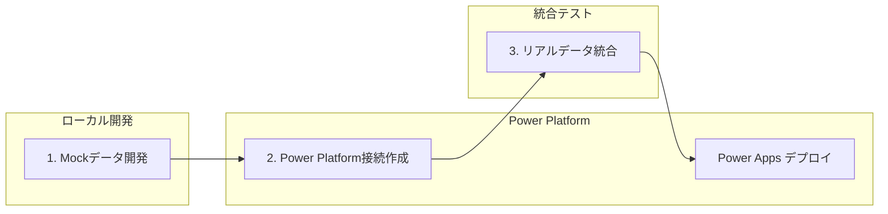

### 🏗️ **Phase 1: Mockデータで開発開始**

#### **1.1 Mockデータ構造設計**

**Office 365 Users Mock データ例 (Microsoft公式スキーマ準拠):**
```typescript
// src/mockData/office365Data.ts
// Microsoft FluentSample準拠のOffice 365 Userスキーマ
export interface User {
  Id: string;
  AccountEnabled: boolean;
  BusinessPhones: string[];
  City: string;
  CompanyName: string;
  Country: string;
  Department: string;
  DisplayName: string;
  GivenName: string;
  JobTitle: string;
  Mail: string;
  MailNickname: string;
  mobilePhone?: string;
  OfficeLocation: string;
  PostalCode: string;
  Surname: string;
  TelephoneNumber: string;
  UserPrincipalName: string;
}

export const mockUsers: User[] = [
  {
    Id: "550e8400-e29b-41d4-a716-446655440001",
    AccountEnabled: true,
    BusinessPhones: ["+81-3-1234-5678"],
    City: "東京",
    CompanyName: "コントソ株式会社",
    Country: "日本",
    Department: "エンジニアリング",
    DisplayName: "田中 太郎",
    GivenName: "太郎",
    JobTitle: "シニアソフトウェアエンジニア",
    Mail: "tanaka.taro@contoso.co.jp",
    MailNickname: "tarot",
    mobilePhone: "+81-90-1234-5678",
    OfficeLocation: "東京オフィス 3階",
    PostalCode: "100-0001",
    Surname: "田中",
    TelephoneNumber: "+81-3-1234-5678",
    UserPrincipalName: "tanaka.taro@contoso.co.jp"
  },
  {
    Id: "550e8400-e29b-41d4-a716-446655440002",
    AccountEnabled: true,
    BusinessPhones: ["+81-6-9876-5432"],
    City: "大阪",
    CompanyName: "コントソ株式会社",
    Country: "日本",
    Department: "プロダクト管理",
    DisplayName: "佐藤 花子",
    GivenName: "花子",
    JobTitle: "シニアプロダクトマネージャー",
    Mail: "sato.hanako@contoso.co.jp",
    MailNickname: "hanakos",
    mobilePhone: "+81-90-9876-5432",
    OfficeLocation: "大阪オフィス 5階",
    PostalCode: "530-0001",
    Surname: "佐藤",
    TelephoneNumber: "+81-6-9876-5432",
    UserPrincipalName: "sato.hanako@contoso.co.jp"
  },
  {
    Id: "550e8400-e29b-41d4-a716-446655440003",
    AccountEnabled: true,
    BusinessPhones: ["+81-52-1111-2222"],
    City: "名古屋",
    CompanyName: "コントソ株式会社",
    Country: "日本",
    Department: "デザイン",
    DisplayName: "山田 次郎",
    GivenName: "次郎",
    JobTitle: "プリンシパルUXデザイナー",
    Mail: "yamada.jiro@contoso.co.jp",
    MailNickname: "jiroy",
    mobilePhone: "+81-90-1111-2222",
    OfficeLocation: "名古屋オフィス 2階",
    PostalCode: "460-0001",
    Surname: "山田",
    TelephoneNumber: "+81-52-1111-2222",
    UserPrincipalName: "yamada.jiro@contoso.co.jp"
  },
  {
    Id: "550e8400-e29b-41d4-a716-446655440004",
    AccountEnabled: true,
    BusinessPhones: ["+81-45-3333-4444"],
    City: "横浜",
    CompanyName: "コントソ株式会社",
    Country: "日本",
    Department: "マーケティング",
    DisplayName: "鈴木 美咲",
    GivenName: "美咲",
    JobTitle: "マーケティングディレクター",
    Mail: "suzuki.misaki@contoso.co.jp",
    MailNickname: "misakis",
    mobilePhone: "+81-90-3333-4444",
    OfficeLocation: "横浜オフィス 4階",
    PostalCode: "220-0001",
    Surname: "鈴木",
    TelephoneNumber: "+81-45-3333-4444",
    UserPrincipalName: "suzuki.misaki@contoso.co.jp"
  },
  {
    Id: "550e8400-e29b-41d4-a716-446655440005",
    AccountEnabled: false, // 無効アカウント例
    BusinessPhones: ["+81-75-5555-6666"],
    City: "京都",
    CompanyName: "コントソ株式会社",
    Country: "日本",
    Department: "人事",
    DisplayName: "高橋 健太",
    GivenName: "健太",
    JobTitle: "HRビジネスパートナー",
    Mail: "takahashi.kenta@contoso.co.jp",
    MailNickname: "kentat",
    mobilePhone: "+81-90-5555-6666",
    OfficeLocation: "京都オフィス 1階",
    PostalCode: "600-0001",
    Surname: "高橋",
    TelephoneNumber: "+81-75-5555-6666",
    UserPrincipalName: "takahashi.kenta@contoso.co.jp"
  }
];

// Microsoft公式準拠のヘルパー関数
export const getUserById = (id: string): User | undefined => {
  return mockUsers.find(user => user.Id === id);
};

export const searchUsers = (query: string, top: number = 50): User[] => {
  if (!query.trim()) {
    return [];
  }
  
  const lowercaseQuery = query.toLowerCase();
  const filtered = mockUsers.filter(user => 
    user.DisplayName?.toLowerCase().includes(lowercaseQuery) ||
    user.Mail?.toLowerCase().includes(lowercaseQuery) ||
    user.Department?.toLowerCase().includes(lowercaseQuery) ||
    user.JobTitle?.toLowerCase().includes(lowercaseQuery) ||
    user.GivenName?.toLowerCase().includes(lowercaseQuery) ||
    user.Surname?.toLowerCase().includes(lowercaseQuery)
  );
  
  return filtered.slice(0, top);
};

export const getUsersByDepartment = (department: string): User[] => {
  return mockUsers.filter(user => user.Department === department);
};

// 現在のユーザー (MyProfile機能用)
export const mockCurrentUser: User = mockUsers[0];

// カレンダーイベントとメール用の追加インターフェース
export interface CalendarEvent {
  id: string;
  subject: string;
  start: {
    dateTime: string;
    timeZone: string;
  };
  end: {
    dateTime: string;
    timeZone: string;
  };
  organizer: {
    emailAddress: {
      name: string;
      address: string;
    };
  };
  attendees?: Array<{
    emailAddress: {
      name: string;
      address: string;
    };
    type: string;
  }>;
}

export const mockCalendarEvents: CalendarEvent[] = [
  {
    id: "event-001",
    subject: "週次プロジェクト会議",
    start: { dateTime: "2025-10-16T10:00:00", timeZone: "Asia/Tokyo" },
    end: { dateTime: "2025-10-16T11:00:00", timeZone: "Asia/Tokyo" },
    organizer: { 
      emailAddress: { 
        name: "田中 太郎", 
        address: "tanaka.taro@contoso.co.jp" 
      }
    },
    attendees: [
      {
        emailAddress: { name: "佐藤 花子", address: "sato.hanako@contoso.co.jp" },
        type: "required"
      },
      {
        emailAddress: { name: "山田 次郎", address: "yamada.jiro@contoso.co.jp" },
        type: "optional"
      }
    ]
  },
  {
    id: "event-002",
    subject: "デザインレビュー",
    start: { dateTime: "2025-10-17T14:00:00", timeZone: "Asia/Tokyo" },
    end: { dateTime: "2025-10-17T15:30:00", timeZone: "Asia/Tokyo" },
    organizer: { 
      emailAddress: { 
        name: "山田 次郎", 
        address: "yamada.jiro@contoso.co.jp" 
      }
    }
  }
];

export interface Email {
  id: string;
  subject: string;
  from: {
    emailAddress: {
      name: string;
      address: string;
    };
  };
  receivedDateTime: string;
  bodyPreview: string;
  isRead: boolean;
  importance: 'low' | 'normal' | 'high';
}

export const mockEmails: Email[] = [
  {
    id: "email-001",
    subject: "プロジェクト進捗レポート",
    from: {
      emailAddress: {
        name: "佐藤 花子",
        address: "sato.hanako@contoso.co.jp"
      }
    },
    receivedDateTime: "2025-10-16T08:30:00Z",
    bodyPreview: "今週のプロジェクト進捗をお知らせします。主要なマイルストーンは予定通り...",
    isRead: false,
    importance: 'high'
  },
  {
    id: "email-002", 
    subject: "来週の会議室予約について",
    from: {
      emailAddress: {
        name: "鈴木 美咲",
        address: "suzuki.misaki@contoso.co.jp"
      }
    },
    receivedDateTime: "2025-10-16T09:15:00Z",
    bodyPreview: "来週の会議室予約状況をご確認ください...",
    isRead: true,
    importance: 'normal'
  }
];
```

**SQL Database Mock データ例:**
```typescript
// src/mockData/sqlData.ts
export interface Project {
  Id: number;
  Name: string;
  Description?: string;
  Status: 'Planning' | 'Active' | 'On Hold' | 'Completed' | 'Cancelled';
  Priority: 'Low' | 'Medium' | 'High' | 'Critical';
  CreatedDate: string;
  DueDate?: string;
  AssignedTo?: number;
  Budget?: number;
}

export const mockProjects: Project[] = [
  {
    Id: 1,
    Name: "Webサイトリニューアル",
    Description: "企業サイトのモダン化とUI/UX改善",
    Status: "Active",
    Priority: "High", 
    CreatedDate: "2025-10-01T09:00:00Z",
    DueDate: "2025-12-31T17:00:00Z",
    Budget: 5000000
  },
  {
    Id: 2,
    Name: "データベース移行",
    Description: "レガシーシステムのクラウド移行",
    Status: "Planning",
    Priority: "Critical",
    CreatedDate: "2025-10-15T14:30:00Z",
    Budget: 8000000
  }
];

export interface Task {
  Id: number;
  ProjectId: number;
  Title: string;
  Description?: string;
  Priority: 'Low' | 'Medium' | 'High';
  Status: 'Todo' | 'InProgress' | 'Review' | 'Done';
  AssignedTo?: number;
  CreatedDate: string;
}

export const mockTasks: Task[] = [
  {
    Id: 1,
    ProjectId: 1,
    Title: "要件定義書作成",
    Description: "新しいWebサイトの要件を詳細に定義",
    Priority: "High",
    Status: "InProgress", 
    AssignedTo: 1,
    CreatedDate: "2025-10-02T10:00:00Z"
  }
];
```

#### **1.2 Mockデータを使用したコンポーネント実装**

```typescript
// src/pages/Office365Page.tsx (Mock版)
import React, { useState, useEffect } from 'react';
import { mockUsers, mockCalendarEvents, UserProfile } from '../mockData/office365Data';

export const Office365Page: React.FC = () => {
  const [users, setUsers] = useState<UserProfile[]>([]);
  const [loading, setLoading] = useState(true);

  useEffect(() => {
    // Mockデータロード（実際のAPI呼び出しをシミュレート）
    const loadMockData = async () => {
      setLoading(true);
      await new Promise(resolve => setTimeout(resolve, 500)); // 遅延シミュレート
      setUsers(mockUsers);
      setLoading(false);
    };

    loadMockData();
  }, []);

  if (loading) return <div>Loading users...</div>;

  return (
    <div className="p-6">
      <h1 className="text-2xl font-bold mb-4">Office 365 Users (Mock Data)</h1>
      <div className="grid gap-4">
        {users.map(user => (
          <div key={user.id} className="border rounded-lg p-4 bg-white shadow">
            <h3 className="font-semibold">{user.displayName}</h3>
            <p className="text-gray-600">{user.jobTitle}</p>
            <p className="text-sm text-gray-500">{user.mail}</p>
          </div>
        ))}
      </div>
    </div>
  );
};
```

#### **1.3 ローカルビルド・実行テスト**

```bash
# 依存関係インストール
npm install

# ビルド実行
npm run build

# ローカル開発サーバー起動
npm run dev

# ✅ Mockデータでの動作確認
# - UI表示確認
# - データ構造検証  
# - エラーハンドリング確認
```

### 📋 **サポートされているコネクター (Microsoft 公式)**

- ✅ **Office 365 Users** - ユーザープロファイル・組織情報
- ✅ **Office 365 Outlook** - メール・カレンダー・連絡先
- ✅ **SQL Server / Azure SQL** - リレーショナルデータベース
- ✅ **SharePoint** - ドキュメント・リスト管理  
- ✅ **Dataverse** - Power Platform ネイティブデータ
- ✅ **Microsoft Teams** - チーム・チャンネル情報
- ✅ **OneDrive for Business** - ファイルストレージ

### � **Phase 2: Power Platform 接続作成**

> **前提**: Mockデータでの動作確認が完了していること

#### **2.1 Power Apps 接続ページでの設定**

**接続作成手順:**
```bash
# 1. Power Apps Maker Portal にアクセス
https://make.powerapps.com/

# 2. 左ナビゲーション「データ」→「接続」
# 3. 「+ 新しい接続」をクリック
```

#### **2.2 Office 365 Users 接続作成**

```bash
# Power Apps UI での操作:
1. 「Office 365 Users」を検索・選択
2. 「作成」ボタンをクリック  
3. Microsoft アカウントでサインイン
4. アクセス許可を承認
5. 接続の作成完了を確認

# ✅ 成功時の確認事項:
# - 接続一覧に「Office 365 Users」が表示される
# - 状態が「接続済み」になっている
```

#### **2.3 SQL Server 接続作成 (オプション)**

**前提条件:**
- Azure SQL Database または SQL Server インスタンス
- データベースへのアクセス権限
- ネットワーク接続性 (ファイアウォール設定)

```bash
# Power Apps UI での操作:
1. 「SQL Server」を検索・選択
2. 認証方法を選択:
   ✅ Azure AD統合認証 (推奨)
   ⚠️ SQL Server認証
   ⚠️ Windows認証

3. 接続情報を入力:
   サーバー名: your-server.database.windows.net
   データベース名: YourAppDatabase
   
4. 「作成」をクリックして接続テスト
5. 成功時は接続一覧に表示される
```

**必要なSQL スキーマ例:**
```sql
-- Projects テーブル (必須)
CREATE TABLE [dbo].[Projects](
    [Id] [int] IDENTITY(1,1) NOT NULL PRIMARY KEY,
    [Name] [nvarchar](255) NOT NULL,
    [Description] [nvarchar](max) NULL,
    [Status] [nvarchar](50) NOT NULL DEFAULT ('Planning'),
    [Priority] [nvarchar](20) NOT NULL DEFAULT ('Medium'),
    [CreatedDate] [datetime2](7) NOT NULL DEFAULT (getutcdate()),
    [DueDate] [datetime2](7) NULL,
    [Budget] [decimal](18, 2) NULL,
    [AssignedTo] [int] NULL,
    
    -- 制約
    CONSTRAINT [CK_Projects_Status] CHECK ([Status] IN ('Planning', 'Active', 'On Hold', 'Completed', 'Cancelled')),
    CONSTRAINT [CK_Projects_Priority] CHECK ([Priority] IN ('Low', 'Medium', 'High', 'Critical'))
);

-- Tasks テーブル (オプション)
CREATE TABLE [dbo].[Tasks](
    [Id] [int] IDENTITY(1,1) NOT NULL PRIMARY KEY,
    [ProjectId] [int] NOT NULL,
    [Title] [nvarchar](255) NOT NULL,
    [Description] [nvarchar](max) NULL,
    [Priority] [nvarchar](20) NOT NULL DEFAULT ('Medium'),
    [Status] [nvarchar](50) NOT NULL DEFAULT ('Todo'),
    [AssignedTo] [int] NULL,
    [CreatedDate] [datetime2](7) NOT NULL DEFAULT (getutcdate()),
    
    FOREIGN KEY ([ProjectId]) REFERENCES [dbo].[Projects]([Id]),
    CONSTRAINT [CK_Tasks_Priority] CHECK ([Priority] IN ('Low', 'Medium', 'High')),
    CONSTRAINT [CK_Tasks_Status] CHECK ([Status] IN ('Todo', 'InProgress', 'Review', 'Done'))
);

-- サンプルデータ挿入
INSERT INTO [dbo].[Projects] ([Name], [Description], [Status], [Priority], [Budget]) VALUES
('Webサイトリニューアル', '企業サイトのモダン化', 'Active', 'High', 5000000),
('データベース移行', 'クラウド移行プロジェクト', 'Planning', 'Critical', 8000000);
```

#### **2.4 Dataverse 接続作成 (推奨)**

```bash
# Power Apps UI での操作:
1. 「Microsoft Dataverse」を検索・選択
2. 「作成」をクリック (認証は自動)
3. 環境のDataverseインスタンスに自動接続

# ✅ 自動で利用可能: 
# - 標準テーブル (Account, Contact, User等)
# - カスタムテーブル作成可能
# - Power Platform ネイティブ統合
```

**推奨 Dataverse テーブル構造:**
```bash
# Power Apps UI でカスタムテーブル作成:
1. 「テーブル」→「+ 新しいテーブル」
2. テーブル名: "Projects" 
3. 列の追加:
   - Name (単一行テキスト, 必須)
   - Description (複数行テキスト)  
   - Status (選択肢: Planning/Active/OnHold/Completed)
   - Priority (選択肢: Low/Medium/High/Critical)
   - DueDate (日付のみ)
   - Budget (通貨)

4. 「保存」してテーブル作成完了
```

## 🔧 **Dataverse接続設定手順とトラブルシューティング**

### **データソース追加の正しい手順**

#### **Step 1: データソース追加**
```powershell
# Dataverseテーブルを追加
pac code add-data-source -a dataverse -t your_table_name

# 例: プロジェクトテーブルを追加
pac code add-data-source -a dataverse -t geek_projecrt
```

#### **Step 2: 生成ファイルの確認と修正**

⚠️ **重要な問題**: `pac code add-data-source`で生成されたサービスファイルの`dataSourceName`が`______`（アンダースコア）になり、実際のデータソース名にマッピングされない問題があります。

**問題のあるコード (自動生成):**
```typescript
// src/generated/services/Geek_projecrtsService.ts
export class Geek_projecrtsService {
  private static readonly dataSourceName = '______';  // ← 問題
  // ...
}
```

**正しい修正 (手動):**
```typescript
// src/generated/services/Geek_projecrtsService.ts  
export class Geek_projecrtsService {
  private static readonly dataSourceName = 'geek_projecrts';  // ← 修正
  // ...
}
```

#### **Step 3: dataSourcesInfoとの整合性確認**

生成されたデータソース名は`dataSourcesInfo`オブジェクトのキー名と一致する必要があります：

```typescript
// .power/appschemas/dataSourcesInfo.ts
export const dataSourcesInfo = {
  "geek_projecrts": {              // ← サービスファイルで使用する名前
    "tableId": "",
    "version": "",
    "primaryKey": "geek_projecrtid",
    "dataSourceType": "Dataverse",
    "apis": {}
  },
  "office365users": { ... }
}
```

### **トラブルシューティングガイド**

#### **エラー 1: Data source not found**
```
❌ エラー: Dataverse API call failed: Error: Retrieve multiple records operation failed: 
Data source not found: ______
```

**原因**: サービスファイルの`dataSourceName`が正しくない

**解決方法**:
1. 生成されたサービスファイルを確認
2. `dataSourceName`を`dataSourcesInfo`のキー名に修正
3. ビルドと再デプロイ

#### **エラー 2: SDK初期化前のコネクター使用**
```
❌ エラー: Cannot read properties of undefined (reading 'getRecords')
```

**原因**: Power Apps SDK初期化前にDataverseコネクターを使用

**解決方法**: SDK初期化確認パターンを使用
```typescript
import { usePowerPlatform } from '@microsoft/power-apps';

export function DataverseComponent() {
  const { isInitialized } = usePowerPlatform();
  
  useEffect(() => {
    if (isInitialized) {
      loadDataverseData();  // ✅ 初期化後に実行
    }
  }, [isInitialized]);
  
  if (!isInitialized) {
    return <div>Power Platform初期化中...</div>;
  }
  
  return <YourComponent />;
}
```

#### **エラー 3: 認証エラー**
```
❌ エラー: Unauthorized access to Dataverse
```

**解決方法**:
1. Power Platform環境の権限確認
2. Dataverse接続の再認証
3. 環境変数の確認

### **動作確認方法**

#### **成功パターン**
```
✅ ブラウザコンソール出力:
📡 Calling Geek_projecrtsService.getAll()...
📦 Dataverse getAll result: { success: true, dataLength: 5 }
```

#### **デバッグ手順**
```typescript
// デバッグ用コンソール出力
console.log('📡 Calling Geek_projecrtsService.getAll()...');
const result = await Geek_projecrtsService.getAll();
console.log('📦 Dataverse getAll result:', { 
  success: result !== null, 
  dataLength: result?.length || 0 
});
```

### **再生成時の注意事項**

⚠️ **重要**: `pac code add-data-source`を再実行すると、手動修正が**上書き**されます。

**対処法**:
1. 再生成後に必ずサービスファイルを確認
2. `dataSourceName`を正しい値に再修正
3. チーム開発時は修正手順をドキュメント化

**修正チェックリスト**:
- [ ] `Geek_projecrtsService.ts`の`dataSourceName`修正
- [ ] `dataSourcesInfo.ts`との整合性確認  
- [ ] ビルドエラーなし
- [ ] ブラウザコンソールでの動作確認

### 🔍 **接続確認とメタデータ取得**

#### **PAC CLI による接続一覧確認:**
```bash
# 認証確認
pac auth list

# 環境選択  
pac env select --environment [Environment-URL]

# 接続一覧表示
pac connection list

# 出力例:
# ┌─────────────────────────────────┬───────────────────────┬──────────────────────────────────┐
# │ Display Name                    │ API Name              │ Connection Id                    │  
# ├─────────────────────────────────┼───────────────────────┼──────────────────────────────────┤
# │ Office 365 Users               │ shared_office365users │ 12345678-abcd-efgh-ijkl-mnopqrst │
# │ Microsoft Dataverse            │ shared_commondataserv │ 87654321-zyxw-vuts-rqpo-nmlkjihg │
# │ SQL Server                     │ shared_sql            │ abcdef12-3456-7890-abcd-ef1234567890 │
# └─────────────────────────────────┴───────────────────────┴──────────────────────────────────┘
```

#### **2.2 Power Apps UIによる接続ID取得（必須手順）**

> **⚠️ 重要**: `pac code add-data-source` コマンドを実行するには、**接続ID（Connection ID）** が必要です。以下の手順で取得してください。

**手順 1: Power Apps ポータルで接続を手動作成**

```bash
# Power Apps Maker Portal (make.powerapps.com) にアクセス
# 1. 左メニュー > 「データ」 > 「接続」をクリック
# 2. 「+ 新しい接続」をクリック
# 3. 接続したいコネクターを選択:
#    - Dataverse (Microsoft Dataverse)
#    - Office 365 Users
#    - SQL Server
#    など
# 4. 認証情報を入力して接続を作成
# 5. 「接続の作成が完了しました」を確認
```

**手順 2: 接続IDをURLから取得**

```bash
# Power Apps ポータルでの操作:
# 1. 「データ」 > 「接続」 一覧で目的の接続をクリック
# 2. ブラウザのアドレスバーのURLを確認
# 3. URLから接続IDをコピー

# URL形式:
https://make.powerapps.com/environments/{環境ID}/connections/{API名}/{接続ID}/details

# 例 (Dataverseの場合):
https://make.powerapps.com/environments/12345678-abcd-1234-efgh-123456789abc/connections/shared_commondataserviceforapps/a1b2c3d4e5f6g7h8i9j0k1l2m3n4o5p6/details

# この場合の接続ID:
a1b2c3d4e5f6g7h8i9j0k1l2m3n4o5p6
```

**手順 3: API名と接続IDを記録**

```bash
# 取得する情報:
# - API名: shared_commondataserviceforapps (Dataverseの場合)
# - 接続ID: a1b2c3d4e5f6g7h8i9j0k1l2m3n4o5p6 (例)

# コネクター別のAPI名:
# - Dataverse: shared_commondataserviceforapps
# - Office 365 Users: shared_office365users
# - SQL Server: shared_sql
# - SharePoint: shared_sharepointonline
# - Outlook: shared_office365outlook
```

**手順 4: ユーザーに接続情報を確認**

開発時には、以下をユーザーに確認してください:

```markdown
## 接続情報の確認

以下の情報を提供してください:

### Dataverse 接続
1. Power Apps ポータル (make.powerapps.com) にアクセス
2. 「データ」 > 「接続」 > 「Microsoft Dataverse」を選択
3. ブラウザのURLから接続IDをコピー
4. 接続ID: [ここに貼り付け]

### 接続ID取得のスクリーンショット
[ブラウザのURLバーのスクリーンショットを添付]
```

**手順 5: pac code add-data-source コマンド実行**

```bash
# 取得した接続IDを使用してデータソースを追加

# Dataverse の場合:
pac code add-data-source -a "shared_commondataserviceforapps" -c "a1b2c3d4e5f6g7h8i9j0k1l2m3n4o5p6"

# Office 365 Users の場合:
pac code add-data-source -a "shared_office365users" -c "接続ID"

# SQL Server の場合:
pac code add-data-source -a "shared_sql" -c "接続ID"
```

**手順 6: Dataverse テーブルを追加**

Dataverse の場合、テーブルを指定して追加することも可能です:

```bash
# SystemUsers テーブルを追加
pac code add-data-source -a "shared_commondataserviceforapps" -c "接続ID" -t "systemusers"

# カスタムテーブルを追加
pac code add-data-source -a "shared_commondataserviceforapps" -c "接続ID" -t "geek_project_task"

# Accounts (取引先企業) テーブルを追加
pac code add-data-source -a "shared_commondataserviceforapps" -c "接続ID" -t "accounts"

# Contacts (取引先担当者) テーブルを追加
pac code add-data-source -a "shared_commondataserviceforapps" -c "接続ID" -t "contacts"
```

**生成されるファイル:**

```bash
# コマンド実行後、以下のファイルが自動生成されます:

# SystemUsers テーブルの場合:
src/generated/services/SystemusersService.ts
src/generated/models/SystemusersModel.ts

# カスタムテーブルの場合:
src/generated/services/Geek_project_tasksService.ts
src/generated/models/Geek_project_tasksModel.ts
```

**⚠️ よくあるエラーと対処法:**

```bash
# エラー 1: 接続IDが見つからない
Error: Connection with id 'xxx' not found

対処法:
1. Power Apps ポータルで接続が正しく作成されているか確認
2. URLから接続IDを正確にコピー
3. 環境が正しく選択されているか確認 (pac env select)

# エラー 2: 認証エラー
Error: Unauthorized

対処法:
1. pac auth list で認証状態を確認
2. pac auth create で再認証
3. Power Apps ポータルでログイン状態を確認

# エラー 3: テーブルが見つからない
Error: Table 'tablename' not found

対処法:
1. テーブルの論理名を確認（小文字、アンダースコア）
2. customizations.xml でテーブル名を確認
3. Dataverse でテーブルが公開されているか確認
```

**チェックリスト:**

- [ ] Power Apps ポータルで接続を手動作成
- [ ] ブラウザのURLから接続IDを取得
- [ ] API名を確認（shared_commondataserviceforapps 等）
- [ ] `pac auth list` で認証状態を確認
- [ ] `pac env select` で環境を選択
- [ ] `pac code add-data-source` コマンドを実行
- [ ] 生成されたサービスファイルを確認
- [ ] `npm run build` でビルド成功を確認

### ⚡ **Phase 3: Mockデータからリアルデータへの移行**

> **📖 詳細なデータソース接続手順は Phase 5 を参照してください**

#### **3.1 Power Apps SDK による統一接続パターン**

> **⚠️ 重要原則**: Power Apps Code Apps では、**必ず Power Apps SDK経由で自動生成されたサービスクラス**を使用してデータソースに接続します。これにより、Power Apps のユーザー認証とセキュリティが保証されます。

**✅ 唯一の正しいアプローチ（Power Apps SDK使用）:**

```typescript
// ❌ 他の接続方法は使用しない:
// - Dataverse Web API (fetch) - CORS制限、認証問題
// - Xrm.WebApi - Model-driven Apps専用
// - Power Fx評価 - Canvas Apps環境専用
// - 直接REST API - 認証とセキュリティの問題

// ✅ Power Apps SDK経由のサービスクラスのみ使用:
import { SystemUsersService } from '../generated/services/SystemUsersService';
import { Office365UsersService } from '../generated/services/Office365UsersService';

// Power Apps SDK がユーザー認証を自動処理
const result = await SystemUsersService.getAll({
  select: ['systemuserid', 'fullname', 'internalemailaddress'],
  filter: 'isdisabled eq false',
  top: 50
});
```

#### **3.2 基本的なデータソース追加フロー**

**Step 1: 接続作成とサービスクラス生成**
```bash
# 1. Power Apps ポータルで接続を手動作成
# 2. ブラウザのURLから接続IDを取得
# 3. pac code コマンドでサービスクラスを自動生成

# Dataverse (SystemUsers テーブル)
pac code add-data-source -a "shared_commondataserviceforapps" -c "{接続ID}" -t "systemusers"

# Office 365 Users
pac code add-data-source -a "shared_office365users" -c "{接続ID}"
```

**Step 2: SDK初期化確認と使用**
```typescript
import { usePowerPlatform } from '@microsoft/power-apps';
import { SystemUsersService } from '../generated/services/SystemUsersService';

export function DataversePage() {
  const { isInitialized } = usePowerPlatform();

  useEffect(() => {
    if (!isInitialized) return; // SDK初期化待機
    
    // ✅ SDK初期化後にサービスクラス使用
    const loadData = async () => {
      const result = await SystemUsersService.getAll();
      if (result.isSuccess && result.value) {
        setUsers(result.value);
      }
    };
    loadData();
  }, [isInitialized]);

  if (!isInitialized) {
    return <div>Power Apps SDK 初期化中...</div>;
  }
  
  return <div>{/* データ表示 */}</div>;
}
```

**主要なポイント:**
- ✅ **Power Apps SDK経由のみ使用** - ユーザー認証が自動処理される
- ✅ **自動生成サービスクラス** - `pac code add-data-source` で生成
- ✅ **SDK初期化チェック** - `usePowerPlatform().isInitialized` で確認
- ✅ **TypeScript型安全性** - 自動生成された型定義を使用
- ❌ **他の接続方法は使用禁止** - 認証・セキュリティ問題のため

#### **3.3 完全なデータソース接続ガイド**

**詳細な手順は Phase 5 を参照:**
- 接続ID の取得方法（Power Apps ポータルのURL）
- コネクター別の追加手順（Dataverse, Office 365, SQL Server）
- Dataverse テーブルの追加（SystemUsers, Accounts, Contacts等）
- カスタムテーブルの追加（customizations.xml 使用）
- トラブルシューティング（接続エラー、SDK初期化エラー）

> **→ [Phase 5: データソース統合の詳細](#phase-5-機能拡張) を参照**

---

## 🗃️ **Dataverse 接続統合 (Microsoft 公式仕様)**

> **参考ドキュメント**: [Connect your code app to Dataverse](https://learn.microsoft.com/en-us/power-apps/developer/code-apps/how-to/connect-to-dataverse)

### ⚠️ **重要: PowerDataRuntime 初期化の必須要件**

Dataverse テーブル（例: SystemUsers, Accounts, Contacts など）にアクセスする際は、**必ず Power Apps SDK の初期化が完了してから**データ操作を行う必要があります。

> **詳細な実装パターンと初期化方法は Phase 5 を参照してください。**

---

## 🔧 **Dataverse接続設定手順とトラブルシューティング**
    searchTerm?: string, 
    top?: number, 
    isSearchTermRequired?: boolean, 
    skipToken?: string
  ): Promise<IOperationResult<EntityListResponse_IReadOnlyList_User>> {
    const params = { searchTerm, top, isSearchTermRequired, skipToken };
    const result = await Office365UsersService.client.executeAsync(
      {
        connectorOperation: {
          tableName: Office365UsersService.dataSourceName,
          operationName: 'SearchUserV2',
          parameters: params
        },
      });
    return result;
  }

  /**
   * Get manager (V2)
   * Retrieves the profile of the specified user's manager.
   */
  public static async Manager_V2(id: string, $select?: string): Promise<IOperationResult<GraphUser_V1>> {
    const params: { id: string, $select?: string } = { id, $select };
    const result = await Office365UsersService.client.executeAsync<{ id: string, $select?: string }, GraphUser_V1>(
      {
        connectorOperation: {
          tableName: Office365UsersService.dataSourceName,
          operationName: 'Manager_V2',
          parameters: params
        },
      });
    return result;
  }

  /**
   * Get direct reports (V2)
   * Retrieves the user profiles of the specified user's direct reports.
   */
  public static async DirectReports_V2(
    id: string, 
    $select?: string, 
    $top?: number
  ): Promise<IOperationResult<{ value: GraphUser_V1[] }>> {
    const params: { id: string, $select?: string, $top?: number } = { id, $select, $top };
    const result = await Office365UsersService.client.executeAsync(
      {
        connectorOperation: {
          tableName: Office365UsersService.dataSourceName,
          operationName: 'DirectReports_V2',
          parameters: params
        },
      });
    return result;
  }
}
```

**主要なポイント:**
- ✅ すべてのメソッドが `static` で定義される
- ✅ `dataSourceName` は自動的に設定される
- ✅ `getClient(dataSourcesInfo)` で Power Platform クライアントを取得
- ✅ `executeAsync()` で非同期にコネクター操作を実行
- ✅ TypeScript型定義が自動生成される

#### **3.3 カスタムフックでサービスクラスをラップ**

**Step 1: Office 365 Users カスタムフック作成**
```typescript
// src/hooks/useOffice365.ts
import { useState, useEffect, useCallback } from 'react';
import { Office365UsersService } from '../generated/services/Office365UsersService';
import type { GraphUser_V1 } from '../generated/models/Office365UsersModel';

export const useOffice365Users = () => {
  const [users, setUsers] = useState<GraphUser_V1[]>([]);
  const [loading, setLoading] = useState(true);
  const [error, setError] = useState<string | null>(null);

  // 現在のユーザープロファイル取得
  const getMyProfile = useCallback(async () => {
    try {
      setLoading(true);
      setError(null);
      const result = await Office365UsersService.MyProfile_V2();
      
      if (result.isSuccess && result.value) {
        return result.value;
      } else {
        throw new Error('プロファイル取得に失敗しました');
      }
    } catch (err) {
      const errorMessage = err instanceof Error ? err.message : 'Unknown error';
      setError(errorMessage);
      throw err;
    } finally {
      setLoading(false);
    }
  }, []);

  // ユーザー検索
  const searchUsers = useCallback(async (searchTerm: string, top: number = 10) => {
    try {
      setLoading(true);
      setError(null);
      const result = await Office365UsersService.SearchUserV2(searchTerm, top, false);
      
      if (result.isSuccess && result.value) {
        setUsers(result.value.value || []);
        return result.value.value;
      } else {
        throw new Error('ユーザー検索に失敗しました');
      }
    } catch (err) {
      const errorMessage = err instanceof Error ? err.message : 'Unknown error';
      setError(errorMessage);
      throw err;
    } finally {
      setLoading(false);
    }
  }, []);

  // 特定ユーザーのプロファイル取得
  const getUserProfile = useCallback(async (userId: string) => {
    try {
      setLoading(true);
      setError(null);
      const result = await Office365UsersService.UserProfile_V2(userId);
      
      if (result.isSuccess && result.value) {
        return result.value;
      } else {
        throw new Error('ユーザー情報の取得に失敗しました');
      }
    } catch (err) {
      const errorMessage = err instanceof Error ? err.message : 'Unknown error';
      setError(errorMessage);
      throw err;
    } finally {
      setLoading(false);
    }
  }, []);

  // マネージャー情報取得
  const getManager = useCallback(async (userId: string) => {
    try {
      setLoading(true);
      setError(null);
      const result = await Office365UsersService.Manager_V2(userId);
      
      if (result.isSuccess && result.value) {
        return result.value;
      } else {
        throw new Error('マネージャー情報の取得に失敗しました');
      }
    } catch (err) {
      const errorMessage = err instanceof Error ? err.message : 'Unknown error';
      setError(errorMessage);
      throw err;
    } finally {
      setLoading(false);
    }
  }, []);

  // 直属の部下取得
  const getDirectReports = useCallback(async (userId: string, top: number = 50) => {
    try {
      setLoading(true);
      setError(null);
      const result = await Office365UsersService.DirectReports_V2(userId, undefined, top);
      
      if (result.isSuccess && result.value) {
        return result.value.value || [];
      } else {
        throw new Error('部下情報の取得に失敗しました');
      }
    } catch (err) {
      const errorMessage = err instanceof Error ? err.message : 'Unknown error';
      setError(errorMessage);
      throw err;
    } finally {
      setLoading(false);
    }
  }, []);

  return { 
    users,
    loading, 
    error,
    getMyProfile,
    searchUsers,
    getUserProfile,
    getManager,
    getDirectReports
  };
};
```

**Step 2: Reactコンポーネントでの使用例**
```typescript
// src/pages/Office365Page.tsx
import React, { useState, useEffect } from 'react';
import { useOffice365Users } from '../hooks/useOffice365';
import type { GraphUser_V1 } from '../generated/models/Office365UsersModel';

export const Office365Page: React.FC = () => {
  const { 
    users, 
    loading, 
    error, 
    getMyProfile, 
    searchUsers, 
    getUserProfile,
    getManager,
    getDirectReports
  } = useOffice365Users();

  const [myProfile, setMyProfile] = useState<GraphUser_V1 | null>(null);
  const [searchTerm, setSearchTerm] = useState('');
  const [selectedUser, setSelectedUser] = useState<GraphUser_V1 | null>(null);
  const [manager, setManager] = useState<GraphUser_V1 | null>(null);
  const [directReports, setDirectReports] = useState<GraphUser_V1[]>([]);

  // 初期化時に自分のプロファイルを取得
  useEffect(() => {
    const loadProfile = async () => {
      try {
        const profile = await getMyProfile();
        setMyProfile(profile);
      } catch (err) {
        console.error('プロファイル取得エラー:', err);
      }
    };
    loadProfile();
  }, [getMyProfile]);

  // ユーザー検索処理
  const handleSearch = async () => {
    if (!searchTerm.trim()) return;
    try {
      await searchUsers(searchTerm, 20);
    } catch (err) {
      console.error('検索エラー:', err);
    }
  };

  // ユーザー選択時の詳細取得
  const handleUserSelect = async (userId: string) => {
    try {
      const [userProfile, userManager, reports] = await Promise.all([
        getUserProfile(userId),
        getManager(userId).catch(() => null), // マネージャーがいない場合もある
        getDirectReports(userId).catch(() => []) // 部下がいない場合もある
      ]);

      setSelectedUser(userProfile);
      setManager(userManager);
      setDirectReports(reports);
    } catch (err) {
      console.error('ユーザー詳細取得エラー:', err);
    }
  };

  if (loading && !myProfile) {
    return (
      <div className="flex items-center justify-center p-8">
        <div className="animate-spin rounded-full h-8 w-8 border-b-2 border-blue-600"></div>
        <span className="ml-2">Loading...</span>
      </div>
    );
  }

  return (
    <div className="container mx-auto p-6">
      <h1 className="text-3xl font-bold mb-6">Office 365 Users</h1>

      {error && (
        <div className="bg-red-100 border border-red-400 text-red-700 px-4 py-3 rounded mb-4">
          {error}
        </div>
      )}

      {/* 自分のプロファイル表示 */}
      {myProfile && (
        <div className="bg-white shadow rounded-lg p-6 mb-6">
          <h2 className="text-xl font-semibold mb-4">My Profile</h2>
          <div className="grid grid-cols-2 gap-4">
            <div>
              <p className="text-sm text-gray-600">Display Name</p>
              <p className="font-medium">{myProfile.displayName}</p>
            </div>
            <div>
              <p className="text-sm text-gray-600">Email</p>
              <p className="font-medium">{myProfile.mail || myProfile.userPrincipalName}</p>
            </div>
            <div>
              <p className="text-sm text-gray-600">Job Title</p>
              <p className="font-medium">{myProfile.jobTitle || 'N/A'}</p>
            </div>
            <div>
              <p className="text-sm text-gray-600">Department</p>
              <p className="font-medium">{myProfile.department || 'N/A'}</p>
            </div>
          </div>
        </div>
      )}

      {/* ユーザー検索 */}
      <div className="bg-white shadow rounded-lg p-6 mb-6">
        <h2 className="text-xl font-semibold mb-4">Search Users</h2>
        <div className="flex gap-2">
          <input
            type="text"
            value={searchTerm}
            onChange={(e) => setSearchTerm(e.target.value)}
            onKeyPress={(e) => e.key === 'Enter' && handleSearch()}
            placeholder="Enter name or email..."
            className="flex-1 px-4 py-2 border rounded-lg focus:outline-none focus:ring-2 focus:ring-blue-500"
          />
          <button
            onClick={handleSearch}
            disabled={loading}
            className="px-6 py-2 bg-blue-600 text-white rounded-lg hover:bg-blue-700 disabled:opacity-50"
          >
            {loading ? 'Searching...' : 'Search'}
          </button>
        </div>

        {/* 検索結果 */}
        {users.length > 0 && (
          <div className="mt-4 space-y-2">
            <h3 className="font-semibold">Search Results ({users.length})</h3>
            {users.map((user) => (
              <div
                key={user.id}
                onClick={() => handleUserSelect(user.id!)}
                className="p-4 border rounded-lg hover:bg-gray-50 cursor-pointer"
              >
                <p className="font-medium">{user.displayName}</p>
                <p className="text-sm text-gray-600">{user.mail || user.userPrincipalName}</p>
                {user.jobTitle && (
                  <p className="text-sm text-gray-500">{user.jobTitle}</p>
                )}
              </div>
            ))}
          </div>
        )}
      </div>

      {/* 選択したユーザーの詳細 */}
      {selectedUser && (
        <div className="bg-white shadow rounded-lg p-6">
          <h2 className="text-xl font-semibold mb-4">User Details</h2>
          
          {/* 基本情報 */}
          <div className="mb-6">
            <h3 className="font-semibold mb-2">Basic Information</h3>
            <div className="grid grid-cols-2 gap-4">
              <div>
                <p className="text-sm text-gray-600">Display Name</p>
                <p className="font-medium">{selectedUser.displayName}</p>
              </div>
              <div>
                <p className="text-sm text-gray-600">Email</p>
                <p className="font-medium">{selectedUser.mail || selectedUser.userPrincipalName}</p>
              </div>
              <div>
                <p className="text-sm text-gray-600">Job Title</p>
                <p className="font-medium">{selectedUser.jobTitle || 'N/A'}</p>
              </div>
              <div>
                <p className="text-sm text-gray-600">Department</p>
                <p className="font-medium">{selectedUser.department || 'N/A'}</p>
              </div>
              <div>
                <p className="text-sm text-gray-600">Office Location</p>
                <p className="font-medium">{selectedUser.officeLocation || 'N/A'}</p>
              </div>
              <div>
                <p className="text-sm text-gray-600">Mobile Phone</p>
                <p className="font-medium">{selectedUser.mobilePhone || 'N/A'}</p>
              </div>
            </div>
          </div>

          {/* マネージャー情報 */}
          {manager && (
            <div className="mb-6">
              <h3 className="font-semibold mb-2">Manager</h3>
              <div className="p-4 border rounded-lg bg-gray-50">
                <p className="font-medium">{manager.displayName}</p>
                <p className="text-sm text-gray-600">{manager.mail || manager.userPrincipalName}</p>
                {manager.jobTitle && (
                  <p className="text-sm text-gray-500">{manager.jobTitle}</p>
                )}
              </div>
            </div>
          )}

          {/* 直属の部下 */}
          {directReports.length > 0 && (
            <div>
              <h3 className="font-semibold mb-2">Direct Reports ({directReports.length})</h3>
              <div className="space-y-2">
                {directReports.map((report) => (
                  <div key={report.id} className="p-4 border rounded-lg bg-gray-50">
                    <p className="font-medium">{report.displayName}</p>
                    <p className="text-sm text-gray-600">{report.mail || report.userPrincipalName}</p>
                    {report.jobTitle && (
                      <p className="text-sm text-gray-500">{report.jobTitle}</p>
                    )}
                  </div>
                ))}
              </div>
            </div>
          )}
        </div>
      )}
    </div>
  );
};
```

**主要なポイント:**
- ✅ **自動生成サービスクラス** を直接使用
- ✅ **カスタムフック** でビジネスロジックをカプセル化
- ✅ **TypeScript型定義** で型安全性を確保
- ✅ **エラーハンドリング** を各操作で実装
- ✅ **ローディング状態** を適切に管理

#### **3.4 SQL Server コネクターの統合パターン**
```typescript
// src/hooks/useSqlProjects.ts  
import { useConnector } from '@microsoft/power-apps';
import { useState, useCallback } from 'react';

export const useSqlProjects = () => {
  const [projects, setProjects] = useState([]);
  const [loading, setLoading] = useState(false);
  const [error, setError] = useState<string | null>(null);
  
  const sqlConnector = useConnector('sql');

  const loadProjects = useCallback(async (options = {}) => {
    try {
      setLoading(true);
      setError(null);
      
      // ✅ 正しいSQL APIメソッド (FluentSampleパターン)
      const result = await sqlConnector.getTable('Projects', {
        skip: 0,
        take: 50,
        orderBy: 'CreatedDate desc',
        ...options
      });
      
      setProjects(result.data || []);
    } catch (err) {
      console.error('SQL Error:', err);
      setError(`Database Error: ${err.message}`);
    } finally {
      setLoading(false);
    }
  }, [sqlConnector]);

  const createProject = useCallback(async (projectData) => {
    try {
      await sqlConnector.insertTable('Projects', projectData);
      await loadProjects(); // 再読み込み
    } catch (err) {
      setError(`Create Error: ${err.message}`);
      throw err;
    }
  }, [sqlConnector, loadProjects]);

  const updateProject = useCallback(async (id, data) => {
    try {
      await sqlConnector.updateTable('Projects', id, data);
      await loadProjects(); // 再読み込み
    } catch (err) {
      setError(`Update Error: ${err.message}`);
      throw err;
    }
  }, [sqlConnector, loadProjects]);

  const deleteProject = useCallback(async (id) => {
    try {
      await sqlConnector.deleteTable('Projects', id);
      await loadProjects(); // 再読み込み  
    } catch (err) {
      setError(`Delete Error: ${err.message}`);
      throw err;
    }
  }, [sqlConnector, loadProjects]);

  return { 
    projects, 
    loading, 
    error, 
    loadProjects,
    createProject,
    updateProject,
    deleteProject
  };
};
```

#### **3.5 Mockデータからコネクター呼び出しへの置換**

**Office 365 Users の変更例:**
```typescript
// src/pages/Office365Page.tsx (リアルデータ版)
import React, { useState, useEffect } from 'react';
import { useOffice365Users } from '../hooks/useOffice365';
import type { GraphUser_V1 } from '../generated/models/Office365UsersModel';

export const Office365Page: React.FC = () => {
  const { getMyProfile, searchUsers, loading, error } = useOffice365Users();
  const [myProfile, setMyProfile] = useState<GraphUser_V1 | null>(null);

  useEffect(() => {
    const loadProfile = async () => {
      try {
        const profile = await getMyProfile();
        setMyProfile(profile);
      } catch (err) {
        console.error('プロファイル取得エラー:', err);
      }
    };
    loadProfile();
  }, [getMyProfile]);

  if (loading && !myProfile) {
    return (
      <div className="flex items-center justify-center p-8">
        <div className="animate-spin rounded-full h-8 w-8 border-b-2 border-blue-600"></div>
        <span className="ml-2">Loading Office 365 profile...</span>
      </div>
    );
  }

  if (error) {
    return (
      <div className="p-6">
        <div className="bg-red-50 border border-red-200 rounded-lg p-4">
          <h3 className="text-red-800 font-semibold">Connection Error</h3>
          <p className="text-red-600">{error}</p>
        </div>
      </div>
    );
  }

  return (
    <div className="p-6">
      <h1 className="text-2xl font-bold mb-4">Office 365 User Profile</h1>
      {myProfile && (
        <div className="border rounded-lg p-4 bg-white shadow">
          <h3 className="font-semibold text-lg">{myProfile.displayName}</h3>
          <p className="text-gray-600">{myProfile.jobTitle || '職位未設定'}</p>
          <p className="text-sm text-blue-600">{myProfile.mail || myProfile.userPrincipalName}</p>
          <p className="text-xs text-gray-400">{myProfile.department || '部署未設定'}</p>
        </div>
      )}
    </div>
  );
};
```
    } catch (err) {
      console.error('SQL Server API Error:', err);
      setError(`データベース接続エラー: ${err.message || 'Unknown error'}`);
    } finally {
      setLoading(false);
    }
  };

  useEffect(() => {
    loadRealProjects();
  }, [sqlConnector]);

  const handleCreateProject = async (projectData: any) => {
    try {
      // ✅ 正しいSQL作成API
      const result = await sqlConnector.insertTable('Projects', projectData);
      
      if (result) {
        // データ再読み込み
        await loadRealProjects();
      }
    } catch (err) {
      console.error('Project creation failed:', err);
      setError(`プロジェクト作成エラー: ${err.message}`);
    }
  };

  const handleUpdateProject = async (projectId: number, updatedData: any) => {
    try {
      // ✅ 正しいSQL更新API
      await sqlConnector.updateTable('Projects', projectId, updatedData);
      await loadRealProjects();
    } catch (err) {
      console.error('Project update failed:', err);
      setError(`プロジェクト更新エラー: ${err.message}`);
    }
  };

  const handleDeleteProject = async (projectId: number) => {
    try {
      // ✅ 正しいSQL削除API
      await sqlConnector.deleteTable('Projects', projectId);
      await loadRealProjects();
    } catch (err) {
      console.error('Project deletion failed:', err);
      setError(`プロジェクト削除エラー: ${err.message}`);
    }
  };

  if (loading) return (
    <div className="flex items-center justify-center p-8">
      <div className="animate-spin rounded-full h-8 w-8 border-b-2 border-blue-600"></div>
      <span className="ml-2">Loading projects from database...</span>
    </div>
  );

  return (
    <div className="p-6">
      <div className="flex justify-between items-center mb-6">
        <h1 className="text-2xl font-bold">Projects (SQL Database)</h1>
        <span className="text-sm text-gray-600">{totalCount} total projects</span>
      </div>
      
      {error && (
        <div className="bg-red-50 border border-red-200 rounded-lg p-4 mb-4">
          <h3 className="text-red-800 font-semibold">Database Error</h3>
          <p className="text-red-600">{error}</p>
        </div>
      )}
      
      <div className="grid gap-4">
        {projects.map((project: any) => (
          <div key={project.Id} className="border rounded-lg p-4 bg-white shadow">
            <div className="flex justify-between items-start">
              <div>
                <h3 className="font-semibold text-lg">{project.Name}</h3>
                <p className="text-gray-600 mt-1">{project.Description}</p>
                <div className="flex gap-4 mt-2">
                  <span className={`px-2 py-1 rounded text-sm ${
                    project.Status === 'Active' ? 'bg-green-100 text-green-800' :
                    project.Status === 'Planning' ? 'bg-blue-100 text-blue-800' :
                    project.Status === 'On Hold' ? 'bg-yellow-100 text-yellow-800' :
                    project.Status === 'Completed' ? 'bg-purple-100 text-purple-800' :
                    'bg-gray-100 text-gray-800'
                  }`}>
                    {project.Status}
                  </span>
                  <span className={`px-2 py-1 rounded text-sm ${
                    project.Priority === 'Critical' ? 'bg-red-100 text-red-800' :
                    project.Priority === 'High' ? 'bg-orange-100 text-orange-800' :
                    project.Priority === 'Medium' ? 'bg-yellow-100 text-yellow-800' :
                    'bg-green-100 text-green-800'
                  }`}>
                    {project.Priority}
                  </span>
                </div>
              </div>
              <div className="flex gap-2">
                <button 
                  onClick={() => handleUpdateProject(project.Id, {...project, Status: 'Active'})}
                  className="px-3 py-1 bg-blue-600 text-white rounded text-sm hover:bg-blue-700"
                >
                  Edit
                </button>
                <button 
                  onClick={() => handleDeleteProject(project.Id)}
                  className="px-3 py-1 bg-red-600 text-white rounded text-sm hover:bg-red-700"
                >
                  Delete
                </button>
              </div>
            </div>
            {project.Budget && (
              <p className="text-sm text-gray-500 mt-2">
                Budget: ¥{project.Budget.toLocaleString()}
              </p>
            )}
          </div>
        ))}
      </div>
    </div>
  );
};
```

#### **3.3 エラーハンドリングとデバッグ**

```typescript
// src/utils/errorHandler.ts - 共通エラーハンドリング
export const handleConnectorError = (error: any, connectorName: string) => {
  console.error(`${connectorName} Error:`, error);
  
  // よくあるエラーパターンの処理
  if (error?.message?.includes('Unauthorized')) {
    return 'コネクターへの認証が必要です。Power Apps で接続を確認してください。';
  }
  
  if (error?.message?.includes('Network')) {
    return 'ネットワーク接続を確認してください。';
  }
  
  if (error?.message?.includes('Not Found')) {
    return 'データが見つかりません。';
  }
  
  return `${connectorName}への接続でエラーが発生しました: ${error?.message || 'Unknown error'}`;
};
```

#### **3.8 統合テスト手順**

**ローカルテスト (Mock → Real データ切り替え)**
```bash
# 1. Mockデータでの動作確認
npm install
npm run build
npm run dev
# → Mockデータ版で全機能テスト

# 2. Power Platform接続作成
# Power Apps Maker Portal で:
# - Office 365 Users 接続作成
# - Dataverse 接続作成
# - SQL Server 接続作成 (必要に応じて)

# 3. サービスクラス生成
pac code add-data-source -a "shared_office365users" -c "接続ID"
pac code add-data-source -a "shared_commondataserviceforapps" -c "接続ID"

# 4. 自動生成されたサービスクラスを使用
# src/hooks/ にカスタムフックを実装
# src/pages/ でコンポーネントから呼び出し

# 5. Power Platform環境テスト  
pac code init  # 初回のみ
pac code run   # ローカル + Power Platform統合
# → 認証ダイアログ確認
# → リアルデータ取得確認
```

**⚠️ 重要なトラブルシューティング:**
```bash
# 推奨される確認項目:
# 1. npm run build が成功していること
# 2. PowerProvider.tsx にエラーがないこと  
# 3. 環境で必要なコネクターが有効になっていること
# 4. dataSourcesInfo.ts にコネクター情報が含まれていること
# 5. サービスクラスの dataSourceName が正しいこと

# よくある問題と解決方法:
# - App timed out → PowerProvider実装確認
# - Connection failed → Power Apps接続確認
# - Data source not found → dataSourceName の値を確認
# - Data not loading → IOperationResult.isSuccess を確認
```

#### **3.9 本番デプロイ手順**

```bash
# 最終ビルド & デプロイ
npm run build
pac code push

# ✅ デプロイ成功確認:
# 1. Power Apps URL の取得
# 2. make.powerapps.com でアプリ確認
# 3. エンドユーザーでの動作テスト
# 4. すべてのコネクター操作が正常動作することを確認
```

**デプロイ後の確認項目:**
- [ ] アプリが正常に起動する
- [ ] Office 365 Users データが取得できる
- [ ] Dataverse データの CRUD 操作が正常動作
- [ ] エラーハンドリングが適切に動作
- [ ] Loading 状態が適切に表示される
- [ ] すべての画面で認証エラーが発生しない

#### **3.6 コネクター統合のベストプラクティス**

**✅ Microsoft推奨のコネクター統合パターン:**

**コード品質:**
- [ ] **自動生成サービスクラス** を使用 (Office365UsersService, DataverseService等)
- [ ] **カスタムフック** でビジネスロジックをカプセル化
- [ ] 適切な **TypeScript型定義** を活用
- [ ] **エラーハンドリング** を各操作で実装
- [ ] **Loading状態** の適切な表示
- [ ] **IOperationResult** の `isSuccess` プロパティでエラーチェック

**統合確認項目:**
- [ ] `pac code add-data-source` で正しくサービスクラスを生成
- [ ] `dataSourcesInfo.ts` にコネクター情報が含まれている
- [ ] `getClient(dataSourcesInfo)` でクライアントを取得
- [ ] Power Apps環境で接続が正常に作成されている
- [ ] ローカル開発で `pac code run` が正常動作

**デプロイ前チェック:**
- [ ] すべてのコネクター操作でエラーハンドリング実装
- [ ] Loading/Error状態のUI表示を実装
- [ ] `npm run build` が成功
- [ ] `pac code push` でデプロイ成功
- [ ] Power Apps環境でアプリが正常起動

#### **3.7 エラーハンドリングのベストプラクティス**

```typescript
// src/utils/connectorErrorHandler.ts
import type { IOperationResult } from '@microsoft/power-apps/data';

/**
 * コネクター操作結果のエラーハンドリング
 */
export const handleOperationResult = <T>(
  result: IOperationResult<T>,
  connectorName: string
): T => {
  if (!result.isSuccess) {
    const errorMessage = result.error?.message || 'Unknown error';
    console.error(`${connectorName} Error:`, result.error);
    
    // よくあるエラーパターンの処理
    if (errorMessage.includes('Unauthorized')) {
      throw new Error(`${connectorName}への認証が必要です。Power Apps で接続を確認してください。`);
    }
    
    if (errorMessage.includes('Network')) {
      throw new Error('ネットワーク接続を確認してください。');
    }
    
    if (errorMessage.includes('Not Found')) {
      throw new Error('データが見つかりません。');
    }
    
    throw new Error(`${connectorName}への接続でエラーが発生しました: ${errorMessage}`);
  }
  
  return result.value!;
};

/**
 * カスタムフックでの使用例
 */
export const useOffice365WithErrorHandling = () => {
  const [loading, setLoading] = useState(false);
  const [error, setError] = useState<string | null>(null);

  const getMyProfile = useCallback(async () => {
    try {
      setLoading(true);
      setError(null);
      const result = await Office365UsersService.MyProfile_V2();
      return handleOperationResult(result, 'Office 365 Users');
    } catch (err) {
      const errorMessage = err instanceof Error ? err.message : 'Unknown error';
      setError(errorMessage);
      throw err;
    } finally {
      setLoading(false);
    }
  }, []);

  return { getMyProfile, loading, error };
};
```
- [ ] TypeScript型安全性の確保

**データ接続:**
- [ ] Office 365 Users: `getUserProfiles()` メソッド使用
- [ ] SQL Server: `getTable()`, `insertTable()`, `updateTable()`, `deleteTable()` 使用
- [ ] Outlook: `getCalendarEvents()`, `getEmails()` 使用
- [ ] 適切な認証フロー確認

**UI/UX:**
- [ ] Fluent UI v9 コンポーネント使用
- [ ] レスポンシブデザイン対応  
- [ ] アクセシビリティ考慮
- [ ] 適切なローディング/エラー表示

**パフォーマンス:**
- [ ] React.memo による最適化
- [ ] 適切なuseCallback/useMemo使用
- [ ] データページング実装
- [ ] エラーバウンダリ設定

**セキュリティ:**
- [ ] 機密データの適切な取り扱い
- [ ] 権限チェック実装
- [ ] ログ出力の最適化
- [ ] XSS/CSRF対策確認

**デプロイ:**
- [ ] ローカルビルド成功
- [ ] Power Platform統合テスト完了
- [ ] エンドユーザーテスト完了
- [ ] パフォーマンス確認完了

## 🧪 **モックデータからリアルデータ移行テスト（重要）**

### **📋 移行テストチェックリスト**

モックデータからリアルデータに変更した際には、以下の項目を必ずテストしてください：

#### **🔍 データスキーマ検証**

**Office 365 コネクター:**
- [ ] **スキーマ整合性**: モックデータとOffice 365 APIのスキーマが一致しているか
  ```typescript
  // ✅ 確認項目: 実際のAPI応答がモックと同じ構造か
  console.log('Office 365 API Response:', JSON.stringify(realUser, null, 2));
  console.log('Mock Data Structure:', JSON.stringify(mockUser, null, 2));
  ```

- [ ] **プロパティ名の一致**: `displayName`, `mail`, `jobTitle`, `department` 等
- [ ] **データ型の確認**: 文字列、配列、boolean、日付型が正しいか
- [ ] **null/undefined処理**: 実際のAPIで空値が返される場合の処理

**Dataverse コネクター:**
- [ ] **テーブルスキーマ**: Dataverseテーブルのカラム名・型がモックと一致
  ```typescript
  // ✅ 確認: Dataverse実データのスキーマ
  console.log('Dataverse Entity:', JSON.stringify(realProject, null, 2));
  ```

- [ ] **主キーの正確性**: `Id`フィールドの形式（GUID vs 数値）
- [ ] **選択肢フィールド**: StatusやPriorityの値がモックと一致
- [ ] **関連レコード**: Lookup/関連テーブルのデータ構造

**SQL Server コネクター:**
- [ ] **データベーススキーマ**: テーブル構造がモック定義と一致
  ```sql
  -- ✅ 確認: 実際のテーブル構造
  SELECT COLUMN_NAME, DATA_TYPE, IS_NULLABLE 
  FROM INFORMATION_SCHEMA.COLUMNS 
  WHERE TABLE_NAME = 'Projects';
  ```

- [ ] **カラム名の一致**: 大文字小文字、アンダースコア、キャメルケース
- [ ] **データ型互換性**: VARCHAR, INT, DATETIME, DECIMAL等
- [ ] **NULL制約**: NOT NULL制約がモック仕様と一致

#### **🎨 UI表示検証**

**データ表示の正確性:**
- [ ] **全フィールド表示**: モックで表示していた全項目がリアルデータでも表示
- [ ] **日本語文字化け**: 日本語データが正しく表示されるか
- [ ] **数値フォーマット**: 通貨、日付、パーセンテージの表示形式
- [ ] **画像・ファイル**: プロフィール画像やアイコンが正しく表示

**リストビュー検証:**
- [ ] **ソート機能**: 名前、日付、ステータス等のソートが動作
- [ ] **フィルター機能**: 検索・絞り込みがリアルデータで動作
- [ ] **ページング**: 大量データでのページング動作
- [ ] **空データ処理**: データが0件の場合の表示

**詳細ビュー検証:**
- [ ] **詳細画面**: 個別レコードの詳細表示が正常
- [ ] **編集フォーム**: フォーム項目がリアルデータ構造に対応
- [ ] **バリデーション**: 必須項目、文字数制限等が正しく動作

#### **📝 フォーム関連テスト（重要）**

**新規作成フォームテスト:**
- [ ] **フィールド構造**: モックデータ定義とリアルAPIスキーマが一致
  ```typescript
  // ✅ 確認項目: 新規作成フォームの全フィールド
  const createFormFields = [
    'displayName', 'jobTitle', 'department', 'mail', 
    'businessPhones', 'officeLocation', 'city', 'country'
  ];
  // リアルAPIで作成可能な全フィールドがフォームに含まれているか
  ```

- [ ] **必須フィールド**: リアル環境での必須項目がフォームで適切に設定
- [ ] **デフォルト値**: 新規作成時のデフォルト値がリアル環境に適合
- [ ] **選択肢データ**: ドロップダウン等の選択肢がリアルデータから取得
- [ ] **Auto-Complete**: ユーザー入力時の候補表示がリアルデータベース
- [ ] **関連データ取得**: 部署一覧、役職一覧等がリアルソースから取得

**編集フォームテスト:**
- [ ] **既存データ表示**: リアルデータがフォームに正確に読み込まれる
  ```typescript
  // ✅ 確認項目: 編集フォームでのデータ読み込み
  console.log('Original Data:', originalRecord);
  console.log('Form Initial Values:', formInitialValues);
  // 全フィールドが正確にフォームに反映されているか
  ```

- [ ] **部分更新**: 変更した項目のみがリアルデータベースに保存される
- [ ] **競合制御**: 同時編集時の適切な競合処理
- [ ] **変更検知**: 未保存変更の警告表示
- [ ] **リアルタイム検証**: 入力中のリアルタイムバリデーション
- [ ] **関連データ更新**: 関連レコードの自動更新

**フォーム共通テスト:**
- [ ] **データ型変換**: 文字列⇔数値⇔日付の適切な変換
  ```typescript
  // ✅ データ型マッピング確認
  const typeMapping = {
    'budget': 'number',      // 予算: 数値型
    'dueDate': 'Date',       // 期限: 日付型  
    'priority': 'string',    // 優先度: 文字列型
    'isActive': 'boolean'    // 有効: 真偽値型
  };
  ```

- [ ] **文字エンコーディング**: 日本語文字の正確な保存・表示
- [ ] **特殊文字処理**: 記号、絵文字、改行等の適切な処理
- [ ] **ファイルアップロード**: 画像やドキュメントのアップロード機能
- [ ] **複数値フィールド**: 配列データ（電話番号、タグ等）の処理

#### **🎯 コネクター別フォームテスト**

**Office 365 フォームテスト:**
- [ ] **ユーザープロフィール作成**: Office 365環境での新規ユーザー作成
- [ ] **プロフィール更新**: 既存ユーザーの情報更新
- [ ] **組織情報連携**: 部署、管理者情報の自動取得・設定
- [ ] **ライセンス管理**: ユーザーライセンスの割り当て・変更
- [ ] **グループ所属**: セキュリティグループ、配布リストの管理

**Dataverse フォームテスト:**
- [ ] **エンティティ作成**: カスタムエンティティでの新規レコード作成
  ```typescript
  // ✅ Dataverse作成テスト
  const projectData = {
    name: 'テストプロジェクト',
    description: '移行テスト用プロジェクト',
    statuscode: 1,           // ステータス選択肢
    prioritycode: 100000002, // 優先度選択肢
    estimatedbudget: 5000000 // 通貨フィールド
  };
  ```

- [ ] **ルックアップフィールド**: 関連レコードの選択・表示
- [ ] **選択肢フィールド**: OptionSetの値が正確に保存
- [ ] **計算フィールド**: 計算式が適切に動作
- [ ] **ワークフロー連携**: フォーム送信時のワークフロー実行

**SQL Server フォームテスト:**
- [ ] **テーブル作成**: SQL Serverでの新規レコード挿入
  ```sql
  -- ✅ SQL Server作成テスト
  INSERT INTO Projects (Name, Description, Status, Priority, Budget, CreatedDate)
  VALUES ('移行テストプロジェクト', 'フォームからのテスト作成', 'Planning', 'High', 3000000, GETDATE());
  ```

- [ ] **制約チェック**: NOT NULL、UNIQUE、CHECK制約の動作
- [ ] **外部キー**: 関連テーブルとの整合性
- [ ] **トランザクション**: 複数テーブル更新の原子性
- [ ] **ストアドプロシージャ**: 複雑な業務ロジックの実行

#### **🔧 フォームバリデーションテスト**

**クライアントサイドバリデーション:**
- [ ] **必須チェック**: 必須フィールドの空白チェック
- [ ] **形式チェック**: メールアドレス、電話番号の形式検証
- [ ] **文字数チェック**: 最小・最大文字数の制限
- [ ] **数値範囲**: 予算、年齢等の数値範囲チェック
- [ ] **日付妥当性**: 開始日≤終了日等の日付ロジック

**サーバーサイドバリデーション:**
- [ ] **重複チェック**: メールアドレス、ID等の一意性確認
- [ ] **権限チェック**: 作成・編集権限の確認
- [ ] **ビジネスルール**: 業務固有の制約事項
- [ ] **整合性チェック**: 関連データとの整合性確認

#### **📱 フォームUI/UXテスト**

**応答性テスト:**
- [ ] **保存速度**: フォーム送信後3秒以内での応答
- [ ] **バリデーション速度**: リアルタイム検証の応答性
- [ ] **データ読み込み**: 編集フォーム表示時間
- [ ] **大量データ**: 選択肢が1000件以上の場合の性能

**ユーザビリティテスト:**
- [ ] **エラー表示**: わかりやすいエラーメッセージ
- [ ] **成功通知**: 保存完了の明確な通知
- [ ] **進行状況**: 長時間処理での進捗表示
- [ ] **自動保存**: 一定間隔での下書き保存
- [ ] **復元機能**: ブラウザクラッシュ時の入力内容復元

#### **🧪 フォーム移行テスト実行手順**

**Step 1: フォーム機能の棚卸し**
```typescript
// src/tests/formMigration.test.ts
describe('Form Migration Tests', () => {
  // 新規作成フォームテスト
  test('Create Form - All fields work with real data', async () => {
    const formData = {
      // モックデータ構造と同じフィールド
      displayName: 'テストユーザー',
      jobTitle: 'テストエンジニア',
      department: 'IT部門',
      mail: 'test@company.com'
    };
    
    const result = await createUser(formData);
    expect(result.success).toBe(true);
    expect(result.data.id).toBeDefined();
  });
  
  // 編集フォームテスト  
  test('Edit Form - Loads and saves real data correctly', async () => {
    const existingUser = await getUser('test-user-id');
    const updatedData = { ...existingUser, jobTitle: '更新された職種' };
    
    const result = await updateUser(existingUser.id, updatedData);
    expect(result.success).toBe(true);
    expect(result.data.jobTitle).toBe('更新された職種');
  });
});
```

**Step 2: フォーム別動作確認**
```bash
# 各フォームでの実動作テスト
npm run test:forms:create   # 新規作成フォーム
npm run test:forms:edit     # 編集フォーム  
npm run test:forms:bulk     # 一括操作フォーム
npm run test:forms:import   # データインポートフォーム
```

**Step 3: エンドツーエンドテスト**
```typescript
// e2e/formWorkflow.test.ts  
test('Complete form workflow with real data', async () => {
  // 1. 新規作成
  await page.click('[data-testid="create-button"]');
  await page.fill('[name="displayName"]', 'E2Eテストユーザー');
  await page.click('[type="submit"]');
  
  // 2. 作成確認
  await expect(page.locator('.success-message')).toBeVisible();
  
  // 3. 編集
  await page.click('[data-testid="edit-button"]');
  await page.fill('[name="jobTitle"]', '更新された職種');
  await page.click('[type="submit"]');
  
  // 4. 更新確認  
  await expect(page.locator('.success-message')).toBeVisible();
});
```

この詳細なフォームテストにより、モックデータからリアルデータへの移行時に、全てのフォーム機能が正常に動作することを確実に検証できます。

#### **⚡ 機能動作テスト**

**CRUD操作テスト:**
- [ ] **作成（Create）**: 新規データ作成がリアル環境で動作
- [ ] **読み取り（Read）**: データ取得・表示が正常
- [ ] **更新（Update）**: データ編集・保存が正常
- [ ] **削除（Delete）**: データ削除が正常（※要注意）

**検索・フィルター機能:**
- [ ] **キーワード検索**: 実際のデータで検索機能が動作
- [ ] **高度な検索**: 複数条件での絞り込み
- [ ] **オートコンプリート**: 候補表示機能

**統合機能テスト:**
- [ ] **クロスコネクター**: Office 365 + SQL等の複合処理
- [ ] **データ同期**: 複数ソース間のデータ整合性
- [ ] **リアルタイム更新**: データ変更の即座反映

#### **🚨 エラーハンドリング検証**

**接続エラー対応:**
- [ ] **認証エラー**: 権限不足時の適切なエラー表示
- [ ] **ネットワークエラー**: 接続断時の処理
- [ ] **データ不整合**: 想定外のデータ形式への対応

**ユーザビリティ:**
- [ ] **ローディング表示**: データ取得中の適切な表示
- [ ] **エラーメッセージ**: わかりやすいエラー通知
- [ ] **リトライ機能**: 失敗時の再試行オプション

#### **📊 パフォーマンステスト**

**レスポンス時間:**
- [ ] **初期表示**: 5秒以内でのデータ表示
- [ ] **検索応答**: 3秒以内での検索結果表示
- [ ] **ページング**: スムーズなページ切り替え

**大量データ対応:**
- [ ] **100件以上**: 大量データでの表示性能
- [ ] **1000件以上**: 検索・フィルター性能
- [ ] **メモリ使用量**: ブラウザでのメモリリーク確認

### **🔧 移行テスト実行手順**

#### **Step 1: 段階的切り替えテスト**
```typescript
// src/config/dataSource.ts - 切り替え用設定
export const DATA_SOURCE_CONFIG = {
  useRealData: process.env.NODE_ENV === 'production', // 環境による自動切り替え
  office365: {
    useMock: false, // リアルデータ使用
    mockFallback: true // エラー時はモック使用
  },
  dataverse: {
    useMock: false,
    mockFallback: true
  },
  sql: {
    useMock: false,
    mockFallback: true
  }
};
```

#### **Step 2: A/Bテスト比較**
```typescript
// 同じ画面でモックとリアルデータを比較表示
const ComparisonTest = () => {
  const [showMock, setShowMock] = useState(true);
  
  return (
    <div className="flex gap-4">
      <div className="w-1/2">
        <h3>Mock Data</h3>
        <UserListMock />
      </div>
      <div className="w-1/2">
        <h3>Real Data</h3>
        <UserListReal />
      </div>
    </div>
  );
};
```

#### **Step 3: 自動テスト実行**
```bash
# 移行テスト用のテストスイート実行
npm run test:migration

# 各コネクター別テスト
npm run test:office365
npm run test:dataverse  
npm run test:sql

# 統合テスト
npm run test:integration
```

### **⚠️ 移行時の重要な注意事項**

1. **バックアップ**: 本番データを扱う場合は必ずバックアップを取得
2. **段階的移行**: 一度に全コネクターを切り替えず、段階的に実施
3. **モニタリング**: 移行後しばらくはエラーログを注意深く監視
4. **ロールバック計画**: 問題発生時の元に戻す手順を準備
5. **ユーザーテスト**: 技術的テストだけでなく、実際のユーザーでの動作確認

この移行テストを完了することで、モックデータとリアルデータ間でのギャップを最小化し、本番環境での安定動作を確保できます。

### 🗑️ **データソース削除 (必要時)**

```bash
# データソース削除
pac code delete-data-source -a "shared_office365users" -ds "Office365Users"

# 重要: 接続のスキーマが変更された場合、
#       データソースを削除してから再追加する必要があります
```

### 🚀 **Step 4: アプリでの接続呼び出し実装**

#### **4.1 Office 365 Users 実装パターン (Microsoft 公式)**

**React Hook での実装**:

```typescript
// src/hooks/useCurrentUser.ts
import { useState, useEffect } from 'react';
import { Office365UsersService } from '../generated/services/Office365UsersService';

export interface UserProfile {
  id?: string;
  displayName?: string;
  jobTitle?: string;
  userPrincipalName?: string;
  photo?: string;
}

export const useCurrentUser = () => {
  const [user, setUser] = useState<UserProfile | null>(null);
  const [loading, setLoading] = useState(true);
  const [error, setError] = useState<string | null>(null);

  useEffect(() => {
    const fetchProfile = async () => {
      try {
        setLoading(true);
        
        // Microsoft 公式 API パターン - プロフィール取得
        const profile = (await Office365UsersService.MyProfile_V2(
          "id,displayName,jobTitle,userPrincipalName"
        )).data;
        
        setUser(profile);
        
            if (profile.userPrincipalName) {
              try {
                photoData = (await Office365UsersService.UserPhoto_V2(
                  profile.userPrincipalName
                )).data;
              } catch {
                console.log('ユーザー写真が利用できません');
              }
            }
          }
          
          if (photoData) {
            setUser(prev => ({ 
              ...prev, 
              ...profile, 
              photo: `data:image/jpeg;base64,${photoData}` 
            }));
          }
        }
      } catch (err) {
        console.error('Failed to fetch user profile:', err);
        setError('プロフィールの取得に失敗しました');
      } finally {
        setLoading(false);
      }
    };

    fetchProfile();
  }, []);

  return { user, loading, error };
};
```

**コンポーネントでの使用例**:

```typescript
// src/components/UserProfile.tsx  
import React from 'react';
import { useCurrentUser } from '../hooks/useCurrentUser';

export const UserProfile: React.FC = () => {
  const { user, loading, error } = useCurrentUser();

  if (loading) return <div>プロフィール読み込み中...</div>;
  if (error) return <div>エラー: {error}</div>;
  if (!user) return <div>プロフィールが見つかりません</div>;

  return (
    <div className="user-profile">
      {user.photo && (
        
      )}
      <div>
        <h3>{user.displayName}</h3>
        <p>{user.jobTitle}</p>
        <p>{user.userPrincipalName}</p>
      </div>
    </div>
  );
};
```

#### **4.2 表形式データソース実装パターン (SQL Server)**

```typescript
// src/hooks/useProjects.ts - SQL Server テーブル操作
import { useState, useEffect } from 'react';
import { MobileDeviceInventoryService } from '../generated/services/MobileDeviceInventoryService';

export const useDeviceInventory = () => {
  const [devices, setDevices] = useState([]);
  const [loading, setLoading] = useState(true);

  // 全件取得
  const fetchDevices = async () => {
    try {
      const result = await MobileDeviceInventoryService.getall();
      setDevices(result.data);
    } catch (error) {
      console.error('デバイス一覧取得エラー:', error);
    } finally {
      setLoading(false);
    }
  };

  // 新規作成
  const createDevice = async (deviceData: any) => {
    try {
      await MobileDeviceInventoryService.create(deviceData);
      await fetchDevices(); // 再読み込み
    } catch (error) {
      console.error('デバイス作成エラー:', error);
    }
  };

  // 更新
  const updateDevice = async (id: string, changes: any) => {
    try {
      await MobileDeviceInventoryService.update(id, changes);
      setDevices(prevDevices => 
        prevDevices.map(device => 
          device.id === id ? { ...device, ...changes } : device
        )
      );
    } catch (error) {
      console.error('デバイス更新エラー:', error);
    }
  };

  // 削除
  const deleteDevice = async (id: string) => {
    try {
      await MobileDeviceInventoryService.delete(id);
      setDevices(prev => prev.filter(device => device.id !== id));
    } catch (error) {
      console.error('デバイス削除エラー:', error);
    }
  };

  useEffect(() => {
    fetchDevices();
  }, []);

  return {
    devices,
    loading,
    createDevice,
    updateDevice,
    deleteDevice,
    refresh: fetchDevices
  };
};
```

### 🧪 **Step 5: ローカルテストと実行**

```bash
# ローカル開発サーバー起動
npm run dev

# ブラウザで確認: http://localhost:3000
# コネクターが正常に動作することを確認
```

### 🚀 **Step 6: Power Apps へのデプロイ**

```bash
# アプリをビルドしてPower Appsにプッシュ
npm run build
pac code push

# デプロイ完了後:
# 1. Power Apps ポータルでアプリを確認
# 2. 実際の環境でコネクター接続をテスト
# 3. ユーザーにアクセス権限を付与
```

### ⚠️ **重要な注意事項**

- **初回リリースでは既存接続のみ利用可能**: PAC CLIによる新しい接続作成は今後のリリースで対応予定
- **スキーマ変更時**: 接続のスキーマが変更された場合は、データソースを削除してから再追加が必要
- **表形式データの取得**: データセット名とテーブルIDが不明な場合は、キャンバスアプリ経由でブラウザーのネットワークインスペクターから取得可能

## 🗃️ **Dataverse 接続統合 (Microsoft 公式仕様)**

> **参考ドキュメント**: [Connect your code app to Dataverse](https://learn.microsoft.com/en-us/power-apps/developer/code-apps/how-to/connect-to-dataverse)

### ⚠️ **重要: PowerDataRuntime 初期化の必須要件**

Dataverse テーブル（例: SystemUsers, Accounts, Contacts など）にアクセスする際は、**必ず Power Apps SDK の初期化が完了してから**データ操作を行う必要があります。

**❌ よくあるエラー:**
```
Error fetching SystemUsers: PowerDataRuntimeError: An unknown error occurred: 
PowerDataRuntime is not initialized. Please call initializeRuntime() first.
```

**原因:**
- Power Apps SDK（PowerDataRuntime）が初期化される前に Dataverse サービスクラスのメソッドを呼び出した
- `usePowerPlatform().isInitialized` の状態確認をせずにデータ取得を試みた
- コンポーネントのマウント時に即座にデータフェッチを実行した

**✅ 正しい実装パターン:**
```typescript
import { usePowerPlatform } from '@microsoft/power-apps';
import { useEffect, useState } from 'react';
import { SystemUsersService } from '../generated/services/SystemUsersService';

export function DataversePage() {
  const { isInitialized } = usePowerPlatform();
  const [users, setUsers] = useState([]);
  const [loading, setLoading] = useState(true);
  const [error, setError] = useState<string | null>(null);

  useEffect(() => {
    // ❌ 初期化前は何もしない
    if (!isInitialized) {
      console.log('Waiting for Power Apps SDK initialization...');
      return;
    }

    // ✅ 初期化完了後にデータ取得
    const loadData = async () => {
      try {
        setLoading(true);
        const result = await SystemUsersService.getAll({
          select: ['systemuserid', 'fullname', 'internalemailaddress'],
          filter: 'isdisabled eq false',
          top: 50
        });

        if (result.isSuccess && result.value) {
          setUsers(result.value);
        } else {
          throw new Error('SystemUsers の取得に失敗しました');
        }
      } catch (err) {
        console.error('Error fetching SystemUsers:', err);
        setError(err.message);
      } finally {
        setLoading(false);
      }
    };

    loadData();
  }, [isInitialized]); // 依存配列に isInitialized を含める

  // SDK 初期化中
  if (!isInitialized) {
    return (
      <div className="flex items-center justify-center h-screen">
        <div className="text-center">
          <div className="animate-spin rounded-full h-12 w-12 border-b-2 border-blue-600 mx-auto"></div>
          <p className="mt-4 text-gray-600">Power Apps SDK 初期化中...</p>
        </div>
      </div>
    );
  }

  // データ読み込み中
  if (loading) {
    return <div>データ読み込み中...</div>;
  }

  // エラー発生
  if (error) {
    return (
      <div className="bg-red-50 border border-red-200 rounded-lg p-4">
        <h3 className="text-red-800 font-semibold">エラー</h3>
        <p className="text-red-600">{error}</p>
      </div>
    );
  }

  // データ表示
  return (
    <div>
      <h1>システムユーザー ({users.length})</h1>
      {users.map(user => (
        <div key={user.systemuserid}>
          {user.fullname} - {user.internalemailaddress}
        </div>
      ))}
    </div>
  );
}
```

**カスタムフックでの実装（推奨パターン）:**
```typescript
// src/hooks/useDataverseTable.ts
import { useState, useEffect, useCallback } from 'react';
import { usePowerPlatform } from '@microsoft/power-apps';

export const useDataverseTable = <T,>(
  serviceClass: any,
  options?: { select?: string[]; filter?: string; orderBy?: string; top?: number }
) => {
  const { isInitialized } = usePowerPlatform();
  const [data, setData] = useState<T[]>([]);
  const [loading, setLoading] = useState(true);
  const [error, setError] = useState<string | null>(null);

  const fetchData = useCallback(async () => {
    // ❌ SDK未初期化時は実行しない
    if (!isInitialized) {
      console.warn('SDK not initialized, skipping fetch');
      return;
    }

    try {
      setLoading(true);
      setError(null);

      const result = await serviceClass.getAll(options);

      if (result.isSuccess && result.value) {
        setData(result.value);
      } else {
        throw new Error('データの取得に失敗しました');
      }
    } catch (err) {
      const errorMessage = err instanceof Error ? err.message : 'Unknown error';
      console.error('Dataverse fetch error:', err);
      setError(errorMessage);
    } finally {
      setLoading(false);
    }
  }, [isInitialized, serviceClass, options]);

  useEffect(() => {
    if (isInitialized) {
      fetchData();
    }
  }, [isInitialized, fetchData]);

  return { data, loading, error, refetch: fetchData, isInitialized };
};

// 使用例
import { SystemUsersService } from '../generated/services/SystemUsersService';

export function UsersPage() {
  const { data: users, loading, error, isInitialized } = useDataverseTable(
    SystemUsersService,
    {
      select: ['systemuserid', 'fullname', 'internalemailaddress'],
      filter: 'isdisabled eq false',
      top: 100
    }
  );

  if (!isInitialized) return <div>初期化中...</div>;
  if (loading) return <div>読み込み中...</div>;
  if (error) return <div>エラー: {error}</div>;

  return <div>{/* ユーザー表示 */}</div>;
}
```

**チェックリスト:**
- [ ] `usePowerPlatform()` で `isInitialized` 状態を取得
- [ ] `isInitialized === false` の間は Loading 表示
- [ ] `useEffect` の依存配列に `isInitialized` を含める
- [ ] Dataverse サービスクラスの呼び出しは `isInitialized === true` 後のみ
- [ ] エラーハンドリングを適切に実装

### 📋 **前提条件**

- **Power Apps Code Apps SDK**: `@microsoft/power-apps` (npm package)
- **PAC CLI**: バージョン 1.46 以上
- **Dataverse 有効化環境**: Power Platform環境にDataverseが有効化されている
- **PAC CLI 認証**: 環境に正しく接続されている
- **PowerProvider 実装**: アプリのルートに PowerProvider がラップされている

### ⚡ **Dataverse データソース追加（完全ガイド）**

#### **方法1: 接続IDを使用した追加（推奨）**

> **⚠️ 重要**: Dataverse テーブルをデータソースとして追加するには、**Power Apps ポータルで接続を手動作成し、接続IDを取得**する必要があります。

**Step 1: Power Apps ポータルでDataverse接続を作成**

```bash
# 1. Power Apps Maker Portal (make.powerapps.com) にアクセス
# 2. 左メニュー > 「データ」 > 「接続」
# 3. 「+ 新しい接続」をクリック
# 4. 「Microsoft Dataverse」を検索して選択
# 5. 「作成」をクリック（認証は自動で完了）
# 6. 接続が正常に作成されたことを確認
```

**Step 2: 接続IDを取得**

```bash
# Power Apps ポータルで:
# 1. 「データ」 > 「接続」 > 「Microsoft Dataverse」をクリック
# 2. ブラウザのアドレスバーのURLを確認
# 3. URLから接続IDをコピー

# URL形式:
https://make.powerapps.com/environments/{環境ID}/connections/shared_commondataserviceforapps/{接続ID}/details

# 例:
https://make.powerapps.com/environments/12345678-abcd-1234-efgh-123456789abc/connections/shared_commondataserviceforapps/a1b2c3d4-e5f6-7890-1234-567890abcdef/details

# 接続ID: a1b2c3d4-e5f6-7890-1234-567890abcdef
```

**Step 3: pac code add-data-source コマンド実行**

```bash
# ユーザーに接続IDを確認した後、以下のコマンドを実行

# SystemUsers テーブルを追加
pac code add-data-source -a "shared_commondataserviceforapps" -c "a1b2c3d4-e5f6-7890-1234-567890abcdef" -t "systemusers"

# Accounts (取引先企業) テーブルを追加
pac code add-data-source -a "shared_commondataserviceforapps" -c "接続ID" -t "accounts"

# Contacts (取引先担当者) テーブルを追加
pac code add-data-source -a "shared_commondataserviceforapps" -c "接続ID" -t "contacts"

# カスタムテーブルを追加（例: geek_project_task）
pac code add-data-source -a "shared_commondataserviceforapps" -c "接続ID" -t "geek_project_task"
```

**コマンドパラメータ:**
- `-a`: API名（Dataverseの場合は `shared_commondataserviceforapps`）
- `-c`: 接続ID（Power Apps ポータルのURLから取得）
- `-t`: テーブルの論理名（小文字、アンダースコア区切り）

**Step 4: 生成されたファイルを確認**

```bash
# コマンド実行後、以下のファイルが自動生成されます:

# SystemUsers テーブルの場合:
src/generated/services/SystemusersService.ts
src/generated/models/SystemusersModel.ts

# Accounts テーブルの場合:
src/generated/services/AccountsService.ts
src/generated/models/AccountsModel.ts

# カスタムテーブル（geek_project_task）の場合:
src/generated/services/Geek_project_tasksService.ts
src/generated/models/Geek_project_tasksModel.ts
```

#### **方法2: 簡易追加（接続が既に存在する場合）**

```bash
# Dataverse接続が既に作成されている場合、テーブル名のみで追加可能
pac code add-data-source -a dataverse -t <table-logical-name>

# 例: Accountsテーブルの追加
pac code add-data-source -a dataverse -t accounts

# 例: Contactsテーブルの追加
pac code add-data-source -a dataverse -t contacts

# ⚠️ 注意: この方法はデフォルトのDataverse接続を使用します
# 接続が見つからない場合はエラーになるため、方法1を推奨します
```

#### **ユーザーへの依頼テンプレート**

開発時にユーザーに接続IDを確認する際は、以下のテンプレートを使用してください:

```markdown
## Dataverse 接続ID の取得方法

以下の手順で接続IDを取得し、提供してください:

### 手順
1. Power Apps ポータル (https://make.powerapps.com) にアクセス
2. 左メニュー > 「データ」 > 「接続」をクリック
3. 「Microsoft Dataverse」接続をクリック
4. ブラウザのアドレスバーのURLをコピー
5. URLから接続ID（GUID形式）を抽出

### URL例
https://make.powerapps.com/environments/xxx/connections/shared_commondataserviceforapps/**[ここが接続ID]**/details

### 接続ID
[ここに貼り付けてください]

### スクリーンショット
[URLバーのスクリーンショットを添付してください]
```

#### **⚠️ よくあるエラーと対処法**

**エラー 1: 接続が見つからない**
```bash
Error: Connection with id 'xxx' not found

対処法:
1. Power Apps ポータルでDataverse接続が作成されているか確認
2. URLから接続IDを正確にコピー（ハイフンを含むGUID形式）
3. pac env select で正しい環境を選択しているか確認
```

**エラー 2: テーブルが見つからない**
```bash
Error: Table 'tablename' not found

対処法:
1. テーブルの論理名を確認（小文字、アンダースコア）
   - 正: systemusers, accounts, contacts
   - 誤: SystemUsers, Account, Contact
2. customizations.xml でテーブル名を確認
3. Dataverse でテーブルが公開されているか確認
```

**エラー 3: データソースが見つからない（実行時エラー）**
```bash
Error: Data source 'systemusers' not found
PowerDataRuntimeError: PowerDataRuntime is not initialized

対処法:
1. pac code add-data-source コマンドが正常に完了したか確認
2. src/generated/services にサービスファイルが生成されているか確認
3. npm run build でビルド成功を確認
4. usePowerPlatform().isInitialized の確認を実装
```

#### **チェックリスト**

- [ ] Power Apps ポータルでDataverse接続を手動作成
- [ ] ブラウザのURLから接続ID（GUID）を取得
- [ ] ユーザーに接続IDを確認（必要に応じて）
- [ ] `pac auth list` で認証状態を確認
- [ ] `pac env select` で正しい環境を選択
- [ ] `pac code add-data-source -a "shared_commondataserviceforapps" -c "接続ID" -t "テーブル名"` を実行
- [ ] src/generated フォルダにサービスファイルが生成されたことを確認
- [ ] `npm run build` でビルド成功を確認
- [ ] コンポーネントで `usePowerPlatform().isInitialized` をチェック
- [ ] `pac code push` でデプロイして動作確認

## 📋 **Dataverse接続前の必須手順: スキーマ確認とドキュメント化**

> **⚠️ 重要**: モックデータからDataverseリアルデータに移行する際は、以下の手順を**必ず**実行してください。スキーマの不一致により、データの読み書きエラーや選択肢値の不整合が発生する可能性があります。

### **Step 1: customizations.xmlファイルの取得**

#### **Power Apps ポータルからのソリューションエクスポート**
```bash
# 1. Power Apps Maker Portal (make.powerapps.com) にアクセス
# 2. ソリューション → 対象ソリューションを選択
# 3. エクスポート → 「アンマネージド」を選択
# 4. ZIPファイルをダウンロード・展開
# 5. customizations.xml ファイルを取得
# 6. ファイルをワークスペースのルートディレクトリに配置
```

**取得するファイル:**
- `customizations.xml` - Dataverseテーブル定義とスキーマ情報
- 配置場所: **プロジェクトのワークスペースルート** (例: `C:\CodeApps\YourProject\customizations.xml`)

### **Step 2: Dataverseスキーマ抽出ユーティリティの実行**

#### **PowerShellスクリプトによる自動抽出**

**Extract-DataverseChoices.ps1 の作成:**
```powershell
# プロジェクトルートに保存
param(
    [Parameter(Mandatory=$true)]
    [string]$XmlPath,
    
    [Parameter(Mandatory=$false)]
    [string]$EntityName = "your_table_name"  # 実際のテーブル名に変更
)

# XMLを読み込み（UTF-8エンコーディング）
Write-Host "Reading XML file..." -ForegroundColor Cyan
$xmlContent = Get-Content -Path $XmlPath -Encoding UTF8 -Raw

# XMLをパース
[xml]$xml = $xmlContent

# エンティティを検索
$entities = $xml.ImportExportXml.Entities.Entity

Write-Host "`nSearching for entity: $EntityName" -ForegroundColor Yellow

foreach ($entity in $entities) {
    $entityLogicalName = $entity.EntityInfo.entity.Name
    
    if ($entityLogicalName -eq $EntityName) {
        Write-Host "`nFound entity: $entityLogicalName" -ForegroundColor Green
        
        # 属性を取得
        $attributes = $entity.EntityInfo.entity.attributes.attribute
        
        # 全属性の表示
        Write-Host "`nAll Attributes:" -ForegroundColor Cyan
        foreach ($attr in $attributes) {
            $attrName = $attr.Name
            $attrType = $attr.Type
            $displayName = $attr.displaynames.displayname | Where-Object { $_.languagecode -eq '1041' } | Select-Object -ExpandProperty description
            Write-Host "  $attrName ($attrType) - $displayName" -ForegroundColor White
        }
        
        # Picklist属性のみをフィルター
        $picklistAttributes = $attributes | Where-Object { $_.Type -eq 'picklist' }
        
        Write-Host "`nChoice (Picklist) Attributes Found: $($picklistAttributes.Count)" -ForegroundColor Cyan
        
        foreach ($attr in $picklistAttributes) {
            $attrName = $attr.Name
            $attrDisplayName = $attr.displaynames.displayname | Where-Object { $_.languagecode -eq '1041' } | Select-Object -ExpandProperty description
            
            Write-Host "`n=== $attrName ($attrDisplayName) ===" -ForegroundColor Yellow
            
            # optionset要素を取得
            if ($attr.optionset) {
                $options = $attr.optionset.options.option
                
                if ($options) {
                    Write-Host "Choice Values:" -ForegroundColor Cyan
                    foreach ($option in $options) {
                        $value = $option.value
                        $label = $option.labels.label | Where-Object { $_.languagecode -eq '1041' } | Select-Object -ExpandProperty description
                        Write-Host "  $value : $label" -ForegroundColor White
                    }
                } else {
                    Write-Host "  No options defined (global optionset?)" -ForegroundColor Gray
                }
            } else {
                Write-Host "  No optionset element found" -ForegroundColor Gray
            }
        }
    }
}

Write-Host "`nDone!" -ForegroundColor Green
```

#### **スクリプト実行例**
```powershell
# スクリプトを実行してスキーマ情報を抽出（ワークスペースルートのファイルを使用）
.\Extract-DataverseChoices.ps1 -XmlPath ".\customizations.xml" -EntityName "geek_project_task"

# 実行結果例:
# Reading XML file...
# 
# Searching for entity: geek_project_task
# 
# Found entity: geek_project_task
# 
# All Attributes:
#   geek_project_taskid (uniqueidentifier) - プロジェクト タスク
#   geek_name (string) - 名前
#   geek_priority (picklist) - 優先度
#   geek_status (picklist) - 状態
#   geek_category (picklist) - カテゴリ
# 
# Choice (Picklist) Attributes Found: 3
# 
# === geek_priority (優先度) ===
# Choice Values:
#   0 : Critical
#   1 : High
#   2 : Medium
#   3 : Low
# 
# === geek_status (状態) ===
# Choice Values:
#   0 : Completed
#   1 : InProgress
#   2 : NotStarted
# 
# === geek_category (カテゴリ) ===
# Choice Values:
#   0 : Planning
#   1 : Development
#   2 : Testing
#   3 : Deployment
```

### **Step 3: TypeScriptスキーマ定義の作成**

#### **抽出情報に基づくTypeScript型定義**

**src/types/dataverse.ts の作成:**
```typescript
/**
 * Dataverse スキーマ定義
 * 
 * 生成元: customizations.xml (geek_project_task エンティティ)
 * 生成日時: 2025-01-17
 * エンティティ名: geek_project_task
 */

// メインエンティティインターフェース
export interface ProjectTask {
  // 主キー (GUID)
  geek_project_taskid: string;
  
  // 基本フィールド
  geek_name: string;                    // 名前 (必須)
  geek_description?: string;            // 説明 (任意)
  
  // Choice (選択肢) フィールド
  geek_priority: TaskPriority;          // 優先度
  geek_status: TaskStatus;              // 状態  
  geek_category: TaskCategory;          // カテゴリ
  
  // 日付フィールド
  geek_duedate?: Date;                  // 期限日
  createdon: Date;                      // 作成日時 (システム)
  modifiedon: Date;                     // 更新日時 (システム)
  
  // ルックアップフィールド (他テーブルとの関連)
  geek_projectid?: string;              // プロジェクトへの参照
  ownerid: string;                      // 所有者 (必須)
}

// Choice値の型定義 (customizations.xmlから抽出)
export type TaskPriority = 0 | 1 | 2 | 3;  // Critical | High | Medium | Low
export type TaskStatus = 0 | 1 | 2;        // Completed | InProgress | NotStarted  
export type TaskCategory = 0 | 1 | 2 | 3;  // Planning | Development | Testing | Deployment

// Choice値のマッピング (表示用)
export const TaskPriorityLabels: Record<TaskPriority, string> = {
  0: 'Critical',
  1: 'High', 
  2: 'Medium',
  3: 'Low'
};

export const TaskStatusLabels: Record<TaskStatus, string> = {
  0: 'Completed',
  1: 'InProgress', 
  2: 'NotStarted'
};

export const TaskCategoryLabels: Record<TaskCategory, string> = {
  0: 'Planning',
  1: 'Development',
  2: 'Testing', 
  3: 'Deployment'
};

// 逆引きマッピング (フォーム用)
export const TaskPriorityReverseMap: Record<string, TaskPriority> = {
  'Critical': 0,
  'High': 1,
  'Medium': 2,
  'Low': 3
};

export const TaskStatusReverseMap: Record<string, TaskStatus> = {
  'Completed': 0,
  'InProgress': 1,
  'NotStarted': 2
};

export const TaskCategoryReverseMap: Record<string, TaskCategory> = {
  'Planning': 0,
  'Development': 1,
  'Testing': 2,
  'Deployment': 3
};

// 新規作成用のインターフェース (システムフィールド除外)
export interface CreateProjectTaskRequest {
  geek_name: string;
  geek_description?: string;
  geek_priority: TaskPriority;
  geek_status: TaskStatus;
  geek_category: TaskCategory;
  geek_duedate?: Date;
  geek_projectid?: string;
  ownerid: string;
}

// 更新用のインターフェース (部分更新対応)
export interface UpdateProjectTaskRequest {
  geek_name?: string;
  geek_description?: string;
  geek_priority?: TaskPriority;
  geek_status?: TaskStatus;
  geek_category?: TaskCategory;
  geek_duedate?: Date;
}
```

### **Step 4: Dataverse サービスクラスの生成と接続**

#### **4.1 pac code コマンドでサービスクラスを生成**

```bash
# Power Apps で Dataverse 接続を作成後、サービスクラスを生成
pac code add-data-source -a "shared_commondataserviceforapps" -c "接続ID"

# 以下のファイルが自動生成されます:
# - src/generated/services/{テーブル名}Service.ts
# - src/generated/models/{テーブル名}Model.ts
```

#### **4.2 自動生成される Dataverse サービスクラスの構造**

**例: Geek_project_tasksService.ts (自動生成)**
```typescript
/*!
 * Copyright (C) Microsoft Corporation. All rights reserved.
 * This file is autogenerated. Do not edit this file directly.
 */

import { dataSourcesInfo } from '../../../.power/appschemas/dataSourcesInfo';
import type { IOperationResult } from '@microsoft/power-apps/data';
import { getClient } from '@microsoft/power-apps/data';
import type { IGetOptions, IGetAllOptions } from '../models/CommonModels';
import type { Geek_project_tasks } from '../models/Geek_project_tasksModel';

export class Geek_project_tasksService {
  // ⚠️ 重要: dataSourceName はテーブルの論理名（小文字・アンダースコア）
  private static readonly dataSourceName = 'geek_project_tasks';

  private static readonly client = getClient(dataSourcesInfo);

  /**
   * レコード作成
   * @param record 新規レコードデータ（ID以外）
   * @returns 作成されたレコード
   */
  public static async create(
    record: Omit<Geek_project_tasks, 'geek_project_taskid'>
  ): Promise<IOperationResult<Geek_project_tasks>> {
    const result = await Geek_project_tasksService.client.createRecordAsync<
      Omit<Geek_project_tasks, 'geek_project_taskid'>, 
      Geek_project_tasks
    >(
      Geek_project_tasksService.dataSourceName,
      record
    );
    return result;
  }

  /**
   * レコード更新
   * @param id レコードID
   * @param changedFields 変更するフィールド（部分更新）
   * @returns 更新されたレコード
   */
  public static async update(
    id: string, 
    changedFields: Partial<Omit<Geek_project_tasks, 'geek_project_taskid'>>
  ): Promise<IOperationResult<Geek_project_tasks>> {
    const result = await Geek_project_tasksService.client.updateRecordAsync<
      Partial<Omit<Geek_project_tasks, 'geek_project_taskid'>>, 
      Geek_project_tasks
    >(
      Geek_project_tasksService.dataSourceName,
      id.toString(),
      changedFields
    );
    return result;
  }

  /**
   * レコード削除
   * @param id レコードID
   */
  public static async delete(id: string): Promise<void> {
    await Geek_project_tasksService.client.deleteRecordAsync(
      Geek_project_tasksService.dataSourceName,
      id.toString()
    );
  }

  /**
   * 単一レコード取得
   * @param id レコードID
   * @param options 取得オプション（select, expand等）
   * @returns レコードデータ
   */
  public static async get(
    id: string, 
    options?: IGetOptions
  ): Promise<IOperationResult<Geek_project_tasks>> {
    const result = await Geek_project_tasksService.client.retrieveRecordAsync<Geek_project_tasks>(
      Geek_project_tasksService.dataSourceName,
      id.toString(),
      options
    );
    return result;
  }

  /**
   * 複数レコード取得
   * @param options 取得オプション（filter, select, orderBy, top等）
   * @returns レコード配列
   */
  public static async getAll(
    options?: IGetAllOptions
  ): Promise<IOperationResult<Geek_project_tasks[]>> {
    const result = await Geek_project_tasksService.client.retrieveMultipleRecordsAsync<Geek_project_tasks>(
      Geek_project_tasksService.dataSourceName,
      options
    );
    return result;
  }
}
```

**重要なポイント:**
- ✅ クラス名: `{スキーマ名プレフィックス}_{テーブル名}Service` (例: `Geek_project_tasksService`)
- ✅ dataSourceName: テーブルの論理名（小文字・アンダースコア）
- ✅ すべてのメソッドが `static` で定義される
- ✅ TypeScript型定義が自動生成される
- ✅ CRUD操作が完備: `create`, `update`, `delete`, `get`, `getAll`

#### **4.3 テーブルスキーマ名の確認方法**

**customizations.xml からスキーマ名を取得:**
```powershell
# PowerShell スクリプトでエンティティ情報を確認
.\Extract-DataverseChoices.ps1 -XmlPath ".\customizations.xml" -EntityName "geek_project_task"

# 出力例:
# Found entity: geek_project_task
# Schema name (prefix_logicalname): geek_project_task
# Primary ID field: geek_project_taskid
```

**スキーマ名のルール:**
- パブリッシャープレフィックス + アンダースコア + テーブル名
- 例: `geek_project_task` → プレフィックス `geek`, テーブル名 `project_task`
- サービスクラス名: `Geek_project_tasksService` (複数形)
- dataSourceName: `geek_project_tasks` (小文字・複数形)

#### **4.4 カスタムフックでサービスクラスをラップ**

**src/hooks/useDataverseProjectTasks.ts の作成:**
**src/hooks/useDataverseProjectTasks.ts の作成:**
```typescript
import { useState, useCallback } from 'react';
import { Geek_project_tasksService } from '../generated/services/Geek_project_tasksService';
import type { Geek_project_tasks } from '../generated/models/Geek_project_tasksModel';
import type { 
  CreateProjectTaskRequest, 
  UpdateProjectTaskRequest,
  TaskPriority,
  TaskStatus,
  TaskCategory
} from '@/types/dataverse';

export const useDataverseProjectTasks = () => {
  const [tasks, setTasks] = useState<Geek_project_tasks[]>([]);
  const [loading, setLoading] = useState(false);
  const [error, setError] = useState<string | null>(null);

  // 全タスク取得
  const getAllTasks = useCallback(async () => {
    try {
      setLoading(true);
      setError(null);
      
      const result = await Geek_project_tasksService.getAll({
        select: [
          'geek_project_taskid',
          'geek_name', 
          'geek_description',
          'geek_priority',
          'geek_status',
          'geek_category',
          'geek_duedate',
          'createdon',
          'modifiedon',
          'geek_projectid',
          'ownerid'
        ],
        orderBy: 'createdon desc'
      });
      
      if (result.isSuccess && result.value) {
        setTasks(result.value);
        return result.value;
      } else {
        throw new Error('タスク一覧の取得に失敗しました');
      }
    } catch (err) {
      const errorMessage = err instanceof Error ? err.message : 'Unknown error';
      console.error('Dataverse getAllTasks error:', err);
      setError(errorMessage);
      throw err;
    } finally {
      setLoading(false);
    }
  }, []);

  // 単一タスク取得
  const getTask = useCallback(async (taskId: string) => {
    try {
      setLoading(true);
      setError(null);
      
      const result = await Geek_project_tasksService.get(taskId);
      
      if (result.isSuccess && result.value) {
        return result.value;
      } else {
        throw new Error('タスクの取得に失敗しました');
      }
    } catch (err) {
      const errorMessage = err instanceof Error ? err.message : 'Unknown error';
      console.error('Dataverse getTask error:', err);
      setError(errorMessage);
      throw err;
    } finally {
      setLoading(false);
    }
  }, []);

  // 新規タスク作成  
  const createTask = useCallback(async (taskData: CreateProjectTaskRequest) => {
    try {
      setLoading(true);
      setError(null);
      
      // Choice値の検証
      validateChoiceValues(taskData);
      
      // IDフィールドを除外してレコード作成
      const recordData: Omit<Geek_project_tasks, 'geek_project_taskid'> = {
        geek_name: taskData.geek_name,
        geek_description: taskData.geek_description,
        geek_priority: taskData.geek_priority,
        geek_status: taskData.geek_status,
        geek_category: taskData.geek_category,
        geek_duedate: taskData.geek_duedate,
        geek_projectid: taskData.geek_projectid,
        ownerid: taskData.ownerid
      };
      
      const result = await Geek_project_tasksService.create(recordData);
      
      if (result.isSuccess && result.value) {
        // タスク一覧を再取得
        await getAllTasks();
        return result.value;
      } else {
        throw new Error('タスクの作成に失敗しました');
      }
    } catch (err) {
      const errorMessage = err instanceof Error ? err.message : 'Unknown error';
      console.error('Dataverse createTask error:', err);
      setError(errorMessage);
      throw err;
    } finally {
      setLoading(false);
    }
  }, [getAllTasks]);

  // タスク更新
  const updateTask = useCallback(async (
    taskId: string, 
    updateData: UpdateProjectTaskRequest
  ) => {
    try {
      setLoading(true);
      setError(null);
      
      // Choice値の検証（更新時）
      if (updateData.geek_priority !== undefined || 
          updateData.geek_status !== undefined || 
          updateData.geek_category !== undefined) {
        validateChoiceValues(updateData);
      }
      
      const result = await Geek_project_tasksService.update(taskId, updateData);
      
      if (result.isSuccess && result.value) {
        // タスク一覧を再取得
        await getAllTasks();
        return result.value;
      } else {
        throw new Error('タスクの更新に失敗しました');
      }
    } catch (err) {
      const errorMessage = err instanceof Error ? err.message : 'Unknown error';
      console.error('Dataverse updateTask error:', err);
      setError(errorMessage);
      throw err;
    } finally {
      setLoading(false);
    }
  }, [getAllTasks]);

  // タスク削除
  const deleteTask = useCallback(async (taskId: string) => {
    try {
      setLoading(true);
      setError(null);
      
      await Geek_project_tasksService.delete(taskId);
      
      // タスク一覧を再取得
      await getAllTasks();
    } catch (err) {
      const errorMessage = err instanceof Error ? err.message : 'Unknown error';
      console.error('Dataverse deleteTask error:', err);
      setError(errorMessage);
      throw err;
    } finally {
      setLoading(false);
    }
  }, [getAllTasks]);

  // Choice値の検証関数
  const validateChoiceValues = (data: CreateProjectTaskRequest | UpdateProjectTaskRequest) => {
    if ('geek_priority' in data && data.geek_priority !== undefined && 
        ![0, 1, 2, 3].includes(data.geek_priority)) {
      throw new Error(`無効な優先度: ${data.geek_priority}`);
    }
    if ('geek_status' in data && data.geek_status !== undefined && 
        ![0, 1, 2].includes(data.geek_status)) {
      throw new Error(`無効な状態: ${data.geek_status}`);
    }
    if ('geek_category' in data && data.geek_category !== undefined && 
        ![0, 1, 2, 3].includes(data.geek_category)) {
      throw new Error(`無効なカテゴリ: ${data.geek_category}`);
    }
  };

  return {
    tasks,
    loading,
    error,
    getAllTasks,
    getTask,
    createTask,
    updateTask,
    deleteTask
  };
};
```

**主要なポイント:**
- ✅ **自動生成サービスクラス** (`Geek_project_tasksService`) を使用
- ✅ **IOperationResult** の `isSuccess` でエラーチェック
- ✅ **Choice フィールドの検証** を実装
- ✅ **部分更新** に対応（updateメソッド）
- ✅ **エラーハンドリング** を各操作で実装

### **Step 5: UIコンポーネントでの使用**

**src/pages/ProjectTasksPage.tsx の作成:**
```typescript
import React, { useEffect, useState } from 'react';
import { useDataverseProjectTasks } from '../hooks/useDataverseProjectTasks';
import type { Geek_project_tasks } from '../generated/models/Geek_project_tasksModel';
import type { CreateProjectTaskRequest, UpdateProjectTaskRequest } from '@/types/dataverse';
import { 
  TaskPriorityMap, 
  TaskStatusMap, 
  TaskCategoryMap,
  TaskPriorityReverseMap,
  TaskStatusReverseMap,
  TaskCategoryReverseMap
} from '@/types/dataverse';

export const ProjectTasksPage: React.FC = () => {
  const { 
    tasks, 
    loading, 
    error, 
    getAllTasks, 
    createTask, 
    updateTask, 
    deleteTask 
  } = useDataverseProjectTasks();

  const [isCreateModalOpen, setIsCreateModalOpen] = useState(false);
  const [editingTask, setEditingTask] = useState<Geek_project_tasks | null>(null);

  // 初期読み込み
  useEffect(() => {
    getAllTasks();
  }, [getAllTasks]);

  // タスク作成処理
  const handleCreateTask = async (formData: CreateProjectTaskRequest) => {
    try {
      await createTask(formData);
      setIsCreateModalOpen(false);
    } catch (err) {
      console.error('タスク作成エラー:', err);
    }
  };

  // タスク更新処理
  const handleUpdateTask = async (taskId: string, updateData: UpdateProjectTaskRequest) => {
    try {
      await updateTask(taskId, updateData);
      setEditingTask(null);
    } catch (err) {
      console.error('タスク更新エラー:', err);
    }
  };

  // タスク削除処理
  const handleDeleteTask = async (taskId: string) => {
    if (confirm('このタスクを削除してもよろしいですか?')) {
      try {
        await deleteTask(taskId);
      } catch (err) {
        console.error('タスク削除エラー:', err);
      }
    }
  };

  // ステータス変更処理
  const handleStatusChange = async (task: Geek_project_tasks, newStatus: number) => {
    try {
      await updateTask(task.geek_project_taskid, { geek_status: newStatus });
    } catch (err) {
      console.error('ステータス変更エラー:', err);
    }
  };

  if (loading && tasks.length === 0) {
    return (
      <div className="flex items-center justify-center p-8">
        <div className="animate-spin rounded-full h-8 w-8 border-b-2 border-blue-600"></div>
        <span className="ml-2">Loading tasks...</span>
      </div>
    );
  }

  return (
    <div className="container mx-auto p-6">
      <div className="flex justify-between items-center mb-6">
        <h1 className="text-3xl font-bold">Project Tasks</h1>
        <button
          onClick={() => setIsCreateModalOpen(true)}
          className="px-4 py-2 bg-blue-600 text-white rounded-lg hover:bg-blue-700"
        >
          + New Task
        </button>
      </div>

      {error && (
        <div className="bg-red-100 border border-red-400 text-red-700 px-4 py-3 rounded mb-4">
          {error}
        </div>
      )}

      {/* タスク一覧 */}
      <div className="grid gap-4">
        {tasks.map((task) => (
          <div key={task.geek_project_taskid} className="bg-white shadow rounded-lg p-6">
            <div className="flex justify-between items-start">
              <div className="flex-1">
                <h3 className="text-xl font-semibold">{task.geek_name}</h3>
                {task.geek_description && (
                  <p className="text-gray-600 mt-2">{task.geek_description}</p>
                )}
                
                {/* Choice フィールド表示 */}
                <div className="flex gap-2 mt-4">
                  {/* 優先度バッジ */}
                  <span className={`px-3 py-1 rounded-full text-sm font-medium ${
                    task.geek_priority === 0 ? 'bg-red-100 text-red-800' :
                    task.geek_priority === 1 ? 'bg-orange-100 text-orange-800' :
                    task.geek_priority === 2 ? 'bg-yellow-100 text-yellow-800' :
                    'bg-green-100 text-green-800'
                  }`}>
                    {TaskPriorityMap[task.geek_priority]}
                  </span>

                  {/* ステータスバッジ */}
                  <span className={`px-3 py-1 rounded-full text-sm font-medium ${
                    task.geek_status === 0 ? 'bg-green-100 text-green-800' :
                    task.geek_status === 1 ? 'bg-blue-100 text-blue-800' :
                    'bg-gray-100 text-gray-800'
                  }`}>
                    {TaskStatusMap[task.geek_status]}
                  </span>

                  {/* カテゴリバッジ */}
                  <span className="px-3 py-1 rounded-full text-sm font-medium bg-purple-100 text-purple-800">
                    {TaskCategoryMap[task.geek_category]}
                  </span>
                </div>

                {/* 期限表示 */}
                {task.geek_duedate && (
                  <p className="text-sm text-gray-500 mt-2">
                    期限: {new Date(task.geek_duedate).toLocaleDateString('ja-JP')}
                  </p>
                )}
              </div>

              {/* アクションボタン */}
              <div className="flex gap-2 ml-4">
                {/* ステータス変更 */}
                {task.geek_status !== 0 && (
                  <button
                    onClick={() => handleStatusChange(task, 0)}
                    disabled={loading}
                    className="px-3 py-1 bg-green-600 text-white rounded text-sm hover:bg-green-700 disabled:opacity-50"
                  >
                    完了
                  </button>
                )}
                
                {/* 編集 */}
                <button
                  onClick={() => setEditingTask(task)}
                  disabled={loading}
                  className="px-3 py-1 bg-blue-600 text-white rounded text-sm hover:bg-blue-700 disabled:opacity-50"
                >
                  編集
                </button>
                
                {/* 削除 */}
                <button
                  onClick={() => handleDeleteTask(task.geek_project_taskid)}
                  disabled={loading}
                  className="px-3 py-1 bg-red-600 text-white rounded text-sm hover:bg-red-700 disabled:opacity-50"
                >
                  削除
                </button>
              </div>
            </div>
          </div>
        ))}
      </div>

      {tasks.length === 0 && !loading && (
        <div className="text-center py-12 text-gray-500">
          <p>タスクがありません</p>
          <button
            onClick={() => setIsCreateModalOpen(true)}
            className="mt-4 px-4 py-2 bg-blue-600 text-white rounded-lg hover:bg-blue-700"
          >
            最初のタスクを作成
          </button>
        </div>
      )}
    </div>
  );
};
```

**主要なポイント:**
- ✅ **自動生成された型定義** を使用 (`Geek_project_tasks`)
- ✅ **Choice マッピング** でユーザーフレンドリーな表示
- ✅ **CRUD 操作** をすべて実装
- ✅ **エラー表示** と **Loading 状態** を適切に管理
- ✅ **Dataverseスキーマ** に完全準拠

#### **Choice値に対応したフォームコンポーネント**

**src/components/TaskForm.tsx の作成:**
```typescript
import React, { useState } from 'react';
import { Button } from '@/components/ui/button';
import { Input } from '@/components/ui/input';
import { Select, SelectContent, SelectItem, SelectTrigger, SelectValue } from '@/components/ui/select';
import { Textarea } from '@/components/ui/textarea';
import type { 
  CreateProjectTaskRequest, 
  UpdateProjectTaskRequest,
  TaskPriority,
  TaskStatus, 
  TaskCategory
} from '@/types/dataverse';
import { 
  TaskPriorityLabels, 
  TaskStatusLabels, 
  TaskCategoryLabels 
} from '@/types/dataverse';

interface TaskFormProps {
  onSubmit: (data: CreateProjectTaskRequest | UpdateProjectTaskRequest) => Promise<void>;
  initialData?: Partial<CreateProjectTaskRequest>;
  isEdit?: boolean;
}

export const TaskForm: React.FC<TaskFormProps> = ({ 
  onSubmit, 
  initialData = {}, 
  isEdit = false 
}) => {
  const [formData, setFormData] = useState({
    geek_name: initialData.geek_name || '',
    geek_description: initialData.geek_description || '',
    geek_priority: initialData.geek_priority ?? 1, // Default: High
    geek_status: initialData.geek_status ?? 2,     // Default: NotStarted
    geek_category: initialData.geek_category ?? 0, // Default: Planning
    geek_duedate: initialData.geek_duedate ? new Date(initialData.geek_duedate).toISOString().split('T')[0] : '',
    ownerid: initialData.ownerid || ''
  });

  const handleSubmit = async (e: React.FormEvent) => {
    e.preventDefault();
    
    const submitData = {
      ...formData,
      geek_duedate: formData.geek_duedate ? new Date(formData.geek_duedate) : undefined
    };

    await onSubmit(submitData);
  };

  return (
    <form onSubmit={handleSubmit} className="space-y-4">
      <div>
        <label className="block text-sm font-medium mb-1">タスク名 *</label>
        <Input
          value={formData.geek_name}
          onChange={(e) => setFormData({ ...formData, geek_name: e.target.value })}
          required
          placeholder="タスク名を入力"
        />
      </div>

      <div>
        <label className="block text-sm font-medium mb-1">説明</label>
        <Textarea
          value={formData.geek_description}
          onChange={(e) => setFormData({ ...formData, geek_description: e.target.value })}
          placeholder="タスクの詳細を入力"
        />
      </div>

      <div className="grid grid-cols-3 gap-4">
        <div>
          <label className="block text-sm font-medium mb-1">優先度</label>
          <Select
            value={formData.geek_priority.toString()}
            onValueChange={(value) => setFormData({ ...formData, geek_priority: parseInt(value) as TaskPriority })}
          >
            <SelectTrigger>
              <SelectValue />
            </SelectTrigger>
            <SelectContent>
              {Object.entries(TaskPriorityLabels).map(([value, label]) => (
                <SelectItem key={value} value={value}>
                  {label}
                </SelectItem>
              ))}
            </SelectContent>
          </Select>
        </div>

        <div>
          <label className="block text-sm font-medium mb-1">状態</label>
          <Select
            value={formData.geek_status.toString()}
            onValueChange={(value) => setFormData({ ...formData, geek_status: parseInt(value) as TaskStatus })}
          >
            <SelectTrigger>
              <SelectValue />
            </SelectTrigger>
            <SelectContent>
              {Object.entries(TaskStatusLabels).map(([value, label]) => (
                <SelectItem key={value} value={value}>
                  {label}
                </SelectItem>
              ))}
            </SelectContent>
          </Select>
        </div>

        <div>
          <label className="block text-sm font-medium mb-1">カテゴリ</label>
          <Select
            value={formData.geek_category.toString()}
            onValueChange={(value) => setFormData({ ...formData, geek_category: parseInt(value) as TaskCategory })}
          >
            <SelectTrigger>
              <SelectValue />
            </SelectTrigger>
            <SelectContent>
              {Object.entries(TaskCategoryLabels).map(([value, label]) => (
                <SelectItem key={value} value={value}>
                  {label}
                </SelectItem>
              ))}
            </SelectContent>
          </Select>
        </div>
      </div>

      <div>
        <label className="block text-sm font-medium mb-1">期限日</label>
        <Input
          type="date"
          value={formData.geek_duedate}
          onChange={(e) => setFormData({ ...formData, geek_duedate: e.target.value })}
        />
      </div>

      <Button type="submit" className="w-full">
        {isEdit ? 'タスクを更新' : 'タスクを作成'}
      </Button>
    </form>
  );
};
```

### **📋 Dataverse統合のベストプラクティス**

#### **スキーマ名の取得とサービスクラス生成**

**1. customizations.xml からテーブル情報を取得:**
```powershell
# テーブルのスキーマ名を確認
.\Extract-DataverseChoices.ps1 -XmlPath ".\customizations.xml" -EntityName "{論理名}"

# 例: プロジェクトタスクテーブルの場合
.\Extract-DataverseChoices.ps1 -XmlPath ".\customizations.xml" -EntityName "geek_project_task"

# 出力例:
# Schema name: geek_project_task
# Publisher prefix: geek
# Table logical name: project_task
# Primary ID field: geek_project_taskid
```

**2. pac code コマンドでサービスクラスを生成:**
```bash
# Dataverse接続作成後
pac code add-data-source -a "shared_commondataserviceforapps" -c "{接続ID}"

# 生成されるファイル:
# src/generated/services/{スキーマ名プレフィックス}_{テーブル名}Service.ts
# 例: Geek_project_tasksService.ts
```

**3. サービスクラスの命名規則:**
- **クラス名**: `{Prefix}_{TableName}Service` (先頭大文字、複数形)
  - 例: `Geek_project_tasksService`
- **dataSourceName**: `{prefix}_{table_name}` (小文字、複数形)
  - 例: `geek_project_tasks`
- **プライマリキー**: `{prefix}_{table_name}id`
  - 例: `geek_project_taskid`

#### **テーブルスキーマ名のプレースホルダー**

開発時は以下のプレースホルダーを使用し、実際のスキーマ名に置き換えてください:

```typescript
// ❌ プレースホルダー（開発時）
import { {Prefix}_{TableName}Service } from '../generated/services/{Prefix}_{TableName}Service';
import type { {Prefix}_{TableName} } from '../generated/models/{Prefix}_{TableName}Model';

// サービスクラス使用
const result = await {Prefix}_{TableName}Service.getAll();

// ✅ 実際の例（Geek_project_tasksの場合）
import { Geek_project_tasksService } from '../generated/services/Geek_project_tasksService';
import type { Geek_project_tasks } from '../generated/models/Geek_project_tasksModel';

// サービスクラス使用
const result = await Geek_project_tasksService.getAll();
```

**フィールド名のプレースホルダー:**
```typescript
// プレースホルダー形式
{prefix}_{fieldname}     // 通常のフィールド
{prefix}_{tablename}id   // プライマリキー

// 実例（geek プレフィックス）
geek_name               // 名前フィールド
geek_description        // 説明フィールド
geek_priority           // 優先度（Choice）
geek_project_taskid     // プライマリキー
```

#### **Choice フィールドの型マッピング**

```typescript
// customizations.xml から抽出された Choice 値
export type TaskPriority = 0 | 1 | 2 | 3;
export type TaskStatus = 0 | 1 | 2;
export type TaskCategory = 0 | 1 | 2 | 3;

// 表示名マッピング（UIで使用）
export const TaskPriorityMap: Record<TaskPriority, string> = {
  0: 'Critical',
  1: 'High',
  2: 'Medium',
  3: 'Low'
};

// 逆引きマッピング（フォーム送信時に使用）
export const TaskPriorityReverseMap: Record<string, TaskPriority> = {
  'Critical': 0,
  'High': 1,
  'Medium': 2,
  'Low': 3
};
```

#### **必須チェックリスト: Dataverse接続前**

**開発者への依頼事項:**
- [ ] **customizations.xmlファイル取得**: Power Apps ポータルからソリューションエクスポート
- [ ] **customizations.xmlをワークスペースルートに配置**: `.\customizations.xml`
- [ ] **スキーマ抽出実行**: PowerShellスクリプトでテーブル構造・Choice値を抽出
- [ ] **テーブルスキーマ名の確認**: `{prefix}_{tablename}` 形式を特定
- [ ] **pac code add-data-source 実行**: サービスクラスの自動生成
- [ ] **TypeScript型定義作成**: 抽出情報に基づくインターフェース定義
- [ ] **Choice値マッピング**: 数値⇔表示名の変換テーブル作成
- [ ] **カスタムフック作成**: サービスクラスをラップ
- [ ] **UIフォーム更新**: Choice値をドロップダウンで選択可能なフォーム
- [ ] **型安全性確認**: TypeScriptコンパイルエラー0件
- [ ] **統合テスト**: モックデータ→リアルデータ切り替えテスト

### **⚠️ よくある問題と対処法**

#### **1. Choice値の不一致エラー**
```
❌ エラー例: "Invalid option value '4' for attribute 'geek_priority'"
✅ 対処法: customizations.xmlから正確なChoice値を抽出・更新
```

#### **2. 必須フィールドエラー**  
```
❌ エラー例: "Required attribute 'geek_name' is missing"
✅ 対処法: XMLのIsValidForCreate属性でRequired判定・フォーム必須設定
```

#### **3. データ型不一致エラー**
```
❌ エラー例: "Date format error for 'geek_duedate'"
✅ 対処法: ISO8601形式（YYYY-MM-DDTHH:mm:ssZ）での日付送信
```

#### **4. dataSourceName エラー**
```
❌ エラー例: "Data source '______' not found"
✅ 対処法: サービスクラスの dataSourceName を dataSourcesInfo.ts の実際の名前に修正
```

#### **5. サービスクラスが生成されない**
```
❌ 問題: pac code add-data-source 実行後もファイルが生成されない
✅ 対処法: 
  - Power Apps で接続が正しく作成されているか確認
  - 接続IDが正しいか確認
  - pac auth list で認証状態を確認
```

この手順により、Dataverseとの接続で発生する一般的なスキーマ不整合エラーを事前に防止し、安全にモックデータからリアルデータへ移行できます。

### **📋 必須チェックリスト: Dataverse接続前**

#### **開発者への依頼事項**
- [ ] **customizations.xmlファイル取得**: Power Apps ポータルからソリューションエクスポート
- [ ] **スキーマ抽出実行**: PowerShellスクリプトでテーブル構造・Choice値を抽出
- [ ] **TypeScript型定義作成**: 抽出情報に基づくインターフェース定義
- [ ] **Choice値マッピング**: 数値⇔表示名の変換テーブル作成
- [ ] **CRUD操作更新**: 実際のスキーマに対応したDataverseサービス実装
- [ ] **UIフォーム更新**: Choice値をドロップダウンで選択可能なフォーム
- [ ] **型安全性確認**: TypeScriptコンパイルエラー0件
- [ ] **統合テスト**: モックデータ→リアルデータ切り替えテスト

### **⚠️ よくある問題と対処法**

#### **1. Choice値の不一致エラー**
```
❌ エラー例: "Invalid option value '4' for attribute 'geek_priority'"
✅ 対処法: customizations.xmlから正確なChoice値を抽出・更新
```

#### **2. 必須フィールドエラー**  
```
❌ エラー例: "Required attribute 'geek_name' is missing"
✅ 対処法: XMLのIsValidForCreate属性でRequired判定・フォーム必須設定
```

#### **3. データ型不一致エラー**
```
❌ エラー例: "Date format error for 'geek_duedate'"
✅ 対処法: ISO8601形式（YYYY-MM-DDTHH:mm:ssZ）での日付送信
```

この手順により、Dataverseとの接続で発生する一般的なスキーマ不整合エラーを事前に防止し、安全にモックデータからリアルデータへ移行できます。

### � **Dataverse CRUD操作実装パターン**

#### **セットアップ: SDK初期化の確認**

```typescript
// src/App.tsx - Power Apps SDK初期化待機
import { useEffect, useState } from 'react';
import { initialize } from '@microsoft/power-apps';

export default function App() {
  const [isInitialized, setIsInitialized] = useState(false);
  const [error, setError] = useState<string | null>(null);
  const [loading, setLoading] = useState(true);

  useEffect(() => {
    // Power Apps SDK の非同期初期化
    const init = async () => {
      try {
        await initialize(); // SDK初期化完了まで待機
        setIsInitialized(true); // データ操作の準備完了
      } catch (err) {
        setError('Power Apps SDK の初期化に失敗しました');
        setLoading(false);
      }
    };

    init();
  }, []);

  // SDK初期化完了まではデータ操作を無効化
  useEffect(() => {
    if (!isInitialized) return;
    // ここでデータ読み取りロジックを配置
    setLoading(false);
  }, [isInitialized]);

  if (loading) return <div>Power Apps SDK 初期化中...</div>;
  if (error) return <div>エラー: {error}</div>;

  return (
    <div>
      {/* アプリのメインコンテンツ */}
    </div>
  );
}
```

#### **インポートと型定義**

```typescript
// 生成されたサービスとモデルのインポート
import { AccountsService } from './generated/services/AccountsService';
import type { Accounts } from './generated/models/AccountsModel';
```

#### **Create (作成) 操作**

```typescript
// src/hooks/useAccounts.ts
import { useState } from 'react';
import { AccountsService } from '../generated/services/AccountsService';
import type { Accounts } from '../generated/models/AccountsModel';

export const useAccounts = () => {
  const [loading, setLoading] = useState(false);
  const [error, setError] = useState<string | null>(null);

  // 新規取引先企業作成
  const createAccount = async (accountData: Partial<Accounts>) => {
    try {
      setLoading(true);
      setError(null);

      // 読み取り専用フィールドを除外して作成
      const newAccount = {
        name: accountData.name,
        accountnumber: accountData.accountnumber,
        telephone1: accountData.telephone1,
        address1_city: accountData.address1_city,
        statecode: 0, // アクティブ状態
        // 注意: accountid, ownerid などの自動生成フィールドは含めない
      };

      const result = await AccountsService.create(
        newAccount as Omit<Accounts, 'accountid'>
      );

      if (result.data) {
        console.log('取引先企業が作成されました:', result.data);
        return result.data;
      }
    } catch (err) {
      const errorMessage = '取引先企業の作成に失敗しました';
      console.error(errorMessage, err);
      setError(errorMessage);
      throw err;
    } finally {
      setLoading(false);
    }
  };

  return { createAccount, loading, error };
};
```

#### **Read (読み取り) 操作**

```typescript
// 単一レコード取得
const getAccount = async (accountId: string) => {
  try {
    const result = await AccountsService.get(accountId);
    if (result.data) {
      console.log('取引先企業を取得:', result.data);
      return result.data;
    }
  } catch (err) {
    console.error('取引先企業の取得に失敗:', err);
    throw err;
  }
};

// 複数レコード取得（フィルタ・ソート対応）
const getAllAccounts = async () => {
  try {
    const options = {
      select: ['name', 'accountnumber', 'address1_city', 'telephone1'], // 必要なフィールドのみ
      filter: "address1_country eq 'Japan'", // ODataフィルター
      orderBy: ['name asc'], // ソート指定
      top: 100, // 取得上限
      maxPageSize: 50, // ページサイズ
    };

    const result = await AccountsService.getAll(options);
    if (result.data) {
      console.log(`${result.data.length}件の取引先企業を取得`);
      return result.data;
    }
    return [];
  } catch (err) {
    console.error('取引先企業一覧の取得に失敗:', err);
    return [];
  }
};
```

#### **Update (更新) 操作**

```typescript
// 取引先企業の部分更新
const updateAccount = async (accountId: string, changes: Partial<Accounts>) => {
  try {
    setLoading(true);
    
    // 変更されたフィールドのみを含める（重要）
    const updateData = {
      name: changes.name,
      telephone1: changes.telephone1,
      // 変更されていないフィールドは含めない
    };

    await AccountsService.update(accountId, updateData);
    console.log('取引先企業が更新されました');
    
    return true;
  } catch (err) {
    console.error('取引先企業の更新に失敗:', err);
    setError('更新に失敗しました');
    throw err;
  } finally {
    setLoading(false);
  }
};
```

#### **Delete (削除) 操作**

```typescript
// 取引先企業の削除
const deleteAccount = async (accountId: string) => {
  try {
    setLoading(true);
    
    await AccountsService.delete(accountId);
    console.log('取引先企業が削除されました');
    
    return true;
  } catch (err) {
    console.error('取引先企業の削除に失敗:', err);
    setError('削除に失敗しました');
    throw err;
  } finally {
    setLoading(false);
  }
};
```

### 🎯 **サポートされている機能**

- ✅ **CRUD操作**: Create, Read, Update, Delete
- ✅ **委任クエリ**: Filter, Sort, Top
- ✅ **ページング**: maxPageSize, skipToken対応
- ✅ **ODataクエリ**: select, filter, orderBy

### ⚠️ **未サポート機能**

- ❌ **選択リストの表示名取得**: フォーマット済み値の取得
- ❌ **参照フィールド**: Lookup fields (多態的参照含む)
- ❌ **Dataverse アクション・関数**: カスタム処理
- ❌ **FetchXML**: 複雑なクエリ構文
- ❌ **代替キー**: プライマリキー以外でのアクセス

## 🔗 **Azure SQL Database 接続統合 (Microsoft 公式仕様)**

> **参考ドキュメント**: [Connect your code app to Azure SQL](https://learn.microsoft.com/en-us/power-apps/developer/code-apps/how-to/connect-to-azure-sql)

### 📋 **前提条件**

- **Azureサブスクリプション**: Azure SQL Database作成権限
- **Azure ポータル**: アクセス権限
- **Power Platform環境**: Code Apps有効化済み
- **開発環境**: Visual Studio Code + Node.js LTS
- **拡張機能**: Power Platform Tools + SQL Server (mssql)

### 🏗️ **Step 1: Azure SQL Server & Database セットアップ**

#### **1.1 Azure SQL Database 作成**

```bash
# Azure ポータル手順 (https://portal.azure.com/#create/Microsoft.AzureSQL):
# 1. 「SQL database」→「Single database」→「Create」
# 2. Resource Group: rg-codeapps-dev (新規作成)
# 3. Database Name: sqldb-codeapps-dev  
# 4. Server: sql-codeapps-dev (新規作成)
# 5. Authentication: Microsoft Entra-only authentication (推奨)
# 6. Compute: General Purpose - Serverless (開発用)
# 7. Networking: Public endpoint, Azure services = Yes, Client IP = Yes
```

#### **1.2 VS Code データベース接続**

```bash
# SQL Server (mssql) 拡張機能での接続:
# 1. Ctrl + Shift + X → SQL Server (mssql) インストール
# 2. Ctrl + Alt + D → 「+ Add Connection」
# 3. 「Browse Azure」→ Subscription → Server → Database 選択
# 4. Authentication: Microsoft Entra ID - Universal with MFA support
# 5. 「Sign In」→「Connect」
```

#### **1.3 サンプルスキーマ作成**

```sql
-- Projects テーブル・ストアドプロシージャ作成 (Ctrl + Shift + E で実行)

-- 既存オブジェクト削除 (安全な再実行)
IF OBJECT_ID('dbo.GetAllProjects', 'P') IS NOT NULL DROP PROCEDURE dbo.GetAllProjects;
IF OBJECT_ID('dbo.Projects', 'U') IS NOT NULL DROP TABLE dbo.Projects;
GO

-- Projects テーブル
CREATE TABLE [dbo].[Projects](
    [ProjectId] [int] IDENTITY(1,1) NOT NULL,
    [Name] [nvarchar](255) NOT NULL,
    [Description] [nvarchar](max) NULL,
    [StartDate] [date] NULL,
    [EndDate] [date] NULL,
    [Status] [nvarchar](50) NOT NULL DEFAULT ('Planning'),
    [Priority] [nvarchar](20) NOT NULL DEFAULT ('Medium'),
    [Budget] [decimal](18, 2) NULL,
    [ProjectManagerEmail] [nvarchar](255) NOT NULL,
    [CreatedBy] [nvarchar](255) NOT NULL,
    [CreatedDate] [datetime2](7) NOT NULL DEFAULT (getutcdate()),
    [IsActive] [bit] NOT NULL DEFAULT (1),
    CONSTRAINT [PK_Projects] PRIMARY KEY ([ProjectId])
);
GO

-- 制約追加
ALTER TABLE [dbo].[Projects] ADD CONSTRAINT [CK_Projects_Status] 
CHECK ([Status] IN ('Planning', 'Active', 'On Hold', 'Completed', 'Cancelled'));
ALTER TABLE [dbo].[Projects] ADD CONSTRAINT [CK_Projects_Priority] 
CHECK ([Priority] IN ('Low', 'Medium', 'High', 'Critical'));
GO

-- ストアドプロシージャ: 全プロジェクト取得
CREATE PROCEDURE [dbo].[GetAllProjects]
AS
BEGIN
    SET NOCOUNT ON;
    SELECT [ProjectId], [Name], [Description], [StartDate], [EndDate],
           [Status], [Priority], [Budget], [ProjectManagerEmail],
           [CreatedBy], [CreatedDate], [IsActive]
    FROM [dbo].[Projects]
    WHERE [IsActive] = 1
    ORDER BY [CreatedDate] DESC;
END
GO

-- サンプルデータ
INSERT INTO [dbo].[Projects] ([Name], [Description], [StartDate], [EndDate], [Status], [Priority], [Budget], [ProjectManagerEmail], [CreatedBy]) VALUES
('Website Redesign', 'Complete redesign of company website with modern UI/UX', '2025-06-01', '2025-08-31', 'Active', 'High', 75000.00, 'sarah.johnson@company.com', 'admin@company.com'),
('Mobile App Development', 'Develop iOS and Android mobile application', '2025-07-01', '2025-12-31', 'Planning', 'Critical', 150000.00, 'mike.chen@company.com', 'admin@company.com'),
('Database Migration', 'Migrate legacy database to cloud', '2025-05-15', '2025-09-30', 'Active', 'Medium', 50000.00, 'lisa.williams@company.com', 'admin@company.com');
GO
```

### 🔗 **Step 2: Power Platform SQL Server 接続作成**

```bash
# Power Apps での接続作成:
# 1. https://make.powerapps.com/ → 環境選択
# 2. 「接続」→「+ 新しい接続」
# 3. 「SQL Server」選択
# 4. Authentication type: Microsoft Entra ID Integrated
# 5. 「作成」→ 認証承認
```

### ⚡ **Step 3: Code Apps ストアドプロシージャ統合**

```bash
# 接続ID確認
pac connection list

# ストアドプロシージャ追加
pac code add-data-source \
  -a "shared_sql" \
  -c "[接続ID]" \
  -d "sql-codeapps-dev.database.windows.net,sqldb-codeapps-dev" \
  -sp "dbo.GetAllProjects"

# 生成ファイル:
# src/generated/services/GetAllProjectsService.ts
# src/generated/models/GetAllProjectsModel.ts
```

### 🚀 **Step 4: React + Fluent UI 実装**

#### **4.1 依存関係インストール**

```bash
# React 18 + Fluent UI
npm install react@^18.0.0 react-dom@^18.0.0 @types/react@^18.0.0 @types/react-dom@^18.0.0
npm install @fluentui/react-components
```

#### **4.2 プロジェクトテーブル実装**

```typescript
// src/components/ProjectsTable.tsx - Azure SQL データ表示
import React, { useEffect, useState, useCallback } from 'react';
import {
  DataGrid, DataGridHeader, DataGridRow, DataGridHeaderCell,
  DataGridCell, DataGridBody, TableColumnDefinition,
  Spinner, MessageBar, Badge
} from '@fluentui/react-components';
import { GetAllProjectsService } from '../generated/services/GetAllProjectsService';

type ProjectItem = {
  ProjectId?: number;
  Name?: string;
  Status?: string;
  Priority?: string;
  StartDate?: string;
  EndDate?: string;
};

const COLUMNS: TableColumnDefinition<ProjectItem>[] = [
  {
    columnId: 'name',
    renderHeaderCell: () => 'プロジェクト名',
    renderCell: (item) => item.Name || '',
  },
  {
    columnId: 'status', 
    renderHeaderCell: () => 'ステータス',
    renderCell: (item) => <StatusBadge status={item.Status || ''} />,
  },
  {
    columnId: 'priority',
    renderHeaderCell: () => '優先度', 
    renderCell: (item) => <PriorityBadge priority={item.Priority || ''} />,
  },
];

const StatusBadge: React.FC<{ status: string }> = ({ status }) => {
  const getProps = () => {
    switch (status?.toLowerCase()) {
      case 'active': return { appearance: 'filled' as const, color: 'brand' as const };
      case 'completed': return { appearance: 'filled' as const, color: 'success' as const };
      default: return { appearance: 'outline' as const, color: 'subtle' as const };
    }
  };
  return <Badge {...getProps()}>{status}</Badge>;
};

const PriorityBadge: React.FC<{ priority: string }> = ({ priority }) => {
  const getProps = () => {
    switch (priority?.toLowerCase()) {
      case 'critical': return { appearance: 'filled' as const, color: 'danger' as const };
      case 'high': return { appearance: 'filled' as const, color: 'important' as const };
      default: return { appearance: 'outline' as const, color: 'subtle' as const };
    }
  };
  return <Badge {...getProps()}>{priority}</Badge>;
};

const ProjectsTable: React.FC = () => {
  const [projects, setProjects] = useState<ProjectItem[]>([]);
  const [loading, setLoading] = useState(true);
  const [error, setError] = useState<string | null>(null);

  const fetchProjects = useCallback(async () => {
    try {
      setLoading(true);
      const result = await GetAllProjectsService.GetAllProjects();
      
      if (result.success && result.data?.ResultSets?.Table1) {
        const data = Array.isArray(result.data.ResultSets.Table1)
          ? result.data.ResultSets.Table1 as ProjectItem[]
          : [result.data.ResultSets.Table1] as ProjectItem[];
        setProjects(data);
      } else {
        setError('データの読み込みに失敗しました');
      }
    } catch (err) {
      setError(err instanceof Error ? err.message : 'エラーが発生しました');
    } finally {
      setLoading(false);
    }
  }, []);

  useEffect(() => {
    fetchProjects();
  }, [fetchProjects]);

  if (loading) return <Spinner label="読み込み中..." />;
  if (error) return <MessageBar intent="error">{error}</MessageBar>;
  if (projects.length === 0) return <MessageBar intent="info">データがありません</MessageBar>;

  return (
    <div style={{ padding: '20px' }}>
      <h2>Azure SQL プロジェクト ({projects.length}件)</h2>
      <DataGrid
        items={projects}
        columns={COLUMNS}
        sortable={true}
        getRowId={(item) => item.ProjectId?.toString() || 'unknown'}
      >
        <DataGridHeader>
          <DataGridRow>
            {({ renderHeaderCell }) => <DataGridHeaderCell>{renderHeaderCell()}</DataGridHeaderCell>}
          </DataGridRow>
        </DataGridHeader>
        <DataGridBody>
          {({ item, rowId }) => (
            <DataGridRow key={rowId}>
              {({ renderCell }) => <DataGridCell>{renderCell(item)}</DataGridCell>}
            </DataGridRow>
          )}
        </DataGridBody>
      </DataGrid>
    </div>
  );
};

export default React.memo(ProjectsTable);
```

### 🧪 **Step 5: テスト・デプロイ**

```bash
# ローカルテスト
npm run dev
# 同意ダイアログで「許可」→ Azure SQL データ表示確認

# デプロイ
npm run build
pac code push
```

### ⚠️ **トラブルシューティング**

#### **接続エラー**
- **ファイアウォール**: Azure services = Yes, Client IP追加
- **認証**: Microsoft Entra ID - Universal with MFA
- **ネットワーク**: `Test-NetConnection -ComputerName "server.database.windows.net" -Port 1433`

#### **Runtime エラー**
- **接続確認**: Power Platform で SQL Server接続の動作確認
- **同意**: アプリ初回起動時の権限許可必須
- **環境**: ブラウザーとPower Platform環境の一致確認

### �📚 **追加リソース**

- **Azure SQLの詳細ガイド**: [コード アプリを Azure SQL に接続する](https://learn.microsoft.com/ja-jp/power-apps/developer/code-apps/how-to/connect-to-azure-sql)
- **Dataverse統合**: [コード アプリを Dataverse に接続する](https://learn.microsoft.com/en-us/power-apps/developer/code-apps/how-to/connect-to-dataverse)
- **PAC CLI リファレンス**: [pac code コマンド](https://learn.microsoft.com/ja-jp/power-platform/developer/cli/reference/code)

## 🌐 **外部API アクセスガイドライン**

### 🚨 **重要: Power Apps 環境での CORS 制限**

Power Apps Code Apps は Power Platform 環境で実行されるため、外部APIへの直接アクセスには **CORS (Cross-Origin Resource Sharing)** 制限があります。

#### **📋 アクセス方法の区分**

| アクセス対象 | 推奨方法 | 理由 |
|-------------|---------|------|
| **Power Platform コネクター** | ✅ 直接アクセス | CORS制限なし、認証自動処理 |
| **外部API (REST/GraphQL)** | ⚠️ CORSプロキシ経由 | Power Platform環境からの CORS 制限回避 |
| **Azure Functions/Logic Apps** | ✅ 直接アクセス可能 | 適切な CORS 設定により可能 |

### 🔄 **CORSプロキシ実装パターン**

#### **方式1: Azure Functions プロキシ (推奨)**

```typescript
// Azure Functions プロキシ実装例
// functions/api/external-proxy/index.ts
import { AzureFunction, Context, HttpRequest } from '@azure/functions';

const httpTrigger: AzureFunction = async (context: Context, req: HttpRequest): Promise<void> => {
    // CORS ヘッダー設定
    context.res = {
        headers: {
            'Access-Control-Allow-Origin': 'https://apps.powerapps.com',
            'Access-Control-Allow-Methods': 'GET, POST, PUT, DELETE, OPTIONS',
            'Access-Control-Allow-Headers': 'Content-Type, Authorization',
        }
    };

    if (req.method === 'OPTIONS') {
        context.res.status = 200;
        return;
    }

    try {
        const targetUrl = req.query.url || req.body?.url;
        const method = req.query.method || req.body?.method || 'GET';
        
        const response = await fetch(targetUrl, {
            method,
            headers: {
                'Content-Type': 'application/json',
                'User-Agent': 'PowerApps-CodeApp-Proxy/1.0',
                ...(req.body?.headers || {})
            },
            body: method !== 'GET' ? JSON.stringify(req.body?.data) : undefined
        });

        const data = await response.json();
        
        context.res = {
            ...context.res,
            status: response.status,
            body: data
        };
    } catch (error) {
        context.res = {
            ...context.res,
            status: 500,
            body: { error: 'プロキシエラー', details: error.message }
        };
    }
};

export default httpTrigger;
```

#### **方式2: Logic Apps HTTP トリガー**

```json
{
    "definition": {
        "$schema": "https://schema.management.azure.com/providers/Microsoft.Logic/schemas/2016-06-01/workflowdefinition.json#",
        "triggers": {
            "manual": {
                "type": "Request",
                "kind": "Http",
                "inputs": {
                    "schema": {
                        "type": "object",
                        "properties": {
                            "url": { "type": "string" },
                            "method": { "type": "string" },
                            "headers": { "type": "object" },
                            "body": { "type": "object" }
                        }
                    }
                }
            }
        },
        "actions": {
            "HTTP_Request": {
                "type": "Http",
                "inputs": {
                    "method": "@triggerBody()['method']",
                    "uri": "@triggerBody()['url']",
                    "headers": "@triggerBody()['headers']",
                    "body": "@triggerBody()['body']"
                }
            },
            "Response": {
                "type": "Response",
                "inputs": {
                    "statusCode": "@outputs('HTTP_Request')['statusCode']",
                    "headers": {
                        "Access-Control-Allow-Origin": "https://apps.powerapps.com",
                        "Content-Type": "application/json"
                    },
                    "body": "@outputs('HTTP_Request')['body']"
                }
            }
        }
    }
}
```

### ⚡ **React 実装パターン**

#### **CORSプロキシ用カスタムフック**

```typescript
// src/hooks/useExternalApi.ts
import { useState, useCallback } from 'react';

interface ExternalApiConfig {
    proxyUrl: string; // Azure Functions または Logic Apps のエンドポイント
    timeout?: number;
}

interface ApiRequest {
    url: string;
    method?: 'GET' | 'POST' | 'PUT' | 'DELETE';
    headers?: Record<string, string>;
    data?: any;
}

export const useExternalApi = (config: ExternalApiConfig) => {
    const [loading, setLoading] = useState(false);
    const [error, setError] = useState<string | null>(null);

    const callApi = useCallback(async <T = any>(request: ApiRequest): Promise<T> => {
        setLoading(true);
        setError(null);

        try {
            const response = await fetch(config.proxyUrl, {
                method: 'POST',
                headers: {
                    'Content-Type': 'application/json',
                },
                body: JSON.stringify({
                    url: request.url,
                    method: request.method || 'GET',
                    headers: request.headers,
                    data: request.data
                }),
                signal: AbortSignal.timeout(config.timeout || 10000)
            });

            if (!response.ok) {
                throw new Error(`HTTP ${response.status}: ${response.statusText}`);
            }

            const data = await response.json();
            return data as T;
        } catch (err) {
            const errorMessage = err instanceof Error ? err.message : '不明なエラー';
            setError(errorMessage);
            throw new Error(errorMessage);
        } finally {
            setLoading(false);
        }
    }, [config.proxyUrl, config.timeout]);

    return { callApi, loading, error };
};
```

#### **使用例: 外部API連携コンポーネント**

```typescript
// src/components/ExternalApiExample.tsx
import React, { useState, useEffect } from 'react';
import { useExternalApi } from '../hooks/useExternalApi';

interface WeatherData {
    location: string;
    temperature: number;
    description: string;
}

const ExternalApiExample: React.FC = () => {
    const [weatherData, setWeatherData] = useState<WeatherData | null>(null);
    
    // CORSプロキシ経由でのAPI接続
    const { callApi, loading, error } = useExternalApi({
        proxyUrl: 'https://your-function-app.azurewebsites.net/api/external-proxy',
        timeout: 15000
    });

    const fetchWeather = async () => {
        try {
            const data = await callApi<WeatherData>({
                url: 'https://api.openweathermap.org/data/2.5/weather',
                method: 'GET',
                headers: {
                    'X-API-Key': process.env.REACT_APP_WEATHER_API_KEY || ''
                }
            });
            setWeatherData(data);
        } catch (err) {
            console.error('天気データ取得エラー:', err);
        }
    };

    useEffect(() => {
        fetchWeather();
    }, []);

    if (loading) return <div>読み込み中...</div>;
    if (error) return <div>エラー: {error}</div>;

    return (
        <div>
            <h3>外部API連携例</h3>
            {weatherData ? (
                <div>
                    <p>場所: {weatherData.location}</p>
                    <p>気温: {weatherData.temperature}°C</p>
                    <p>天気: {weatherData.description}</p>
                </div>
            ) : (
                <p>天気データがありません</p>
            )}
        </div>
    );
};

export default ExternalApiExample;
```

### 🛡️ **セキュリティ考慮事項**

#### **プロキシサーバーのセキュリティ**

- **認証**: Azure AD 認証によるプロキシアクセス制限
- **レート制限**: DOS 攻撃防止のためのリクエスト制限
- **ログ記録**: API アクセスログの記録・監視
- **APIキー保護**: プロキシサーバー側での機密情報管理

#### **実装例: セキュアプロキシ**

```typescript
// セキュリティ強化版プロキシ
const secureHttpTrigger: AzureFunction = async (context: Context, req: HttpRequest) => {
    // 1. Origin 検証
    const allowedOrigins = ['https://apps.powerapps.com', 'https://make.powerapps.com'];
    const origin = req.headers.origin;
    if (!allowedOrigins.includes(origin)) {
        context.res = { status: 403, body: 'Forbidden origin' };
        return;
    }

    // 2. レート制限 (Redis Cache利用)
    const clientId = req.headers['x-client-id'] || req.ip;
    const rateLimit = await checkRateLimit(clientId);
    if (!rateLimit.allowed) {
        context.res = { status: 429, body: 'Rate limit exceeded' };
        return;
    }

    // 3. URL ホワイトリスト検証
    const targetUrl = req.body?.url;
    const allowedDomains = ['api.openweathermap.org', 'jsonplaceholder.typicode.com'];
    const urlDomain = new URL(targetUrl).hostname;
    if (!allowedDomains.includes(urlDomain)) {
        context.res = { status: 403, body: 'Domain not allowed' };
        return;
    }

    // 4. API 実行・ログ記録
    try {
        const result = await executeApiRequest(req.body);
        await logApiRequest(clientId, targetUrl, result.status);
        
        context.res = {
            headers: {
                'Access-Control-Allow-Origin': origin,
                'Access-Control-Allow-Credentials': 'true'
            },
            body: result.data
        };
    } catch (error) {
        await logApiError(clientId, targetUrl, error);
        context.res = { status: 500, body: 'Internal server error' };
    }
};
```

          photo
        };
      } catch (error) {
        console.error('Failed to fetch user profile:', error);
        // フォールバック
        return {
          displayName: 'ゲストユーザー',
          userPrincipalName: 'guest@example.com',
        };
      }
    },
    staleTime: 5 * 60 * 1000, // 5分間キャッシュ
    retry: 2,
  });
};
```

### Azure SQL Server 統合 (Microsoft 公式)

#### 前提条件とセットアップ

**必要な前提条件:**
- Azure サブスクリプション
- Power Platform 環境 (Code Apps 有効化済み)
- Visual Studio Code + Power Platform Tools 拡張機能
- SQL Server (mssql) VS Code 拡張機能
- Node.js (LTS版)

#### Azure SQL Database セットアップ

**1. Azure SQL Server & Database 作成**
```bash
# Azure ポータルで以下を設定
リソースグループ: rg-codeapps-dev
サーバー名: sql-codeapps-dev
データベース名: sqldb-codeapps-dev
認証方法: Microsoft Entra ID のみ
接続方法: パブリック エンドポイント
ファイアウォール: Azure サービスアクセス許可 + クライアント IP 追加
```

**2. VS Code でのデータベーステーブル作成**
```sql
-- Projects テーブル作成 (Microsoft サンプル)
CREATE TABLE [dbo].[Projects](
    [ProjectId] [int] IDENTITY(1,1) NOT NULL,
    [Name] [nvarchar](255) NOT NULL,
    [Description] [nvarchar](max) NULL,
    [StartDate] [date] NULL,
    [EndDate] [date] NULL,
    [Status] [nvarchar](50) NOT NULL DEFAULT ('Planning'),
    [Priority] [nvarchar](20) NOT NULL DEFAULT ('Medium'),
    [Budget] [decimal](18, 2) NULL,
    [ProjectManagerEmail] [nvarchar](255) NOT NULL,
    [CreatedBy] [nvarchar](255) NOT NULL,
    [CreatedDate] [datetime2](7) NOT NULL DEFAULT (getutcdate()),
    [IsActive] [bit] NOT NULL DEFAULT (1),
    CONSTRAINT [PK_Projects] PRIMARY KEY ([ProjectId])
);

-- ストアドプロシージャ作成
CREATE PROCEDURE [dbo].[GetAllProjects]
AS
BEGIN
    SELECT [ProjectId], [Name], [Description], [StartDate], [EndDate],
           [Status], [Priority], [Budget], [ProjectManagerEmail],
           [CreatedBy], [CreatedDate], [IsActive]
    FROM [dbo].[Projects]
    WHERE [IsActive] = 1
    ORDER BY [CreatedDate] DESC;
END
```

#### Power Platform 統合

**3. SQL Server コネクション作成**
```bash
# Power Apps (make.powerapps.com) で実行
1. Connections → + New Connection → SQL Server
2. 認証タイプ: Microsoft Entra ID Integrated
3. Create & サインイン
```

**4. Code Apps プロジェクト初期化**
```bash
# Vite アプリ作成 (ポート3000固定)
mkdir C:\CodeApps -Force; cd C:\CodeApps
npm create vite@latest ProjectManagementApp -- --template react-ts
cd C:\CodeApps\ProjectManagementApp
npm install
npm i --save-dev @types/node

# vite.config.ts 設定 (ポート3000必須)
server: { host: "::", port: 3000 }

# Power Platform 認証 & 初期化
pac auth create
pac env select -env <ENVIRONMENT_URL>
pac code init --displayName "Project Management App"
npm install --save-dev @microsoft/power-apps

# package.json 更新
"dev": "start pac code run && vite"
```

**5. ストアドプロシージャをデータソースとして追加**
```bash
# コネクション ID 確認
pac connection list

# ストアドプロシージャを Code Apps に追加
pac code add-data-source -a "shared_sql" -c "[CONNECTION-ID]" \
  -d "[SQL-SERVER].database.windows.net,[DATABASE]" \
  -sp "dbo.GetAllProjects"

# 生成されるファイル:
# generated/services/GetAllProjectsService.ts
# generated/models/GetAllProjectsModel.ts
```

#### TypeScript 実装パターン

**6. React + Fluent UI データグリッド実装**
```typescript
// src/components/ProjectsTable.tsx
import { useEffect, useState, useCallback } from 'react';
import { DataGrid, Spinner, MessageBar } from '@fluentui/react-components';
import { GetAllProjectsService } from '../generated/services/GetAllProjectsService';

type ProjectItem = {
  ProjectId?: number;
  Name?: string;
  Description?: string;
  StartDate?: string;
  EndDate?: string;
  Status?: string;
  Priority?: string;
  Budget?: number;
  ProjectManagerEmail?: string;
};

export const ProjectsTable: React.FC = () => {
  const [projects, setProjects] = useState<ProjectItem[]>([]);
  const [loading, setLoading] = useState(true);
  const [error, setError] = useState<string | null>(null);

  const fetchProjects = useCallback(async () => {
    try {
      setLoading(true);
      setError(null);
      
      const result = await GetAllProjectsService.GetAllProjects();
      
      if (result.success && result.data?.ResultSets?.Table1) {
        const projectsData = Array.isArray(result.data.ResultSets.Table1)
          ? result.data.ResultSets.Table1 as ProjectItem[]
          : [result.data.ResultSets.Table1] as ProjectItem[];
        setProjects(projectsData);
      } else {
        setError('データの読み込みに失敗しました');
      }
    } catch (error) {
      setError('予期しないエラーが発生しました');
      console.error('Error fetching projects:', error);
    } finally {
      setLoading(false);
    }
  }, []);

  useEffect(() => {
    fetchProjects();
  }, [fetchProjects]);

  if (loading) return <Spinner label="データを読み込み中..." />;
  if (error) return <MessageBar intent="error">{error}</MessageBar>;

  return (
    <DataGrid items={projects} sortable>
      {/* DataGrid カラム実装 */}
    </DataGrid>
  );
};
```

**7. 依存関係とFluent UI統合**
```bash
# React 18 & Fluent UI インストール (必須)
npm install react@^18.0.0 react-dom@^18.0.0 \
  @types/react@^18.0.0 @types/react-dom@^18.0.0
npm install @fluentui/react-components
```

```typescript
// src/main.tsx - FluentProvider 追加
import { FluentProvider, webLightTheme } from '@fluentui/react-components';
import PowerProvider from './PowerProvider';
import ProjectsTable from './ProjectsTable';

createRoot(document.getElementById('root')!).render(
  <StrictMode>
    <PowerProvider>
      <FluentProvider theme={webLightTheme}>
        <ProjectsTable />
      </FluentProvider>
    </PowerProvider>
  </StrictMode>
);
```

#### 制約事項と注意点

**重要な制約:**
- **ポート3000固定**: Power SDK は開発時にポート3000を要求
- **tsconfig設定**: `verbatimModuleSyntax: false` が必要 (Power SDK 制限)
- **React 18必須**: Fluent UI との互換性のため
- **ストアドプロシージャ推奨**: 複雑なクエリはストアドプロシージャで実装
- **Microsoft Entra ID**: SQL Server 認証は Microsoft Entra ID のみサポート

**トラブルシューティング:**
```bash
# ポート3000が使用中の場合
netstat -ano | findstr :3000
taskkill /PID [PID] /F

# SQL接続エラーの場合
# 1. Azure SQL ファイアウォール設定確認
# 2. Microsoft Entra ID 認証設定確認  
# 3. VS Code SQL拡張機能で手動接続テスト
```

**SQL Server コネクション設定:**
```bash
# 1. Power Apps で SQL Server コネクション作成
# 2. PAC CLI でテーブル追加
pac code add-data-source -a "shared_sql" -c "connection-id" -t "[dbo].[Employees]" -d "server.database.windows.net,database"

# 生成されるファイル:
# /generated/services/EmployeesService.ts
# /generated/models/EmployeesModel.ts
```

**生成されたSQLサービスの使用:**
```typescript
// src/hooks/useEmployees.ts
import { useQuery, useMutation, useQueryClient } from '@tanstack/react-query';
import { EmployeesService } from '../generated/services/EmployeesService';
import type { Employees } from '../generated/models/EmployeesModel';

export const useEmployees = () => {
  const queryClient = useQueryClient();

  // 従業員一覧取得
  const getEmployees = async () => {
    try {
      const result = await EmployeesService.getall();
      return result || [];
    } catch (error) {
      console.error('Failed to fetch employees:', error);
      throw error;
    }
  };

  // 従業員作成
  const createEmployee = async (employeeData: Partial<Employees>) => {
    try {
      const result = await EmployeesService.create(employeeData);
      return result;
    } catch (error) {
      console.error('Failed to create employee:', error);
      throw error;
    }
  };

  // 従業員更新（変更フィールドのみ）
  const updateEmployee = async (id: string, changedFields: Partial<Employees>) => {
    try {
      await EmployeesService.update(id, changedFields);
    } catch (error) {
      console.error(`Failed to update employee ${id}:`, error);
      throw error;
    }
  };

  // 従業員削除
  const deleteEmployee = async (id: string) => {
    try {
      await EmployeesService.delete(id);
    } catch (error) {
      console.error(`Failed to delete employee ${id}:`, error);
      throw error;
    }
  };

  return {
    getEmployees,
    createEmployee,
    updateEmployee,
    deleteEmployee
  };
};

// React Query フック
export const useEmployeesQuery = () => {
  const { getEmployees } = useEmployees();
  
  return useQuery({
    queryKey: ['employees'],
    queryFn: getEmployees,
    staleTime: 10 * 60 * 1000, // 10分間キャッシュ
  });
};

export const useCreateEmployeeMutation = () => {
  const { createEmployee } = useEmployees();
  const queryClient = useQueryClient();
  
  return useMutation({
    mutationFn: createEmployee,
    onSuccess: () => {
      queryClient.invalidateQueries({ queryKey: ['employees'] });
    },
  });
};
```

#### Step 2: ローカル開発・検証

**開発サーバ起動:**
```bash
# 依存関係インストール
npm install

# ビルド確認
npm run build

# Power Apps Code 初期化
pac code init

# ローカル開発開始 (Vite + pac code run)
npm run dev
```

**package.json スクリプト例 (Microsoft 公式パターン):**
```json
{
  "scripts": {
    "dev": "start vite && start pac code run",
    "build": "vite build",
    "build:dev": "vite build --mode development", 
    "lint": "eslint .",
    "preview": "vite preview"
  },
  "dependencies": {
    "@microsoft/power-apps": "^0.3.1",
    "@radix-ui/react-dialog": "^1.x.x",
    "@radix-ui/react-dropdown-menu": "^1.x.x",
    "@radix-ui/react-avatar": "^1.x.x",
    "@tanstack/react-query": "^5.x.x",
    "react-hook-form": "^7.x.x",
    "class-variance-authority": "^0.7.x",
    "clsx": "^2.x.x",
    "lucide-react": "^0.x.x",
    "tailwind-merge": "^2.x.x"
  },
  "devDependencies": {
    "tailwindcss-animate": "^1.x.x"
  }
}
```

**重要**: 
- `dev` スクリプトで `vite` と `pac code run` を同時起動
- `build:dev` で開発モード用ビルド
- shadcn/ui コンポーネントライブラリとTailwindCSS設定を含む

#### Step 3: データコネクタ統合 (オプション)

### 公式サポートコネクター一覧

**Microsoft 公式サポート済みコネクター:**
- ✅ **SQL Server** (`shared_sql`)
- ✅ **SharePoint** (`shared_sharepoint`)  
- ✅ **Office 365 Users** (`shared_office365users`)
- ✅ **Office 365 Groups** (`shared_office365groups`)
- ✅ **Azure Data Explorer** (`shared_kusto`)
- ✅ **OneDrive for Business** (`shared_onedriveforbusiness`)
- ✅ **Power Apps for Makers** (`shared_powerappsforappmakers`)
- ✅ **Microsoft Teams** (`shared_teams`)
- ✅ **MSN Weather** (`shared_msnweather`)
- ✅ **Microsoft Translator V2** (`shared_microsofttranslator`)
- ✅ **Dataverse** (CRUD 操作)

**コネクタ設定例:**
```bash
# Office 365 Users
pac code add-data-source -a "shared_office365users" -c "<connection-id>"

# SQL Server  
pac code add-data-source -a "shared_sql" -c "<connection-id>" -t "[dbo].[TableName]" -d "<server,database>"

# SharePoint
pac code add-data-source -a "shared_sharepoint" -c "<connection-id>" -t "<list-id>" -d "<site-url>"

# Microsoft Teams
pac code add-data-source -a "shared_teams" -c "<connection-id>"

# MSN Weather
pac code add-data-source -a "shared_msnweather" -c "<connection-id>"
  
  const getCurrentUser = async () => {
    try {
      const result = await office365.MyProfile();
      return result.data;
    } catch (error) {
      console.error('Failed to get current user:', error);
      return null;
    }
  };
  
  return { getCurrentUser, office365, outlook };
};
```

#### Step 4: Power Apps 環境デプロイ (Code Apps として)

**重要: PCF ではなく Code Apps としてデプロイ**

**Code Apps デプロイコマンド:**
```bash
# Power Apps 環境に Code Apps として公開
pac code push
```

**❌ 間違い (PCF用コマンド):**
```bash
# これは PCF 用です。Code Apps では使用しないでください
pac pcf push  
```

**成功時の出力例:**
```
Successfully deployed Code App to Power Apps environment
App URL: https://apps.powerapps.com/play/[app-id]
Your Code App is now available as a full application in Power Apps
```

> **確認ポイント**: デプロイ後、Power Apps で **アプリ一覧** に表示されます（コンポーネントライブラリではありません）。

### サンプル実装

#### コネクタ利用例

**Office 365 ユーザー情報取得:**
```typescript
// src/components/UserProfile.tsx
import { useEffect, useState } from 'react';
import { useOffice365 } from '../hooks/useOffice365';

export const UserProfile = () => {
  const [user, setUser] = useState(null);
  const { getCurrentUser } = useOffice365();
  
  useEffect(() => {
    const loadUser = async () => {
      const userData = await getCurrentUser();
      setUser(userData);
    };
    
    loadUser();
  }, []);
  
  if (!user) return <div>Loading...</div>;
  
  return (
    <div>
      <h2>{user.DisplayName}</h2>
      <p>Email: {user.Mail}</p>
      <p>Department: {user.Department}</p>
    </div>
  );
};
```

**SQL データベース操作:**
```typescript
// src/hooks/useSqlData.ts
import { connector } from '@microsoft/power-apps';

export const useSqlData = () => {
  const sqlConnector = connector('shared_sql');
  
  const getProjects = async (skip = 0, take = 10) => {
    try {
      const result = await sqlConnector.getTable('Projects', {
        skip,
        take,
        orderBy: 'CreatedDate desc'
      });
      return result.data;
    } catch (error) {
      console.error('Failed to load projects:', error);
      return [];
    }
  };
  
  return { getProjects };
};
```

**Dataverse 統合 (Microsoft 公式仕様):**

**Step 1: PAC CLI でデータソースを追加:**
```bash
# Dataverse テーブルをコードアプリに追加
pac code add-data-source -a dataverse -t accounts
pac code add-data-source -a dataverse -t contacts
pac code add-data-source -a dataverse -t cr123_customtable

# 生成されるファイル:
# /generated/services/AccountsService.ts
# /generated/models/AccountsModel.ts
# /generated/services/ContactsService.ts  
# /generated/models/ContactsModel.ts
```

**Step 2: 生成されたサービスを使用:**
```typescript
// src/hooks/useDataverse.ts
import { useQuery, useMutation, useQueryClient } from '@tanstack/react-query';
import { AccountsService } from '../generated/services/AccountsService';
import { ContactsService } from '../generated/services/ContactsService';
import type { Accounts } from '../generated/models/AccountsModel';
import type { Contacts } from '../generated/models/ContactsModel';

// クエリオプションのインターフェース (Microsoft 公式)
interface IGetAllOptions {
  maxPageSize?: number;    // ページあたりの最大レコード数
  select?: string[];       // 取得するフィールド
  filter?: string;         // OData フィルター
  orderBy?: string[];      // ソート
  top?: number;           // 最大取得数
  skip?: number;          // スキップ数
  skipToken?: string;     // ページネーション用トークン
}

export const useDataverseAccounts = () => {
  const queryClient = useQueryClient();

  // アカウント一覧取得
  const getAccounts = async (options?: IGetAllOptions) => {
    try {
      const result = await AccountsService.getAll(options);
      return result.data || [];
    } catch (error) {
      console.error('Failed to fetch accounts:', error);
      throw error;
    }
  };

  // 単一アカウント取得
  const getAccount = async (accountId: string) => {
    try {
      const result = await AccountsService.get(accountId);
      return result.data;
    } catch (error) {
      console.error(`Failed to fetch account ${accountId}:`, error);
      throw error;
    }
  };

  // アカウント作成
  const createAccount = async (accountData: Omit<Accounts, 'accountid'>) => {
    try {
      const result = await AccountsService.create(accountData);
      return result.data;
    } catch (error) {
      console.error('Failed to create account:', error);
      throw error;
    }
  };

  // アカウント更新 (変更フィールドのみ)
  const updateAccount = async (accountId: string, changes: Partial<Accounts>) => {
    try {
      await AccountsService.update(accountId, changes);
    } catch (error) {
      console.error(`Failed to update account ${accountId}:`, error);
      throw error;
    }
  };

  // アカウント削除
  const deleteAccount = async (accountId: string) => {
    try {
      await AccountsService.delete(accountId);
    } catch (error) {
      console.error(`Failed to delete account ${accountId}:`, error);
      throw error;
    }
  };

  return {
    getAccounts,
    getAccount,
    createAccount,
    updateAccount,
    deleteAccount
  };
};

export const useDataverseContacts = () => {
  const queryClient = useQueryClient();

  // 連絡先一覧取得
  const getContacts = async (options?: IGetAllOptions) => {
    try {
      const result = await ContactsService.getAll(options);
      return result.data || [];
    } catch (error) {
      console.error('Failed to fetch contacts:', error);
      throw error;
    }
  };

  // 単一連絡先取得
  const getContact = async (contactId: string) => {
    try {
      const result = await ContactsService.get(contactId);
      return result.data;
    } catch (error) {
      console.error(`Failed to fetch contact ${contactId}:`, error);
      throw error;
    }
  };

  // 連絡先作成
  const createContact = async (contactData: Omit<Contacts, 'contactid'>) => {
    try {
      const result = await ContactsService.create(contactData);
      return result.data;
    } catch (error) {
      console.error('Failed to create contact:', error);
      throw error;
    }
  };

  // 連絡先更新 (変更フィールドのみ)
  const updateContact = async (contactId: string, changes: Partial<Contacts>) => {
    try {
      await ContactsService.update(contactId, changes);
    } catch (error) {
      console.error(`Failed to update contact ${contactId}:`, error);
      throw error;
    }
  };

  // 連絡先削除
  const deleteContact = async (contactId: string) => {
    try {
      await ContactsService.delete(contactId);
    } catch (error) {
      console.error(`Failed to delete contact ${contactId}:`, error);
      throw error;
    }
  };

  return {
    getContacts,
    getContact,
    createContact,
    updateContact,
    deleteContact
  };
};

// React Query 統合フック (Microsoft 公式パターン)
export const useAccountsQuery = (options?: IGetAllOptions) => {
  const { getAccounts } = useDataverseAccounts();
  
  return useQuery({
    queryKey: ['dataverse', 'accounts', options],
    queryFn: () => getAccounts(options),
    staleTime: 5 * 60 * 1000, // 5分間キャッシュ
  });
};

export const useAccountQuery = (accountId: string) => {
  const { getAccount } = useDataverseAccounts();
  
  return useQuery({
    queryKey: ['dataverse', 'accounts', accountId],
    queryFn: () => getAccount(accountId),
    enabled: !!accountId,
  });
};

export const useCreateAccountMutation = () => {
  const { createAccount } = useDataverseAccounts();
  const queryClient = useQueryClient();
  
  return useMutation({
    mutationFn: (accountData: Omit<Accounts, 'accountid'>) => createAccount(accountData),
    onSuccess: () => {
      queryClient.invalidateQueries({ queryKey: ['dataverse', 'accounts'] });
    },
  });
};

export const useUpdateAccountMutation = () => {
  const { updateAccount } = useDataverseAccounts();
  const queryClient = useQueryClient();
  
  return useMutation({
    mutationFn: ({ accountId, changes }: { accountId: string; changes: Partial<Accounts> }) => 
      updateAccount(accountId, changes),
    onSuccess: (_, { accountId }) => {
      queryClient.invalidateQueries({ queryKey: ['dataverse', 'accounts'] });
      queryClient.invalidateQueries({ queryKey: ['dataverse', 'accounts', accountId] });
    },
  });
};

export const useDeleteAccountMutation = () => {
  const { deleteAccount } = useDataverseAccounts();
  const queryClient = useQueryClient();
  
  return useMutation({
    mutationFn: (accountId: string) => deleteAccount(accountId),
    onSuccess: (_, accountId) => {
      queryClient.invalidateQueries({ queryKey: ['dataverse', 'accounts'] });
      queryClient.removeQueries({ queryKey: ['dataverse', 'accounts', accountId] });
    },
  });
};
```

**実用的なコンポーネント例 (Microsoft 公式パターン):**
```typescript
// src/components/AccountManager.tsx
import { useState } from 'react';
import { useAccountsQuery, useCreateAccountMutation, useUpdateAccountMutation } from '@/hooks/useDataverse';
import type { Accounts } from '../generated/models/AccountsModel';

export const AccountManager = () => {
  // アカウント一覧取得（フィールド制限とフィルター付き）
  const { data: accounts, isLoading, error } = useAccountsQuery({
    select: ['name', 'accountnumber', 'address1_city', 'telephone1'],
    filter: "address1_country eq 'USA'",
    orderBy: ['name asc'],
    top: 50
  });

  // ミューテーション
  const createAccountMutation = useCreateAccountMutation();
  const updateAccountMutation = useUpdateAccountMutation();

  // 新規アカウント作成
  const handleCreateAccount = async (accountData: Partial<Accounts>) => {
    try {
      // システム管理フィールドは除外
      const newAccount = {
        name: accountData.name!,
        statecode: 0, // Active
        accountnumber: accountData.accountnumber,
        telephone1: accountData.telephone1,
        address1_city: accountData.address1_city
        // accountid, ownerid などは含めない
      };

      const result = await createAccountMutation.mutateAsync(newAccount as Omit<Accounts, 'accountid'>);
      
      if (result) {
        console.log('Account created:', result);
      }
    } catch (error) {
      console.error('Failed to create account:', error);
    }
  };

  // アカウント更新（変更フィールドのみ）
  const handleUpdateAccount = async (accountId: string, changes: Partial<Accounts>) => {
    try {
      // 変更されたフィールドのみを送信
      const updateData = {
        name: changes.name,
        telephone1: changes.telephone1
        // 変更していないフィールドは含めない
      };

      await updateAccountMutation.mutateAsync({
        accountId,
        changes: updateData
      });
      
      console.log('Account updated successfully');
    } catch (error) {
      console.error('Failed to update account:', error);
    }
  };

  if (isLoading) return <div className="p-4">アカウントを読み込み中...</div>;
  if (error) return <div className="p-4 text-red-500">エラー: {error.message}</div>;

  return (
    <div className="space-y-4">
      <h2 className="text-xl font-bold">アカウント管理</h2>
      
      {accounts?.map((account: Accounts) => (
        <div key={account.accountid} className="p-4 border rounded-lg">
          <h3 className="font-semibold">{account.name}</h3>
          <p className="text-gray-600">番号: {account.accountnumber}</p>
          <p className="text-gray-600">都市: {account.address1_city}</p>
          <p className="text-gray-600">電話: {account.telephone1}</p>
        </div>
      ))}
      
      {createAccountMutation.isPending && (
        <div className="text-blue-500">作成中...</div>
      )}
    </div>
  );
};
```

**カスタムエンティティの操作例:**
```typescript
// src/hooks/useProjectManagement.ts - カスタムエンティティ例
import { useDataverseEntities, useCreateDataverseEntity } from '@/hooks/useDataverse';

// カスタムエンティティ: プロジェクト管理
export const useProjectManagement = () => {
  // プロジェクト一覧（カスタムエンティティ: new_project）
  const useProjects = () => useDataverseEntities('new_projects', {
    $select: 'new_projectid,new_name,new_description,new_startdate,new_enddate,new_status',
    $orderby: 'new_startdate desc'
  });

  // タスク一覧（カスタムエンティティ: new_task）
  const useProjectTasks = (projectId: string) => useDataverseEntities('new_tasks', {
    $select: 'new_taskid,new_name,new_description,new_duedate,new_status,new_assignedto',
    $filter: `_new_projectid_value eq ${projectId}`,
    $orderby: 'new_duedate asc'
  });

  // プロジェクト作成
  const useCreateProject = () => useCreateDataverseEntity('new_projects');

  return {
    useProjects,
    useProjectTasks,
    useCreateProject
  };
};

// タイプセーフなインターfaces定義
export interface Contact extends DataverseEntity {
  contactid: string;
  firstname?: string;
  lastname?: string;
  fullname?: string;
  emailaddress1?: string;
  telephone1?: string;
  birthdate?: string;
  accountid?: string;
}

export interface Account extends DataverseEntity {
  accountid: string;
  name: string;
  websiteurl?: string;
  telephone1?: string;
  emailaddress1?: string;
}

// タイプセーフな使用例
export const ContactsList = () => {
  const { data: contacts, isLoading, error } = useDataverseEntities('contacts', {
    $select: 'contactid,firstname,lastname,emailaddress1,telephone1',
    $orderby: 'lastname asc',
    $top: 100
  });

  const createContactMutation = useCreateDataverseEntity('contacts');

  const handleCreateContact = async (contactData: Partial<Contact>) => {
    try {
      await createContactMutation.mutateAsync({
        firstname: contactData.firstname,
        lastname: contactData.lastname,
        emailaddress1: contactData.emailaddress1,
        telephone1: contactData.telephone1
      });
    } catch (error) {
      console.error('連絡先作成エラー:', error);
      // ユーザーフレンドリーなエラーメッセージ表示
    }
  };

  if (isLoading) return <div className="p-4">連絡先を読み込み中...</div>;
  if (error) return <div className="p-4 text-red-500">エラーが発生しました: {error.message}</div>;

  return (
    <div className="space-y-4">
      <h2 className="text-xl font-bold">連絡先一覧</h2>
      {contacts?.map((contact: Contact) => (
        <div key={contact.contactid} className="p-4 border rounded-lg">
          <h3 className="font-semibold">
            {contact.firstname} {contact.lastname}
          </h3>
          {contact.emailaddress1 && (
            <p className="text-gray-600">Email: {contact.emailaddress1}</p>
          )}
          {contact.telephone1 && (
            <p className="text-gray-600">Tel: {contact.telephone1}</p>
          )}
        </div>
      ))}
    </div>
  );
};
```

### コネクタ統合のベストプラクティス

**1. データソース管理のワークフロー:**
```bash
# データソース追加
pac code add-data-source -a "shared_office365users" -c "<connection-id>"

# 生成されたファイル確認
ls generated/services/   # Office365UsersService.ts
ls generated/models/     # Office365UsersModel.ts

# スキーマ変更時の対応
pac code delete-data-source -a "shared_sql" -ds "TableName"
pac code add-data-source -a "shared_sql" -c "<connection-id>" -t "[dbo].[TableName]" -d "<server,database>"

# 不要なデータソース削除
pac code delete-data-source -a "shared_sharepoint" -ds "ListName"
```

**2. パフォーマンス最適化:**
```typescript
// 適切なキャッシュ戦略
export const useOptimizedData = () => {
  return useQuery({
    queryKey: ['data', 'optimized'],
    queryFn: fetchData,
    staleTime: 10 * 60 * 1000,  // 10分キャッシュ
    cacheTime: 30 * 60 * 1000,  // 30分保持
    refetchOnWindowFocus: false, // ウィンドウフォーカス時の再取得無効
  });
};

// バッチ処理とページネーション
const processBatch = async (items: any[], batchSize = 10) => {
  const batches = [];
  for (let i = 0; i < items.length; i += batchSize) {
    batches.push(items.slice(i, i + batchSize));
  }
  
  for (const batch of batches) {
    await Promise.all(batch.map(item => processItem(item)));
    // バッチ間の待機で API レート制限回避
    await new Promise(resolve => setTimeout(resolve, 100));
  }
};
```

**3. エラーハンドリングパターン:**
```typescript
// 包括的なエラーハンドリング
export const useRobustDataFetch = () => {
  return useQuery({
    queryKey: ['data'],
    queryFn: async () => {
      try {
        return await DataService.getData();
      } catch (error: any) {
        // コネクション固有のエラー処理
        if (error?.status === 401) {
          throw new Error('認証が必要です。Power Apps で再度サインインしてください。');
        }
        if (error?.status === 403) {
          throw new Error('アクセス権限がありません。管理者にお問い合わせください。');
        }
        if (error?.status >= 500) {
          throw new Error('サーバーエラーが発生しました。しばらく待ってから再試行してください。');
        }
        throw new Error(`データ取得エラー: ${error?.message || 'Unknown error'}`);
      }
    },
    retry: (failureCount, error: any) => {
      // 4xx エラーはリトライしない
      if (error?.status >= 400 && error?.status < 500) {
        return false;
      }
      // 3回までリトライ
      return failureCount < 3;
    },
    retryDelay: attemptIndex => Math.min(1000 * 2 ** attemptIndex, 30000),
  });
};
```

**重要な実装ポイント (Microsoft 公式仕様):**

**1. SDK 初期化の確認:**
```typescript
// src/App.tsx - 必須の初期化パターン
import { useEffect, useState } from 'react';
import { initialize } from '@microsoft/power-apps/app';

export default function App() {
  const [isInitialized, setIsInitialized] = useState(false);
  const [error, setError] = useState<string | null>(null);

  useEffect(() => {
    const init = async () => {
      try {
        await initialize(); // SDK 初期化を待機
        setIsInitialized(true);
      } catch (err) {
        setError('Failed to initialize Power Apps SDK');
        console.error('SDK initialization failed:', err);
      }
    };
    
    init();
  }, []);

  // 初期化完了まで待機
  if (!isInitialized) {
    return <div>Power Apps SDK を初期化中...</div>;
  }

  if (error) {
    return <div>エラー: {error}</div>;
  }

  return <YourMainComponent />;
}
```

**2. Dataverse テーブル追加のワークフロー:**
```bash
# 1. 環境に接続
pac auth create --url https://yourenvironment.crm.dynamics.com

# 2. Code Apps プロジェクトに Dataverse テーブルを追加
pac code add-data-source -a dataverse -t accounts
pac code add-data-source -a dataverse -t contacts
pac code add-data-source -a dataverse -t cr123_projects  # カスタムテーブル

# 3. 自動生成されるファイル確認
ls generated/services/   # AccountsService.ts, ContactsService.ts
ls generated/models/     # AccountsModel.ts, ContactsModel.ts
```

**3. フィールド制限とパフォーマンス:**
```typescript
// 常に select パラメータでフィールドを制限
const options: IGetAllOptions = {
  select: ['name', 'accountnumber', 'telephone1'], // 必要なフィールドのみ
  filter: "statecode eq 0", // アクティブのみ
  top: 100 // 適切な上限設定
};

// すべてのフィールドを取得するのは避ける
// const badOptions = { }; // これは避ける
```

### 表形式データソースの高度な活用

**SharePoint リスト統合:**
```bash
# SharePoint リストの追加
pac code add-data-source -a "shared_sharepoint" -c "<connection-id>" -t "<list-guid>" -d "<site-url>"

# Dataset name と Table ID の取得方法:
# 1. Canvas アプリでコネクションをギャラリーに接続
# 2. アプリを公開・実行
# 3. ブラウザ開発者ツールでネットワークタブを確認
# 4. APIM リクエストから値を抽出:
# https://.../sharepoint/<Connection-ID>/datasets/<Dataset-name>/tables/<Table-ID>/items
```

**ストアドプロシージャー活用:**
```bash
# ストアドプロシージャーをデータソースとして追加
pac code add-data-source -a "shared_sql" -c "<connection-id>" -d "<server,database>" -sp "[dbo].[GetUserReports]"

# 生成されるサービス例:
# GetUserReportsService.ts
```

```typescript
// src/hooks/useStoredProcedures.ts
import { GetUserReportsService } from '../generated/services/GetUserReportsService';

export const useUserReports = () => {
  const getUserReports = async (userId: string, startDate: string, endDate: string) => {
    try {
      // ストアドプロシージャーのパラメータ渡し
      const result = await GetUserReportsService.execute({
        UserId: userId,
        StartDate: startDate,
        EndDate: endDate
      });
      return result;
    } catch (error) {
      console.error('Failed to execute stored procedure:', error);
      throw error;
    }
  };

  return { getUserReports };
};
```

**Azure Data Explorer (Kusto) 統合:**
```bash
# Kusto データソース追加
pac code add-data-source -a "shared_kusto" -c "<connection-id>"
```

```typescript
// src/hooks/useKustoQuery.ts
import { KustoService } from '../generated/services/KustoService';

export const useKustoAnalytics = () => {
  const runKustoQuery = async (query: string) => {
    try {
      const result = await KustoService.query({
        Query: query,
        Database: 'analytics-db'
      });
      return result.data;
    } catch (error) {
      console.error('Kusto query failed:', error);
      throw error;
    }
  };

  // 使用例: ログ分析
  const getErrorLogs = async (timeRange: string) => {
    const query = `
      LogsTable
      | where TimeGenerated > ago(${timeRange})
      | where Level == "Error"
      | summarize count() by bin(TimeGenerated, 1h)
      | order by TimeGenerated desc
    `;
    
    return runKustoQuery(query);
  };

  return { runKustoQuery, getErrorLogs };
};
```

**4. トラブルシューティング:**
```typescript
// 接続診断ヘルパー
export const diagnoseConnections = async () => {
  const results = [];
  
  try {
    // Office 365 Users 接続テスト
    const profile = await Office365UsersService.MyProfile();
    results.push({ service: 'Office365Users', status: 'OK', data: profile });
  } catch (error) {
    results.push({ service: 'Office365Users', status: 'ERROR', error: error.message });
  }

  try {
    // SQL 接続テスト  
    const sqlTest = await SqlService.getall();
    results.push({ service: 'SQL', status: 'OK', count: sqlTest?.length || 0 });
  } catch (error) {
    results.push({ service: 'SQL', status: 'ERROR', error: error.message });
  }

  return results;
};

// 開発環境でのみ実行
if (process.env.NODE_ENV === 'development') {
  diagnoseConnections().then(console.log);
}
```

**5. 現在未対応の機能:**
```typescript
// Microsoft 公式ドキュメントより、以下は未対応:
// - 新規コネクション作成 (PAC CLI 経由)
// - 一部コネクターの高度な機能
// - リアルタイム通知・Webhook
// - バルク操作の最適化
```
```

**モック データから実データへの移行:**
```typescript
// 開発時: モックデータ使用
import { mockUsers } from '../mockData/office365Data';
const users = mockUsers;

// 本番: 実コネクタ使用
const { office365 } = useOffice365();
const users = await office365.SearchUser(searchTerm, 50);
```

### 検証・テスト

#### MVP 検証チェックリスト

**ローカル検証:**
- [ ] `pac code init` が成功する
- [ ] `npm run dev` でローカル開発サーバが起動する
- [ ] Power Platform SDK が正常に初期化される
- [ ] React アプリが正常に表示される
- [ ] ブラウザコンソールにエラーが出ない

**Code Apps デプロイ検証:**
- [ ] `pac code push` で **Code Apps として** デプロイが成功する
- [ ] Power Apps の **アプリ一覧** に表示される (コンポーネントライブラリではない)
- [ ] Power Apps URL でアクセスできる
- [ ] Power Platform 環境内で **アプリケーションとして** 正常動作する
- [ ] コネクタが正常に接続される (使用時)

> **確認方法**: [make.powerapps.com](https://make.powerapps.com) → アプリ → あなたの Code Apps が一覧に表示される

#### テストケース実装

```typescript
// tests/PowerProvider.test.tsx
import { render, screen } from '@testing-library/react';
import { vi } from 'vitest';
import PowerProvider from '../src/PowerProvider';

// Power Apps SDK のモック
vi.mock('@microsoft/power-apps/app', () => ({
  initialize: vi.fn().mockResolvedValue(undefined)
}));

describe('PowerProvider', () => {
  test('子コンポーネントがレンダリングされる', () => {
    render(
      <PowerProvider>
        <div>Test Child</div>
      </PowerProvider>
    );
    
    expect(screen.getByText('Test Child')).toBeInTheDocument();
  });
  
  test('SDK初期化が呼ばれる', async () => {
    const { initialize } = await import('@microsoft/power-apps/app');
    
    render(
      <PowerProvider>
        <div>Test</div>
      </PowerProvider>
    );
    
    expect(initialize).toHaveBeenCalled();
  });
});
```

#### 統合テスト

```typescript
// tests/integration/connector.test.ts
import { renderHook } from '@testing-library/react';
import { useOffice365 } from '../src/hooks/useOffice365';

// 注意: 実際のコネクタテストは Power Apps 環境が必要
describe('Office 365 Connector Integration', () => {
  test('フックが正常に初期化される', () => {
    const { result } = renderHook(() => useOffice365());
    
    expect(result.current.getCurrentUser).toBeDefined();
  });
});
```

---

## 📋 Code Apps 開発フロー

### 環境構築・PowerProvider実装

**必須要件チェック:**
- [ ] Power Platform 環境で Code Apps が有効化済み
- [ ] 必要なコネクタ（Office 365 Users等）がアクセス可能
- [ ] Power Apps Premium ライセンス確認済み
- [ ] 開発環境のアクセス権限設定完了

### プロジェクト初期化

#### 2.1 開発環境セットアップ手順

**Step 1: 基本ツールのインストール**
```powershell
# Node.js LTS版インストール確認
node --version

# Power Platform CLI インストール
pac install latest

# Microsoft公式手順準拠: Vite + React + TypeScript プロジェクト作成
mkdir C:\CodeApps -Force
cd C:\CodeApps
npm create vite@latest AppFromScratch -- --template react-ts
cd C:\CodeApps\AppFromScratch
npm install
npm i --save-dev @types/node

# Power Platform認証・環境選択 (必須)
pac auth create
pac env select -env <環境URL>

# Code Apps 初期化・SDK インストール (PCF用ではありません)
pac code init --displayName "App From Scratch"
npm install --save "@microsoft/power-apps"
```

**❌ 間違い (PCF 初期化コマンド):**
```powershell
# これは PCF 用です。Code Apps では使用しないでください
pac pcf init
```

**Step 2: VS Code 設定**

**.vscode/extensions.json:**
```json
{
  "recommendations": [
    "ms-powerplatform.vscode-powerplatform",
    "ms-vscode.vscode-typescript-next",
    "esbenp.prettier-vscode",
    "ms-vscode.vscode-eslint",
    "bradlc.vscode-tailwindcss"
  ]
}
```

**.vscode/settings.json (Microsoft 公式パターン):**
```json
{
  "files.exclude": {
    "**/.github": true,
    "**/.vscode": true,
    "**/.cursor": true
  }
}
```

**推奨設定:**
- Power Platform Tools 拡張を必須とする
- 不要なディレクトリを非表示にして開発効率向上
- TypeScript と Tailwind CSS のサポート有効化

### 2.2 テンプレート選択ガイド

| プロジェクトタイプ | 推奨テンプレート | 特徴 |
|-------------------|------------------|------|
| ダッシュボード | Analytics Template | チャート、KPI表示 |
| データ管理 | CRUD Template | フォーム、一覧、検索 |
| ワークフロー | Business Process | プロセス管理、承認 |
| レポーティング | Report Template | 帳票、エクスポート |
| カスタム | Blank Template | フルカスタマイズ |

### レイアウト・UI開発

## Code Apps アーキテクチャ (Microsoft 公式)

### 開発時アーキテクチャ

**3層構造の Code Apps 開発環境:**

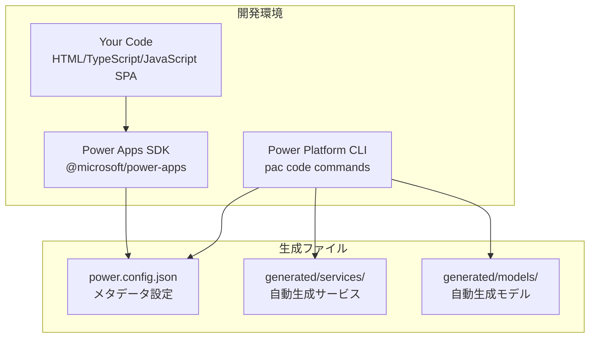

**Microsoft 公式アーキテクチャ構成要素:**

| コンポーネント | 説明 | 役割 |
|---------------|------|------|
| **Your Code** | HTML/TypeScript/JavaScript SPA | アプリケーションロジック・UI |
| **Power Apps SDK** | `@microsoft/power-apps` npm package | API提供・モデル/サービス管理 |
| **Power Platform CLI** | `pac code` コマンド群 | ビルド・デプロイ・データソース管理 |
| **power.config.json** | SDK生成メタデータファイル | Power Platform接続・公開情報 |
| **Generated Models/Services** | 自動生成TypeScriptファイル | コネクター用型定義・サービス |

### 実行時アーキテクチャ

**3層 Runtime 構成:**

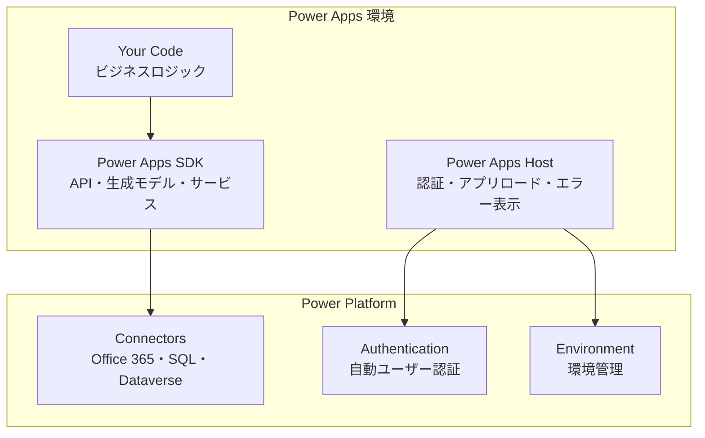

**実行時の責任分離:**

- **Power Apps Host**: エンドユーザー認証、アプリケーションロード、エラーメッセージ表示
- **Power Apps SDK**: API提供、生成されたモデル・サービス、Power Platform コネクター通信
- **Your Code**: ビジネスロジック、UI レンダリング、ユーザーインタラクション

### 推奨プロジェクト構造 (Microsoft 公式準拠)

```
code-app-project/
├── src/
│   ├── components/          # React UI コンポーネント
│   │   ├── ui/             # shadcn/ui プリミティブ
│   │   ├── layout/         # レイアウトコンポーネント
│   │   └── features/       # 機能固有コンポーネント
│   ├── generated/          # PAC CLI 自動生成 (編集禁止)
│   │   ├── models/         # TypeScript型定義
│   │   └── services/       # コネクターサービス
│   ├── hooks/              # カスタム React フック
│   ├── lib/                # ユーティリティライブラリ
│   ├── types/              # アプリ固有型定義
│   ├── data/               # 静的���ータ (開発用)
│   ├── App.tsx             # メインアプリケーション
│   ├── PowerProvider.tsx   # SDK 初期化プロバイダー
│   └── main.tsx            # エントリーポイント
├── public/                 # 静的アセット
├── power.config.json       # Power Platform 設定 (自動生成)
├── package.json            # npm 依存関係
├── vite.config.ts          # Vite ビルド設定
└── tailwind.config.js      # TailwindCSS 設定
```

**重要な設計原則:**

1. **SPA (Single Page Application) 必須**: Code Apps は SPA のみサポート
2. **SDK ファースト**: `@microsoft/power-apps` SDK による Power Platform 統合
3. **自動生成ファイル**: `generated/` フォルダは PAC CLI が管理（手動編集禁止）
4. **power.config.json**: SDK とCLI が使用する設定ファイル（アプリコードから直接操作しない）
5. **コネクター管理**: PAC CLI コマンドでデータソース追加・削除

### 推奨技術スタック

**必須技術 (Microsoft 公式サンプル準拠):**
- **@microsoft/power-apps**: Power Platform SDK (^0.3.1)
- **React 18**: フロントエンドフレームワーク
- **TypeScript**: 型安全性とコード品質
- **Vite**: 高速ビルドツールとデバッグ環境

**UI ライブラリ (テーマ対応パターン):**
- **shadcn/ui**: 高品質UIコンポーネント（Dialog, DropdownMenu など）
- **Radix UI**: アクセシブルなプリミティブ
- **Tailwind CSS**: ユーティリティファーストCSS + ダークモード対応
- **Lucide React**: 一貫したアイコンセット（Sun, Moon など）
- **tailwindcss-animate**: スムーズなテーマ切り替えアニメーション

**状態管理・データフェッチ:**
- **TanStack Query**: サーバ状態管理とキャッシュ
- **React Hook Form**: フォーム状態管理
- **Zod**: スキーマバリデーション

**開発ツール:**
- **ESLint**: コード品質チェック
- **Prettier**: コードフォーマット (推奨)
- **PostCSS**: CSS処理とTailwind統合

### 3.3 設計原則

**Power Apps Code Apps 特有の原則:**
1. **静的データファースト**: 実データ統合前のUI完成
2. **段階的コネクタ統合**: 静的 → モック → 実データ
3. **Power Platform ネイティブ**: SDK とコネクタ活用
4. **モーダル中心 UI**: ブラウザポップアップ不使用
5. **テーマ対応設計**: ダーク・ライト・システム設定切り替え
6. **レスポンシブデザイン**: デスクトップ・モバイル対応

**SOLID原則の適用:**
- **Single Responsibility**: コンポーネント単一責任
- **Open/Closed**: 拡張可能・変更閉鎖設計
- **Interface Segregation**: 小さく特化したhooks作成

### コネクタ統合・データ接続

#### 4.1 開発フロー (Power Apps Code Apps)

```mermaid
graph LR
    A[feature/*ブランチ作成] --> B[PowerProvider実装]
    B --> C[ローカル開発・テスト]
    C --> D[pac code push テスト]
    D --> E[基本機能実装]
    E --> F[コネクタ統合]
    F --> G[単体テスト]
    G --> H[コードレビュー]
    H --> I[develop統合]
    I --> J[結合テスト]
    J --> K[main統合]
    K --> L[Power Apps デプロイ]
```

**重要**: 
- PowerProvider の SDK 初期化が成功することを最初に確認
- `pac code run` でローカル動作確認後、機能開発開始
- コネクタは段階的に追加 (Office 365 → SQL → カスタム API)

### 4.2 コーディング規約

**TypeScript設定 (tsconfig.json)**
```json
{
  "compilerOptions": {
    "target": "es2020",
    "lib": ["dom", "dom.iterable", "es6"],
    "allowJs": true,
    "skipLibCheck": true,
    "esModuleInterop": true,
    "allowSyntheticDefaultImports": true,
    "strict": true,
    "forceConsistentCasingInFileNames": true,
    "noFallthroughCasesInSwitch": true,
    "module": "esnext",
    "moduleResolution": "node",
    "resolveJsonModule": true,
    "isolatedModules": true,
    "noEmit": true,
    "jsx": "react-jsx"
  }
}
```

**ESLint設定 (.eslintrc.json)**
```json
{
  "extends": [
    "react-app",
    "@typescript-eslint/recommended",
    "prettier"
  ],
  "rules": {
    "@typescript-eslint/no-unused-vars": "error",
    "react-hooks/exhaustive-deps": "warn",
    "prefer-const": "error"
  }
}
```

### テスト・デプロイ

#### 5.1 テスト戦略

**テストピラミッド**
```
        /\
       /  \ E2E テスト (5%)
      /    \ Playwright
     /______\ 
    /        \ 統合テスト (15%)
   /  React   \ React Testing Library
  /  Testing   \
 /   Library    \
/______________\ 単体テスト (80%)
     Jest      
```

**テスト種別と目標カバレッジ**
| テスト種別 | ツール | カバレッジ目標 |
|-----------|--------|---------------|
| 単体テスト | Jest | 80%以上 |
| 統合テスト | RTL | 70%以上 |
| E2Eテスト | Playwright | 主要フロー100% |

**Code Apps デプロイ:**
```bash
# ローカルテスト
npm run dev

# ビルド
npm run build

# Power Apps に Code Apps として公開
pac code push

jobs:
  build-and-test:
    runs-on: ubuntu-latest
    steps:
      - uses: actions/checkout@v4
      - uses: actions/setup-node@v4
        with:
          node-version: '18'
          cache: 'npm'
      
      - name: Install dependencies
        run: npm ci
      
      - name: Lint check
        run: npm run lint
      
      - name: Build application
        run: npm run build
      
      - name: Build development version
        run: npm run build:dev

  deploy:
    needs: build-and-test
    if: github.ref == 'refs/heads/main'
    runs-on: ubuntu-latest
    steps:
      - uses: actions/checkout@v4
      - uses: actions/setup-node@v4
        with:
          node-version: '18'
          cache: 'npm'
      
      - name: Install dependencies
        run: npm ci
      
      - name: Build for production
        run: npm run build
      
      - name: Install Power Platform CLI
        run: |
          npm install -g @microsoft/powerplatform-cli
      
      - name: Deploy to Power Apps (Code Apps として)
        run: |
          echo "Deploying as Code Apps (not PCF component)"
          pac code push
        env:
          POWERPLATFORM_TENANT_ID: ${{ secrets.POWERPLATFORM_TENANT_ID }}
          POWERPLATFORM_CLIENT_ID: ${{ secrets.POWERPLATFORM_CLIENT_ID }}
          POWERPLATFORM_CLIENT_SECRET: ${{ secrets.POWERPLATFORM_CLIENT_SECRET }}
```

**重要**: 
- `pac code push` で **Code Apps として** 自動デプロイ
- PCF 用の `pac pcf push` は使用しません

---

## 🎨 デザインシステム統合

> **参照**: デザインシステムの詳細設定は **Phase 2: UI基盤・デザインシステム・MVP構築** セクションの統合版をご確認ください。

**統一設定概要**:
- **shadcn/ui + TailwindCSS**: 推奨デザインシステム
- **Power Platform カラーパレット**: 公式ブランド色対応
- **ダークモード対応**: CSS変数による統合テーマ

**クイック参照**:
          100: '#dcfce7',
          500: '#22c55e',
          600: '#16a34a',
          900: '#14532d',
        },
        warning: {
          50: '#fffbeb',
          100: '#fef3c7',
          500: '#f59e0b',
          600: '#d97706',
          900: '#78350f',
        },
        error: {
          50: '#fef2f2',
          100: '#fee2e2',
          500: '#ef4444',
          600: '#dc2626',
          900: '#7f1d1d',
        },
        // UI カラー (shadcn/ui 準拠)
        background: 'hsl(var(--background))',
        foreground: 'hsl(var(--foreground))',
        card: 'hsl(var(--card))',
        'card-foreground': 'hsl(var(--card-foreground))',
        popover: 'hsl(var(--popover))',
        'popover-foreground': 'hsl(var(--popover-foreground))',
        primary: 'hsl(var(--primary))',
        'primary-foreground': 'hsl(var(--primary-foreground))',
        secondary: 'hsl(var(--secondary))',
        'secondary-foreground': 'hsl(var(--secondary-foreground))',
        muted: 'hsl(var(--muted))',
        'muted-foreground': 'hsl(var(--muted-foreground))',
        accent: 'hsl(var(--accent))',
        'accent-foreground': 'hsl(var(--accent-foreground))',
        destructive: 'hsl(var(--destructive))',
        'destructive-foreground': 'hsl(var(--destructive-foreground))',
        border: 'hsl(var(--border))',
        input: 'hsl(var(--input))',
        ring: 'hsl(var(--ring))',
      },
    },
  },
}
```

### タイポグラフィシステム

**フォント階層とスケール:**
```javascript
// tailwind.config.js
module.exports = {
  theme: {
    extend: {
      fontFamily: {
        sans: ['Inter', 'system-ui', 'sans-serif'],
        mono: ['JetBrains Mono', 'Menlo', 'Monaco', 'monospace'],
      },
      fontSize: {
        'xs': ['0.75rem', { lineHeight: '1rem' }],
        'sm': ['0.875rem', { lineHeight: '1.25rem' }],
        'base': ['1rem', { lineHeight: '1.5rem' }],
        'lg': ['1.125rem', { lineHeight: '1.75rem' }],
        'xl': ['1.25rem', { lineHeight: '1.75rem' }],
        '2xl': ['1.5rem', { lineHeight: '2rem' }],
        '3xl': ['1.875rem', { lineHeight: '2.25rem' }],
        '4xl': ['2.25rem', { lineHeight: '2.5rem' }],
        '5xl': ['3rem', { lineHeight: '1' }],
        '6xl': ['3.75rem', { lineHeight: '1' }],
      },
      fontWeight: {
        light: '300',
        normal: '400',
        medium: '500',
        semibold: '600',
        bold: '700',
        extrabold: '800',
      },
    },
  },
}
```

### スペーシング・グリッドシステム

**一貫したスペーシング:**
```css
/* カスタムスペーシングクラス */
.space-xs { @apply p-2; }      /* 8px */
.space-sm { @apply p-3; }      /* 12px */
.space-md { @apply p-4; }      /* 16px */
.space-lg { @apply p-6; }      /* 24px */
.space-xl { @apply p-8; }      /* 32px */
.space-2xl { @apply p-12; }    /* 48px */

/* マージンヘルパー */
.margin-xs { @apply m-2; }
.margin-sm { @apply m-3; }
.margin-md { @apply m-4; }
.margin-lg { @apply m-6; }
.margin-xl { @apply m-8; }

/* フレックス・グリッドヘルパー */
.flex-center { @apply flex items-center justify-center; }
.flex-between { @apply flex items-center justify-between; }
.flex-start { @apply flex items-center justify-start; }
.grid-responsive { @apply grid grid-cols-1 md:grid-cols-2 lg:grid-cols-3 xl:grid-cols-4 gap-6; }
```

### シャドウ・エレベーションシステム

**階層表現のためのシャドウ:**
```javascript
// tailwind.config.js
module.exports = {
  theme: {
    extend: {
      boxShadow: {
        'soft': '0 2px 4px rgba(0, 0, 0, 0.05)',
        'medium': '0 4px 6px rgba(0, 0, 0, 0.07)',
        'large': '0 10px 15px rgba(0, 0, 0, 0.1)',
        'xl': '0 20px 25px rgba(0, 0, 0, 0.15)',
        'inner-soft': 'inset 0 2px 4px rgba(0, 0, 0, 0.06)',
        'glow': '0 0 20px rgba(59, 130, 246, 0.15)',
        'glow-green': '0 0 20px rgba(34, 197, 94, 0.15)',
        'glow-red': '0 0 20px rgba(239, 68, 68, 0.15)',
      },
    },
  },
}
```

## 🎨 美しいデザインテンプレート

### カードコンポーネントテンプレート

**基本カード:**
```tsx
// components/ui/Card.tsx
import { cn } from "@/lib/utils";

interface CardProps {
  children: React.ReactNode;
  className?: string;
  variant?: 'default' | 'elevated' | 'outlined' | 'filled';
  padding?: 'none' | 'sm' | 'md' | 'lg';
}

export const Card: React.FC<CardProps> = ({
  children,
  className,
  variant = 'default',
  padding = 'md'
}) => {
  return (
    <div className={cn(
      // 基本スタイル
      "bg-card text-card-foreground rounded-lg border transition-all duration-200",
      
      // バリアント
      {
        'border-border shadow-soft hover:shadow-medium': variant === 'default',
        'border-border shadow-large hover:shadow-xl': variant === 'elevated',
        'border-2 border-primary/20 shadow-none': variant === 'outlined',
        'bg-primary/5 border-primary/20': variant === 'filled',
      },
      
      // パディング
      {
        'p-0': padding === 'none',
        'p-3': padding === 'sm',
        'p-6': padding === 'md',
        'p-8': padding === 'lg',
      },
      
      className
    )}>
      {children}
    </div>
  );
};
```

**統計カードテンプレート:**
```tsx
// components/ui/StatCard.tsx
import { LucideIcon } from 'lucide-react';
import { Card } from '@/components/ui/Card';

interface StatCardProps {
  title: string;
  value: string | number;
  change?: string;
  changeType?: 'positive' | 'negative' | 'neutral';
  icon: LucideIcon;
  description?: string;
}

export const StatCard: React.FC<StatCardProps> = ({
  title,
  value,
  change,
  changeType = 'neutral',
  icon: Icon,
  description
}) => {
  return (
    <Card variant="elevated" className="hover:scale-105 transition-transform">
      <div className="flex items-start justify-between">
        <div className="space-y-2">
          <p className="text-sm font-medium text-muted-foreground">{title}</p>
          <p className="text-3xl font-bold text-foreground">{value}</p>
          {change && (
            <div className={cn(
              "text-sm font-medium flex items-center space-x-1",
              {
                'text-success-600': changeType === 'positive',
                'text-error-600': changeType === 'negative',
                'text-muted-foreground': changeType === 'neutral',
              }
            )}>
              <span>{change}</span>
            </div>
          )}
          {description && (
            <p className="text-xs text-muted-foreground">{description}</p>
          )}
        </div>
        <div className="p-3 bg-primary/10 rounded-lg">
          <Icon className="h-6 w-6 text-primary" />
        </div>
      </div>
    </Card>
  );
};
```

### データ表示テンプレート

**美しいテーブルテンプレート:**
```tsx
// components/ui/DataTable.tsx
import {
  Table,
  TableBody,
  TableCell,
  TableHead,
  TableHeader,
  TableRow,
} from "@/components/ui/table";
import { Card } from "@/components/ui/Card";
import { Button } from "@/components/ui/button";
import { Badge } from "@/components/ui/badge";
import { Input } from "@/components/ui/input";
import { Search, Filter, MoreHorizontal } from "lucide-react";
import {
  DropdownMenu,
  DropdownMenuContent,
  DropdownMenuItem,
  DropdownMenuTrigger,
} from "@/components/ui/dropdown-menu";

interface Column {
  key: string;
  label: string;
  sortable?: boolean;
  render?: (value: any, row: any) => React.ReactNode;
}

interface DataTableProps {
  data: any[];
  columns: Column[];
  searchable?: boolean;
  searchPlaceholder?: string;
  actions?: (row: any) => React.ReactNode;
  onRowClick?: (row: any) => void;
}

export const DataTable: React.FC<DataTableProps> = ({
  data,
  columns,
  searchable = true,
  searchPlaceholder = "検索...",
  actions,
  onRowClick
}) => {
  const [search, setSearch] = React.useState("");
  
  const filteredData = React.useMemo(() => {
    if (!search) return data;
    return data.filter(row => 
      Object.values(row).some(value => 
        String(value).toLowerCase().includes(search.toLowerCase())
      )
    );
  }, [data, search]);

  return (
    <Card className="w-full">
      {/* ヘッダー */}
      {searchable && (
        <div className="p-6 border-b border-border">
          <div className="flex items-center space-x-4">
            <div className="relative flex-1">
              <Search className="absolute left-3 top-3 h-4 w-4 text-muted-foreground" />
              <Input
                placeholder={searchPlaceholder}
                value={search}
                onChange={(e) => setSearch(e.target.value)}
                className="pl-10 bg-background"
              />
            </div>
            <Button variant="outline" className="space-x-2">
              <Filter className="h-4 w-4" />
              <span>フィルター</span>
            </Button>
          </div>
        </div>
      )}

      {/* テーブル */}
      <div className="overflow-x-auto">
        <Table>
          <TableHeader>
            <TableRow className="bg-muted/50">
              {columns.map((column) => (
                <TableHead key={column.key} className="font-semibold">
                  {column.label}
                </TableHead>
              ))}
              {actions && <TableHead className="w-12"></TableHead>}
            </TableRow>
          </TableHeader>
          <TableBody>
            {filteredData.map((row, index) => (
              <TableRow 
                key={index}
                className={`hover:bg-muted/50 transition-colors ${
                  onRowClick ? 'cursor-pointer' : ''
                }`}
                onClick={() => onRowClick?.(row)}
              >
                {columns.map((column) => (
                  <TableCell key={column.key}>
                    {column.render ? 
                      column.render(row[column.key], row) : 
                      row[column.key]
                    }
                  </TableCell>
                ))}
                {actions && (
                  <TableCell>
                    <DropdownMenu>
                      <DropdownMenuTrigger asChild>
                        <Button variant="ghost" size="icon">
                          <MoreHorizontal className="h-4 w-4" />
                        </Button>
                      </DropdownMenuTrigger>
                      <DropdownMenuContent align="end">
                        {actions(row)}
                      </DropdownMenuContent>
                    </DropdownMenu>
                  </TableCell>
                )}
              </TableRow>
            ))}
          </TableBody>
        </Table>
      </div>

      {/* フッター */}
      {filteredData.length === 0 && (
        <div className="p-12 text-center">
          <p className="text-muted-foreground">データがありません</p>
        </div>
      )}
    </Card>
  );
};
```

**リストアイテムテンプレート:**
```tsx
// components/ui/ListItem.tsx
import { Card } from "@/components/ui/Card";
import { Avatar, AvatarFallback, AvatarImage } from "@/components/ui/avatar";
import { Badge } from "@/components/ui/badge";
import { Button } from "@/components/ui/button";
import { ChevronRight } from "lucide-react";

interface ListItemProps {
  avatar?: string;
  fallback?: string;
  title: string;
  subtitle?: string;
  description?: string;
  status?: {
    text: string;
    variant?: 'default' | 'secondary' | 'destructive' | 'outline';
  };
  actions?: React.ReactNode;
  onClick?: () => void;
}

export const ListItem: React.FC<ListItemProps> = ({
  avatar,
  fallback,
  title,
  subtitle,
  description,
  status,
  actions,
  onClick
}) => {
  return (
    <Card 
      className={`hover:shadow-medium transition-all ${onClick ? 'cursor-pointer' : ''}`}
      onClick={onClick}
    >
      <div className="flex items-center space-x-4">
        {/* アバター */}
        {(avatar || fallback) && (
          <Avatar className="h-12 w-12">
            <AvatarImage src={avatar} alt={title} />
            <AvatarFallback className="bg-primary/10 text-primary font-medium">
              {fallback}
            </AvatarFallback>
          </Avatar>
        )}

        {/* コンテンツ */}
        <div className="flex-1 space-y-1">
          <div className="flex items-center justify-between">
            <h3 className="font-semibold text-foreground">{title}</h3>
            {status && (
              <Badge variant={status.variant || 'default'}>
                {status.text}
              </Badge>
            )}
          </div>
          {subtitle && (
            <p className="text-sm text-primary font-medium">{subtitle}</p>
          )}
          {description && (
            <p className="text-sm text-muted-foreground">{description}</p>
          )}
        </div>

        {/* アクション */}
        <div className="flex items-center space-x-2">
          {actions}
          {onClick && (
            <ChevronRight className="h-5 w-5 text-muted-foreground" />
          )}
        </div>
      </div>
    </Card>
  );
};
```

### ダッシュボード・レイアウトテンプレート

**統計カード（KPI表示）:**
```tsx
// components/ui/StatsCard.tsx
import { Card } from "@/components/ui/Card";
import { Badge } from "@/components/ui/badge";
import { TrendingUp, TrendingDown, Minus } from "lucide-react";

interface StatsCardProps {
  title: string;
  value: string | number;
  change?: {
    value: number;
    type: 'increase' | 'decrease' | 'neutral';
    period?: string;
  };
  description?: string;
  icon?: React.ReactNode;
}

export const StatsCard: React.FC<StatsCardProps> = ({
  title,
  value,
  change,
  description,
  icon
}) => {
  const getTrendIcon = () => {
    if (!change) return null;
    switch (change.type) {
      case 'increase':
        return <TrendingUp className="h-4 w-4 text-green-500" />;
      case 'decrease':
        return <TrendingDown className="h-4 w-4 text-red-500" />;
      default:
        return <Minus className="h-4 w-4 text-muted-foreground" />;
    }
  };

  const getChangeColor = () => {
    if (!change) return '';
    switch (change.type) {
      case 'increase':
        return 'text-green-600 bg-green-50 dark:bg-green-900/20';
      case 'decrease':
        return 'text-red-600 bg-red-50 dark:bg-red-900/20';
      default:
        return 'text-muted-foreground bg-muted';
    }
  };

  return (
    <Card>
      <div className="flex items-center justify-between">
        <div>
          <p className="text-sm font-medium text-muted-foreground">{title}</p>
          <div className="flex items-baseline space-x-2">
            <h3 className="text-2xl font-bold text-foreground">{value}</h3>
            {change && (
              <div className={`flex items-center space-x-1 px-2 py-1 rounded-full text-xs font-medium ${getChangeColor()}`}>
                {getTrendIcon()}
                <span>{change.value > 0 ? '+' : ''}{change.value}%</span>
              </div>
            )}
          </div>
          {description && (
            <p className="text-sm text-muted-foreground mt-1">{description}</p>
          )}
          {change?.period && (
            <p className="text-xs text-muted-foreground mt-1">{change.period}</p>
          )}
        </div>
        {icon && (
          <div className="flex-shrink-0 p-3 bg-primary/10 rounded-lg">
            {icon}
          </div>
        )}
      </div>
    </Card>
  );
};
```

**グリッドレイアウト:**
```tsx
// components/layout/DashboardGrid.tsx
import { DollarSign, Users, TrendingUp, Activity } from "lucide-react";

export const DashboardGrid: React.FC<{ children: React.ReactNode }> = ({ children }) => {
  return (
    <div className="grid grid-cols-1 md:grid-cols-2 lg:grid-cols-3 xl:grid-cols-4 gap-6">
      {children}
    </div>
  );
};

// 使用例
<DashboardGrid>
  <StatsCard
    title="総売上"
    value="¥1,234,567"
    change={{ value: 12.5, type: 'increase', period: '前月比' }}
    icon={<DollarSign className="h-6 w-6 text-primary" />}
  />
  <StatsCard
    title="新規顧客"
    value="156"
    change={{ value: -2.1, type: 'decrease', period: '前週比' }}
    icon={<Users className="h-6 w-6 text-primary" />}
  />
</DashboardGrid>
```

**チャート・グラフエリア:**
```tsx
// components/ui/ChartContainer.tsx
import { Card } from "@/components/ui/Card";

interface ChartContainerProps {
  title: string;
  subtitle?: string;
  children: React.ReactNode;
  actions?: React.ReactNode;
}

export const ChartContainer: React.FC<ChartContainerProps> = ({
  title,
  subtitle,
  children,
  actions
}) => {
  return (
    <Card className="col-span-full lg:col-span-2">
      <div className="flex items-center justify-between mb-6">
        <div>
          <h3 className="text-lg font-semibold text-foreground">{title}</h3>
          {subtitle && (
            <p className="text-sm text-muted-foreground">{subtitle}</p>
          )}
        </div>
        {actions && <div className="flex space-x-2">{actions}</div>}
      </div>
      <div className="h-64 md:h-80">
        {children}
      </div>
    </Card>
  );
};
```

### ヘッダー・レイアウトテンプレート

**アプリケーションヘッダー（プロフィール・ハンバーガーメニュー付き）:**
```tsx
// components/layout/AppHeader.tsx
import { useState } from 'react';
import { Button } from '@/components/ui/button';
import { Avatar, AvatarFallback, AvatarImage } from '@/components/ui/avatar';
import {
  DropdownMenu,
  DropdownMenuContent,
  DropdownMenuItem,
  DropdownMenuLabel,
  DropdownMenuSeparator,
  DropdownMenuTrigger,
} from '@/components/ui/dropdown-menu';
import { Badge } from '@/components/ui/badge';
import { useCurrentUser } from '@/hooks/useCurrentUser';
import { useTheme } from '@/hooks/useTheme';
import { 
  Menu, 
  Settings, 
  LogOut, 
  Sun, 
  Moon, 
  Monitor,
  User,
  Bell,
  Search
} from 'lucide-react';
import { Input } from '@/components/ui/input';

interface AppHeaderProps {
  onMenuToggle: () => void;
  title: string;
  showSearch?: boolean;
  notifications?: number;
}

export const AppHeader: React.FC<AppHeaderProps> = ({
  onMenuToggle,
  title,
  showSearch = true,
  notifications = 0
}) => {
  const { data: user } = useCurrentUser();
  const { theme, setTheme } = useTheme();
  const [searchQuery, setSearchQuery] = useState('');

  const getThemeIcon = () => {
    switch (theme) {
      case 'light': return <Sun className="h-4 w-4" />;
      case 'dark': return <Moon className="h-4 w-4" />;
      default: return <Monitor className="h-4 w-4" />;
    }
  };

  const getUserInitials = () => {
    if (!user?.displayName) return 'U';
    const names = user.displayName.split(' ');
    return names.length >= 2 
      ? `${names[0][0]}${names[names.length - 1][0]}`
      : names[0][0];
  };

  return (
    <header className="sticky top-0 z-50 w-full border-b border-border bg-background/95 backdrop-blur supports-[backdrop-filter]:bg-background/60">
      <div className="flex h-16 items-center px-4 gap-4">
        {/* ハンバーガーメニュー */}
        <Button
          variant="ghost"
          size="icon"
          onClick={onMenuToggle}
          className="md:hidden"
        >
          <Menu className="h-5 w-5" />
        </Button>

        {/* アプリタイトル */}
        <div className="flex items-center space-x-2">
          <h1 className="text-lg font-semibold text-foreground">{title}</h1>
        </div>

        {/* 検索バー（中央） */}
        {showSearch && (
          <div className="flex-1 max-w-sm mx-4">
            <div className="relative">
              <Search className="absolute left-3 top-3 h-4 w-4 text-muted-foreground" />
              <Input
                placeholder="検索..."
                value={searchQuery}
                onChange={(e) => setSearchQuery(e.target.value)}
                className="pl-10 bg-muted/50"
              />
            </div>
          </div>
        )}

        {/* 右側メニュー */}
        <div className="flex items-center space-x-2 ml-auto">
          {/* 通知ベル */}
          <Button variant="ghost" size="icon" className="relative">
            <Bell className="h-5 w-5" />
            {notifications > 0 && (
              <Badge 
                variant="destructive" 
                className="absolute -top-1 -right-1 h-5 w-5 flex items-center justify-center text-xs p-0"
              >
                {notifications > 9 ? '9+' : notifications}
              </Badge>
            )}
          </Button>

          {/* テーマ切り替え */}
          <DropdownMenu>
            <DropdownMenuTrigger asChild>
              <Button variant="ghost" size="icon">
                {getThemeIcon()}
              </Button>
            </DropdownMenuTrigger>
            <DropdownMenuContent align="end">
              <DropdownMenuItem onClick={() => setTheme('light')}>
                <Sun className="mr-2 h-4 w-4" />
                ライト
              </DropdownMenuItem>
              <DropdownMenuItem onClick={() => setTheme('dark')}>
                <Moon className="mr-2 h-4 w-4" />
                ダーク
              </DropdownMenuItem>
              <DropdownMenuItem onClick={() => setTheme('system')}>
                <Monitor className="mr-2 h-4 w-4" />
                システム
              </DropdownMenuItem>
            </DropdownMenuContent>
          </DropdownMenu>

          {/* ユーザープロフィール */}
          <DropdownMenu>
            <DropdownMenuTrigger asChild>
              <Button variant="ghost" className="relative h-8 w-8 rounded-full">
                <Avatar className="h-8 w-8">
                  <AvatarImage src={user?.photoUrl} alt={user?.displayName} />
                  <AvatarFallback className="bg-primary/10 text-primary font-medium">
                    {getUserInitials()}
                  </AvatarFallback>
                </Avatar>
              </Button>
            </DropdownMenuTrigger>
            <DropdownMenuContent className="w-56" align="end" forceMount>
              <DropdownMenuLabel className="font-normal">
                <div className="flex flex-col space-y-1">
                  <p className="text-sm font-medium leading-none">
                    {user?.displayName || 'ゲストユーザー'}
                  </p>
                  <p className="text-xs leading-none text-muted-foreground">
                    {user?.mail || 'guest@example.com'}
                  </p>
                  {user?.jobTitle && (
                    <p className="text-xs leading-none text-muted-foreground">
                      {user.jobTitle}
                    </p>
                  )}
                </div>
              </DropdownMenuLabel>
              <DropdownMenuSeparator />
              <DropdownMenuItem>
                <User className="mr-2 h-4 w-4" />
                プロフィール
              </DropdownMenuItem>
              <DropdownMenuItem>
                <Settings className="mr-2 h-4 w-4" />
                設定
              </DropdownMenuItem>
              <DropdownMenuSeparator />
              <DropdownMenuItem className="text-red-600">
                <LogOut className="mr-2 h-4 w-4" />
                ログアウト
              </DropdownMenuItem>
            </DropdownMenuContent>
          </DropdownMenu>
        </div>
      </div>
    </header>
  );
};
```

**アプリケーションレイアウト:**
```tsx
// components/layout/AppLayout.tsx
import { useState } from 'react';
import { AppHeader } from './AppHeader';
import { AppSidebar } from './AppSidebar';
import { cn } from '@/lib/utils';

interface AppLayoutProps {
  children: React.ReactNode;
  title: string;
  sidebarItems: SidebarItem[];
}

export const AppLayout: React.FC<AppLayoutProps> = ({
  children,
  title,
  sidebarItems
}) => {
  const [sidebarOpen, setSidebarOpen] = useState(false);
  const [sidebarCollapsed, setSidebarCollapsed] = useState(false);

  return (
    <div className="min-h-screen bg-background">
      {/* ヘッダー */}
      <AppHeader
        title={title}
        onMenuToggle={() => setSidebarOpen(!sidebarOpen)}
      />

      <div className="flex h-[calc(100vh-4rem)]">
        {/* サイドバー（デスクトップ） */}
        <aside className={cn(
          "hidden md:flex flex-col border-r border-border bg-card transition-all duration-300",
          sidebarCollapsed ? "w-16" : "w-64"
        )}>
          <AppSidebar
            items={sidebarItems}
            collapsed={sidebarCollapsed}
            onToggleCollapse={() => setSidebarCollapsed(!sidebarCollapsed)}
          />
        </aside>

        {/* モバイルサイドバーオーバーレイ */}
        {sidebarOpen && (
          <div className="fixed inset-0 z-50 md:hidden">
            <div 
              className="absolute inset-0 bg-black/20 backdrop-blur-sm"
              onClick={() => setSidebarOpen(false)}
            />
            <aside className="absolute left-0 top-0 h-full w-64 border-r border-border bg-card">
              <AppSidebar
                items={sidebarItems}
                onItemSelect={() => setSidebarOpen(false)}
              />
            </aside>
          </div>
        )}

        {/* メインコンテンツ */}
        <main className="flex-1 overflow-auto">
          <div className="container mx-auto p-6">
            {children}
          </div>
        </main>
      </div>
    </div>
  );
};
```

**レスポンシブサイドバー:**
```tsx
// components/layout/AppSidebar.tsx
import { useState } from 'react';
import { Button } from '@/components/ui/button';
import { ScrollArea } from '@/components/ui/scroll-area';
import { Badge } from '@/components/ui/badge';
import { cn } from '@/lib/utils';
import { ChevronLeft, ChevronRight } from 'lucide-react';

export interface SidebarItem {
  id: string;
  label: string;
  icon: React.ReactNode;
  href?: string;
  badge?: string;
  children?: SidebarItem[];
}

interface AppSidebarProps {
  items: SidebarItem[];
  collapsed?: boolean;
  activeItem?: string;
  onItemSelect?: (id: string) => void;
  onToggleCollapse?: () => void;
}

export const AppSidebar: React.FC<AppSidebarProps> = ({
  items,
  collapsed = false,
  activeItem,
  onItemSelect,
  onToggleCollapse
}) => {
  const [expandedItems, setExpandedItems] = useState<string[]>([]);

  const toggleExpanded = (itemId: string) => {
    setExpandedItems(prev =>
      prev.includes(itemId)
        ? prev.filter(id => id !== itemId)
        : [...prev, itemId]
    );
  };

  const handleItemClick = (item: SidebarItem) => {
    if (item.children) {
      toggleExpanded(item.id);
    } else {
      onItemSelect?.(item.id);
    }
  };

  return (
    <div className="flex flex-col h-full">
      {/* サイドバーヘッダー */}
      <div className="flex items-center justify-between p-4 border-b border-border">
        {!collapsed && (
          <h2 className="text-lg font-semibold text-foreground">メニュー</h2>
        )}
        {onToggleCollapse && (
          <Button
            variant="ghost"
            size="icon"
            onClick={onToggleCollapse}
            className="h-8 w-8"
          >
            {collapsed ? (
              <ChevronRight className="h-4 w-4" />
            ) : (
              <ChevronLeft className="h-4 w-4" />
            )}
          </Button>
        )}
      </div>

      {/* ナビゲーションメニュー */}
      <ScrollArea className="flex-1">
        <nav className="space-y-2 p-4">
          {items.map((item) => (
            <SidebarMenuItem
              key={item.id}
              item={item}
              collapsed={collapsed}
              isActive={activeItem === item.id}
              isExpanded={expandedItems.includes(item.id)}
              onSelect={() => handleItemClick(item)}
            />
          ))}
        </nav>
      </ScrollArea>
    </div>
  );
};

const SidebarMenuItem: React.FC<{
  item: SidebarItem;
  collapsed: boolean;
  isActive: boolean;
  isExpanded: boolean;
  onSelect: () => void;
}> = ({ item, collapsed, isActive, isExpanded, onSelect }) => {
  return (
    <div>
      <Button
        variant={isActive ? "default" : "ghost"}
        className={cn(
          "w-full justify-start space-x-3 h-10",
          collapsed && "px-3 justify-center"
        )}
        onClick={onSelect}
      >
        <span className="flex-shrink-0">{item.icon}</span>
        {!collapsed && (
          <>
            <span className="truncate flex-1 text-left">{item.label}</span>
            {item.badge && (
              <Badge variant="secondary" className="text-xs">
                {item.badge}
              </Badge>
            )}
          </>
        )}
      </Button>

      {/* サブメニュー */}
      {!collapsed && item.children && isExpanded && (
        <div className="ml-6 mt-2 space-y-1">
          {item.children.map((child) => (
            <Button
              key={child.id}
              variant="ghost"
              className="w-full justify-start text-sm h-8"
              onClick={() => onSelect()}
            >
              <span className="flex-shrink-0 mr-3">{child.icon}</span>
              <span className="truncate">{child.label}</span>
            </Button>
          ))}
        </div>
      )}
    </div>
  );
};
```

**レイアウト使用例（メインページ）:**
```tsx
// src/pages/Index.tsx - レイアウト統合例
import { AppLayout } from '@/components/layout/AppLayout';
import { DashboardGrid } from '@/components/layout/DashboardGrid';
import { StatsCard } from '@/components/ui/StatsCard';
import { useCurrentUser } from '@/hooks/useCurrentUser';
import { 
  Home, 
  Users, 
  Settings, 
  FileText, 
  BarChart,
  DollarSign,
  TrendingUp 
} from 'lucide-react';

const sidebarItems = [
  {
    id: 'dashboard',
    label: 'ダッシュボード',
    icon: <Home className="h-4 w-4" />,
  },
  {
    id: 'users',
    label: 'ユーザー管理',
    icon: <Users className="h-4 w-4" />,
    badge: '12',
  },
  {
    id: 'reports',
    label: 'レポート',
    icon: <BarChart className="h-4 w-4" />,
    children: [
      {
        id: 'sales-report',
        label: '売上レポート',
        icon: <DollarSign className="h-4 w-4" />,
      },
      {
        id: 'analytics',
        label: 'アナリティクス',
        icon: <TrendingUp className="h-4 w-4" />,
      }
    ]
  },
  {
    id: 'documents',
    label: 'ドキュメント',
    icon: <FileText className="h-4 w-4" />,
  },
  {
    id: 'settings',
    label: '設定',
    icon: <Settings className="h-4 w-4" />,
  },
];

export default function Index() {
  const { data: user, isLoading } = useCurrentUser();

  if (isLoading) {
    return <div className="flex items-center justify-center min-h-screen">読み込み中...</div>;
  }

  return (
    <AppLayout title="Power Apps Code Apps" sidebarItems={sidebarItems}>
      {/* ウェルカムメッセージ */}
      <div className="mb-8">
        <h1 className="text-3xl font-bold text-foreground mb-2">
          おかえりなさい、{user?.displayName || 'ゲスト'}さん
        </h1>
        <p className="text-muted-foreground">
          今日も一日よろしくお願いします。
        </p>
      </div>

      {/* KPIダッシュボード */}
      <DashboardGrid>
        <StatsCard
          title="総売上"
          value="¥1,234,567"
          change={{ value: 12.5, type: 'increase', period: '前月比' }}
          icon={<DollarSign className="h-6 w-6 text-primary" />}
        />
        <StatsCard
          title="新規顧客"
          value="156"
          change={{ value: -2.1, type: 'decrease', period: '前週比' }}
          icon={<Users className="h-6 w-6 text-primary" />}
        />
        <StatsCard
          title="完了タスク"
          value="89%"
          change={{ value: 5.3, type: 'increase', period: '今月' }}
          icon={<TrendingUp className="h-6 w-6 text-primary" />}
        />
        <StatsCard
          title="アクティブユーザー"
          value="1,423"
          description="オンライン: 234"
          icon={<BarChart className="h-6 w-6 text-primary" />}
        />
      </DashboardGrid>

      {/* その他のコンテンツ */}
      <div className="mt-8 grid grid-cols-1 lg:grid-cols-2 gap-6">
        {/* 追加のダッシュボードコンテンツ */}
      </div>
    </AppLayout>
  );
}
```

**App.tsx での統合:**
```tsx
// src/App.tsx - レイアウト統合版
import { Toaster } from "@/components/ui/toaster";
import { Toaster as Sonner } from "@/components/ui/sonner";
import { TooltipProvider } from "@/components/ui/tooltip";
import { QueryClient, QueryClientProvider } from "@tanstack/react-query";
import { ThemeProvider } from "@/components/theme/ThemeContext";
import Index from "./pages/Index";

const queryClient = new QueryClient();

const App = () => (
  <QueryClientProvider client={queryClient}>
    <ThemeProvider>
      <TooltipProvider>
        <Toaster />
        <Sonner />
        <Index />
      </TooltipProvider>
    </ThemeProvider>
  </QueryClientProvider>
);

export default App;
```

### ナビゲーションテンプレート

**美しいサイドバーナビゲーション:**
```tsx
// components/layout/Sidebar.tsx
import { cn } from "@/lib/utils";
import { Button } from "@/components/ui/button";
import { ScrollArea } from "@/components/ui/scroll-area";
import { LucideIcon } from "lucide-react";

interface SidebarItem {
  id: string;
  label: string;
  icon: LucideIcon;
  href?: string;
  badge?: string;
  children?: SidebarItem[];
}

interface SidebarProps {
  items: SidebarItem[];
  activeItem: string;
  onItemSelect: (id: string) => void;
  collapsed?: boolean;
}

export const Sidebar: React.FC<SidebarProps> = ({
  items,
  activeItem,
  onItemSelect,
  collapsed = false
}) => {
  return (
    <div className={cn(
      "bg-card border-r border-border transition-all duration-300",
      collapsed ? "w-16" : "w-64"
    )}>
      <ScrollArea className="h-full">
        <nav className="space-y-2 p-4">
          {items.map((item) => (
            <SidebarItem
              key={item.id}
              item={item}
              isActive={activeItem === item.id}
              onSelect={onItemSelect}
              collapsed={collapsed}
            />
          ))}
        </nav>
      </ScrollArea>
    </div>
  );
};

const SidebarItem: React.FC<{
  item: SidebarItem;
  isActive: boolean;
  onSelect: (id: string) => void;
  collapsed: boolean;
}> = ({ item, isActive, onSelect, collapsed }) => {
  const Icon = item.icon;
  
  return (
    <Button
      variant={isActive ? "default" : "ghost"}
      className={cn(
        "w-full justify-start space-x-3",
        collapsed && "px-3"
      )}
      onClick={() => onSelect(item.id)}
    >
      <Icon className="h-4 w-4 flex-shrink-0" />
      {!collapsed && (
        <>
          <span className="truncate">{item.label}</span>
          {item.badge && (
            <span className="ml-auto bg-primary/20 text-primary text-xs px-2 py-1 rounded-full">
              {item.badge}
            </span>
          )}
        </>
      )}
    </Button>
  );
};
```

### フォームテンプレート

**美しいフォームレイアウト:**
```tsx
// components/ui/FormTemplate.tsx
import { Card } from "@/components/ui/Card";
import { Button } from "@/components/ui/button";
import { Input } from "@/components/ui/input";
import { Label } from "@/components/ui/label";
import { Textarea } from "@/components/ui/textarea";

interface FormFieldProps {
  label: string;
  error?: string;
  required?: boolean;
  children: React.ReactNode;
}

export const FormField: React.FC<FormFieldProps> = ({
  label,
  error,
  required,
  children
}) => {
  return (
    <div className="space-y-2">
      <Label className="text-sm font-medium text-foreground">
        {label}
        {required && <span className="text-error-500 ml-1">*</span>}
      </Label>
      {children}
      {error && (
        <p className="text-sm text-error-500">{error}</p>
      )}
    </div>
  );
};

export const FormTemplate: React.FC<{
  title: string;
  description?: string;
  children: React.ReactNode;
  actions: React.ReactNode;
}> = ({ title, description, children, actions }) => {
  return (
    <Card variant="elevated" padding="lg" className="max-w-2xl mx-auto">
      <div className="space-y-6">
        {/* ヘッダー */}
        <div className="space-y-2">
          <h2 className="text-2xl font-bold text-foreground">{title}</h2>
          {description && (
            <p className="text-muted-foreground">{description}</p>
          )}
        </div>
        
        {/* フォームフィールド */}
        <div className="space-y-6">
          {children}
        </div>
        
        {/* アクション */}
        <div className="flex justify-end space-x-3 pt-4 border-t border-border">
          {actions}
        </div>
      </div>
    </Card>
  );
};
```

## 🎨 UI インタラクション設計

### モーダル優先設計ガイドライン

**🚨 重要方針: ポップアップ禁止、モーダル必須使用**

Code Apps では、ユーザー体験の一貫性、アクセシビリティ、デザインの統一性を確保するため、**すべてのポップアップ系UIを禁止**し、TailwindCSS + shadcn/ui ベースの美しいモーダルコンポーネントを必須使用します。

**❌ 絶対に使用禁止:**
- `window.alert()`
- `window.confirm()`
- `window.prompt()`
- ブラウザネイティブダイアログ
- サードパーティポップアップライブラリ

**✅ 必須使用:**
- shadcn/ui Dialog コンポーネント
- TailwindCSS による美しいスタイリング
- アクセシブルなモーダル実装
- 一貫したデザインシステム

#### モーダル実装例

**基本的なモーダル実装:**
```typescript
// components/ui/modal.tsx (shadcn/ui ベース)
import {
  Dialog,
  DialogContent,
  DialogDescription,
  DialogFooter,
  DialogHeader,
  DialogTitle,
  DialogTrigger,
} from "@/components/ui/dialog";
import { Button } from "@/components/ui/button";

interface ModalProps {
  isOpen: boolean;
  onClose: () => void;
  title: string;
  children: React.ReactNode;
  actions?: React.ReactNode;
}

export const Modal: React.FC<ModalProps> = ({
  isOpen,
  onClose,
  title,
  children,
  actions
}) => {
  return (
    <Dialog open={isOpen} onOpenChange={onClose}>
      <DialogContent className="sm:max-w-md">
        <DialogHeader>
          <DialogTitle>{title}</DialogTitle>
        </DialogHeader>
        <div className="py-4">
          {children}
        </div>
        {actions && (
          <DialogFooter>
            {actions}
          </DialogFooter>
        )}
      </DialogContent>
    </Dialog>
  );
};
```

**確認モーダルの実装例:**
```typescript
// components/ConfirmationModal.tsx
import { Modal } from "@/components/ui/modal";
import { Button } from "@/components/ui/button";

interface ConfirmationModalProps {
  isOpen: boolean;
  onClose: () => void;
  onConfirm: () => void;
  title: string;
  message: string;
  confirmText?: string;
  cancelText?: string;
}

export const ConfirmationModal: React.FC<ConfirmationModalProps> = ({
  isOpen,
  onClose,
  onConfirm,
  title,
  message,
  confirmText = "確認",
  cancelText = "キャンセル"
}) => {
  const handleConfirm = () => {
    onConfirm();
    onClose();
  };

  return (
    <Modal
      isOpen={isOpen}
      onClose={onClose}
      title={title}
      actions={
        <>
          <Button variant="outline" onClick={onClose}>
            {cancelText}
          </Button>
          <Button onClick={handleConfirm}>
            {confirmText}
          </Button>
        </>
      }
    >
      <p className="text-sm text-muted-foreground">{message}</p>
    </Modal>
  );
};
```

**美しいフォームモーダルテンプレート:**
```typescript
// components/FormModal.tsx
import {
  Dialog,
  DialogContent,
  DialogDescription,
  DialogFooter,
  DialogHeader,
  DialogTitle,
} from "@/components/ui/dialog";
import { Button } from "@/components/ui/button";
import { Input } from "@/components/ui/input";
import { Label } from "@/components/ui/label";
import { Badge } from "@/components/ui/badge";
import { useForm } from "react-hook-form";
import { User, Mail, Phone } from "lucide-react";

interface FormModalProps {
  isOpen: boolean;
  onClose: () => void;
  onSubmit: (data: any) => void;
  title: string;
  description?: string;
}

export const FormModal: React.FC<FormModalProps> = ({
  isOpen,
  onClose,
  onSubmit,
  title,
  description
}) => {
  const { register, handleSubmit, reset, formState: { errors } } = useForm();

  const handleFormSubmit = (data: any) => {
    onSubmit(data);
    reset();
    onClose();
  };

  return (
    <Dialog open={isOpen} onOpenChange={onClose}>
      <DialogContent className="sm:max-w-md bg-card border-border shadow-xl">
        <DialogHeader className="space-y-3">
          <DialogTitle className="text-xl font-semibold text-foreground flex items-center space-x-2">
            <User className="h-5 w-5 text-primary" />
            <span>{title}</span>
          </DialogTitle>
          {description && (
            <DialogDescription className="text-muted-foreground">
              {description}
            </DialogDescription>
          )}
        </DialogHeader>
        
        <form onSubmit={handleSubmit(handleFormSubmit)} className="space-y-6">
          {/* 名前フィールド */}
          <div className="space-y-2">
            <Label htmlFor="name" className="text-sm font-medium text-foreground">
              名前 <Badge variant="destructive" className="ml-1 text-xs">必須</Badge>
            </Label>
            <div className="relative">
              <User className="absolute left-3 top-3 h-4 w-4 text-muted-foreground" />
              <Input
                id="name"
                {...register("name", { required: "名前は必須です" })}
                placeholder="田中太郎"
                className="pl-10 bg-background border-input focus:border-primary focus:ring-2 focus:ring-primary/20"
              />
            </div>
            {errors.name && (
              <p className="text-sm text-error-500">{errors.name.message}</p>
            )}
          </div>

          {/* メールフィールド */}
          <div className="space-y-2">
            <Label htmlFor="email" className="text-sm font-medium text-foreground">
              メールアドレス <Badge variant="destructive" className="ml-1 text-xs">必須</Badge>
            </Label>
            <div className="relative">
              <Mail className="absolute left-3 top-3 h-4 w-4 text-muted-foreground" />
              <Input
                id="email"
                type="email"
                {...register("email", { 
                  required: "メールアドレスは必須です",
                  pattern: {
                    value: /^[A-Z0-9._%+-]+@[A-Z0-9.-]+\.[A-Z]{2,}$/i,
                    message: "有効なメールアドレスを入力してください"
                  }
                })}
                placeholder="tanaka@example.com"
                className="pl-10 bg-background border-input focus:border-primary focus:ring-2 focus:ring-primary/20"
              />
            </div>
            {errors.email && (
              <p className="text-sm text-error-500">{errors.email.message}</p>
            )}
          </div>

          {/* 電話番号フィールド */}
          <div className="space-y-2">
            <Label htmlFor="phone" className="text-sm font-medium text-foreground">
              電話番号 <Badge variant="secondary" className="ml-1 text-xs">任意</Badge>
            </Label>
            <div className="relative">
              <Phone className="absolute left-3 top-3 h-4 w-4 text-muted-foreground" />
              <Input
                id="phone"
                {...register("phone")}
                placeholder="03-1234-5678"
                className="pl-10 bg-background border-input focus:border-primary focus:ring-2 focus:ring-primary/20"
              />
            </div>
          </div>
        </form>

        <DialogFooter className="space-x-2 pt-4">
          <Button 
            variant="outline" 
            onClick={onClose}
            className="border-border hover:bg-secondary"
          >
            キャンセル
          </Button>
          <Button 
            type="submit" 
            onClick={handleSubmit(handleFormSubmit)}
            className="bg-primary hover:bg-primary/90 text-primary-foreground shadow-md hover:shadow-lg transition-all"
          >
            保存
          </Button>
        </DialogFooter>
      </DialogContent>
    </Dialog>
  );
};
```

**高度な確認モーダルテンプレート:**
```typescript
// components/AdvancedConfirmModal.tsx
import {
  Dialog,
  DialogContent,
  DialogDescription,
  DialogFooter,
  DialogHeader,
  DialogTitle,
} from "@/components/ui/dialog";
import { Button } from "@/components/ui/button";
import { Badge } from "@/components/ui/badge";
import { AlertTriangle, Trash2, CheckCircle, XCircle } from "lucide-react";

interface ConfirmModalProps {
  isOpen: boolean;
  onClose: () => void;
  onConfirm: () => void;
  title: string;
  message: string;
  type?: 'danger' | 'warning' | 'info' | 'success';
  confirmText?: string;
  cancelText?: string;
}

export const AdvancedConfirmModal: React.FC<ConfirmModalProps> = ({
  isOpen,
  onClose,
  onConfirm,
  title,
  message,
  type = 'info',
  confirmText = '確認',
  cancelText = 'キャンセル'
}) => {
  const iconMap = {
    danger: Trash2,
    warning: AlertTriangle,
    info: CheckCircle,
    success: CheckCircle,
  };

  const colorMap = {
    danger: 'text-error-500',
    warning: 'text-warning-500',
    info: 'text-primary',
    success: 'text-success-500',
  };

  const bgColorMap = {
    danger: 'bg-error-50 dark:bg-error-950',
    warning: 'bg-warning-50 dark:bg-warning-950',
    info: 'bg-primary/10',
    success: 'bg-success-50 dark:bg-success-950',
  };

  const Icon = iconMap[type];

  const handleConfirm = () => {
    onConfirm();
    onClose();
  };

  return (
    <Dialog open={isOpen} onOpenChange={onClose}>
      <DialogContent className="sm:max-w-md bg-card border-border shadow-xl">
        <DialogHeader className="space-y-4">
          <div className={`mx-auto w-12 h-12 rounded-full ${bgColorMap[type]} flex items-center justify-center`}>
            <Icon className={`h-6 w-6 ${colorMap[type]}`} />
          </div>
          <DialogTitle className="text-center text-lg font-semibold text-foreground">
            {title}
          </DialogTitle>
          <DialogDescription className="text-center text-muted-foreground">
            {message}
          </DialogDescription>
        </DialogHeader>

        <DialogFooter className="space-x-2 pt-4">
          <Button 
            variant="outline" 
            onClick={onClose}
            className="flex-1 border-border hover:bg-secondary"
          >
            {cancelText}
          </Button>
          <Button 
            variant={type === 'danger' ? 'destructive' : 'default'}
            onClick={handleConfirm}
            className="flex-1 shadow-md hover:shadow-lg transition-all"
          >
            {confirmText}
          </Button>
        </DialogFooter>
      </DialogContent>
    </Dialog>
  );
};
```

### モーダル使用ガイドライン

**推奨される使用場面:**
- ✅ 確認ダイアログ（削除確認、保存確認など）
- ✅ フォーム入力（新規作成、編集など）
- ✅ 詳細情報表示
- ✅ 設定画面
- ✅ 画像・ファイルプレビュー

**避けるべき使用:**
- ❌ ブラウザの `window.alert()`
- ❌ ブラウザの `window.confirm()`
- ❌ ブラウザの `window.prompt()`
- ❌ 新しいウィンドウ/タブでの表示

## 🌓 ダークモード・ライトモード対応

### テーマ切り替えシステム

Code Apps では、ユーザビリティ向上のためダークモード・ライトモードの切り替えを標準実装します。

#### テーマプロバイダー実装

**ThemeContext の作成:**
```typescript
// contexts/ThemeContext.tsx
import React, { createContext, useContext, useEffect, useState } from 'react';

type Theme = 'dark' | 'light' | 'system';

type ThemeProviderProps = {
  children: React.ReactNode;
  defaultTheme?: Theme;
  storageKey?: string;
};

type ThemeProviderState = {
  theme: Theme;
  setTheme: (theme: Theme) => void;
};

const initialState: ThemeProviderState = {
  theme: 'system',
  setTheme: () => null,
};

const ThemeProviderContext = createContext<ThemeProviderState>(initialState);

export function ThemeProvider({
  children,
  defaultTheme = 'system',
  storageKey = 'code-app-ui-theme',
  ...props
}: ThemeProviderProps) {
  const [theme, setTheme] = useState<Theme>(
    () => (localStorage.getItem(storageKey) as Theme) || defaultTheme
  );

  useEffect(() => {
    const root = window.document.documentElement;

    root.classList.remove('light', 'dark');

    if (theme === 'system') {
      const systemTheme = window.matchMedia('(prefers-color-scheme: dark)')
        .matches
        ? 'dark'
        : 'light';

      root.classList.add(systemTheme);
      return;
    }

    root.classList.add(theme);
  }, [theme]);

  const value = {
    theme,
    setTheme: (theme: Theme) => {
      localStorage.setItem(storageKey, theme);
      setTheme(theme);
    },
  };

  return (
    <ThemeProviderContext.Provider {...props} value={value}>
      {children}
    </ThemeProviderContext.Provider>
  );
}

export const useTheme = () => {
  const context = useContext(ThemeProviderContext);

  if (context === undefined)
    throw new Error('useTheme must be used within a ThemeProvider');

  return context;
};
```

**テーマ切り替えコンポーネント:**
```typescript
// components/ThemeToggle.tsx
import { Moon, Sun } from "lucide-react";
import { Button } from "@/components/ui/button";
import {
  DropdownMenu,
  DropdownMenuContent,
  DropdownMenuItem,
  DropdownMenuTrigger,
} from "@/components/ui/dropdown-menu";
import { useTheme } from "@/contexts/ThemeContext";

export function ThemeToggle() {
  const { setTheme } = useTheme();

  return (
    <DropdownMenu>
      <DropdownMenuTrigger asChild>
        <Button variant="outline" size="icon">
          <Sun className="h-[1.2rem] w-[1.2rem] rotate-0 scale-100 transition-all dark:-rotate-90 dark:scale-0" />
          <Moon className="absolute h-[1.2rem] w-[1.2rem] rotate-90 scale-0 transition-all dark:rotate-0 dark:scale-100" />
          <span className="sr-only">テーマを切り替える</span>
        </Button>
      </DropdownMenuTrigger>
      <DropdownMenuContent align="end">
        <DropdownMenuItem onClick={() => setTheme("light")}>
          ライトモード
        </DropdownMenuItem>
        <DropdownMenuItem onClick={() => setTheme("dark")}>
          ダークモード
        </DropdownMenuItem>
        <DropdownMenuItem onClick={() => setTheme("system")}>
          システム設定に従う
        </DropdownMenuItem>
      </DropdownMenuContent>
    </DropdownMenu>
  );
}
```

**App.tsx での統合:**
```typescript
// App.tsx
import { ThemeProvider } from "@/contexts/ThemeContext";
import { Toaster } from "@/components/ui/toaster";
import { Toaster as Sonner } from "@/components/ui/sonner";
import { TooltipProvider } from "@/components/ui/tooltip";
import { QueryClient, QueryClientProvider } from "@tanstack/react-query";
import Index from "./pages/Index";

const queryClient = new QueryClient();

const App = () => (
  <ThemeProvider defaultTheme="system" storageKey="code-app-ui-theme">
    <QueryClientProvider client={queryClient}>
      <TooltipProvider>
        <div className="min-h-screen bg-background text-foreground">
          <Toaster />
          <Sonner />
          <Index />
        </div>
      </TooltipProvider>
    </QueryClientProvider>
  </ThemeProvider>
);

export default App;
```

### CSS 変数によるテーマ定義

**globals.css でのテーマ設定:**
```css
/* globals.css */
@tailwind base;
@tailwind components;
@tailwind utilities;

@layer base {
  :root {
    --background: 0 0% 100%;
    --foreground: 222.2 84% 4.9%;
    --card: 0 0% 100%;
    --card-foreground: 222.2 84% 4.9%;
    --popover: 0 0% 100%;
    --popover-foreground: 222.2 84% 4.9%;
    --primary: 221.2 83.2% 53.3%;
    --primary-foreground: 210 40% 98%;
    --secondary: 210 40% 96%;
    --secondary-foreground: 222.2 84% 4.9%;
    --muted: 210 40% 96%;
    --muted-foreground: 215.4 16.3% 46.9%;
    --accent: 210 40% 96%;
    --accent-foreground: 222.2 84% 4.9%;
    --destructive: 0 84.2% 60.2%;
    --destructive-foreground: 210 40% 98%;
    --border: 214.3 31.8% 91.4%;
    --input: 214.3 31.8% 91.4%;
    --ring: 221.2 83.2% 53.3%;
    --radius: 0.5rem;
  }

  .dark {
    --background: 222.2 84% 4.9%;
    --foreground: 210 40% 98%;
    --card: 222.2 84% 4.9%;
    --card-foreground: 210 40% 98%;
    --popover: 222.2 84% 4.9%;
    --popover-foreground: 210 40% 98%;
    --primary: 217.2 91.2% 59.8%;
    --primary-foreground: 222.2 84% 4.9%;
    --secondary: 217.2 32.6% 17.5%;
    --secondary-foreground: 210 40% 98%;
    --muted: 217.2 32.6% 17.5%;
    --muted-foreground: 215 20.2% 65.1%;
    --accent: 217.2 32.6% 17.5%;
    --accent-foreground: 210 40% 98%;
    --destructive: 0 62.8% 30.6%;
    --destructive-foreground: 210 40% 98%;
    --border: 217.2 32.6% 17.5%;
    --input: 217.2 32.6% 17.5%;
    --ring: 224.3 76.3% 94.1%;
  }
}

@layer base {
  * {
    @apply border-border;
  }
  body {
    @apply bg-background text-foreground;
  }
}
```

**Tailwind Config でのテーマ設定:**
```javascript
// tailwind.config.js
module.exports = {
  darkMode: ["class"],
  content: [
    './pages/**/*.{ts,tsx}',
    './components/**/*.{ts,tsx}',
    './app/**/*.{ts,tsx}',
    './src/**/*.{ts,tsx}',
  ],
  theme: {
    extend: {
      colors: {
        border: "hsl(var(--border))",
        input: "hsl(var(--input))",
        ring: "hsl(var(--ring))",
        background: "hsl(var(--background))",
        foreground: "hsl(var(--foreground))",
        primary: {
          DEFAULT: "hsl(var(--primary))",
          foreground: "hsl(var(--primary-foreground))",
        },
        secondary: {
          DEFAULT: "hsl(var(--secondary))",
          foreground: "hsl(var(--secondary-foreground))",
        },
        destructive: {
          DEFAULT: "hsl(var(--destructive))",
          foreground: "hsl(var(--destructive-foreground))",
        },
        muted: {
          DEFAULT: "hsl(var(--muted))",
          foreground: "hsl(var(--muted-foreground))",
        },
        accent: {
          DEFAULT: "hsl(var(--accent))",
          foreground: "hsl(var(--accent-foreground))",
        },
        popover: {
          DEFAULT: "hsl(var(--popover))",
          foreground: "hsl(var(--popover-foreground))",
        },
        card: {
          DEFAULT: "hsl(var(--card))",
          foreground: "hsl(var(--card-foreground))",
        },
      },
    },
  },
  plugins: [require("tailwindcss-animate")],
}
```

### テーマ対応ガイドライン

**必須実装項目:**
- [ ] ThemeProvider をアプリのルートに配置
- [ ] テーマ切り替えボタンをヘッダーに配置
- [ ] ダークモード・ライトモード・システム設定の3つのオプション
- [ ] ローカルストレージにユーザー設定を保存
- [ ] CSS変数ベースのテーマシステム

**推奨設定:**
- デフォルト: システム設定に従う
- 切り替え: ドロップダウンメニュー形式
- アイコン: Sun (ライト) / Moon (ダーク)
- アニメーション: smooth transition

## 🎨 モダンデザインテンプレート

### デザインシステム概要

最新のUXトレンドを取り入れた、Power Apps Code Apps専用のモダンデザインテンプレートです。ダークモード・ライトモード対応、モーダルベースのインタラクション、レスポンシブデザイン、アクセシビリティを統合しています。

### デザイン原則
1. **シンプリシティ**: 直感的で理解しやすいインターフェース
2. **一貫性**: 統一されたデザイン言語とテーマシステム
3. **アクセシビリティ**: WCAG 2.1 AA準拠、ダークモード対応
4. **モーダル中心設計**: ポップアップ不使用、モーダルベースのインタラクション
5. **テーマ適応性**: ライト・ダーク・システム設定対応
6. **レスポンシブ**: あらゆるデバイスで最適化
7. **パフォーマンス**: 高速読み込みとスムーズな操作

### レイアウトテンプレート

#### 1. メインレイアウトコンポーネント

```tsx
// src/components/layout/MainLayout.tsx
import React, { useState } from 'react';
import { 
  FluentProvider, 
  webLightTheme,
  makeStyles,
  tokens
} from '@fluentui/react-components';
import { Sidebar } from './Sidebar';
import { Header } from './Header';
import { Navigation24Regular } from '@fluentui/react-icons';

const useStyles = makeStyles({
  root: {
    display: 'grid',
    gridTemplateColumns: 'auto 1fr',
    gridTemplateRows: '60px 1fr',
    gridTemplateAreas: `
      "sidebar header"
      "sidebar main"
    `,
    minHeight: '100vh',
    fontFamily: tokens.fontFamilyBase,
    backgroundColor: tokens.colorNeutralBackground1,
  },
  sidebarCollapsed: {
    gridTemplateColumns: '60px 1fr',
  },
  header: {
    gridArea: 'header',
    backgroundColor: tokens.colorNeutralBackground2,
    borderBottom: `1px solid ${tokens.colorNeutralStroke2}`,
    display: 'flex',
    alignItems: 'center',
    justifyContent: 'space-between',
    padding: '0 24px',
    zIndex: 1000,
  },
  sidebar: {
    gridArea: 'sidebar',
    backgroundColor: tokens.colorNeutralBackground2,
    borderRight: `1px solid ${tokens.colorNeutralStroke2}`,
    transition: 'width 0.3s ease',
    zIndex: 999,
  },
  main: {
    gridArea: 'main',
    padding: '24px',
    overflow: 'auto',
    backgroundColor: tokens.colorNeutralBackground1,
  },
  hamburger: {
    display: 'none',
    '@media (max-width: 768px)': {
      display: 'block',
    },
  },
  mobileOverlay: {
    position: 'fixed',
    top: 0,
    left: 0,
    right: 0,
    bottom: 0,
    backgroundColor: 'rgba(0, 0, 0, 0.5)',
    zIndex: 998,
    display: 'none',
    '@media (max-width: 768px)': {
      display: 'block',
    },
  },
});

interface MainLayoutProps {
  children: React.ReactNode;
}

export const MainLayout: React.FC<MainLayoutProps> = ({ children }) => {
  const styles = useStyles();
  const [isSidebarOpen, setIsSidebarOpen] = useState(true);
  const [isMobile, setIsMobile] = useState(false);

  React.useEffect(() => {
    const checkMobile = () => {
      setIsMobile(window.innerWidth <= 768);
    };
    
    checkMobile();
    window.addEventListener('resize', checkMobile);
    return () => window.removeEventListener('resize', checkMobile);
  }, []);

  const toggleSidebar = () => {
    setIsSidebarOpen(!isSidebarOpen);
  };

  return (
    <FluentProvider theme={webLightTheme}>
      <div className={`${styles.root} ${!isSidebarOpen ? styles.sidebarCollapsed : ''}`}>
        {/* ヘッダー */}
        <header className={styles.header}>
          <Header 
            onToggleSidebar={toggleSidebar}
            isSidebarOpen={isSidebarOpen}
          />
        </header>

        {/* サイドバー */}
        <aside className={styles.sidebar}>
          <Sidebar 
            isOpen={isSidebarOpen}
            onClose={() => isMobile && setIsSidebarOpen(false)}
          />
        </aside>

        {/* メインコンテンツ */}
        <main className={styles.main}>
          {children}
        </main>

        {/* モバイル用オーバーレイ */}
        {isMobile && isSidebarOpen && (
          <div 
            className={styles.mobileOverlay}
            onClick={() => setIsSidebarOpen(false)}
          />
        )}
      </div>
    </FluentProvider>
  );
};
```

#### 2. ヘッダーコンポーネント (テーマ切り替え統合)

```tsx
// src/components/layout/Header.tsx
import React from 'react';
import { Button } from '@/components/ui/button';
import { Avatar, AvatarFallback, AvatarImage } from '@/components/ui/avatar';
import { ThemeToggle } from '@/components/ThemeToggle';
import { 
  Navigation24Regular,
  Person24Regular,
  Settings24Regular,
  SignOut24Regular
} from '@fluentui/react-icons';

interface HeaderProps {
  onToggleSidebar: () => void;
  isSidebarOpen: boolean;
}

export const Header: React.FC<HeaderProps> = ({
  onToggleSidebar,
  isSidebarOpen
}) => {
  return (
    <header className="flex items-center justify-between w-full h-16 px-6 bg-card border-b border-border">
      <div className="flex items-center space-x-4">
        <Button
          variant="ghost"
          size="icon"
          onClick={onToggleSidebar}
          className="md:hidden"
        >
          <Navigation24Regular />
        </Button>
        <h1 className="text-xl font-semibold text-foreground">
          Code Apps アプリケーション
        </h1>
      </div>

      <div className="flex items-center space-x-4">
        {/* テーマ切り替えボタン */}
        <ThemeToggle />
        
        {/* ユーザーアバター */}
        <Avatar className="h-8 w-8">
          <AvatarImage src="/placeholder-avatar.jpg" alt="User" />
          <AvatarFallback>U</AvatarFallback>
        </Avatar>
      </div>
    </header>
  );
};
    alignItems: 'center',
    gap: '16px',
  },
  rightSection: {
    display: 'flex',
    alignItems: 'center',
    gap: '12px',
  },
  logo: {
    fontSize: tokens.fontSizeBase500,
    fontWeight: tokens.fontWeightSemibold,
    color: tokens.colorBrandForeground1,
  },
  userMenu: {
    padding: '8px 0',
  },
  menuItem: {
    width: '100%',
    justifyContent: 'flex-start',
    gap: '8px',
  },
});

interface HeaderProps {
  onToggleSidebar: () => void;
  isSidebarOpen: boolean;
}

export const Header: React.FC<HeaderProps> = ({ onToggleSidebar, isSidebarOpen }) => {
  const styles = useStyles();

  return (
    <div className={styles.header}>
      <div className={styles.leftSection}>
        <Button 
          appearance="subtle" 
          icon={<Navigation24Regular />}
          onClick={onToggleSidebar}
          aria-label={isSidebarOpen ? "サイドバーを閉じる" : "サイドバーを開く"}
        />
        <Text className={styles.logo}>Power Apps Code Apps</Text>
      </div>

      <div className={styles.rightSection}>
        <Popover>
          <PopoverTrigger disableButtonEnhancement>
            <Button 
              appearance="subtle"
              icon={<Avatar name="User" size={32} />}
              aria-label="ユーザーメニュー"
            />
          </PopoverTrigger>
          <PopoverSurface>
            <div className={styles.userMenu}>
              <Button 
                className={styles.menuItem}
                appearance="subtle"
                icon={<Person24Regular />}
              >
                プロフィール
              </Button>
              <Button 
                className={styles.menuItem}
                appearance="subtle"
                icon={<Settings24Regular />}
              >
                設定
              </Button>
              <Button 
                className={styles.menuItem}
                appearance="subtle"
                icon={<SignOut24Regular />}
              >
                サインアウト
              </Button>
            </div>
          </PopoverSurface>
        </Popover>
      </div>
    </div>
  );
};
```

#### 3. サイドバーナビゲーションコンポーネント

```tsx
// src/components/layout/Sidebar.tsx
import React from 'react';
import {
  Button,
  Text,
  makeStyles,
  tokens
} from '@fluentui/react-components';
import {
  Home24Regular,
  Home24Filled,
  DataTrending24Regular,
  DataTrending24Filled,
  People24Regular,
  People24Filled,
  Settings24Regular,
  Settings24Filled,
  bundleIcon
} from '@fluentui/react-icons';

const HomeIcon = bundleIcon(Home24Filled, Home24Regular);
const AnalyticsIcon = bundleIcon(DataTrending24Filled, DataTrending24Regular);
const UsersIcon = bundleIcon(People24Filled, People24Regular);
const SettingsIcon = bundleIcon(Settings24Filled, Settings24Regular);

const useStyles = makeStyles({
  sidebar: {
    width: '280px',
    height: '100vh',
    padding: '16px 0',
    display: 'flex',
    flexDirection: 'column',
    transition: 'width 0.3s ease',
  },
  sidebarCollapsed: {
    width: '60px',
  },
  nav: {
    display: 'flex',
    flexDirection: 'column',
    gap: '4px',
    padding: '0 8px',
  },
  navItem: {
    width: '100%',
    justifyContent: 'flex-start',
    gap: '12px',
    padding: '12px 16px',
    borderRadius: tokens.borderRadiusMedium,
    '&:hover': {
      backgroundColor: tokens.colorNeutralBackground1Hover,
    },
  },
  navItemActive: {
    backgroundColor: tokens.colorBrandBackground2,
    color: tokens.colorBrandForeground2,
    '&:hover': {
      backgroundColor: tokens.colorBrandBackground2Hover,
    },
  },
  navItemText: {
    fontSize: tokens.fontSizeBase300,
    fontWeight: tokens.fontWeightMedium,
  },
  footer: {
    marginTop: 'auto',
    padding: '16px',
    borderTop: `1px solid ${tokens.colorNeutralStroke2}`,
  },
});

interface SidebarProps {
  isOpen: boolean;
  onClose?: () => void;
}

interface NavItem {
  id: string;
  label: string;
  icon: React.ComponentType;
  href?: string;
  active?: boolean;
}

const navigationItems: NavItem[] = [
  { id: 'home', label: 'ホーム', icon: HomeIcon, href: '/', active: true },
  { id: 'analytics', label: 'アナリティクス', icon: AnalyticsIcon, href: '/analytics' },
  { id: 'users', label: 'ユーザー', icon: UsersIcon, href: '/users' },
  { id: 'settings', label: '設定', icon: SettingsIcon, href: '/settings' },
];

export const Sidebar: React.FC<SidebarProps> = ({ isOpen, onClose }) => {
  const styles = useStyles();

  return (
    <div className={`${styles.sidebar} ${!isOpen ? styles.sidebarCollapsed : ''}`}>
      <nav className={styles.nav}>
        {navigationItems.map((item) => (
          <Button
            key={item.id}
            className={`${styles.navItem} ${item.active ? styles.navItemActive : ''}`}
            appearance="subtle"
            icon={<item.icon />}
            onClick={onClose}
          >
            {isOpen && (
              <Text className={styles.navItemText}>
                {item.label}
              </Text>
            )}
          </Button>
        ))}
      </nav>
      
      {isOpen && (
        <div className={styles.footer}>
          <Text size={200}>
            © 2025 Power Apps Code Apps
          </Text>
        </div>
      )}
    </div>
  );
};
```

### デザイントークン定義

#### カラーパレット

```scss
// src/styles/design-tokens.scss
:root {
  /* Primary Colors */
  --color-primary-50: #e6f3ff;
  --color-primary-100: #b3daff;
  --color-primary-500: #0078d4;
  --color-primary-600: #106ebe;
  --color-primary-900: #003a5c;

  /* Neutral Colors */
  --color-neutral-50: #fafafa;
  --color-neutral-100: #f5f5f5;
  --color-neutral-200: #eeeeee;
  --color-neutral-500: #737373;
  --color-neutral-900: #171717;

  /* Semantic Colors */
  --color-success: #107c10;
  --color-warning: #ff8c00;
  --color-error: #d13438;
  --color-info: #0078d4;

  /* Spacing Scale */
  --spacing-xs: 4px;
  --spacing-sm: 8px;
  --spacing-md: 16px;
  --spacing-lg: 24px;
  --spacing-xl: 32px;
  --spacing-2xl: 48px;

  /* Typography Scale */
  --font-size-xs: 12px;
  --font-size-sm: 14px;
  --font-size-md: 16px;
  --font-size-lg: 18px;
  --font-size-xl: 20px;
  --font-size-2xl: 24px;
  --font-size-3xl: 32px;

  /* Border Radius */
  --radius-sm: 4px;
  --radius-md: 8px;
  --radius-lg: 12px;
  --radius-full: 9999px;

  /* Shadows */
  --shadow-sm: 0 1px 2px 0 rgba(0, 0, 0, 0.05);
  --shadow-md: 0 4px 6px -1px rgba(0, 0, 0, 0.1);
  --shadow-lg: 0 10px 15px -3px rgba(0, 0, 0, 0.1);
  --shadow-xl: 0 20px 25px -5px rgba(0, 0, 0, 0.1);
}
```

### レスポンシブデザインガイドライン

#### ブレークポイント定義

```typescript
// src/utils/breakpoints.ts
export const breakpoints = {
  xs: '0px',      // Extra small devices
  sm: '576px',    // Small devices (landscape phones)
  md: '768px',    // Medium devices (tablets)
  lg: '992px',    // Large devices (desktops)
  xl: '1200px',   // Extra large devices (large desktops)
  xxl: '1400px'   // Extra extra large devices
} as const;

export const mediaQueries = {
  xs: `(min-width: ${breakpoints.xs})`,
  sm: `(min-width: ${breakpoints.sm})`,
  md: `(min-width: ${breakpoints.md})`,
  lg: `(min-width: ${breakpoints.lg})`,
  xl: `(min-width: ${breakpoints.xl})`,
  xxl: `(min-width: ${breakpoints.xxl})`,
} as const;
```

#### レスポンシブユーティリティ

```tsx
// src/hooks/useResponsive.ts
import { useState, useEffect } from 'react';
import { breakpoints } from '../utils/breakpoints';

export const useResponsive = () => {
  const [screenSize, setScreenSize] = useState<keyof typeof breakpoints>('lg');

  useEffect(() => {
    const getScreenSize = (): keyof typeof breakpoints => {
      const width = window.innerWidth;
      if (width < 576) return 'xs';
      if (width < 768) return 'sm';
      if (width < 992) return 'md';
      if (width < 1200) return 'lg';
      if (width < 1400) return 'xl';
      return 'xxl';
    };

    const handleResize = () => {
      setScreenSize(getScreenSize());
    };

    handleResize();
    window.addEventListener('resize', handleResize);
    return () => window.removeEventListener('resize', handleResize);
  }, []);

  return {
    screenSize,
    isMobile: screenSize === 'xs' || screenSize === 'sm',
    isTablet: screenSize === 'md',
    isDesktop: screenSize === 'lg' || screenSize === 'xl' || screenSize === 'xxl',
  };
};
```

### アクセシビリティガイドライン

#### 1. キーボードナビゲーション

```tsx
// src/components/common/AccessibleButton.tsx
import React from 'react';
import { Button, ButtonProps } from '@fluentui/react-components';

interface AccessibleButtonProps extends ButtonProps {
  ariaLabel?: string;
  ariaDescription?: string;
}

export const AccessibleButton: React.FC<AccessibleButtonProps> = ({
  ariaLabel,
  ariaDescription,
  children,
  ...props
}) => {
  return (
    <Button
      aria-label={ariaLabel}
      aria-describedby={ariaDescription}
      {...props}
    >
      {children}
    </Button>
  );
};
```

#### 2. スクリーンリーダー対応

```tsx
// src/components/common/SkipLink.tsx
import React from 'react';
import { makeStyles } from '@fluentui/react-components';

const useStyles = makeStyles({
  skipLink: {
    position: 'absolute',
    top: '-40px',
    left: '6px',
    backgroundColor: '#000',
    color: '#fff',
    padding: '8px',
    zIndex: 9999,
    textDecoration: 'none',
    '&:focus': {
      top: '6px',
    },
  },
});

export const SkipLink: React.FC = () => {
  const styles = useStyles();

  return (
    <a href="#main-content" className={styles.skipLink}>
      メインコンテンツへスキップ
    </a>
  );
};
```

---

## 必須実装要件

### 1. 正式なPowerProvider の実装
**Microsoft公式パターンに基づくPowerProvider:**

```typescript
// src/PowerProvider.tsx
import { initialize } from "@microsoft/power-apps/app";
import { useEffect, type ReactNode } from "react";

interface PowerProviderProps {
  children: ReactNode;
}

export default function PowerProvider({ children }: PowerProviderProps) {
  useEffect(() => {
    const initApp = async () => {
      try {
        await initialize();
        console.log('Power Platform SDK initialized successfully');
      } catch (error) {
        console.error('Failed to initialize Power Platform SDK:', error);
      }
    };
    
    initApp();
  }, []);

  return <>{children}</>;
}
```

**FluentUIとの組み合わせ（推奨パターン）:**

```typescript
// src/App.tsx
import { FluentProvider, webLightTheme, webDarkTheme } from '@fluentui/react-components';

const App = () => {
  const prefersDarkMode = window.matchMedia('(prefers-color-scheme: dark)').matches;
  const theme = prefersDarkMode ? webDarkTheme : webLightTheme;

  return (
    <FluentProvider theme={theme}>
      {/* アプリのコンテンツ */}
    </FluentProvider>
  );
};
```

### 2. エントリポイントの最適化
```typescript
// src/index.tsx
import React from 'react';
import ReactDOM from 'react-dom/client';
import App from './App';
import PowerProvider from './PowerProvider';

const root = ReactDOM.createRoot(
  document.getElementById('root') as HTMLElement
);

// Power Apps環境では React.StrictMode を条件付きで使用
const isDevelopment = process.env.NODE_ENV === 'development';

root.render(
  isDevelopment ? (
    <React.StrictMode>
      <PowerProvider>
        <App />
      </PowerProvider>
    </React.StrictMode>
  ) : (
    <PowerProvider>
      <App />
    </PowerProvider>
  )
);
```

### 3. Webpack設定の最適化

#### 重要な設定項目
```javascript
module.exports = (env, argv) => {
  const isProduction = argv.mode === 'production';
  
  return {
    output: {
      publicPath: './',  // Power Apps環境では './' が必須
      clean: true,
      filename: isProduction ? 'static/js/[name].[contenthash].js' : 'bundle.js',
      chunkFilename: isProduction ? 'static/js/[name].[contenthash].chunk.js' : '[name].chunk.js',
    },
    optimization: {
      splitChunks: isProduction ? {
        cacheGroups: {
          react: {
            test: /[\\/]node_modules[\\/](react|react-dom)[\\/]/,
            name: 'react',
            priority: 10,
            chunks: 'all',
          },
          fluentui: {
            test: /[\\/]node_modules[\\/]@fluentui[\\/]/,
            name: 'fluentui',
            priority: 20,
            chunks: 'all',
          }
        }
      } : false,
    },
    performance: {
      maxEntrypointSize: 512000,  // 512KB制限
      maxAssetSize: 512000,
    }
  };
};
```

### 4. 必須依存関係

**Power Apps SDK (必須):**

```json
{
  "dependencies": {
    "@microsoft/power-apps": "latest"
  }
}
```

**UI フレームワーク (推奨):**

```json
{
  "dependencies": {
    "@fluentui/react-components": "^9.64.0",
    "@fluentui/react-icons": "^2.0.281",
    "react": "^18.2.0",
    "react-dom": "^18.2.0"
  }
}
```

**⚠️重要**: React 19は現時点でPower Platform SDKと互換性の問題があるため、React 18.2.0を使用してください。

### 5. プロジェクト構造とファイル

**基本構造 (Microsoft公式推奨):**

```
your-code-app/
├── src/
│   ├── PowerProvider.tsx    # Power Apps SDK初期化 (必須)
│   ├── App.tsx              # メインアプリケーション
│   ├── main.tsx             # エントリポイント
│   └── ...
├── power.config.json        # Power Apps設定 (自動生成)
├── package.json
└── README.md
```

**power.config.json (pac code initで自動生成):**

```json
{
  "appId": "generated-by-pac-code-init",
  "appDisplayName": "アプリ名",
  "description": "アプリの説明",
  "environmentId": "environment-id",
  "buildPath": "./dist",
  "buildEntryPoint": "index.html"
}
```

## パフォーマンス最適化

### バンドルサイズ管理
- **目標**: 合計バンドルサイズ < 300KB
- **分析**: `npm run analyze` でバンドル分析を実行
- **チャンク分割**: React、FluentUI、アプリコードを分離

### ビルドスクリプト
```json
{
  "scripts": {
    "build": "webpack --mode production --stats-children",
    "build:dev": "webpack --mode development",
    "analyze": "webpack-bundle-analyzer build/static/js/*.js"
  }
}
```

## 標準開発ワークフロー

### 1. プロジェクト初期化（Microsoft公式手順）

**PowerAppsCodeAppsリポジトリのクローン:**

```bash
git clone https://github.com/microsoft/PowerAppsCodeApps.git
cd PowerAppsCodeApps/samples/HelloWorld
```

**または新規プロジェクト:**

```bash
# 環境認証
pac auth create --environment {environment-id}

# 依存関係インストール
npm install

# Power Apps Code初期化
pac code init --displayName 'Your App Name'
```

### 2. 開発サイクル（推奨パターン）

```bash
# ローカル開発
npm run dev | pac code run

# 本番ビルド
npm run build

# Power Appsにデプロイ
pac code push
```

### 3. 品質管理とパフォーマンス

```bash
# TypeScript型チェック
tsc --noEmit

# リンティング
eslint .

# バンドルサイズ分析
npm run analyze
```

# 🧪 テスト戦略・デバッグ手法 (AI活用)

## 包括的テスト戦略

### テスト種別と実装方針

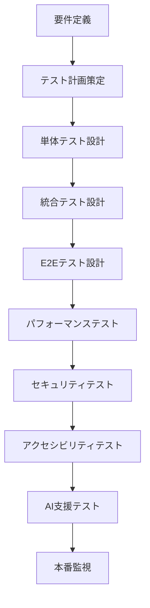

### 1. AI支援テスト生成

#### テストケース自動生成
```typescript
// src/utils/ai-test-generator.ts
import { OpenAI } from 'openai';

interface TestGeneratorConfig {
  componentPath: string;
  functionalRequirements: string[];
  edgeCases: string[];
}

export class AITestGenerator {
  private openai: OpenAI;

  constructor(apiKey: string) {
    this.openai = new OpenAI({ apiKey });
  }

  async generateTestCases(config: TestGeneratorConfig): Promise<string> {
    const prompt = `
    Generate comprehensive Jest test cases for a React component:
    
    Component: ${config.componentPath}
    Requirements: ${config.functionalRequirements.join(', ')}
    Edge Cases: ${config.edgeCases.join(', ')}
    
    Include render, interaction, accessibility, and performance tests.
    Use React Testing Library patterns.
    `;

    const response = await this.openai.chat.completions.create({
      model: "gpt-4",
      messages: [{ role: "user", content: prompt }],
      temperature: 0.3,
    });

    return response.choices[0].message.content || '';
  }
}
```

### 2. 単体テスト設定 (Jest + RTL)

```javascript
// jest.config.js
module.exports = {
  testEnvironment: 'jsdom',
  setupFilesAfterEnv: ['<rootDir>/src/setupTests.ts'],
  collectCoverageFrom: [
    'src/**/*.{ts,tsx}',
    '!src/**/*.d.ts',
    '!src/index.tsx',
  ],
  coverageThreshold: {
    global: {
      branches: 80,
      functions: 80,
      lines: 80,
      statements: 80,
    },
  },
};
```

### 3. E2Eテスト (Playwright)

```typescript
// e2e/app.spec.ts
import { test, expect } from '@playwright/test';

test('main user journey', async ({ page }) => {
  await page.goto('/');
  
  // アプリ読み込み確認
  await expect(page.locator('h1')).toContainText('Power Apps Code Apps');
  
  // サイドバー操作
  await page.click('[aria-label*="サイドバー"]');
  await expect(page.locator('nav')).toBeVisible();
  
  // レスポンシブテスト
  await page.setViewportSize({ width: 375, height: 667 });
  await expect(page.locator('[class*="mobileOverlay"]')).toBeVisible();
});
```

### 4. AI支援デバッグツール

```typescript
// src/utils/ai-debugger.ts
export class AIDebugger {
  async analyzeError(error: Error, context: any): Promise<string> {
    const prompt = `
    Analyze this error for Power Apps Code Apps:
    Error: ${error.message}
    Context: ${JSON.stringify(context)}
    
    Provide root cause and solution steps.
    `;

    return await this.callAIAPI(prompt);
  }

  static logPowerPlatformInfo() {
    console.group('🔍 Power Platform Debug Info');
    console.log('SDK Initialized:', window.powerApps?.initialized || false);
    console.log('Environment:', process.env.NODE_ENV);
    console.log('Bundle Size:', performance.getEntriesByType('resource').length);
    console.groupEnd();
  }
}
```

### 5. デバッグチェックリスト

#### 開発時デバッグ手順
- [ ] PowerProvider の初期化確認
- [ ] バンドルサイズ分析 (< 300KB目標)
- [ ] React Strict Mode 無効化
- [ ] webpack publicPath 設定確認
- [ ] 本番ビルドエラーチェック

#### 本番環境デバッグ
- [ ] ブラウザ開発者ツールでネットワーク確認
- [ ] Power Apps環境でのローカル実行テスト  
- [ ] Application Insights ログ確認
- [ ] パフォーマンス指標監視

---

## トラブルシューティング

### よくある問題と解決策

#### 1. "App timed out" エラー
**原因**: バンドルサイズが大きすぎる、またはPowerProviderが不足
**解決策**: 
- PowerProviderを実装
- webpack設定でチャンク分割を有効化
- 不要な依存関係を削除

#### 2. "Fetching your app" で停止
**原因**: publicPath設定が間違っている
**解決策**: webpack.config.js で `publicPath: './'` を設定

#### 3. CSS/アセットが読み込まれない
**原因**: 相対パスの設定ミス
**解決策**: すべてのパスを相対パス（`./`）に統一

### 4. React Strict Modeの問題
**原因**: 本番環境でのメモリリーク
**解決策**: 本番環境ではStrict Modeを無効化

## ベストプラクティス

### コード品質
- TypeScriptの厳密モードを使用
- ESLintとPrettierで一貫した品質を維持
- コンポーネントの適切な分割

### UI/UX
- FluentUIを使用して一貫したデザイン
- レスポンシブデザインの実装
- アクセシビリティの考慮

### パフォーマンス
- コード分割とレイジーローディング
- 不要な再レンダリングの防止
- メモ化の適切な使用

# 🚀 品質向上フレームワーク

## 継続的品質改善システム

### 1. AI支援コード品質分析

```typescript
// src/utils/ai-quality-analyzer.ts
export class AIQualityAnalyzer {
  async analyzeCodeQuality(filePath: string, content: string): Promise<QualityReport> {
    const prompt = `
    Analyze this TypeScript/React code for Power Apps Code Apps:
    
    File: ${filePath}
    
    Focus on:
    1. Performance issues
    2. Security vulnerabilities  
    3. Accessibility concerns
    4. Power Apps compatibility
    5. Best practices adherence
    
    Return JSON with score and specific suggestions.
    `;
    
    const analysis = await this.callAIAPI(prompt);
    return JSON.parse(analysis);
  }

  async suggestRefactoring(code: string): Promise<string> {
    return await this.callAIAPI(`
      Suggest Power Apps Code Apps optimizations for:
      ${code}
      
      Focus on performance, maintainability, and Power Platform integration.
    `);
  }
}
```

### 2. 自動化された品質チェック

#### GitHub Actions品質ゲート
```yaml
# .github/workflows/quality-gate.yml
name: Quality Gate

on:
  pull_request:
    branches: [main]

jobs:
  quality-check:
    runs-on: ubuntu-latest
    steps:
      - uses: actions/checkout@v3
      - uses: actions/setup-node@v3
        with:
          node-version: '18'
          cache: 'npm'
      
      - name: Install & Test
        run: |
          npm ci
          npm run test -- --coverage --watchAll=false
          npm run lint
          npm run build
          
      - name: Bundle Analysis
        run: npm run analyze
        
      - name: Security Scan  
        run: npm audit --audit-level high
```

### 3. パフォーマンス監視

```typescript
// src/utils/performance-monitor.ts
export class PerformanceMonitor {
  measureCustomMetric(name: string, fn: () => void) {
    const start = performance.now();
    fn();
    const duration = performance.now() - start;
    
    if (duration > 100) {
      console.warn(`🐌 Slow operation: ${name} took ${duration}ms`);
    }
    
    // Application Insights送信
    this.trackMetric(name, duration);
  }
  
  trackCoreWebVitals() {
    // LCP, FID, CLS監視
    new PerformanceObserver((list) => {
      list.getEntries().forEach((entry) => {
        this.checkThresholds(entry);
      });
    }).observe({ entryTypes: ['largest-contentful-paint'] });
  }
  
  private checkThresholds(entry: PerformanceEntry) {
    const thresholds = {
      'largest-contentful-paint': 2500,
      'first-input-delay': 100
    };
    
    if (entry.startTime > thresholds[entry.name]) {
      this.alertPerformanceIssue(entry);
    }
  }
}
```

### 4. セキュリティ強化

```typescript
// src/utils/security-checker.ts
export class SecurityChecker {
  validateInput(input: string, type: 'email' | 'url' | 'text'): boolean {
    const patterns = {
      email: /^[^\s@]+@[^\s@]+\.[^\s@]+$/,
      url: /^https?:\/\/[^\s$.?#].[^\s]*$/,
      text: /^[a-zA-Z0-9\s\-._]+$/
    };
    return patterns[type].test(input);
  }
  
  sanitizeHtml(html: string): string {
    const div = document.createElement('div');
    div.textContent = html;
    return div.innerHTML;
  }
  
  checkPowerAppsSecurityConfig() {
    // CSP設定確認
    if (!document.querySelector('meta[http-equiv="Content-Security-Policy"]')) {
      console.warn('🔒 CSP not configured');
    }
    
    // HTTPS確認
    if (location.protocol !== 'https:' && location.hostname !== 'localhost') {
      console.error('🔒 HTTPS required');
    }
  }
}
```

### 5. 品質メトリクス

#### コードレビューチェックリスト
- [ ] TypeScript型安全性
- [ ] 単体テストカバレッジ (80%以上)
- [ ] パフォーマンス影響確認
- [ ] セキュリティレビュー
- [ ] アクセシビリティ検証
- [ ] Power Apps固有要件確認
- [ ] バンドルサイズ影響評価

#### 品質ゲート基準
| 項目 | 目標値 | 必須/推奨 |
|------|--------|-----------|
| テストカバレッジ | 80%以上 | 必須 |
| バンドルサイズ | 300KB以下 | 必須 |
| LCP | 2.5秒以下 | 推奨 |
| FID | 100ms以下 | 推奨 |
| Lighthouse Score | 90以上 | 推奨 |

---

### セキュリティ
- 入力値の適切な検証
- XSSの防止
- 適切なエラーハンドリング

## アーキテクチャ理解

### Power Apps Code Apps の構成要素

1. **Power Apps SDK** - `@microsoft/power-apps/app`パッケージ
2. **生成されたモデル/サービス** - コネクタ用の自動生成コード
3. **power.config.json** - 設定ファイル（自動生成）
4. **Power Apps ホスト** - ランタイム環境

### ランタイム動作

- **アプリコード** ↔ **Power Apps SDK** ↔ **Power Apps ホスト**
- SDKがPower Platformコネクタへのアクセスを提供
- ホストが認証・承認・アプリ読み込みを管理

## 制限事項・サポート状況 (Microsoft 公式・2025年現在)

### ❌ **現在サポートされていない機能**

**セキュリティ・ポリシー:**
- **Content Security Policy (CSP)** サポート
- **Storage Shared Access Signature (SAS) IP制限** サポート  

**開発・デプロイメント:**
- **Power Platform Git 統合**
- **Dataverse ソリューション** 統合
- **Power Platform パイプライン** 使用による配布

**プラットフォーム統合:**
- **Power Apps モバイルアプリ** での実行
- **Power Apps for Windows** での実行
- **Azure Application Insights** ネイティブ統合 (汎用Webアプリとしては追加可能)

**API アクセス:**
- ✅ **Power Platform コネクター外部API** 呼び出し可能
- ⚠️ **外部API直接アクセス**: CORSプロキシ経由必須（詳細は外部APIアクセスガイドライン参照）

### ✅ **管理プラットフォーム機能サポート状況**

| 管理機能 | サポート状況 | 詳細 |
|---------|-------------|------|
| **コネクター権限同意ダイアログ** | ✅ サポート | エンドユーザーに表示 |
| **共有制限** | ✅ Canvas アプリと同等 | 既存のアプリ共有制限を継承 |
| **アプリ検疫** | ✅ サポート | セキュリティスキャンによる自動検疫 |
| **データ損失防止ポリシー** | ✅ アプリ起動時適用 | DLP ポリシー違反時は起動ブロック |
| **条件付きアクセス** | ✅ 個別アプリ単位 | アプリごとの細かい制御 |
| **管理者同意抑制** | ✅ OAuth対応 | Microsoft・カスタムコネクター両対応 |
| **テナント分離** | ✅ サポート | セキュリティ境界の維持 |
| **Azure B2B 外部ユーザー** | ✅ Canvas アプリと同等 | 外部ユーザーアクセス可能 |
| **正常性メトリクス** | ✅ 管理センター・メーカーポータル両対応 | 運用ヘルスメトリクス提供 |

### 🔒 **重要なセキュリティ考慮事項**

**アプリコード公開性:**
- Code Apps は公開エンドポイントでホストされます
- **機密データをアプリコード内に保存禁止**
- ユーザーデータは適切なデータソースに保存
- 認証・認可チェック後にデータ取得実行

## システム設定

### ヘッダー非表示機能

本番環境でPower Appsヘッダーを非表示にする：

```
https://apps.powerapps.com/play/e/{environment-id}/a/{app-id}?hideNavBar=true
```

### セキュリティ考慮事項

**重要**: アプリコード内に機密データを保存しないでください。
- ユーザーデータは適切なデータソースに保存
- 認証・承認チェック後にデータを取得
- アプリコードは公開されるエンドポイントでホストされます

## 参考リンク

**公式ドキュメント:**
- [Power Apps Code Apps 概要](https://learn.microsoft.com/en-us/power-apps/developer/code-apps/overview)
- [アーキテクチャ詳細](https://learn.microsoft.com/en-us/power-apps/developer/code-apps/architecture)
- [システム制限と設定](https://learn.microsoft.com/en-us/power-apps/developer/code-apps/system-limits-configuration)

**開発リソース:**
- [Microsoft PowerAppsCodeApps リポジトリ](https://github.com/microsoft/PowerAppsCodeApps)
- [FluentUI React Components](https://react.fluentui.dev/)
- [Power Platform CLI](https://learn.microsoft.com/en-us/power-platform/developer/cli/introduction)

---

# 🧩 コンポーネントライブラリ・アーキテクチャパターン

## 再利用可能コンポーネント設計

### 1. 基本コンポーネント構造

#### ベースコンポーネントテンプレート
```typescript
// src/components/base/BaseComponent.tsx
import React from 'react';
import { makeStyles, mergeClasses } from '@fluentui/react-components';

interface BaseComponentProps {
  className?: string;
  children?: React.ReactNode;
  'data-testid'?: string;
}

const useStyles = makeStyles({
  root: {
    // ベーススタイル
  }
});

export const BaseComponent: React.FC<BaseComponentProps> = ({
  className,
  children,
  'data-testid': testId,
  ...props
}) => {
  const styles = useStyles();
  
  return (
    <div 
      className={mergeClasses(styles.root, className)}
      data-testid={testId}
      {...props}
    >
      {children}
    </div>
  );
};
```

### 2. カードコンポーネント

```tsx
// src/components/common/Card.tsx
import React from 'react';
import { 
  Card as FluentCard,
  CardHeader,
  CardPreview,
  Text,
  Button,
  makeStyles,
  tokens
} from '@fluentui/react-components';
import { MoreHorizontal24Regular } from '@fluentui/react-icons';

const useStyles = makeStyles({
  card: {
    width: '100%',
    maxWidth: '400px',
    boxShadow: tokens.shadow8,
    borderRadius: tokens.borderRadiusLarge,
    '&:hover': {
      boxShadow: tokens.shadow16,
      transform: 'translateY(-2px)',
      transition: 'all 0.2s ease-in-out',
    },
  },
  header: {
    padding: '16px',
  },
  content: {
    padding: '0 16px 16px 16px',
  },
  footer: {
    padding: '16px',
    borderTop: `1px solid ${tokens.colorNeutralStroke2}`,
    display: 'flex',
    justifyContent: 'space-between',
    alignItems: 'center',
  },
});

interface CardProps {
  title: string;
  description?: string;
  image?: string;
  actions?: React.ReactNode;
  onClick?: () => void;
  className?: string;
}

export const Card: React.FC<CardProps> = ({
  title,
  description,
  image,
  actions,
  onClick,
  className
}) => {
  const styles = useStyles();

  return (
    <FluentCard 
      className={mergeClasses(styles.card, className)}
      onClick={onClick}
      role={onClick ? "button" : undefined}
      tabIndex={onClick ? 0 : undefined}
    >
      {image && (
        <CardPreview>
          
        </CardPreview>
      )}
      
      <CardHeader 
        className={styles.header}
        header={<Text weight="semibold" size={300}>{title}</Text>}
        action={
          <Button
            appearance="transparent" 
            icon={<MoreHorizontal24Regular />}
            aria-label="その他のオプション"
          />
        }
      />
      
      {description && (
        <div className={styles.content}>
          <Text size={200}>{description}</Text>
        </div>
      )}
      
      {actions && (
        <div className={styles.footer}>
          {actions}
        </div>
      )}
    </FluentCard>
  );
};
```

### 3. データテーブルコンポーネント

```tsx
// src/components/common/DataTable.tsx
import React, { useState, useMemo } from 'react';
import {
  Table,
  TableHeader,
  TableHeaderCell,
  TableBody,
  TableRow,
  TableCell,
  Button,
  Input,
  makeStyles,
  tokens
} from '@fluentui/react-components';
import { ArrowSort24Regular, Search24Regular } from '@fluentui/react-icons';

const useStyles = makeStyles({
  container: {
    width: '100%',
    backgroundColor: tokens.colorNeutralBackground1,
    borderRadius: tokens.borderRadiusMedium,
    padding: '16px',
  },
  toolbar: {
    display: 'flex',
    justifyContent: 'space-between',
    alignItems: 'center',
    marginBottom: '16px',
  },
  searchBox: {
    minWidth: '300px',
  },
  table: {
    width: '100%',
  },
  sortableHeader: {
    cursor: 'pointer',
    display: 'flex',
    alignItems: 'center',
    gap: '8px',
    '&:hover': {
      backgroundColor: tokens.colorNeutralBackground1Hover,
    },
  },
});

interface Column<T> {
  key: keyof T;
  title: string;
  sortable?: boolean;
  render?: (value: T[keyof T], item: T) => React.ReactNode;
}

interface DataTableProps<T> {
  data: T[];
  columns: Column<T>[];
  searchable?: boolean;
  onRowClick?: (item: T) => void;
  className?: string;
}

export function DataTable<T extends Record<string, any>>({
  data,
  columns,
  searchable = true,
  onRowClick,
  className
}: DataTableProps<T>) {
  const styles = useStyles();
  const [searchTerm, setSearchTerm] = useState('');
  const [sortColumn, setSortColumn] = useState<keyof T | null>(null);
  const [sortDirection, setSortDirection] = useState<'asc' | 'desc'>('asc');

  const filteredData = useMemo(() => {
    let filtered = data;

    // 検索フィルタリング
    if (searchTerm) {
      filtered = filtered.filter(item =>
        Object.values(item).some(value =>
          String(value).toLowerCase().includes(searchTerm.toLowerCase())
        )
      );
    }

    // ソート
    if (sortColumn) {
      filtered.sort((a, b) => {
        const aValue = a[sortColumn];
        const bValue = b[sortColumn];
        
        if (aValue < bValue) return sortDirection === 'asc' ? -1 : 1;
        if (aValue > bValue) return sortDirection === 'asc' ? 1 : -1;
        return 0;
      });
    }

    return filtered;
  }, [data, searchTerm, sortColumn, sortDirection]);

  const handleSort = (column: keyof T) => {
    if (sortColumn === column) {
      setSortDirection(sortDirection === 'asc' ? 'desc' : 'asc');
    } else {
      setSortColumn(column);
      setSortDirection('asc');
    }
  };

  return (
    <div className={mergeClasses(styles.container, className)}>
      {searchable && (
        <div className={styles.toolbar}>
          <Input
            className={styles.searchBox}
            placeholder="検索..."
            value={searchTerm}
            onChange={(_, data) => setSearchTerm(data.value)}
            contentBefore={<Search24Regular />}
          />
        </div>
      )}

      <Table className={styles.table}>
        <TableHeader>
          <TableRow>
            {columns.map((column) => (
              <TableHeaderCell key={String(column.key)}>
                {column.sortable ? (
                  <div 
                    className={styles.sortableHeader}
                    onClick={() => handleSort(column.key)}
                  >
                    {column.title}
                    <ArrowSort24Regular />
                  </div>
                ) : (
                  column.title
                )}
              </TableHeaderCell>
            ))}
          </TableRow>
        </TableHeader>
        <TableBody>
          {filteredData.map((item, index) => (
            <TableRow 
              key={index}
              onClick={() => onRowClick?.(item)}
              style={{ cursor: onRowClick ? 'pointer' : 'default' }}
            >
              {columns.map((column) => (
                <TableCell key={String(column.key)}>
                  {column.render 
                    ? column.render(item[column.key], item)
                    : String(item[column.key])
                  }
                </TableCell>
              ))}
            </TableRow>
          ))}
        </TableBody>
      </Table>
    </div>
  );
}
```

### 4. フォームコンポーネント

```tsx
// src/components/common/Form.tsx
import React from 'react';
import { useForm, Controller, FieldValues, Path } from 'react-hook-form';
import {
  Input,
  Textarea,
  Dropdown,
  Button,
  Text,
  makeStyles,
  tokens
} from '@fluentui/react-components';

const useStyles = makeStyles({
  form: {
    display: 'flex',
    flexDirection: 'column',
    gap: '16px',
    padding: '24px',
    backgroundColor: tokens.colorNeutralBackground1,
    borderRadius: tokens.borderRadiusMedium,
  },
  field: {
    display: 'flex',
    flexDirection: 'column',
    gap: '8px',
  },
  label: {
    fontWeight: tokens.fontWeightMedium,
  },
  error: {
    color: tokens.colorPaletteRedForeground1,
    fontSize: tokens.fontSizeBase200,
  },
  actions: {
    display: 'flex',
    gap: '12px',
    justifyContent: 'flex-end',
    marginTop: '16px',
  },
});

interface FormField {
  name: string;
  label: string;
  type: 'text' | 'email' | 'textarea' | 'dropdown';
  required?: boolean;
  options?: Array<{ key: string; text: string }>;
  validation?: any;
}

interface FormProps<T extends FieldValues> {
  fields: FormField[];
  onSubmit: (data: T) => void;
  defaultValues?: Partial<T>;
  submitText?: string;
  cancelText?: string;
  onCancel?: () => void;
}

export function Form<T extends FieldValues>({
  fields,
  onSubmit,
  defaultValues,
  submitText = '保存',
  cancelText = 'キャンセル',
  onCancel
}: FormProps<T>) {
  const styles = useStyles();
  const {
    control,
    handleSubmit,
    formState: { errors, isSubmitting }
  } = useForm<T>({
    defaultValues: defaultValues as any
  });

  const renderField = (field: FormField) => {
    const fieldName = field.name as Path<T>;
    
    return (
      <div key={field.name} className={styles.field}>
        <Text className={styles.label}>
          {field.label}
          {field.required && ' *'}
        </Text>
        
        <Controller
          name={fieldName}
          control={control}
          rules={{
            required: field.required ? `${field.label}は必須です` : false,
            ...field.validation
          }}
          render={({ field: { onChange, value, onBlur } }) => {
            switch (field.type) {
              case 'textarea':
                return (
                  <Textarea
                    value={value || ''}
                    onChange={(_, data) => onChange(data.value)}
                    onBlur={onBlur}
                    placeholder={`${field.label}を入力`}
                  />
                );
              
              case 'dropdown':
                return (
                  <Dropdown
                    value={value || ''}
                    onOptionSelect={(_, data) => onChange(data.optionValue)}
                    placeholder={`${field.label}を選択`}
                  >
                    {field.options?.map(option => (
                      <option key={option.key} value={option.key}>
                        {option.text}
                      </option>
                    ))}
                  </Dropdown>
                );
              
              default:
                return (
                  <Input
                    type={field.type}
                    value={value || ''}
                    onChange={(_, data) => onChange(data.value)}
                    onBlur={onBlur}
                    placeholder={`${field.label}を入力`}
                  />
                );
            }
          }}
        />
        
        {errors[fieldName] && (
          <Text className={styles.error}>
            {errors[fieldName]?.message as string}
          </Text>
        )}
      </div>
    );
  };

  return (
    <form className={styles.form} onSubmit={handleSubmit(onSubmit)}>
      {fields.map(renderField)}
      
      <div className={styles.actions}>
        {onCancel && (
          <Button 
            appearance="secondary"
            onClick={onCancel}
          >
            {cancelText}
          </Button>
        )}
        <Button 
          appearance="primary"
          type="submit"
          disabled={isSubmitting}
        >
          {isSubmitting ? '保存中...' : submitText}
        </Button>
      </div>
    </form>
  );
}
```

### 5. アーキテクチャパターン実装例

#### カスタムフック for Power Apps
```typescript
// src/hooks/usePowerAppsData.ts
import { useState, useEffect } from 'react';
import { DataService } from '../services/DataService';

export function usePowerAppsData<T>(
  fetchFunction: () => Promise<T[]>,
  dependencies: any[] = []
) {
  const [data, setData] = useState<T[]>([]);
  const [loading, setLoading] = useState(true);
  const [error, setError] = useState<Error | null>(null);

  useEffect(() => {
    const fetchData = async () => {
      try {
        setLoading(true);
        setError(null);
        const result = await fetchFunction();
        setData(result);
      } catch (err) {
        setError(err as Error);
      } finally {
        setLoading(false);
      }
    };

    fetchData();
  }, dependencies);

  const refresh = () => {
    fetchData();
  };

  return { data, loading, error, refresh };
}
```

### アニメーション・インタラクションテンプレート

**スムーズなトランジション設定:**
```tsx
// tailwind.config.js の animation 拡張
module.exports = {
  theme: {
    extend: {
      animation: {
        'fade-in': 'fadeIn 0.3s ease-in-out',
        'slide-in': 'slideIn 0.3s ease-out',
        'scale-in': 'scaleIn 0.2s ease-out',
        'bounce-gentle': 'bounceGentle 0.6s ease-out',
      },
      keyframes: {
        fadeIn: {
          '0%': { opacity: '0' },
          '100%': { opacity: '1' },
        },
        slideIn: {
          '0%': { transform: 'translateY(-10px)', opacity: '0' },
          '100%': { transform: 'translateY(0)', opacity: '1' },
        },
        scaleIn: {
          '0%': { transform: 'scale(0.95)', opacity: '0' },
          '100%': { transform: 'scale(1)', opacity: '1' },
        },
        bounceGentle: {
          '0%, 20%, 50%, 80%, 100%': { transform: 'translateY(0)' },
          '40%': { transform: 'translateY(-4px)' },
          '60%': { transform: 'translateY(-2px)' },
        },
      },
    },
  },
};
```

**インタラクティブボタンテンプレート:**
```tsx
// components/ui/InteractiveButton.tsx
import { Button } from "@/components/ui/button";
import { cn } from "@/lib/utils";
import { Loader2 } from "lucide-react";

interface InteractiveButtonProps {
  children: React.ReactNode;
  variant?: 'default' | 'destructive' | 'outline' | 'secondary' | 'ghost' | 'link';
  size?: 'default' | 'sm' | 'lg' | 'icon';
  loading?: boolean;
  success?: boolean;
  error?: boolean;
  onClick?: () => void;
  className?: string;
}

export const InteractiveButton: React.FC<InteractiveButtonProps> = ({
  children,
  loading = false,
  success = false,
  error = false,
  className,
  ...props
}) => {
  return (
    <Button
      className={cn(
        "transition-all duration-300",
        "hover:scale-105 active:scale-95",
        "focus:ring-2 focus:ring-primary focus:ring-offset-2",
        success && "bg-green-500 hover:bg-green-600 text-white",
        error && "bg-red-500 hover:bg-red-600 text-white",
        loading && "opacity-70 cursor-not-allowed",
        className
      )}
      disabled={loading}
      {...props}
    >
      {loading && <Loader2 className="mr-2 h-4 w-4 animate-spin" />}
      {children}
    </Button>
  );
};
```

**ホバーカードテンプレート:**
```tsx
// components/ui/HoverCard.tsx
import { Card } from "@/components/ui/Card";
import { cn } from "@/lib/utils";

interface HoverCardProps {
  children: React.ReactNode;
  className?: string;
  elevated?: boolean;
  interactive?: boolean;
}

export const HoverCard: React.FC<HoverCardProps> = ({
  children,
  className,
  elevated = false,
  interactive = true
}) => {
  return (
    <Card
      className={cn(
        "transition-all duration-300 ease-out",
        interactive && [
          "hover:shadow-large hover:scale-[1.02]",
          "hover:border-primary/20",
          "cursor-pointer",
        ],
        elevated && "shadow-medium",
        className
      )}
    >
      {children}
    </Card>
  );
};
```

**ローディング状態テンプレート:**
```tsx
// components/ui/LoadingStates.tsx
import { Skeleton } from "@/components/ui/skeleton";
import { Card } from "@/components/ui/Card";

export const TableSkeleton: React.FC = () => (
  <Card>
    <div className="space-y-4">
      <Skeleton className="h-8 w-full" />
      {Array.from({ length: 5 }).map((_, i) => (
        <div key={i} className="flex space-x-4">
          <Skeleton className="h-12 w-12 rounded-full" />
          <div className="space-y-2 flex-1">
            <Skeleton className="h-4 w-[250px]" />
            <Skeleton className="h-4 w-[200px]" />
          </div>
        </div>
      ))}
    </div>
  </Card>
);

export const CardSkeleton: React.FC = () => (
  <Card>
    <Skeleton className="h-48 w-full mb-4" />
    <Skeleton className="h-4 w-[250px] mb-2" />
    <Skeleton className="h-4 w-[200px]" />
  </Card>
);
```

### Office 365 レイアウト統合 ベストプラクティス

**認証・レイアウト統合指針:**
1. **Office 365 Users コネクター**: ログイン時の自動ユーザー情報取得
2. **レスポンシブヘッダー**: プロフィール表示、通知、テーマ切り替え
3. **ハンバーガーメニュー**: モバイル対応サイドバー
4. **ユーザー写真取得**: フォールバック対応
5. **エラーハンドリング**: コネクター失敗時の適切な処理

**コネクター設定（Power Apps 側）:**
```json
// Power Apps での Office 365 Users コネクター設定
{
  "connectors": [
    {
      "name": "Office 365 Users",
      "id": "shared_office365users",
      "permissions": [
        "User.Read",
        "User.ReadBasic.All"
      ]
    }
  ]
}
```

**拡張ユーザーフック（写真取得対応）:**
```tsx
// src/hooks/useCurrentUser.ts - 拡張版
import { useQuery, useQueries } from '@tanstack/react-query';
import { UserService } from '@/services/UserService';

export const useCurrentUserWithPhoto = () => {
  const [userQuery, photoQuery] = useQueries({
    queries: [
      {
        queryKey: ['currentUser'],
        queryFn: () => UserService.getCurrentUser(),
        staleTime: 5 * 60 * 1000,
      },
      {
        queryKey: ['userPhoto'],
        queryFn: () => UserService.getUserPhoto(),
        staleTime: 30 * 60 * 1000, // 写真は30分キャッシュ
        enabled: false, // ユーザー情報取得後に実行
      }
    ]
  });

  // ユーザー情報取得完了後、写真を取得
  React.useEffect(() => {
    if (userQuery.data && !photoQuery.data && !photoQuery.isFetching) {
      photoQuery.refetch();
    }
  }, [userQuery.data]);

  return {
    user: userQuery.data,
    photo: photoQuery.data,
    isLoading: userQuery.isLoading,
    error: userQuery.error || photoQuery.error,
  };
};
```

**エラーバウンダリー:**
```tsx
// src/components/ErrorBoundary.tsx
import { Component, ReactNode } from 'react';
import { Card } from '@/components/ui/Card';
import { Button } from '@/components/ui/button';
import { AlertTriangle, RefreshCw } from 'lucide-react';

interface ErrorBoundaryState {
  hasError: boolean;
  error?: Error;
}

export class ErrorBoundary extends Component<
  { children: ReactNode },
  ErrorBoundaryState
> {
  constructor(props: { children: ReactNode }) {
    super(props);
    this.state = { hasError: false };
  }

  static getDerivedStateFromError(error: Error): ErrorBoundaryState {
    return { hasError: true, error };
  }

  componentDidCatch(error: Error, errorInfo: any) {
    console.error('Office 365 コネクター エラー:', error, errorInfo);
  }

  render() {
    if (this.state.hasError) {
      return (
        <div className="min-h-screen bg-background flex items-center justify-center p-4">
          <Card className="max-w-md w-full text-center p-6">
            <AlertTriangle className="h-12 w-12 text-yellow-500 mx-auto mb-4" />
            <h2 className="text-xl font-semibold mb-2">接続エラーが発生しました</h2>
            <p className="text-muted-foreground mb-4">
              Office 365 への接続に問題が発生しています。
            </p>
            <Button 
              onClick={() => window.location.reload()}
              className="space-x-2"
            >
              <RefreshCw className="h-4 w-4" />
              <span>再試行</span>
            </Button>
          </Card>
        </div>
      );
    }

    return this.props.children;
  }
}
```

**アプリ構成例:**
```tsx
// src/main.tsx
import { createRoot } from 'react-dom/client';
import App from './App.tsx';
import './index.css';
import { StrictMode } from 'react';
import PowerProvider from './PowerProvider.tsx';
import { ErrorBoundary } from './components/ErrorBoundary.tsx';

createRoot(document.getElementById("root")!).render(
  <StrictMode>
    <ErrorBoundary>
      <PowerProvider>
        <App />
      </PowerProvider>
    </ErrorBoundary>
  </StrictMode>
);
```

### Code Apps 設計システム ベストプラクティス

**Power Apps Code Apps 統合指針:**
1. **Office 365 統合**: ユーザー情報自動取得、写真表示、認証不要
2. **shadcn/ui + TailwindCSS**: 一貫したデザインシステム
3. **レスポンシブレイアウト**: ヘッダー・サイドバー・メインコンテナ構成
4. **ダークモード対応**: システム・ライト・ダーク自動切り替え
5. **モーダル中心設計**: ブラウザポップアップ禁止

**推奨コンポーネント構成例:**
```tsx
// components/index.ts - 美しい設計システムエクスポート
export { Card, CardHeader, CardContent, CardFooter } from './ui/Card';
export { Button, InteractiveButton } from './ui/button';
export { Input, Label, Textarea } from './ui/form';
export { Dialog, DialogContent, DialogHeader } from './ui/dialog';
export { DataTable, ListItem } from './ui/DataTable';
export { StatsCard, ChartContainer } from './ui/StatsCard';
export { Sidebar, DashboardGrid } from './layout';
export { ThemeProvider, useTheme } from './theme/ThemeContext';
export { Modal, FormModal, ConfirmModal } from './ui/modal';
export { HoverCard, LoadingStates } from './ui/InteractiveComponents';
```

**スタイリング命名規則:**
- **色**: `text-foreground`, `bg-background`, `border-border`
- **サイズ**: `text-sm/base/lg`, `p-4`, `space-x-2`
- **状態**: `hover:`, `focus:`, `active:`, `disabled:`
- **レスポンシブ**: `md:`, `lg:`, `xl:`
- **ダークモード**: `dark:bg-gray-800`, `dark:text-white`

**コンポーネント設計原則:**
```tsx
// 正しいコンポーネント設計例
export const BeautifulComponent: React.FC<Props> = ({
  variant = 'default',
  size = 'medium',
  children,
  className,
  ...props
}) => {
  return (
    <div
      className={cn(
        // ベーススタイル
        "rounded-lg border transition-all duration-300",
        // バリアント
        variant === 'primary' && "bg-primary text-primary-foreground",
        variant === 'secondary' && "bg-secondary text-secondary-foreground",
        // サイズ
        size === 'small' && "p-2 text-sm",
        size === 'medium' && "p-4 text-base",
        size === 'large' && "p-6 text-lg",
        // インタラクション
        "hover:shadow-medium focus:outline-none focus:ring-2 focus:ring-primary",
        // ダークモード
        "dark:border-gray-700 dark:bg-gray-800",
        // カスタムクラス
        className
      )}
      {...props}
    >
      {children}
    </div>
  );
};
```

#### コンテキストプロバイダー
```typescript
// src/context/AppContext.tsx
import React, { createContext, useContext, useReducer } from 'react';

interface AppState {
  user: User | null;
  theme: 'light' | 'dark';
  notifications: Notification[];
}

interface AppContextType {
  state: AppState;
  dispatch: React.Dispatch<AppAction>;
}

const AppContext = createContext<AppContextType | null>(null);

export const useAppContext = () => {
  const context = useContext(AppContext);
  if (!context) {
    throw new Error('useAppContext must be used within AppProvider');
  }
  return context;
};

export const AppProvider: React.FC<{ children: React.ReactNode }> = ({ children }) => {
  const [state, dispatch] = useReducer(appReducer, initialState);

  return (
    <AppContext.Provider value={{ state, dispatch }}>
      {children}
    </AppContext.Provider>
  );
};
```

---

## 🚀 **統合開発手順 - 最新版**

> **最終更新**: 2025年1月17日
> **対象**: Power Apps Code Apps 開発標準 v2.0

### **📋 開発フロー概要 - 矛盾排除版**

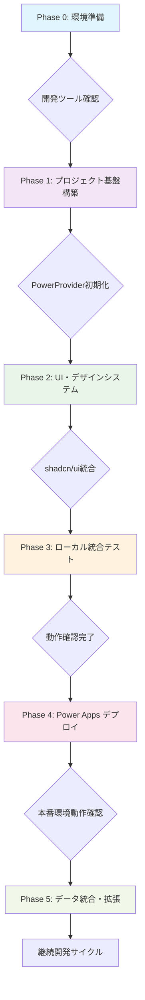

### **🎯 統一コマンド体系**

#### **必須エラーチェックコマンド (全Phase共通)**
```bash
# 統合エラーチェック - 必須実行
npm run build && npm run lint && npx tsc --noEmit
```

#### **Phase別統合コマンド**
```bash
# Phase 1: プロジェクト基盤
npm create vite@latest AppName -- --template react-ts
npm install && npm i --save-dev @types/node
pac code init --displayName "App Name"
npm install --save "@microsoft/power-apps"

# Phase 2: UI統合  
npx shadcn@latest init
npx shadcn@latest add button card input select table

# Phase 3: 統合テスト
npm run build && npm run dev

# Phase 4: デプロイ
npm run build && pac code push

# Phase 5: データ統合
# → Dataverse: customizations.xml取得 → スキーマ抽出 → 型定義作成
# → Office 365: useConnector('office365users')
# → SQL Server: useConnector('sql')
```

### **⚠️ 重要: 矛盾解決済み項目**

#### **1. PowerProvider実装パターン (統一版)**
```typescript
// 最終確定版 - 変更禁止
import { initialize } from "@microsoft/power-apps/app";
import { useEffect, type ReactNode } from "react";

interface PowerProviderProps {
    children: ReactNode;
}

export default function PowerProvider({ children }: PowerProviderProps) {
    useEffect(() => {
        const initApp = async () => {
            try {
                await initialize();
                console.log('✅ Power Platform SDK initialized');
            } catch (error) {
                console.error('❌ SDK initialization failed:', error);
            }
        };
        
        initApp();
    }, []);

    return <>{children}</>;
}
```

#### **2. vite.config.ts 設定 (統一版)**
```typescript
// 最終確定版 - Microsoft公式準拠
import { defineConfig } from 'vite'
import react from '@vitejs/plugin-react'
import * as path from 'path'

export default defineConfig({
  base: "./",  // Power Apps デプロイ必須
  server: {
    host: "::",
    port: 3000,  // Power SDK固定ポート
  },
  plugins: [react()],
  resolve: {
    alias: {
      "@": path.resolve(__dirname, "./src"),
    },
  },
});
```

#### **3. package.json Scripts (統一版)**
```json
{
  "scripts": {
    "dev": "start pac code run && vite",
    "build": "tsc -b && vite build", 
    "lint": "eslint .",
    "preview": "vite preview"
  }
}
```

### **🔧 データ統合パターン (Phase 5)**

#### **Dataverse統合手順**
```bash
# 1. スキーマ確認 (必須)
# Power Apps ポータル → ソリューション → エクスポート → customizations.xml

# 2. PowerShell スキーマ抽出（ワークスペースルートに配置）
.\Extract-DataverseChoices.ps1 -XmlPath ".\customizations.xml" -EntityName "your_table"

# 3. TypeScript型定義作成
# → src/types/dataverse.ts にインターフェース定義
# → Choice値マッピング作成

# 4. useConnector実装
const dataverseConnector = useConnector('dataverse');
```

#### **Office 365統合手順**
```typescript
// 統一パターン
import { useConnector } from '@microsoft/power-apps';

export const useOffice365Users = () => {
  const connector = useConnector('office365users');
  
  const getUsers = async () => {
    try {
      return await connector.getUserProfiles();
    } catch (error) {
      console.error('Office 365 connection error:', error);
      throw error;
    }
  };
  
  return { getUsers };
};
```

### **📊 品質保証チェックリスト - 統合版**

#### **Phase 1完了チェック**
- [ ] TypeScript エラー: 0件
- [ ] ESLint エラー: 0件
- [ ] ビルドエラー: 0件
- [ ] PowerProvider正常動作
- [ ] `pac code init`成功

#### **Phase 2完了チェック**
- [ ] shadcn/ui統合完了
- [ ] TailwindCSS動作確認
- [ ] レスポンシブデザイン確認
- [ ] ローカル実行成功

#### **Phase 3完了チェック**
- [ ] Power Apps環境統合成功
- [ ] SDK初期化確認
- [ ] ブラウザコンソールエラー0件
- [ ] 全機能動作確認

#### **Phase 4完了チェック**  
- [ ] 本番ビルド成功
- [ ] Power Apps デプロイ成功
- [ ] 本番環境動作確認
- [ ] エンドユーザーテスト完了

#### **Phase 5完了チェック**
- [ ] データソース接続成功
- [ ] CRUD操作動作確認
- [ ] 型安全性確保
- [ ] エラーハンドリング実装

### **🚨 よくある問題と解決法 - 統合版**

#### **"PowerDataRuntime is not initialized" エラー**
```
エラー例:
Error fetching SystemUsers: PowerDataRuntimeError: An unknown error occurred: 
PowerDataRuntime is not initialized. Please call initializeRuntime() first.
```

**原因:**
- Power Apps SDK の初期化前に Dataverse テーブルにアクセスした
- `usePowerPlatform().isInitialized` の確認を怠った

**解決手順:**
```typescript
// ✅ 正しいパターン
import { usePowerPlatform } from '@microsoft/power-apps';

export function DataversePage() {
  const { isInitialized } = usePowerPlatform();
  const [data, setData] = useState([]);

  useEffect(() => {
    if (!isInitialized) {
      console.log('SDK初期化中...');
      return; // 初期化完了まで待機
    }

    // SDK初期化後にデータ取得
    const loadData = async () => {
      const result = await YourService.getAll();
      if (result.isSuccess) {
        setData(result.value);
      }
    };
    loadData();
  }, [isInitialized]); // 依存配列に含める

  // SDK初期化中は Loading 表示
  if (!isInitialized) {
    return <div>Power Apps SDK 初期化中...</div>;
  }

  return <div>{/* データ表示 */}</div>;
}
```

**チェックリスト:**
- [ ] `usePowerPlatform()` で初期化状態を取得
- [ ] `isInitialized === false` の間は Loading 表示
- [ ] `useEffect` の依存配列に `isInitialized` を含める
- [ ] Dataverse サービスの呼び出しは初期化後のみ

#### **"fetching your app"で停止**
```bash
# 解決手順
1. npm run build # ビルド確認
2. PowerProvider.tsx の構文エラーチェック
3. vite.config.ts の base: "./" 設定確認
4. pac code run の再起動
```

#### **Dataverse接続エラー**
```bash
# 解決手順  
1. SDK初期化確認（usePowerPlatform().isInitialized）
2. customizations.xml からスキーマ確認
3. Choice値の数値マッピング修正
4. 必須フィールドの設定確認
5. dataSourceName の値を確認（dataSourcesInfo.ts と一致するか）
```

#### **TypeScript型エラー**
```bash
# 解決手順
1. npx tsc --noEmit で詳細確認
2. @types/node インストール確認
3. tsconfig.json設定確認
4. import文の構文確認
```

### **🎯 AI提案メッセージ - 統合版**

```typescript
// 開発状態管理インターフェース
interface DevelopmentProgress {
  currentPhase: 0 | 1 | 2 | 3 | 4 | 5;
  completedSteps: string[];
  nextRecommendedAction: string;
  estimatedTimeRemaining: string;
  skillLevel: 'beginner' | 'intermediate' | 'advanced';
}

// AI提案例
const aiSuggestions = {
  phase0: "環境準備が完了しました。Phase 1のプロジェクト作成を開始しますか？",
  phase1: "PowerProvider実装が完了しました。エラーチェックを実行しますか？",
  phase2: "UI統合が完了しました。Power Apps環境テストを開始しますか？", 
  phase3: "ローカル実行が成功しました。本番デプロイを実行しますか？",
  phase4: "デプロイが完了しました。データ統合を開始しますか？",
  phase5: "機能拡張が完了しました。次の開発サイクルを開始しますか？"
};
```

### **📈 継続開発サイクル**

```bash
# 機能追加の標準フロー
1. 要件定義 → モックデータ作成
2. UIコンポーネント開発
3. データ統合 (useConnector)
4. テスト実行 (npm run build && npm run lint)
5. デプロイ (pac code push)
6. 本番確認

# 品質向上サイクル
1. パフォーマンス最適化
2. アクセシビリティ改善
3. セキュリティ強化
4. CI/CD自動化
```


