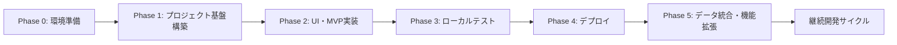

# Power Apps Code Apps 開発標準

## 概要

**Power Apps Code Apps** は、React、Vue などのポピュラーなフレームワークを使用してカスタムWebアプリを構築し、UI とロジックの完全な制御を保ちながら Power Platform で実行できる開発プラットフォームです。Microsoft Entra 認証、1,500+ コネクター、管理プラットフォームポリシー準拠により、安全で迅速なイノベーションを実現します。

- この標準は、**Power Apps Code Apps** のための開発指針です。
- Microsoft 公式ドキュメント（[Power Apps code apps](https://learn.microsoft.com/en-us/power-apps/developer/code-apps/)）と[PowerAppsCodeAppsリポジトリ](https://github.com/microsoft/PowerAppsCodeApps)、と**Geekの経験**に基づき、**要件理解から公開まで**の開発プロセスと、**モダンデザインシステム**を統合した実践的な開発ガイドラインです。

> **この標準は Power Apps Code Apps 専用です。PCF コンポーネント開発ではありません。**

---

## 📚 ドキュメント構成

このリポジトリは、開発標準とPhase別リファレンスで構成されています:

### 📖 **README.md（開発標準・このファイル）**
- ✅ 開発プロセス全体のフロー（Phase 0-5）
- ✅ Power Apps SDK の基本原則
- ✅ データソース接続の標準手順
- ✅ プロジェクト構造とアーキテクチャ
- ✅ 品質管理とテスト戦略

### 📘 **Phase別リファレンス（ルートディレクトリ）**
- ✅ **[PHASE0_ENVIRONMENT_SETUP.md](./PHASE0_ENVIRONMENT_SETUP.md)** - 環境セットアップ詳細
- ✅ **[PHASE1_PROJECT_SETUP.md](./PHASE1_PROJECT_SETUP.md)** - プロジェクト環境構築詳細
- ✅ **[PHASE2_UI_DESIGN_SYSTEM.md](./PHASE2_UI_DESIGN_SYSTEM.md)** - UI・デザインシステム詳細
- ✅ **[PHASE3_LOCAL_TESTING.md](./PHASE3_LOCAL_TESTING.md)** - ローカルテスト詳細
- ✅ **[PHASE4_DEPLOYMENT.md](./PHASE4_DEPLOYMENT.md)** - デプロイメント詳細
- ✅ **[PHASE5_DATA_INTEGRATION.md](./PHASE5_DATA_INTEGRATION.md)** - データ統合詳細

**推奨される使い方:**
1. **開発開始前** → このREADME.mdで全体像を把握
2. **実装時** → 各Phase別リファレンスで詳細を確認
3. **問題発生時** → 該当Phaseのトラブルシューティングセクションを参照

---

## 📝 **重要なお知らせとライセンス**

### **📈 定期更新について**
この開発標準は **Geek** が Power Apps Code Apps の技術進歩と実践経験に基づき**定期的に更新**しています。最新のMicrosoft公式仕様やベストプラクティスを反映し、より実用的で効率的な開発手順の提供を心がけています。

### **⚖️ MITライセンス - 自由利用可能**
この開発標準は **MITライセンス** のもとで公開されており、以下が自由に行えます：

✅ **商用利用** - 企業プロジェクトでの利用

✅ **転用・改変** - 組織のニーズに合わせた修正・拡張
  
✅ **再配布** - チーム内外での共有・配布

✅ **私用** - 個人的な学習・開発での利用

**⚠️ 重要**: サポートや保証は提供されません。利用は**自己責任**でお願いいたします。

### **🐛 問題報告・修正依頼**
開発標準に問題や改善点を発見された場合は、GitHub の **Issues** からお気軽にご報告ください：

**🔗 Issues URL**: [https://github.com/geekfujiwara/CodeAppsDevelopmentStandard/issues](https://github.com/geekfujiwara/CodeAppsDevelopmentStandard/issues)

- 技術的な問題や誤記の報告
- 新しい機能や手順の提案
- 実践での改善アイデアの共有

### **💬 感想・コメント歓迎**
この開発標準を使用されたご感想やコメントは、**GeekfujiwaraのX (旧Twitter)** まで、ぜひお聞かせください！

**🔗 X (Twitter)**: [@geekfujiwara](https://twitter.com/geekfujiwara)

- 開発標準を使用した感想
- 実際のプロジェクトでの活用事例
- 改善提案や質問
- Power Apps Code Apps に関する情報交換

**📢 皆様からのフィードバックが、この開発標準をより良いものにしていきます！**

## 🎯 **この開発標準で実現できること**

**この Power Apps Code Apps 開発標準により以下が実現されます:**

✅ **統一された開発フロー** - Phase 0〜5の体系的アプローチによる効率的な開発進行

✅ **矛盾のない技術スタック** - Microsoft公式パターン準拠による安定した基盤

✅ **実践的なトラブルシューティング** - よくある問題の解決法による開発時間短縮

✅ **包括的品質保証** - 各Phase完了時の厳密チェックによる高品質アプリ

✅ **効率的なAIガイダンス** - 開発状況に応じた適切な提案による学習効果

✅ **安全なデータ統合** - スキーマ確認からリアルデータ移行まで安心の手順

**結果**: 確実で効率的な Power Apps Code Apps 開発サイクルが確立されます。

---

## 🎯 **開発フローの概要**

この開発標準では、Phase 0からPhase 5までの体系的なアプローチで、確実かつ効率的なPower Apps Code Apps開発を実現します。

### **📋 開発フロー全体像**



**各Phaseの目的:**
- **Phase 0**: 開発環境の準備とPower Platform認証
- **Phase 1**: Vite + React + TypeScript + PowerProvider基盤構築
- **Phase 2**: shadcn/ui + TailwindCSSによるUI・MVP実装
- **Phase 3**: Power Apps環境でのローカルテスト
- **Phase 4**: 本番環境へのデプロイ
- **Phase 5**: データソース統合と継続的機能拡張

---

### **Phase 0: 環境準備**


> **📘 詳細リファレンス**: [Phase 0 リファレンス](./PHASE0_ENVIRONMENT_SETUP.md)

**Phase 0の概要:**
- Node.js・Power Platform CLIのインストール
- VS Code拡張機能の設定
- Power Platform環境の選択と認証

**完了条件:**
- ✅ 開発ツールが正常にインストールされている
- ✅ Power Platform環境にアクセスできる
- ✅ VS Code拡張機能が設定されている

**次へ**: Phase 0 → Phase 1

---

### **Phase 1: プロジェクト環境構築**


> **📘 詳細リファレンス**: [Phase 1 リファレンス](./PHASE1_PROJECT_SETUP.md)

**Phase 1の概要:**
- Vite + React + TypeScriptプロジェクト作成
- Power Apps SDK (`@microsoft/power-apps`) インストール
- PowerProviderの実装と初期化

**統合コマンド:**
```bash
# プロジェクト作成からSDKインストールまで
npm create vite@latest my-code-app -- --template react-ts
cd my-code-app
npm install
pac code init --displayName "My Code App"
npm install --save "@microsoft/power-apps"
```

**完了条件:**
- ✅ プロジェクトがビルドできる
- ✅ PowerProviderが正常に初期化される
- ✅ TypeScript・ESLintエラーが0件

**次へ**: Phase 1 → Phase 2

---

### **Phase 2: UI・デザインシステム・MVP構築**


> **📘 詳細リファレンス**: [Phase 2 リファレンス](./PHASE2_UI_DESIGN_SYSTEM.md)
>
> **ロゴとデザインのリファレンス:**
> - **[ロゴ実装マスターガイド](./docs/LOGO_MASTER_GUIDE.md)** - デザイン仕様と実装方法

**Phase 2の概要:**
- shadcn/ui + TailwindCSSのセットアップ
- 統一レイアウトコンポーネントの実装
- MVPアプリケーションの構築

**実施するStep:**
1. **アプリアイコン・ロゴ作成** - ロゴファイルの準備と配置
2. **shadcn/ui統合** - デザインシステムのセットアップ
3. **レイアウト実装** - MainLayoutコンポーネント作成
4. **App.tsx統合** - デザインシステムの適用

**完了条件:**
- ✅ shadcn/uiコンポーネントが使用できる
- ✅ 統一されたレイアウトが実装されている

**統合コマンド:**
```bash
# ビルド・リント確認
npm run build && npm run lint
```

**次へ**: Phase 2 → Phase 3

---

### **Phase 3: Power Apps環境からローカル実行**


> **📘 詳細リファレンス**: [Phase 3 リファレンス](./PHASE3_LOCAL_TESTING.md)

**Phase 3の概要:**
- ローカル環境でのアプリ実行
- Power Apps環境での動作確認
- 統合テストの実施

**統合コマンド:**
```bash
# ビルド・リント・ローカル実行を一括実行
npm run build && npm run lint && npm run dev
```

**完了条件:**
- ✅ ローカルで正常に起動する
- ✅ Power Apps環境で表示される
- ✅ エラーが発生しない

**次へ**: Phase 3 → Phase 4

---

### **Phase 4: Power Apps環境へのデプロイ**


> **📘 詳細リファレンス**: [Phase 4 リファレンス](./PHASE4_DEPLOYMENT.md)

**Phase 4の概要:**
- 本番ビルドの実行
- Power Apps環境へのデプロイ
- デプロイ後の動作確認

**統合コマンド:**
```bash
# ビルド・デプロイを一括実行
npm run build && pac code push
```

**完了条件:**
- ✅ ビルドが成功する
- ✅ デプロイが完了する
- ✅ 本番環境で正常に動作する

**次へ**: Phase 4 → Phase 5

---

### **Phase 5: 機能拡張・データソース統合**


> **📘 詳細リファレンス**: [Phase 5 リファレンス](./PHASE5_DATA_INTEGRATION.md)
>
> **Dataverse実装リファレンス:**
> - **[Lookupフィールド実装ガイド](./docs/LOOKUP_FIELD_GUIDE.md)** - Lookup完全実装
> - **[Dataverseスキーマリファレンス](./docs/DATAVERSE_SCHEMA_REFERENCE.md)** - スキーマ定義とChoice値
> - **[スキーマ取得方法](./docs/HOW_TO_GET_DATAVERSE_SCHEMA.md)** - 5つの取得方法
> - **[Dataverseトラブルシューティング](./docs/DATAVERSE_TROUBLESHOOTING.md)** - よくある問題と解決法

**Phase 5の概要:**
- データソース接続の設定（Dataverse等）
- カスタムフックの作成
- CRUD操作の実装
- UI統合とエラーハンドリング

**重要: SDK初期化のタイミング**
> ⚠️ **Power Apps SDKの初期化が完了してから**データソースに接続する必要があります。  
> 詳細は [Phase 5 リファレンス](./PHASE5_DATA_INTEGRATION.md#重要-sdk初期化とコネクター接続のタイミング) を参照してください。

**実施するStep:**
1. **データソース接続準備** - Power Appsポータルで接続作成
2. **接続追加コマンド** - `pac code add-data-source`
3. **カスタムフック作成** - データアクセスロジックの実装
4. **UI統合** - Reactコンポーネントでの使用

**完了条件:**
- ✅ データソースが正常に接続されている
- ✅ カスタムフックが実装されている
- ✅ `isInitialized` チェックが実装されている
- ✅ CRUD操作が正常に動作する

**基本パターン（概要）:**
```typescript
// ✅ 正しい実装: SDK初期化完了後にデータアクセス
const { isInitialized } = usePowerPlatform();
useEffect(() => {
  if (isInitialized) {
    loadData(); // SDK初期化完了後に実行
  }
}, [isInitialized]);
```

**次へ**: Phase 5 → 継続開発サイクル


