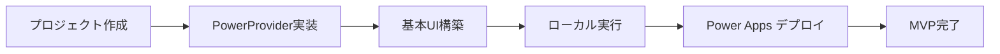
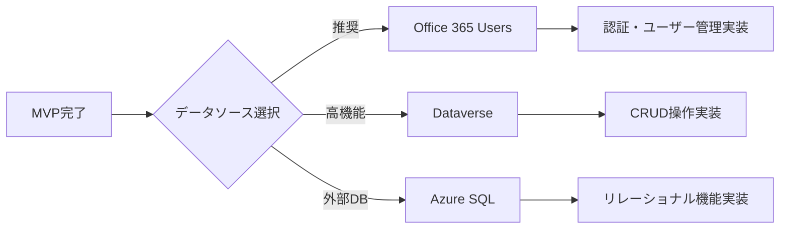
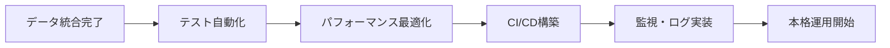
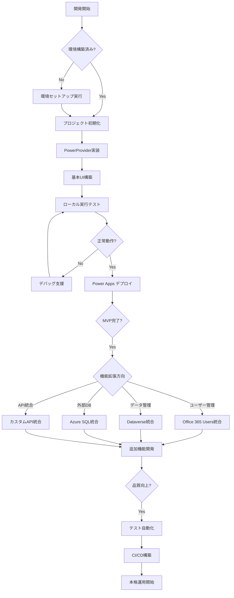
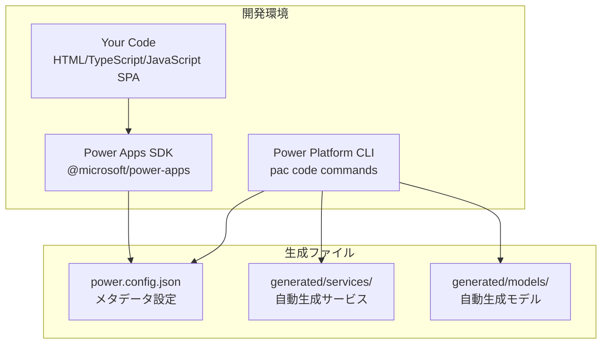
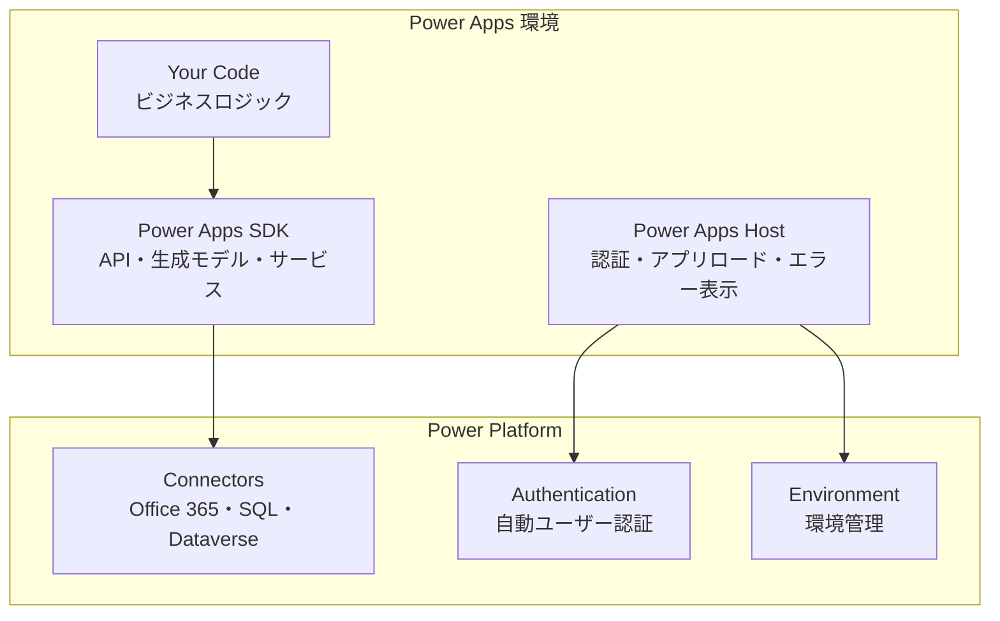
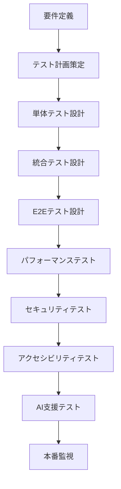

# Power Apps Code Apps 開発標準


## 概要

この標準は、**Power Apps Code Apps** （PCF ではありません）のための包括的な開発指針です。Microsoft公式ドキュメント（[Power Apps code apps](https://learn.microsoft.com/en-us/power-apps/developer/code-apps/)）と[PowerAppsCodeAppsリポジトリ](https://github.com/microsoft/PowerAppsCodeApps)のベストプラクティスに基づき、**要件理解から公開まで**の完全な開発プロセスと、**TailwindCSS モダンデザインシステム**を統合した実践的なガイドです。

**Power Apps Code Apps** は、React、Vue などのポピュラーなフレームワークを使用してカスタムWebアプリを構築し、UI とロジックの完全な制御を保ちながら Power Platform で実行できる開発プラットフォームです。Microsoft Entra 認証、1,500+ コネクター、管理プラットフォームポリシー準拠により、安全で迅速なイノベーションを実現します。

### 🚨 重要: PCF と Code Apps の違い

| 項目 | **Power Apps Code Apps** (本標準) | **PCF** (Power Apps Component Framework) |
|------|-----------------------------------|-------------------------------------------|
| **用途** | **完全なアプリケーション** | 単一コンポーネント |
| **開発方式** | React、Vue などのフルスタックアプリ | TypeScript コンポーネント |
| **公開方法** | **`pac code push`** | `pac pcf push` |
| **実行環境** | Power Apps 内でアプリとして動作 | Power Apps 内でコンポーネントとして埋め込み |
| **SDK** | `@microsoft/power-apps` | `powerapps-component-framework` |

> **この標準は Power Apps Code Apps 専用です。PCF コンポーネント開発ではありません。**

### 🎯 段階的開発フロー (AI ガイド付き)

この開発標準では、**段階的な開発アプローチ**を採用し、各段階でAIが次のアクションを提案します：

#### **Phase 1: MVP 開発・検証** 

- **AI提案例**: *"MVPモデルを開発しました。ローカルで実行しますか？"*
- **次のアクション**: *"ローカルで実行完了しました。問題なく実行できた場合、まずはMVPをPower Apps本番環境にデプロイしますか？"*

#### **Phase 2: 機能拡張・データ統合**

- **AI提案例**: *"機能拡張として、Dataverseに接続しますか？"*
- **次のアクション**: *"Dataverseに接続しました。次はほかの機能を開発しますか？機能としてはユーザー管理・権限制御がおすすめです"*

#### **Phase 3: 本格運用・最適化**

- **AI提案例**: *"機能開発が完了しました。テスト自動化を実装しますか？"*
- **次のアクション**: *"CI/CDパイプラインを構築して自動デプロイを設定しますか？"*

### 🤖 **AI ガイダンス システム設計**

各段階で以下の構造化された提案を行います：

#### **1. 現在の状態確認**
```typescript
interface DevelopmentState {
  currentPhase: 'setup' | 'mvp' | 'integration' | 'optimization';
  completedSteps: string[];
  availableActions: NextAction[];
  recommendedPath: 'beginner' | 'intermediate' | 'advanced';
}
```

#### **2. 次のアクション提案**
```typescript
interface NextAction {
  action: string;
  description: string;
  difficulty: 'easy' | 'medium' | 'hard';
  estimatedTime: string;
  prerequisites: string[];
  benefits: string[];
}
```

#### **3. 段階的ガイダンス例**

**MVP 段階:**
```json
{
  "message": "プロジェクト初期化が完了しました。",
  "nextActions": [
    {
      "action": "PowerProvider実装",
      "description": "Power Apps SDK初期化コンポーネントを実装",
      "difficulty": "easy",
      "estimatedTime": "15分",
      "command": "AI実装支援を開始しますか？"
    }
  ]
}
```

**データ統合段階:**
```json
{
  "message": "MVPが正常に動作しています。",
  "nextActions": [
    {
      "action": "Office 365 Users 統合",
      "description": "ユーザー情報取得・認証強化",
      "difficulty": "easy",
      "estimatedTime": "30分",
      "benefits": ["ユーザー管理", "プロファイル表示", "組織階層"]
    },
    {
      "action": "Dataverse 統合",
      "description": "データベース機能・CRUD操作",
      "difficulty": "medium", 
      "estimatedTime": "1-2時間",
      "benefits": ["データ永続化", "リレーション", "高度なクエリ"]
    },
    {
      "action": "Azure SQL 統合",
      "description": "外部データベース接続・複雑なクエリ",
      "difficulty": "hard",
      "estimatedTime": "2-4時間",
      "benefits": ["既存システム統合", "高性能クエリ", "ストアドプロシージャ"]
    }
  ]
}
```

### 📋 **実装推奨順序 (詳細)**
1. **環境構築 & PowerProvider** → *"SDK初期化完了しました。基本UIを作成しますか？"*
2. **基本レイアウト構築** → *"UIが完成しました。ローカルでテストしますか？"*
3. **ローカル検証** → *"正常に動作しています。Power Appsにデプロイしますか？"*
4. **Power Apps デプロイ** → *"MVPデプロイ完了！データソース統合を開始しますか？"*
5. **データソース選択・統合** → *"データ接続完了！追加機能を実装しますか？"*
6. **機能拡張** → *"機能開発完了！品質向上のためテストを追加しますか？"*
7. **テスト・最適化** → *"テスト完了！CI/CDで自動化しますか？"*
8. **本格運用準備** → *"本格運用の準備が整いました！"*

> **重要**: 各段階でAIが開発者のスキルレベルと時間制約に応じて最適な次のステップを提案し、効率的な開発を支援します。

## 目次

### 🤖 AI ガイド付き開発フロー
- [段階的開発アプローチ](#段階的開発フロー-ai-ガイド付き)
- [AIガイダンスシステム](#ai-ガイダンス-システム設計)
- [開発状態管理](#開発状態とアクション提案)

### 📋 Code Apps 開発フロー
1. [環境構築・PowerProvider実装](#2-環境構築・テンプレート選択)  
2. [レイアウト・UI開発](#レイアウト・ui開発)
3. [コネクタ統合・データ接続](#コネクタ統合・データ接続)
4. [テスト・デプロイ](#テスト・デプロイ)

### 🎨 デザインシステム
- [TailwindCSS デザインシステム](#tailwindcss-デザインシステム)
- [美しいデザインテンプレート](#美しいデザインテンプレート)
- [UI インタラクション設計](#ui-インタラクション設計)
- [ダークモード・ライトモード対応](#ダークモード・ライトモード対応)
- [レスポンシブデザイン](#レスポンシブデザイン)
- [アクセシビリティ](#アクセシビリティ)

### 🛠️ 技術基盤
- [必須実装要件](#必須実装要件)
- [アーキテクチャパターン](#アーキテクチャパターン)
- [推奨技術スタック](#推奨技術スタック)
- [パフォーマンス最適化](#パフォーマンス最適化)

### 🔍 品質保証
- [テスト戦略](#テスト戦略)
- [デバッグ手法](#デバッグ手法)
- [AI活用ガイドライン](#ai活用ガイドライン)

### ⚡ Power Apps Code Apps 統合 (最重要・PCF ではありません)
- [プラットフォーム概要](#power-apps-code-apps-プラットフォーム概要)
- [MVP 実装ガイド](#mvp-実装ガイド)
- [コネクタ利用パターン](#サンプル実装)
- [検証・テスト](#検証・テスト)

## 前提条件 (Microsoft 公式要件)

### 開発環境の準備

**必須開発ツール:**
- ✅ [Visual Studio Code](https://code.visualstudio.com/)
- ✅ [Node.js](https://nodejs.org/) (LTS版)
- ✅ [Git](https://git-scm.com/)
- ✅ [Power Platform CLI](https://learn.microsoft.com/en-us/power-platform/developer/cli/introduction)

> **重要**: これらの開発ツールはコマンドラインで利用可能である必要があります

### Power Platform 環境設定

**1. Code Apps 機能の有効化**
```bash
# Power Platform 管理センター (admin.powerplatform.microsoft.com) で実行:
1. 管理 → 環境 → 対象環境を選択
2. 設定 → 製品 → 機能 → "Power Apps code apps"
3. "Code Apps を有効にする" トグルをオンに設定
4. 保存
```

**2. エンドユーザーライセンス要件**
- **必須**: [Power Apps Premium ライセンス](https://www.microsoft.com/power-platform/products/power-apps/pricing)
- Code Apps を実行するすべてのエンドユーザーにライセンスが必要

**3. 管理者権限の確認**
- Power Platform 管理者または環境管理者権限
- 環境設定変更とコネクション作成権限
- グループとルールに基づくアクセス制御設定

---

## ⚡ Power Apps Code Apps 統合 (最重要)

### Power Apps Code Apps プラットフォーム概要 (Microsoft 公式)

**Power Apps Code Apps** は、Visual Studio Code 等の統合開発環境でWebアプリを構築するすべてのスキルレベルの開発者が、管理プラットフォーム上で効率的にビジネスアプリを構築・実行できるように設計されたプラットフォームです。React、Vue などのポピュラーなフレームワークを使用し、UI とロジックの完全な制御を保持できます。

#### 🚀 **主要機能**
- **Microsoft Entra 認証・認可**: 自動セキュリティ管理
- **1,500+ コネクター**: Power Platform データソースへの JavaScript から直接アクセス
- **簡単公開・ホスティング**: Power Platform での基幹業務Webアプリ配布
- **管理ポリシー準拠**: アプリ共有制限、条件付きアクセス、データ損失防止など
- **ALM 簡素化**: デプロイと応用ライフサイクル管理

#### 🎯 **開発・実行フロー**
1. **ローカル開発**: Visual Studio Code で React/Vue アプリ開発
2. **Power Platform統合**: `@microsoft/power-apps` SDK でプラットフォーム機能統合
3. **本番デプロイ**: 専用本番環境への安全で迅速な配布

> **重要**: これは PCF コンポーネント開発ではありません。完全なWebアプリケーションを **Power Apps Code Apps** として構築・公開する開発プラットフォームです。

---

## 🚀 開発状態とアクション提案

この標準では、開発の各段階でAIが適切な次のアクションを提案し、効率的な開発をガイドします：

### **段階別ガイダンス フローチャート**



### **AI 提案メッセージ テンプレート**

#### **Phase 1: 初期セットアップ**
```
✅ 環境構築が完了しました！
🎯 次のアクション: PowerProvider実装
📝 説明: Power Apps SDKとの接続を確立します
⏱️ 予想時間: 15分
❓ PowerProvider実装を開始しますか？
```

### 🎨 **Code Apps ロゴ・アイコン統合**

#### **プロジェクトロゴ設計**

開発プロジェクト用に最適化されたCode Appsロゴを提供：

```
assets/
├── logo.svg          # メインロゴ (64x64)
├── favicon.svg       # ファビコン (32x32)
└── logo-variants/    # サイズ別バリエーション
```

**ロゴの構成要素:**
- 🔵 **Microsoft ブルー背景** (`#0078D4`) - Power Platform 一貫性
- ⚡ **ライトニングアイコン** - Power Apps の象徴
- `< >` **コード括弧** - 開発・Code Apps アイデンティティ
- ⚙️ **ギアアイコン** - アプリケーション機能
- **"CA"テキスト** - Code Apps 略称

#### **MVPフェーズでの利用**

**1. pac code init での自動設定**
```bash
# プロジェクト初期化時にロゴを指定
pac code init --displayName "My Code App" -l "./assets/logo.svg"

# power.config.json に自動登録
{
  "appInfo": {
    "displayName": "My Code App",
    "logoPath": "./assets/logo.svg"
  }
}
```

**2. Vite プロジェクトでの統合**
```typescript
// vite.config.ts
export default defineConfig({
  // ファビコン設定
  publicDir: 'public',
  // ...
});
```

```html
<!-- public/index.html -->
<head>
  <link rel="icon" type="image/svg+xml" href="/assets/favicon.svg">
  <title>My Code App</title>
</head>
```

**3. React コンポーネントでの利用**
```typescript
// src/components/AppHeader.tsx
import React from 'react';

export const AppHeader: React.FC = () => {
  return (
    <header className="flex items-center gap-3 p-4 bg-blue-600 text-white">
      
      <h1 className="text-xl font-semibold">My Code App</h1>
    </header>
  );
};
```

#### **ブランディング統合パターン**

**4. TailwindCSS テーマ連携**
```javascript
// tailwind.config.js
module.exports = {
  theme: {
    extend: {
      colors: {
        'code-apps': {
          primary: '#0078D4',    // ロゴメインカラー
          secondary: '#005A9E',  // ロゴボーダー
          accent: '#FFD700',     // ライトニング
        }
      }
    }
  }
}
```

**5. Loading Spinner カスタマイズ**
```typescript
// src/components/LoadingSpinner.tsx
import React from 'react';

export const LoadingSpinner: React.FC = () => {
  return (
    <div className="flex flex-col items-center justify-center p-8">
      <div className="relative">
        
        <div className="absolute inset-0 border-4 border-code-apps-primary border-t-transparent rounded-full animate-spin"></div>
      </div>
      <p className="mt-4 text-code-apps-primary font-medium">Loading Code App...</p>
    </div>
  );
};
```

#### **Power Apps 公開時の最適化**

**6. マニフェスト最適化**
```json
// power.config.json (自動生成・参考)
{
  "appInfo": {
    "displayName": "My Code App",
    "description": "Modern Code App built with React + TailwindCSS",
    "logoPath": "./assets/logo.svg",
    "version": "1.0.0"
  },
  "branding": {
    "primaryColor": "#0078D4",
    "accentColor": "#FFD700"
  }
}
```

**7. 404・エラーページ統合**
```typescript
// src/pages/ErrorPage.tsx
import React from 'react';

export const ErrorPage: React.FC<{ error: string }> = ({ error }) => {
  return (
    <div className="min-h-screen flex flex-col items-center justify-center bg-gray-50">
      
      <h1 className="text-2xl font-bold text-gray-800 mb-2">接続エラー</h1>
      <p className="text-gray-600 mb-6 text-center max-w-md">
        {error}
      </p>
      <button 
        onClick={() => window.location.reload()}
        className="px-6 py-2 bg-code-apps-primary text-white rounded-lg hover:bg-code-apps-secondary transition-colors"
      >
        再試行
      </button>
    </div>
  );
};
```

#### **開発フローでの自動統合**

MVPフェーズで既に利用可能にするための設定：

```bash
# 1. プロジェクト作成時
mkdir my-code-app
cd my-code-app
npm create vite@latest . -- --template react-ts

# 2. アセットディレクトリ作成とロゴ配置
mkdir -p public/assets
# ロゴファイルをコピー

# 3. Code Apps 初期化（ロゴ付き）
pac code init --displayName "My Code App" -l "./public/assets/logo.svg"

# 4. 開発開始
npm run dev
```

これにより、MVPフェーズの開始時点で既にプロフェッショナルなロゴとブランディングが統合された状態でCode Appsの開発を開始できます。

#### **Phase 2: MVP開発**
```
✅ PowerProvider実装が完了しました！
🎯 次のアクション: 基本UI構築
📝 説明: shadcn/ui + TailwindCSSでモダンなUIを作成します
⏱️ 予想時間: 30-60分
❓ 基本レイアウトとコンポーネントを作成しますか？
```

#### **Phase 3: 動作検証**
```
✅ 基本UI構築が完了しました！
🎯 次のアクション: ローカル実行テスト
📝 説明: 開発環境でアプリケーションをテストします
⏱️ 予想時間: 10分
❓ ローカル環境でアプリを実行しますか？
```

#### **Phase 4: デプロイメント**
```
✅ ローカルテストが成功しました！
🎯 次のアクション: Power Apps環境へデプロイ
📝 説明: 本番環境でCode Appsとして公開します
⏱️ 予想時間: 15分
❓ Power Apps環境にデプロイしますか？
```

#### **Phase 5: 機能拡張選択**
```
🎉 MVP完了おめでとうございます！
🎯 次の機能拡張を選択してください:

1️⃣ Office 365 Users統合 (難易度: 易、時間: 30分)
   → ユーザー情報、プロファイル表示、組織階層

2️⃣ Dataverse統合 (難易度: 中、時間: 1-2時間)  
   → データ永続化、CRUD操作、リレーション

3️⃣ Azure SQL統合 (難易度: 高、時間: 2-4時間)
   → 既存システム統合、高性能クエリ

❓ どの機能を実装しますか？
```

#### **Phase 6: 継続開発**
```
✅ [選択した機能]の統合が完了しました！
🎯 推奨される次のステップ:

• 🔧 追加機能開発 (他のコネクター統合)
• 🧪 テスト自動化 (品質向上)  
• 🚀 CI/CDパイプライン (自動デプロイ)
• 📊 監視・ログ実装 (運用最適化)

❓ 次はどの領域を強化しますか？
```

### **スキルレベル別推奨パス**

#### **初心者向け (Beginner Path)**
```
1. 環境構築 → PowerProvider → 基本UI → ローカルテスト → デプロイ
2. Office 365 Users統合 (最も簡単)
3. 基本的なテスト追加
4. 段階的な機能拡張
```

#### **中級者向け (Intermediate Path)**  
```
1. 標準MVP開発
2. Dataverse統合 + CRUD操作
3. TanStack Query実装
4. 自動テスト + CI/CD
```

#### **上級者向け (Advanced Path)**
```
1. 高速MVP開発
2. 複数データソース統合 (Dataverse + Azure SQL)
3. 高度なアーキテクチャパターン
4. 本格的な運用監視実装
```

### **進捗追跡インターフェース**

開発状態を追跡し、適切な提案を行うための構造：

```typescript
interface ProjectProgress {
  // 現在の開発段階
  currentPhase: 'setup' | 'mvp' | 'integration' | 'optimization' | 'production';
  
  // 完了した項目
  completedSteps: {
    environmentSetup: boolean;
    powerProviderImpl: boolean;
    basicUI: boolean;
    localTesting: boolean;
    powerAppsDeployment: boolean;
    dataIntegration: DataIntegrationType[];
    testAutomation: boolean;
    cicdSetup: boolean;
  };
  
  // 開発者スキルレベル
  developerLevel: 'beginner' | 'intermediate' | 'advanced';
  
  // 利用可能時間
  availableTime: 'quick' | 'standard' | 'extended';
  
  // 推奨する次のアクション
  recommendedActions: NextActionSuggestion[];
}

interface NextActionSuggestion {
  id: string;
  title: string;
  description: string;
  difficulty: 'easy' | 'medium' | 'hard';
  estimatedTime: string;
  prerequisites: string[];
  benefits: string[];
  implementationGuide: string;
}
```

これにより、AIは開発者の現在の状況を正確に把握し、最適な次のステップを提案できます。

#### 🎯 実際の統合方式 (Microsoft 公式)
1. **Power Platform SDK 初期化** (`@microsoft/power-apps/app` の `initialize()`)
2. **静的データ開発** (UI/UX 先行開発)
3. **コネクタ統合** (`connector()` 関数でデータ接続)
4. **ローカル開発** (`pac code run` でテスト)
5. **Power Apps デプロイ** (`pac code push` で公開)

#### 📋 実装要件 (StaticAssetTracker パターン)

**1. Power Platform SDK 初期化**
- `@microsoft/power-apps` パッケージ使用
- `initialize()` 関数でプラットフォーム初期化のみ
- **認証は完全に Power Platform が自動処理** (カスタム認証コード不要)

**2. 静的データによる開発**
- まず `src/data/` に静的データを配置
- UI/UX コンポーネントを完全実装
- 実データ統合前にユーザビリティ検証

**3. データ接続 (段階的移行)**
- 第1段階: 静的データ (`const assets = staticAssets`)
- 第2段階: `connector()` 関数で Power Platform コネクタ統合
- Office 365、SQL Database、SharePoint 等の標準コネクタ利用

**4. 認証・セキュリティ**
- **カスタム認証実装は不要**
- Power Platform 環境が全認証を処理
- アプリは認証済みユーザーとして動作
- データアクセス権限は Power Platform コネクタが制御

**5. 開発・デプロイ**
- ローカル: `npm run dev` (Vite + pac code run の同時起動)
- 本番: `pac code push` で Power Apps 環境にデプロイ
- **Azure Functions や App Service は不要**

### MVP 実装ガイド

#### Step 1: プロジェクト初期化

**実装項目チェックリスト:**
- [ ] React + TypeScript プロジェクト作成
- [ ] `@microsoft/power-apps` SDK インストール
- [ ] PowerProvider コンポーネント実装
- [ ] 基本的な React アプリ構造作成
- [ ] ローカル開発環境設定

**PowerProvider 実装例 (Microsoft 公式パターン):**
```typescript
// src/PowerProvider.tsx
import { initialize } from "@microsoft/power-apps/app";
import { useEffect, type ReactNode } from "react";

interface PowerProviderProps {
    children: ReactNode;
}

export default function PowerProvider({ children }: PowerProviderProps) {
    useEffect(() => {
        const initApp = async () => {
            try {
                await initialize();
                console.log('Power Platform SDK initialized successfully');
            } catch (error) {
                console.error('Failed to initialize Power Platform SDK:', error);
            }
        };
        
        initApp();
    }, []);

    return <>{children}</>;
}
```

**重要**: これは Microsoft の公式サンプル (StaticAssetTracker, FluentSample) で使われている標準パターンです。カスタム認証や追加のエラーハンドリングは不要です。

**メインアプリ初期化 (Microsoft 公式パターン):**
```typescript
// src/main.tsx
import { createRoot } from 'react-dom/client';
import App from './App.tsx';
import './index.css';
import { StrictMode } from 'react';
import PowerProvider from './PowerProvider.tsx';

createRoot(document.getElementById("root")!).render(
  <StrictMode>
    <PowerProvider>
      <App />
    </PowerProvider>
  </StrictMode>
);
```

**App.tsx の実装例:**
```typescript
// src/App.tsx  
import { Toaster } from "@/components/ui/toaster";
import { Toaster as Sonner } from "@/components/ui/sonner";
import { TooltipProvider } from "@/components/ui/tooltip";
import { QueryClient, QueryClientProvider } from "@tanstack/react-query";
import Index from "./pages/Index";

const queryClient = new QueryClient();

const App = () => (
  <QueryClientProvider client={queryClient}>
    <TooltipProvider>
      <Toaster />
      <Sonner />
      <Index />
    </TooltipProvider>
  </QueryClientProvider>
);

export default App;
```

**重要**: 
- PowerProvider は最外側で SDK を初期化
- App.tsx で UI ライブラリとクエリクライアント設定
- pages/Index.tsx でメイン機能実装

## Power Platform コネクター統合 (Microsoft 公式仕様)

### データ接続の基本フロー

**Step 1: Power Apps でコネクション作成**
```bash
# 1. Power Apps (make.powerapps.com) でコネクション作成
# 2. PAC CLI で接続情報取得
pac connection list

# 出力例:
# Connection ID: aaaaaaaa000011112222bbbbbbbbbbbb  
# API Name: shared_office365users
```

**Step 2: Code Apps にデータソース追加**
```bash
# 非表形式データソース (Office 365 Users など)
pac code add-data-source -a "shared_office365users" -c "aaaaaaaa000011112222bbbbbbbbbbbb"

# 表形式データソース (SQL, SharePoint など)  
pac code add-data-source -a "shared_sql" -c "bbbbbbbb111122223333cccccccccccc" -t "[dbo].[Users]" -d "database.windows.net,dbname"

# ストアドプロシージャー
pac code add-data-source -a "shared_sql" -c "bbbbbbbb111122223333cccccccccccc" -d "database.windows.net,dbname" -sp "[dbo].[GetUserById]"

# 自動生成されるファイル:
# /generated/services/Office365UsersService.ts
# /generated/models/Office365UsersModel.ts
```

### Office 365 Users 統合パターン (Microsoft 公式)

**生成されたサービスを使用:**
```typescript
// src/hooks/useCurrentUser.ts
import { useQuery } from '@tanstack/react-query';
import { Office365UsersService } from '../generated/services/Office365UsersService';

export interface UserProfile {
  id?: string;
  displayName?: string;
  jobTitle?: string;
  userPrincipalName?: string;
  photo?: string;
}

export const useCurrentUser = () => {
  return useQuery({
    queryKey: ['currentUser'],
    queryFn: async (): Promise<UserProfile> => {
      try {
        // Microsoft 公式 API パターン
        const profile = (await Office365UsersService.MyProfile_V2(
          "id,displayName,jobTitle,userPrincipalName"
        )).data;
        
        // ユーザー写真取得の試行
        let photo = null;
        if (profile?.id || profile?.userPrincipalName) {
          try {
            const photoData = (await Office365UsersService.UserPhoto_V2(
              profile.id || profile.userPrincipalName
            )).data;
            
            if (photoData) {
              photo = `data:image/jpeg;base64,${photoData}`;
            }
          } catch (photoError) {
            // フォールバック: userPrincipalName で再試行
            if (profile.userPrincipalName && profile.userPrincipalName !== profile.id) {
              try {
                const fallbackPhoto = (await Office365UsersService.UserPhoto_V2(
                  profile.userPrincipalName
                )).data;
                if (fallbackPhoto) {
                  photo = `data:image/jpeg;base64,${fallbackPhoto}`;
                }
              } catch {
                console.log('ユーザー写真が利用できません');
              }
            }
          }
        }
        
        return {
          id: profile?.id,
          displayName: profile?.displayName,
          jobTitle: profile?.jobTitle,
          userPrincipalName: profile?.userPrincipalName,
          photo
        };
      } catch (error) {
        console.error('Failed to fetch user profile:', error);
        // フォールバック
        return {
          displayName: 'ゲストユーザー',
          userPrincipalName: 'guest@example.com',
        };
      }
    },
    staleTime: 5 * 60 * 1000, // 5分間キャッシュ
    retry: 2,
  });
};
```

### Azure SQL Server 統合 (Microsoft 公式)

#### 前提条件とセットアップ

**必要な前提条件:**
- Azure サブスクリプション
- Power Platform 環境 (Code Apps 有効化済み)
- Visual Studio Code + Power Platform Tools 拡張機能
- SQL Server (mssql) VS Code 拡張機能
- Node.js (LTS版)

#### Azure SQL Database セットアップ

**1. Azure SQL Server & Database 作成**
```bash
# Azure ポータルで以下を設定
リソースグループ: rg-codeapps-dev
サーバー名: sql-codeapps-dev
データベース名: sqldb-codeapps-dev
認証方法: Microsoft Entra ID のみ
接続方法: パブリック エンドポイント
ファイアウォール: Azure サービスアクセス許可 + クライアント IP 追加
```

**2. VS Code でのデータベーステーブル作成**
```sql
-- Projects テーブル作成 (Microsoft サンプル)
CREATE TABLE [dbo].[Projects](
    [ProjectId] [int] IDENTITY(1,1) NOT NULL,
    [Name] [nvarchar](255) NOT NULL,
    [Description] [nvarchar](max) NULL,
    [StartDate] [date] NULL,
    [EndDate] [date] NULL,
    [Status] [nvarchar](50) NOT NULL DEFAULT ('Planning'),
    [Priority] [nvarchar](20) NOT NULL DEFAULT ('Medium'),
    [Budget] [decimal](18, 2) NULL,
    [ProjectManagerEmail] [nvarchar](255) NOT NULL,
    [CreatedBy] [nvarchar](255) NOT NULL,
    [CreatedDate] [datetime2](7) NOT NULL DEFAULT (getutcdate()),
    [IsActive] [bit] NOT NULL DEFAULT (1),
    CONSTRAINT [PK_Projects] PRIMARY KEY ([ProjectId])
);

-- ストアドプロシージャ作成
CREATE PROCEDURE [dbo].[GetAllProjects]
AS
BEGIN
    SELECT [ProjectId], [Name], [Description], [StartDate], [EndDate],
           [Status], [Priority], [Budget], [ProjectManagerEmail],
           [CreatedBy], [CreatedDate], [IsActive]
    FROM [dbo].[Projects]
    WHERE [IsActive] = 1
    ORDER BY [CreatedDate] DESC;
END
```

#### Power Platform 統合

**3. SQL Server コネクション作成**
```bash
# Power Apps (make.powerapps.com) で実行
1. Connections → + New Connection → SQL Server
2. 認証タイプ: Microsoft Entra ID Integrated
3. Create & サインイン
```

**4. Code Apps プロジェクト初期化**
```bash
# Vite アプリ作成 (ポート3000固定)
mkdir C:\CodeApps -Force; cd C:\CodeApps
npm create vite@latest ProjectManagementApp -- --template react-ts
cd C:\CodeApps\ProjectManagementApp
npm install
npm i --save-dev @types/node

# vite.config.ts 設定 (ポート3000必須)
server: { host: "::", port: 3000 }

# Power Platform 認証 & 初期化
pac auth create
pac env select -env <ENVIRONMENT_URL>
pac code init --displayName "Project Management App"
npm install --save-dev @microsoft/power-apps

# package.json 更新
"dev": "start pac code run && vite"
```

**5. ストアドプロシージャをデータソースとして追加**
```bash
# コネクション ID 確認
pac connection list

# ストアドプロシージャを Code Apps に追加
pac code add-data-source -a "shared_sql" -c "[CONNECTION-ID]" \
  -d "[SQL-SERVER].database.windows.net,[DATABASE]" \
  -sp "dbo.GetAllProjects"

# 生成されるファイル:
# generated/services/GetAllProjectsService.ts
# generated/models/GetAllProjectsModel.ts
```

#### TypeScript 実装パターン

**6. React + Fluent UI データグリッド実装**
```typescript
// src/components/ProjectsTable.tsx
import { useEffect, useState, useCallback } from 'react';
import { DataGrid, Spinner, MessageBar } from '@fluentui/react-components';
import { GetAllProjectsService } from '../generated/services/GetAllProjectsService';

type ProjectItem = {
  ProjectId?: number;
  Name?: string;
  Description?: string;
  StartDate?: string;
  EndDate?: string;
  Status?: string;
  Priority?: string;
  Budget?: number;
  ProjectManagerEmail?: string;
};

export const ProjectsTable: React.FC = () => {
  const [projects, setProjects] = useState<ProjectItem[]>([]);
  const [loading, setLoading] = useState(true);
  const [error, setError] = useState<string | null>(null);

  const fetchProjects = useCallback(async () => {
    try {
      setLoading(true);
      setError(null);
      
      const result = await GetAllProjectsService.GetAllProjects();
      
      if (result.success && result.data?.ResultSets?.Table1) {
        const projectsData = Array.isArray(result.data.ResultSets.Table1)
          ? result.data.ResultSets.Table1 as ProjectItem[]
          : [result.data.ResultSets.Table1] as ProjectItem[];
        setProjects(projectsData);
      } else {
        setError('データの読み込みに失敗しました');
      }
    } catch (error) {
      setError('予期しないエラーが発生しました');
      console.error('Error fetching projects:', error);
    } finally {
      setLoading(false);
    }
  }, []);

  useEffect(() => {
    fetchProjects();
  }, [fetchProjects]);

  if (loading) return <Spinner label="データを読み込み中..." />;
  if (error) return <MessageBar intent="error">{error}</MessageBar>;

  return (
    <DataGrid items={projects} sortable>
      {/* DataGrid カラム実装 */}
    </DataGrid>
  );
};
```

**7. 依存関係とFluent UI統合**
```bash
# React 18 & Fluent UI インストール (必須)
npm install react@^18.0.0 react-dom@^18.0.0 \
  @types/react@^18.0.0 @types/react-dom@^18.0.0
npm install @fluentui/react-components
```

```typescript
// src/main.tsx - FluentProvider 追加
import { FluentProvider, webLightTheme } from '@fluentui/react-components';
import PowerProvider from './PowerProvider';
import ProjectsTable from './ProjectsTable';

createRoot(document.getElementById('root')!).render(
  <StrictMode>
    <PowerProvider>
      <FluentProvider theme={webLightTheme}>
        <ProjectsTable />
      </FluentProvider>
    </PowerProvider>
  </StrictMode>
);
```

#### 制約事項と注意点

**重要な制約:**
- **ポート3000固定**: Power SDK は開発時にポート3000を要求
- **tsconfig設定**: `verbatimModuleSyntax: false` が必要 (Power SDK 制限)
- **React 18必須**: Fluent UI との互換性のため
- **ストアドプロシージャ推奨**: 複雑なクエリはストアドプロシージャで実装
- **Microsoft Entra ID**: SQL Server 認証は Microsoft Entra ID のみサポート

**トラブルシューティング:**
```bash
# ポート3000が使用中の場合
netstat -ano | findstr :3000
taskkill /PID [PID] /F

# SQL接続エラーの場合
# 1. Azure SQL ファイアウォール設定確認
# 2. Microsoft Entra ID 認証設定確認  
# 3. VS Code SQL拡張機能で手動接続テスト
```

**SQL Server コネクション設定:**
```bash
# 1. Power Apps で SQL Server コネクション作成
# 2. PAC CLI でテーブル追加
pac code add-data-source -a "shared_sql" -c "connection-id" -t "[dbo].[Employees]" -d "server.database.windows.net,database"

# 生成されるファイル:
# /generated/services/EmployeesService.ts
# /generated/models/EmployeesModel.ts
```

**生成されたSQLサービスの使用:**
```typescript
// src/hooks/useEmployees.ts
import { useQuery, useMutation, useQueryClient } from '@tanstack/react-query';
import { EmployeesService } from '../generated/services/EmployeesService';
import type { Employees } from '../generated/models/EmployeesModel';

export const useEmployees = () => {
  const queryClient = useQueryClient();

  // 従業員一覧取得
  const getEmployees = async () => {
    try {
      const result = await EmployeesService.getall();
      return result || [];
    } catch (error) {
      console.error('Failed to fetch employees:', error);
      throw error;
    }
  };

  // 従業員作成
  const createEmployee = async (employeeData: Partial<Employees>) => {
    try {
      const result = await EmployeesService.create(employeeData);
      return result;
    } catch (error) {
      console.error('Failed to create employee:', error);
      throw error;
    }
  };

  // 従業員更新（変更フィールドのみ）
  const updateEmployee = async (id: string, changedFields: Partial<Employees>) => {
    try {
      await EmployeesService.update(id, changedFields);
    } catch (error) {
      console.error(`Failed to update employee ${id}:`, error);
      throw error;
    }
  };

  // 従業員削除
  const deleteEmployee = async (id: string) => {
    try {
      await EmployeesService.delete(id);
    } catch (error) {
      console.error(`Failed to delete employee ${id}:`, error);
      throw error;
    }
  };

  return {
    getEmployees,
    createEmployee,
    updateEmployee,
    deleteEmployee
  };
};

// React Query フック
export const useEmployeesQuery = () => {
  const { getEmployees } = useEmployees();
  
  return useQuery({
    queryKey: ['employees'],
    queryFn: getEmployees,
    staleTime: 10 * 60 * 1000, // 10分間キャッシュ
  });
};

export const useCreateEmployeeMutation = () => {
  const { createEmployee } = useEmployees();
  const queryClient = useQueryClient();
  
  return useMutation({
    mutationFn: createEmployee,
    onSuccess: () => {
      queryClient.invalidateQueries({ queryKey: ['employees'] });
    },
  });
};
```

#### Step 2: ローカル開発・検証

**開発サーバ起動:**
```bash
# 依存関係インストール
npm install

# ビルド確認
npm run build

# Power Apps Code 初期化
pac code init

# ローカル開発開始 (Vite + pac code run)
npm run dev
```

**package.json スクリプト例 (Microsoft 公式パターン):**
```json
{
  "scripts": {
    "dev": "start vite && start pac code run",
    "build": "vite build",
    "build:dev": "vite build --mode development", 
    "lint": "eslint .",
    "preview": "vite preview"
  },
  "dependencies": {
    "@microsoft/power-apps": "^0.3.1",
    "@radix-ui/react-dialog": "^1.x.x",
    "@radix-ui/react-dropdown-menu": "^1.x.x",
    "@radix-ui/react-avatar": "^1.x.x",
    "@tanstack/react-query": "^5.x.x",
    "react-hook-form": "^7.x.x",
    "class-variance-authority": "^0.7.x",
    "clsx": "^2.x.x",
    "lucide-react": "^0.x.x",
    "tailwind-merge": "^2.x.x"
  },
  "devDependencies": {
    "tailwindcss-animate": "^1.x.x"
  }
}
```

**重要**: 
- `dev` スクリプトで `vite` と `pac code run` を同時起動
- `build:dev` で開発モード用ビルド
- shadcn/ui コンポーネントライブラリとTailwindCSS設定を含む

#### Step 3: データコネクタ統合 (オプション)

### 公式サポートコネクター一覧

**Microsoft 公式サポート済みコネクター:**
- ✅ **SQL Server** (`shared_sql`)
- ✅ **SharePoint** (`shared_sharepoint`)  
- ✅ **Office 365 Users** (`shared_office365users`)
- ✅ **Office 365 Groups** (`shared_office365groups`)
- ✅ **Azure Data Explorer** (`shared_kusto`)
- ✅ **OneDrive for Business** (`shared_onedriveforbusiness`)
- ✅ **Power Apps for Makers** (`shared_powerappsforappmakers`)
- ✅ **Microsoft Teams** (`shared_teams`)
- ✅ **MSN Weather** (`shared_msnweather`)
- ✅ **Microsoft Translator V2** (`shared_microsofttranslator`)
- ✅ **Dataverse** (CRUD 操作)

**コネクタ設定例:**
```bash
# Office 365 Users
pac code add-data-source -a "shared_office365users" -c "<connection-id>"

# SQL Server  
pac code add-data-source -a "shared_sql" -c "<connection-id>" -t "[dbo].[TableName]" -d "<server,database>"

# SharePoint
pac code add-data-source -a "shared_sharepoint" -c "<connection-id>" -t "<list-id>" -d "<site-url>"

# Microsoft Teams
pac code add-data-source -a "shared_teams" -c "<connection-id>"

# MSN Weather
pac code add-data-source -a "shared_msnweather" -c "<connection-id>"
  
  const getCurrentUser = async () => {
    try {
      const result = await office365.MyProfile();
      return result.data;
    } catch (error) {
      console.error('Failed to get current user:', error);
      return null;
    }
  };
  
  return { getCurrentUser, office365, outlook };
};
```

#### Step 4: Power Apps 環境デプロイ (Code Apps として)

**重要: PCF ではなく Code Apps としてデプロイ**

**Code Apps デプロイコマンド:**
```bash
# Power Apps 環境に Code Apps として公開
pac code push
```

**❌ 間違い (PCF用コマンド):**
```bash
# これは PCF 用です。Code Apps では使用しないでください
pac pcf push  
```

**成功時の出力例:**
```
Successfully deployed Code App to Power Apps environment
App URL: https://apps.powerapps.com/play/[app-id]
Your Code App is now available as a full application in Power Apps
```

> **確認ポイント**: デプロイ後、Power Apps で **アプリ一覧** に表示されます（コンポーネントライブラリではありません）。

### サンプル実装

#### コネクタ利用例

**Office 365 ユーザー情報取得:**
```typescript
// src/components/UserProfile.tsx
import { useEffect, useState } from 'react';
import { useOffice365 } from '../hooks/useOffice365';

export const UserProfile = () => {
  const [user, setUser] = useState(null);
  const { getCurrentUser } = useOffice365();
  
  useEffect(() => {
    const loadUser = async () => {
      const userData = await getCurrentUser();
      setUser(userData);
    };
    
    loadUser();
  }, []);
  
  if (!user) return <div>Loading...</div>;
  
  return (
    <div>
      <h2>{user.DisplayName}</h2>
      <p>Email: {user.Mail}</p>
      <p>Department: {user.Department}</p>
    </div>
  );
};
```

**SQL データベース操作:**
```typescript
// src/hooks/useSqlData.ts
import { connector } from '@microsoft/power-apps';

export const useSqlData = () => {
  const sqlConnector = connector('shared_sql');
  
  const getProjects = async (skip = 0, take = 10) => {
    try {
      const result = await sqlConnector.getTable('Projects', {
        skip,
        take,
        orderBy: 'CreatedDate desc'
      });
      return result.data;
    } catch (error) {
      console.error('Failed to load projects:', error);
      return [];
    }
  };
  
  return { getProjects };
};
```

**Dataverse 統合 (Microsoft 公式仕様):**

**Step 1: PAC CLI でデータソースを追加:**
```bash
# Dataverse テーブルをコードアプリに追加
pac code add-data-source -a dataverse -t accounts
pac code add-data-source -a dataverse -t contacts
pac code add-data-source -a dataverse -t cr123_customtable

# 生成されるファイル:
# /generated/services/AccountsService.ts
# /generated/models/AccountsModel.ts
# /generated/services/ContactsService.ts  
# /generated/models/ContactsModel.ts
```

**Step 2: 生成されたサービスを使用:**
```typescript
// src/hooks/useDataverse.ts
import { useQuery, useMutation, useQueryClient } from '@tanstack/react-query';
import { AccountsService } from '../generated/services/AccountsService';
import { ContactsService } from '../generated/services/ContactsService';
import type { Accounts } from '../generated/models/AccountsModel';
import type { Contacts } from '../generated/models/ContactsModel';

// クエリオプションのインターフェース (Microsoft 公式)
interface IGetAllOptions {
  maxPageSize?: number;    // ページあたりの最大レコード数
  select?: string[];       // 取得するフィールド
  filter?: string;         // OData フィルター
  orderBy?: string[];      // ソート
  top?: number;           // 最大取得数
  skip?: number;          // スキップ数
  skipToken?: string;     // ページネーション用トークン
}

export const useDataverseAccounts = () => {
  const queryClient = useQueryClient();

  // アカウント一覧取得
  const getAccounts = async (options?: IGetAllOptions) => {
    try {
      const result = await AccountsService.getAll(options);
      return result.data || [];
    } catch (error) {
      console.error('Failed to fetch accounts:', error);
      throw error;
    }
  };

  // 単一アカウント取得
  const getAccount = async (accountId: string) => {
    try {
      const result = await AccountsService.get(accountId);
      return result.data;
    } catch (error) {
      console.error(`Failed to fetch account ${accountId}:`, error);
      throw error;
    }
  };

  // アカウント作成
  const createAccount = async (accountData: Omit<Accounts, 'accountid'>) => {
    try {
      const result = await AccountsService.create(accountData);
      return result.data;
    } catch (error) {
      console.error('Failed to create account:', error);
      throw error;
    }
  };

  // アカウント更新 (変更フィールドのみ)
  const updateAccount = async (accountId: string, changes: Partial<Accounts>) => {
    try {
      await AccountsService.update(accountId, changes);
    } catch (error) {
      console.error(`Failed to update account ${accountId}:`, error);
      throw error;
    }
  };

  // アカウント削除
  const deleteAccount = async (accountId: string) => {
    try {
      await AccountsService.delete(accountId);
    } catch (error) {
      console.error(`Failed to delete account ${accountId}:`, error);
      throw error;
    }
  };

  return {
    getAccounts,
    getAccount,
    createAccount,
    updateAccount,
    deleteAccount
  };
};

export const useDataverseContacts = () => {
  const queryClient = useQueryClient();

  // 連絡先一覧取得
  const getContacts = async (options?: IGetAllOptions) => {
    try {
      const result = await ContactsService.getAll(options);
      return result.data || [];
    } catch (error) {
      console.error('Failed to fetch contacts:', error);
      throw error;
    }
  };

  // 単一連絡先取得
  const getContact = async (contactId: string) => {
    try {
      const result = await ContactsService.get(contactId);
      return result.data;
    } catch (error) {
      console.error(`Failed to fetch contact ${contactId}:`, error);
      throw error;
    }
  };

  // 連絡先作成
  const createContact = async (contactData: Omit<Contacts, 'contactid'>) => {
    try {
      const result = await ContactsService.create(contactData);
      return result.data;
    } catch (error) {
      console.error('Failed to create contact:', error);
      throw error;
    }
  };

  // 連絡先更新 (変更フィールドのみ)
  const updateContact = async (contactId: string, changes: Partial<Contacts>) => {
    try {
      await ContactsService.update(contactId, changes);
    } catch (error) {
      console.error(`Failed to update contact ${contactId}:`, error);
      throw error;
    }
  };

  // 連絡先削除
  const deleteContact = async (contactId: string) => {
    try {
      await ContactsService.delete(contactId);
    } catch (error) {
      console.error(`Failed to delete contact ${contactId}:`, error);
      throw error;
    }
  };

  return {
    getContacts,
    getContact,
    createContact,
    updateContact,
    deleteContact
  };
};

// React Query 統合フック (Microsoft 公式パターン)
export const useAccountsQuery = (options?: IGetAllOptions) => {
  const { getAccounts } = useDataverseAccounts();
  
  return useQuery({
    queryKey: ['dataverse', 'accounts', options],
    queryFn: () => getAccounts(options),
    staleTime: 5 * 60 * 1000, // 5分間キャッシュ
  });
};

export const useAccountQuery = (accountId: string) => {
  const { getAccount } = useDataverseAccounts();
  
  return useQuery({
    queryKey: ['dataverse', 'accounts', accountId],
    queryFn: () => getAccount(accountId),
    enabled: !!accountId,
  });
};

export const useCreateAccountMutation = () => {
  const { createAccount } = useDataverseAccounts();
  const queryClient = useQueryClient();
  
  return useMutation({
    mutationFn: (accountData: Omit<Accounts, 'accountid'>) => createAccount(accountData),
    onSuccess: () => {
      queryClient.invalidateQueries({ queryKey: ['dataverse', 'accounts'] });
    },
  });
};

export const useUpdateAccountMutation = () => {
  const { updateAccount } = useDataverseAccounts();
  const queryClient = useQueryClient();
  
  return useMutation({
    mutationFn: ({ accountId, changes }: { accountId: string; changes: Partial<Accounts> }) => 
      updateAccount(accountId, changes),
    onSuccess: (_, { accountId }) => {
      queryClient.invalidateQueries({ queryKey: ['dataverse', 'accounts'] });
      queryClient.invalidateQueries({ queryKey: ['dataverse', 'accounts', accountId] });
    },
  });
};

export const useDeleteAccountMutation = () => {
  const { deleteAccount } = useDataverseAccounts();
  const queryClient = useQueryClient();
  
  return useMutation({
    mutationFn: (accountId: string) => deleteAccount(accountId),
    onSuccess: (_, accountId) => {
      queryClient.invalidateQueries({ queryKey: ['dataverse', 'accounts'] });
      queryClient.removeQueries({ queryKey: ['dataverse', 'accounts', accountId] });
    },
  });
};
```

**実用的なコンポーネント例 (Microsoft 公式パターン):**
```typescript
// src/components/AccountManager.tsx
import { useState } from 'react';
import { useAccountsQuery, useCreateAccountMutation, useUpdateAccountMutation } from '@/hooks/useDataverse';
import type { Accounts } from '../generated/models/AccountsModel';

export const AccountManager = () => {
  // アカウント一覧取得（フィールド制限とフィルター付き）
  const { data: accounts, isLoading, error } = useAccountsQuery({
    select: ['name', 'accountnumber', 'address1_city', 'telephone1'],
    filter: "address1_country eq 'USA'",
    orderBy: ['name asc'],
    top: 50
  });

  // ミューテーション
  const createAccountMutation = useCreateAccountMutation();
  const updateAccountMutation = useUpdateAccountMutation();

  // 新規アカウント作成
  const handleCreateAccount = async (accountData: Partial<Accounts>) => {
    try {
      // システム管理フィールドは除外
      const newAccount = {
        name: accountData.name!,
        statecode: 0, // Active
        accountnumber: accountData.accountnumber,
        telephone1: accountData.telephone1,
        address1_city: accountData.address1_city
        // accountid, ownerid などは含めない
      };

      const result = await createAccountMutation.mutateAsync(newAccount as Omit<Accounts, 'accountid'>);
      
      if (result) {
        console.log('Account created:', result);
      }
    } catch (error) {
      console.error('Failed to create account:', error);
    }
  };

  // アカウント更新（変更フィールドのみ）
  const handleUpdateAccount = async (accountId: string, changes: Partial<Accounts>) => {
    try {
      // 変更されたフィールドのみを送信
      const updateData = {
        name: changes.name,
        telephone1: changes.telephone1
        // 変更していないフィールドは含めない
      };

      await updateAccountMutation.mutateAsync({
        accountId,
        changes: updateData
      });
      
      console.log('Account updated successfully');
    } catch (error) {
      console.error('Failed to update account:', error);
    }
  };

  if (isLoading) return <div className="p-4">アカウントを読み込み中...</div>;
  if (error) return <div className="p-4 text-red-500">エラー: {error.message}</div>;

  return (
    <div className="space-y-4">
      <h2 className="text-xl font-bold">アカウント管理</h2>
      
      {accounts?.map((account: Accounts) => (
        <div key={account.accountid} className="p-4 border rounded-lg">
          <h3 className="font-semibold">{account.name}</h3>
          <p className="text-gray-600">番号: {account.accountnumber}</p>
          <p className="text-gray-600">都市: {account.address1_city}</p>
          <p className="text-gray-600">電話: {account.telephone1}</p>
        </div>
      ))}
      
      {createAccountMutation.isPending && (
        <div className="text-blue-500">作成中...</div>
      )}
    </div>
  );
};
```

**カスタムエンティティの操作例:**
```typescript
// src/hooks/useProjectManagement.ts - カスタムエンティティ例
import { useDataverseEntities, useCreateDataverseEntity } from '@/hooks/useDataverse';

// カスタムエンティティ: プロジェクト管理
export const useProjectManagement = () => {
  // プロジェクト一覧（カスタムエンティティ: new_project）
  const useProjects = () => useDataverseEntities('new_projects', {
    $select: 'new_projectid,new_name,new_description,new_startdate,new_enddate,new_status',
    $orderby: 'new_startdate desc'
  });

  // タスク一覧（カスタムエンティティ: new_task）
  const useProjectTasks = (projectId: string) => useDataverseEntities('new_tasks', {
    $select: 'new_taskid,new_name,new_description,new_duedate,new_status,new_assignedto',
    $filter: `_new_projectid_value eq ${projectId}`,
    $orderby: 'new_duedate asc'
  });

  // プロジェクト作成
  const useCreateProject = () => useCreateDataverseEntity('new_projects');

  return {
    useProjects,
    useProjectTasks,
    useCreateProject
  };
};

// タイプセーフなインターfaces定義
export interface Contact extends DataverseEntity {
  contactid: string;
  firstname?: string;
  lastname?: string;
  fullname?: string;
  emailaddress1?: string;
  telephone1?: string;
  birthdate?: string;
  accountid?: string;
}

export interface Account extends DataverseEntity {
  accountid: string;
  name: string;
  websiteurl?: string;
  telephone1?: string;
  emailaddress1?: string;
}

// タイプセーフな使用例
export const ContactsList = () => {
  const { data: contacts, isLoading, error } = useDataverseEntities('contacts', {
    $select: 'contactid,firstname,lastname,emailaddress1,telephone1',
    $orderby: 'lastname asc',
    $top: 100
  });

  const createContactMutation = useCreateDataverseEntity('contacts');

  const handleCreateContact = async (contactData: Partial<Contact>) => {
    try {
      await createContactMutation.mutateAsync({
        firstname: contactData.firstname,
        lastname: contactData.lastname,
        emailaddress1: contactData.emailaddress1,
        telephone1: contactData.telephone1
      });
    } catch (error) {
      console.error('連絡先作成エラー:', error);
      // ユーザーフレンドリーなエラーメッセージ表示
    }
  };

  if (isLoading) return <div className="p-4">連絡先を読み込み中...</div>;
  if (error) return <div className="p-4 text-red-500">エラーが発生しました: {error.message}</div>;

  return (
    <div className="space-y-4">
      <h2 className="text-xl font-bold">連絡先一覧</h2>
      {contacts?.map((contact: Contact) => (
        <div key={contact.contactid} className="p-4 border rounded-lg">
          <h3 className="font-semibold">
            {contact.firstname} {contact.lastname}
          </h3>
          {contact.emailaddress1 && (
            <p className="text-gray-600">Email: {contact.emailaddress1}</p>
          )}
          {contact.telephone1 && (
            <p className="text-gray-600">Tel: {contact.telephone1}</p>
          )}
        </div>
      ))}
    </div>
  );
};
```

### コネクタ統合のベストプラクティス

**1. データソース管理のワークフロー:**
```bash
# データソース追加
pac code add-data-source -a "shared_office365users" -c "<connection-id>"

# 生成されたファイル確認
ls generated/services/   # Office365UsersService.ts
ls generated/models/     # Office365UsersModel.ts

# スキーマ変更時の対応
pac code delete-data-source -a "shared_sql" -ds "TableName"
pac code add-data-source -a "shared_sql" -c "<connection-id>" -t "[dbo].[TableName]" -d "<server,database>"

# 不要なデータソース削除
pac code delete-data-source -a "shared_sharepoint" -ds "ListName"
```

**2. パフォーマンス最適化:**
```typescript
// 適切なキャッシュ戦略
export const useOptimizedData = () => {
  return useQuery({
    queryKey: ['data', 'optimized'],
    queryFn: fetchData,
    staleTime: 10 * 60 * 1000,  // 10分キャッシュ
    cacheTime: 30 * 60 * 1000,  // 30分保持
    refetchOnWindowFocus: false, // ウィンドウフォーカス時の再取得無効
  });
};

// バッチ処理とページネーション
const processBatch = async (items: any[], batchSize = 10) => {
  const batches = [];
  for (let i = 0; i < items.length; i += batchSize) {
    batches.push(items.slice(i, i + batchSize));
  }
  
  for (const batch of batches) {
    await Promise.all(batch.map(item => processItem(item)));
    // バッチ間の待機で API レート制限回避
    await new Promise(resolve => setTimeout(resolve, 100));
  }
};
```

**3. エラーハンドリングパターン:**
```typescript
// 包括的なエラーハンドリング
export const useRobustDataFetch = () => {
  return useQuery({
    queryKey: ['data'],
    queryFn: async () => {
      try {
        return await DataService.getData();
      } catch (error: any) {
        // コネクション固有のエラー処理
        if (error?.status === 401) {
          throw new Error('認証が必要です。Power Apps で再度サインインしてください。');
        }
        if (error?.status === 403) {
          throw new Error('アクセス権限がありません。管理者にお問い合わせください。');
        }
        if (error?.status >= 500) {
          throw new Error('サーバーエラーが発生しました。しばらく待ってから再試行してください。');
        }
        throw new Error(`データ取得エラー: ${error?.message || 'Unknown error'}`);
      }
    },
    retry: (failureCount, error: any) => {
      // 4xx エラーはリトライしない
      if (error?.status >= 400 && error?.status < 500) {
        return false;
      }
      // 3回までリトライ
      return failureCount < 3;
    },
    retryDelay: attemptIndex => Math.min(1000 * 2 ** attemptIndex, 30000),
  });
};
```

**重要な実装ポイント (Microsoft 公式仕様):**

**1. SDK 初期化の確認:**
```typescript
// src/App.tsx - 必須の初期化パターン
import { useEffect, useState } from 'react';
import { initialize } from '@microsoft/power-apps/app';

export default function App() {
  const [isInitialized, setIsInitialized] = useState(false);
  const [error, setError] = useState<string | null>(null);

  useEffect(() => {
    const init = async () => {
      try {
        await initialize(); // SDK 初期化を待機
        setIsInitialized(true);
      } catch (err) {
        setError('Failed to initialize Power Apps SDK');
        console.error('SDK initialization failed:', err);
      }
    };
    
    init();
  }, []);

  // 初期化完了まで待機
  if (!isInitialized) {
    return <div>Power Apps SDK を初期化中...</div>;
  }

  if (error) {
    return <div>エラー: {error}</div>;
  }

  return <YourMainComponent />;
}
```

**2. Dataverse テーブル追加のワークフロー:**
```bash
# 1. 環境に接続
pac auth create --url https://yourenvironment.crm.dynamics.com

# 2. Code Apps プロジェクトに Dataverse テーブルを追加
pac code add-data-source -a dataverse -t accounts
pac code add-data-source -a dataverse -t contacts
pac code add-data-source -a dataverse -t cr123_projects  # カスタムテーブル

# 3. 自動生成されるファイル確認
ls generated/services/   # AccountsService.ts, ContactsService.ts
ls generated/models/     # AccountsModel.ts, ContactsModel.ts
```

**3. フィールド制限とパフォーマンス:**
```typescript
// 常に select パラメータでフィールドを制限
const options: IGetAllOptions = {
  select: ['name', 'accountnumber', 'telephone1'], // 必要なフィールドのみ
  filter: "statecode eq 0", // アクティブのみ
  top: 100 // 適切な上限設定
};

// すべてのフィールドを取得するのは避ける
// const badOptions = { }; // これは避ける
```

### 表形式データソースの高度な活用

**SharePoint リスト統合:**
```bash
# SharePoint リストの追加
pac code add-data-source -a "shared_sharepoint" -c "<connection-id>" -t "<list-guid>" -d "<site-url>"

# Dataset name と Table ID の取得方法:
# 1. Canvas アプリでコネクションをギャラリーに接続
# 2. アプリを公開・実行
# 3. ブラウザ開発者ツールでネットワークタブを確認
# 4. APIM リクエストから値を抽出:
# https://.../sharepoint/<Connection-ID>/datasets/<Dataset-name>/tables/<Table-ID>/items
```

**ストアドプロシージャー活用:**
```bash
# ストアドプロシージャーをデータソースとして追加
pac code add-data-source -a "shared_sql" -c "<connection-id>" -d "<server,database>" -sp "[dbo].[GetUserReports]"

# 生成されるサービス例:
# GetUserReportsService.ts
```

```typescript
// src/hooks/useStoredProcedures.ts
import { GetUserReportsService } from '../generated/services/GetUserReportsService';

export const useUserReports = () => {
  const getUserReports = async (userId: string, startDate: string, endDate: string) => {
    try {
      // ストアドプロシージャーのパラメータ渡し
      const result = await GetUserReportsService.execute({
        UserId: userId,
        StartDate: startDate,
        EndDate: endDate
      });
      return result;
    } catch (error) {
      console.error('Failed to execute stored procedure:', error);
      throw error;
    }
  };

  return { getUserReports };
};
```

**Azure Data Explorer (Kusto) 統合:**
```bash
# Kusto データソース追加
pac code add-data-source -a "shared_kusto" -c "<connection-id>"
```

```typescript
// src/hooks/useKustoQuery.ts
import { KustoService } from '../generated/services/KustoService';

export const useKustoAnalytics = () => {
  const runKustoQuery = async (query: string) => {
    try {
      const result = await KustoService.query({
        Query: query,
        Database: 'analytics-db'
      });
      return result.data;
    } catch (error) {
      console.error('Kusto query failed:', error);
      throw error;
    }
  };

  // 使用例: ログ分析
  const getErrorLogs = async (timeRange: string) => {
    const query = `
      LogsTable
      | where TimeGenerated > ago(${timeRange})
      | where Level == "Error"
      | summarize count() by bin(TimeGenerated, 1h)
      | order by TimeGenerated desc
    `;
    
    return runKustoQuery(query);
  };

  return { runKustoQuery, getErrorLogs };
};
```

**4. トラブルシューティング:**
```typescript
// 接続診断ヘルパー
export const diagnoseConnections = async () => {
  const results = [];
  
  try {
    // Office 365 Users 接続テスト
    const profile = await Office365UsersService.MyProfile();
    results.push({ service: 'Office365Users', status: 'OK', data: profile });
  } catch (error) {
    results.push({ service: 'Office365Users', status: 'ERROR', error: error.message });
  }

  try {
    // SQL 接続テスト  
    const sqlTest = await SqlService.getall();
    results.push({ service: 'SQL', status: 'OK', count: sqlTest?.length || 0 });
  } catch (error) {
    results.push({ service: 'SQL', status: 'ERROR', error: error.message });
  }

  return results;
};

// 開発環境でのみ実行
if (process.env.NODE_ENV === 'development') {
  diagnoseConnections().then(console.log);
}
```

**5. 現在未対応の機能:**
```typescript
// Microsoft 公式ドキュメントより、以下は未対応:
// - 新規コネクション作成 (PAC CLI 経由)
// - 一部コネクターの高度な機能
// - リアルタイム通知・Webhook
// - バルク操作の最適化
```
```

**モック データから実データへの移行:**
```typescript
// 開発時: モックデータ使用
import { mockUsers } from '../mockData/office365Data';
const users = mockUsers;

// 本番: 実コネクタ使用
const { office365 } = useOffice365();
const users = await office365.SearchUser(searchTerm, 50);
```

### 検証・テスト

#### MVP 検証チェックリスト

**ローカル検証:**
- [ ] `pac code init` が成功する
- [ ] `npm run dev` でローカル開発サーバが起動する
- [ ] Power Platform SDK が正常に初期化される
- [ ] React アプリが正常に表示される
- [ ] ブラウザコンソールにエラーが出ない

**Code Apps デプロイ検証:**
- [ ] `pac code push` で **Code Apps として** デプロイが成功する
- [ ] Power Apps の **アプリ一覧** に表示される (コンポーネントライブラリではない)
- [ ] Power Apps URL でアクセスできる
- [ ] Power Platform 環境内で **完全なアプリケーションとして** 正常動作する
- [ ] コネクタが正常に接続される (使用時)

> **確認方法**: [make.powerapps.com](https://make.powerapps.com) → アプリ → あなたの Code Apps が一覧に表示される

#### テストケース実装

```typescript
// tests/PowerProvider.test.tsx
import { render, screen } from '@testing-library/react';
import { vi } from 'vitest';
import PowerProvider from '../src/PowerProvider';

// Power Apps SDK のモック
vi.mock('@microsoft/power-apps/app', () => ({
  initialize: vi.fn().mockResolvedValue(undefined)
}));

describe('PowerProvider', () => {
  test('子コンポーネントがレンダリングされる', () => {
    render(
      <PowerProvider>
        <div>Test Child</div>
      </PowerProvider>
    );
    
    expect(screen.getByText('Test Child')).toBeInTheDocument();
  });
  
  test('SDK初期化が呼ばれる', async () => {
    const { initialize } = await import('@microsoft/power-apps/app');
    
    render(
      <PowerProvider>
        <div>Test</div>
      </PowerProvider>
    );
    
    expect(initialize).toHaveBeenCalled();
  });
});
```

#### 統合テスト

```typescript
// tests/integration/connector.test.ts
import { renderHook } from '@testing-library/react';
import { useOffice365 } from '../src/hooks/useOffice365';

// 注意: 実際のコネクタテストは Power Apps 環境が必要
describe('Office 365 Connector Integration', () => {
  test('フックが正常に初期化される', () => {
    const { result } = renderHook(() => useOffice365());
    
    expect(result.current.getCurrentUser).toBeDefined();
  });
});
```

---

## 📋 Code Apps 開発フロー

### 環境構築・PowerProvider実装

**必須要件チェック:**
- [ ] Power Platform 環境で Code Apps が有効化済み
- [ ] 必要なコネクタ（Office 365 Users等）がアクセス可能
- [ ] Power Apps Premium ライセンス確認済み
- [ ] 開発環境のアクセス権限設定完了

### プロジェクト初期化

#### 2.1 開発環境セットアップ手順

**Step 1: 基本ツールのインストール**
```powershell
# Node.js LTS版インストール確認
node --version

# Power Platform CLI インストール
pac install latest

# Vite + React + TypeScript プロジェクト作成
npm create vite@latest my-code-app -- --template react-ts
cd my-code-app

# Power Apps Code Apps SDK インストール (PCF 用ではありません)
npm install @microsoft/power-apps

# Code Apps として初期化 (PCF init ではありません)
pac code init
```

**❌ 間違い (PCF 初期化コマンド):**
```powershell
# これは PCF 用です。Code Apps では使用しないでください
pac pcf init
```

**Step 2: VS Code 設定**

**.vscode/extensions.json:**
```json
{
  "recommendations": [
    "ms-powerplatform.vscode-powerplatform",
    "ms-vscode.vscode-typescript-next",
    "esbenp.prettier-vscode",
    "ms-vscode.vscode-eslint",
    "bradlc.vscode-tailwindcss"
  ]
}
```

**.vscode/settings.json (Microsoft 公式パターン):**
```json
{
  "files.exclude": {
    "**/.github": true,
    "**/.vscode": true,
    "**/.cursor": true
  }
}
```

**推奨設定:**
- Power Platform Tools 拡張を必須とする
- 不要なディレクトリを非表示にして開発効率向上
- TypeScript と Tailwind CSS のサポート有効化

### 2.2 テンプレート選択ガイド

| プロジェクトタイプ | 推奨テンプレート | 特徴 |
|-------------------|------------------|------|
| ダッシュボード | Analytics Template | チャート、KPI表示 |
| データ管理 | CRUD Template | フォーム、一覧、検索 |
| ワークフロー | Business Process | プロセス管理、承認 |
| レポーティング | Report Template | 帳票、エクスポート |
| カスタム | Blank Template | 完全カスタマイズ |

### レイアウト・UI開発

## Code Apps アーキテクチャ (Microsoft 公式)

### 開発時アーキテクチャ

**3層構造の Code Apps 開発環境:**



**Microsoft 公式アーキテクチャ構成要素:**

| コンポーネント | 説明 | 役割 |
|---------------|------|------|
| **Your Code** | HTML/TypeScript/JavaScript SPA | アプリケーションロジック・UI |
| **Power Apps SDK** | `@microsoft/power-apps` npm package | API提供・モデル/サービス管理 |
| **Power Platform CLI** | `pac code` コマンド群 | ビルド・デプロイ・データソース管理 |
| **power.config.json** | SDK生成メタデータファイル | Power Platform接続・公開情報 |
| **Generated Models/Services** | 自動生成TypeScriptファイル | コネクター用型定義・サービス |

### 実行時アーキテクチャ

**3層 Runtime 構成:**



**実行時の責任分離:**

- **Power Apps Host**: エンドユーザー認証、アプリケーションロード、エラーメッセージ表示
- **Power Apps SDK**: API提供、生成されたモデル・サービス、Power Platform コネクター通信
- **Your Code**: ビジネスロジック、UI レンダリング、ユーザーインタラクション

### 推奨プロジェクト構造 (Microsoft 公式準拠)

```
code-app-project/
├── src/
│   ├── components/          # React UI コンポーネント
│   │   ├── ui/             # shadcn/ui プリミティブ
│   │   ├── layout/         # レイアウトコンポーネント
│   │   └── features/       # 機能固有コンポーネント
│   ├── generated/          # PAC CLI 自動生成 (編集禁止)
│   │   ├── models/         # TypeScript型定義
│   │   └── services/       # コネクターサービス
│   ├── hooks/              # カスタム React フック
│   ├── lib/                # ユーティリティライブラリ
│   ├── types/              # アプリ固有型定義
│   ├── data/               # 静的���ータ (開発用)
│   ├── App.tsx             # メインアプリケーション
│   ├── PowerProvider.tsx   # SDK 初期化プロバイダー
│   └── main.tsx            # エントリーポイント
├── public/                 # 静的アセット
├── power.config.json       # Power Platform 設定 (自動生成)
├── package.json            # npm 依存関係
├── vite.config.ts          # Vite ビルド設定
└── tailwind.config.js      # TailwindCSS 設定
```

**重要な設計原則:**

1. **SPA (Single Page Application) 必須**: Code Apps は SPA のみサポート
2. **SDK ファースト**: `@microsoft/power-apps` SDK による Power Platform 統合
3. **自動生成ファイル**: `generated/` フォルダは PAC CLI が管理（手動編集禁止）
4. **power.config.json**: SDK とCLI が使用する設定ファイル（アプリコードから直接操作しない）
5. **コネクター管理**: PAC CLI コマンドでデータソース追加・削除

### 推奨技術スタック

**必須技術 (Microsoft 公式サンプル準拠):**
- **@microsoft/power-apps**: Power Platform SDK (^0.3.1)
- **React 18**: フロントエンドフレームワーク
- **TypeScript**: 型安全性とコード品質
- **Vite**: 高速ビルドツールとデバッグ環境

**UI ライブラリ (StaticAssetTracker + テーマ対応パターン):**
- **shadcn/ui**: 高品質UIコンポーネント（Dialog, DropdownMenu など）
- **Radix UI**: アクセシブルなプリミティブ
- **Tailwind CSS**: ユーティリティファーストCSS + ダークモード対応
- **Lucide React**: 一貫したアイコンセット（Sun, Moon など）
- **tailwindcss-animate**: スムーズなテーマ切り替えアニメーション

**状態管理・データフェッチ:**
- **TanStack Query**: サーバ状態管理とキャッシュ
- **React Hook Form**: フォーム状態管理
- **Zod**: スキーマバリデーション

**開発ツール:**
- **ESLint**: コード品質チェック
- **Prettier**: コードフォーマット (推奨)
- **PostCSS**: CSS処理とTailwind統合

### 3.3 設計原則

**Power Apps Code Apps 特有の原則:**
1. **静的データファースト**: 実データ統合前のUI完成
2. **段階的コネクタ統合**: 静的 → モック → 実データ
3. **Power Platform ネイティブ**: SDK とコネクタ活用
4. **モーダル中心 UI**: ブラウザポップアップ不使用
5. **テーマ対応設計**: ダーク・ライト・システム設定切り替え
6. **レスポンシブデザイン**: デスクトップ・モバイル対応

**SOLID原則の適用:**
- **Single Responsibility**: コンポーネント単一責任
- **Open/Closed**: 拡張可能・変更閉鎖設計
- **Interface Segregation**: 小さく特化したhooks作成

### コネクタ統合・データ接続

#### 4.1 開発フロー (Power Apps Code Apps)

```mermaid
graph LR
    A[feature/*ブランチ作成] --> B[PowerProvider実装]
    B --> C[ローカル開発・テスト]
    C --> D[pac code push テスト]
    D --> E[基本機能実装]
    E --> F[コネクタ統合]
    F --> G[単体テスト]
    G --> H[コードレビュー]
    H --> I[develop統合]
    I --> J[結合テスト]
    J --> K[main統合]
    K --> L[Power Apps デプロイ]
```



**重要**: 
- PowerProvider の SDK 初期化が成功することを最初に確認
- `pac code run` でローカル動作確認後、機能開発開始
- コネクタは段階的に追加 (Office 365 → SQL → カスタム API)

### 4.2 コーディング規約

**TypeScript設定 (tsconfig.json)**
```json
{
  "compilerOptions": {
    "target": "es2020",
    "lib": ["dom", "dom.iterable", "es6"],
    "allowJs": true,
    "skipLibCheck": true,
    "esModuleInterop": true,
    "allowSyntheticDefaultImports": true,
    "strict": true,
    "forceConsistentCasingInFileNames": true,
    "noFallthroughCasesInSwitch": true,
    "module": "esnext",
    "moduleResolution": "node",
    "resolveJsonModule": true,
    "isolatedModules": true,
    "noEmit": true,
    "jsx": "react-jsx"
  }
}
```

**ESLint設定 (.eslintrc.json)**
```json
{
  "extends": [
    "react-app",
    "@typescript-eslint/recommended",
    "prettier"
  ],
  "rules": {
    "@typescript-eslint/no-unused-vars": "error",
    "react-hooks/exhaustive-deps": "warn",
    "prefer-const": "error"
  }
}
```

### テスト・デプロイ

#### 5.1 テスト戦略

**テストピラミッド**
```
        /\
       /  \ E2E テスト (5%)
      /    \ Playwright
     /______\ 
    /        \ 統合テスト (15%)
   /  React   \ React Testing Library
  /  Testing   \
 /   Library    \
/______________\ 単体テスト (80%)
     Jest      
```

**テスト種別と目標カバレッジ**
| テスト種別 | ツール | カバレッジ目標 |
|-----------|--------|---------------|
| 単体テスト | Jest | 80%以上 |
| 統合テスト | RTL | 70%以上 |
| E2Eテスト | Playwright | 主要フロー100% |

**Code Apps デプロイ:**
```bash
# ローカルテスト
npm run dev

# ビルド
npm run build

# Power Apps に Code Apps として公開
pac code push

jobs:
  build-and-test:
    runs-on: ubuntu-latest
    steps:
      - uses: actions/checkout@v4
      - uses: actions/setup-node@v4
        with:
          node-version: '18'
          cache: 'npm'
      
      - name: Install dependencies
        run: npm ci
      
      - name: Lint check
        run: npm run lint
      
      - name: Build application
        run: npm run build
      
      - name: Build development version
        run: npm run build:dev

  deploy:
    needs: build-and-test
    if: github.ref == 'refs/heads/main'
    runs-on: ubuntu-latest
    steps:
      - uses: actions/checkout@v4
      - uses: actions/setup-node@v4
        with:
          node-version: '18'
          cache: 'npm'
      
      - name: Install dependencies
        run: npm ci
      
      - name: Build for production
        run: npm run build
      
      - name: Install Power Platform CLI
        run: |
          npm install -g @microsoft/powerplatform-cli
      
      - name: Deploy to Power Apps (Code Apps として)
        run: |
          echo "Deploying as Code Apps (not PCF component)"
          pac code push
        env:
          POWERPLATFORM_TENANT_ID: ${{ secrets.POWERPLATFORM_TENANT_ID }}
          POWERPLATFORM_CLIENT_ID: ${{ secrets.POWERPLATFORM_CLIENT_ID }}
          POWERPLATFORM_CLIENT_SECRET: ${{ secrets.POWERPLATFORM_CLIENT_SECRET }}
```

**重要**: 
- `pac code push` で **Code Apps として** 自動デプロイ
- PCF 用の `pac pcf push` は使用しません
- StaticAssetTracker パターンに基づく build と build:dev
- 認証は Service Principal を使用

---

## 🎨 TailwindCSS デザインシステム

### カラーシステム設計

**カスタムカラーパレット (企業ブランド対応):**
```javascript
// tailwind.config.js
module.exports = {
  theme: {
    extend: {
      colors: {
        // ブランドカラー
        brand: {
          50: '#f0f9ff',
          100: '#e0f2fe',
          200: '#bae6fd',
          300: '#7dd3fc',
          400: '#38bdf8',
          500: '#0ea5e9',  // メインブランドカラー
          600: '#0284c7',
          700: '#0369a1',
          800: '#075985',
          900: '#0c4a6e',
        },
        // セマンティックカラー
        success: {
          50: '#f0fdf4',
          100: '#dcfce7',
          500: '#22c55e',
          600: '#16a34a',
          900: '#14532d',
        },
        warning: {
          50: '#fffbeb',
          100: '#fef3c7',
          500: '#f59e0b',
          600: '#d97706',
          900: '#78350f',
        },
        error: {
          50: '#fef2f2',
          100: '#fee2e2',
          500: '#ef4444',
          600: '#dc2626',
          900: '#7f1d1d',
        },
        // UI カラー (shadcn/ui 準拠)
        background: 'hsl(var(--background))',
        foreground: 'hsl(var(--foreground))',
        card: 'hsl(var(--card))',
        'card-foreground': 'hsl(var(--card-foreground))',
        popover: 'hsl(var(--popover))',
        'popover-foreground': 'hsl(var(--popover-foreground))',
        primary: 'hsl(var(--primary))',
        'primary-foreground': 'hsl(var(--primary-foreground))',
        secondary: 'hsl(var(--secondary))',
        'secondary-foreground': 'hsl(var(--secondary-foreground))',
        muted: 'hsl(var(--muted))',
        'muted-foreground': 'hsl(var(--muted-foreground))',
        accent: 'hsl(var(--accent))',
        'accent-foreground': 'hsl(var(--accent-foreground))',
        destructive: 'hsl(var(--destructive))',
        'destructive-foreground': 'hsl(var(--destructive-foreground))',
        border: 'hsl(var(--border))',
        input: 'hsl(var(--input))',
        ring: 'hsl(var(--ring))',
      },
    },
  },
}
```

### タイポグラフィシステム

**フォント階層とスケール:**
```javascript
// tailwind.config.js
module.exports = {
  theme: {
    extend: {
      fontFamily: {
        sans: ['Inter', 'system-ui', 'sans-serif'],
        mono: ['JetBrains Mono', 'Menlo', 'Monaco', 'monospace'],
      },
      fontSize: {
        'xs': ['0.75rem', { lineHeight: '1rem' }],
        'sm': ['0.875rem', { lineHeight: '1.25rem' }],
        'base': ['1rem', { lineHeight: '1.5rem' }],
        'lg': ['1.125rem', { lineHeight: '1.75rem' }],
        'xl': ['1.25rem', { lineHeight: '1.75rem' }],
        '2xl': ['1.5rem', { lineHeight: '2rem' }],
        '3xl': ['1.875rem', { lineHeight: '2.25rem' }],
        '4xl': ['2.25rem', { lineHeight: '2.5rem' }],
        '5xl': ['3rem', { lineHeight: '1' }],
        '6xl': ['3.75rem', { lineHeight: '1' }],
      },
      fontWeight: {
        light: '300',
        normal: '400',
        medium: '500',
        semibold: '600',
        bold: '700',
        extrabold: '800',
      },
    },
  },
}
```

### スペーシング・グリッドシステム

**一貫したスペーシング:**
```css
/* カスタムスペーシングクラス */
.space-xs { @apply p-2; }      /* 8px */
.space-sm { @apply p-3; }      /* 12px */
.space-md { @apply p-4; }      /* 16px */
.space-lg { @apply p-6; }      /* 24px */
.space-xl { @apply p-8; }      /* 32px */
.space-2xl { @apply p-12; }    /* 48px */

/* マージンヘルパー */
.margin-xs { @apply m-2; }
.margin-sm { @apply m-3; }
.margin-md { @apply m-4; }
.margin-lg { @apply m-6; }
.margin-xl { @apply m-8; }

/* フレックス・グリッドヘルパー */
.flex-center { @apply flex items-center justify-center; }
.flex-between { @apply flex items-center justify-between; }
.flex-start { @apply flex items-center justify-start; }
.grid-responsive { @apply grid grid-cols-1 md:grid-cols-2 lg:grid-cols-3 xl:grid-cols-4 gap-6; }
```

### シャドウ・エレベーションシステム

**階層表現のためのシャドウ:**
```javascript
// tailwind.config.js
module.exports = {
  theme: {
    extend: {
      boxShadow: {
        'soft': '0 2px 4px rgba(0, 0, 0, 0.05)',
        'medium': '0 4px 6px rgba(0, 0, 0, 0.07)',
        'large': '0 10px 15px rgba(0, 0, 0, 0.1)',
        'xl': '0 20px 25px rgba(0, 0, 0, 0.15)',
        'inner-soft': 'inset 0 2px 4px rgba(0, 0, 0, 0.06)',
        'glow': '0 0 20px rgba(59, 130, 246, 0.15)',
        'glow-green': '0 0 20px rgba(34, 197, 94, 0.15)',
        'glow-red': '0 0 20px rgba(239, 68, 68, 0.15)',
      },
    },
  },
}
```

## 🎨 美しいデザインテンプレート

### カードコンポーネントテンプレート

**基本カード:**
```tsx
// components/ui/Card.tsx
import { cn } from "@/lib/utils";

interface CardProps {
  children: React.ReactNode;
  className?: string;
  variant?: 'default' | 'elevated' | 'outlined' | 'filled';
  padding?: 'none' | 'sm' | 'md' | 'lg';
}

export const Card: React.FC<CardProps> = ({
  children,
  className,
  variant = 'default',
  padding = 'md'
}) => {
  return (
    <div className={cn(
      // 基本スタイル
      "bg-card text-card-foreground rounded-lg border transition-all duration-200",
      
      // バリアント
      {
        'border-border shadow-soft hover:shadow-medium': variant === 'default',
        'border-border shadow-large hover:shadow-xl': variant === 'elevated',
        'border-2 border-primary/20 shadow-none': variant === 'outlined',
        'bg-primary/5 border-primary/20': variant === 'filled',
      },
      
      // パディング
      {
        'p-0': padding === 'none',
        'p-3': padding === 'sm',
        'p-6': padding === 'md',
        'p-8': padding === 'lg',
      },
      
      className
    )}>
      {children}
    </div>
  );
};
```

**統計カードテンプレート:**
```tsx
// components/ui/StatCard.tsx
import { LucideIcon } from 'lucide-react';
import { Card } from '@/components/ui/Card';

interface StatCardProps {
  title: string;
  value: string | number;
  change?: string;
  changeType?: 'positive' | 'negative' | 'neutral';
  icon: LucideIcon;
  description?: string;
}

export const StatCard: React.FC<StatCardProps> = ({
  title,
  value,
  change,
  changeType = 'neutral',
  icon: Icon,
  description
}) => {
  return (
    <Card variant="elevated" className="hover:scale-105 transition-transform">
      <div className="flex items-start justify-between">
        <div className="space-y-2">
          <p className="text-sm font-medium text-muted-foreground">{title}</p>
          <p className="text-3xl font-bold text-foreground">{value}</p>
          {change && (
            <div className={cn(
              "text-sm font-medium flex items-center space-x-1",
              {
                'text-success-600': changeType === 'positive',
                'text-error-600': changeType === 'negative',
                'text-muted-foreground': changeType === 'neutral',
              }
            )}>
              <span>{change}</span>
            </div>
          )}
          {description && (
            <p className="text-xs text-muted-foreground">{description}</p>
          )}
        </div>
        <div className="p-3 bg-primary/10 rounded-lg">
          <Icon className="h-6 w-6 text-primary" />
        </div>
      </div>
    </Card>
  );
};
```

### データ表示テンプレート

**美しいテーブルテンプレート:**
```tsx
// components/ui/DataTable.tsx
import {
  Table,
  TableBody,
  TableCell,
  TableHead,
  TableHeader,
  TableRow,
} from "@/components/ui/table";
import { Card } from "@/components/ui/Card";
import { Button } from "@/components/ui/button";
import { Badge } from "@/components/ui/badge";
import { Input } from "@/components/ui/input";
import { Search, Filter, MoreHorizontal } from "lucide-react";
import {
  DropdownMenu,
  DropdownMenuContent,
  DropdownMenuItem,
  DropdownMenuTrigger,
} from "@/components/ui/dropdown-menu";

interface Column {
  key: string;
  label: string;
  sortable?: boolean;
  render?: (value: any, row: any) => React.ReactNode;
}

interface DataTableProps {
  data: any[];
  columns: Column[];
  searchable?: boolean;
  searchPlaceholder?: string;
  actions?: (row: any) => React.ReactNode;
  onRowClick?: (row: any) => void;
}

export const DataTable: React.FC<DataTableProps> = ({
  data,
  columns,
  searchable = true,
  searchPlaceholder = "検索...",
  actions,
  onRowClick
}) => {
  const [search, setSearch] = React.useState("");
  
  const filteredData = React.useMemo(() => {
    if (!search) return data;
    return data.filter(row => 
      Object.values(row).some(value => 
        String(value).toLowerCase().includes(search.toLowerCase())
      )
    );
  }, [data, search]);

  return (
    <Card className="w-full">
      {/* ヘッダー */}
      {searchable && (
        <div className="p-6 border-b border-border">
          <div className="flex items-center space-x-4">
            <div className="relative flex-1">
              <Search className="absolute left-3 top-3 h-4 w-4 text-muted-foreground" />
              <Input
                placeholder={searchPlaceholder}
                value={search}
                onChange={(e) => setSearch(e.target.value)}
                className="pl-10 bg-background"
              />
            </div>
            <Button variant="outline" className="space-x-2">
              <Filter className="h-4 w-4" />
              <span>フィルター</span>
            </Button>
          </div>
        </div>
      )}

      {/* テーブル */}
      <div className="overflow-x-auto">
        <Table>
          <TableHeader>
            <TableRow className="bg-muted/50">
              {columns.map((column) => (
                <TableHead key={column.key} className="font-semibold">
                  {column.label}
                </TableHead>
              ))}
              {actions && <TableHead className="w-12"></TableHead>}
            </TableRow>
          </TableHeader>
          <TableBody>
            {filteredData.map((row, index) => (
              <TableRow 
                key={index}
                className={`hover:bg-muted/50 transition-colors ${
                  onRowClick ? 'cursor-pointer' : ''
                }`}
                onClick={() => onRowClick?.(row)}
              >
                {columns.map((column) => (
                  <TableCell key={column.key}>
                    {column.render ? 
                      column.render(row[column.key], row) : 
                      row[column.key]
                    }
                  </TableCell>
                ))}
                {actions && (
                  <TableCell>
                    <DropdownMenu>
                      <DropdownMenuTrigger asChild>
                        <Button variant="ghost" size="icon">
                          <MoreHorizontal className="h-4 w-4" />
                        </Button>
                      </DropdownMenuTrigger>
                      <DropdownMenuContent align="end">
                        {actions(row)}
                      </DropdownMenuContent>
                    </DropdownMenu>
                  </TableCell>
                )}
              </TableRow>
            ))}
          </TableBody>
        </Table>
      </div>

      {/* フッター */}
      {filteredData.length === 0 && (
        <div className="p-12 text-center">
          <p className="text-muted-foreground">データがありません</p>
        </div>
      )}
    </Card>
  );
};
```

**リストアイテムテンプレート:**
```tsx
// components/ui/ListItem.tsx
import { Card } from "@/components/ui/Card";
import { Avatar, AvatarFallback, AvatarImage } from "@/components/ui/avatar";
import { Badge } from "@/components/ui/badge";
import { Button } from "@/components/ui/button";
import { ChevronRight } from "lucide-react";

interface ListItemProps {
  avatar?: string;
  fallback?: string;
  title: string;
  subtitle?: string;
  description?: string;
  status?: {
    text: string;
    variant?: 'default' | 'secondary' | 'destructive' | 'outline';
  };
  actions?: React.ReactNode;
  onClick?: () => void;
}

export const ListItem: React.FC<ListItemProps> = ({
  avatar,
  fallback,
  title,
  subtitle,
  description,
  status,
  actions,
  onClick
}) => {
  return (
    <Card 
      className={`hover:shadow-medium transition-all ${onClick ? 'cursor-pointer' : ''}`}
      onClick={onClick}
    >
      <div className="flex items-center space-x-4">
        {/* アバター */}
        {(avatar || fallback) && (
          <Avatar className="h-12 w-12">
            <AvatarImage src={avatar} alt={title} />
            <AvatarFallback className="bg-primary/10 text-primary font-medium">
              {fallback}
            </AvatarFallback>
          </Avatar>
        )}

        {/* コンテンツ */}
        <div className="flex-1 space-y-1">
          <div className="flex items-center justify-between">
            <h3 className="font-semibold text-foreground">{title}</h3>
            {status && (
              <Badge variant={status.variant || 'default'}>
                {status.text}
              </Badge>
            )}
          </div>
          {subtitle && (
            <p className="text-sm text-primary font-medium">{subtitle}</p>
          )}
          {description && (
            <p className="text-sm text-muted-foreground">{description}</p>
          )}
        </div>

        {/* アクション */}
        <div className="flex items-center space-x-2">
          {actions}
          {onClick && (
            <ChevronRight className="h-5 w-5 text-muted-foreground" />
          )}
        </div>
      </div>
    </Card>
  );
};
```

### ダッシュボード・レイアウトテンプレート

**統計カード（KPI表示）:**
```tsx
// components/ui/StatsCard.tsx
import { Card } from "@/components/ui/Card";
import { Badge } from "@/components/ui/badge";
import { TrendingUp, TrendingDown, Minus } from "lucide-react";

interface StatsCardProps {
  title: string;
  value: string | number;
  change?: {
    value: number;
    type: 'increase' | 'decrease' | 'neutral';
    period?: string;
  };
  description?: string;
  icon?: React.ReactNode;
}

export const StatsCard: React.FC<StatsCardProps> = ({
  title,
  value,
  change,
  description,
  icon
}) => {
  const getTrendIcon = () => {
    if (!change) return null;
    switch (change.type) {
      case 'increase':
        return <TrendingUp className="h-4 w-4 text-green-500" />;
      case 'decrease':
        return <TrendingDown className="h-4 w-4 text-red-500" />;
      default:
        return <Minus className="h-4 w-4 text-muted-foreground" />;
    }
  };

  const getChangeColor = () => {
    if (!change) return '';
    switch (change.type) {
      case 'increase':
        return 'text-green-600 bg-green-50 dark:bg-green-900/20';
      case 'decrease':
        return 'text-red-600 bg-red-50 dark:bg-red-900/20';
      default:
        return 'text-muted-foreground bg-muted';
    }
  };

  return (
    <Card>
      <div className="flex items-center justify-between">
        <div>
          <p className="text-sm font-medium text-muted-foreground">{title}</p>
          <div className="flex items-baseline space-x-2">
            <h3 className="text-2xl font-bold text-foreground">{value}</h3>
            {change && (
              <div className={`flex items-center space-x-1 px-2 py-1 rounded-full text-xs font-medium ${getChangeColor()}`}>
                {getTrendIcon()}
                <span>{change.value > 0 ? '+' : ''}{change.value}%</span>
              </div>
            )}
          </div>
          {description && (
            <p className="text-sm text-muted-foreground mt-1">{description}</p>
          )}
          {change?.period && (
            <p className="text-xs text-muted-foreground mt-1">{change.period}</p>
          )}
        </div>
        {icon && (
          <div className="flex-shrink-0 p-3 bg-primary/10 rounded-lg">
            {icon}
          </div>
        )}
      </div>
    </Card>
  );
};
```

**グリッドレイアウト:**
```tsx
// components/layout/DashboardGrid.tsx
import { DollarSign, Users, TrendingUp, Activity } from "lucide-react";

export const DashboardGrid: React.FC<{ children: React.ReactNode }> = ({ children }) => {
  return (
    <div className="grid grid-cols-1 md:grid-cols-2 lg:grid-cols-3 xl:grid-cols-4 gap-6">
      {children}
    </div>
  );
};

// 使用例
<DashboardGrid>
  <StatsCard
    title="総売上"
    value="¥1,234,567"
    change={{ value: 12.5, type: 'increase', period: '前月比' }}
    icon={<DollarSign className="h-6 w-6 text-primary" />}
  />
  <StatsCard
    title="新規顧客"
    value="156"
    change={{ value: -2.1, type: 'decrease', period: '前週比' }}
    icon={<Users className="h-6 w-6 text-primary" />}
  />
</DashboardGrid>
```

**チャート・グラフエリア:**
```tsx
// components/ui/ChartContainer.tsx
import { Card } from "@/components/ui/Card";

interface ChartContainerProps {
  title: string;
  subtitle?: string;
  children: React.ReactNode;
  actions?: React.ReactNode;
}

export const ChartContainer: React.FC<ChartContainerProps> = ({
  title,
  subtitle,
  children,
  actions
}) => {
  return (
    <Card className="col-span-full lg:col-span-2">
      <div className="flex items-center justify-between mb-6">
        <div>
          <h3 className="text-lg font-semibold text-foreground">{title}</h3>
          {subtitle && (
            <p className="text-sm text-muted-foreground">{subtitle}</p>
          )}
        </div>
        {actions && <div className="flex space-x-2">{actions}</div>}
      </div>
      <div className="h-64 md:h-80">
        {children}
      </div>
    </Card>
  );
};
```

### ヘッダー・レイアウトテンプレート

**アプリケーションヘッダー（プロフィール・ハンバーガーメニュー付き）:**
```tsx
// components/layout/AppHeader.tsx
import { useState } from 'react';
import { Button } from '@/components/ui/button';
import { Avatar, AvatarFallback, AvatarImage } from '@/components/ui/avatar';
import {
  DropdownMenu,
  DropdownMenuContent,
  DropdownMenuItem,
  DropdownMenuLabel,
  DropdownMenuSeparator,
  DropdownMenuTrigger,
} from '@/components/ui/dropdown-menu';
import { Badge } from '@/components/ui/badge';
import { useCurrentUser } from '@/hooks/useCurrentUser';
import { useTheme } from '@/hooks/useTheme';
import { 
  Menu, 
  Settings, 
  LogOut, 
  Sun, 
  Moon, 
  Monitor,
  User,
  Bell,
  Search
} from 'lucide-react';
import { Input } from '@/components/ui/input';

interface AppHeaderProps {
  onMenuToggle: () => void;
  title: string;
  showSearch?: boolean;
  notifications?: number;
}

export const AppHeader: React.FC<AppHeaderProps> = ({
  onMenuToggle,
  title,
  showSearch = true,
  notifications = 0
}) => {
  const { data: user } = useCurrentUser();
  const { theme, setTheme } = useTheme();
  const [searchQuery, setSearchQuery] = useState('');

  const getThemeIcon = () => {
    switch (theme) {
      case 'light': return <Sun className="h-4 w-4" />;
      case 'dark': return <Moon className="h-4 w-4" />;
      default: return <Monitor className="h-4 w-4" />;
    }
  };

  const getUserInitials = () => {
    if (!user?.displayName) return 'U';
    const names = user.displayName.split(' ');
    return names.length >= 2 
      ? `${names[0][0]}${names[names.length - 1][0]}`
      : names[0][0];
  };

  return (
    <header className="sticky top-0 z-50 w-full border-b border-border bg-background/95 backdrop-blur supports-[backdrop-filter]:bg-background/60">
      <div className="flex h-16 items-center px-4 gap-4">
        {/* ハンバーガーメニュー */}
        <Button
          variant="ghost"
          size="icon"
          onClick={onMenuToggle}
          className="md:hidden"
        >
          <Menu className="h-5 w-5" />
        </Button>

        {/* アプリタイトル */}
        <div className="flex items-center space-x-2">
          <h1 className="text-lg font-semibold text-foreground">{title}</h1>
        </div>

        {/* 検索バー（中央） */}
        {showSearch && (
          <div className="flex-1 max-w-sm mx-4">
            <div className="relative">
              <Search className="absolute left-3 top-3 h-4 w-4 text-muted-foreground" />
              <Input
                placeholder="検索..."
                value={searchQuery}
                onChange={(e) => setSearchQuery(e.target.value)}
                className="pl-10 bg-muted/50"
              />
            </div>
          </div>
        )}

        {/* 右側メニュー */}
        <div className="flex items-center space-x-2 ml-auto">
          {/* 通知ベル */}
          <Button variant="ghost" size="icon" className="relative">
            <Bell className="h-5 w-5" />
            {notifications > 0 && (
              <Badge 
                variant="destructive" 
                className="absolute -top-1 -right-1 h-5 w-5 flex items-center justify-center text-xs p-0"
              >
                {notifications > 9 ? '9+' : notifications}
              </Badge>
            )}
          </Button>

          {/* テーマ切り替え */}
          <DropdownMenu>
            <DropdownMenuTrigger asChild>
              <Button variant="ghost" size="icon">
                {getThemeIcon()}
              </Button>
            </DropdownMenuTrigger>
            <DropdownMenuContent align="end">
              <DropdownMenuItem onClick={() => setTheme('light')}>
                <Sun className="mr-2 h-4 w-4" />
                ライト
              </DropdownMenuItem>
              <DropdownMenuItem onClick={() => setTheme('dark')}>
                <Moon className="mr-2 h-4 w-4" />
                ダーク
              </DropdownMenuItem>
              <DropdownMenuItem onClick={() => setTheme('system')}>
                <Monitor className="mr-2 h-4 w-4" />
                システム
              </DropdownMenuItem>
            </DropdownMenuContent>
          </DropdownMenu>

          {/* ユーザープロフィール */}
          <DropdownMenu>
            <DropdownMenuTrigger asChild>
              <Button variant="ghost" className="relative h-8 w-8 rounded-full">
                <Avatar className="h-8 w-8">
                  <AvatarImage src={user?.photoUrl} alt={user?.displayName} />
                  <AvatarFallback className="bg-primary/10 text-primary font-medium">
                    {getUserInitials()}
                  </AvatarFallback>
                </Avatar>
              </Button>
            </DropdownMenuTrigger>
            <DropdownMenuContent className="w-56" align="end" forceMount>
              <DropdownMenuLabel className="font-normal">
                <div className="flex flex-col space-y-1">
                  <p className="text-sm font-medium leading-none">
                    {user?.displayName || 'ゲストユーザー'}
                  </p>
                  <p className="text-xs leading-none text-muted-foreground">
                    {user?.mail || 'guest@example.com'}
                  </p>
                  {user?.jobTitle && (
                    <p className="text-xs leading-none text-muted-foreground">
                      {user.jobTitle}
                    </p>
                  )}
                </div>
              </DropdownMenuLabel>
              <DropdownMenuSeparator />
              <DropdownMenuItem>
                <User className="mr-2 h-4 w-4" />
                プロフィール
              </DropdownMenuItem>
              <DropdownMenuItem>
                <Settings className="mr-2 h-4 w-4" />
                設定
              </DropdownMenuItem>
              <DropdownMenuSeparator />
              <DropdownMenuItem className="text-red-600">
                <LogOut className="mr-2 h-4 w-4" />
                ログアウト
              </DropdownMenuItem>
            </DropdownMenuContent>
          </DropdownMenu>
        </div>
      </div>
    </header>
  );
};
```

**完全なアプリケーションレイアウト:**
```tsx
// components/layout/AppLayout.tsx
import { useState } from 'react';
import { AppHeader } from './AppHeader';
import { AppSidebar } from './AppSidebar';
import { cn } from '@/lib/utils';

interface AppLayoutProps {
  children: React.ReactNode;
  title: string;
  sidebarItems: SidebarItem[];
}

export const AppLayout: React.FC<AppLayoutProps> = ({
  children,
  title,
  sidebarItems
}) => {
  const [sidebarOpen, setSidebarOpen] = useState(false);
  const [sidebarCollapsed, setSidebarCollapsed] = useState(false);

  return (
    <div className="min-h-screen bg-background">
      {/* ヘッダー */}
      <AppHeader
        title={title}
        onMenuToggle={() => setSidebarOpen(!sidebarOpen)}
      />

      <div className="flex h-[calc(100vh-4rem)]">
        {/* サイドバー（デスクトップ） */}
        <aside className={cn(
          "hidden md:flex flex-col border-r border-border bg-card transition-all duration-300",
          sidebarCollapsed ? "w-16" : "w-64"
        )}>
          <AppSidebar
            items={sidebarItems}
            collapsed={sidebarCollapsed}
            onToggleCollapse={() => setSidebarCollapsed(!sidebarCollapsed)}
          />
        </aside>

        {/* モバイルサイドバーオーバーレイ */}
        {sidebarOpen && (
          <div className="fixed inset-0 z-50 md:hidden">
            <div 
              className="absolute inset-0 bg-black/20 backdrop-blur-sm"
              onClick={() => setSidebarOpen(false)}
            />
            <aside className="absolute left-0 top-0 h-full w-64 border-r border-border bg-card">
              <AppSidebar
                items={sidebarItems}
                onItemSelect={() => setSidebarOpen(false)}
              />
            </aside>
          </div>
        )}

        {/* メインコンテンツ */}
        <main className="flex-1 overflow-auto">
          <div className="container mx-auto p-6">
            {children}
          </div>
        </main>
      </div>
    </div>
  );
};
```

**レスポンシブサイドバー:**
```tsx
// components/layout/AppSidebar.tsx
import { useState } from 'react';
import { Button } from '@/components/ui/button';
import { ScrollArea } from '@/components/ui/scroll-area';
import { Badge } from '@/components/ui/badge';
import { cn } from '@/lib/utils';
import { ChevronLeft, ChevronRight } from 'lucide-react';

export interface SidebarItem {
  id: string;
  label: string;
  icon: React.ReactNode;
  href?: string;
  badge?: string;
  children?: SidebarItem[];
}

interface AppSidebarProps {
  items: SidebarItem[];
  collapsed?: boolean;
  activeItem?: string;
  onItemSelect?: (id: string) => void;
  onToggleCollapse?: () => void;
}

export const AppSidebar: React.FC<AppSidebarProps> = ({
  items,
  collapsed = false,
  activeItem,
  onItemSelect,
  onToggleCollapse
}) => {
  const [expandedItems, setExpandedItems] = useState<string[]>([]);

  const toggleExpanded = (itemId: string) => {
    setExpandedItems(prev =>
      prev.includes(itemId)
        ? prev.filter(id => id !== itemId)
        : [...prev, itemId]
    );
  };

  const handleItemClick = (item: SidebarItem) => {
    if (item.children) {
      toggleExpanded(item.id);
    } else {
      onItemSelect?.(item.id);
    }
  };

  return (
    <div className="flex flex-col h-full">
      {/* サイドバーヘッダー */}
      <div className="flex items-center justify-between p-4 border-b border-border">
        {!collapsed && (
          <h2 className="text-lg font-semibold text-foreground">メニュー</h2>
        )}
        {onToggleCollapse && (
          <Button
            variant="ghost"
            size="icon"
            onClick={onToggleCollapse}
            className="h-8 w-8"
          >
            {collapsed ? (
              <ChevronRight className="h-4 w-4" />
            ) : (
              <ChevronLeft className="h-4 w-4" />
            )}
          </Button>
        )}
      </div>

      {/* ナビゲーションメニュー */}
      <ScrollArea className="flex-1">
        <nav className="space-y-2 p-4">
          {items.map((item) => (
            <SidebarMenuItem
              key={item.id}
              item={item}
              collapsed={collapsed}
              isActive={activeItem === item.id}
              isExpanded={expandedItems.includes(item.id)}
              onSelect={() => handleItemClick(item)}
            />
          ))}
        </nav>
      </ScrollArea>
    </div>
  );
};

const SidebarMenuItem: React.FC<{
  item: SidebarItem;
  collapsed: boolean;
  isActive: boolean;
  isExpanded: boolean;
  onSelect: () => void;
}> = ({ item, collapsed, isActive, isExpanded, onSelect }) => {
  return (
    <div>
      <Button
        variant={isActive ? "default" : "ghost"}
        className={cn(
          "w-full justify-start space-x-3 h-10",
          collapsed && "px-3 justify-center"
        )}
        onClick={onSelect}
      >
        <span className="flex-shrink-0">{item.icon}</span>
        {!collapsed && (
          <>
            <span className="truncate flex-1 text-left">{item.label}</span>
            {item.badge && (
              <Badge variant="secondary" className="text-xs">
                {item.badge}
              </Badge>
            )}
          </>
        )}
      </Button>

      {/* サブメニュー */}
      {!collapsed && item.children && isExpanded && (
        <div className="ml-6 mt-2 space-y-1">
          {item.children.map((child) => (
            <Button
              key={child.id}
              variant="ghost"
              className="w-full justify-start text-sm h-8"
              onClick={() => onSelect()}
            >
              <span className="flex-shrink-0 mr-3">{child.icon}</span>
              <span className="truncate">{child.label}</span>
            </Button>
          ))}
        </div>
      )}
    </div>
  );
};
```

**レイアウト使用例（メインページ）:**
```tsx
// src/pages/Index.tsx - 完全なレイアウト統合例
import { AppLayout } from '@/components/layout/AppLayout';
import { DashboardGrid } from '@/components/layout/DashboardGrid';
import { StatsCard } from '@/components/ui/StatsCard';
import { useCurrentUser } from '@/hooks/useCurrentUser';
import { 
  Home, 
  Users, 
  Settings, 
  FileText, 
  BarChart,
  DollarSign,
  TrendingUp 
} from 'lucide-react';

const sidebarItems = [
  {
    id: 'dashboard',
    label: 'ダッシュボード',
    icon: <Home className="h-4 w-4" />,
  },
  {
    id: 'users',
    label: 'ユーザー管理',
    icon: <Users className="h-4 w-4" />,
    badge: '12',
  },
  {
    id: 'reports',
    label: 'レポート',
    icon: <BarChart className="h-4 w-4" />,
    children: [
      {
        id: 'sales-report',
        label: '売上レポート',
        icon: <DollarSign className="h-4 w-4" />,
      },
      {
        id: 'analytics',
        label: 'アナリティクス',
        icon: <TrendingUp className="h-4 w-4" />,
      }
    ]
  },
  {
    id: 'documents',
    label: 'ドキュメント',
    icon: <FileText className="h-4 w-4" />,
  },
  {
    id: 'settings',
    label: '設定',
    icon: <Settings className="h-4 w-4" />,
  },
];

export default function Index() {
  const { data: user, isLoading } = useCurrentUser();

  if (isLoading) {
    return <div className="flex items-center justify-center min-h-screen">読み込み中...</div>;
  }

  return (
    <AppLayout title="Power Apps Code Apps" sidebarItems={sidebarItems}>
      {/* ウェルカムメッセージ */}
      <div className="mb-8">
        <h1 className="text-3xl font-bold text-foreground mb-2">
          おかえりなさい、{user?.displayName || 'ゲスト'}さん
        </h1>
        <p className="text-muted-foreground">
          今日も一日よろしくお願いします。
        </p>
      </div>

      {/* KPIダッシュボード */}
      <DashboardGrid>
        <StatsCard
          title="総売上"
          value="¥1,234,567"
          change={{ value: 12.5, type: 'increase', period: '前月比' }}
          icon={<DollarSign className="h-6 w-6 text-primary" />}
        />
        <StatsCard
          title="新規顧客"
          value="156"
          change={{ value: -2.1, type: 'decrease', period: '前週比' }}
          icon={<Users className="h-6 w-6 text-primary" />}
        />
        <StatsCard
          title="完了タスク"
          value="89%"
          change={{ value: 5.3, type: 'increase', period: '今月' }}
          icon={<TrendingUp className="h-6 w-6 text-primary" />}
        />
        <StatsCard
          title="アクティブユーザー"
          value="1,423"
          description="オンライン: 234"
          icon={<BarChart className="h-6 w-6 text-primary" />}
        />
      </DashboardGrid>

      {/* その他のコンテンツ */}
      <div className="mt-8 grid grid-cols-1 lg:grid-cols-2 gap-6">
        {/* 追加のダッシュボードコンテンツ */}
      </div>
    </AppLayout>
  );
}
```

**App.tsx での統合:**
```tsx
// src/App.tsx - レイアウト統合版
import { Toaster } from "@/components/ui/toaster";
import { Toaster as Sonner } from "@/components/ui/sonner";
import { TooltipProvider } from "@/components/ui/tooltip";
import { QueryClient, QueryClientProvider } from "@tanstack/react-query";
import { ThemeProvider } from "@/components/theme/ThemeContext";
import Index from "./pages/Index";

const queryClient = new QueryClient();

const App = () => (
  <QueryClientProvider client={queryClient}>
    <ThemeProvider>
      <TooltipProvider>
        <Toaster />
        <Sonner />
        <Index />
      </TooltipProvider>
    </ThemeProvider>
  </QueryClientProvider>
);

export default App;
```

### ナビゲーションテンプレート

**美しいサイドバーナビゲーション:**
```tsx
// components/layout/Sidebar.tsx
import { cn } from "@/lib/utils";
import { Button } from "@/components/ui/button";
import { ScrollArea } from "@/components/ui/scroll-area";
import { LucideIcon } from "lucide-react";

interface SidebarItem {
  id: string;
  label: string;
  icon: LucideIcon;
  href?: string;
  badge?: string;
  children?: SidebarItem[];
}

interface SidebarProps {
  items: SidebarItem[];
  activeItem: string;
  onItemSelect: (id: string) => void;
  collapsed?: boolean;
}

export const Sidebar: React.FC<SidebarProps> = ({
  items,
  activeItem,
  onItemSelect,
  collapsed = false
}) => {
  return (
    <div className={cn(
      "bg-card border-r border-border transition-all duration-300",
      collapsed ? "w-16" : "w-64"
    )}>
      <ScrollArea className="h-full">
        <nav className="space-y-2 p-4">
          {items.map((item) => (
            <SidebarItem
              key={item.id}
              item={item}
              isActive={activeItem === item.id}
              onSelect={onItemSelect}
              collapsed={collapsed}
            />
          ))}
        </nav>
      </ScrollArea>
    </div>
  );
};

const SidebarItem: React.FC<{
  item: SidebarItem;
  isActive: boolean;
  onSelect: (id: string) => void;
  collapsed: boolean;
}> = ({ item, isActive, onSelect, collapsed }) => {
  const Icon = item.icon;
  
  return (
    <Button
      variant={isActive ? "default" : "ghost"}
      className={cn(
        "w-full justify-start space-x-3",
        collapsed && "px-3"
      )}
      onClick={() => onSelect(item.id)}
    >
      <Icon className="h-4 w-4 flex-shrink-0" />
      {!collapsed && (
        <>
          <span className="truncate">{item.label}</span>
          {item.badge && (
            <span className="ml-auto bg-primary/20 text-primary text-xs px-2 py-1 rounded-full">
              {item.badge}
            </span>
          )}
        </>
      )}
    </Button>
  );
};
```

### フォームテンプレート

**美しいフォームレイアウト:**
```tsx
// components/ui/FormTemplate.tsx
import { Card } from "@/components/ui/Card";
import { Button } from "@/components/ui/button";
import { Input } from "@/components/ui/input";
import { Label } from "@/components/ui/label";
import { Textarea } from "@/components/ui/textarea";

interface FormFieldProps {
  label: string;
  error?: string;
  required?: boolean;
  children: React.ReactNode;
}

export const FormField: React.FC<FormFieldProps> = ({
  label,
  error,
  required,
  children
}) => {
  return (
    <div className="space-y-2">
      <Label className="text-sm font-medium text-foreground">
        {label}
        {required && <span className="text-error-500 ml-1">*</span>}
      </Label>
      {children}
      {error && (
        <p className="text-sm text-error-500">{error}</p>
      )}
    </div>
  );
};

export const FormTemplate: React.FC<{
  title: string;
  description?: string;
  children: React.ReactNode;
  actions: React.ReactNode;
}> = ({ title, description, children, actions }) => {
  return (
    <Card variant="elevated" padding="lg" className="max-w-2xl mx-auto">
      <div className="space-y-6">
        {/* ヘッダー */}
        <div className="space-y-2">
          <h2 className="text-2xl font-bold text-foreground">{title}</h2>
          {description && (
            <p className="text-muted-foreground">{description}</p>
          )}
        </div>
        
        {/* フォームフィールド */}
        <div className="space-y-6">
          {children}
        </div>
        
        {/* アクション */}
        <div className="flex justify-end space-x-3 pt-4 border-t border-border">
          {actions}
        </div>
      </div>
    </Card>
  );
};
```

## 🎨 UI インタラクション設計

### モーダル優先設計ガイドライン

**🚨 重要方針: ポップアップ完全禁止、モーダル必須使用**

Code Apps では、ユーザー体験の一貫性、アクセシビリティ、デザインの統一性を確保するため、**すべてのポップアップ系UIを禁止**し、TailwindCSS + shadcn/ui ベースの美しいモーダルコンポーネントを必須使用します。

**❌ 絶対に使用禁止:**
- `window.alert()`
- `window.confirm()`
- `window.prompt()`
- ブラウザネイティブダイアログ
- サードパーティポップアップライブラリ

**✅ 必須使用:**
- shadcn/ui Dialog コンポーネント
- TailwindCSS による美しいスタイリング
- アクセシブルなモーダル実装
- 一貫したデザインシステム

#### モーダル実装例

**基本的なモーダル実装:**
```typescript
// components/ui/modal.tsx (shadcn/ui ベース)
import {
  Dialog,
  DialogContent,
  DialogDescription,
  DialogFooter,
  DialogHeader,
  DialogTitle,
  DialogTrigger,
} from "@/components/ui/dialog";
import { Button } from "@/components/ui/button";

interface ModalProps {
  isOpen: boolean;
  onClose: () => void;
  title: string;
  children: React.ReactNode;
  actions?: React.ReactNode;
}

export const Modal: React.FC<ModalProps> = ({
  isOpen,
  onClose,
  title,
  children,
  actions
}) => {
  return (
    <Dialog open={isOpen} onOpenChange={onClose}>
      <DialogContent className="sm:max-w-md">
        <DialogHeader>
          <DialogTitle>{title}</DialogTitle>
        </DialogHeader>
        <div className="py-4">
          {children}
        </div>
        {actions && (
          <DialogFooter>
            {actions}
          </DialogFooter>
        )}
      </DialogContent>
    </Dialog>
  );
};
```

**確認モーダルの実装例:**
```typescript
// components/ConfirmationModal.tsx
import { Modal } from "@/components/ui/modal";
import { Button } from "@/components/ui/button";

interface ConfirmationModalProps {
  isOpen: boolean;
  onClose: () => void;
  onConfirm: () => void;
  title: string;
  message: string;
  confirmText?: string;
  cancelText?: string;
}

export const ConfirmationModal: React.FC<ConfirmationModalProps> = ({
  isOpen,
  onClose,
  onConfirm,
  title,
  message,
  confirmText = "確認",
  cancelText = "キャンセル"
}) => {
  const handleConfirm = () => {
    onConfirm();
    onClose();
  };

  return (
    <Modal
      isOpen={isOpen}
      onClose={onClose}
      title={title}
      actions={
        <>
          <Button variant="outline" onClick={onClose}>
            {cancelText}
          </Button>
          <Button onClick={handleConfirm}>
            {confirmText}
          </Button>
        </>
      }
    >
      <p className="text-sm text-muted-foreground">{message}</p>
    </Modal>
  );
};
```

**美しいフォームモーダルテンプレート:**
```typescript
// components/FormModal.tsx
import {
  Dialog,
  DialogContent,
  DialogDescription,
  DialogFooter,
  DialogHeader,
  DialogTitle,
} from "@/components/ui/dialog";
import { Button } from "@/components/ui/button";
import { Input } from "@/components/ui/input";
import { Label } from "@/components/ui/label";
import { Badge } from "@/components/ui/badge";
import { useForm } from "react-hook-form";
import { User, Mail, Phone } from "lucide-react";

interface FormModalProps {
  isOpen: boolean;
  onClose: () => void;
  onSubmit: (data: any) => void;
  title: string;
  description?: string;
}

export const FormModal: React.FC<FormModalProps> = ({
  isOpen,
  onClose,
  onSubmit,
  title,
  description
}) => {
  const { register, handleSubmit, reset, formState: { errors } } = useForm();

  const handleFormSubmit = (data: any) => {
    onSubmit(data);
    reset();
    onClose();
  };

  return (
    <Dialog open={isOpen} onOpenChange={onClose}>
      <DialogContent className="sm:max-w-md bg-card border-border shadow-xl">
        <DialogHeader className="space-y-3">
          <DialogTitle className="text-xl font-semibold text-foreground flex items-center space-x-2">
            <User className="h-5 w-5 text-primary" />
            <span>{title}</span>
          </DialogTitle>
          {description && (
            <DialogDescription className="text-muted-foreground">
              {description}
            </DialogDescription>
          )}
        </DialogHeader>
        
        <form onSubmit={handleSubmit(handleFormSubmit)} className="space-y-6">
          {/* 名前フィールド */}
          <div className="space-y-2">
            <Label htmlFor="name" className="text-sm font-medium text-foreground">
              名前 <Badge variant="destructive" className="ml-1 text-xs">必須</Badge>
            </Label>
            <div className="relative">
              <User className="absolute left-3 top-3 h-4 w-4 text-muted-foreground" />
              <Input
                id="name"
                {...register("name", { required: "名前は必須です" })}
                placeholder="田中太郎"
                className="pl-10 bg-background border-input focus:border-primary focus:ring-2 focus:ring-primary/20"
              />
            </div>
            {errors.name && (
              <p className="text-sm text-error-500">{errors.name.message}</p>
            )}
          </div>

          {/* メールフィールド */}
          <div className="space-y-2">
            <Label htmlFor="email" className="text-sm font-medium text-foreground">
              メールアドレス <Badge variant="destructive" className="ml-1 text-xs">必須</Badge>
            </Label>
            <div className="relative">
              <Mail className="absolute left-3 top-3 h-4 w-4 text-muted-foreground" />
              <Input
                id="email"
                type="email"
                {...register("email", { 
                  required: "メールアドレスは必須です",
                  pattern: {
                    value: /^[A-Z0-9._%+-]+@[A-Z0-9.-]+\.[A-Z]{2,}$/i,
                    message: "有効なメールアドレスを入力してください"
                  }
                })}
                placeholder="tanaka@example.com"
                className="pl-10 bg-background border-input focus:border-primary focus:ring-2 focus:ring-primary/20"
              />
            </div>
            {errors.email && (
              <p className="text-sm text-error-500">{errors.email.message}</p>
            )}
          </div>

          {/* 電話番号フィールド */}
          <div className="space-y-2">
            <Label htmlFor="phone" className="text-sm font-medium text-foreground">
              電話番号 <Badge variant="secondary" className="ml-1 text-xs">任意</Badge>
            </Label>
            <div className="relative">
              <Phone className="absolute left-3 top-3 h-4 w-4 text-muted-foreground" />
              <Input
                id="phone"
                {...register("phone")}
                placeholder="03-1234-5678"
                className="pl-10 bg-background border-input focus:border-primary focus:ring-2 focus:ring-primary/20"
              />
            </div>
          </div>
        </form>

        <DialogFooter className="space-x-2 pt-4">
          <Button 
            variant="outline" 
            onClick={onClose}
            className="border-border hover:bg-secondary"
          >
            キャンセル
          </Button>
          <Button 
            type="submit" 
            onClick={handleSubmit(handleFormSubmit)}
            className="bg-primary hover:bg-primary/90 text-primary-foreground shadow-md hover:shadow-lg transition-all"
          >
            保存
          </Button>
        </DialogFooter>
      </DialogContent>
    </Dialog>
  );
};
```

**高度な確認モーダルテンプレート:**
```typescript
// components/AdvancedConfirmModal.tsx
import {
  Dialog,
  DialogContent,
  DialogDescription,
  DialogFooter,
  DialogHeader,
  DialogTitle,
} from "@/components/ui/dialog";
import { Button } from "@/components/ui/button";
import { Badge } from "@/components/ui/badge";
import { AlertTriangle, Trash2, CheckCircle, XCircle } from "lucide-react";

interface ConfirmModalProps {
  isOpen: boolean;
  onClose: () => void;
  onConfirm: () => void;
  title: string;
  message: string;
  type?: 'danger' | 'warning' | 'info' | 'success';
  confirmText?: string;
  cancelText?: string;
}

export const AdvancedConfirmModal: React.FC<ConfirmModalProps> = ({
  isOpen,
  onClose,
  onConfirm,
  title,
  message,
  type = 'info',
  confirmText = '確認',
  cancelText = 'キャンセル'
}) => {
  const iconMap = {
    danger: Trash2,
    warning: AlertTriangle,
    info: CheckCircle,
    success: CheckCircle,
  };

  const colorMap = {
    danger: 'text-error-500',
    warning: 'text-warning-500',
    info: 'text-primary',
    success: 'text-success-500',
  };

  const bgColorMap = {
    danger: 'bg-error-50 dark:bg-error-950',
    warning: 'bg-warning-50 dark:bg-warning-950',
    info: 'bg-primary/10',
    success: 'bg-success-50 dark:bg-success-950',
  };

  const Icon = iconMap[type];

  const handleConfirm = () => {
    onConfirm();
    onClose();
  };

  return (
    <Dialog open={isOpen} onOpenChange={onClose}>
      <DialogContent className="sm:max-w-md bg-card border-border shadow-xl">
        <DialogHeader className="space-y-4">
          <div className={`mx-auto w-12 h-12 rounded-full ${bgColorMap[type]} flex items-center justify-center`}>
            <Icon className={`h-6 w-6 ${colorMap[type]}`} />
          </div>
          <DialogTitle className="text-center text-lg font-semibold text-foreground">
            {title}
          </DialogTitle>
          <DialogDescription className="text-center text-muted-foreground">
            {message}
          </DialogDescription>
        </DialogHeader>

        <DialogFooter className="space-x-2 pt-4">
          <Button 
            variant="outline" 
            onClick={onClose}
            className="flex-1 border-border hover:bg-secondary"
          >
            {cancelText}
          </Button>
          <Button 
            variant={type === 'danger' ? 'destructive' : 'default'}
            onClick={handleConfirm}
            className="flex-1 shadow-md hover:shadow-lg transition-all"
          >
            {confirmText}
          </Button>
        </DialogFooter>
      </DialogContent>
    </Dialog>
  );
};
```

### モーダル使用ガイドライン

**推奨される使用場面:**
- ✅ 確認ダイアログ（削除確認、保存確認など）
- ✅ フォーム入力（新規作成、編集など）
- ✅ 詳細情報表示
- ✅ 設定画面
- ✅ 画像・ファイルプレビュー

**避けるべき使用:**
- ❌ ブラウザの `window.alert()`
- ❌ ブラウザの `window.confirm()`
- ❌ ブラウザの `window.prompt()`
- ❌ 新しいウィンドウ/タブでの表示

## 🌓 ダークモード・ライトモード対応

### テーマ切り替えシステム

Code Apps では、ユーザビリティ向上のためダークモード・ライトモードの切り替えを標準実装します。

#### テーマプロバイダー実装

**ThemeContext の作成:**
```typescript
// contexts/ThemeContext.tsx
import React, { createContext, useContext, useEffect, useState } from 'react';

type Theme = 'dark' | 'light' | 'system';

type ThemeProviderProps = {
  children: React.ReactNode;
  defaultTheme?: Theme;
  storageKey?: string;
};

type ThemeProviderState = {
  theme: Theme;
  setTheme: (theme: Theme) => void;
};

const initialState: ThemeProviderState = {
  theme: 'system',
  setTheme: () => null,
};

const ThemeProviderContext = createContext<ThemeProviderState>(initialState);

export function ThemeProvider({
  children,
  defaultTheme = 'system',
  storageKey = 'code-app-ui-theme',
  ...props
}: ThemeProviderProps) {
  const [theme, setTheme] = useState<Theme>(
    () => (localStorage.getItem(storageKey) as Theme) || defaultTheme
  );

  useEffect(() => {
    const root = window.document.documentElement;

    root.classList.remove('light', 'dark');

    if (theme === 'system') {
      const systemTheme = window.matchMedia('(prefers-color-scheme: dark)')
        .matches
        ? 'dark'
        : 'light';

      root.classList.add(systemTheme);
      return;
    }

    root.classList.add(theme);
  }, [theme]);

  const value = {
    theme,
    setTheme: (theme: Theme) => {
      localStorage.setItem(storageKey, theme);
      setTheme(theme);
    },
  };

  return (
    <ThemeProviderContext.Provider {...props} value={value}>
      {children}
    </ThemeProviderContext.Provider>
  );
}

export const useTheme = () => {
  const context = useContext(ThemeProviderContext);

  if (context === undefined)
    throw new Error('useTheme must be used within a ThemeProvider');

  return context;
};
```

**テーマ切り替えコンポーネント:**
```typescript
// components/ThemeToggle.tsx
import { Moon, Sun } from "lucide-react";
import { Button } from "@/components/ui/button";
import {
  DropdownMenu,
  DropdownMenuContent,
  DropdownMenuItem,
  DropdownMenuTrigger,
} from "@/components/ui/dropdown-menu";
import { useTheme } from "@/contexts/ThemeContext";

export function ThemeToggle() {
  const { setTheme } = useTheme();

  return (
    <DropdownMenu>
      <DropdownMenuTrigger asChild>
        <Button variant="outline" size="icon">
          <Sun className="h-[1.2rem] w-[1.2rem] rotate-0 scale-100 transition-all dark:-rotate-90 dark:scale-0" />
          <Moon className="absolute h-[1.2rem] w-[1.2rem] rotate-90 scale-0 transition-all dark:rotate-0 dark:scale-100" />
          <span className="sr-only">テーマを切り替える</span>
        </Button>
      </DropdownMenuTrigger>
      <DropdownMenuContent align="end">
        <DropdownMenuItem onClick={() => setTheme("light")}>
          ライトモード
        </DropdownMenuItem>
        <DropdownMenuItem onClick={() => setTheme("dark")}>
          ダークモード
        </DropdownMenuItem>
        <DropdownMenuItem onClick={() => setTheme("system")}>
          システム設定に従う
        </DropdownMenuItem>
      </DropdownMenuContent>
    </DropdownMenu>
  );
}
```

**App.tsx での統合:**
```typescript
// App.tsx
import { ThemeProvider } from "@/contexts/ThemeContext";
import { Toaster } from "@/components/ui/toaster";
import { Toaster as Sonner } from "@/components/ui/sonner";
import { TooltipProvider } from "@/components/ui/tooltip";
import { QueryClient, QueryClientProvider } from "@tanstack/react-query";
import Index from "./pages/Index";

const queryClient = new QueryClient();

const App = () => (
  <ThemeProvider defaultTheme="system" storageKey="code-app-ui-theme">
    <QueryClientProvider client={queryClient}>
      <TooltipProvider>
        <div className="min-h-screen bg-background text-foreground">
          <Toaster />
          <Sonner />
          <Index />
        </div>
      </TooltipProvider>
    </QueryClientProvider>
  </ThemeProvider>
);

export default App;
```

### CSS 変数によるテーマ定義

**globals.css でのテーマ設定:**
```css
/* globals.css */
@tailwind base;
@tailwind components;
@tailwind utilities;

@layer base {
  :root {
    --background: 0 0% 100%;
    --foreground: 222.2 84% 4.9%;
    --card: 0 0% 100%;
    --card-foreground: 222.2 84% 4.9%;
    --popover: 0 0% 100%;
    --popover-foreground: 222.2 84% 4.9%;
    --primary: 221.2 83.2% 53.3%;
    --primary-foreground: 210 40% 98%;
    --secondary: 210 40% 96%;
    --secondary-foreground: 222.2 84% 4.9%;
    --muted: 210 40% 96%;
    --muted-foreground: 215.4 16.3% 46.9%;
    --accent: 210 40% 96%;
    --accent-foreground: 222.2 84% 4.9%;
    --destructive: 0 84.2% 60.2%;
    --destructive-foreground: 210 40% 98%;
    --border: 214.3 31.8% 91.4%;
    --input: 214.3 31.8% 91.4%;
    --ring: 221.2 83.2% 53.3%;
    --radius: 0.5rem;
  }

  .dark {
    --background: 222.2 84% 4.9%;
    --foreground: 210 40% 98%;
    --card: 222.2 84% 4.9%;
    --card-foreground: 210 40% 98%;
    --popover: 222.2 84% 4.9%;
    --popover-foreground: 210 40% 98%;
    --primary: 217.2 91.2% 59.8%;
    --primary-foreground: 222.2 84% 4.9%;
    --secondary: 217.2 32.6% 17.5%;
    --secondary-foreground: 210 40% 98%;
    --muted: 217.2 32.6% 17.5%;
    --muted-foreground: 215 20.2% 65.1%;
    --accent: 217.2 32.6% 17.5%;
    --accent-foreground: 210 40% 98%;
    --destructive: 0 62.8% 30.6%;
    --destructive-foreground: 210 40% 98%;
    --border: 217.2 32.6% 17.5%;
    --input: 217.2 32.6% 17.5%;
    --ring: 224.3 76.3% 94.1%;
  }
}

@layer base {
  * {
    @apply border-border;
  }
  body {
    @apply bg-background text-foreground;
  }
}
```

**Tailwind Config でのテーマ設定:**
```javascript
// tailwind.config.js
module.exports = {
  darkMode: ["class"],
  content: [
    './pages/**/*.{ts,tsx}',
    './components/**/*.{ts,tsx}',
    './app/**/*.{ts,tsx}',
    './src/**/*.{ts,tsx}',
  ],
  theme: {
    extend: {
      colors: {
        border: "hsl(var(--border))",
        input: "hsl(var(--input))",
        ring: "hsl(var(--ring))",
        background: "hsl(var(--background))",
        foreground: "hsl(var(--foreground))",
        primary: {
          DEFAULT: "hsl(var(--primary))",
          foreground: "hsl(var(--primary-foreground))",
        },
        secondary: {
          DEFAULT: "hsl(var(--secondary))",
          foreground: "hsl(var(--secondary-foreground))",
        },
        destructive: {
          DEFAULT: "hsl(var(--destructive))",
          foreground: "hsl(var(--destructive-foreground))",
        },
        muted: {
          DEFAULT: "hsl(var(--muted))",
          foreground: "hsl(var(--muted-foreground))",
        },
        accent: {
          DEFAULT: "hsl(var(--accent))",
          foreground: "hsl(var(--accent-foreground))",
        },
        popover: {
          DEFAULT: "hsl(var(--popover))",
          foreground: "hsl(var(--popover-foreground))",
        },
        card: {
          DEFAULT: "hsl(var(--card))",
          foreground: "hsl(var(--card-foreground))",
        },
      },
    },
  },
  plugins: [require("tailwindcss-animate")],
}
```

### テーマ対応ガイドライン

**必須実装項目:**
- [ ] ThemeProvider をアプリのルートに配置
- [ ] テーマ切り替えボタンをヘッダーに配置
- [ ] ダークモード・ライトモード・システム設定の3つのオプション
- [ ] ローカルストレージにユーザー設定を保存
- [ ] CSS変数ベースのテーマシステム

**推奨設定:**
- デフォルト: システム設定に従う
- 切り替え: ドロップダウンメニュー形式
- アイコン: Sun (ライト) / Moon (ダーク)
- アニメーション: smooth transition

## 🎨 モダンデザインテンプレート

### デザインシステム概要

最新のUXトレンドを取り入れた、Power Apps Code Apps専用のモダンデザインテンプレートです。ダークモード・ライトモード対応、モーダルベースのインタラクション、レスポンシブデザイン、アクセシビリティを統合しています。

### デザイン原則
1. **シンプリシティ**: 直感的で理解しやすいインターフェース
2. **一貫性**: 統一されたデザイン言語とテーマシステム
3. **アクセシビリティ**: WCAG 2.1 AA準拠、ダークモード対応
4. **モーダル中心設計**: ポップアップ不使用、モーダルベースのインタラクション
5. **テーマ適応性**: ライト・ダーク・システム設定対応
6. **レスポンシブ**: あらゆるデバイスで最適化
7. **パフォーマンス**: 高速読み込みとスムーズな操作

### レイアウトテンプレート

#### 1. メインレイアウトコンポーネント

```tsx
// src/components/layout/MainLayout.tsx
import React, { useState } from 'react';
import { 
  FluentProvider, 
  webLightTheme,
  makeStyles,
  tokens
} from '@fluentui/react-components';
import { Sidebar } from './Sidebar';
import { Header } from './Header';
import { Navigation24Regular } from '@fluentui/react-icons';

const useStyles = makeStyles({
  root: {
    display: 'grid',
    gridTemplateColumns: 'auto 1fr',
    gridTemplateRows: '60px 1fr',
    gridTemplateAreas: `
      "sidebar header"
      "sidebar main"
    `,
    minHeight: '100vh',
    fontFamily: tokens.fontFamilyBase,
    backgroundColor: tokens.colorNeutralBackground1,
  },
  sidebarCollapsed: {
    gridTemplateColumns: '60px 1fr',
  },
  header: {
    gridArea: 'header',
    backgroundColor: tokens.colorNeutralBackground2,
    borderBottom: `1px solid ${tokens.colorNeutralStroke2}`,
    display: 'flex',
    alignItems: 'center',
    justifyContent: 'space-between',
    padding: '0 24px',
    zIndex: 1000,
  },
  sidebar: {
    gridArea: 'sidebar',
    backgroundColor: tokens.colorNeutralBackground2,
    borderRight: `1px solid ${tokens.colorNeutralStroke2}`,
    transition: 'width 0.3s ease',
    zIndex: 999,
  },
  main: {
    gridArea: 'main',
    padding: '24px',
    overflow: 'auto',
    backgroundColor: tokens.colorNeutralBackground1,
  },
  hamburger: {
    display: 'none',
    '@media (max-width: 768px)': {
      display: 'block',
    },
  },
  mobileOverlay: {
    position: 'fixed',
    top: 0,
    left: 0,
    right: 0,
    bottom: 0,
    backgroundColor: 'rgba(0, 0, 0, 0.5)',
    zIndex: 998,
    display: 'none',
    '@media (max-width: 768px)': {
      display: 'block',
    },
  },
});

interface MainLayoutProps {
  children: React.ReactNode;
}

export const MainLayout: React.FC<MainLayoutProps> = ({ children }) => {
  const styles = useStyles();
  const [isSidebarOpen, setIsSidebarOpen] = useState(true);
  const [isMobile, setIsMobile] = useState(false);

  React.useEffect(() => {
    const checkMobile = () => {
      setIsMobile(window.innerWidth <= 768);
    };
    
    checkMobile();
    window.addEventListener('resize', checkMobile);
    return () => window.removeEventListener('resize', checkMobile);
  }, []);

  const toggleSidebar = () => {
    setIsSidebarOpen(!isSidebarOpen);
  };

  return (
    <FluentProvider theme={webLightTheme}>
      <div className={`${styles.root} ${!isSidebarOpen ? styles.sidebarCollapsed : ''}`}>
        {/* ヘッダー */}
        <header className={styles.header}>
          <Header 
            onToggleSidebar={toggleSidebar}
            isSidebarOpen={isSidebarOpen}
          />
        </header>

        {/* サイドバー */}
        <aside className={styles.sidebar}>
          <Sidebar 
            isOpen={isSidebarOpen}
            onClose={() => isMobile && setIsSidebarOpen(false)}
          />
        </aside>

        {/* メインコンテンツ */}
        <main className={styles.main}>
          {children}
        </main>

        {/* モバイル用オーバーレイ */}
        {isMobile && isSidebarOpen && (
          <div 
            className={styles.mobileOverlay}
            onClick={() => setIsSidebarOpen(false)}
          />
        )}
      </div>
    </FluentProvider>
  );
};
```

#### 2. ヘッダーコンポーネント (テーマ切り替え統合)

```tsx
// src/components/layout/Header.tsx
import React from 'react';
import { Button } from '@/components/ui/button';
import { Avatar, AvatarFallback, AvatarImage } from '@/components/ui/avatar';
import { ThemeToggle } from '@/components/ThemeToggle';
import { 
  Navigation24Regular,
  Person24Regular,
  Settings24Regular,
  SignOut24Regular
} from '@fluentui/react-icons';

interface HeaderProps {
  onToggleSidebar: () => void;
  isSidebarOpen: boolean;
}

export const Header: React.FC<HeaderProps> = ({
  onToggleSidebar,
  isSidebarOpen
}) => {
  return (
    <header className="flex items-center justify-between w-full h-16 px-6 bg-card border-b border-border">
      <div className="flex items-center space-x-4">
        <Button
          variant="ghost"
          size="icon"
          onClick={onToggleSidebar}
          className="md:hidden"
        >
          <Navigation24Regular />
        </Button>
        <h1 className="text-xl font-semibold text-foreground">
          Code Apps アプリケーション
        </h1>
      </div>

      <div className="flex items-center space-x-4">
        {/* テーマ切り替えボタン */}
        <ThemeToggle />
        
        {/* ユーザーアバター */}
        <Avatar className="h-8 w-8">
          <AvatarImage src="/placeholder-avatar.jpg" alt="User" />
          <AvatarFallback>U</AvatarFallback>
        </Avatar>
      </div>
    </header>
  );
};
    alignItems: 'center',
    gap: '16px',
  },
  rightSection: {
    display: 'flex',
    alignItems: 'center',
    gap: '12px',
  },
  logo: {
    fontSize: tokens.fontSizeBase500,
    fontWeight: tokens.fontWeightSemibold,
    color: tokens.colorBrandForeground1,
  },
  userMenu: {
    padding: '8px 0',
  },
  menuItem: {
    width: '100%',
    justifyContent: 'flex-start',
    gap: '8px',
  },
});

interface HeaderProps {
  onToggleSidebar: () => void;
  isSidebarOpen: boolean;
}

export const Header: React.FC<HeaderProps> = ({ onToggleSidebar, isSidebarOpen }) => {
  const styles = useStyles();

  return (
    <div className={styles.header}>
      <div className={styles.leftSection}>
        <Button 
          appearance="subtle" 
          icon={<Navigation24Regular />}
          onClick={onToggleSidebar}
          aria-label={isSidebarOpen ? "サイドバーを閉じる" : "サイドバーを開く"}
        />
        <Text className={styles.logo}>Power Apps Code Apps</Text>
      </div>

      <div className={styles.rightSection}>
        <Popover>
          <PopoverTrigger disableButtonEnhancement>
            <Button 
              appearance="subtle"
              icon={<Avatar name="User" size={32} />}
              aria-label="ユーザーメニュー"
            />
          </PopoverTrigger>
          <PopoverSurface>
            <div className={styles.userMenu}>
              <Button 
                className={styles.menuItem}
                appearance="subtle"
                icon={<Person24Regular />}
              >
                プロフィール
              </Button>
              <Button 
                className={styles.menuItem}
                appearance="subtle"
                icon={<Settings24Regular />}
              >
                設定
              </Button>
              <Button 
                className={styles.menuItem}
                appearance="subtle"
                icon={<SignOut24Regular />}
              >
                サインアウト
              </Button>
            </div>
          </PopoverSurface>
        </Popover>
      </div>
    </div>
  );
};
```

#### 3. サイドバーナビゲーションコンポーネント

```tsx
// src/components/layout/Sidebar.tsx
import React from 'react';
import {
  Button,
  Text,
  makeStyles,
  tokens
} from '@fluentui/react-components';
import {
  Home24Regular,
  Home24Filled,
  DataTrending24Regular,
  DataTrending24Filled,
  People24Regular,
  People24Filled,
  Settings24Regular,
  Settings24Filled,
  bundleIcon
} from '@fluentui/react-icons';

const HomeIcon = bundleIcon(Home24Filled, Home24Regular);
const AnalyticsIcon = bundleIcon(DataTrending24Filled, DataTrending24Regular);
const UsersIcon = bundleIcon(People24Filled, People24Regular);
const SettingsIcon = bundleIcon(Settings24Filled, Settings24Regular);

const useStyles = makeStyles({
  sidebar: {
    width: '280px',
    height: '100vh',
    padding: '16px 0',
    display: 'flex',
    flexDirection: 'column',
    transition: 'width 0.3s ease',
  },
  sidebarCollapsed: {
    width: '60px',
  },
  nav: {
    display: 'flex',
    flexDirection: 'column',
    gap: '4px',
    padding: '0 8px',
  },
  navItem: {
    width: '100%',
    justifyContent: 'flex-start',
    gap: '12px',
    padding: '12px 16px',
    borderRadius: tokens.borderRadiusMedium,
    '&:hover': {
      backgroundColor: tokens.colorNeutralBackground1Hover,
    },
  },
  navItemActive: {
    backgroundColor: tokens.colorBrandBackground2,
    color: tokens.colorBrandForeground2,
    '&:hover': {
      backgroundColor: tokens.colorBrandBackground2Hover,
    },
  },
  navItemText: {
    fontSize: tokens.fontSizeBase300,
    fontWeight: tokens.fontWeightMedium,
  },
  footer: {
    marginTop: 'auto',
    padding: '16px',
    borderTop: `1px solid ${tokens.colorNeutralStroke2}`,
  },
});

interface SidebarProps {
  isOpen: boolean;
  onClose?: () => void;
}

interface NavItem {
  id: string;
  label: string;
  icon: React.ComponentType;
  href?: string;
  active?: boolean;
}

const navigationItems: NavItem[] = [
  { id: 'home', label: 'ホーム', icon: HomeIcon, href: '/', active: true },
  { id: 'analytics', label: 'アナリティクス', icon: AnalyticsIcon, href: '/analytics' },
  { id: 'users', label: 'ユーザー', icon: UsersIcon, href: '/users' },
  { id: 'settings', label: '設定', icon: SettingsIcon, href: '/settings' },
];

export const Sidebar: React.FC<SidebarProps> = ({ isOpen, onClose }) => {
  const styles = useStyles();

  return (
    <div className={`${styles.sidebar} ${!isOpen ? styles.sidebarCollapsed : ''}`}>
      <nav className={styles.nav}>
        {navigationItems.map((item) => (
          <Button
            key={item.id}
            className={`${styles.navItem} ${item.active ? styles.navItemActive : ''}`}
            appearance="subtle"
            icon={<item.icon />}
            onClick={onClose}
          >
            {isOpen && (
              <Text className={styles.navItemText}>
                {item.label}
              </Text>
            )}
          </Button>
        ))}
      </nav>
      
      {isOpen && (
        <div className={styles.footer}>
          <Text size={200}>
            © 2025 Power Apps Code Apps
          </Text>
        </div>
      )}
    </div>
  );
};
```

### デザイントークン定義

#### カラーパレット

```scss
// src/styles/design-tokens.scss
:root {
  /* Primary Colors */
  --color-primary-50: #e6f3ff;
  --color-primary-100: #b3daff;
  --color-primary-500: #0078d4;
  --color-primary-600: #106ebe;
  --color-primary-900: #003a5c;

  /* Neutral Colors */
  --color-neutral-50: #fafafa;
  --color-neutral-100: #f5f5f5;
  --color-neutral-200: #eeeeee;
  --color-neutral-500: #737373;
  --color-neutral-900: #171717;

  /* Semantic Colors */
  --color-success: #107c10;
  --color-warning: #ff8c00;
  --color-error: #d13438;
  --color-info: #0078d4;

  /* Spacing Scale */
  --spacing-xs: 4px;
  --spacing-sm: 8px;
  --spacing-md: 16px;
  --spacing-lg: 24px;
  --spacing-xl: 32px;
  --spacing-2xl: 48px;

  /* Typography Scale */
  --font-size-xs: 12px;
  --font-size-sm: 14px;
  --font-size-md: 16px;
  --font-size-lg: 18px;
  --font-size-xl: 20px;
  --font-size-2xl: 24px;
  --font-size-3xl: 32px;

  /* Border Radius */
  --radius-sm: 4px;
  --radius-md: 8px;
  --radius-lg: 12px;
  --radius-full: 9999px;

  /* Shadows */
  --shadow-sm: 0 1px 2px 0 rgba(0, 0, 0, 0.05);
  --shadow-md: 0 4px 6px -1px rgba(0, 0, 0, 0.1);
  --shadow-lg: 0 10px 15px -3px rgba(0, 0, 0, 0.1);
  --shadow-xl: 0 20px 25px -5px rgba(0, 0, 0, 0.1);
}
```

### レスポンシブデザインガイドライン

#### ブレークポイント定義

```typescript
// src/utils/breakpoints.ts
export const breakpoints = {
  xs: '0px',      // Extra small devices
  sm: '576px',    // Small devices (landscape phones)
  md: '768px',    // Medium devices (tablets)
  lg: '992px',    // Large devices (desktops)
  xl: '1200px',   // Extra large devices (large desktops)
  xxl: '1400px'   // Extra extra large devices
} as const;

export const mediaQueries = {
  xs: `(min-width: ${breakpoints.xs})`,
  sm: `(min-width: ${breakpoints.sm})`,
  md: `(min-width: ${breakpoints.md})`,
  lg: `(min-width: ${breakpoints.lg})`,
  xl: `(min-width: ${breakpoints.xl})`,
  xxl: `(min-width: ${breakpoints.xxl})`,
} as const;
```

#### レスポンシブユーティリティ

```tsx
// src/hooks/useResponsive.ts
import { useState, useEffect } from 'react';
import { breakpoints } from '../utils/breakpoints';

export const useResponsive = () => {
  const [screenSize, setScreenSize] = useState<keyof typeof breakpoints>('lg');

  useEffect(() => {
    const getScreenSize = (): keyof typeof breakpoints => {
      const width = window.innerWidth;
      if (width < 576) return 'xs';
      if (width < 768) return 'sm';
      if (width < 992) return 'md';
      if (width < 1200) return 'lg';
      if (width < 1400) return 'xl';
      return 'xxl';
    };

    const handleResize = () => {
      setScreenSize(getScreenSize());
    };

    handleResize();
    window.addEventListener('resize', handleResize);
    return () => window.removeEventListener('resize', handleResize);
  }, []);

  return {
    screenSize,
    isMobile: screenSize === 'xs' || screenSize === 'sm',
    isTablet: screenSize === 'md',
    isDesktop: screenSize === 'lg' || screenSize === 'xl' || screenSize === 'xxl',
  };
};
```

### アクセシビリティガイドライン

#### 1. キーボードナビゲーション

```tsx
// src/components/common/AccessibleButton.tsx
import React from 'react';
import { Button, ButtonProps } from '@fluentui/react-components';

interface AccessibleButtonProps extends ButtonProps {
  ariaLabel?: string;
  ariaDescription?: string;
}

export const AccessibleButton: React.FC<AccessibleButtonProps> = ({
  ariaLabel,
  ariaDescription,
  children,
  ...props
}) => {
  return (
    <Button
      aria-label={ariaLabel}
      aria-describedby={ariaDescription}
      {...props}
    >
      {children}
    </Button>
  );
};
```

#### 2. スクリーンリーダー対応

```tsx
// src/components/common/SkipLink.tsx
import React from 'react';
import { makeStyles } from '@fluentui/react-components';

const useStyles = makeStyles({
  skipLink: {
    position: 'absolute',
    top: '-40px',
    left: '6px',
    backgroundColor: '#000',
    color: '#fff',
    padding: '8px',
    zIndex: 9999,
    textDecoration: 'none',
    '&:focus': {
      top: '6px',
    },
  },
});

export const SkipLink: React.FC = () => {
  const styles = useStyles();

  return (
    <a href="#main-content" className={styles.skipLink}>
      メインコンテンツへスキップ
    </a>
  );
};
```

---

## 必須実装要件

### 1. 正式なPowerProvider の実装
**Microsoft公式パターンに基づくPowerProvider:**

```typescript
// src/PowerProvider.tsx
import { initialize } from "@microsoft/power-apps/app";
import { useEffect, type ReactNode } from "react";

interface PowerProviderProps {
  children: ReactNode;
}

export default function PowerProvider({ children }: PowerProviderProps) {
  useEffect(() => {
    const initApp = async () => {
      try {
        await initialize();
        console.log('Power Platform SDK initialized successfully');
      } catch (error) {
        console.error('Failed to initialize Power Platform SDK:', error);
      }
    };
    
    initApp();
  }, []);

  return <>{children}</>;
}
```

**FluentUIとの組み合わせ（推奨パターン）:**

```typescript
// src/App.tsx
import { FluentProvider, webLightTheme, webDarkTheme } from '@fluentui/react-components';

const App = () => {
  const prefersDarkMode = window.matchMedia('(prefers-color-scheme: dark)').matches;
  const theme = prefersDarkMode ? webDarkTheme : webLightTheme;

  return (
    <FluentProvider theme={theme}>
      {/* アプリのコンテンツ */}
    </FluentProvider>
  );
};
```

### 2. エントリポイントの最適化
```typescript
// src/index.tsx
import React from 'react';
import ReactDOM from 'react-dom/client';
import App from './App';
import PowerProvider from './PowerProvider';

const root = ReactDOM.createRoot(
  document.getElementById('root') as HTMLElement
);

// Power Apps環境では React.StrictMode を条件付きで使用
const isDevelopment = process.env.NODE_ENV === 'development';

root.render(
  isDevelopment ? (
    <React.StrictMode>
      <PowerProvider>
        <App />
      </PowerProvider>
    </React.StrictMode>
  ) : (
    <PowerProvider>
      <App />
    </PowerProvider>
  )
);
```

### 3. Webpack設定の最適化

#### 重要な設定項目
```javascript
module.exports = (env, argv) => {
  const isProduction = argv.mode === 'production';
  
  return {
    output: {
      publicPath: './',  // Power Apps環境では './' が必須
      clean: true,
      filename: isProduction ? 'static/js/[name].[contenthash].js' : 'bundle.js',
      chunkFilename: isProduction ? 'static/js/[name].[contenthash].chunk.js' : '[name].chunk.js',
    },
    optimization: {
      splitChunks: isProduction ? {
        cacheGroups: {
          react: {
            test: /[\\/]node_modules[\\/](react|react-dom)[\\/]/,
            name: 'react',
            priority: 10,
            chunks: 'all',
          },
          fluentui: {
            test: /[\\/]node_modules[\\/]@fluentui[\\/]/,
            name: 'fluentui',
            priority: 20,
            chunks: 'all',
          }
        }
      } : false,
    },
    performance: {
      maxEntrypointSize: 512000,  // 512KB制限
      maxAssetSize: 512000,
    }
  };
};
```

### 4. 必須依存関係

**Power Apps SDK (必須):**

```json
{
  "dependencies": {
    "@microsoft/power-apps": "latest"
  }
}
```

**UI フレームワーク (推奨):**

```json
{
  "dependencies": {
    "@fluentui/react-components": "^9.64.0",
    "@fluentui/react-icons": "^2.0.281",
    "react": "^18.2.0",
    "react-dom": "^18.2.0"
  }
}
```

**⚠️重要**: React 19は現時点でPower Platform SDKと互換性の問題があるため、React 18.2.0を使用してください。

### 5. プロジェクト構造とファイル

**基本構造 (Microsoft公式推奨):**

```
your-code-app/
├── src/
│   ├── PowerProvider.tsx    # Power Apps SDK初期化 (必須)
│   ├── App.tsx              # メインアプリケーション
│   ├── main.tsx             # エントリポイント
│   └── ...
├── power.config.json        # Power Apps設定 (自動生成)
├── package.json
└── README.md
```

**power.config.json (pac code initで自動生成):**

```json
{
  "appId": "generated-by-pac-code-init",
  "appDisplayName": "アプリ名",
  "description": "アプリの説明",
  "environmentId": "environment-id",
  "buildPath": "./dist",
  "buildEntryPoint": "index.html"
}
```

## パフォーマンス最適化

### バンドルサイズ管理
- **目標**: 合計バンドルサイズ < 300KB
- **分析**: `npm run analyze` でバンドル分析を実行
- **チャンク分割**: React、FluentUI、アプリコードを分離

### ビルドスクリプト
```json
{
  "scripts": {
    "build": "webpack --mode production --stats-children",
    "build:dev": "webpack --mode development",
    "analyze": "webpack-bundle-analyzer build/static/js/*.js"
  }
}
```

## 標準開発ワークフロー

### 1. プロジェクト初期化（Microsoft公式手順）

**PowerAppsCodeAppsリポジトリのクローン:**

```bash
git clone https://github.com/microsoft/PowerAppsCodeApps.git
cd PowerAppsCodeApps/samples/HelloWorld
```

**または新規プロジェクト:**

```bash
# 環境認証
pac auth create --environment {environment-id}

# 依存関係インストール
npm install

# Power Apps Code初期化
pac code init --displayName 'Your App Name'
```

### 2. 開発サイクル（推奨パターン）

```bash
# ローカル開発
npm run dev | pac code run

# 本番ビルド
npm run build

# Power Appsにデプロイ
pac code push
```

### 3. 品質管理とパフォーマンス

```bash
# TypeScript型チェック
tsc --noEmit

# リンティング
eslint .

# バンドルサイズ分析
npm run analyze
```

# 🧪 テスト戦略・デバッグ手法 (AI活用)

## 包括的テスト戦略

### テスト種別と実装方針



### 1. AI支援テスト生成

#### テストケース自動生成
```typescript
// src/utils/ai-test-generator.ts
import { OpenAI } from 'openai';

interface TestGeneratorConfig {
  componentPath: string;
  functionalRequirements: string[];
  edgeCases: string[];
}

export class AITestGenerator {
  private openai: OpenAI;

  constructor(apiKey: string) {
    this.openai = new OpenAI({ apiKey });
  }

  async generateTestCases(config: TestGeneratorConfig): Promise<string> {
    const prompt = `
    Generate comprehensive Jest test cases for a React component:
    
    Component: ${config.componentPath}
    Requirements: ${config.functionalRequirements.join(', ')}
    Edge Cases: ${config.edgeCases.join(', ')}
    
    Include render, interaction, accessibility, and performance tests.
    Use React Testing Library patterns.
    `;

    const response = await this.openai.chat.completions.create({
      model: "gpt-4",
      messages: [{ role: "user", content: prompt }],
      temperature: 0.3,
    });

    return response.choices[0].message.content || '';
  }
}
```

### 2. 単体テスト設定 (Jest + RTL)

```javascript
// jest.config.js
module.exports = {
  testEnvironment: 'jsdom',
  setupFilesAfterEnv: ['<rootDir>/src/setupTests.ts'],
  collectCoverageFrom: [
    'src/**/*.{ts,tsx}',
    '!src/**/*.d.ts',
    '!src/index.tsx',
  ],
  coverageThreshold: {
    global: {
      branches: 80,
      functions: 80,
      lines: 80,
      statements: 80,
    },
  },
};
```

### 3. E2Eテスト (Playwright)

```typescript
// e2e/app.spec.ts
import { test, expect } from '@playwright/test';

test('main user journey', async ({ page }) => {
  await page.goto('/');
  
  // アプリ読み込み確認
  await expect(page.locator('h1')).toContainText('Power Apps Code Apps');
  
  // サイドバー操作
  await page.click('[aria-label*="サイドバー"]');
  await expect(page.locator('nav')).toBeVisible();
  
  // レスポンシブテスト
  await page.setViewportSize({ width: 375, height: 667 });
  await expect(page.locator('[class*="mobileOverlay"]')).toBeVisible();
});
```

### 4. AI支援デバッグツール

```typescript
// src/utils/ai-debugger.ts
export class AIDebugger {
  async analyzeError(error: Error, context: any): Promise<string> {
    const prompt = `
    Analyze this error for Power Apps Code Apps:
    Error: ${error.message}
    Context: ${JSON.stringify(context)}
    
    Provide root cause and solution steps.
    `;

    return await this.callAIAPI(prompt);
  }

  static logPowerPlatformInfo() {
    console.group('🔍 Power Platform Debug Info');
    console.log('SDK Initialized:', window.powerApps?.initialized || false);
    console.log('Environment:', process.env.NODE_ENV);
    console.log('Bundle Size:', performance.getEntriesByType('resource').length);
    console.groupEnd();
  }
}
```

### 5. デバッグチェックリスト

#### 開発時デバッグ手順
- [ ] PowerProvider の初期化確認
- [ ] バンドルサイズ分析 (< 300KB目標)
- [ ] React Strict Mode 無効化
- [ ] webpack publicPath 設定確認
- [ ] 本番ビルドエラーチェック

#### 本番環境デバッグ
- [ ] ブラウザ開発者ツールでネットワーク確認
- [ ] Power Apps環境でのローカル実行テスト  
- [ ] Application Insights ログ確認
- [ ] パフォーマンス指標監視

---

## トラブルシューティング

### よくある問題と解決策

#### 1. "App timed out" エラー
**原因**: バンドルサイズが大きすぎる、またはPowerProviderが不足
**解決策**: 
- PowerProviderを実装
- webpack設定でチャンク分割を有効化
- 不要な依存関係を削除

#### 2. "Fetching your app" で停止
**原因**: publicPath設定が間違っている
**解決策**: webpack.config.js で `publicPath: './'` を設定

#### 3. CSS/アセットが読み込まれない
**原因**: 相対パスの設定ミス
**解決策**: すべてのパスを相対パス（`./`）に統一

### 4. React Strict Modeの問題
**原因**: 本番環境でのメモリリーク
**解決策**: 本番環境ではStrict Modeを無効化

## ベストプラクティス

### コード品質
- TypeScriptの厳密モードを使用
- ESLintとPrettierで一貫した品質を維持
- コンポーネントの適切な分割

### UI/UX
- FluentUIを使用して一貫したデザイン
- レスポンシブデザインの実装
- アクセシビリティの考慮

### パフォーマンス
- コード分割とレイジーローディング
- 不要な再レンダリングの防止
- メモ化の適切な使用

# 🚀 品質向上フレームワーク

## 継続的品質改善システム

### 1. AI支援コード品質分析

```typescript
// src/utils/ai-quality-analyzer.ts
export class AIQualityAnalyzer {
  async analyzeCodeQuality(filePath: string, content: string): Promise<QualityReport> {
    const prompt = `
    Analyze this TypeScript/React code for Power Apps Code Apps:
    
    File: ${filePath}
    
    Focus on:
    1. Performance issues
    2. Security vulnerabilities  
    3. Accessibility concerns
    4. Power Apps compatibility
    5. Best practices adherence
    
    Return JSON with score and specific suggestions.
    `;
    
    const analysis = await this.callAIAPI(prompt);
    return JSON.parse(analysis);
  }

  async suggestRefactoring(code: string): Promise<string> {
    return await this.callAIAPI(`
      Suggest Power Apps Code Apps optimizations for:
      ${code}
      
      Focus on performance, maintainability, and Power Platform integration.
    `);
  }
}
```

### 2. 自動化された品質チェック

#### GitHub Actions品質ゲート
```yaml
# .github/workflows/quality-gate.yml
name: Quality Gate

on:
  pull_request:
    branches: [main]

jobs:
  quality-check:
    runs-on: ubuntu-latest
    steps:
      - uses: actions/checkout@v3
      - uses: actions/setup-node@v3
        with:
          node-version: '18'
          cache: 'npm'
      
      - name: Install & Test
        run: |
          npm ci
          npm run test -- --coverage --watchAll=false
          npm run lint
          npm run build
          
      - name: Bundle Analysis
        run: npm run analyze
        
      - name: Security Scan  
        run: npm audit --audit-level high
```

### 3. パフォーマンス監視

```typescript
// src/utils/performance-monitor.ts
export class PerformanceMonitor {
  measureCustomMetric(name: string, fn: () => void) {
    const start = performance.now();
    fn();
    const duration = performance.now() - start;
    
    if (duration > 100) {
      console.warn(`🐌 Slow operation: ${name} took ${duration}ms`);
    }
    
    // Application Insights送信
    this.trackMetric(name, duration);
  }
  
  trackCoreWebVitals() {
    // LCP, FID, CLS監視
    new PerformanceObserver((list) => {
      list.getEntries().forEach((entry) => {
        this.checkThresholds(entry);
      });
    }).observe({ entryTypes: ['largest-contentful-paint'] });
  }
  
  private checkThresholds(entry: PerformanceEntry) {
    const thresholds = {
      'largest-contentful-paint': 2500,
      'first-input-delay': 100
    };
    
    if (entry.startTime > thresholds[entry.name]) {
      this.alertPerformanceIssue(entry);
    }
  }
}
```

### 4. セキュリティ強化

```typescript
// src/utils/security-checker.ts
export class SecurityChecker {
  validateInput(input: string, type: 'email' | 'url' | 'text'): boolean {
    const patterns = {
      email: /^[^\s@]+@[^\s@]+\.[^\s@]+$/,
      url: /^https?:\/\/[^\s$.?#].[^\s]*$/,
      text: /^[a-zA-Z0-9\s\-._]+$/
    };
    return patterns[type].test(input);
  }
  
  sanitizeHtml(html: string): string {
    const div = document.createElement('div');
    div.textContent = html;
    return div.innerHTML;
  }
  
  checkPowerAppsSecurityConfig() {
    // CSP設定確認
    if (!document.querySelector('meta[http-equiv="Content-Security-Policy"]')) {
      console.warn('🔒 CSP not configured');
    }
    
    // HTTPS確認
    if (location.protocol !== 'https:' && location.hostname !== 'localhost') {
      console.error('🔒 HTTPS required');
    }
  }
}
```

### 5. 品質メトリクス

#### コードレビューチェックリスト
- [ ] TypeScript型安全性
- [ ] 単体テストカバレッジ (80%以上)
- [ ] パフォーマンス影響確認
- [ ] セキュリティレビュー
- [ ] アクセシビリティ検証
- [ ] Power Apps固有要件確認
- [ ] バンドルサイズ影響評価

#### 品質ゲート基準
| 項目 | 目標値 | 必須/推奨 |
|------|--------|-----------|
| テストカバレッジ | 80%以上 | 必須 |
| バンドルサイズ | 300KB以下 | 必須 |
| LCP | 2.5秒以下 | 推奨 |
| FID | 100ms以下 | 推奨 |
| Lighthouse Score | 90以上 | 推奨 |

---

### セキュリティ
- 入力値の適切な検証
- XSSの防止
- 適切なエラーハンドリング

## アーキテクチャ理解

### Power Apps Code Apps の構成要素

1. **Power Apps SDK** - `@microsoft/power-apps/app`パッケージ
2. **生成されたモデル/サービス** - コネクタ用の自動生成コード
3. **power.config.json** - 設定ファイル（自動生成）
4. **Power Apps ホスト** - ランタイム環境

### ランタイム動作

- **アプリコード** ↔ **Power Apps SDK** ↔ **Power Apps ホスト**
- SDKがPower Platformコネクタへのアクセスを提供
- ホストが認証・承認・アプリ読み込みを管理

## 制限事項・サポート状況 (Microsoft 公式・2025年現在)

### ❌ **現在サポートされていない機能**

**セキュリティ・ポリシー:**
- **Content Security Policy (CSP)** サポート
- **Storage Shared Access Signature (SAS) IP制限** サポート  

**開発・デプロイメント:**
- **Power Platform Git 統合**
- **Dataverse ソリューション** 統合
- **Power Platform パイプライン** 使用による配布

**プラットフォーム統合:**
- **Power Apps モバイルアプリ** での実行
- **Power Apps for Windows** での実行
- **Azure Application Insights** ネイティブ統合 (汎用Webアプリとしては追加可能)

**API アクセス:**
- ✅ **Power Platform コネクター外部API** 呼び出し可能

### ✅ **管理プラットフォーム機能サポート状況**

| 管理機能 | サポート状況 | 詳細 |
|---------|-------------|------|
| **コネクター権限同意ダイアログ** | ✅ 完全サポート | エンドユーザーに表示 |
| **共有制限** | ✅ Canvas アプリと同等 | 既存のアプリ共有制限を継承 |
| **アプリ検疫** | ✅ 完全サポート | セキュリティスキャンによる自動検疫 |
| **データ損失防止ポリシー** | ✅ アプリ起動時適用 | DLP ポリシー違反時は起動ブロック |
| **条件付きアクセス** | ✅ 個別アプリ単位 | アプリごとの細かい制御 |
| **管理者同意抑制** | ✅ OAuth対応 | Microsoft・カスタムコネクター両対応 |
| **テナント分離** | ✅ 完全サポート | セキュリティ境界の維持 |
| **Azure B2B 外部ユーザー** | ✅ Canvas アプリと同等 | 外部ユーザーアクセス可能 |
| **正常性メトリクス** | ✅ 管理センター・メーカーポータル両対応 | 運用ヘルスメトリクス提供 |

### 🔒 **重要なセキュリティ考慮事項**

**アプリコード公開性:**
- Code Apps は公開エンドポイントでホストされます
- **機密データをアプリコード内に保存禁止**
- ユーザーデータは適切なデータソースに保存
- 認証・認可チェック後にデータ取得実行

## システム設定

### ヘッダー非表示機能

本番環境でPower Appsヘッダーを非表示にする：

```
https://apps.powerapps.com/play/e/{environment-id}/a/{app-id}?hideNavBar=true
```

### セキュリティ考慮事項

**重要**: アプリコード内に機密データを保存しないでください。
- ユーザーデータは適切なデータソースに保存
- 認証・承認チェック後にデータを取得
- アプリコードは公開されるエンドポイントでホストされます

## 参考リンク

**公式ドキュメント:**
- [Power Apps Code Apps 概要](https://learn.microsoft.com/en-us/power-apps/developer/code-apps/overview)
- [アーキテクチャ詳細](https://learn.microsoft.com/en-us/power-apps/developer/code-apps/architecture)
- [システム制限と設定](https://learn.microsoft.com/en-us/power-apps/developer/code-apps/system-limits-configuration)

**開発リソース:**
- [Microsoft PowerAppsCodeApps リポジトリ](https://github.com/microsoft/PowerAppsCodeApps)
- [FluentUI React Components](https://react.fluentui.dev/)
- [Power Platform CLI](https://learn.microsoft.com/en-us/power-platform/developer/cli/introduction)

---

# 🧩 コンポーネントライブラリ・アーキテクチャパターン

## 再利用可能コンポーネント設計

### 1. 基本コンポーネント構造

#### ベースコンポーネントテンプレート
```typescript
// src/components/base/BaseComponent.tsx
import React from 'react';
import { makeStyles, mergeClasses } from '@fluentui/react-components';

interface BaseComponentProps {
  className?: string;
  children?: React.ReactNode;
  'data-testid'?: string;
}

const useStyles = makeStyles({
  root: {
    // ベーススタイル
  }
});

export const BaseComponent: React.FC<BaseComponentProps> = ({
  className,
  children,
  'data-testid': testId,
  ...props
}) => {
  const styles = useStyles();
  
  return (
    <div 
      className={mergeClasses(styles.root, className)}
      data-testid={testId}
      {...props}
    >
      {children}
    </div>
  );
};
```

### 2. カードコンポーネント

```tsx
// src/components/common/Card.tsx
import React from 'react';
import { 
  Card as FluentCard,
  CardHeader,
  CardPreview,
  Text,
  Button,
  makeStyles,
  tokens
} from '@fluentui/react-components';
import { MoreHorizontal24Regular } from '@fluentui/react-icons';

const useStyles = makeStyles({
  card: {
    width: '100%',
    maxWidth: '400px',
    boxShadow: tokens.shadow8,
    borderRadius: tokens.borderRadiusLarge,
    '&:hover': {
      boxShadow: tokens.shadow16,
      transform: 'translateY(-2px)',
      transition: 'all 0.2s ease-in-out',
    },
  },
  header: {
    padding: '16px',
  },
  content: {
    padding: '0 16px 16px 16px',
  },
  footer: {
    padding: '16px',
    borderTop: `1px solid ${tokens.colorNeutralStroke2}`,
    display: 'flex',
    justifyContent: 'space-between',
    alignItems: 'center',
  },
});

interface CardProps {
  title: string;
  description?: string;
  image?: string;
  actions?: React.ReactNode;
  onClick?: () => void;
  className?: string;
}

export const Card: React.FC<CardProps> = ({
  title,
  description,
  image,
  actions,
  onClick,
  className
}) => {
  const styles = useStyles();

  return (
    <FluentCard 
      className={mergeClasses(styles.card, className)}
      onClick={onClick}
      role={onClick ? "button" : undefined}
      tabIndex={onClick ? 0 : undefined}
    >
      {image && (
        <CardPreview>
          
        </CardPreview>
      )}
      
      <CardHeader 
        className={styles.header}
        header={<Text weight="semibold" size={300}>{title}</Text>}
        action={
          <Button
            appearance="transparent" 
            icon={<MoreHorizontal24Regular />}
            aria-label="その他のオプション"
          />
        }
      />
      
      {description && (
        <div className={styles.content}>
          <Text size={200}>{description}</Text>
        </div>
      )}
      
      {actions && (
        <div className={styles.footer}>
          {actions}
        </div>
      )}
    </FluentCard>
  );
};
```

### 3. データテーブルコンポーネント

```tsx
// src/components/common/DataTable.tsx
import React, { useState, useMemo } from 'react';
import {
  Table,
  TableHeader,
  TableHeaderCell,
  TableBody,
  TableRow,
  TableCell,
  Button,
  Input,
  makeStyles,
  tokens
} from '@fluentui/react-components';
import { ArrowSort24Regular, Search24Regular } from '@fluentui/react-icons';

const useStyles = makeStyles({
  container: {
    width: '100%',
    backgroundColor: tokens.colorNeutralBackground1,
    borderRadius: tokens.borderRadiusMedium,
    padding: '16px',
  },
  toolbar: {
    display: 'flex',
    justifyContent: 'space-between',
    alignItems: 'center',
    marginBottom: '16px',
  },
  searchBox: {
    minWidth: '300px',
  },
  table: {
    width: '100%',
  },
  sortableHeader: {
    cursor: 'pointer',
    display: 'flex',
    alignItems: 'center',
    gap: '8px',
    '&:hover': {
      backgroundColor: tokens.colorNeutralBackground1Hover,
    },
  },
});

interface Column<T> {
  key: keyof T;
  title: string;
  sortable?: boolean;
  render?: (value: T[keyof T], item: T) => React.ReactNode;
}

interface DataTableProps<T> {
  data: T[];
  columns: Column<T>[];
  searchable?: boolean;
  onRowClick?: (item: T) => void;
  className?: string;
}

export function DataTable<T extends Record<string, any>>({
  data,
  columns,
  searchable = true,
  onRowClick,
  className
}: DataTableProps<T>) {
  const styles = useStyles();
  const [searchTerm, setSearchTerm] = useState('');
  const [sortColumn, setSortColumn] = useState<keyof T | null>(null);
  const [sortDirection, setSortDirection] = useState<'asc' | 'desc'>('asc');

  const filteredData = useMemo(() => {
    let filtered = data;

    // 検索フィルタリング
    if (searchTerm) {
      filtered = filtered.filter(item =>
        Object.values(item).some(value =>
          String(value).toLowerCase().includes(searchTerm.toLowerCase())
        )
      );
    }

    // ソート
    if (sortColumn) {
      filtered.sort((a, b) => {
        const aValue = a[sortColumn];
        const bValue = b[sortColumn];
        
        if (aValue < bValue) return sortDirection === 'asc' ? -1 : 1;
        if (aValue > bValue) return sortDirection === 'asc' ? 1 : -1;
        return 0;
      });
    }

    return filtered;
  }, [data, searchTerm, sortColumn, sortDirection]);

  const handleSort = (column: keyof T) => {
    if (sortColumn === column) {
      setSortDirection(sortDirection === 'asc' ? 'desc' : 'asc');
    } else {
      setSortColumn(column);
      setSortDirection('asc');
    }
  };

  return (
    <div className={mergeClasses(styles.container, className)}>
      {searchable && (
        <div className={styles.toolbar}>
          <Input
            className={styles.searchBox}
            placeholder="検索..."
            value={searchTerm}
            onChange={(_, data) => setSearchTerm(data.value)}
            contentBefore={<Search24Regular />}
          />
        </div>
      )}

      <Table className={styles.table}>
        <TableHeader>
          <TableRow>
            {columns.map((column) => (
              <TableHeaderCell key={String(column.key)}>
                {column.sortable ? (
                  <div 
                    className={styles.sortableHeader}
                    onClick={() => handleSort(column.key)}
                  >
                    {column.title}
                    <ArrowSort24Regular />
                  </div>
                ) : (
                  column.title
                )}
              </TableHeaderCell>
            ))}
          </TableRow>
        </TableHeader>
        <TableBody>
          {filteredData.map((item, index) => (
            <TableRow 
              key={index}
              onClick={() => onRowClick?.(item)}
              style={{ cursor: onRowClick ? 'pointer' : 'default' }}
            >
              {columns.map((column) => (
                <TableCell key={String(column.key)}>
                  {column.render 
                    ? column.render(item[column.key], item)
                    : String(item[column.key])
                  }
                </TableCell>
              ))}
            </TableRow>
          ))}
        </TableBody>
      </Table>
    </div>
  );
}
```

### 4. フォームコンポーネント

```tsx
// src/components/common/Form.tsx
import React from 'react';
import { useForm, Controller, FieldValues, Path } from 'react-hook-form';
import {
  Input,
  Textarea,
  Dropdown,
  Button,
  Text,
  makeStyles,
  tokens
} from '@fluentui/react-components';

const useStyles = makeStyles({
  form: {
    display: 'flex',
    flexDirection: 'column',
    gap: '16px',
    padding: '24px',
    backgroundColor: tokens.colorNeutralBackground1,
    borderRadius: tokens.borderRadiusMedium,
  },
  field: {
    display: 'flex',
    flexDirection: 'column',
    gap: '8px',
  },
  label: {
    fontWeight: tokens.fontWeightMedium,
  },
  error: {
    color: tokens.colorPaletteRedForeground1,
    fontSize: tokens.fontSizeBase200,
  },
  actions: {
    display: 'flex',
    gap: '12px',
    justifyContent: 'flex-end',
    marginTop: '16px',
  },
});

interface FormField {
  name: string;
  label: string;
  type: 'text' | 'email' | 'textarea' | 'dropdown';
  required?: boolean;
  options?: Array<{ key: string; text: string }>;
  validation?: any;
}

interface FormProps<T extends FieldValues> {
  fields: FormField[];
  onSubmit: (data: T) => void;
  defaultValues?: Partial<T>;
  submitText?: string;
  cancelText?: string;
  onCancel?: () => void;
}

export function Form<T extends FieldValues>({
  fields,
  onSubmit,
  defaultValues,
  submitText = '保存',
  cancelText = 'キャンセル',
  onCancel
}: FormProps<T>) {
  const styles = useStyles();
  const {
    control,
    handleSubmit,
    formState: { errors, isSubmitting }
  } = useForm<T>({
    defaultValues: defaultValues as any
  });

  const renderField = (field: FormField) => {
    const fieldName = field.name as Path<T>;
    
    return (
      <div key={field.name} className={styles.field}>
        <Text className={styles.label}>
          {field.label}
          {field.required && ' *'}
        </Text>
        
        <Controller
          name={fieldName}
          control={control}
          rules={{
            required: field.required ? `${field.label}は必須です` : false,
            ...field.validation
          }}
          render={({ field: { onChange, value, onBlur } }) => {
            switch (field.type) {
              case 'textarea':
                return (
                  <Textarea
                    value={value || ''}
                    onChange={(_, data) => onChange(data.value)}
                    onBlur={onBlur}
                    placeholder={`${field.label}を入力`}
                  />
                );
              
              case 'dropdown':
                return (
                  <Dropdown
                    value={value || ''}
                    onOptionSelect={(_, data) => onChange(data.optionValue)}
                    placeholder={`${field.label}を選択`}
                  >
                    {field.options?.map(option => (
                      <option key={option.key} value={option.key}>
                        {option.text}
                      </option>
                    ))}
                  </Dropdown>
                );
              
              default:
                return (
                  <Input
                    type={field.type}
                    value={value || ''}
                    onChange={(_, data) => onChange(data.value)}
                    onBlur={onBlur}
                    placeholder={`${field.label}を入力`}
                  />
                );
            }
          }}
        />
        
        {errors[fieldName] && (
          <Text className={styles.error}>
            {errors[fieldName]?.message as string}
          </Text>
        )}
      </div>
    );
  };

  return (
    <form className={styles.form} onSubmit={handleSubmit(onSubmit)}>
      {fields.map(renderField)}
      
      <div className={styles.actions}>
        {onCancel && (
          <Button 
            appearance="secondary"
            onClick={onCancel}
          >
            {cancelText}
          </Button>
        )}
        <Button 
          appearance="primary"
          type="submit"
          disabled={isSubmitting}
        >
          {isSubmitting ? '保存中...' : submitText}
        </Button>
      </div>
    </form>
  );
}
```

### 5. アーキテクチャパターン実装例

#### カスタムフック for Power Apps
```typescript
// src/hooks/usePowerAppsData.ts
import { useState, useEffect } from 'react';
import { DataService } from '../services/DataService';

export function usePowerAppsData<T>(
  fetchFunction: () => Promise<T[]>,
  dependencies: any[] = []
) {
  const [data, setData] = useState<T[]>([]);
  const [loading, setLoading] = useState(true);
  const [error, setError] = useState<Error | null>(null);

  useEffect(() => {
    const fetchData = async () => {
      try {
        setLoading(true);
        setError(null);
        const result = await fetchFunction();
        setData(result);
      } catch (err) {
        setError(err as Error);
      } finally {
        setLoading(false);
      }
    };

    fetchData();
  }, dependencies);

  const refresh = () => {
    fetchData();
  };

  return { data, loading, error, refresh };
}
```

### アニメーション・インタラクションテンプレート

**スムーズなトランジション設定:**
```tsx
// tailwind.config.js の animation 拡張
module.exports = {
  theme: {
    extend: {
      animation: {
        'fade-in': 'fadeIn 0.3s ease-in-out',
        'slide-in': 'slideIn 0.3s ease-out',
        'scale-in': 'scaleIn 0.2s ease-out',
        'bounce-gentle': 'bounceGentle 0.6s ease-out',
      },
      keyframes: {
        fadeIn: {
          '0%': { opacity: '0' },
          '100%': { opacity: '1' },
        },
        slideIn: {
          '0%': { transform: 'translateY(-10px)', opacity: '0' },
          '100%': { transform: 'translateY(0)', opacity: '1' },
        },
        scaleIn: {
          '0%': { transform: 'scale(0.95)', opacity: '0' },
          '100%': { transform: 'scale(1)', opacity: '1' },
        },
        bounceGentle: {
          '0%, 20%, 50%, 80%, 100%': { transform: 'translateY(0)' },
          '40%': { transform: 'translateY(-4px)' },
          '60%': { transform: 'translateY(-2px)' },
        },
      },
    },
  },
};
```

**インタラクティブボタンテンプレート:**
```tsx
// components/ui/InteractiveButton.tsx
import { Button } from "@/components/ui/button";
import { cn } from "@/lib/utils";
import { Loader2 } from "lucide-react";

interface InteractiveButtonProps {
  children: React.ReactNode;
  variant?: 'default' | 'destructive' | 'outline' | 'secondary' | 'ghost' | 'link';
  size?: 'default' | 'sm' | 'lg' | 'icon';
  loading?: boolean;
  success?: boolean;
  error?: boolean;
  onClick?: () => void;
  className?: string;
}

export const InteractiveButton: React.FC<InteractiveButtonProps> = ({
  children,
  loading = false,
  success = false,
  error = false,
  className,
  ...props
}) => {
  return (
    <Button
      className={cn(
        "transition-all duration-300",
        "hover:scale-105 active:scale-95",
        "focus:ring-2 focus:ring-primary focus:ring-offset-2",
        success && "bg-green-500 hover:bg-green-600 text-white",
        error && "bg-red-500 hover:bg-red-600 text-white",
        loading && "opacity-70 cursor-not-allowed",
        className
      )}
      disabled={loading}
      {...props}
    >
      {loading && <Loader2 className="mr-2 h-4 w-4 animate-spin" />}
      {children}
    </Button>
  );
};
```

**ホバーカードテンプレート:**
```tsx
// components/ui/HoverCard.tsx
import { Card } from "@/components/ui/Card";
import { cn } from "@/lib/utils";

interface HoverCardProps {
  children: React.ReactNode;
  className?: string;
  elevated?: boolean;
  interactive?: boolean;
}

export const HoverCard: React.FC<HoverCardProps> = ({
  children,
  className,
  elevated = false,
  interactive = true
}) => {
  return (
    <Card
      className={cn(
        "transition-all duration-300 ease-out",
        interactive && [
          "hover:shadow-large hover:scale-[1.02]",
          "hover:border-primary/20",
          "cursor-pointer",
        ],
        elevated && "shadow-medium",
        className
      )}
    >
      {children}
    </Card>
  );
};
```

**ローディング状態テンプレート:**
```tsx
// components/ui/LoadingStates.tsx
import { Skeleton } from "@/components/ui/skeleton";
import { Card } from "@/components/ui/Card";

export const TableSkeleton: React.FC = () => (
  <Card>
    <div className="space-y-4">
      <Skeleton className="h-8 w-full" />
      {Array.from({ length: 5 }).map((_, i) => (
        <div key={i} className="flex space-x-4">
          <Skeleton className="h-12 w-12 rounded-full" />
          <div className="space-y-2 flex-1">
            <Skeleton className="h-4 w-[250px]" />
            <Skeleton className="h-4 w-[200px]" />
          </div>
        </div>
      ))}
    </div>
  </Card>
);

export const CardSkeleton: React.FC = () => (
  <Card>
    <Skeleton className="h-48 w-full mb-4" />
    <Skeleton className="h-4 w-[250px] mb-2" />
    <Skeleton className="h-4 w-[200px]" />
  </Card>
);
```

### Office 365 レイアウト統合 ベストプラクティス

**認証・レイアウト統合指針:**
1. **Office 365 Users コネクター**: ログイン時の自動ユーザー情報取得
2. **レスポンシブヘッダー**: プロフィール表示、通知、テーマ切り替え
3. **ハンバーガーメニュー**: モバイル対応サイドバー
4. **ユーザー写真取得**: フォールバック対応
5. **エラーハンドリング**: コネクター失敗時の適切な処理

**コネクター設定（Power Apps 側）:**
```json
// Power Apps での Office 365 Users コネクター設定
{
  "connectors": [
    {
      "name": "Office 365 Users",
      "id": "shared_office365users",
      "permissions": [
        "User.Read",
        "User.ReadBasic.All"
      ]
    }
  ]
}
```

**拡張ユーザーフック（写真取得対応）:**
```tsx
// src/hooks/useCurrentUser.ts - 拡張版
import { useQuery, useQueries } from '@tanstack/react-query';
import { UserService } from '@/services/UserService';

export const useCurrentUserWithPhoto = () => {
  const [userQuery, photoQuery] = useQueries({
    queries: [
      {
        queryKey: ['currentUser'],
        queryFn: () => UserService.getCurrentUser(),
        staleTime: 5 * 60 * 1000,
      },
      {
        queryKey: ['userPhoto'],
        queryFn: () => UserService.getUserPhoto(),
        staleTime: 30 * 60 * 1000, // 写真は30分キャッシュ
        enabled: false, // ユーザー情報取得後に実行
      }
    ]
  });

  // ユーザー情報取得完了後、写真を取得
  React.useEffect(() => {
    if (userQuery.data && !photoQuery.data && !photoQuery.isFetching) {
      photoQuery.refetch();
    }
  }, [userQuery.data]);

  return {
    user: userQuery.data,
    photo: photoQuery.data,
    isLoading: userQuery.isLoading,
    error: userQuery.error || photoQuery.error,
  };
};
```

**エラーバウンダリー:**
```tsx
// src/components/ErrorBoundary.tsx
import { Component, ReactNode } from 'react';
import { Card } from '@/components/ui/Card';
import { Button } from '@/components/ui/button';
import { AlertTriangle, RefreshCw } from 'lucide-react';

interface ErrorBoundaryState {
  hasError: boolean;
  error?: Error;
}

export class ErrorBoundary extends Component<
  { children: ReactNode },
  ErrorBoundaryState
> {
  constructor(props: { children: ReactNode }) {
    super(props);
    this.state = { hasError: false };
  }

  static getDerivedStateFromError(error: Error): ErrorBoundaryState {
    return { hasError: true, error };
  }

  componentDidCatch(error: Error, errorInfo: any) {
    console.error('Office 365 コネクター エラー:', error, errorInfo);
  }

  render() {
    if (this.state.hasError) {
      return (
        <div className="min-h-screen bg-background flex items-center justify-center p-4">
          <Card className="max-w-md w-full text-center p-6">
            <AlertTriangle className="h-12 w-12 text-yellow-500 mx-auto mb-4" />
            <h2 className="text-xl font-semibold mb-2">接続エラーが発生しました</h2>
            <p className="text-muted-foreground mb-4">
              Office 365 への接続に問題が発生しています。
            </p>
            <Button 
              onClick={() => window.location.reload()}
              className="space-x-2"
            >
              <RefreshCw className="h-4 w-4" />
              <span>再試行</span>
            </Button>
          </Card>
        </div>
      );
    }

    return this.props.children;
  }
}
```

**完全なアプリ構成例:**
```tsx
// src/main.tsx - 完全版
import { createRoot } from 'react-dom/client';
import App from './App.tsx';
import './index.css';
import { StrictMode } from 'react';
import PowerProvider from './PowerProvider.tsx';
import { ErrorBoundary } from './components/ErrorBoundary.tsx';

createRoot(document.getElementById("root")!).render(
  <StrictMode>
    <ErrorBoundary>
      <PowerProvider>
        <App />
      </PowerProvider>
    </ErrorBoundary>
  </StrictMode>
);
```

### Code Apps 設計システム ベストプラクティス

**Power Apps Code Apps 統合指針:**
1. **Office 365 統合**: ユーザー情報自動取得、写真表示、認証不要
2. **shadcn/ui + TailwindCSS**: 一貫したデザインシステム
3. **レスポンシブレイアウト**: ヘッダー・サイドバー・メインコンテナ構成
4. **ダークモード対応**: システム・ライト・ダーク自動切り替え
5. **モーダル中心設計**: ブラウザポップアップ完全禁止

**推奨コンポーネント構成例:**
```tsx
// components/index.ts - 美しい設計システムエクスポート
export { Card, CardHeader, CardContent, CardFooter } from './ui/Card';
export { Button, InteractiveButton } from './ui/button';
export { Input, Label, Textarea } from './ui/form';
export { Dialog, DialogContent, DialogHeader } from './ui/dialog';
export { DataTable, ListItem } from './ui/DataTable';
export { StatsCard, ChartContainer } from './ui/StatsCard';
export { Sidebar, DashboardGrid } from './layout';
export { ThemeProvider, useTheme } from './theme/ThemeContext';
export { Modal, FormModal, ConfirmModal } from './ui/modal';
export { HoverCard, LoadingStates } from './ui/InteractiveComponents';
```

**スタイリング命名規則:**
- **色**: `text-foreground`, `bg-background`, `border-border`
- **サイズ**: `text-sm/base/lg`, `p-4`, `space-x-2`
- **状態**: `hover:`, `focus:`, `active:`, `disabled:`
- **レスポンシブ**: `md:`, `lg:`, `xl:`
- **ダークモード**: `dark:bg-gray-800`, `dark:text-white`

**コンポーネント設計原則:**
```tsx
// 正しいコンポーネント設計例
export const BeautifulComponent: React.FC<Props> = ({
  variant = 'default',
  size = 'medium',
  children,
  className,
  ...props
}) => {
  return (
    <div
      className={cn(
        // ベーススタイル
        "rounded-lg border transition-all duration-300",
        // バリアント
        variant === 'primary' && "bg-primary text-primary-foreground",
        variant === 'secondary' && "bg-secondary text-secondary-foreground",
        // サイズ
        size === 'small' && "p-2 text-sm",
        size === 'medium' && "p-4 text-base",
        size === 'large' && "p-6 text-lg",
        // インタラクション
        "hover:shadow-medium focus:outline-none focus:ring-2 focus:ring-primary",
        // ダークモード
        "dark:border-gray-700 dark:bg-gray-800",
        // カスタムクラス
        className
      )}
      {...props}
    >
      {children}
    </div>
  );
};
```

#### コンテキストプロバイダー
```typescript
// src/context/AppContext.tsx
import React, { createContext, useContext, useReducer } from 'react';

interface AppState {
  user: User | null;
  theme: 'light' | 'dark';
  notifications: Notification[];
}

interface AppContextType {
  state: AppState;
  dispatch: React.Dispatch<AppAction>;
}

const AppContext = createContext<AppContextType | null>(null);

export const useAppContext = () => {
  const context = useContext(AppContext);
  if (!context) {
    throw new Error('useAppContext must be used within AppProvider');
  }
  return context;
};

export const AppProvider: React.FC<{ children: React.ReactNode }> = ({ children }) => {
  const [state, dispatch] = useReducer(appReducer, initialState);

  return (
    <AppContext.Provider value={{ state, dispatch }}>
      {children}
    </AppContext.Provider>
  );
};
```
