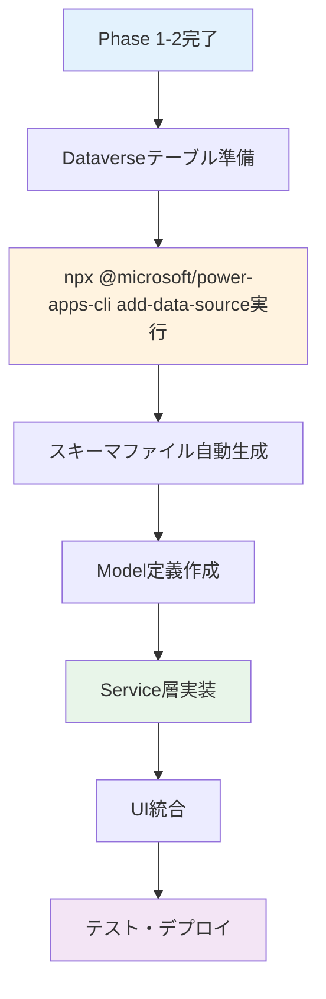

# Dataverse接続 完全ガイド

**最終更新**: 2026年2月5日  
**バージョン**: 1.0  
**対象Phase**: Phase 3（データソース統合）

---

## 📋 このドキュメントについて

このガイドは、Power Apps Code AppsでDataverseに接続し、データの読み書きを実装するための**完全かつ最終版**のドキュメントです。これまでの開発知見を統合し、可読性と再現性を最大限に高めています。

### 対象読者

- Power Apps Code Appsで初めてDataverseに接続する開発者
- Dataverse接続でエラーに遭遇した開発者
- ベストプラクティスに基づいた実装を行いたい開発者

### このガイドで学べること

✅ Dataverseへの正しい接続方法  
✅ データソース追加の標準手順  
✅ Power Apps SDKを使用したCRUD操作  
✅ よくあるエラーとその解決方法  
✅ 実践的な実装パターン

---

## 🎯 前提条件

このガイドを始める前に、以下が完了していることを確認してください：

- [ ] **Phase 0完了**: 開発環境のセットアップ（Node.js、Power Platform CLI）
- [ ] **Phase 1完了**: Microsoft標準テンプレートのデプロイ、SDK初期化エラーがない
- [ ] **Phase 2完了**: 必要な機能の実装（UI、コンポーネント）
- [ ] **Power Platform環境**: Dataverseテーブルが作成済み
- [ ] **認証設定**: `# 認証はCLIコマンド実行時にブラウザが自動的に開きます（別途実行不要）`で環境に認証済み

> **⚠️ 重要**: Phase 3（データソース統合）は、Phase 1とPhase 2が完了した**最後のステップ**です。基盤が安定している状態で実施してください。

---

## 📚 目次

1. [Dataverse接続の全体像](#-dataverse接続の全体像)
2. [Step 1: データソース追加](#step-1-データソース追加)
3. [Step 2: スキーマ確認](#step-2-スキーマ確認)
4. [Step 3: Model定義](#step-3-model定義)
5. [Step 4: Service実装](#step-4-service実装)
6. [Step 5: UIでの利用](#step-5-uiでの利用)
7. [トラブルシューティング](#-トラブルシューティング)
8. [ベストプラクティス](#-ベストプラクティス)
9. [チェックリスト](#-完了チェックリスト)

---

## 🏗️ Dataverse接続の全体像

### 接続フロー



### 技術スタック

| レイヤー | 技術 | 説明 |
|---------|------|------|
| **データソース** | Microsoft Dataverse | Power Platformのデータベース |
| **接続方法** | Power Apps SDK | `@microsoft/power-apps` パッケージ |
| **スキーマ生成** | Power Platform CLI | `npx @microsoft/power-apps-cli add-data-source` コマンド |
| **型定義** | TypeScript | Model定義で型安全性を確保 |
| **データアクセス** | Service層 | ビジネスロジックのカプセル化 |

---

## Step 1: データソース追加

### 1.1 テーブルの論理名を確認

Dataverseテーブルの**論理名（LogicalName）**を確認します。

**確認方法①: Power Apps Maker Portal**
1. https://make.powerapps.com にアクセス
2. **テーブル** → 対象テーブルを選択
3. **設定** → **プロパティ** → **名前**欄を確認

**確認方法②: Power Apps Maker Portal**
```bash
# テーブル論理名はhttps://make.powerapps.com のテーブル設定から確認できます
# （環境の選択は npx @microsoft/power-apps-cli init --environmentId [id] で行います）
```

**例:**
- カスタムテーブル: `geek_businessprocess`, `geek_project`, `geek_task`
- 標準テーブル: `account`, `contact`, `systemuser`

> **💡 ポイント**: 論理名は**単数形**です（例: `geek_project`、複数形の `geek_projects` ではない）

---

### 1.2 データソースを追加

Power Platform CLIを使用してDataverseテーブルをデータソースとして追加します。

#### ✅ 正しいコマンド（推奨）

```bash
npx @microsoft/power-apps-cli add-data-source -a dataverse -t <テーブル論理名>
```

**具体例:**
```bash
# カスタムテーブルを追加
npx @microsoft/power-apps-cli add-data-source -a dataverse -t geek_businessprocess

# 標準テーブルを追加
npx @microsoft/power-apps-cli add-data-source -a dataverse -t account
```

#### コマンドオプションの説明

| オプション | 説明 | 必須 |
|-----------|------|------|
| `-a dataverse` | データソースタイプをDataverseに指定 | ✅ 必須 |
| `-t <論理名>` | テーブルの論理名（単数形） | ✅ 必須 |
| `-c <接続ID>` | 接続ID | ❌ 不要（自動取得） |
| `-d <データセット>` | データセット名 | ❌ 不要（自動設定） |

> **⚠️ 重要**: `-a`オプションには必ず `dataverse` を指定してください。`shared_commondataserviceforapps` は使用しないでください。

---

#### ❌ 避けるべき方法

```bash
# ❌ 間違い: shared_commondataserviceforapps を使用
npx @microsoft/power-apps-cli add-data-source -a "shared_commondataserviceforapps" -c "<Connection-ID>"
```

**問題点:**
- `The interface 'CDPTabular1' was not found` エラーが発生
- スキーマファイルが正しく生成されない
- 手動設定が必要になり複雑化

---

### 1.3 生成されるファイル

`npx @microsoft/power-apps-cli add-data-source`コマンドを実行すると、以下のファイルが自動生成されます：

```
プロジェクトルート/
├── .power/
│   └── schemas/
│       ├── dataverse/
│       │   └── geekbusinessprocesses.Schema.json  ← 新規生成
│       └── appschemas/
│           └── dataSourcesInfo.ts  ← 更新
└── power.config.json  ← 更新
```

#### 1.3.1 スキーマファイル（`.power/schemas/dataverse/`）

テーブルのフィールド定義、型情報が含まれます。

**例: `geekbusinessprocesses.Schema.json`**
```json
{
  "type": "object",
  "properties": {
    "geek_businessprocessid": {
      "type": "string",
      "format": "uuid",
      "x-ms-dataverse-attribute": "geek_businessprocessid"
    },
    "geek_processname": {
      "type": "string",
      "x-ms-dataverse-attribute": "geek_processname"
    },
    "geek_description": {
      "type": "string",
      "x-ms-dataverse-attribute": "geek_description"
    }
  }
}
```

#### 1.3.2 dataSourcesInfo.ts

データソース情報が追加されます。

**例:**
```typescript
export const dataSourcesInfo = {
  "geekbusinessprocesses": {
    "tableId": "geekbusinessprocesses",
    "version": "",
    "primaryKey": "geek_businessprocessid",
    "dataSourceType": "Dataverse",
    "apis": {}
  }
};
```

> **💡 重要**: `tableId`の値（例: `geekbusinessprocesses`）がService実装で使用するテーブル名になります。

#### 1.3.3 power.config.json

データベース参照が追加されます。

```json
{
  "databaseReferences": {
    "dataverse": {
      "type": "Dataverse"
    }
  },
  "dataSources": {
    "geekbusinessprocesses": {
      "tableId": "geekbusinessprocesses"
    }
  }
}
```

---

## Step 2: スキーマ確認

### 2.1 フィールド名の確認

生成されたスキーマファイルからフィールド名を確認します。

**確認箇所:**
```
.power/schemas/dataverse/<テーブル名>.Schema.json
```

**確認すべきポイント:**
- ✅ プライマリキーのフィールド名（通常: `<テーブル名>id`）
- ✅ 必須フィールド
- ✅ 選択肢フィールド（Choice/Picklist）
- ✅ 参照フィールド（Lookup）
- ✅ 日付フィールド

---

### 2.2 Choice（選択肢）フィールドの値確認

スキーマファイルにはChoice値の定義が含まれていないため、Power Apps Maker Portalで確認します。

**確認手順:**
1. https://make.powerapps.com にアクセス
2. **テーブル** → 対象テーブル → **列**
3. Choice列をクリックして詳細を確認

**例: geek_priority（優先度）**
| 値 | 表示名 |
|----|--------|
| 0  | Critical |
| 1  | High |
| 2  | Medium |
| 3  | Low |

> **💡 推奨**: Choice値は`DATAVERSE_SCHEMA_REFERENCE.md`に記録しておくことを推奨します。

---

### 2.3 Lookup（参照）フィールドの確認

Lookupフィールドは別テーブルへの参照です。

**スキーマでの表示:**
```json
{
  "geek_projectid": {
    "type": "string",
    "format": "uuid",
    "x-ms-dataverse-type": "LookupType",
    "x-ms-dataverse-lookup-entity": "geek_project"
  }
}
```

**重要な情報:**
- `geek_projectid`: Lookupフィールド名（GUID）
- `geek_project`: 参照先テーブルの論理名

---

## Step 3: Model定義

### 3.1 基本Model定義

TypeScriptインターフェースでDataverseテーブルの型を定義します。

**ファイル配置:**
```
src/
└── Models/
    └── GeekBusinessProcessModel.ts
```

**基本パターン:**
```typescript
/**
 * Dataverseテーブル: geek_businessprocess
 * 論理名: geek_businessprocess
 * EntitySetName: geekbusinessprocesses
 */

// データ取得時の型
export interface GeekBusinessProcess {
  // プライマリキー
  geek_businessprocessid?: string;
  
  // プライマリネームフィールド
  geek_processname: string;
  
  // カスタムフィールド
  geek_processid?: string;       // Auto Number
  geek_description?: string;     // 複数行テキスト
  geek_markdowndetails?: string; // 複数行テキスト
  
  // システムフィールド
  createdon?: string;   // 作成日時
  modifiedon?: string;  // 更新日時
  statecode?: number;   // 状態コード (0: Active, 1: Inactive)
  statuscode?: number;  // 状態理由
  ownerid?: string;     // 所有者
}

// 新規作成用の型（必須フィールドのみ）
export interface GeekBusinessProcessCreateInput {
  geek_processname: string; // 必須
  geek_description?: string;
  geek_markdowndetails?: string;
}

// 更新用の型（すべてオプショナル）
export interface GeekBusinessProcessUpdateInput {
  geek_processname?: string;
  geek_description?: string;
  geek_markdowndetails?: string;
}
```

---

### 3.2 Choice値のマッピング

Choice（選択肢）フィールドは定数で定義します。

```typescript
// 優先度 (geek_priority)
export const Priority = {
  Critical: 0,
  High: 1,
  Medium: 2,
  Low: 3
} as const;

export type PriorityValue = typeof Priority[keyof typeof Priority];

// 使用例
export interface GeekTask {
  geek_taskid?: string;
  geek_taskname: string;
  geek_priority?: PriorityValue; // 0 | 1 | 2 | 3
}
```

---

### 3.3 Lookup値の扱い

Lookupフィールドは通常GUIDの文字列として扱います。

```typescript
export interface GeekTask {
  geek_taskid?: string;
  geek_taskname: string;
  
  // Lookupフィールド（プロジェクトへの参照）
  _geek_projectid_value?: string; // GUID（読み取り専用）
  geek_projectid?: string;        // GUID（書き込み用）
  
  // $expand で取得した場合の展開データ
  geek_projectid_expanded?: {
    geek_projectid: string;
    geek_projectname: string;
  };
}
```

> **💡 ポイント**: 
> - 読み取り時: `_<フィールド名>_value`（アンダースコアで囲まれた形式）
> - 書き込み時: `<フィールド名>`（通常の形式）
> - 展開時: `<フィールド名>_expanded`（カスタム定義）

---

## Step 4: Service実装

### 4.1 基本Service構造

データアクセスロジックをService層に実装します。

**ファイル配置:**
```
src/
└── Services/
    └── GeekBusinessProcessService.ts
```

**基本パターン:**
```typescript
import { getClient, type DataClient } from '@microsoft/power-apps/data';
import type { IOperationOptions, IOperationResult } from '@microsoft/power-apps/data';
import { dataSourcesInfo } from '../../.power/schemas/appschemas/dataSourcesInfo';
import type { 
  GeekBusinessProcess, 
  GeekBusinessProcessCreateInput, 
  GeekBusinessProcessUpdateInput 
} from '@/Models/GeekBusinessProcessModel';

// テーブル名（dataSourcesInfo の tableId に一致する必要がある）
const TABLE_NAME = 'geekbusinessprocesses';

/**
 * DataClient インスタンスを取得
 */
const getDataClient = (): DataClient => {
  return getClient(dataSourcesInfo);
};

/**
 * 一覧取得
 */
export async function fetchBusinessProcesses(): Promise<GeekBusinessProcess[]> {
  const client = getDataClient();
  
  const options: IOperationOptions = {
    select: [
      'geek_businessprocessid',
      'geek_processname',
      'geek_processid',
      'geek_description',
      'geek_markdowndetails',
      'createdon',
      'modifiedon'
    ],
    orderBy: ['modifiedon desc'],
    filter: 'statecode eq 0', // Activeのみ
  };

  const result: IOperationResult<GeekBusinessProcess[]> = 
    await client.retrieveMultipleRecordsAsync<GeekBusinessProcess>(
      TABLE_NAME,
      options
    );

  // エラーチェック
  if (!result.success) {
    console.error('Fetch error:', result.error);
    throw new Error(`データ取得に失敗しました: ${result.error?.message || '不明なエラー'}`);
  }

  return result.data || [];
}

/**
 * 1件取得
 */
export async function fetchBusinessProcessById(
  id: string
): Promise<GeekBusinessProcess | null> {
  const client = getDataClient();
  
  const options: IOperationOptions = {
    select: [
      'geek_businessprocessid',
      'geek_processname',
      'geek_description',
      'geek_markdowndetails'
    ]
  };

  const result: IOperationResult<GeekBusinessProcess> = 
    await client.retrieveRecordAsync<GeekBusinessProcess>(
      TABLE_NAME,
      id,
      options
    );

  if (!result.success) {
    console.error('Fetch by ID error:', result.error);
    return null;
  }

  return result.data;
}

/**
 * 新規作成
 */
export async function createBusinessProcess(
  input: GeekBusinessProcessCreateInput
): Promise<string> {
  const client = getDataClient();
  
  const result: IOperationResult<string> = 
    await client.createRecordAsync(TABLE_NAME, input);

  if (!result.success) {
    console.error('Create error:', result.error);
    throw new Error(`作成に失敗しました: ${result.error?.message || '不明なエラー'}`);
  }

  return result.data; // 新規作成されたレコードのGUID
}

/**
 * 更新
 */
export async function updateBusinessProcess(
  id: string,
  input: GeekBusinessProcessUpdateInput
): Promise<void> {
  const client = getDataClient();
  
  const result = await client.updateRecordAsync(TABLE_NAME, id, input);

  if (!result.success) {
    console.error('Update error:', result.error);
    throw new Error(`更新に失敗しました: ${result.error?.message || '不明なエラー'}`);
  }
}

/**
 * 削除（論理削除）
 */
export async function deleteBusinessProcess(id: string): Promise<void> {
  const client = getDataClient();
  
  const result = await client.deleteRecordAsync(TABLE_NAME, id);

  if (!result.success) {
    console.error('Delete error:', result.error);
    throw new Error(`削除に失敗しました: ${result.error?.message || '不明なエラー'}`);
  }
}
```

---

### 4.2 ODataクエリオプション

Power Apps SDKは OData クエリオプションをサポートしています。

#### select（フィールド選択）
```typescript
const options: IOperationOptions = {
  select: ['geek_projectid', 'geek_projectname', 'createdon']
};
```

#### filter（フィルタリング）
```typescript
const options: IOperationOptions = {
  // Activeのみ
  filter: 'statecode eq 0',
  
  // 複数条件（AND）
  filter: 'statecode eq 0 and geek_priority eq 0',
  
  // 複数条件（OR）
  filter: 'geek_priority eq 0 or geek_priority eq 1',
  
  // 部分一致検索
  filter: "contains(geek_projectname, '開発')"
};
```

#### orderBy（並び替え）
```typescript
const options: IOperationOptions = {
  orderBy: ['createdon desc'], // 作成日時の降順
  orderBy: ['geek_priority asc', 'createdon desc'] // 複数条件
};
```

#### top（取得件数制限）
```typescript
const options: IOperationOptions = {
  top: 10 // 最新10件のみ
};
```

#### expand（Lookup展開）
```typescript
const options: IOperationOptions = {
  select: ['geek_taskid', 'geek_taskname', '_geek_projectid_value'],
  expand: ['geek_projectid($select=geek_projectid,geek_projectname)']
};
```

---

### 4.3 エラーハンドリングのベストプラクティス

```typescript
export async function fetchBusinessProcesses(): Promise<GeekBusinessProcess[]> {
  try {
    const client = getDataClient();
    const result = await client.retrieveMultipleRecordsAsync<GeekBusinessProcess>(
      TABLE_NAME,
      options
    );

    // 成功判定
    if (!result.success) {
      // エラーの詳細をログ出力
      console.error('Dataverse API Error:', {
        message: result.error?.message,
        code: result.error?.code,
        details: result.error
      });
      
      throw new Error(`データ取得に失敗: ${result.error?.message || '不明なエラー'}`);
    }

    // データが空の場合も正常
    return result.data || [];
    
  } catch (error) {
    console.error('Unexpected error in fetchBusinessProcesses:', error);
    throw error;
  }
}
```

---

## Step 5: UIでの利用

### 5.1 カスタムフックの作成

再利用可能なカスタムフックを作成します。

**ファイル配置:**
```
src/
└── hooks/
    └── useBusinessProcesses.ts
```

**実装例:**
```typescript
import { useState, useEffect } from 'react';
import { usePowerPlatform } from '@microsoft/power-apps';
import { 
  fetchBusinessProcesses,
  createBusinessProcess,
  updateBusinessProcess,
  deleteBusinessProcess
} from '@/Services/GeekBusinessProcessService';
import type { GeekBusinessProcess } from '@/Models/GeekBusinessProcessModel';
import { toast } from 'sonner';

export function useBusinessProcesses() {
  const { isInitialized } = usePowerPlatform();
  const [processes, setProcesses] = useState<GeekBusinessProcess[]>([]);
  const [loading, setLoading] = useState(true);
  const [error, setError] = useState<string | null>(null);

  // データ読み込み
  const loadProcesses = async () => {
    // SDK初期化チェック
    if (!isInitialized) {
      console.log('Power Apps SDK not initialized yet');
      return;
    }

    try {
      setLoading(true);
      setError(null);
      const data = await fetchBusinessProcesses();
      setProcesses(data);
    } catch (err) {
      const message = err instanceof Error ? err.message : 'データ読み込みエラー';
      setError(message);
      toast.error(message);
    } finally {
      setLoading(false);
    }
  };

  // SDK初期化後に自動ロード
  useEffect(() => {
    if (isInitialized) {
      loadProcesses();
    }
  }, [isInitialized]);

  // 作成
  const create = async (input: GeekBusinessProcessCreateInput) => {
    try {
      const id = await createBusinessProcess(input);
      toast.success('作成しました');
      await loadProcesses(); // 再読み込み
      return id;
    } catch (err) {
      const message = err instanceof Error ? err.message : '作成エラー';
      toast.error(message);
      throw err;
    }
  };

  // 更新
  const update = async (id: string, input: GeekBusinessProcessUpdateInput) => {
    try {
      await updateBusinessProcess(id, input);
      toast.success('更新しました');
      await loadProcesses(); // 再読み込み
    } catch (err) {
      const message = err instanceof Error ? err.message : '更新エラー';
      toast.error(message);
      throw err;
    }
  };

  // 削除
  const remove = async (id: string) => {
    try {
      await deleteBusinessProcess(id);
      toast.success('削除しました');
      await loadProcesses(); // 再読み込み
    } catch (err) {
      const message = err instanceof Error ? err.message : '削除エラー';
      toast.error(message);
      throw err;
    }
  };

  return {
    processes,
    loading,
    error,
    reload: loadProcesses,
    create,
    update,
    remove,
    isInitialized
  };
}
```

---

### 5.2 Reactコンポーネントでの使用

```typescript
import { useBusinessProcesses } from '@/hooks/useBusinessProcesses';
import { Button } from '@/components/ui/button';

export function ProcessList() {
  const { 
    processes, 
    loading, 
    error, 
    create, 
    update, 
    remove,
    isInitialized 
  } = useBusinessProcesses();

  // SDK未初期化時
  if (!isInitialized) {
    return (
      <div className="flex items-center justify-center p-8">
        <div className="text-center">
          <div className="animate-spin rounded-full h-12 w-12 border-b-2 border-primary mx-auto"></div>
          <p className="mt-4 text-muted-foreground">Power Apps SDK 初期化中...</p>
        </div>
      </div>
    );
  }

  // ローディング中
  if (loading) {
    return <div>読み込み中...</div>;
  }

  // エラー発生時
  if (error) {
    return (
      <div className="text-red-500">
        エラー: {error}
      </div>
    );
  }

  // データ表示
  return (
    <div>
      <h2>プロセス一覧 ({processes.length}件)</h2>
      
      {processes.length === 0 ? (
        <p className="text-muted-foreground">データがありません</p>
      ) : (
        <ul>
          {processes.map((process) => (
            <li key={process.geek_businessprocessid}>
              {process.geek_processname}
              <Button 
                variant="destructive" 
                size="sm"
                onClick={() => remove(process.geek_businessprocessid!)}
              >
                削除
              </Button>
            </li>
          ))}
        </ul>
      )}

      <Button onClick={() => create({ geek_processname: '新規プロセス' })}>
        新規作成
      </Button>
    </div>
  );
}
```

---

## 🚨 トラブルシューティング

### エラー1: "The interface 'CDPTabular1' was not found"

**原因:**  
`npx @microsoft/power-apps-cli add-data-source` で `-a shared_commondataserviceforapps` を指定している

**解決策:**
```bash
# ✅ 正しいコマンド
npx @microsoft/power-apps-cli add-data-source -a dataverse -t <テーブル論理名>
```

---

### エラー2: "Data source not found: Failed to load Dataverse database references"

**原因:**
- `dataSourcesInfo.ts` にテーブル定義が存在しない
- `power.config.json` の設定が不正

**解決策:**
1. データソースを再追加
```bash
npx @microsoft/power-apps-cli add-data-source -a dataverse -t <テーブル論理名>
```

2. 生成ファイルを確認
```
.power/schemas/dataverse/<テーブル名>.Schema.json
.power/schemas/appschemas/dataSourcesInfo.ts
```

---

### エラー3: "PowerDataRuntime is not initialized"

**原因:**  
Power Apps SDK の初期化前にDataverse APIを呼び出している

**解決策:**  
`usePowerPlatform().isInitialized` で初期化完了を待つ

```typescript
const { isInitialized } = usePowerPlatform();

useEffect(() => {
  if (isInitialized) {
    loadData(); // SDK初期化完了後に実行
  }
}, [isInitialized]);
```

---

### エラー4: "Content Security Policy directive" (CSP違反)

**原因:**  
`fetch` API を直接使用して Dataverse にアクセスしている

**解決策:**  
Power Apps SDK (`@microsoft/power-apps/data`) を使用する

```typescript
// ❌ 避ける
const response = await fetch(dataverseUrl);

// ✅ 推奨
import { getClient } from '@microsoft/power-apps/data';
const client = getClient(dataSourcesInfo);
const result = await client.retrieveMultipleRecordsAsync(...);
```

---

### エラー5: データが取得できない（404エラー）

**原因:**  
テーブル名（EntitySetName）が間違っている

**確認方法:**
1. `power.config.json` の `dataSources` セクションを確認
2. `.power/schemas/dataverse/` フォルダ内のファイル名を確認
3. Service コードの `TABLE_NAME` を上記に合わせる

```typescript
// dataSourcesInfo.ts の tableId と一致させる
const TABLE_NAME = 'geekbusinessprocesses'; // ← ここが重要
```

---

### エラー6: フィールド名のエラー

**原因:**  
Model定義のフィールド名が実際のDataverseスキーマと異なる

**解決策:**
1. `.power/schemas/dataverse/<テーブル名>.Schema.json` でフィールド名を確認
2. Model定義を修正（大文字小文字、アンダースコアまで正確に一致させる）

```typescript
// ❌ 間違い
export interface GeekBusinessProcess {
  processName: string; // キャメルケース
}

// ✅ 正しい
export interface GeekBusinessProcess {
  geek_processname: string; // スキーマと完全一致
}
```

---

## 💡 ベストプラクティス

### 1. データソース追加は正しいコマンドを使用

```bash
# ✅ 推奨
npx @microsoft/power-apps-cli add-data-source -a dataverse -t <テーブル論理名>

# ❌ 非推奨
npx @microsoft/power-apps-cli add-data-source -a shared_commondataserviceforapps -c <接続ID>
```

**理由:**
- スキーマファイルが自動生成される
- 設定ファイルが自動更新される
- エラーが発生しにくい

---

### 2. Power Apps SDK を使用

```typescript
// ✅ 推奨: Power Apps SDK
import { getClient } from '@microsoft/power-apps/data';
const client = getClient(dataSourcesInfo);

// ❌ 非推奨: 直接fetch
fetch(dataverseUrl)
```

**理由:**
- CSP制約を回避
- 認証が自動処理
- 型安全なコーディング
- エラーハンドリングが統一

---

### 3. SDK初期化を必ず確認

```typescript
const { isInitialized } = usePowerPlatform();

// ✅ 推奨: 初期化完了を待つ
useEffect(() => {
  if (isInitialized) {
    loadData();
  }
}, [isInitialized]);

// ❌ 非推奨: 初期化チェックなし
useEffect(() => {
  loadData(); // エラーの原因
}, []);
```

---

### 4. エラーハンドリングを実装

```typescript
// ✅ 推奨: result.success を確認
const result = await client.retrieveMultipleRecordsAsync(...);
if (!result.success) {
  console.error('Error:', result.error);
  throw new Error(result.error?.message || 'Unknown error');
}

// ❌ 非推奨: エラーチェックなし
const result = await client.retrieveMultipleRecordsAsync(...);
return result.data; // エラー時に undefined が返る
```

---

### 5. フィールド名はスキーマと完全一致

```typescript
// ✅ 推奨: スキーマと完全一致
export interface GeekBusinessProcess {
  geek_businessprocessid?: string;
  geek_processname: string;
}

// ❌ 非推奨: キャメルケース変換
export interface GeekBusinessProcess {
  id?: string;
  processName: string;
}
```

---

### 6. Service層でビジネスロジックをカプセル化

```typescript
// ✅ 推奨: Service層を作成
// GeekBusinessProcessService.ts
export async function fetchBusinessProcesses() { ... }

// UIコンポーネント
import { fetchBusinessProcesses } from '@/Services/GeekBusinessProcessService';

// ❌ 非推奨: UIコンポーネントで直接呼び出し
const client = getClient(dataSourcesInfo);
const result = await client.retrieveMultipleRecordsAsync(...);
```

---

### 7. カスタムフックで再利用性を向上

```typescript
// ✅ 推奨: カスタムフック
export function useBusinessProcesses() {
  // ロジックをカプセル化
  return { processes, loading, error, create, update, remove };
}

// 複数のコンポーネントで再利用
const { processes } = useBusinessProcesses();
```

---

## ✅ 完了チェックリスト

実装が完了したら、以下を確認してください：

### データソース追加
- [ ] `npx @microsoft/power-apps-cli add-data-source -a dataverse -t <論理名>` を実行済み
- [ ] `.power/schemas/dataverse/` にスキーマファイルが生成されている
- [ ] `.power/schemas/appschemas/dataSourcesInfo.ts` が更新されている
- [ ] `power.config.json` の `databaseReferences` が追加されている

### Model定義
- [ ] Model定義ファイル（`src/Models/`）を作成
- [ ] フィールド名がスキーマと完全一致
- [ ] 必須フィールドとオプショナルフィールドを区別
- [ ] Create/Update用の型を定義

### Service実装
- [ ] Service層（`src/Services/`）を実装
- [ ] `TABLE_NAME` が `dataSourcesInfo.ts` の `tableId` と一致
- [ ] Power Apps SDK (`getClient`) を使用
- [ ] `result.success` でエラーチェックを実装
- [ ] 適切なエラーメッセージを設定

### UI統合
- [ ] カスタムフック（`src/hooks/`）を実装
- [ ] `usePowerPlatform().isInitialized` で初期化確認
- [ ] ローディング状態の表示
- [ ] エラー状態の表示
- [ ] CRUD操作が正常に動作

### テスト
- [ ] ローカル環境（`npm run dev`）で動作確認
- [ ] Power Apps環境（`npx @microsoft/power-apps-cli init` + `npm run dev`）で動作確認
- [ ] データの作成が成功
- [ ] データの読み取りが成功
- [ ] データの更新が成功
- [ ] データの削除が成功

### デプロイ
- [ ] `npm run build` でビルド成功
- [ ] `npx @microsoft/power-apps-cli push` でデプロイ成功
- [ ] Power Apps環境でアプリが起動
- [ ] 実データが正しく表示

---

## 📚 参考リンク

### 公式ドキュメント
- [Power Platform CLI - add-data-source コマンド](https://learn.microsoft.com/en-us/power-platform/developer/cli/reference/code#pac-code-add-data-source)
- [Power Apps SDK - Data クライアント](https://learn.microsoft.com/en-us/power-apps/developer/model-driven-apps/clientapi/reference)
- [Dataverse Web API Reference](https://learn.microsoft.com/en-us/power-apps/developer/data-platform/webapi/overview)
- [OData Query Options](https://learn.microsoft.com/en-us/power-apps/developer/data-platform/webapi/query-data-web-api)
- [Power Apps Code Apps 概要](https://learn.microsoft.com/en-us/power-apps/maker/canvas-apps/code-apps/overview)

### 関連ドキュメント
- [CodeAppsDevelopmentStandard](https://github.com/geekfujiwara/CodeAppsDevelopmentStandard)
- [DATAVERSE_INTEGRATION_BEST_PRACTICES.md](./DATAVERSE_INTEGRATION_BEST_PRACTICES.md) - 詳細なベストプラクティス
- [HOW_TO_GET_DATAVERSE_SCHEMA.md](./HOW_TO_GET_DATAVERSE_SCHEMA.md) - スキーマ取得方法
- [DATAVERSE_TROUBLESHOOTING.md](./DATAVERSE_TROUBLESHOOTING.md) - トラブルシューティング
- [LOOKUP_FIELD_GUIDE.md](./LOOKUP_FIELD_GUIDE.md) - Lookupフィールド実装ガイド

---

## 📝 まとめ

### 重要ポイント

1. **✅ `npx @microsoft/power-apps-cli add-data-source -a dataverse` を使用**
   - テーブル論理名（単数形）のみ指定
   - スキーマは自動生成される

2. **✅ Power Apps SDK を使用してアクセス**
   - CSP制約を回避
   - 型安全なコーディング
   - 自動認証処理

3. **✅ SDK初期化を必ず確認**
   - `usePowerPlatform().isInitialized` で確認
   - 初期化完了後にデータアクセス

4. **✅ フィールド名はスキーマと完全一致**
   - `.power/schemas/dataverse/` で確認
   - 大文字小文字、アンダースコアまで正確に

5. **✅ Service層でビジネスロジックをカプセル化**
   - 再利用可能な設計
   - エラーハンドリングの統一

### 期待される効果

- ⏱️ **開発時間の大幅短縮**: 正しいコマンドで一発スキーマ生成
- 🐛 **トラブルシューティング時間削減**: CSPエラーやインターフェイス不一致を回避
- 📝 **コードの一貫性**: Power Apps SDKによる統一されたアクセス方法
- 🔒 **セキュリティ**: 自動認証処理により安全なアクセス
- 🚀 **スケーラビリティ**: 標準パターンで複数テーブルにも容易に対応

---

**最終更新**: 2026年2月5日  
**バージョン**: 1.0  
**作成者**: Dataverse接続ドキュメント統合プロジェクト

このドキュメントについての質問や改善提案は、GitHubのIssueでお知らせください。

---
