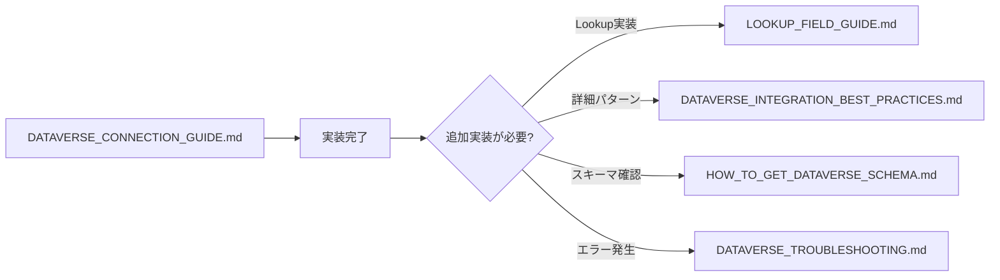
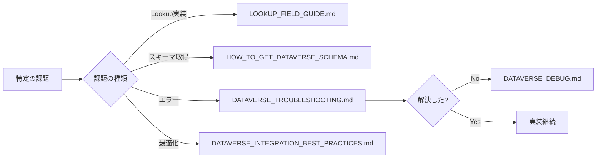

# Dataverse関連ドキュメント概要

**最終更新**: 2026年2月25日  
**目的**: Dataverse接続に関するドキュメント群の全体像と活用方法

> **📘 公式リファレンス**: すべてのDataverse接続実装は [Microsoft 公式 Dataverse 接続ガイド](https://learn.microsoft.com/ja-jp/power-apps/developer/code-apps/how-to/connect-to-dataverse) に基づいています。

---

## 📚 ドキュメント体系

Dataverse接続に関するドキュメントは、以下のような階層構造になっています：

```
Dataverse関連ドキュメント
│
├── 📘 統合ガイド（最初に読むべき）
│   └── DATAVERSE_CONNECTION_GUIDE.md - 完全な統合ガイド
│
├── 📖 詳細リファレンス（必要に応じて参照）
│   ├── DATAVERSE_INTEGRATION_BEST_PRACTICES.md - ベストプラクティス詳細
│   ├── LOOKUP_FIELD_GUIDE.md - Lookupフィールド実装
│   ├── DATAVERSE_SCHEMA_REFERENCE.md - スキーマ定義
│   └── HOW_TO_GET_DATAVERSE_SCHEMA.md - スキーマ取得方法
│
├── 🚨 トラブルシューティング
│   ├── DATAVERSE_TROUBLESHOOTING.md - 一般的なエラー
│   └── DATAVERSE_DEBUG.md - デバッグ方法
│
└── 📦 実装履歴（アーカイブ）
    ├── DATAVERSE_CHOICE_FIELD_FIX.md
    ├── DATAVERSE_SYSTEM_FIELDS_FIX.md
    ├── DATAVERSE_LOOKUP_FIELD_FIX.md
    └── DATASOURCE_NAME_FIX.md
```

---

## 🎯 どのドキュメントを読むべきか？

### 初めてDataverse接続を実装する方

**ステップ1: 統合ガイドを読む**
- **[DATAVERSE_CONNECTION_GUIDE.md](./DATAVERSE_CONNECTION_GUIDE.md)** 📘
  - Step-by-Stepで完全に網羅
  - データソース追加からCRUD実装まで
  - トラブルシューティング統合
  - ベストプラクティス集約

**これだけで基本的な実装は完了します！**

---

### より詳細な実装パターンを知りたい方

統合ガイドで基本を理解した後、以下を参照：

1. **[DATAVERSE_INTEGRATION_BEST_PRACTICES.md](./DATAVERSE_INTEGRATION_BEST_PRACTICES.md)** 📖
   - 実際のプロジェクトでの実装例
   - より詳細なコードパターン
   - パフォーマンス最適化

2. **[LOOKUP_FIELD_GUIDE.md](./LOOKUP_FIELD_GUIDE.md)** 📖
   - Lookupフィールドの詳細実装
   - ビュー切り替え機能
   - `$expand`による展開

---

### スキーマ情報を取得したい方

**[HOW_TO_GET_DATAVERSE_SCHEMA.md](./HOW_TO_GET_DATAVERSE_SCHEMA.md)** 📖
- Power Apps Maker Portal での確認方法
- Dataverse Web API の使用方法
- 5つの取得方法の比較

**[DATAVERSE_SCHEMA_REFERENCE.md](./DATAVERSE_SCHEMA_REFERENCE.md)** 📖
- 実際のスキーマ定義例
- Choice値のリスト
- リレーション定義

---

### エラーが発生した方

**まず統合ガイドのトラブルシューティングを確認:**
- **[DATAVERSE_CONNECTION_GUIDE.md - トラブルシューティング](./DATAVERSE_CONNECTION_GUIDE.md#-トラブルシューティング)** 📘

**それでも解決しない場合:**
- **[DATAVERSE_TROUBLESHOOTING.md](./DATAVERSE_TROUBLESHOOTING.md)** 🚨
  - プロジェクト固有のエラー事例
  - 詳細なデバッグ手順

- **[DATAVERSE_DEBUG.md](./DATAVERSE_DEBUG.md)** 🚨
  - デバッグ方法の詳細
  - ログ確認手順

---

## 📖 各ドキュメントの特徴

### DATAVERSE_CONNECTION_GUIDE.md（統合ガイド）

**特徴:**
- ✅ Step-by-Stepの完全ガイド
- ✅ 再現性を最重視
- ✅ トラブルシューティング統合
- ✅ ベストプラクティス集約
- ✅ 最新の情報に基づく

**対象読者:**
- 初めてDataverse接続を実装する方
- 確実な手順を求める方
- 包括的なガイドが欲しい方

**読む順序:** **最初に読む**

---

### DATAVERSE_INTEGRATION_BEST_PRACTICES.md

**特徴:**
- ✅ 実プロジェクトでの実装例
- ✅ より詳細なコードパターン
- ✅ 具体的なユースケース

**対象読者:**
- 統合ガイドで基本を理解した方
- より深い実装パターンを知りたい方
- 実例ベースで学びたい方

**読む順序:** 統合ガイドの次

---

### LOOKUP_FIELD_GUIDE.md

**特徴:**
- ✅ Lookupフィールド専門ガイド
- ✅ 1589行の包括的な内容
- ✅ ビュー切り替え実装
- ✅ 50以上のテストチェック項目

**対象読者:**
- Lookupフィールドを実装する方
- 参照関係を扱う方

**読む順序:** Lookup実装時

---

### HOW_TO_GET_DATAVERSE_SCHEMA.md

**特徴:**
- ✅ 5つのスキーマ取得方法を比較
- ✅ 自動化可能な方法も紹介
- ✅ 実践的なワークフロー

**対象読者:**
- スキーマ情報を取得したい方
- Choice値を確認したい方

**読む順序:** スキーマ確認時

---

### DATAVERSE_SCHEMA_REFERENCE.md

**特徴:**
- ✅ 実際のテーブル定義
- ✅ Choice値の完全リスト
- ✅ リレーション定義

**対象読者:**
- スキーマ定義を参照したい方
- Choice値マッピングを確認したい方

**読む順序:** 実装中の参照用

---

### DATAVERSE_TROUBLESHOOTING.md

**特徴:**
- ✅ 実際に発生したエラー事例
- ✅ プロジェクト固有の問題
- ✅ 詳細なデバッグ手順

**対象読者:**
- エラーが発生した方
- 詳細なデバッグ情報が欲しい方

**読む順序:** エラー発生時

---

### DATAVERSE_DEBUG.md

**特徴:**
- ✅ デバッグ方法の詳細
- ✅ ログ確認手順
- ✅ Power Apps環境でのデバッグ

**対象読者:**
- デバッグ方法を知りたい方
- ログ確認が必要な方

**読む順序:** デバッグ時

---

## 🔄 推奨される学習フロー

### 初心者向けフロー



### 中級者向けフロー



---

## 💡 ドキュメント活用のコツ

### 1. 最初は統合ガイドだけ読む

**DATAVERSE_CONNECTION_GUIDE.md** は、すべての重要情報を統合しています。
最初は他のドキュメントを読まず、この1つだけを読んで実装を進めてください。

### 2. 必要になったら詳細を参照

基本実装が完了し、より詳細な情報が必要になったら、該当する専門ドキュメントを参照してください。

### 3. エラーは統合ガイドで解決

エラーが発生したら、まず統合ガイドのトラブルシューティングを確認してください。
主要なエラーはすでに統合されています。

### 4. 実装履歴は参照不要

アーカイブドキュメント（`*_FIX.md`）は、過去の問題解決記録です。
通常の実装では参照不要です。

---

## 📊 ドキュメントの優先度

### 優先度: 高

1. **DATAVERSE_CONNECTION_GUIDE.md** - 最優先、必読
2. **LOOKUP_FIELD_GUIDE.md** - Lookup実装時は必読

### 優先度: 中

3. **DATAVERSE_INTEGRATION_BEST_PRACTICES.md** - 詳細パターン参照時
4. **HOW_TO_GET_DATAVERSE_SCHEMA.md** - スキーマ取得時
5. **DATAVERSE_SCHEMA_REFERENCE.md** - スキーマ参照時

### 優先度: 低（必要時のみ）

6. **DATAVERSE_TROUBLESHOOTING.md** - エラー発生時
7. **DATAVERSE_DEBUG.md** - デバッグ時
8. アーカイブドキュメント - 通常は不要

---

## 🔗 関連リンク

### 開発標準
- [メインREADME.md - Phase 3](../README.md#phase-3-データソース統合)
- [PHASE3_DATA_INTEGRATION.md](../PHASE3_DATA_INTEGRATION.md)

### 公式ドキュメント
- **[Microsoft 公式 Dataverse 接続ガイド](https://learn.microsoft.com/ja-jp/power-apps/developer/code-apps/how-to/connect-to-dataverse)** ⭐ 最新の公式ガイド
- [Power Platform CLI リファレンス](https://learn.microsoft.com/en-us/power-platform/developer/cli/reference/code)
- [Dataverse Web API](https://learn.microsoft.com/en-us/power-apps/developer/data-platform/webapi/overview)
- [Power Apps Code Apps](https://learn.microsoft.com/en-us/power-apps/developer/code-apps/)
- [単一値ナビゲーションプロパティの関連付け（Lookup）](https://learn.microsoft.com/ja-jp/power-apps/developer/data-platform/webapi/associate-disassociate-entities-using-web-api#associate-with-a-single-valued-navigation-property)
- [Dataverse サンプルコードアプリ](https://github.com/microsoft/PowerAppsCodeApps/tree/main/samples/Dataverse)

---

## 📝 まとめ

### シンプルな原則

1. **最初に読むのは1つだけ: DATAVERSE_CONNECTION_GUIDE.md**
2. **基本実装はこれだけで完了**
3. **必要になったら専門ドキュメントを参照**
4. **エラーは統合ガイドで解決**

### ドキュメント構成の理由

- **統合ガイド**: これまでの知見を集約し、最も効率的な学習パスを提供
- **詳細リファレンス**: より深い理解が必要な際の専門ガイド
- **トラブルシューティング**: 問題解決時の詳細情報
- **アーカイブ**: 過去の問題解決記録（通常は参照不要）

---

**最終更新**: 2026年2月25日  
**作成者**: Dataverse接続ドキュメント統合プロジェクト

このドキュメントについての質問や改善提案は、GitHubのIssueでお知らせください。
