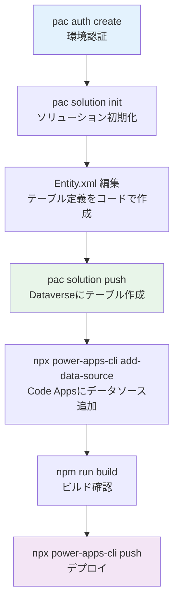

# DataverseテーブルとソリューションのCLI操作ガイド

> **📢 新しい開発方針 (2026年2月〜)**
>
> Dataverseのテーブル作成・スキーマ設計・ソリューション管理は、すべて**Power Platform CLI（`pac`）を使用したCLI操作**で行います。
> 手動UIでのテーブル作成やXMLファイルの読み込みは廃止します。

---

## 📋 このガイドについて

このガイドでは、Power Platform CLI（`pac`）を使用して:

✅ **新規テーブルの作成** - CLIでソリューション定義ファイルを使って作成  
✅ **既存テーブルのスキーマ取得** - CLIで既存テーブルのYAML定義を取得  
✅ **ソリューションの作成・管理** - CLIでソリューションをひとまとめに管理  
✅ **開発フローの統一** - コードベースで全テーブル設計を管理

---

## 📚 目次

1. [前提条件: pac CLIのインストールと認証](#step-0-前提条件-pac-cliのインストールと認証)
2. [ソリューションの作成](#step-1-ソリューションの作成)
3. [既存テーブルのスキーマ取得](#step-2-既存テーブルのスキーマ取得)
4. [新規テーブルの作成](#step-3-新規テーブルの作成)
5. [ソリューションのエクスポート・インポート](#step-4-ソリューションのエクスポートインポート)
6. [Code Appsプロジェクトとの統合](#step-5-code-appsプロジェクトとの統合)
7. [推奨開発フロー](#推奨開発フロー)

---

## Step 0: 前提条件 pac CLIのインストールと認証

### pac CLI（Power Platform CLI）のインストール

Code Appsの開発（`@microsoft/power-apps-cli`）とは別に、Dataverseテーブル・ソリューション管理のために **Power Platform CLI（`pac`）** が必要です。

```bash
# Windows (winget)
winget install Microsoft.PowerAppsCLI

# または npm経由（クロスプラットフォーム）
npm install -g @microsoft/powerplatform-cli

# macOS (Homebrew)
brew tap microsoft/homebrew-pac
brew install pac
```

> **💡 ヒント**: VS Codeの **Power Platform Tools** 拡張機能をインストールすると、`pac` CLI も同梱されます。

**インストール確認:**
```bash
pac --version
# Power Apps CLI
# Version: x.x.x
```

### pac CLIの認証

```bash
# Power Platform環境に認証（ブラウザが自動的に開きます）
pac auth create --name MyDev --environment https://orgXXXXXX.crm7.dynamics.com

# 認証状態を確認
pac auth list

# デフォルト認証プロファイルの選択
pac auth select --index 1
```

> **🔄 認証の使い分け**:
> - `@microsoft/power-apps-cli` → Code Appsのデプロイ・データソース追加
> - `pac` → Dataverseテーブル作成・ソリューション管理

---

## Step 1: ソリューションの作成

ソリューションはDataverseのテーブル・フロー・アプリをひとまとめに管理する単位です。**すべてのテーブルはソリューション経由でCLIから管理します。**

### 1.1 新規ソリューションの作成

```bash
# ソリューション用ディレクトリを作成
mkdir solutions
cd solutions

# ソリューションを作成（環境にソリューションが登録されます）
pac solution create \
  --name "GeekTaskManager" \
  --display-name "Geek Task Manager" \
  --version "1.0.0.0" \
  --publisher-name "GeekFujiwara" \
  --publisher-prefix "geek"
```

**パラメータ説明:**
- `--name`: ソリューションの一意な名前（英数字とアンダースコアのみ）
- `--display-name`: 表示名（日本語可）
- `--version`: バージョン番号
- `--publisher-name`: 発行者名
- `--publisher-prefix`: テーブル列名のプレフィックス（例: `geek_`）

### 1.2 既存ソリューションの確認

```bash
# 環境内のソリューション一覧を確認
pac solution list

# 出力例:
# Unique Name                  Friendly Name          Version    Publisher
# ---------------------------  ---------------------  ---------  ----------
# GeekTaskManager              Geek Task Manager      1.0.0.0    GeekFujiwara
# Default                      Common Data Services   0.0.0.0    Microsoft
```

---

## Step 2: 既存テーブルのスキーマ取得

### 2.1 テーブル定義のエクスポート（CLIで取得）

```bash
# ソリューションをエクスポートして既存テーブル定義を取得
pac solution export \
  --name "GeekTaskManager" \
  --path ./solutions/export \
  --managed false

# エクスポートされたファイル構造:
# solutions/export/
# ├── GeekTaskManager.zip         (ソリューションパッケージ)
```

```bash
# ZIPを展開してYAML定義を確認
cd solutions/export
unzip GeekTaskManager.zip -d GeekTaskManager

# テーブル定義ファイルが展開されます:
# GeekTaskManager/
# ├── Entities/
# │   ├── geek_project/
# │   │   └── Entity.xml
# │   └── geek_project_task/
# │       └── Entity.xml
# └── solution.xml
```

### 2.2 modelbuilder でTypeScript型定義を生成（スキーマ確認用）

```bash
# 既存テーブルからC#型定義（スキーマ情報）を生成
pac modelbuilder build \
  --outdirectory ./generated-models \
  --entitynamesfilter "geek_project;geek_project_task" \
  --generateGlobalOptionSets \
  --language CS

# 生成されたC#コードには選択肢列の定義が含まれます:
# generated-models/
# ├── geek_project.cs
# └── geek_project_task.cs
```

> **💡 用途**: スキーマ確認やTypeScript型定義作成の参考に使用します。
> Code Appsのサービスクラスは `npx @microsoft/power-apps-cli add-data-source` で自動生成します。

### 2.3 テーブル論理名の一覧取得

```bash
# 環境のテーブル一覧を確認（pac経由）
pac env who
# 環境情報が表示されます

# Dataverse Web APIでテーブル一覧を取得
# (pac CLIから直接クエリ実行)
pac data export --environment https://orgXXXXXX.crm7.dynamics.com \
  --table EntityDefinitions \
  --filter "IsCustomEntity eq true"
```

---

## Step 3: 新規テーブルの作成

### 3.1 ソリューションをローカルに展開

```bash
# ソリューションをローカルのソースコード形式で取得
pac solution clone \
  --name "GeekTaskManager" \
  --outputDirectory ./solutions/GeekTaskManager \
  --processCanvasApps

# または新規ソリューションの場合は初期化
pac solution init \
  --publisher-name "GeekFujiwara" \
  --publisher-prefix "geek" \
  --outputDirectory ./solutions/GeekTaskManager
```

### 3.2 テーブル定義ファイルを作成（YAML/XML）

ソリューションディレクトリにテーブル定義ファイルを作成します:

```bash
# テーブルディレクトリを作成
mkdir -p ./solutions/GeekTaskManager/Entities/geek_project_task
```

**テーブル定義ファイル作成例** (`geek_project_task/Entity.xml`):

```xml
<?xml version="1.0" encoding="utf-8"?>
<Entity>
  <Name LocalizedName="プロジェクトタスク" OriginalName="geek_project_task">
    <LocalizedNames>
      <LocalizedName description="プロジェクトタスク" languagecode="1041" />
      <LocalizedName description="Project Task" languagecode="1033" />
    </LocalizedNames>
  </Name>
  <EntityInfo>
    <entity Name="geek_project_task">
      <LocalizedNames>
        <LocalizedName description="プロジェクトタスク" languagecode="1041" />
      </LocalizedNames>
      <LocalizedCollectionNames>
        <LocalizedCollectionName description="プロジェクトタスク" languagecode="1041" />
      </LocalizedCollectionNames>
      <PrimaryNameAttribute>geek_name</PrimaryNameAttribute>
      <EntitySetName>geek_project_tasks</EntitySetName>
      <attributes>
        <!-- タスク名 -->
        <attribute PhysicalName="geek_name">
          <Type>nvarchar</Type>
          <Name>geek_name</Name>
          <LogicalName>geek_name</LogicalName>
          <RequiredLevel>required</RequiredLevel>
          <MaxLength>100</MaxLength>
          <displaynames>
            <displayname description="タスク名" languagecode="1041" />
          </displaynames>
        </attribute>
        <!-- 説明 -->
        <attribute PhysicalName="geek_description">
          <Type>ntext</Type>
          <Name>geek_description</Name>
          <LogicalName>geek_description</LogicalName>
          <RequiredLevel>none</RequiredLevel>
          <displaynames>
            <displayname description="説明" languagecode="1041" />
          </displaynames>
        </attribute>
        <!-- 優先度 (選択肢) -->
        <attribute PhysicalName="geek_priority">
          <Type>picklist</Type>
          <Name>geek_priority</Name>
          <LogicalName>geek_priority</LogicalName>
          <RequiredLevel>none</RequiredLevel>
          <displaynames>
            <displayname description="優先度" languagecode="1041" />
          </displaynames>
          <optionset>
            <options>
              <option value="0">
                <labels>
                  <label languagecode="1041" description="Critical" />
                  <label languagecode="1033" description="Critical" />
                </labels>
              </option>
              <option value="1">
                <labels>
                  <label languagecode="1041" description="High" />
                  <label languagecode="1033" description="High" />
                </labels>
              </option>
              <option value="2">
                <labels>
                  <label languagecode="1041" description="Medium" />
                  <label languagecode="1033" description="Medium" />
                </labels>
              </option>
              <option value="3">
                <labels>
                  <label languagecode="1041" description="Low" />
                  <label languagecode="1033" description="Low" />
                </labels>
              </option>
            </options>
          </optionset>
        </attribute>
        <!-- ステータス (選択肢) -->
        <attribute PhysicalName="geek_status">
          <Type>picklist</Type>
          <Name>geek_status</Name>
          <LogicalName>geek_status</LogicalName>
          <RequiredLevel>none</RequiredLevel>
          <displaynames>
            <displayname description="ステータス" languagecode="1041" />
          </displaynames>
          <optionset>
            <options>
              <option value="0">
                <labels>
                  <label languagecode="1041" description="未着手" />
                  <label languagecode="1033" description="Not Started" />
                </labels>
              </option>
              <option value="1">
                <labels>
                  <label languagecode="1041" description="進行中" />
                  <label languagecode="1033" description="In Progress" />
                </labels>
              </option>
              <option value="2">
                <labels>
                  <label languagecode="1041" description="完了" />
                  <label languagecode="1033" description="Completed" />
                </labels>
              </option>
            </options>
          </optionset>
        </attribute>
        <!-- 期限 -->
        <attribute PhysicalName="geek_duedate">
          <Type>datetime</Type>
          <Name>geek_duedate</Name>
          <LogicalName>geek_duedate</LogicalName>
          <RequiredLevel>none</RequiredLevel>
          <Format>DateOnly</Format>
          <displaynames>
            <displayname description="期限" languagecode="1041" />
          </displaynames>
        </attribute>
      </attributes>
    </entity>
  </EntityInfo>
</Entity>
```

### 3.3 ソリューションをPushしてテーブルを作成

```bash
# ローカルのソリューション定義を環境に適用（テーブルが作成されます）
pac solution push \
  --solution-folder ./solutions/GeekTaskManager \
  --environment https://orgXXXXXX.crm7.dynamics.com

# または ZIPパッケージとしてビルドしてインポート
pac solution pack \
  --zipfile ./solutions/GeekTaskManager.zip \
  --folder ./solutions/GeekTaskManager

pac solution import \
  --path ./solutions/GeekTaskManager.zip \
  --environment https://orgXXXXXX.crm7.dynamics.com
```

> **✅ これにより、テーブルが自動的にDataverse環境に作成されます。**
> UIでのテーブル作成は不要です。

---

## Step 4: ソリューションのエクスポート・インポート

### 4.1 開発環境からソリューションをエクスポート

```bash
# アンマネージドソリューションをエクスポート（開発環境用）
pac solution export \
  --name "GeekTaskManager" \
  --path ./solutions/exports \
  --managed false

# マネージドソリューションをエクスポート（本番環境用）
pac solution export \
  --name "GeekTaskManager" \
  --path ./solutions/exports \
  --managed true
```

### 4.2 本番環境へのインポート

```bash
# マネージドソリューションを本番環境にインポート
pac solution import \
  --path ./solutions/exports/GeekTaskManager_managed.zip \
  --environment https://org-production.crm7.dynamics.com \
  --managed
```

### 4.3 ソリューションのバージョン管理

```bash
# ソリューションをソースコード形式で展開（Gitで管理）
pac solution unpack \
  --zipfile ./solutions/exports/GeekTaskManager.zip \
  --folder ./solutions/GeekTaskManager \
  --processCanvasApps

# ソースコードからソリューションを再パック
pac solution pack \
  --zipfile ./solutions/GeekTaskManager.zip \
  --folder ./solutions/GeekTaskManager
```

> **✅ ソリューションのソースファイルをGitで管理することで、テーブル設計の変更履歴を追跡できます。**

---

## Step 5: Code Appsプロジェクトとの統合

ソリューションでテーブルを作成したら、Code Appsプロジェクトにデータソースを追加します。

### 5.1 データソースの追加

```bash
# テーブルをCode Appsのデータソースとして追加
# (pac CLIで作成したテーブルに接続)
npx @microsoft/power-apps-cli add-data-source \
  -a dataverse \
  -t geek_project_task

# 複数テーブルをまとめて追加
npx @microsoft/power-apps-cli add-data-source -a dataverse -t geek_project
npx @microsoft/power-apps-cli add-data-source -a dataverse -t geek_project_task
```

### 5.2 自動生成されるファイルの確認

```bash
# コマンド実行後に自動生成されるファイル:
src/generated/
├── services/
│   ├── Geek_projectsService.ts       ← サービスクラス
│   └── Geek_project_tasksService.ts
└── models/
    ├── Geek_projectsModel.ts          ← 型定義
    └── Geek_project_tasksModel.ts
```

### 5.3 ビルドとデプロイ

```bash
# ビルド確認
npm run build

# Power Apps環境にデプロイ
npx @microsoft/power-apps-cli push
```

---

## 推奨開発フロー

### 🔄 CLIベースの完全な開発フロー

```
1. pac auth create          → pac CLIで環境認証
2. pac solution init        → ソリューションを初期化
3. Entity.xml 作成          → テーブル定義ファイルをコードで作成
4. pac solution push        → CLIでテーブルをDataverseに作成
5. npx power-apps-cli add-data-source → Code Appsにデータソース追加
6. npm run build && push     → Code Appsをデプロイ
```



### ✅ 新フロー vs ❌ 旧フロー

| 操作 | ❌ 旧フロー（廃止） | ✅ 新フロー（推奨） |
|------|-------------------|--------------------|
| **テーブル作成** | Maker Portal で手動作成 | `pac solution push` でCLIから作成 |
| **テーブル設計確認** | Maker Portal のUIで確認 | `pac solution export` → YAMLで確認 |
| **スキーマ取得** | XML手動エクスポート | `pac modelbuilder build` でCLI取得 |
| **ソリューション管理** | Portal で手動エクスポート | `pac solution export/import` でCLI管理 |
| **バージョン管理** | なし（手動管理） | Gitでソリューションファイルを管理 |

---

## 🔧 よくある操作コマンド集

```bash
# ===== pac認証 =====
pac auth create --name MyDev --environment https://orgXXX.crm7.dynamics.com
pac auth list                    # 認証プロファイル一覧
pac auth select --index 1        # デフォルトプロファイル選択
pac auth delete --index 1        # プロファイル削除

# ===== ソリューション管理 =====
pac solution list                                    # ソリューション一覧
pac solution create --name "MySolution" ...          # ソリューション作成
pac solution export --name "MySolution" --path ./ --managed false  # エクスポート
pac solution import --path ./MySolution.zip          # インポート
pac solution push --solution-folder ./MySolution     # ローカルからpush
pac solution unpack --zipfile ./MySolution.zip --folder ./MySolution  # 展開

# ===== テーブル・データ確認 =====
pac modelbuilder build --outdirectory ./models --entitynamesfilter "tablename"
pac data export --table EntityDefinitions            # テーブル一覧取得

# ===== @microsoft/power-apps-cli（Code Apps用） =====
npx @microsoft/power-apps-cli add-data-source -a dataverse -t tablename
npx @microsoft/power-apps-cli push                   # Code Appsデプロイ
```

---

## 📚 参考リンク

- [Power Platform CLI リファレンス](https://learn.microsoft.com/ja-jp/power-platform/developer/cli/reference/)
- [pac solution コマンド](https://learn.microsoft.com/ja-jp/power-platform/developer/cli/reference/solution)
- [pac auth コマンド](https://learn.microsoft.com/ja-jp/power-platform/developer/cli/reference/auth)
- [pac modelbuilder コマンド](https://learn.microsoft.com/ja-jp/power-platform/developer/cli/reference/modelbuilder)
- [Dataverse テーブルのXMLスキーマ定義](https://learn.microsoft.com/ja-jp/power-apps/developer/data-platform/entity-metadata)
- [ソリューションコンポーネントのファイル形式](https://learn.microsoft.com/ja-jp/power-platform/alm/solution-component-file-reference)
