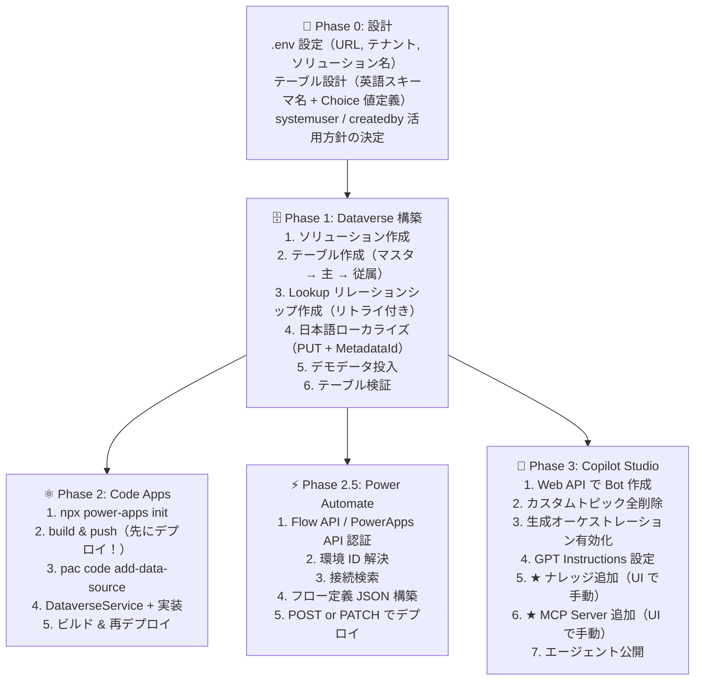

# Power Platform コードファースト開発標準

> **Geek Fujiwara 作成** — Power Apps Code Apps・Dataverse・Copilot Studio を VS Code + GitHub Copilot でコードファーストに構築するための開発標準。  
> GitHub Copilot Agent モードと Awesome Copilot プラグインを最大限活用し、VS Code から Power Platform ソリューションを構築する実践ガイド。

> [!NOTE]
> 推奨モデル: Claude Opus 4.6

---

## 目次

1. [設計原則](#1-設計原則)
2. [前提条件と環境セットアップ](#2-前提条件と環境セットアップ)
3. [Dataverse テーブル設計・作成](#3-dataverse-テーブル設計作成)
4. [Code Apps 開発](#4-code-apps-開発)
5. [Power Automate フロー開発](#5-power-automate-フロー開発)
6. [Copilot Studio エージェント開発](#6-copilot-studio-エージェント開発)
7. [トラブルシューティング・再発防止](#7-トラブルシューティング再発防止)
8. [開発フロー全体図](#8-開発フロー全体図)
9. [チェックリスト](#9-チェックリスト)

---

## 1. 設計原則

### 1.1 既存のシステムテーブルを最大限活用する

| やりがちなミス | 正しいアプローチ |
|---|---|
| 「報告者」カスタム Lookup を自作 | Dataverse 既定の `createdby`（作成者）列を利用 |
| 「担当者」用のカスタムユーザーテーブル | `systemuser` テーブルへの Lookup を設定 |
| ステータス管理テーブルを自作 | Choice（選択肢）列を使用 |

> **教訓**: カスタム Lookup `ReportedById` を作成後に削除（`delete_reportedby_column.py`）する手戻りが発生した。`createdby` は自動で設定されるため、レコード作成者 = 報告者という設計が最もシンプル。

### 1.2 スキーマ名は英語、表示名は日本語

Dataverse のスキーマ名（Logical Name）は**必ず英語**で設計する。日本語の表示名は後工程でローカライズする。

```
✅ 正しい: テーブル geek_incident、列 geek_description
❌ 間違い: テーブル geek_インシデント、列 geek_説明
```

> **教訓**: `pac code add-data-source -a dataverse` コマンドが日本語表示名のテーブルで失敗する。スキーマ名を英語にすれば回避可能。

#### 日本語 DisplayName サニタイズエラーの回避方法

`@microsoft/power-apps` SDK v1.0.x では、`npx power-apps add-data-source` 実行時にテーブルの **DisplayName**（表示名）を TypeScript 識別子にサニタイズする処理がある。このサニタイズ関数は ASCII 文字のみを許容するため、日本語ローカライズ済みのテーブル（例: 表示名「インシデント」）で以下のエラーが発生する:

```
Failed to update database references: Failed to sanitize string インシデント
```

**原因**: `@microsoft/power-apps-actions/dist/CodeGen/shared/nameUtils.js` の `sanitizeName()` 関数内の正規表現:

```javascript
// 元のコード — ASCII 以外の文字をすべて _ に置換
name = name.replace(/[^a-zA-Z0-9_$]/g, '_');
```

日本語文字がすべて `_` に置換され、結果が全アンダースコア（`_____`）となり、バリデーションで弾かれる。

**回避方法**: 上記ファイルの正規表現を Unicode 文字を許容するように修正する:

```javascript
// 修正後 — CJK・ハングル・キリル・ラテン拡張など Unicode 文字を許容
name = name.replace(/[^a-zA-Z0-9_$\u00C0-\u024F\u0370-\u03FF\u0400-\u04FF\u3000-\u9FFF\uAC00-\uD7AF\uF900-\uFAFF]/g, '_');
```

**修正対象ファイル**:
```
node_modules/@microsoft/power-apps-actions/dist/CodeGen/shared/nameUtils.js
```

**修正手順**:
```bash
# 1. nameUtils.js のサニタイズ正規表現をパッチ
#    [^a-zA-Z0-9_$] → [^a-zA-Z0-9_$\u00C0-\u024F...\u3000-\u9FFF...] に変更

# 2. パッチ後にデータソース追加を実行
npx power-apps add-data-source --api-id dataverse \
  --resource-name {table_logical_name} \
  --org-url {DATAVERSE_URL} \
  --non-interactive
```

> **注意**: `npm install` を再実行すると `node_modules` が再生成されパッチが消える。データソース追加後に `npm install` する場合は再度パッチが必要。`power.config.json` の `databaseReferences` が正しく生成されていれば、パッチは不要になる。

> **PAC CLI との関係**: `pac code add-data-source` は内部で `@microsoft/power-apps` の CLI スクリプトを呼び出す。SDK v1.0.x ではスクリプトパスが変更されたため `pac code` 経由では `Could not find the PowerApps CLI script` エラーになる。**`npx power-apps add-data-source` を使用すること**。

### 1.3 先にデプロイ、後から開発

ローカルでの開発に時間をかけすぎず、**最初に Power Platform にデプロイ**して Dataverse との接続を確立する。

```
✅ 正しい順序:
  1. npx power-apps init
  2. npm run build && npx power-apps push
  3. pac code add-data-source -a dataverse -t {table}
  4. 開発を進める

❌ 間違い順序:
  1. ローカルで全機能を開発
  2. 最後にデプロイ → Dataverse接続で問題発生 → 大幅手戻り
```

### 1.4 ソリューションベースで管理

すべてのカスタマイズは**ソリューション**内に含める。ソリューション外のカスタマイズはリリース管理できない。

```python
# .env に必ず定義
SOLUTION_NAME=IncidentManagement
PUBLISHER_PREFIX=geek
```

---

## 2. 前提条件と環境セットアップ

### 2.1 必須ツール

| ツール | 用途 | インストール |
|---|---|---|
| VS Code | 統合開発環境 | [公式サイト](https://code.visualstudio.com/) |
| GitHub Copilot 拡張機能 | AI コーディング支援 | VS Code Marketplace |
| Power Platform Tools 拡張機能 | PAC CLI 連携 | VS Code Marketplace |
| Awesome Copilot プラグイン | Code Apps / Dataverse スキル | [セットアップガイド](https://www.geekfujiwara.com/tech/powerplatform/8082/) |
| Node.js (LTS) | Code Apps ビルド | v18.x / v20.x |
| Python 3.10+ | 自動化スクリプト | Dataverse SDK 利用 |
| PAC CLI | Power Platform CLI | `npm install -g @microsoft/power-apps-cli` |

### 2.2 .env ファイル設定

```bash
DATAVERSE_URL=https://{org}.crm.dynamics.com/
TENANT_ID={your-tenant-id}
MCP_CLIENT_ID={app-registration-client-id}
SOLUTION_NAME={solution-name}
PUBLISHER_PREFIX={prefix}
PAC_AUTH_PROFILE={profile-name}
```

### 2.3 認証

```bash
# PAC CLI 認証（Code Apps 用）
pac auth create --environment {environment-id}

# Python 依存パッケージ導入
pip install -r scripts/requirements.txt
```

#### 共通認証ヘルパー `scripts/auth_helper.py`

Dataverse テーブル作成・フロー・Copilot Studio 等の **Python デプロイスクリプト** は **`auth_helper`** モジュールを使って認証する。個別スクリプトに認証ロジックを書いてはならない。

> **注意**: Power Apps を利用するエンドユーザーの認証は Power Apps SDK が処理するため、本モジュールの対象外。

#### 2 層キャッシュ構成

サイレントリフレッシュには **AuthenticationRecord** と **MSAL 永続トークンキャッシュ** の両方が必要。

| 層 | 保存先 | 保存内容 | 役割 |
|---|---|---|---|
| AuthenticationRecord | `.auth_record.json` | アカウント情報（テナント・ユーザー） | MSAL キャッシュからトークンを検索するキー |
| TokenCachePersistenceOptions | OS 資格情報ストア | リフレッシュトークン・アクセストークン | 実際のトークン永続化 |

> **教訓**: `AuthenticationRecord` だけではトークンは保存されない。`TokenCachePersistenceOptions` を設定しないと毎回デバイスコード認証が要求される。

| 動作 | 説明 |
|---|---|
| 初回実行 | `DeviceCodeCredential` でデバイスコード認証 → `AuthenticationRecord` をファイルに保存 + MSAL キャッシュにトークンを永続化 |
| 2回目以降 | AuthenticationRecord をロード → MSAL キャッシュからリフレッシュトークンを取得 → サイレントリフレッシュ（デバイスコード不要） |
| エラー時の再実行 | 両方のキャッシュを再利用するため再認証は不要 |

```python
# 基本的な使い方
from auth_helper import get_token, get_session, api_get, api_post, retry_metadata

# Dataverse Web API 用トークン取得
token = get_token()

# Flow API 用トークン取得（スコープ指定）
flow_token = get_token(scope="https://service.flow.microsoft.com/.default")

# PowerApps API 用トークン取得
pa_token = get_token(scope="https://service.powerapps.com/.default")

# Bearer ヘッダー付き Session 取得
session = get_session()

# Dataverse CRUD ヘルパー
data = api_get("EntityDefinitions")
record_id = api_post("accounts", {"name": "Contoso"})

# メタデータ操作のリトライ（0x80040237, 0x80044363 対応）
retry_metadata(lambda: api_post("EntityDefinitions", body), "テーブル作成")

# Flow API ヘルパー
from auth_helper import flow_api_call
envs = flow_api_call("GET", "/providers/Microsoft.ProcessSimple/environments")
```

```bash
# 認証テスト（初回のみデバイスコード認証が走る）
python scripts/auth_helper.py
```

> **ルール**: 認証レコード（`.auth_record.json`）は `.gitignore` に含まれ、リポジトリにコミットされない。何度もデバイスコード認証を求めるスクリプトは禁止。必ず `auth_helper` 経由で認証し、キャッシュを再利用すること。

### 2.4 Dataverse MCP サーバー設定

`.mcp/` ディレクトリ内に Dataverse MCP サーバー設定を配置する。これにより GitHub Copilot から直接テーブル操作が可能になる。

---

## 3. Dataverse テーブル設計・作成

### 3.1 テーブル設計のベストプラクティス

#### スキーマ設計ルール

| ルール | 説明 | 例 |
|---|---|---|
| プレフィックス統一 | パブリッシャープレフィックスを全テーブル・列に統一 | `geek_incident`, `geek_name` |
| 英語スキーマ名 | テーブル名・列名は英語 | `geek_asset`（❌ `geek_設備`） |
| Lookup → systemuser | ユーザー参照は SystemUser テーブル | `geek_assignedtoid → systemuser` |
| 作成者は createdby | 報告者・登録者のカスタム列は不要 | `createdby` システム列を利用 |
| Choice で列挙値 | ステータス・優先度は Choice 列 | `100000000=新規, 100000001=対応中` |
| 主列は geek_name | 各テーブルの主列名を統一 | `geek_name` |

#### Choice 値の設計規則

```
100000000 = 最初の選択肢（Dataverse は 100000000 から開始）
100000001 = 2番目
100000002 = 3番目
...
```

> **注意**: 0, 1, 2... のような小さい値は使用不可。Dataverse のカスタム Choice は `100000000` 始まり。

### 3.2 テーブル作成の自動化

#### メタデータ競合エラー対策（0x80040237 / 0x80044363）

テーブルやリレーションシップを連続作成すると、Dataverse のメタデータロックでエラーが発生する。`auth_helper.retry_metadata()` を使用する。

> **注意**: Dataverse のエラーコード（`0x80040237` 等）は HTTP レスポンスボディの JSON に含まれるが、`requests.HTTPError` の `str(e)` には含まれない。`e.response.text` から抽出する必要がある。`auth_helper.retry_metadata()` はこの抽出を正しく行う。

```python
from auth_helper import retry_metadata, api_post

# auth_helper.retry_metadata() を使う（推奨）
retry_metadata(
    lambda: api_post("EntityDefinitions", table_body, solution=SOLUTION),
    "テーブル作成: geek_incident",
)
```

内部実装（参考）:

```python
def _extract_error_detail(exc: Exception) -> str:
    """requests.HTTPError の場合はレスポンスボディからエラーコードを抽出する。"""
    parts = [str(exc)]
    if isinstance(exc, requests.HTTPError) and exc.response is not None:
        parts.append(exc.response.text)  # ← ここに 0x80044363 等が含まれる
    return "\n".join(parts)
```

| エラーコード | 原因 | 対策 |
|---|---|---|
| `0x80040237` | メタデータ排他ロック競合 | スキップして続行 |
| `0x80044363` | ソリューション内に同名コンポーネント重複 | スキップして続行 |
| `already exists` | 重複作成 | スキップして続行 |
| `another operation is running` | 別の公開処理が実行中 | 累進的リトライ（10s, 20s, 30s...） |

#### テーブル作成順序

リレーションシップの依存関係を考慮した作成順序:

```
Phase 1: 参照先テーブル（マスタ系）
  1. geek_incidentcategory（カテゴリ）
  2. geek_assetcategory（設備種別）
  3. geek_location（設置場所）

Phase 2: 主テーブル
  4. geek_asset（設備）
  5. geek_incident（インシデント）

Phase 3: 従属テーブル
  6. geek_incidentcomment（コメント）

Phase 4: Lookup リレーションシップ作成
  - geek_incident → geek_incidentcategory
  - geek_incident → geek_asset
  - geek_incident → systemuser (担当者)
  - geek_asset → geek_location
  - geek_asset → geek_assetcategory
  - geek_incidentcomment → geek_incident
```

### 3.3 日本語ローカライズ

テーブル・列の表示名を日本語に設定する際は、**PUT メソッド + MetadataId** を使用する。

```python
# ❌ v1, v2: PATCH / POST → 失敗
# ✅ v3: GET で MetadataId 取得 → PUT で更新
def update_table_display(logical_name, display_jp, plural_jp):
    data = api_get(f"EntityDefinitions(LogicalName='{logical_name}')?$select=MetadataId,...")
    mid = data["MetadataId"]
    body = {
        "@odata.type": "#Microsoft.Dynamics.CRM.EntityMetadata",
        "MetadataId": mid,
        "DisplayName": label_jp(display_jp),
        "DisplayCollectionName": label_jp(plural_jp),
    }
    api_request(f"EntityDefinitions({mid})", body, "PUT")  # ← PUT が正解
```

> **教訓**: ローカライズスクリプトは v1 → v2 → v3 の 3 回作り直し。PATCH では `DisplayName` が反映されないケースがあり、最終的に GET → PUT パターンが安定。`MSCRM.MergeLabels: true` ヘッダーも必須。

### 3.4 不要列の削除手順

カスタム Lookup 列を削除する場合は、**リレーションシップ → 列** の順に削除する。

```python
# Step 1: ManyToOne リレーションシップを検索・削除
rels = api_get(f"/EntityDefinitions(LogicalName='geek_incident')/ManyToOneRelationships")
for r in rels["value"]:
    if r["ReferencingAttribute"] == "geek_reportedbyid":
        api_delete(f"/RelationshipDefinitions(SchemaName='{r['SchemaName']}')")
        time.sleep(10)  # メタデータ反映待ち

# Step 2: 列を削除
api_delete(f"/EntityDefinitions(LogicalName='geek_incident')/Attributes(LogicalName='geek_reportedbyid')")

# Step 3: カスタマイズを公開
api_post("/PublishAllXml", {})
```

---

## 4. Code Apps 開発

### 4.1 初期セットアップ手順

```bash
# 1. プロジェクト初期化
npx power-apps init --display-name "アプリ名" \
  --environment-id {ENVIRONMENT_ID} --non-interactive

# 2. 依存関係インストール
npm install

# 3. 先にビルド＆デプロイ（Dataverse 接続確立のため）
npm run build
npx power-apps push --non-interactive

# 4. Dataverse コネクタ追加（テーブルごとに実行）
#    ※ 日本語 DisplayName でサニタイズエラーが出る場合は §1.2 の回避方法を参照
npx power-apps add-data-source --api-id dataverse \
  --resource-name {table_logical_name} \
  --org-url {DATAVERSE_URL} --non-interactive
```

> **重要**: 手順 3 を先に行うことで、Power Platform 上にアプリが登録され、Dataverse への接続が有効になる。ローカル開発のみで進めると接続確立時に問題が発生する。

> **SDK v1.0.x への移行**: `pac code add-data-source` は SDK v1.0.x で CLI パスが変更されたため動作しない。`npx power-apps add-data-source` を使用すること。日本語ローカライズ済み環境では nameUtils.js のパッチが必要（§1.2 参照）。

### 4.2 DataverseService パターン

```typescript
// 基本CRUD操作
DataverseService.GetItems(table, query)     // OData クエリで一覧取得
DataverseService.GetItem(table, id, query)  // 単一レコード取得
DataverseService.PostItem(table, body)      // レコード作成
DataverseService.PatchItem(table, id, body) // レコード更新
DataverseService.DeleteItem(table, id)      // レコード削除
```

#### Lookup フィールドの設定

```typescript
// 作成時: @odata.bind でリレーション設定
await DataverseService.PostItem("geek_incidents", {
  geek_name: "ネットワーク障害",
  geek_description: "本社3Fで接続不可",
  geek_priority: 100000000,  // 緊急
  geek_status: 100000000,    // 新規
  "geek_incidentcategoryid@odata.bind":
    `/geek_incidentcategories(${categoryId})`,
  "geek_assignedtoid@odata.bind":
    `/systemusers(${userId})`,
});

// 読み取り時: $expand で関連データ取得
const incidents = await DataverseService.GetItems(
  "geek_incidents",
  "$select=geek_name,geek_status" +
  "&$expand=geek_incidentcategoryid($select=geek_name)" +
  "&$expand=createdby($select=fullname)"  // ← 作成者 = 報告者
);
```

### 4.3 型定義とステータスマッピング

```typescript
// ステータスはフロントで日本語マッピング
export enum IncidentStatus {
  NEW = 100000000,
  IN_PROGRESS = 100000001,
  ON_HOLD = 100000002,
  RESOLVED = 100000003,
  CLOSED = 100000004,
}

export const statusLabels: Record<IncidentStatus, string> = {
  [IncidentStatus.NEW]: "新規",
  [IncidentStatus.IN_PROGRESS]: "対応中",
  [IncidentStatus.ON_HOLD]: "保留",
  [IncidentStatus.RESOLVED]: "解決済",
  [IncidentStatus.CLOSED]: "クローズ",
};

// Tailwind クラスも型安全に
export const statusColors: Record<IncidentStatus, string> = {
  [IncidentStatus.NEW]: "bg-blue-100 text-blue-800",
  [IncidentStatus.IN_PROGRESS]: "bg-yellow-100 text-yellow-800",
  // ...
};
```

### 4.4 技術スタック

| レイヤー | 技術 |
|---|---|
| UI フレームワーク | React 18 + TypeScript |
| スタイリング | Tailwind CSS + shadcn/ui |
| データフェッチ | TanStack React Query |
| ルーティング | React Router |
| ビルドツール | Vite |
| 状態管理 | React Query キャッシュ + React Context |

---

## 5. Power Automate フロー開発

### 5.1 開発方針

Power Automate クラウドフローを Python スクリプトから Management API で作成・デプロイする。通知・承認・バックグラウンド処理など、ユーザー操作の外で動く自動化処理に使用する。

> Power Automate は必須ではない。通知やバックグラウンド処理が不要なプロジェクトではこのセクションをスキップできる。

### 5.2 認証とスコープ

Flow API と PowerApps API でそれぞれ異なるスコープのトークンが必要。`auth_helper` の `get_token()` にスコープを渡すだけで自動的にキャッシュされた認証を利用する。

```python
from auth_helper import get_token, flow_api_call

# フロー管理 API 用（フローの CRUD）— auth_helper が認証を一元管理
token = get_token(scope="https://service.flow.microsoft.com/.default")

# 接続検索用（PowerApps API — 既存の接続を検索）
pa_token = get_token(scope="https://service.powerapps.com/.default")

# Flow API ヘルパー関数を使えばスコープ指定も不要
envs = flow_api_call("GET", "/providers/Microsoft.ProcessSimple/environments")
```

| API | スコープ | 用途 |
|---|---|---|
| Flow Management API | `https://service.flow.microsoft.com/.default` | フローの作成・更新・削除・一覧取得 |
| PowerApps API | `https://service.powerapps.com/.default` | 環境内の接続を検索 |

### 5.3 環境 ID の解決

`DATAVERSE_URL` から環境 ID を逆引きする。Flow API のエンドポイントには環境 ID が必要。

```python
FLOW_API = "https://api.flow.microsoft.com"
API_VER = "api-version=2016-11-01"

envs = flow_api_call("GET", "/providers/Microsoft.ProcessSimple/environments")
ENV_ID = None
for env in envs["value"]:
    props = env.get("properties", {})
    linked = props.get("linkedEnvironmentMetadata", {})
    instance_url = (linked.get("instanceUrl") or "").rstrip("/")
    if instance_url == DATAVERSE_URL:
        ENV_ID = env["name"]
        break
```

> **教訓**: `instanceUrl` と `DATAVERSE_URL` の末尾スラッシュの有無を `rstrip("/")` で統一しないとマッチしない。

### 5.4 接続の検索と前提条件

フローが使用するコネクタの接続は **環境内に事前作成** しておく必要がある。API で接続を自動作成することはできない。

```python
CONNECTORS_NEEDED = {
    "shared_commondataserviceforapps": "Dataverse",
    "shared_office365": "Office 365 Outlook",
}

POWERAPPS_API = "https://api.powerapps.com"

# 接続を検索し、Connected 状態のものを優先使用
for connector_name, display in CONNECTORS_NEEDED.items():
    url = f"{POWERAPPS_API}/providers/Microsoft.PowerApps/apis/{connector_name}/connections"
    # $filter=environment eq '{ENV_ID}' でフィルタ
    # statuses に "Connected" が含まれるものを優先
```

> **教訓**: 接続が未作成の場合、API コールは成功するが空配列が返る。スクリプトで明確にエラーを出し、[Power Automate 接続ページ](https://make.powerautomate.com/connections) への案内を表示すべき。

### 5.5 フロー定義の構築

Logic Apps ワークフロー定義スキーマ形式で JSON を組み立てる。

```python
definition = {
    "$schema": (
        "https://schema.management.azure.com/providers/"
        "Microsoft.Logic/schemas/2016-06-01/workflowdefinition.json#"
    ),
    "contentVersion": "1.0.0.0",
    "parameters": {
        "$authentication": {"defaultValue": {}, "type": "SecureObject"},
        "$connections": {"defaultValue": {}, "type": "Object"},
    },
    "triggers": {
        "When_status_changes": {
            "type": "OpenApiConnectionWebhook",
            "inputs": {
                "host": {
                    "apiId": "/providers/Microsoft.PowerApps/apis/shared_commondataserviceforapps",
                    "connectionName": "shared_commondataserviceforapps",
                    "operationId": "SubscribeWebhookTrigger",
                },
                "parameters": {
                    "subscriptionRequest/message": 3,         # Update
                    "subscriptionRequest/entityname": "geek_incident",
                    "subscriptionRequest/scope": 4,           # Organization
                    "subscriptionRequest/filteringattributes": "geek_status",
                    "subscriptionRequest/runas": 3,
                },
                "authentication": "@parameters('$authentication')",
            },
        }
    },
    "actions": { ... },
}
```

#### 接続参照

```python
connection_references = {
    "shared_commondataserviceforapps": {
        "connectionName": dataverse_conn,   # 検索で取得した接続名
        "source": "Invoker",                # 呼び出し元ユーザーの資格情報
        "id": "/providers/Microsoft.PowerApps/apis/shared_commondataserviceforapps",
    },
    "shared_office365": {
        "connectionName": outlook_conn,
        "source": "Invoker",
        "id": "/providers/Microsoft.PowerApps/apis/shared_office365",
    },
}
```

### 5.6 代表的アクションパターン

#### Dataverse レコード取得

```python
"Get_Creator": {
    "type": "OpenApiConnection",
    "inputs": {
        "host": {
            "apiId": "/providers/Microsoft.PowerApps/apis/shared_commondataserviceforapps",
            "connectionName": "shared_commondataserviceforapps",
            "operationId": "GetItem",
        },
        "parameters": {
            "entityName": "systemusers",
            "recordId": "@triggerOutputs()?['body/_createdby_value']",
            "$select": "internalemailaddress,fullname",
        },
        "authentication": "@parameters('$authentication')",
    },
}
```

#### Choice 値 → 日本語ラベル変換（Compose）

```python
"Compose_Status_Label": {
    "type": "Compose",
    "inputs": (
        "@if(equals(triggerOutputs()?['body/geek_status'],100000000),'新規',"
        "if(equals(triggerOutputs()?['body/geek_status'],100000001),'対応中',"
        "if(equals(triggerOutputs()?['body/geek_status'],100000002),'保留',"
        "if(equals(triggerOutputs()?['body/geek_status'],100000003),'解決済',"
        "if(equals(triggerOutputs()?['body/geek_status'],100000004),'クローズ','不明')))))"
    ),
}
```

#### 条件分岐 + メール送信

```python
"Check_Email": {
    "type": "If",
    "expression": {
        "not": {"equals": [
            "@coalesce(outputs('Get_Creator')?['body/internalemailaddress'],'')",
            "",
        ]}
    },
    "actions": {
        "Send_Email": {
            "type": "OpenApiConnection",
            "inputs": {
                "host": {
                    "apiId": "/providers/Microsoft.PowerApps/apis/shared_office365",
                    "connectionName": "shared_office365",
                    "operationId": "SendEmailV2",
                },
                "parameters": {
                    "emailMessage/To": "@outputs('Get_Creator')?['body/internalemailaddress']",
                    "emailMessage/Subject": "【通知】ステータスが変更されました",
                    "emailMessage/Body": "<html>...</html>",
                },
            },
        }
    },
}
```

### 5.7 デプロイとべき等パターン

既存フローを `displayName` で検索し、あれば PATCH・なければ POST する。

```python
FLOW_DISPLAY_NAME = "インシデントステータス変更通知"

# 既存フロー検索
flows_resp = flow_api_call("GET",
    f"/providers/Microsoft.ProcessSimple/environments/{ENV_ID}/flows")
existing_flow_id = None
for f in flows_resp["value"]:
    if f["properties"]["displayName"] == FLOW_DISPLAY_NAME:
        existing_flow_id = f["name"]
        break

# デプロイ
flow_payload = {
    "properties": {
        "displayName": FLOW_DISPLAY_NAME,
        "definition": definition,
        "connectionReferences": connection_references,
        "state": "Started",
    }
}

if existing_flow_id:
    flow_api_call("PATCH",
        f"/providers/Microsoft.ProcessSimple/environments/{ENV_ID}/flows/{existing_flow_id}",
        flow_payload)
else:
    flow_api_call("POST",
        f"/providers/Microsoft.ProcessSimple/environments/{ENV_ID}/flows",
        flow_payload)
```

### 5.8 デバッグとフォールバック

API 呼び出しが失敗した場合、フロー定義 JSON をファイルに出力して手動インポートに対応する。

```python
except RuntimeError as e:
    debug_path = "scripts/flow_definition_debug.json"
    with open(debug_path, "w", encoding="utf-8") as f:
        json.dump(flow_payload, f, ensure_ascii=False, indent=2)
    print(f"デバッグ用にフロー定義を保存: {debug_path}")
    # → Power Automate UI でインポート可能
```

### 5.9 ソリューション対応フローの作成（Dataverse Web API 方式）

> **TIPS**: Flow Management API（`api.flow.microsoft.com`）で作成したフローは **非ソリューション対応** であり、ソリューションに後から追加できない。ソリューション管理が必要な場合は **Dataverse の `workflow` テーブルに直接レコードを作成** する。

#### 5.9.1 Flow API 方式 vs Dataverse API 方式

| 項目 | Flow Management API | Dataverse Web API（推奨） |
|---|---|---|
| エンドポイント | `api.flow.microsoft.com` | `{org}.crm*.dynamics.com/api/data/v9.2/workflows` |
| ソリューション対応 | ❌ 非対応（後追加も不可） | ✅ `MSCRM.SolutionUniqueName` ヘッダーで自動追加 |
| 認証スコープ | `https://service.flow.microsoft.com/.default` | `{DATAVERSE_URL}/.default` |
| 接続の `authenticatedUserObjectId` | 必須（ないと 401 エラー） | 不要 |
| 環境 ID 解決 | 必要（instanceUrl から逆引き） | 不要（Dataverse URL に直接アクセス） |

#### 5.9.2 Flow API 方式で発生する問題

```
# 典型的エラー: 接続の authenticatedUserObjectId が不足
{"error": {
  "code": "ConnectionMissingAuthenticatedUserObjectId",
  "message": "The connection '...' is missing the authenticated user object id."
}}
```

この問題は、DeviceCodeCredential（MCP Client ID）で取得したトークンが接続所有者のブラウザセッション と一致しないために発生する。接続を再作成しても PowerApps API から `authenticatedUser` が返されないケースがある。

#### 5.9.3 Dataverse Web API 方式の実装

**必須フィールド**:

| フィールド | 値 | 説明 |
|---|---|---|
| `name` | フロー表示名 | 検索用（べき等パターン） |
| `type` | `1` | Definition |
| `category` | `5` | Modern Flow (Cloud Flow) |
| `primaryentity` | `"none"` | Cloud Flow では `"none"` 必須 |
| `statecode` | `0` | **Draft で作成**（直接 Activated 不可） |
| `statuscode` | `1` | Draft |
| `clientdata` | JSON 文字列 | フロー定義 + 接続参照 + schemaVersion |

**重要な制約**:
- `statecode: 1`（Activated）で直接作成すると `statuscode: 2 is not valid for state Draft` エラー
- `primaryentity` がないと `Attribute 'primaryentity' cannot be NULL` エラー
- `clientdata` に `schemaVersion` がないと `Required property 'schemaVersion' not found` エラー

#### 5.9.4 clientdata の構造

```python
clientdata = {
    "properties": {
        "definition": {
            "$schema": "https://schema.management.azure.com/providers/Microsoft.Logic/schemas/2016-06-01/workflowdefinition.json#",
            "contentVersion": "1.0.0.0",
            "parameters": {
                "$authentication": {"defaultValue": {}, "type": "SecureObject"},
                "$connections": {"defaultValue": {}, "type": "Object"},
            },
            "triggers": { ... },
            "actions": { ... },
        },
        "connectionReferences": {
            "shared_commondataserviceforapps": {
                "connectionName": "{接続ID}",
                "source": "Embedded",
                "id": "/providers/Microsoft.PowerApps/apis/shared_commondataserviceforapps",
                "tier": "NotSpecified",
            },
            # ...
        },
    },
    "schemaVersion": "1.0.0.0",   # ← これが必須
}

# JSON 文字列に変換して workflow.clientdata に設定
workflow_body["clientdata"] = json.dumps(clientdata, ensure_ascii=False)
```

#### 5.9.5 ソリューション紐付け + 作成 → 有効化の2ステップ

```python
# ヘッダーに MSCRM.SolutionUniqueName を追加
headers = {
    "Authorization": f"Bearer {token}",
    "Content-Type": "application/json",
    "MSCRM.SolutionUniqueName": "IncidentManagement",  # ← ソリューション自動追加
}

# Step 1: Draft で作成
workflow_body = {
    "name": "インシデントステータス変更通知",
    "type": 1,
    "category": 5,
    "statecode": 0,        # Draft
    "statuscode": 1,       # Draft
    "primaryentity": "none",
    "clientdata": json.dumps(clientdata, ensure_ascii=False),
}
r = requests.post(f"{API}/workflows", headers=headers, json=workflow_body)
wf_id = r.headers["OData-EntityId"].split("(")[-1].rstrip(")")

# Step 2: 有効化
requests.patch(f"{API}/workflows({wf_id})", headers=headers,
    json={"statecode": 1, "statuscode": 2})
```

#### 5.9.6 べき等パターン（既存検索 → 削除 → 再作成）

```python
# 既存フロー検索（workflow テーブル内、category=5 が Cloud Flow）
existing = api_get(
    f"workflows?$filter=name eq '{FLOW_NAME}' and category eq 5"
    "&$select=workflowid,name,statecode"
)
if existing["value"]:
    wf_id = existing["value"][0]["workflowid"]
    requests.delete(f"{API}/workflows({wf_id})", headers=headers)

# 新規作成（上記 Step 1 → Step 2）
```

> **教訓**: Flow API で作成したフローは `workflow` テーブルに存在しないため、`AddSolutionComponent` でもソリューションに追加できない。最初から Dataverse Web API 方式で作成するのが正解。

---

## 6. Copilot Studio エージェント開発

### 6.1 開発方針

現状の Awesome Copilot の Copilot Studio スキルでは **エージェントの新規作成ができない**。  
そのため、以下の方針で開発する:

```
1. Dataverse Web API でエージェントを作成（Python スクリプト）
2. 既存のカスタムトピックはすべて削除
3. 生成オーケストレーション (Generative Orchestration) モードを有効化
4. ナレッジとツール（MCP Server）で機能を実現
5. システムプロンプト（Instructions）で挙動を制御
```

> **教訓**: トピックベースの開発を試みた後に全削除し、生成オーケストレーションに切り替える手戻りが発生。最初から生成オーケストレーションで設計すべき。

### 6.2 エージェント作成（Dataverse Web API）

```python
# Step 1: Bot レコード作成
bot_id = api_post("bots", {
    "name": "アシスタント名",
    "schemaname": f"{PREFIX}_assistantName",
    "language": 1041,            # Japanese
    "accesscontrolpolicy": 0,    # Any user
    "authenticationmode": 2,     # No auth
    "runtimeprovider": 0,
    "configuration": json.dumps({
        "$kind": "BotConfiguration",
        "publishOnImport": False,
    }),
}, solution=SOLUTION)
```

### 6.3 生成オーケストレーション設定

```python
# 必須の設定値
config = {
    "$kind": "BotConfiguration",
    "settings": {
        "GenerativeActionsEnabled": True,     # ← 必須
    },
    "aISettings": {
        "$kind": "AISettings",
        "useModelKnowledge": True,
        "isFileAnalysisEnabled": True,
        "isSemanticSearchEnabled": True,
        "optInUseLatestModels": True,
    },
    "recognizer": {
        "$kind": "GenerativeAIRecognizer",    # ← クラシックではなくAI認識
    },
}
```

### 6.4 GPT コンポーネント（Instructions）

```python
# componenttype=15 で Instructions を設定
api_post("botcomponents", {
    "name": "エージェント名",
    "schemaname": f"{BOT_SCHEMA}.gpt.default",
    "componenttype": 15,  # GPT component
    "data": gpt_yaml,     # YAML形式のinstructionsとconversationStarters
    "parentbotid@odata.bind": f"/bots({bot_id})",
}, solution=SOLUTION)
```

### 6.5 Copilot Studio 用システムプロンプト設計テンプレート

以下は生成オーケストレーションモードで使用するシステムプロンプトのテンプレート:

```yaml
kind: GptComponentMetadata
instructions: |-
  あなたは「{エージェント名}」です。{役割の説明}。

  ## 利用可能なテーブル
  {各テーブルのスキーマ定義: 列名、型、Choice値、Lookup先}

  ## 行動指針
  1. ユーザーの意図を正確に理解し、Dataverse のデータ操作を実行する
  2. レコード作成時は必須項目を確認してから実行
  3. 検索結果は見やすく整形して表示
  4. 日本語で丁寧に応答
  5. 不明な点は確認してから実行
  6. ステータスの Choice 値は整数値で指定（100000000=新規 等）

  ## 条件分岐ルール

  ### データの照会（ナレッジから回答）
  - 「一覧を見せて」「～はありますか」→ ナレッジ（Dataverse テーブル）から検索
  - フィルタ条件があれば適用（ステータス、優先度、カテゴリ等）
  - 結果がなければその旨を伝える

  ### 新規レコード作成（MCP Server から実行）
  - 「起票して」「登録して」「追加して」→ MCP Server でレコード作成
  - 必須情報: タイトル、説明、優先度、カテゴリ
  - 不足情報は質問して補完

  ### レコード更新（MCP Server から実行）
  - 「ステータスを変更して」「更新して」→ MCP Server で PATCH 操作
  - 対象レコードの特定 → 変更内容の確認 → 実行

  ### ステータス選択肢の対応表
  - ステータス: 新規=100000000, 対応中=100000001, 保留=100000002, 解決済=100000003, クローズ=100000004
  - 優先度: 緊急=100000000, 高=100000001, 中=100000002, 低=100000003

conversationStarters:
  - title: レコードを検索
    text: "{テーブル名}を検索して"
  - title: 新規登録
    text: "新しい{レコード}を登録したいです"
  - title: ステータス更新
    text: "{レコード}のステータスを更新して"
```

### 6.6 ナレッジ・ツールの手動追加

以下の設定はプログラムからの追加が困難なため、**Copilot Studio の UI からユーザーが手動で追加** する:

#### ナレッジ（Knowledge）の追加

1. [Copilot Studio](https://copilotstudio.microsoft.com/) にアクセス
2. 対象エージェントを選択 → **ナレッジ** タブ
3. **Dataverse** を選択 → 対象テーブルを選択して追加

#### MCP Server（ツール）の追加

1. **ツール** タブ → **コネクタ** を選択
2. **Dataverse** コネクタを選択
3. 必要なアクション（CRUD 操作）を有効化

### 6.7 エージェント公開

```python
# PvaPublish アクションで公開
api_post(f"bots({bot_id})/Microsoft.Dynamics.CRM.PvaPublish", {})
```

---

## 7. トラブルシューティング・再発防止

### 7.1 発生した問題と解決策一覧

| # | 問題 | 原因 | 解決策 | 再発防止 |
|---|---|---|---|---|
| 1 | `pac code add-data-source -a dataverse` 失敗 | テーブル表示名が日本語 | スキーマ名を英語に統一 | §1.2 参照 |
| 2 | `ReportedById` Lookup が不要 | `createdby` で代替可能 | 列とリレーションシップを削除 | §1.1 参照 |
| 3 | テーブル連続作成で `0x80040237` | メタデータロック競合 | 累進的リトライ（10s→20s→30s） | §3.2 参照 |
| 4 | 日本語表示名が設定できない | PATCH では反映されない | GET → PUT + MetadataId | §3.3 参照 |
| 5 | ローカル開発後にデプロイで失敗 | Dataverse 接続が未確立 | 先にデプロイしてからdev | §1.3 参照 |
| 6 | トピック開発後に全削除 | 生成オーケストレーションが最適 | 最初からgen-orchモードで設計 | §6.1 参照 |
| 7 | Copilot Studio からエージェント作成不可 | スキルの制約 | Dataverse Web API で作成 | §6.2 参照 |
| 8 | ローカライズ 3回やり直し | API の挙動不明 | v3 の PUT パターンを確立 | §3.3 参照 |
| 9 | 認証トークン期限切れ | AuthenticationRecord のみ保存（トークン未永続化） | `auth_helper.py` で AuthenticationRecord + TokenCachePersistenceOptions の 2 層キャッシュ | §2.3 参照 |
| 10 | Flow API トークン取得失敗 | スコープ指定誤り | `https://service.flow.microsoft.com/.default` を使用 | §5.2 参照 |
| 11 | フロー作成時に接続エラー | 環境内に接続が未作成 | Power Automate 接続ページで事前作成 | §5.4 参照 |
| 12 | フロー環境が見つからない | DATAVERSE_URL 末尾スラッシュ不一致 | `rstrip("/")` で統一 | §5.3 参照 |
| 13 | `retry_metadata` でエラーコード検出不可 | `str(e)` にレスポンスボディが含まれない | `e.response.text` からエラーコードを抽出 | §3.2 参照 |
| 14 | テーブル作成で `0x80044363` | ソリューション内にコンポーネント重複 | `retry_metadata` でスキップ | §3.2 参照 |
| 15 | `npx power-apps add-data-source` で `Failed to sanitize string` | SDK の `sanitizeName()` が ASCII のみ許容、日本語 DisplayName が全て `_` に変換される | `nameUtils.js` の正規表現を Unicode 対応にパッチ | §1.2 参照 |
| 16 | `pac code add-data-source` で `Could not find the PowerApps CLI script` | SDK v1.0.x で CLI スクリプトパスが変更 | `npx power-apps add-data-source` を使用 | §4.1 参照 |
| 17 | Flow API で作成したフローがソリューションに追加できない | Flow API は非ソリューション対応フローを作成する。`workflow` テーブルにも存在しない | Dataverse Web API の `workflows` テーブルに直接作成 + `MSCRM.SolutionUniqueName` ヘッダー | §5.9 参照 |
| 18 | Flow API で `ConnectionMissingAuthenticatedUserObjectId` エラー | DeviceCodeCredential のトークンが接続所有者と不一致 | Dataverse Web API 方式に切り替え（authenticatedUser 不要） | §5.9.2 参照 |
| 19 | Dataverse Web API でフロー作成時 `statuscode 2 is not valid for state Draft` | `statecode=1` で直接作成不可 | Draft（statecode=0）で作成後に PATCH で有効化 | §5.9.5 参照 |
| 20 | フロー作成時 `primaryentity cannot be NULL` | Cloud Flow でも `primaryentity` が必須 | `"primaryentity": "none"` を指定 | §5.9.3 参照 |
| 21 | フロー作成時 `Required property 'schemaVersion' not found` | `clientdata` に `schemaVersion` が不足 | `clientdata` の最上位に `"schemaVersion": "1.0.0.0"` を追加 | §5.9.4 参照 |

### 7.2 共通のアンチパターン

```
❌ Dataverse テーブルを日本語スキーマ名で作成する
❌ ユーザー参照を独自テーブルで実装する（systemuser を使え）
❌ 作成者・報告者のカスタム列を作る（createdby を使え）
❌ ローカルで全部作り込んでからデプロイ
❌ トピックベースでエージェント開発を始める
❌ PATCH でメタデータ表示名を更新しようとする
❌ テーブル連続作成でリトライなし
❌ ソリューション外でカスタマイズする
❌ Flow API に Dataverse トークンを使い回す（スコープが異なる）
❌ 接続を API で自動作成しようとする（手動で事前作成が必要）
❌ フロー定義の失敗時にデバッグ JSON を保存しない
❌ pac code add-data-source を SDK v1.0.x で使う（npx power-apps add-data-source を使え）
❌ 日本語 DisplayName の sanitize 問題を放置する（nameUtils.js をパッチせよ）
❌ Flow API でソリューション対応フローを作ろうとする（Dataverse Web API を使え）
❌ workflow を statecode=1 で直接作成する（Draft → Activate の2ステップが必須）
❌ 個別スクリプトに認証ロジックを書く（auth_helper.py を使え）
❌ 認証レコードを保存せず毎回デバイスコード認証を要求する
❌ AuthenticationRecord だけ保存して TokenCachePersistenceOptions を設定しない（トークンが永続化されない）
❌ retry_metadata で str(e) だけチェックする（レスポンスボディの Dataverse エラーコードを見逃す）
```

---

## 8. 開発フロー全体図



---

## 9. チェックリスト

### Dataverse テーブル作成前

- [ ] `.env` ファイルに `DATAVERSE_URL`, `SOLUTION_NAME`, `PUBLISHER_PREFIX` を設定済み
- [ ] PAC CLI で認証済み（`pac auth list` で確認）
- [ ] `pip install -r scripts/requirements.txt` 実行済み
- [ ] `auth_helper.py` の認証テスト済み（`python scripts/auth_helper.py`）
- [ ] テーブル設計: スキーマ名は英語、プレフィックス統一
- [ ] ユーザー参照は `systemuser` Lookup を使用
- [ ] 報告者・作成者は `createdby` システム列を利用（カスタム列不要）
- [ ] Choice 値は `100000000` から開始

### Code Apps デプロイ前

- [ ] `npm run build` がエラーなし
- [ ] 先に初回デプロイ済み（Dataverse 接続確立済み）
- [ ] `power.config.json` が最新
- [ ] Dataverse コネクタ追加済み（`pac code add-data-source`）
- [ ] 型定義と Choice マッピングが一致

### Power Automate フロー作成前

- [ ] Flow API 認証トークン取得済み（`auth_helper.get_token(scope="https://service.flow.microsoft.com/.default")`）
- [ ] 環境 ID を `DATAVERSE_URL` から解決済み
- [ ] 必要な接続が環境内に作成済み（Dataverse, Office 365 Outlook 等）
- [ ] 接続が `Connected` 状態であることを確認
- [ ] フロー定義の JSON を構築済み
- [ ] 接続参照で `source: "Invoker"` を使用
- [ ] 既存フロー検索 → 更新 or 新規作成のべき等パターンを使用
- [ ] 失敗時のデバッグ JSON 出力を実装

### Copilot Studio エージェント公開前

- [ ] 生成オーケストレーション有効化済み（`GenerativeActionsEnabled: true`）
- [ ] `GenerativeAIRecognizer` 設定済み
- [ ] カスタムトピック全削除済み
- [ ] GPT Instructions にテーブルスキーマ・行動指針・条件分岐を記載
- [ ] ナレッジに Dataverse テーブル追加済み（手動）
- [ ] MCP Server（Dataverse コネクタ）追加済み（手動）

---

## 参考リンク

- [Power Apps Code Apps 公式ドキュメント](https://learn.microsoft.com/ja-jp/power-apps/developer/code-apps/)
- [Power Automate クラウドフロー](https://learn.microsoft.com/ja-jp/power-automate/overview-cloud)
- [Power Automate Management API](https://learn.microsoft.com/ja-jp/power-automate/web-api)
- [Copilot Studio 公式ドキュメント](https://learn.microsoft.com/ja-jp/microsoft-copilot-studio/)
- [Dataverse Web API リファレンス](https://learn.microsoft.com/ja-jp/power-apps/developer/data-platform/webapi/overview)
- [CodeAppsStarter テンプレート](https://github.com/geekfujiwara/CodeAppsStarter)
- [CodeAppsDevelopmentStandard](https://github.com/geekfujiwara/CodeAppsDevelopmentStandard)
- [Awesome Copilot プラグイン検証記事](https://www.geekfujiwara.com/tech/powerplatform/8082/)

---

## ライセンス

MIT License — 詳細は [LICENSE](../LICENSE) を参照。

> 📝 本文書は [ギークフジワラ](https://twitter.com/geekfujiwara) の実務経験・検証に基づき作成されています。
